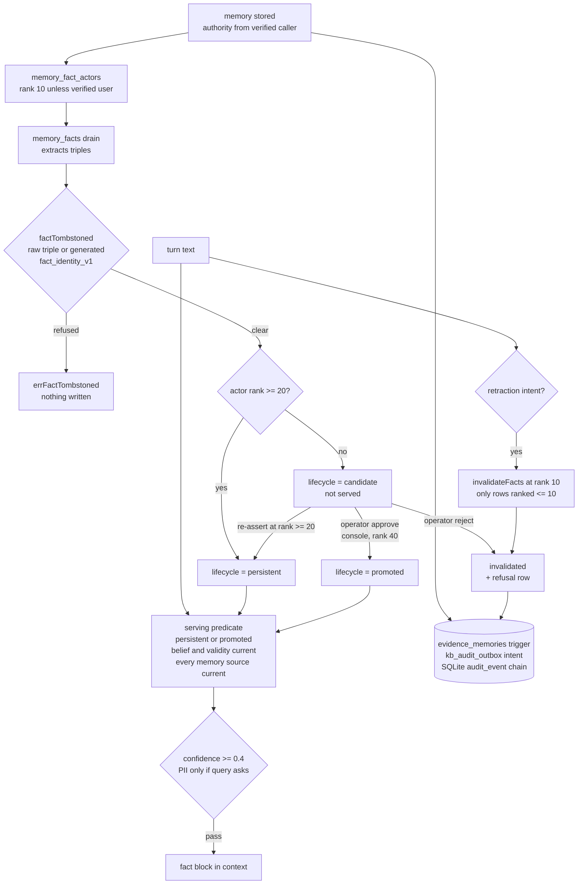

## 1. Executive Summary

aimee is a personal-assistant runtime whose C services host a Go memory module that makes every memory decision in both of its placements, over one Postgres schema. A model-authored typed fact waits as a `candidate` until an operator approves it on a console the agent's tool surface does not reach, and a refused value is a keyed row every Go writer consults before it writes. The weak points are the lift of a refusal, an `UPDATE` either runtime role can issue with no trigger to record it, scope on the session bundle's shared reads resting on row-level security alone, and a size that keeps the traced fraction small.

There are two memory shapes and one owner. The episodic store is a `memories` table with tiers, an epistemic kind, a provenance category, validity bounds and a lifecycle state. The **typed-fact layer** is a graph of `(source, relation, target)` edges in `entity_edges`, each with a confidence class, an authority rank, a lifecycle and two independent time axes. Both are written, read and corrected by `server-go/modules/memory`. The native C memory layer was retired in stages, ending with [`606c2efdf8045e75b1cd57c0f92225a2f7249c4e`](https://github.com/RakuenSoftware/aimee/commit/606c2efdf8045e75b1cd57c0f92225a2f7249c4e) on 27 September 2026, which routes both placements through Postgres.

**Native memory is a delivery channel, and only its source end is in this tree.** *Shared Native Memory: Expanding Knowledge Without Retraining* ([doi:10.5281/zenodo.23120104](https://doi.org/10.5281/zenodo.23120104), Jared Bailes, v2, 3 October 2026) reports that selected records reach a model as prepared key/value state rather than prompt text. The server side is one route, `POST /v1/native/primitive`, which re-projects the personal recall bundle as source rows with their revisions and refuses the shared store (`server_api.c:282-361`). The vLLM plugin that turns rows into tensors is in no public RakuenSoftware repository: `smoothnas-plugin-vllm` is a ROCm inference wrapper last pushed on 21 May 2026, and `smoothnas-plugin-aimee` holds deployment manifests only. [Section 8](#8-agent-integration) traces the route and [section 10](#10-tests-evals-and-benchmarks) the preprint.

All seven marks, each on the Go path:

- **tombstone** — `memory_rejection_tombstones`, consulted by the episodic insert, the correction path, the fact assert and the review approve, with a trigger under each table; the fact trigger compares the identity the owner does.
- **trust_state** — a shared serving predicate that admits only `active` memories and `persistent` or `promoted` facts.
- **bitemporal** — validity held apart from record time on memories, and world validity held apart from belief time on facts.
- **scope_enforced** — a scope disjunction in the per-turn context read, with row-level security under it.
- **audit_log** — a hash-chained SQLite store fed from a trigger on `memories` in the same transaction as the change.
- **human_review** — the candidate queue and its operator verb.
- **negative_eval** — a populated fact block asserting three named facts are withheld beside one that is served.

**`human_review` rests on the typed-fact lifecycle and an operator verb the agent cannot call.** An assertion below rank 20 lands `candidate` (`fact_mutation.go:258-263`), and the serving predicate admits only `persistent` and `promoted` (`fact_recall.go:64-68`). The `fact-review` operation approves, rejects or undoes, and refuses any invocation carrying a nonzero principal reference or lacking verified user authority (`data.go:1858-1873`). It is reached from the KB console route `/v1/console/typed_facts/assertion` (`kb_http_console.c:406-440`), which the console's typed-facts page posts to (`frontend/src/console/pages/TypedFacts.tsx:209`). The agent's MCP `mutate` tool maps `store`, `update`, `supersede`, `forget`, `affirm` and `reject`, and none of them approves (`server_mcp_memory_gate.c:10-29`).

The rank cannot be borrowed. Per-turn retraction invalidates at `modelFactActor()` because *"the query is model-composed, including when a verified user's session transports it"* (`fact_invalidation.go:100-102`), and a stored memory's facts are extracted at rank 10 unless the caller carries verified user authority and asks for it (`public_store.go:15-24`). `fact_review_test.go:25-52` drives the whole gate: a model candidate is quarantined, a review from a remote peer is refused, an unauthenticated one is refused, and the operator's approve returns `promoted`.

Three near misses bound the mark. A rank-20 `SYSTEM` assertion also promotes a candidate, so the floor excludes the model rather than every machine. `maintainFacts` would promote any Class B candidate whose supporting evidence rows reach a count, which a model repeating itself across memories could satisfy; nothing outside tests invokes it. And `kb_store_fact_actor_from_request(1, …)` grants operator rank to any authenticated KB principal that reaches the console route (`fact_mutation.c:172-189`), so the gate is the console credential rather than a person check.

The episodic side has a second queue. A model edit to user-stated content is refused with `errMutationReviewRequired` and written as a pending row in `memory_correction_proposals` (`mutations.go:381-385`, `correction_proposals.go:95-136`). Only a caller with verified user authority can approve it (`correction_proposals.go:160-163`), through the `memory.review_correction` RPC. The Memory Center's correction view calls it with the proposal's digest and exact target revision, and disables approval when the source revision has moved (`frontend/src/pages/Memory.tsx:126-196`).

What the report cannot claim is coverage. The trace covers the Go memory module's write, recall, correction and review paths, the schema's memory tables, the audit chain and the MCP surface. It does not cover the Go control plane, the Python tooling, the ingest workers, most of the schema, or the native-memory plugin, which is not published.

## 2. Mental Model

Two sentences from `docs/KNOWLEDGE.md` set the intent: *"Promotion to a broader audience needs an authorized write,"* and *"Confidence scores do not replace lifecycle or caller authority."*

The code carries the second as a rule about where authority comes from. `InsertEpistemic` states it at the top: *"Authority is derived by the authenticated caller and becomes durable provenance; it is never inferred from the memory text"* (`mutations.go:32-34`). A model write lands as `provenance_category='agent_message'` with a confidence ceiling of 0.8, a user write as `user_stated` at 1.0, and an `L5` tier caps either at 0.5 (`mutations.go:82-89`). The authority captured at store time travels with the memory to its extraction job in `memory_fact_actors` (`public_store.go:15-30`).

Four ranks order every fact actor: model 10, system 20, user 30, operator 40, each tied to one role string (`fact_mutation.go:50-65`). The class a fact receives follows from rank and from whether its relation type is known: Class A at 1.0 for rank 30 and above on a known relation, Class B at 0.6 for a known relation below it, Class C at 0.4 for a novel one (`fact_commit.go:116-123`). 0.4 is also the serving floor (`pii.go:16`).

The lifecycle then does three things with rank. Below rank 20 a new fact is a `candidate`. A candidate is promoted by a re-assertion at rank 20 or above that is not outranked by the incumbent. And an invalidated or superseded fact revives only when the re-asserting actor's rank is at least the rank recorded on the row (`fact_mutation.go:258-263`), so model extraction cannot revive a fact a user asserted.


```mermaid
flowchart TD
%% caption: authority decides whether a fact is served — a model-authored fact waits as a candidate that only an operator verb or a higher rank clears, every writer consults the value-keyed refusal first, and every memory mutation reaches the WORM chain in its own transaction
    STORE["memory stored<br/>authority from verified caller"] --> ACT["memory_fact_actors<br/>rank 10 unless verified user"]
    ACT --> DRAIN["memory_facts drain<br/>extracts triples"]
    DRAIN --> TOMB{"factTombstoned<br/>raw triple or generated<br/>fact_identity_v1"}
    TOMB -->|"refused"| STOP["errFactTombstoned<br/>nothing written"]
    TOMB -->|"clear"| RANK{"actor rank >= 20?"}
    RANK -->|"no"| CAND["lifecycle = candidate<br/>not served"]
    RANK -->|"yes"| PERS["lifecycle = persistent"]
    CAND -->|"operator approve<br/>console, rank 40"| PROM["lifecycle = promoted"]
    CAND -->|"operator reject"| INV["invalidated<br/>+ refusal row"]
    CAND -->|"re-assert at rank >= 20"| PERS

    TURN["turn text"] --> RETR{"retraction intent?"}
    RETR -->|"yes"| CAP["invalidateFacts at rank 10<br/>only rows ranked <= 10"]
    CAP --> INV
    TURN --> SERVE["serving predicate<br/>persistent or promoted<br/>belief and validity current<br/>every memory source current"]
    PERS --> SERVE
    PROM --> SERVE
    SERVE --> GATE{"confidence >= 0.4<br/>PII only if query asks"}
    GATE -->|"pass"| BLOCK["fact block in context"]

    STORE --> WORM[("evidence_memories trigger<br/>kb_audit_outbox intent<br/>SQLite audit_event chain")]
    INV --> WORM
```

The same authority rule governs episodic corrections. A correction is always a versioned successor: the old row becomes `superseded` with `valid_until` set to the boundary, and the new row starts `active` with `valid_from` at the same instant (`mutations.go:414-431`). A model correction to a row it did not author is not applied at all; it becomes a proposal (`mutations.go:381-385`).

## 3. Architecture

Three kinds of process have to run. `aimee-server` (C) holds one human's memory and the agent loop; `aimee-kb` (C) holds a team corpus, its membership graph and the operator console. Both call the Go memory module over the event bus, in the `server` or `kb` placement, and the module makes every memory decision (`server-go/modules/memory/process.go:91-112`). The one C path left writing typed-fact state is the console's commit rollback, through the C fact seam (`kb_http_console.c:517`, `src/modules/kb/c/fact_mutation.c`). A separately credentialed `aimee-kb-worm` worker drains the Postgres audit outbox into a SQLite chain.

Postgres is mandatory in both placements since [`606c2efdf8045e75b1cd57c0f92225a2f7249c4e`](https://github.com/RakuenSoftware/aimee/commit/606c2efdf8045e75b1cd57c0f92225a2f7249c4e) removed the DB2 namespace. The operator provisions a migrator role that owns the schema and a runtime role the module connects as; compose hands the module `aimee_store_runtime` through `AIMEE_STORE_URL` (`scripts/compose-vault-init.py:56`). pgvector carries the dense lane, and the embedder is optional: without one, dense recall records itself unavailable and the lexical lanes serve (`shared_recall.go:17-30`). The refusal identity calls `casefold` under the `pg_unicode_fast` collation, so the schema needs PostgreSQL 18 (`schema.sql:155-187`).

The KB schema file alone holds 263 `CREATE TABLE` statements, and the server placement adds its own families under `server-go/modules/aimee/families/`, including `user_memories` and its versions, proposals and erasure receipts. An operator standing this up runs two C services, the Go module, Postgres with pgvector, the WORM worker and, for the console, `control-web`.

## 4. Essential Implementation Paths

**Store.** `prepareKBStore` requires a transaction, refuses a missing scope, screens the key and content for credentials and PII, fixes provenance and ceiling from authority, and takes an advisory lock on the `(scope, kind, key)` identity (`mutations.go:53-127`). An existing active row with the same key turns the store into a correction. `applyKBStore` inserts only `WHERE NOT EXISTS` an active refusal for the same key, content and scope (`mutations.go:143-153`).

**Fact extraction.** `captureStoredFactActor` writes the store's authority into `memory_fact_actors` and enqueues a `memory_facts` job in the same commit (`public_store.go:13-37`). The drain parses candidates and hands each to `commitFactCandidate`, which gates the relation kind, screens both endpoints, canonicalizes them and assigns the class (`fact_commit.go:66-136`). `assertFact` then consults the refusals, locks the exact and functional incumbents, and writes the new state with a `fact_graph_changes` row and a sealed commit (`fact_mutation.go:186-396`).

**Per-turn retraction.** The `context-ingress` operation calls `retractContextQuery` before it assembles context (`data.go:3028-3038`). On a retraction intent with a possessive attribute, it calls `invalidateFacts` at model rank (`fact_invalidation.go:92-119`). That function invalidates only rows whose rank is at most the actor's, writes a refusal per row, and returns distinct reasons — `annotate_only`, `immutable`, `operator_required`, `unchanged` — rather than one success (`fact_invalidation.go:16-90`).

**Reject and restore.** `Reject` inserts the refusal and archives the row with `activation_suppressed=1` in one statement, and archives nothing if the refusal did not land (`domain.go:154-175`). `Restore` deactivates the refusal, records `restored_by`, and reactivates the row only when a refusal was lifted (`queries.go:241-259`). A refusal carrying a `rejected_by` can be lifted only by that actor, a rule the statement holds and the table does not ([section 7](#7-write-mechanics)).

## 5. Memory Data Model

The `memories` row holds, among its columns, `lifecycle_state` (default `active`, with no `CHECK` constraint), `activation_suppressed`, `archive_reason`, `valid_from` and `valid_until` beside `created_at` and `updated_at`, `epistemic_kind`, `provenance_category`, `confidence` and `confidence_ceiling`, `record_revision`, `owner_principal`, and `scope_type`/`scope_value` (`src/modules/kb/c/schema.sql:135-138`, `:689-697`, `:16067`, `:18026`). `confidence`, `evidence_strength`, `salience` and `surprise` are floats and are not the trust state; the state is the lifecycle column.

`memory_rejection_tombstones` is the negative half: `object_kind` over `('fact','memory')`, the fact triple and the episodic tuple in one row shape, `authority_rank`, `reason`, `rejected_by`, `active`, `rejected_at`, `restored_at`, `restored_by` (`schema.sql:144-154`). Two partial unique indexes, one per object kind and each restricted to `active=1`, make one live refusal per value a schema constraint (`schema.sql:195-200`). A stored generated column, `fact_identity_v1`, holds the folded triple under a non-unique partial index, so equivalent refusals keep their own attribution and a writer cannot supply the identity (`schema.sql:190-194`).

`entity_edges` carries each typed fact with `identity_key` and `identity_subject_key` — the NFKC-folded, case-folded, whitespace-collapsed triple and subject-relation pair joined on U+001F (`fact_identity.go:14-42`) — plus `asserted_at`, `superseded_at`, `invalidated_at`, `lifecycle_state`, `authority_rank` and `version`. `fact_evidence` carries one row per mention with a `stance`, and `fact_graph_commits` and `fact_graph_changes` record each transition with before and after states.

`memory_correction_proposals` holds a model's draft against a target revision, its payload digest, `state` and the reviewer fields (`schema.sql:18739-18762`).

**A fourth store holds decisions and schedules their re-examination.** `decision_log` carries `subject`, `options`, `chosen`, `rationale`, `outcome`, `author`, `linked_policy_id`, `supersedes_id`, a `status` defaulting to `active`, and a `revisit_when` (`schema.sql:580-585`, `schema_sqlite.sql:115`). Recording a decision on a subject marks the previous one `superseded` (`decision_log.c:108`), and `kb_store_decision_log_mark_revisit_due` sweeps due `active` rows into `revisit_due` (`decision_log.c:175-187`), called from the curator drain (`kb_curator_drain.c:824`). The governance console opens on `revisit_due`, closes a review by marking the decision superseded, and states on the page that due decisions are not added to model context (`frontend/src/console/pages/Governance.tsx:48`, `:118-126`, `:133`). No file under `server-go/modules/memory` reads `revisit_due`, so a due decision reaches the operator queue and not the model.

## 6. Retrieval Mechanics

Every current memory read shares one predicate. `currentMemorySQL` expands to `lifecycle_state='active' AND activation_suppressed=0`, the validity interval evaluated at the transaction clock, a utility-horizon check, and a currency check on every derived input (`eligibility.go:37-43`). Historical reads use a separate predicate that admits `superseded`, `archived` and `retired` versions for inspection and never rejected, revoked or quarantined ones, and it fails closed on unknown states (`eligibility.go:45-57`). The session recall bundle repeats the lifecycle test over a validity-filtered source, and its commitments section reads `pending` instead: `LifecyclePending` sets that state on an active row with a TTL, so it marks an open commitment rather than a belief awaiting review, and the stale-commitment alerts read it too (`retrieval.go:86-114`, `recall.go:272-273`, `domain.go:523-530`, `alerts.go:53-58`).

Four lanes feed recall. `Search` and `SearchVisible` run ILIKE and English full-text matching over key, content and use cases (`data.go:765-797`, `visibility_search.go:12-37`). `fuseSharedSemantic` runs dense recall over the active embedding version, joining only embeddings whose `input_hash` and `source_revision` match the current row, so a stale vector cannot nominate its parent (`shared_recall.go:14-16`, `:107-116`). Graph fusion walks from seeds with a per-level visit budget (`fusion.go:44-53`). Assertion search runs over typed facts with independent belief and validity instants (`assertion_search.go:176-194`).

**Scope is a predicate in the reads that feed a turn, with row-level security underneath.** `SearchVisible` admits global rows, the shared workspace, the requested project and the requested workspace, unless `include_all` (`visibility_search.go:23-25`); the per-turn `context-ingress` and `assemble-context` operations call it when no explicit scope is given (`data.go:3040-3060`). The dense lane and graph fusion repeat the same disjunction (`shared_recall.go:115-117`, `fusion.go:48-53`). Under all of them, the Go owner opens each request's transaction by writing the request's scope into `aimee.memory_scope_type`, `_value`, `_workspace`, `_project` and `_scope_all` with `set_config(…, true)` (`data.go:1410-1426`), which `p_memories_row_scope` reads (`schema.sql:206-223`).

One read drops the application predicate. The session recall bundle calls graph fusion with `IncludeAll: true` (`recall.go:241`), so that lane is bounded by row-level security alone, whose GUC carries the request's own `include_all`. The bundle's fetches for identity, preferences, active context and pending commitments also filter lifecycle in SQL and scope only by RLS, ordering rather than excluding by `queryScopeOrder` (`retrieval.go:86-113`, `queries.go:106-111`).

The typed-fact block has its own path. `recallFactBlock` selects edges for an entity under `currentFactRecallSQL` and passes each through `factRecallLine`, which drops a line below the 0.4 floor, a PII relation unless the turn asks for it, a secret relation always, and any line of 256 bytes or more (`fact_recall.go:64-119`). When recall is driven by a query, the Go owner classifies the query itself and ignores the caller's flag: *"a caller-supplied true flag cannot turn an unrelated query into permission to include PII"* (`fact_recall.go:196-199`).

## 7. Write Mechanics

Writes block the caller for one Postgres transaction, and the audit intent is part of it. A store is retrievable by lexical reads at commit. Its typed facts wait for the `memory_facts` job, and its dense lane for re-embedding. No background pass rewrites every row. The prune mode deletes all `L0` rows, stale `L1` rows and restricted rows past retention, and the model's maintenance tool cannot run it (`public_maintenance.go:140-166`); hygiene produces previews and proposals rather than mutations.

Admission refuses by epistemic kind before it considers content. An `episode` or `experience` memory is immutable and may only be annotated, an `instruction` or `policy` memory requires revocation rather than replacement, and a model may replace only content whose origin is `agent_message` (`mutations.go:254-265`). A model correction outside that rule becomes a proposal, deduplicated against terminal decisions so *"repeating a rejected draft cannot reopen it"* (`correction_proposals.go:93-136`). A model delete retires the row as `superseded` with `valid_until` set; only user authority hard-deletes, and it arms an erasure GUC in the same statement (`mutations.go:196-240`).

A model-authority write passes one more screen first. `screenModelMemory` folds each line with NFKC and refuses one that opens with an override phrase such as *ignore previous instructions* outside a code fence; quoted, blockquoted and fenced lines pass, and user authority is exempt (`content_gate.go:121-155`). The KB store, the KB correction, the personal store and supersede, and both rank-10 fact paths call it (`mutations.go:63-65`, `:325-332`, `personal_admission.go:67-71`, `fact_commit.go:78-82`, `fact_mutation.go:194-198`). The refusal is a typed error, `instruction_override`, not a quiet drop (`public_store_test.go:482-509`, `content_gate_test.go:64`).

**Correction is a table, and refusing to admit a value is its own record.** `memory_rejection_tombstones` holds one live row per refused value. The Go consults are:

- the episodic insert, `WHERE NOT EXISTS` an active refusal on key, content and scope (`mutations.go:143-153`);
- the correction apply, which retires nothing when the successor content is refused (`mutations.go:414-417`);
- `factTombstoned` at the head of every fact assert, the review approve and the maintenance promote (`fact_mutation.go:218-225`, `fact_review.go:73-76`, `fact_maintenance.go:68-75`).

**The fact consult and the database backstop compare one identity.** `memory_fact_rejection_identity_v1` folds each endpoint with NFKC, Unicode case folding and whitespace collapse, reduces the relation to the owner's 63-byte ASCII form, and returns an empty string at 1,024 bytes or more, which leaves the raw comparison (`schema.sql:155-187`). `factTombstoned` is one `EXISTS` query over the raw triple or the generated column (`fact_mutation.go:171-181`). `fact_rejection_tombstone_guard` on `entity_edges` runs the same disjunction for any writer, and also fires on a change of `edge_class` (`schema.sql:1951-1964`). `fact_mutation_test.go:154-160` refuses exact and full-width re-assertions through the owner. `:161-190` inserts exact, recased, full-width and whitespace variants directly, asserts the trigger refuses each, and checks the database identity against the Go one on six edge triples. The episodic refusal is exact on `memory_content` in the Go insert and in `memory_rejection_tombstone_guard` (`schema.sql:233-245`).

**Neither runtime role can delete a refusal, and either can lift one.** The `$memory_store_grants$` block grants `DELETE` across its table list to `aimee_store_runtime`, the role compose gives the Go module, then revokes `DELETE` and `TRUNCATE` on `memory_rejection_tombstones` from it and `PUBLIC` on every replay (`schema.sql:18920`, `:18951`). `schema_grants.sql:121-125` does the same for `aimee_kb_runtime`. `TestAuthenticatedRejectionPrivileges` logs in as `aimee_store_runtime`, which CI provisions, and asserts both statements are refused (`runtime_role_test.go:401-457`, `.github/workflows/ci.yml:923`).

Both roles keep `UPDATE`, because restore is an update. `Restore` holds the `rejected_by` rule inside its statement (`queries.go:241-259`), and the refusal table carries no trigger of its own and no `evidence_*` trigger. A direct `UPDATE … SET active=0` with any `restored_by` therefore lifts a refusal and writes no audit intent; the same test does that as the runtime role to check that the lift takes effect.

**Revival is gated on rank as well as on the refusal.** `assertFact` finds the exact triple by folded identity without a lifecycle filter, and revives an `invalidated` or `superseded` row only when `in.Actor.Rank >= exact.Rank` (`fact_mutation.go:226-262`). When a surviving incumbent on a functional relation outranks the actor, the new value lands as a quarantined candidate (`fact_mutation.go:311-319`).

## 8. Agent Integration

The agent's memory tools in `server_mcp_call_table.c:2149-2230` include `search_memory`, `memory_get`, `memory_recall`, `list_facts`, `memory_serve`, `memory_claim_card`, `memory_hygiene`, `memory_maintain`, `memory_provenance`, `memory_fact_history` and the multiplexed `mutate`. `mutate` resolves six verbs to RPC methods and checks the connection's capabilities for each (`server_mcp_call_table.c:88-105`, `server_mcp_memory_gate.c:10-29`); `tool_memory_mutate` copies nine named fields and never an `authority` (`server_mcp.c:367-448`).

Scope on an MCP call comes from `project`, `workspace` or a `cwd` resolved to a repository. A call with none of them queries `__aimee_scope_missing__` rather than clearing the scope (`server_mcp.c:296-305`), and `scope: "all"` is refused without `CAP_CROSS_SCOPE_READ` (`server_mcp.c:2151-2159`). An explicit `project` argument is taken as given, so the predicate bounds a call to the scope it names.

`facts.retract` is a public command that takes an `authority` string and resolves it to user rank only when the command context carries verified user authority (`public_facts.go:10-50`, `data.go:1717-1730`). The C host builds that context from verifier-owned state and passes user arguments separately (`src/kb/kb_service.c:739-770`). The CLI carries event-time reads as `aimee memory get <id> --as-of <timestamp>` (`src/cli_v1_routes_e.c:645-647`).

**Native delivery releases personal recall rows, not tensors.** `POST /v1/native/primitive` requires `CAP_MEMORY_READ`, forces `native_primitive` on the body and hands it to the recall handler (`server_http_routes.c:581-600`, `:1699`). The handler refuses any store but the personal one, skips working-profile observation, and calls the same `personal-recall` operation as the MCP `memory_recall` tool (`server_api.c:239`, `:268`, `:282-290`, `server_mcp_call_table.c:341`). It copies the `identity`, `preferences`, `active_context` and `open_commitments` rows, each with its `version`, into `{"schema":1,"records":[…]}`; a missing group or version returns 502 (`server_api.c:301-361`).

Those rows come from `user_memories` under the bundle's predicate: `active`, or `pending` for commitments, and unexpired (`retrieval.go:86-114`). A recall the integrity gate quarantines carries no groups, so it returns 502 rather than an empty release (`server_memory.c:662-667`). The KB, its typed facts and its scope never reach this route.

Each released row carries `owner_id`, `record_id` and `record_revision`, and a trigger on `user_memories` advances the revision on any material change (`version_contract.go:13-18`, `schema_personal_memory_changes.sql:24-42`). That is the key a cache needs to drop state for a corrected record, and a retired row simply leaves the next release. The preprint's rule that *"a new record revision invalidates obsolete derived state"* is left to the plugin; this tree supplies the revision. `docs/NATIVE_MEMORY_PLUGIN.md` describes that plugin as a wheel staged for a `native-memory-v0.2.3` release. On 3 October 2026 there is no such release, no PyPI package, and no RakuenSoftware repository holding the plugin; the one named for vLLM, `smoothnas-plugin-vllm`, is an appliance container wrapper last pushed on 21 May 2026.

This is not the inference-server cache the [families page](../../families/#not-in-scope-the-kv-cache) excludes. The prepared state derives from records that carry identity, revision and lifecycle, so losing it costs a re-preparation, and correcting the record changes what the next release holds.

## 9. Reliability, Safety, and Trust

The audit store is `src/modules/audit/audit_worm.c`, 1,117 lines. Each `row_hash` is an HMAC-SHA256 over a length-prefixed encoding of the record and the previous hash, a single-writer mutex keeps `seq` gap-free, and `ts` is excluded from the hashed material. Triggers block `UPDATE` and `DELETE`, and the file says which layer is the guarantee: the triggers *"are NOT the adversarial guarantee (a process with file write access can drop them) — that is the hash-chain"* (`audit_worm.c:34-37`).

**The Postgres side is a queue, not a second chain.** `kb_audit_worm_submit` writes an immutable intent to `kb_audit_outbox` and notifies; `kb_audit_worm_append` is a compatibility name for the same submit (`schema.sql:7538-7583`). The outbox and the delivery ledger carry `BEFORE UPDATE`, `BEFORE DELETE` and `BEFORE TRUNCATE` triggers raising `'WORM: % is append-only'` (`schema.sql:281-302`). `aimee_kb_runtime` is `REVOKE ALL` on both tables and re-granted `SELECT`, with `EXECUTE` on submit and pending only (`schema_grants.sql:97-109`). `aimee_store_runtime` holds `EXECUTE` on `memory_mutation_worm_append` (`schema.sql:18987-18989`), so it can add memory intents with any action string, and cannot remove one.

**Memory mutations reach that queue from a trigger.** `evidence_memories` fires `evidence_object_mutation` after every insert, update or delete on `memories`, and its `memories` arm calls `memory_mutation_worm_append` with a content-free detail: *"Same transaction as the row mutation: a WORM failure aborts the memory mutation"* (`schema.sql:16521-16538`). The intent names the `changeset_id` and the `evidence_event_id` of the detailed row, and `docs/WORM_WORKER.md:102-140` gives the join from intent to delivery receipt and to the evidence row, with a column saying whether that row survived erasure. The only `DELETE` or `TRUNCATE` on the outbox, the ledger or `audit_event` in the tree is in test scripts asserting the refusal.

**A poison gate runs at four boundaries, and memory writes are not one of them.** `integrity_ingress_decide` is called at six sites: `document` in PDF chunking and KB ingest, `recall` in the KB client and the server's recall reply, `learning`, and `retrieval` before injection (`kb_doc_pdf.c:1165`, `kb_ingest_workers.c:725`, `kb_client_memory.c:452`, `server_memory.c:662`, `learning_router.c:428`, `ingress_preinject.c:1140`). The Go write path runs `screenMemoryWrite` instead, which rejects a key carrying a credential pattern and redacts credentials and national identifiers from content (`content_gate.go:12-27`, `:39-81`, `:115-120`), and, for model authority, the bounded override screen in [section 7](#7-write-mechanics). An injection subtler than a line opening with an override phrase is checked when it is recalled, not when it is written.

**Row-level security covers the memory rows and binds only a non-owner.** `memories` and `memory_rejection_tombstones` take `ENABLE ROW LEVEL SECURITY` and one policy each over `memory_row_scope_visible(scope_type, scope_value)`, `USING` and `WITH CHECK` (`schema.sql:206-228`). The comment states the default: *"An unset request context sees only global rows; project/workspace rows fail closed."* The fact-refusal policy exempts `object_kind='fact'`, which has no scope tuple.

Two things temper it. Both tables take `ENABLE` without `FORCE`, so the owner is not bound; `kb_store_hardening_assert_runtime_role` checks ownership of the five membership tables only, and only when `AIMEE_KB_HARDENED` is set (`kb_store_hardening.c:11-106`). And `aimee.memory_scope_all` is written by the owner from the request's `include_all`, so the policy bounds a mis-scoped query rather than a compromised process.

On `aimee-kb`, the five membership and grant tables take `ENABLE` and `FORCE` (`schema.sql:2736-2745`). Content visibility over `kb_documents` and its children is an operator act: `kb_content_scope_enable()` refuses while any document, embedding or region is unattributed, and `kb_content_scope_disable()` is the way back (`schema.sql:3119-3294`).

## 10. Tests, Evals, and Benchmarks

`TestTypedFactRecallPolicyLivesInGo` is the negative case the mark rests on (`fact_recall_test.go:179-209`). Five facts are seeded, and a recall without sensitive access must return exactly `- role: engineer`; with sensitive access, exactly the role and the email. The password, the 0.2-confidence hobby and the 256-byte note are excluded in both. The positive and the negative are asserted over the same block, so a recall returning nothing fails. `TestQueryRecallOwnsSensitiveClassification` adds the case a flag-based gate gets wrong: a caller flag set to `true` on the query *"tell me about work"* withholds the email (`fact_recall_test.go:211-252`). Both run on a fake queryer, so they certify the Go gate and not the SQL predicate in front of it.

The Postgres-backed Go suites drive the lifecycle through the production owner under `SET LOCAL ROLE aimee_store_runtime`. `TestFactMutationRuntimeReplay` asserts a model commit lands `candidate`, a user re-assertion of the same triple lands `persistent`, a lower-rank competitor is quarantined, and exact and full-width re-assertions of a refused triple both return `errFactTombstoned` (`fact_mutation_test.go:35-160`). The same function then drives the trigger with four direct-insert spellings and compares the two identity implementations ([section 7](#7-write-mechanics)). `fact_review_test.go` covers the review verb, and `assertion_search_test.go:105-130` returns the superseded value for a February belief instant and the current one for April. They run inside `TestFactMutationRuntimeReplay` and `TestMemoryRuntimeRoleReplay`, which skip without `AIMEE_KB_STORE_REPLAY_URL` unless `AIMEE_MEMORY_REPLAY_REQUIRED=1` turns the skip into a failure (`runtime_role_test.go:70-76`). `TestAuthenticatedRejectionPrivileges` skips without `AIMEE_MEMORY_RUNTIME_URL`, and `TestMemoryAuditCorrelation` asserts that a canary insert yields one outbox intent joined to its evidence event and pending delivery (`runtime_role_test.go:401-488`). CI sets both URLs (`.github/workflows/ci.yml:922-923`).

`scripts/memory-governance-pg-test.sql`, run by `scripts/run-p1-rls-gate.sh`, runs as `aimee_kb_runtime` against Postgres. It asserts the RLS posture, the privilege shape on the refusal table, that project A sees its own and shared rows and not project B's, both trigger backstops, restore without a second copy, and at least five `memory.*` intents in the outbox. The Go store's own role is covered by the authenticated case above.

`docs/validation/flag-rollout-readiness.md` tracks every default-off flag against a six-point gate and sorts them into **WIRED** and **INERT TOGGLE**, publishing five inert toggles. A correction dated 29 September 2026 heads it: the reader file its lifecycle row names is absent, the two accessors have no production caller, and `currentMemorySQL` enforces lifecycle directly; the rest of the matrix is not requalified (`flag-rollout-readiness.md:14-23`). `docs/reviews/agent-memory-atlas-2026-09-29.md` records the PostgreSQL 18 replays the maintainers ran for the refusal identity, the role grants and the audit join.

One case covers the native route. `test_server_http.c:1186-1197` stubs the recall handler, asserts the route sets `native_primitive`, and refuses a non-object body. No case asserts that a retired or superseded personal row is absent from a release; that exclusion rests on the bundle's SQL.

**The preprint reports the native-memory results, and none of its artifacts is in this tree.** *Shared Native Memory* ([doi:10.5281/zenodo.23120104](https://doi.org/10.5281/zenodo.23120104), v2, 3 October 2026, CC BY 4.0), summarised on the [Rakuen blog](https://rakuensoftware.com/blog/native-memory-without-retraining) on 1 October 2026, reports a 47,065-response Gemma 4 12B campaign. Native and text delivery both answer 10,000/10,000 general and 625/625 personal questions, and 625/625 at every pressure size up to 64 records. At 64 general records text adds a median 4,580 prompt tokens and native none, and median time to first token is 2,565 ms against 156 ms, with native state prepared in host RAM beforehand and preparation timed separately.

It also reports that all 125 personal corrections changed the key and value tensor bytes at all 48 Gemma layers with weights fixed, that a 12B receiver rose from 165/480 to 276/480 on identical tasks with procedures validated from a 27B donor, and a vLLM plugin run on AMD and NVIDIA cards. Its stated limits are the ones that matter here. Records were explicitly addressed under research publication grants, not chosen by the harness's retrieval or production authorization. The implementation, encoding, reproduction drivers and runtime artifacts are withheld, with original observations in a private archive (Sections II and VI, Appendix A).

This repository holds none of the scripts, seeds, fixtures or result files those sections describe, and no paper, `CITATION.cff` or DOI. The companion `RakuenSoftware/rakuen-blog` repository maps each blog figure to the preprint and states that the article reports no new tests. No benchmark result was rerun for this reading.

## 11. For Your Own Build

### Steal

**Derive write authority from the verified caller and store it with the memory.** aimee does not take authority from text, and a request body's `authority` field counts only beside a verified user context; the host builds a command context from verifier-owned state, and the extraction job inherits the rank captured at store time. A model-composed retraction inside a user's session stays at model rank. That removes the class of bug where ambient identity promotes what the model wrote.

**Make model output a candidate, and put the approve verb where the model is not.** A candidate that no read serves, an operator verb that refuses remote invocations, and a tool registry that carries no approve is a review queue the producer cannot clear. The test that drives all three is shorter than the code.

**Put the refusal check in every writer, then repeat it in the database on one identity.** The consult in the owner is where the good error lives; the trigger is what holds for the next writer. aimee computes the folded identity once, in a versioned database function the owner calls and a generated column stores, so the two comparisons cannot drift and a writer cannot supply the key.

**Assert a negative beside a positive on the same output.** One extra assertion per case removes every exclusion test that passes because nothing came back.

**Release source rows with their revision, and leave the tensors to the consumer.** aimee's native route returns current records with `owner_id`, `record_id` and `record_revision`, selected by the predicate text recall uses, so a downstream cache has a key to invalidate on and no second selection policy to drift.

### Avoid

**Revoking delete and leaving the lift unwatched.** A refusal table whose rows cannot be deleted but can be deactivated by the same role, with no trigger recording the update, protects the record and not the refusal. Audit the `UPDATE` restore needs, or route it through a definer that writes the intent.

**A capability document that audits code by file name.** A readiness table naming a reader file goes stale the day the file is deleted; aimee's carries a dated correction above a row that names the absent file.

### Fit

This suits a team that wants correction and review to be structural and will run Postgres, two C services, a Go module and an audit worker to get it. The design assumes an operator who provisions separate migrator and runtime roles and attends a review console. A single developer wanting a memory library should walk away; the value is in the authority model and the refusal table, which transfer without the runtime. The native-memory work is a reason to watch the project rather than to adopt it: the server half is a re-projection of personal recall, and the half that prepares tensors is unpublished.

## 12. Open Questions

**Coverage.** This tree is over a million lines. The trace covers the Go memory module's write, recall, correction and review paths, the memory tables and triggers, the audit chain and the MCP surface. It does not cover the Go control plane, the Python tooling, the ingest workers, the server placement's `user_memories` families beyond their proposal gate and the recall bundle the native route reads, or most of the schema.

**What the plugin does with a record that leaves the release.** The route hands over current rows with revisions. Whether prepared banks for a record that was retired, deleted or superseded are dropped, rather than only re-prepared when a revision changes, is decided in a binary this reading could not inspect. The preprint's pilot reports deleted and withdrawn records answering *unknown* (Appendix B-A), under its research driver rather than this route.

**What the erased half of the audit join proves.** The evidence table is granted `DELETE` to the store runtime and reaped by `kb_document_retention_reap` and `kb_subject_erasure_begin` (`schema.sql:7675`, `:7867`). The WORM guide says the chain keeps the identifiers and cannot reconstruct the content; what an auditor may conclude from an intent whose evidence row is gone is not stated.

## Appendix: File Index

| Path | What it holds |
| --- | --- |
| `server-go/modules/memory/mutations.go` | The canonical episodic write, correction, delete and the authority admission rules |
| `server-go/modules/memory/correction_proposals.go` | The model-correction proposal queue and its user-authority review |
| `server-go/modules/memory/domain.go`, `queries.go` | `Reject`, `Restore`, `ReviewList`, `ProvenanceAdd`, `QueryRecords` |
| `server-go/modules/memory/fact_mutation.go`, `fact_commit.go`, `fact_identity.go` | Rank validation, `factTombstoned`, `assertFact`, class assignment, folded identity |
| `server-go/modules/memory/fact_invalidation.go` | `invalidateFacts` and per-turn `retractContextQuery` |
| `server-go/modules/memory/fact_review.go`, `fact_maintenance.go` | The operator review verb, and the promotion sweep no production path calls |
| `server-go/modules/memory/fact_recall.go`, `pii.go` | `ValidAt`, the fact serving predicate, the confidence and PII gate |
| `server-go/modules/memory/eligibility.go`, `assertion_search.go` | The shared current and historical predicates; belief and validity axes |
| `server-go/modules/memory/visibility_search.go`, `shared_recall.go`, `fusion.go`, `recall.go`, `retrieval.go` | The scoped lanes and the session recall bundle |
| `server-go/modules/memory/data.go`, `scope.go`, `runtime_command.go` | Transaction and GUC pinning, operation dispatch, scope normalization |
| `server-go/modules/memory/public_store.go`, `public_facts.go`, `content_gate.go` | Captured fact authority, `facts.retract`, write screening and the model override screen |
| `src/modules/kb/c/schema.sql`, `schema_grants.sql` | Memory tables, the refusal identity function, refusal triggers, RLS, outbox, audit triggers, grants |
| `src/modules/audit/audit_worm.c` | The hash-chained SQLite store, 1,117 lines |
| `src/modules/kb/c/fact_mutation.c` | The C fact seam, live for console rollback and actor resolution |
| `src/kb/http/kb_http_console.c`, `frontend/src/console/pages/TypedFacts.tsx` | The operator review routes and page |
| `src/server/server_mcp_call_table.c`, `server_mcp_memory_gate.c`, `server_mcp.c` | The agent's MCP memory tools, verb map and scope handling |
| `src/server/server_http_routes.c`, `server_api.c`, `server_memory.c` | The native primitive route, its projection of personal recall, and the recall integrity gate |
| `server-go/modules/memory/retrieval.go`, `version_contract.go`, `server-go/modules/aimee/families/schema_personal_memory_changes.sql` | The personal recall source and the record revision the native release carries |
| `docs/NATIVE_MEMORY_PLUGIN.md` | The plugin install guide; the plugin is not in the tree |
| `frontend/src/pages/Memory.tsx`, `frontend/src/console/pages/Governance.tsx` | The correction-review view and the due-decision queue |
| `server-go/modules/memory/fact_recall_test.go`, `fact_mutation_test.go`, `fact_review_test.go`, `assertion_search_test.go` | The negative case, lifecycle, refusal-identity, review and time-axis tests |
| `server-go/modules/memory/runtime_role_test.go`, `docs/WORM_WORKER.md` | The authenticated refusal-privilege and audit-join cases; the intent-to-chain query |
| `scripts/memory-governance-pg-test.sql` | The RLS, privilege, trigger and outbox gate, run as `aimee_kb_runtime` |
| `docs/validation/flag-rollout-readiness.md` | The six-point flip gate, the WIRED / INERT TOGGLE audit and its 29 September 2026 correction |

### Searches behind the absence claims

Run from the repository root at `d7cb791547e5f6354afecb53d82f768ba4f5e3e4`; each returned only what is described beside it.

```sh
# the agent's MCP memory surface: six mutate verbs, no approve, restore or review
sed -n '10,29p' src/server/server_mcp_memory_gate.c
sed -n '2149,2230p' src/server/server_mcp_call_table.c | grep -iE 'memory|fact|review|approve|restore'

# fact-maintenance: only its two dispatch cases outside tests; no production caller sends it
git grep -n -E '"fact-maintenance"|fact-maintenance' -- src server-go ':!*_test.go' ':!src/tests/*'

# auto_promote and promote_threshold: accessors, the console dashboard and config route, and two unused constants; no path promotes a candidate
git grep -n -i -E 'auto_promote|promote_threshold' -- server-go src ':!src/tests/*' ':!*_test.go'

# the C fact assert: one caller, a compatibility upsert that nothing outside its header calls
git grep -n 'kb_store_fact_mutation_assert\|kb_store_entity_edge_upsert_semantic' -- src ':!src/tests/*'

# no production delete of a refusal (empty output); both runtime roles lose DELETE and TRUNCATE on it
git grep -n 'DELETE FROM memory_rejection_tombstones' -- src server-go scripts ':!*_test.go' ':!src/tests/*'
grep -n 'REVOKE DELETE, TRUNCATE ON memory_rejection_tombstones' src/modules/kb/c/schema.sql src/modules/kb/c/schema_grants.sql

# no trigger on the refusal table: the two RLS policy lines only
git grep -n -i -E 'ON (public\.)?memory_rejection_tombstones( FOR|;|$)' -- src server-go scripts

# delete or truncate of the audit tables: test and probe scripts asserting refusal, nothing else
git grep -n -i -E 'DELETE FROM (public\.)?(audit_event|kb_audit_outbox|kb_audit_delivery)|TRUNCATE (TABLE )?(public\.)?(audit_event|kb_audit_outbox|kb_audit_delivery)' -- src server-go scripts

# poison gate: the definition and six call sites, none on the memory write path
git grep -n 'integrity_ingress_decide(' -- src server-go ':!src/tests/*' ':!*_test.go' | grep -v headers/

# the lifecycle flag pair has no reader outside its accessors; the named reader file is absent
git grep -n 'config_memory_lifecycle_enabled\|config_memory_lifecycle_hide_archived' -- src server-go ':!src/tests/*'
git ls-files | grep -c memory_core_helpers

# revisit_due: C decision-log, curator and governance files; no hit under server-go
git grep -n 'revisit_due' -- server-go src ':!src/tests/*' ':!*_test.go'

# lifecycle CHECK constraints: projects only, none on memories
grep -n -i "lifecycle_state.*CHECK" src/modules/kb/c/schema.sql

# RLS on memories and refusals is ENABLE without FORCE
grep -n -i 'ROW LEVEL SECURITY' src/modules/kb/c/schema.sql | grep -E 'memories|memory_rejection'

# the correction review RPC: one caller, the Memory Center's correction view
git grep -n -E 'review_correction|correction-review' -- frontend control-web ':!*.test.tsx'

# no paper, citation file or DOI (empty output)
git grep -n -i -E 'arxiv|@article|@misc|bibtex|CITATION\.cff|\bdoi\b' -- README.md MANUAL.md docs/KNOWLEDGE.md docs/NATIVE_MEMORY_PLUGIN.md

# native delivery: the route, its handler and the OpenAPI entry, nothing else; one test file
git grep -n -E 'native/primitive|native_primitive' -- src server-go api ':!src/tests/*'
git grep -n -l -E 'native_primitive|native/primitive' -- 'src/tests/*' '*_test.go' 'tests/*' 'scripts/*'

# the plugin and the preprint: named only in the install guide
git grep -n -i -E 'zenodo|Shared Native Memory|aimee_vllm|aimee-native (connect|serve)'
git ls-files | grep -i -E 'vllm|native.?mem'

# the preprint's seeds and record counts: one unrelated backup name
git grep -n -w -E '20260922|20260923|2026092412|2026092417|47,065|249,105'

# outside the tree, 3 October 2026: the plugin wheel's name in this repository only, no native release, no PyPI package
gh search code --owner RakuenSoftware aimee_vllm
gh api orgs/RakuenSoftware/repos --paginate --jq '.[] | .name + " " + .pushed_at' | grep -i -E 'vllm|native'
gh api repos/RakuenSoftware/aimee/releases --paginate --jq '.[].tag_name' | grep -c native
curl -s -o /dev/null -w '%{http_code}\n' https://pypi.org/pypi/aimee-vllm/json
```

## History

**2026-10-03** — [`d7cb791547e5f6354afecb53d82f768ba4f5e3e4`](https://github.com/RakuenSoftware/aimee/commit/d7cb791547e5f6354afecb53d82f768ba4f5e3e4) — 25 commits on `testing`, from PR #3000 (branch `fix/atlas-memory-boundaries`, with `docs/reviews/agent-memory-atlas-2026-09-29.md`) and PR #3001. The refusal trigger and the Go consult share a generated identity, and `aimee_store_runtime` loses `DELETE` on refusals under an authenticated CI test; the lift stays an unaudited `UPDATE` ([section 7](#7-write-mechanics)). Model-authored override lines are refused at write. PR #3001 adds `POST /v1/native/primitive`, the source end of the native-memory preprint; the plugin is unpublished ([section 8](#8-agent-integration), [section 10](#10-tests-evals-and-benchmarks)). All seven marks hold; the route refuses the KB, so `scope_enforced` is untouched. One claim was wrong at the previous pin, in the awarding direction: `pending` rows do enter a current read, as open commitments. Screened first: the previous pin's surfaces, cooldown hits inflated by a depth-1 clone. Nothing installed, built or run.

**2026-09-28** — [`6cd136947f205db9610eeab02b9f8255bbfc2a7e`](https://github.com/RakuenSoftware/aimee/commit/6cd136947f205db9610eeab02b9f8255bbfc2a7e) — 514 commits on `testing`. [`606c2efdf8045e75b1cd57c0f92225a2f7249c4e`](https://github.com/RakuenSoftware/aimee/commit/606c2efdf8045e75b1cd57c0f92225a2f7249c4e) retired the C memory layer the body described; every mark is re-read on the Go module and holds. The fact refusal consult compares folded identity, closing the raw-triple gap except in the trigger ([section 7](#7-write-mechanics)). Four published claims were wrong at the previous pin: memory writes had no poison gate, the lifecycle flag pair had no reader, the operator approve verb existed, and the refusal table's runtime-privilege check was a CI gate on `aimee_kb_runtime` while the Go store's role held `DELETE`. Screened first: one auto-run surface unchanged since the previous pin, one build-time execution point, three unpinned surfaces, none inside the cooldown. Nothing installed, built or run.

**2026-09-21** — same pin, re-read three times over `human_review`. **The mark
is awarded**, having been withheld at the previous two pins and defended twice
on reasoning that is now withdrawn.

Three grounds are gone. *"Nothing distinguishes the caller that rejects from the
caller that wrote"* rested on a flags field that is `0` for every entry in its
block under a comment reading *"caps derived from the op"*. The replacement,
which argued the distinction through the MCP surface, was answering a question
the mark does not ask — human review is not MCP and was never meant to be. And
the third, *"the producer clears its own queue"*, was simply false:
`FACT_ACTOR_MODEL` is 10 and the promotion floor `FACT_ACTOR_SYSTEM` is 20
(`fact_mutation.h:26-31`), so the model cannot promote its own candidate.

What earns it is the typed-fact lifecycle, described in section 1: a
model-authored assertion lands `CANDIDATE` (`fact_mutation.c:763`), no recall
returns it (`fact_recall.go:69`, `:142`, and eleven C reads restrict to
`persistent`/`promoted`), the model cannot raise it, and its authority cannot be
borrowed from whoever happens to be authenticated during the turn
(`fact_ingest.c:190-197`). `test_fact_lifecycle.c:178-188` pins both halves.

Recorded because it bounds the mark rather than decorating it: promotion is
implicit — re-assertion at higher authority, not an approve verb — and rank 20
is `SYSTEM`, so an internal source can also clear a candidate. The floor
excludes the model, not every machine.

**2026-09-19** — re-pinned to [`bedabac667c5c00f9f14fe6f47efd3b369a46922`](https://github.com/RakuenSoftware/aimee/commit/bedabac667c5c00f9f14fe6f47efd3b369a46922). `human_review` is **withdrawn**, on two grounds that compound. `memory.reject` acts on a row that is already active — it sets `lifecycle_state='archived'` and `activation_suppressed=1` (`server-go/modules/memory/domain.go:159`) — so it corrects rather than admits, and the mark asks for a memory that waits before it can be believed. And `memory.review_list`, `memory.reject` and `memory.restore` sit in the same route table as `memory.search` and `memory.delete`, dispatched through `rh_dispatch_op` with identical flags (`src/server/server_http_routes.c:1686-1688`), so nothing in the routing distinguishes the caller that rejects from the caller that wrote. The queue, the tombstone it writes and the restore that records who restored are all real and keep their credit under `tombstone` and `audit_log` — which is where the strength of this design actually lives. The other six marks stand. Screened again first; nothing was installed and no suite was run.

**2026-09-16** — [`4831f5bd034f7aa3142b4dc0e5857923a3121550`](https://github.com/RakuenSoftware/aimee/commit/4831f5bd034f7aa3142b4dc0e5857923a3121550) — re-read at a commit dated 9 September 2026, 61 commits past the previous pin. All seven marks re-tested and held. The change worth checking was a new read path: `server-go/modules/memory/visibility_search.go` adds `SearchVisible`, and a new read is where a scope predicate usually goes missing. It does not. The query carries `lifecycle_state='active'` and a scope disjunction over global, project and workspace, and although an `IncludeAll` flag short-circuits that disjunction, it widens only within the row-level security policy on `memories` — `p_memories_row_scope` gates on `memory_row_scope_visible(scope_type, scope_value)`, which reads `current_setting('aimee.memory_project')` and its workspace twin rather than anything the caller passes. The function refuses outright when placement is not KB. `lifecycle_state='active'` appears at forty non-test sites across six files in the module. Screened before reading: fifteen files scanned, one auto-run surface, one build-time execution point, three unpinned dependency surfaces and none inside the seven-day cooldown. Nothing was installed, built or run.

**2026-09-07** — [`6083b85e4664f06abd5275ee5e893388734a6181`](https://github.com/RakuenSoftware/aimee/commit/6083b85e4664f06abd5275ee5e893388734a6181) — re-pinned 79 commits on, still on `testing`, and the memory module moved languages: `server-go/modules/memory/` (9,989 lines, 80 tests, 178 across the Go tree) holds the store, the recall pipeline, the lifecycle filter, the tombstone check, review and restore, `ValidAt`, scope normalization and placements, while 68 C files under `src/modules/memory/` and `src/modules/db2/c/` were deleted, among them `memory_query.c`, `memory_score_fields.c`, `memory_core_search_*.c` and `memory_core_crud.c`; `fact_recall.c` remains as the ABI to a registered provider and `test_fact_recall.c` is reduced to that ABI, so the paired exclusion cases this report cited are gone and `negative_eval` rests on `fact_recall_test.go:69-100`. Every evidence record is re-pointed and the body's three passages that named deleted files are rewritten; the schema, its row-level security, the rejection-tombstone trigger, the WORM audit store and its triggers, `fact_mutation.c` and `fact_lifecycle.c` are unchanged. Seven marks stand. Screened before reading: one auto-run surface (`.claude/hooks/`), one manifest inside the seven-day cooldown, nothing installed or run.

**2026-09-01** — [`cccb1490560810a3da92691f381f9ab59040bb7c`](https://github.com/RakuenSoftware/aimee/commit/cccb1490560810a3da92691f381f9ab59040bb7c) — re-pinned 15 commits on, and the memory mechanism did not move: the range touches five CI workflows, two release scripts, `cli_attention_guard.c`, `hook_session_token.c`, `windows/platform_ipc.c` and one test, and no file the marks rest on. Seven marks, unchanged. The reading did find a store the previous ones missed entirely — `decision_log`, described in section 5, which supersedes one decision per subject and sweeps `active` into `revisit_due` when a date the author set arrives. Its test carried a **date bomb that detonated on the day of this reading**: `test_record_is_active` recorded a fixture with `revisit_when` of `2026-09-01` while `test_revisit_sweep` asserts `flipped == 1` over the whole table, so once that date was reached the sweep flipped two rows and the count assertion failed; `771baba9` moved the fixture to `2999-01-01`, the idiom the sweep test already used for its not-yet-due row. The transition itself stays covered — `test_revisit_sweep` asserts the due row flips, the future and no-revisit rows do not, and a second sweep flips nothing. Screened again before reading: unchanged in kind — one auto-run surface, one build-time execution surface, three unpinned surfaces, five files inside the seven-day cooldown. Nothing was installed and nothing was built.

**2026-09-01** — [`a75892e0ba335e23e1f54e85aa53795dae4abc47`](https://github.com/RakuenSoftware/aimee/commit/a75892e0ba335e23e1f54e85aa53795dae4abc47) — re-pinned 230 commits on, still on `testing`, 321 files and roughly 13,000 added lines against 3,200 removed. Screened before reading: one auto-run surface (`.claude/hooks/`, four files, byte-identical to the previous pin and registered by no `settings.json`), one build-time execution surface (`src/Makefile`), three unpinned surfaces and five files inside the seven-day cooldown — one more than last time, because the four Go module files and the frontend lockfile all moved four days ago. No new `RUNS` finding. Nothing was installed, nothing was built and nothing was run. All seven marks re-verified and none moved; every file the marks rest on is byte-identical at this pin except for the line shifts recorded below.

**`main` has caught up with `testing`.** It was 2,719 commits behind at the 26 August pin and is three behind here, having merged `testing` in PR #2937 on 31 August. `origin/HEAD` still designates `testing`, and the pin is on it.

One published claim was wrong in the withholding direction and is corrected: the `bitemporal` evidence record said the mechanism was *"not directly tested at this pin"*, and `src/tests/test_integration.sh` has driven `memory.get` over the real wire with and without `as_of` since before the previous pin, asserting that the event-time verdict comes back for the first request and is absent from the second. The test's own comment says why it is an integration case rather than a unit one — the flag was once *"marshalled, sent, and dropped"* between client, `aimee-server` and `aimee-kb` while every unit test at each end passed against a hand-written payload that already contained the field. Separately, section 7's `reactivate` block was fenced as C but was a paraphrase; it now carries the `strcmp` form the tree actually holds.

The lexical lane changed shape and is described in section 6. `db2_memory_find_facts_fts` joins `memories_fts` through `rowid` and is tried first, with the former unconditional `LOWER(...) LIKE '%…%'` table scan kept only as a fallback when the indexed query returns nothing; both statements carry `DB2_MEMORY_RECALL_FILTER_SQL` and `DB2_MEMORY_SCOPE_RANK_SQL`, so the lifecycle exclusion and the scope rank travel with the lane. Both sub-query decomposition stages now collect each fragment into a private buffer and merge with `memory_candidates_merge_interleaved` instead of appending whole lists into the shared pool, and `memory_filter_scope` still runs after the merge on everything. Per-lane candidate and served counters were added and the comment states they are measurement rather than control.

Section 7 gains a fourth silent failure, this one on the store rather than on retraction: `memory_insert_epistemic_ex` copied content through a fixed `char safe_content[2048]`, and the exact-key merge path through `preserved_content[2048]`, so long values were clipped with success returned and the sensitivity label was computed from the first 2047 bytes. Both buffers are sized to the content and `test_long_content_survives_store_and_merge` asserts the stored length at 2047, 2048, 4096 and 40,000 bytes on both paths. The read side keeps the cap in `memory_t.content`; `db2_kb_service_memory_get_json` escapes it for read-by-id through a second scope-filtered statement.

Six line citations moved with the diff and are re-verified: `memory_score_fields.c:626-655,:679`, `memory_core_crud.c:340`, `memory_core_search_b.c:1142-1171`, `memory_core_search_c.c:1003-1040`, `memory_query.c:1816-1867,:1923-1936` and `test_memory_advanced.c:687-699`. The schema range for the `FORCE ROW LEVEL SECURITY` block is tightened to `:2660-2672`. Counts re-run at this pin and unchanged: `audit_worm.c` 949 lines, `test_fact_recall.c` 210, `test_content_scope_pg.c` 971, 244 `CREATE TABLE` statements, ten `evidence_*` triggers, eight reachable `integrity_ingress_decide` call sites, five inert toggles. Counts that moved: roughly 819,000 lines of C, 89,000 of headers, 149,000 of Go and 113,000 of Python, across 7,831 commits. `memory_rejection_tombstones` still carries no `identity_key`, so the open question in section 12 stands. No paper, no `CITATION.cff`; still AGPL-3.0.

**2026-08-31** — [`eb86dda7f94b7dc3f2ecaf7c981dee6d43eae3e8`](https://github.com/RakuenSoftware/aimee/commit/eb86dda7f94b7dc3f2ecaf7c981dee6d43eae3e8) — same pin, re-read to settle a report that disagreed with itself. The 2026-08-26 entry below promoted `tombstone` and `human_review` to seven of seven and the frontmatter carried the promotion; the body did not. Section 1 opened *"Five marks"*, section 12 argued the `tombstone` mark was withheld because *"the consultation that would make a refusal durable was not found"*, and the `matrix.risks` field — which the compare page publishes verbatim — led with *"Nothing consults the invalidated set before a later extraction re-asserts the same triple."* All three are wrong at this pin and in the same direction: `fm_tombstone_blocks` runs at the head of `db2_fact_mutation_assert` and again on the review-approve arm, `db2_memory_rejection_blocks` is the episodic consult, and two database triggers repeat the test underneath both. All three are corrected; the risks field names the real remaining gap, which is that the refusal is keyed on the raw triple while `entity_edges` is keyed on a normalized `identity_key`.

Two quotations attributed to the tree were not in it and are removed. *"preserved for review"* was cited for `human_review`; the mechanism is real — `db2_memory_reject` writes the tombstone and sets `lifecycle_state='rejected'` with `confidence=0` while keeping the row — and the record now quotes text that exists, `scripts/memory-governance-pg-test.sql`'s *"Rejecting preserves the row for review and installs a value-keyed refusal."* *"validated: REVOKE UPDATE/DELETE blocks mutation."* was cited for `audit_log` as the Postgres provisioning; the nearest real text is `docs/proposals/done/auditable-worm-audit-store.md:159`, a design note rather than shipped provisioning, and the shipped grants take a stricter route the report now states — runtime holds `SELECT` on the queue tables and `EXECUTE` on the submit definer, and never `kb_audit_worm_append`. The mark stands and does not rest on that clause: memory mutations reach the chain through `memory_mutation_worm_append`, called from the `evidence_memories` trigger in the same transaction as the row change, which also retires the open question in section 12 that said no path from a memory RPC to the WORM store had been traced.

Six factual corrections beside those. `audit_worm.c` is 949 lines, not 710, in three places. The archived drop before rerank records `withheld_state`, not `lifecycle_archived`, in the diagram and the evidence record. That drop, and the `lifecycle_state='active'` predicate in `DB2_MEMORY_RECALL_FILTER_SQL` above it, are not behind the `memory_lifecycle_enabled` / `_hide_archived` pair — the header says *"Lifecycle visibility is not feature-gated"* and the flags gate `memory_list` instead, so section 6, the diagram and the risks field were describing a gate that is not on that path. `integrity_ingress_decide` has eight reachable call sites, not nine. The schema holds 244 `CREATE TABLE` statements, the `memories` row 45 stored columns rather than thirty, `test_content_scope_pg.c` 971 lines rather than 917, and the `evidence_*` triggers cover ten tables rather than nine. Section 9's claim that no `CREATE POLICY` names a memory table was false: `p_memories_row_scope` and `p_memory_rejections_row_scope` both exist, `USING` and `WITH CHECK`, though under `ENABLE` without `FORCE`. The `fact_authority_from_provenance` block is quoted whole rather than eliding four asserts silently, and several line cites moved.

**2026-08-29** — [`eb86dda7f94b7dc3f2ecaf7c981dee6d43eae3e8`](https://github.com/RakuenSoftware/aimee/commit/eb86dda7f94b7dc3f2ecaf7c981dee6d43eae3e8) — re-pinned 42 commits on, still on `testing`, 416 files and roughly 76,500 added lines in two days — most of it release blockers, Windows and macOS build work, CI ratchets and a static-analysis baseline. All seven marks re-verified and none moved.

One change reaches the memory path and it is described in section 9: the deterministic poison gate declared in `src/headers/integrity.h` is now called from `memory_core_crud.c` at two sites and from `memory_advanced.c` at a third, joining `document`, `retrieval`, `learning` and `recall` for eight reachable call sites. The comment at the memory site states the reasoning — durable memory becomes future prompt context, so it is treated as agent-message authority and ambiguous provenance fails closed — and the authority-aware site picks `USER_STATED` over `AGENT_MESSAGE` from the memory's own authority, which is the difference between quarantining a user's odd sentence and rejecting an agent's. Retention also moved from inline `DELETE` statements to the server-side `kb_memory_retention_reap` and `kb_memory_sensitivity_retention_reap` functions, each returning a reaped count.

Screened before reading: one auto-run surface (`.claude/hooks/`), one build-time execution surface, three unpinned surfaces and five files inside the seven-day cooldown; nothing was installed and nothing was run.

**2026-08-27** — [`bdf19051cd0541f1e9f3e008a570998c37f77774`](https://github.com/RakuenSoftware/aimee/commit/bdf19051cd0541f1e9f3e008a570998c37f77774) — re-pinned 47 commits on, still on `testing`. Screened again: one auto-run surface, one build-time execution surface, three unpinned surfaces, two files inside the seven-day cooldown; nothing was installed or built. No mark moved.

The change worth recording is a whole class of silent failure closed at once. Removing an `AIMEE_DB2_DISABLED` fork left sixteen memory files that reach the relational store and *"say nothing when it is gone"* — and the fork had been the reporting mechanism: *"the disabled branch returned 'memory storage unavailable', so deleting it removed the only signal. Empty then becomes indistinguishable from a genuine absence — a search that finds nothing, an entity with no edges, a key with no history all look identical to an outage."*

Two details in the repair are the transferable part. The probe *"sits on read paths where empty is genuinely ambiguous, not on write paths where 0 frequently means success and an early return would report a failed write as a clean one"* — the fix is applied where the ambiguity is, rather than uniformly. And the sentinel is chosen per function against that function's own vocabulary: `0` for the count-returning searches, `NULL` for context assembly, a plain return for the void refreshes, and `-1` for lifecycle counts, the maintenance run and the profile-card build, which already use `-1` for failure and *"must not report a store outage as a clean maintenance pass or an entity with no observations."*

Also in range: every content-carrying KB write is screened, server state moved to Postgres with the SQLite WORM store isolated, and candidate ranking collapsed from one statement per candidate to one statement.

**2026-08-26** — [`6a1b61a99c9cac5273ccf6c26d2a6a185a6985bd`](https://github.com/RakuenSoftware/aimee/commit/6a1b61a99c9cac5273ccf6c26d2a6a185a6985bd) — re-pinned 231 commits on. **The branch needs stating, because its name misleads.** `origin/HEAD` points at `testing`: it is the repository's default branch and its trunk. `main` sits 2,719 commits behind it and was last touched on 3 August 2026. The previous pin was already an ancestor of `testing`, so this is an ordinary re-pin on the same line of development rather than a move to an experimental branch. Screened again before reading: one auto-run surface — a `.claude/hooks/` directory that did not exist at the previous pin — one build-time execution surface, three unpinned surfaces and two files inside the seven-day cooldown; nothing was installed and nothing was built.

Two marks added, to seven of seven. Several other systems already carried all seven — [memsem](../memsem/), [Perseus Vault](../perseus-vault/), [Plur1bus](../plur1bus/), [Provem](../provem/) and [Verel](../verel/) — so this is the sixth, and the first note written about it here claimed otherwise before the count was run.

**`tombstone` was earnable at the previous pin and was missed.** `fm_load_exact` looks up an incoming triple with no lifecycle predicate, so a re-assertion finds the invalidated row; `reactivate` then requires `actor->rank >= exact.authority_rank`, so a model-authority extractor cannot raise what a user-authority actor invalidated, and a refused revival lands as a quarantined candidate. That code is present at `958af1c5`. The previous reading searched the offline extraction drain for something that consults an invalidated set, found nothing there, and concluded the property was absent — while the consultation sits in the mutation seam every assert passes, expressed as a lookup that declines to filter. It is the third time a reading of this system has looked in the place named for a mechanism instead of the chokepoint, after the scope filter and the evidence ledger, and the project's own proposal states the property plainly: *"the exact-match lookup deliberately does not filter by lifecycle, so a re-assertion finds the dead row, and revival is gated on actor authority rank."*

What is genuinely new is the generalisation. `memory_rejection_tombstones` extends the property to episodic rows, keys each object kind on its own value tuple under a partial unique index on `active=1`, is consulted by `fm_tombstone_blocks` before an assert, and carries `reason`, `rejected_by`, `restored_at` and `restored_by`. A shipped Postgres check refuses to start when the runtime role can `DELETE` or `TRUNCATE` it. Section 8 covers it.

**`human_review`** rests on the same surface read as a review queue: `kb_handle_memory_reject` records a reason against a memory the extractor produced and preserves the row for review rather than deleting it; `idx_memory_rejection_review` orders `(active, object_kind, rejected_at DESC)`; and `kb_handle_memory_restore` refuses unless `db2_fact_actor_from_request` returns an authenticated actor, recording `restored_by`. The verdict is durable and gates what the write path admits next.

Also in range and not mark-bearing: the external vector database subsystem was removed outright, memory vector search routes through DB3, whose wire encoder refuses a relation label longer than `relTypeMax` rather than truncating it — *"a length past the bound is a malformed request, not a long fact"* (`server-go/modules/memory/memory.go:169`) — memory row scope is enforced outside RLS, and the WORM chain writer moved to a sidecar. One correction to the record above rather than to the code: the project's own `correction-completeness-and-bounded-reachability.md` opens its §1.2 with *"No negative retrieval assertion — the substrate has suppression, invalidation, quarantine, erasure, scope filtering and lifecycle-filtered views. Nothing asserts that any of it survives contact with the read path."* The `negative_eval` mark here rests on `test_fact_recall.c`, whose paired cases assert a below-floor and a PII-gated row are absent from the rendered block; that is a real read-path assertion and narrower than the coverage the proposal says is missing. Both statements are true and the proposal's is the more demanding one.

**2026-08-25 (same-day correction)** — two errors in the reading above were found and fixed while checking a second source against the same pin. The report had described `DB2_MEMORY_SCOPE_RANK_SQL` as the SQL-side scope mechanism and concluded it "excludes nothing"; that is true of the rank macro and wrong about the system, because `DB2_MEMORY_SCOPE_FILTER_SQL` wraps the same expression as a `WHERE` predicate and both are applied together in `memory_briefing.c`, `memory_relations.c` and `pgvec_transport.c`. Scope on memory rows is a filter, not only an ordering. The report also carried an open question asking whether memory mutations are audited at all, framed around the WORM `audit_event` store; they are, through a different ledger — `memory_evidence_events`, written by `AFTER INSERT OR UPDATE OR DELETE` triggers on nine tables including `memories`. Section 6, section 12 and the `scoping` row are corrected. The marks are unchanged.

**2026-08-25** — [`958af1c59f2db825d348d19209fb339615ed9ae5`](https://github.com/RakuenSoftware/aimee/commit/958af1c59f2db825d348d19209fb339615ed9ae5) — first reading, roughly 796,000 lines of C and 87,000 of headers plus 142,000 of Go and 109,000 of Python, 7,281 commits since 3 June 2026, AGPL-3.0. Screened before anything was read: one auto-run surface, one build-time execution, three unpinned surfaces and two files inside the seven-day cooldown; nothing was installed, nothing was compiled and no service was started, so every claim here comes from reading the tree. Five marks. `trust_state` rests on two discrete vocabularies held apart from the confidence floats beside them, with the typed-fact exclusion applied by every recall query behind no flag. `bitemporal` rests on `valid_from`/`valid_until` held separately from `created_at`/`updated_at` and read by `db2_memory_valid_at`, reachable as `--as-of`. `scope_enforced` rests on `memory_filter_scope` dropping candidates before rerank, with row-level security forced on the membership tables beside it. `audit_log` rests on the hash-chained WORM store and the per-memory `memory_provenance` rows; the path from a memory RPC to `audit_worm_append` was not traced, and section 12 says so. `negative_eval` rests on four exclusion cases in `test_fact_recall.c`, each paired with a positive over the same buffer. `tombstone` is withheld on one missing consultation: retraction retains the row and keys on the triple, which is the right key, but nothing in the offline extraction drain reads the invalidated set before asserting. `human_review` is absent — the `pending` state expires on a TTL sweep rather than a decision, and `memory_conflicts.resolution` is closed by the agent under a directive. This is the largest checkout in the corpus; the reading covers the typed-fact layer, the episodic recall path, the audit store and the scope plumbing, and not the Go control plane, the Python tooling, the ingest workers, or most of the 243 tables in the schema.
