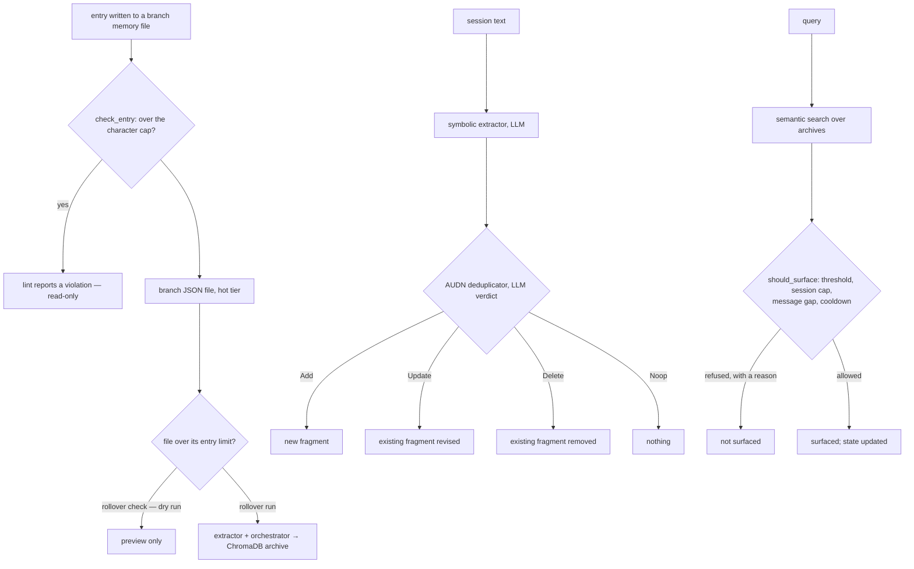

## 1. Executive Summary

AIPass is a "Persistent Agent Workspace" — a large Python monorepo (roughly
377,000 lines, MIT) whose memory module is one of nineteen subsystems, alongside
mail, flow, spawn, drone, daemon, hooks and skills. The memory module itself is
about 38,500 lines.

**The mechanism worth the report is that recall is budgeted, not just ranked.**

`memory/apps/handlers/governance/engine.py` is a "Surfacing Governance Engine —
pure decision functions for controlling when recalled items should be
surfaced", and its default configuration is five numbers:

```python
{
    "enabled": True,
    "threshold": 0.3,
    "max_surfaces_per_session": 5,
    "min_messages_between": 10,
    "cooldown_seconds": 300,
}
```

`should_surface(item_id, relevance_score, state, config)` returns a tuple of
`(bool, reason, new_state)` and is documented as a "Pure function — does not
mutate the input state dict." The state it carries is
`surfaces_count`, `messages_since_last`, `last_surface_time` and `surfaced_ids`.

So a memory can clear the relevance threshold and still be refused — because
five have already surfaced this session, because fewer than ten messages have
passed, or because 300 seconds have not elapsed. **Relevance is necessary and
not sufficient.**

Almost every system in this atlas treats "should this be injected" as a ranking
question with a cutoff. This one treats it as a *rate* question with state, and
returns the reason. [Token Savior](../token-savior/) reaches the same territory
by learning a bandit; AIPass gets most of the way there with four counters and no
model.

**The second mechanism is a declared entry limit with a linter.** Memory files
are JSON per branch, entries are capped per type by a config with per-branch
overrides "deep-merged over the default entry_types", and `check_entry()` is "a
pure validator that checks whether a single entry text exceeds its character
cap". `drone @memory lint` audits violations **read-only**, and
`drone @memory rollover check` is a dry run.

A memory store that publishes a size contract, ships a read-only auditor for it,
and makes the destructive counterpart a separate command with a dry-run mode is
treating growth as a governed property rather than an emergent one.

## 2. Mental Model

Memory is per-**branch** — AIPass's unit of workspace — and two-tiered. The hot
tier is JSON files the agent reads directly, kept small by entry limits. The
archive is ChromaDB, holding what rolled over, searchable semantically across
branches.

A third layer sits beside them: **symbolic fragments**, LLM-extracted pieces
stored and deduplicated separately, with a bootstrap path that populates them
from session JSONLs.



The `Delete` branch of the AUDN verdict is the one to watch: an LLM comparing a
new fragment against similar existing ones may decide the correct action is to
remove the old one.

## 3. Architecture

Nineteen top-level subsystems under `src/aipass/`, of which `memory` is one.
Within it: seven modules (governance, lint, rollover, search, symbolic,
templates, verify) over fifteen handler groups (archive, governance, intake,
json, learnings, monitor, rollover, schema, search, storage, symbolic,
templates, tracking and more).

Storage is `handlers/storage/chroma.py` plus `chroma_subprocess.py` — running
ChromaDB out of process, which is a defensive choice worth naming: an embedded
vector store that segfaults or leaks takes the agent down with it unless it is
isolated.

Templates are pushed across branches (`templates/pusher.py`, `differ.py`,
`spawn_pusher.py`) with a `template-status` command reporting version and push
state, so every branch's memory scaffolding stays in step.

The operational surface is a `drone @memory <command>` CLI, a rollover watcher
daemon and hooks.

## 4. Essential Implementation Paths

**Write** — an entry lands in a branch JSON file;
`handlers/json/entry_limits.check_entry()` validates against the effective cap.

**Audit** — `modules/lint.py` and `handlers/json/lint_handler.py`, read-only.

**Rollover** — `handlers/rollover/extractor.py` and `orchestrator.py`, with
`monitor/detector.py` and `memory_watcher.py` driving the watch mode.

**Symbolic** — `handlers/symbolic/`: `extractor`, `deduplicator` (AUDN),
`storage`, `retriever`, `chroma_client`, `hook`.

**Surface** — `handlers/governance/engine.should_surface`, re-exported through
`modules/governance.py` "for cross-branch consumers".

## 5. Memory Data Model

The hot tier is JSON with a schema normaliser (`handlers/schema/normalize.py`)
and a config-driven limit per entry type. That is unusual and it is the point:
the *shape* of what may be remembered is configuration, per branch, and
violations are reportable.

`changed_entries()` is "a pure diff helper that compares before/after file dicts
and returns only NEW or CHANGED entries" — so downstream work (vectorising,
archiving) processes deltas rather than whole files.

There is no status field, no confidence, no supersession pointer and no
provenance beyond the branch. The epistemic layer is entirely the governance
function and the dedup verdict.

## 6. Retrieval Mechanics

Semantic search over the ChromaDB archive with a `--branch` filter, plus
symbolic fragment search, plus a `verify` command that checks whether a specific
plan is vectorised — a small operational nicety that answers "is this actually
indexed" without a query.

**Scope is the branch, and the two tiers apply it differently.** The hot tier is
scoped by construction: memory files live under the branch directory, are read by
path, and `_check_entry_counts` recovers the branch from
`file_path.parent.parent.name` to pick that branch's limits. There is no way to
read another branch's JSON without naming its path. The archive tier is scoped
*on request*: `search_vectors_subprocess(query_embedding, branch=None, …)` takes
the branch as an optional filter, `show_search_results` forwards whatever the CLI
parsed, and `drone @memory search "query"` with no `--branch` passes `None` — the
suite's own baseline case asserts exactly that,
`assert_called_once_with("hello world", branch=None, memory_type=None, n_results=5)`.
So the default vector search is cross-branch and `--branch` narrows it.

That still earns `scope_enforced`, because the key is stored, is applied on the
path that holds current memory, and governs configuration, lint and template
push besides. But the mark should be read as covering the file tier: the archive
is one omitted keyword argument away from returning another branch's fragments,
and nothing in the CLI defaults it to the caller's own branch.

The surfacing gate then applies on top, which means the read path has two
stages: what matches, and what is allowed to be said.

## 7. Write Mechanics

Writes are synchronous appends to JSON with a validator. Rollover is a separate,
explicitly invoked operation with a dry-run mode and a watcher for automation.

Correction is the AUDN dedup pattern — Add, Update, Delete, Noop — "decided…
via LLM". That vocabulary is well-chosen (it is the same shape as
[Memory Palace](../memory-palace/)'s write guard) and the risk is the `Delete`
verdict: a model comparing a new fragment against existing ones can conclude the
old one should go, and nothing found gates that decision, records why, or keeps
what was removed.

There is no rejected-value record. A fragment deleted by an AUDN verdict can be
re-extracted from the next session that mentions it.

## 8. Agent Integration

`drone @memory <command>` with seven module namespaces, hooks including a
symbolic capture hook with a `hook-test` command, a daemon, and cross-branch
template distribution. `symbolic bootstrap` populates fragments from historical
session JSONLs, so an existing workspace can be back-filled.

## 9. Reliability, Safety, and Trust

**Scope — awarded**, per section 6.

**Trust state, tombstone, bitemporal, audit log, negative eval — no.**

**Human review — withheld, and the near-miss is the lint command.**
`drone @memory lint` audits entry-limit violations and is explicitly read-only;
`rollover check` previews. Both surface work for a person and neither is a
surface where a person adjudicates *content* — they adjudicate *size*. That is a
real distinction and the commands are well-designed for what they do.

**The governance function is the safety mechanism and it is the right shape.**
Pure, stateful, reason-returning, configurable, and re-exported as a public API
for other subsystems. Its weakness is that the state is per-session and
in-memory: `new_state()` starts every counter at zero, so the cooldown and the
session cap reset whenever the state does, and nothing found persists
`surfaced_ids` across a restart.

**The engine records what it let through and nothing about what it refused.**
Every one of the five refusal branches in `should_surface` returns
`(False, reason, state)` and returns *only that* — the reason string is handed to
the caller and never persisted. The success path is the one that logs, twice:
`logger.info("[governance] Surfacing {item_id} (score=…, surfaces=…)")` and
`json_handler.log_operation("governance_surface", …)`. So the operational record
of a mechanism whose entire purpose is refusal contains no refusals. A reader of
the logs can count how often memory spoke and cannot recover a single instance of
it being told not to, which means the five constants cannot be tuned from the
data the engine itself produces.

**The dedup verdict is the risk.** An LLM with `Delete` in its action space,
operating on fragments extracted by another LLM, with no record of what was
removed.

## 10. Tests, Evals, and Benchmarks

**No paper.** 446 test files — the second-highest count in this pass — with a
root `conftest.py`, a `Dockerfile.test`, codecov integration, an OpenSSF
Scorecard badge and an OpenSSF Best Practices badge.

The Scorecard and Best Practices badges are supply-chain and process signals
rather than quality claims about memory, and this report treats them as such;
the atlas does not read badges as evidence about mechanisms.

No retrieval benchmark. What the tree does carry, and what almost nothing else
in this corpus carries, is **twenty-eight days of the governance engine's own
production output, committed as an artifact**.
`src/aipass/memory/artifacts/dplan_0297_governance_sample_20260814.json` holds
278 surfacing records — `timestamp`, `item_id`, `score`, `surfaces`,
`source_file` — scraped from `logs/engine.log` and `logs/engine.log.1` covering
2026-07-16 to 2026-08-14, with the stated purpose of a *"durable capture… taken
before log rotation ages `logs/engine.log.1` out"* so that a tuning document's
derivation table would remain checkable after its evidence expired.

Its metadata block is the part to copy. The capture found 278 records where the
plan it supports had reported 273, and rather than adjusting either number the
artifact sets `"count_matches_dplan": false` and diagnoses the gap: the plan was
saved intraday at 07:37 on the final day, five of that day's seven records were
logged after that, and *"5 == the exact gap (278 - 273 = 5), confirming this is
the sole cause: no lines are missing or double-counted."* A published figure, a
recount that disagrees with it, and the arithmetic that reconciles them, all in
the artifact rather than in a commit message.

Read against the defaults, the sample says three things. Every surfaced item
scored between 0.50 and 0.90 with a median of 0.75, so nothing that reached the
log came near the 0.30 threshold. The per-session counter reaches its cap: of
278 records, 203 are the first surfacing of a session and 12 are a fifth, which
is `max_surfaces_per_session` exactly. And the 300-second cooldown does not
describe the rate a user experiences — the records leave 277 consecutive
intervals, and 55 of those are shorter than 300 seconds, 30 shorter than a
minute, the shortest being 8 seconds, because the cooldown lives in a
per-session state dict and the sample spans sessions. Each session obeys a five-minute cooldown; the person does not
get one.

What the sample cannot say is which knob did the work, for the reason in section
9: only surfacings are logged. 78 distinct items produced 278 events, and the
tail is heavy — one item surfaced 46 times across the window and another 37 —
which the `surfaced_ids` list prevents within a session and nothing prevents
across sessions.

**I ran nothing.** The figures above are computed from the committed artifact,
not from a run.

**446 test files**, and one convention in the memory suite is worth lifting. Tests
that are out of service live in `tests/parked/`, because renaming a file to
`…(disabled).py` does not stop pytest collecting it — the name still matches
`test_*.py`. The barrier is a `conftest.py` carrying `collect_ignore_glob` inside
the parked directory, pinned by a real `--collect-only` subprocess and a vacuity
guard, on the reasoning recorded in the commit log that a naming convention
believed rather than executed would have shipped a hundred red tests.

## 11. For Your Own Build

### Steal

- **Budget how often memory may speak, not just what it says.** A per-session
  cap, a minimum message gap and a cooldown, evaluated as a pure function that
  returns a reason, turns "is this relevant" into "is this worth interrupting
  for". Four counters, no model.
- **Return the reason with the decision.** `(bool, reason, new_state)` means a
  suppressed memory is explainable, which is the query-time signal most systems
  in this atlas lack.
- **Keep the governance function pure and re-export it.** "Does not mutate the
  input state dict" is what makes it testable, and publishing it for
  "cross-branch consumers" is what stops each subsystem inventing its own rules.
- **Declare an entry limit per type, with per-branch overrides deep-merged.**
  Memory growth becomes a configured property rather than an emergent one.
- **Ship a read-only linter for the limit, and a dry run for the fix.** `lint`
  and `rollover check` before `rollover run` is the right ordering of
  destructiveness.
- **Diff before you process.** `changed_entries()` returning only new or changed
  entries means archiving and vectorising cost proportional to change.
- **Run the embedded vector store in a subprocess.** `chroma_subprocess.py`
  means a crash in the index does not take the agent with it.
- **Give the archive a `verify` command.** "Is this plan actually vectorised" is
  a question an operator asks and a query cannot answer.

### Avoid

- **Do not give an LLM `Delete` without a record.** AUDN is a good vocabulary and
  the destructive verdict needs what the other three do not: a note of what was
  removed and why, or it is an unauditable deletion decided by a model comparing
  the output of another model.
- **Do not keep surfacing state only in memory.** A cooldown that resets on
  restart is a cooldown an agent can defeat by restarting.
- **Do not ship five tuned constants with no derivation.** 0.3, 5, 10 and 300 are
  the whole surfacing policy and nothing in the tree measures them.

### Fit

This suits someone adopting AIPass as a whole workspace — the memory module is
tightly coupled to branches, drones and templates, and is not a component to
lift. Within that, the governance and rollover design is more thought-through
than most.

`governance/engine.py` is the file to read regardless. It is a short pure
function and it encodes a question — *how often should memory interrupt?* — that
most of this corpus never asks.

## 12. Open Questions

- **Where does governance state live between sessions?** `new_state()` is a
  fresh dict; nothing found persists it.
- **What gates the AUDN `Delete` verdict?** The deduplicator "decides the correct
  action via LLM"; no confirmation, threshold or record was found.
- **Are the five governance defaults ever tuned per branch?** The entry limits
  support per-branch overrides; whether the surfacing config does was not traced.
- **What would the sample look like with refusals in it?** The 278-record
  artifact is one side of a two-sided decision, and the other side is the one
  the constants are for.
- **How does rollover interact with the symbolic tier?** Entries roll over to
  ChromaDB; fragments live in ChromaDB already, and whether they age was not
  established.

## Appendix: File Index

**Surfacing governance** — `src/aipass/memory/apps/handlers/governance/engine.py`
(`DEFAULT_CONFIG` `:27-33`, `new_state` `:40`, `should_surface` `:56`),
`src/aipass/memory/apps/modules/governance.py`

**Entry limits and lint** — `handlers/json/entry_limits.py` (`check_entry`,
`changed_entries`), `handlers/json/lint_handler.py`, `config_loader.py`,
`memory_files.py`, `modules/lint.py`

**Rollover** — `handlers/rollover/extractor.py`, `orchestrator.py`,
`handlers/monitor/detector.py`, `memory_watcher.py`, `modules/rollover.py`

**Symbolic** — `handlers/symbolic/deduplicator.py` (the AUDN pattern `:9-14`),
`extractor.py`, `storage.py`, `retriever.py`, `chroma_client.py`, `hook.py`,
`modules/symbolic.py`

**Storage** — `handlers/storage/chroma.py`, `chroma_subprocess.py`,
`handlers/archive/indexer.py`, `handlers/schema/normalize.py`

**Search** — `handlers/search/query_executor.py`, `vector_search.py`,
`modules/search.py`, `modules/verify.py`

**Templates** — `handlers/templates/pusher.py`, `differ.py`, `spawn_pusher.py`,
`modules/templates.py`

**Measurement** — `src/aipass/memory/artifacts/dplan_0297_governance_sample_20260814.json`
(278 surfacing records over 28 days, with a metadata block reconciling its count
against the plan it supports)

**Health and watch** — `apps/modules/health.py` (read-only entry-count and
entry-size reporting, severities documented for the consumer rather than
applied), `apps/modules/watch.py`, `handlers/monitor/watch_runner.py`

**Documentation** — `src/aipass/memory/README.md` (the command surface and the
architecture tree)

## History

**2026-08-20** — [`f9bf2d6a60710c51b85da093fd104785d88b2a3b`](https://github.com/AIOSAI/AIPass/commit/f9bf2d6a60710c51b85da093fd104785d88b2a3b) — second reading, 117 commits on. Screened again before reading: three auto-run surfaces under `.claude/` and multiple `conftest.py` build-time execution points; nothing was installed and no test was run. `governance/engine.py` is byte-identical in its decision logic and `DEFAULT_CONFIG` still reads `{0.3, 5, 10, 300}`, so the report's central claim needed no change. The claim that needed changing is section 10's: a 28-day sample of the engine's own surfacing log is committed as an artifact, and reading it against the defaults produced the cooldown finding in that section. The refusal-logging asymmetry in section 9 was established by reading every return path in `should_surface`. Scope mark re-checked at this pin and unchanged; `stack_source` promoted from `seeded` to `reviewed`.

**2026-08-09** — [`0d27e5ef282fca141c08c1d76fa3a8647a3eeea4`](https://github.com/AIOSAI/AIPass/commit/0d27e5ef282fca141c08c1d76fa3a8647a3eeea4) — first reading. Screened before reading; the tree was read, never installed, and no test was run.
