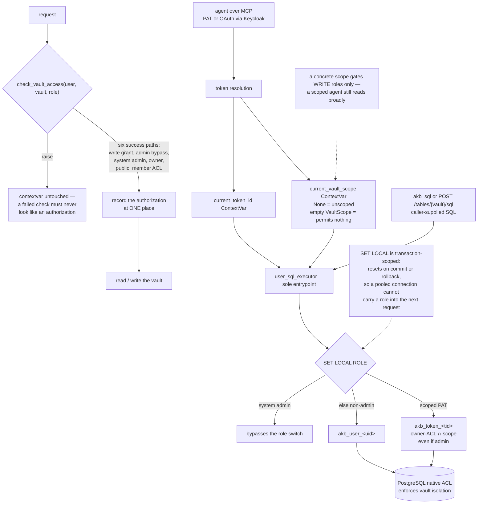

## 1. Executive Summary

AKB is organizational memory for agents: a git-backed knowledge base of
documents, structured tables and files linked by a URI graph, served over MCP
and pitched as a "[d]rop-in alternative to Confluence / Notion" for Claude
Code, Cursor, Windsurf and any MCP-aware client. 1,074 commits since 7 May
2026, 288,019 lines across the tree, 318 backend test files. The licence
changed from PolyForm Noncommercial 1.0 to BUSL-1.1 with a document explaining
the move and stating that prior releases keep their original terms — neither is
an open-source licence, and the project says so in its own file rather than
leaving it to a badge.

The mechanism worth the visit is where authorization lives.

AKB lets an agent run its own SQL — `akb_sql` and a REST
`/api/v1/tables/{vault}/sql` endpoint. That is the surface on which
application-side filtering is the wrong answer, because the caller writes the
query. So AKB does not filter in the application. `user_sql_executor.py` is the
"[s]ole entrypoint for executing user-supplied SQL under per-user PG role", and
inside a transaction it issues `SET LOCAL ROLE` to the caller's
`akb_user_<uid>` and lets "PostgreSQL enforce vault isolation via its native
ACL — no application-side identifier filtering required." `SET LOCAL` is
transaction-scoped, so it resets on commit or rollback and a pooled connection
cannot carry one user's role into the next request; the docstring notes the
PgBouncer transaction-pool compatibility that follows.

The token scope layers onto that correctly. A Personal Access Token may carry a
`VaultScope` — a set of vault-name prefixes plus an explicit whitelist — and
the model's first paragraph states the property that makes it safe: "A
request's effective WRITE permission is `user-ACL ∩ vault_scope` — an
intersection, so a scope only ever SUBTRACTS authority and is
escalation-impossible by construction." For a scoped token the executor
switches to `akb_token_<tid>`, a role whose membership is that intersection,
"even if admin".

It also handles the trap that caught another system read this week. A NULL
scope column means unscoped, "and is represented as `None` — never as an empty
`VaultScope` (which permits nothing)." The difference between "no restriction"
and "restricts everything" is stated where the value is defined rather than
left for each caller to infer.

The authorization record shows the same instinct. `check_vault_access` is
described as "Authorize `user_id` on `vault_name`, then RECORD that
authorization", and it is a thin wrapper over the implementation "purely so the
contextvar is set at ONE place: the implementation has six distinct success
returns … and a set at each of them is a line that a future return can silently
skip." Every raise leaves it untouched, "because a failed check must never look
like an authorization."

One boundary to read carefully before deploying. The token scope "gates
mutating roles (writer/admin/owner) only — reads are unrestricted (a scoped
agent still READS broadly, it just can't WRITE outside its scope)." So a narrow
token bounds what an agent can change, not what it can see; read scoping is the
user's ACL alone. That is a coherent design for a knowledge base whose point is
broad discovery, and it is not what most readers will assume a "scoped token"
means.

Two marks: `scope_enforced`, `audit_log`.

## 2. Mental Model

A **vault** holds documents, tables and files. A user has a **role** on it —
reader up to owner.

A **token** may carry a **VaultScope**: prefixes plus an explicit whitelist.
Effective write permission is the user's ACL intersected with it. `None` means
unscoped; an empty scope permits nothing, and the two are never conflated.

A **PostgreSQL role** carries the ACL: `akb_user_<uid>` normally,
`akb_token_<tid>` for a scoped token, set with `SET LOCAL ROLE` inside the
transaction.

An **authorization** is recorded when a check succeeds, at one place.

## 3. Architecture

| Area | Role |
| --- | --- |
| `backend/app/models/vault_scope.py` | The scope value model, the contextvars, and the intersection property |
| `backend/app/services/user_sql_executor.py` | The sole SQL entrypoint and the role switch |
| `backend/app/services/access_service.py` | `check_vault_access` and the recorded authorization |
| `backend/app/services/role_sync.py` | Keeping PostgreSQL roles in step with the ACL |
| `backend/app/services/auth_service.py`, `backend/app/sso/` | PAT and OAuth resource-server paths |
| `backend/mcp_server` | One tool and authorization core behind modern and legacy protocol adapters |
| `backend/app/logging_redaction.py` | Redaction on the log path |
| `backend/tests/` | 318 files, including a vault-scope SQL end-to-end script and a REST access audit |
| `docs/design/accepted/`, `docs/designs/` | Dated design records, including an authentication-mode boundary |

## 4. Essential Implementation Paths

- `backend/app/models/vault_scope.py:1-17` — the intersection and the
  `None`-versus-empty rule.
- `:126-134` — the two contextvars and when the executor consults them.
- `backend/app/services/user_sql_executor.py:1-14` — why enforcement is the
  database's job here.
- `:147-201` — the role selection, including the scoped-token case.
- `backend/app/services/access_service.py:238-260` — one place to record an
  authorization, and why.

## 5. Memory Data Model

Documents, tables and files in vaults, addressed by URIs that form a graph. The
structured-table support is what makes the SQL surface exist, and the SQL
surface is what makes the database-level ACL necessary rather than merely
tidy.

## 6. Retrieval Mechanics

Hybrid semantic and keyword search over the three content kinds, plus graph
traversal by URI, plus arbitrary SQL for the tables. Every one of those paths
runs under a role the database checks.

## 7. Write Mechanics

Writes go through the vault role check, narrowed for a scoped token by the
intersection. The MCP core is shared across protocol revisions — the README's
compatibility table lists the current revision and four legacy ones behind
"one tool and authorization core", which is the right place to absorb protocol
churn.

## 8. Agent Integration

MCP over Streamable HTTP and stdio, a PAT flow by default and an OAuth
resource-server path with Keycloak for `mcp login`, plus a stdio proxy package
for clients that need one.

## 9. Reliability, Safety, and Trust

Putting isolation in PostgreSQL rather than in application filters is the
correct call for a system that executes caller-supplied SQL, and the details
around it are right: transaction-scoped so pooling is safe, a narrower role for
a scoped token that applies even to an admin, and role synchronisation to keep
the database's view current.

Two things a reader should carry away rather than assume. First, the read
boundary: a token scope is a write-authority bound, and the docstring says so
plainly. An operator issuing a narrow token to an agent should not expect it to
limit what that agent can read. Second, system admins bypass the role switch —
a normal and necessary escape hatch, and one worth knowing is there.

The licence position is the third. BUSL-1.1 now, PolyForm Noncommercial before,
with a dated document explaining the change. Neither is open source, and a
reader planning to fork or vendor should start at `LICENSE-CHANGE.md`.

## 10. Tests, Evals, and Benchmarks

318 backend test files, with the scope story covered at more than one level: a
unit test for vault creation under scope, a document-archive scope unit test, a
REST access audit test, and a SQL end-to-end shell script that exercises the
scoped path against a real database. Testing a database-enforced rule requires
a database, and the suite has one rather than asserting on the SQL string.

## 11. For Your Own Build

### Steal

- **If callers write the query, let the database hold the ACL.** Application
  filtering cannot constrain SQL someone else authored; a per-user role can.
- **Use `SET LOCAL` so the role dies with the transaction.** It is what makes
  connection pooling safe, and the docstring names the pooler it was checked
  against.
- **Define a token scope as an intersection.** "Only ever SUBTRACTS authority
  and is escalation-impossible by construction" is a property you can state
  once and rely on everywhere.
- **Distinguish `None` from empty where the value is defined.** Unscoped and
  scoped-to-nothing are opposite meanings, and each caller inferring the
  difference is how the wrong one gets picked.
- **Set the audit record at one place when the check has many exits.** Six
  success returns are six chances to forget.

### Avoid

- **Letting "scoped token" imply a read bound when it is a write bound.** The
  code is explicit; a deployment note should be too.

### Fit

Reach for this if you want an organizational knowledge base agents can query
with real SQL under real database permissions, and the BUSL terms fit your use.
Look elsewhere if a token scope must limit reading as well as writing, or if
you need an open-source licence.

## 12. Open Questions

- Is a read-side token scope planned, or is broad read by a scoped agent the
  settled intent?
- The system-admin bypass skips the role switch. Is there a separate record
  distinguishing an admin-bypass read from an ACL-satisfied one?
- Role synchronisation keeps PostgreSQL roles in step with the ACL. What is the
  window between an ACL change and the role reflecting it?

## Appendix: File Index

| Path | What to read it for |
| --- | --- |
| `backend/app/models/vault_scope.py` | The intersection, the contextvars, `None` versus empty |
| `backend/app/services/user_sql_executor.py` | Why the database enforces this, and how |
| `backend/app/services/access_service.py` | One place to record an authorization |
| `backend/app/services/role_sync.py` | Keeping the roles current |
| `backend/tests/test_vault_scope_sql_e2e.sh` | The scoped path against a real database |
| `LICENSE-CHANGE.md` | PolyForm NC to BUSL-1.1, and what it means for prior releases |

## History

**2026-09-16** — [`f3aba4598a47e77371518ee658ccc40130b15ec6`](https://github.com/dnotitia/akb/commit/f3aba4598a47e77371518ee658ccc40130b15ec6) — first reading, at a commit dated 16 September 2026. Screened before opening, from a shallow clone: twenty-five files, three auto-run surfaces, five build-time execution points, three unpinned surfaces, ten dependency files inside the cooldown, and the agent-instruction files read as data. Nothing was installed, built or run.
