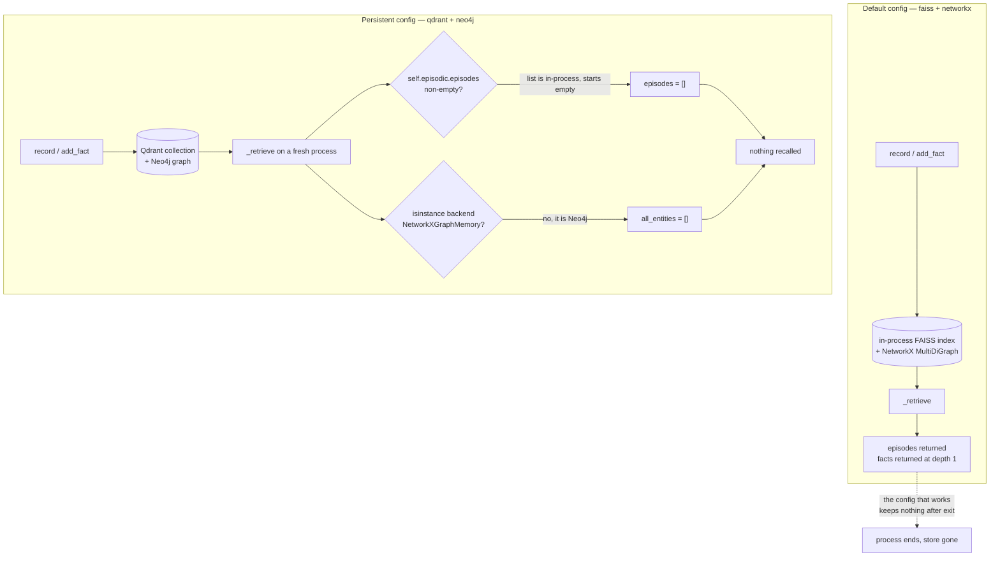

## 1. Executive Summary

This is a teaching catalog: 38 agentic architectures as LangGraph classes, each
paired with a notebook, under MIT, with CI, pre-commit, mypy and a mkdocs site.
It is in this atlas for one directory — `src/agentic_architectures/memory/`, 497
lines across four files — because five of those architectures store something and
read it back later, and because a corpus explicitly built to be copied from is
where a memory defect propagates furthest.

The package is small and its shape is defensible: `VectorMemory` over
FAISS/Chroma/Qdrant, `EpisodicMemory` as timestamped episodes on top of it,
`BaseGraphMemory` with a NetworkX and a Neo4j implementation, and
`SemanticMemory` as a triple-store facade over whichever graph is configured. One
API, four backends, a `.env` switch between them. As a diagram of the design space
it works.

As an implementation there are four findings, and they compound.

**Memory outlives the process on exactly two configurations, and those are the
two the flagship memory architecture cannot read.** No code path in the library
writes to disk — no `save_local`, no `persist_directory`, no serialization
anywhere. Qdrant and Neo4j are the only stores that survive a restart, and both
are one `.env` line plus a docker-compose service away. But
`EpisodicSemanticAgent._retrieve` gates episodic recall on `self.episodic.episodes`
— an in-process Python list that a fresh object starts empty, while `recall()`
reads the vector store — and lists semantic entities only under `if
isinstance(backend, NetworkXGraphMemory)`. Run the dual-memory architecture
against a populated Qdrant collection and a populated Neo4j graph and it retrieves
nothing from either half, silently.

**Two parameters are accepted at the boundary and discarded by the default
backend.** `SemanticMemory.facts_about(entity, depth=N)` builds a Cypher string
and the NetworkX translator parses the depth back out of it with
`int(tok.split("..")[-1].rstrip("]"))` — which sees `2]-(other)`, raises
`ValueError`, and falls into `depth = 1` for every N. And `get_vector_store`'s
FAISS branch never references `collection_name`, which is the parameter the
notebooks tell readers to use for per-user isolation.

**Nothing can be deleted.** Not an episode, not a triple, not a document. The only
removal in the package is `reset()`, which empties the whole store. There is no
supersession, no TTL, no correction of any kind.

**Nothing tests any of it.** 80 test cases across 1,045 lines, and not one
references `EpisodicMemory`, `SemanticMemory`, `facts_about` or
`NetworkXGraphMemory`. The single memory-behaviour assertion is an integration
test gated behind `RUN_INTEGRATION=1` — and it queries an empty graph and asserts
the model answers anyway, so it can only pass when the architecture's own prompt
is ignored.

No capability marks. Not because nobody looked: correction, trust and scope are
each absent for a reason the report states in place.

MIT, 33 commits, first dated 24 September 2025, pinned here at
[`cf9d620a8cc55d59589399c30f305e6dfaa428ec`](https://github.com/FareedKhan-dev/all-agentic-architectures/commit/cf9d620a8cc55d59589399c30f305e6dfaa428ec)
(28 May 2026). 10,959 lines under `src/`, 16,082 across `scripts/` and
`benchmarks/`, 35 notebooks duplicated byte-identically between `notebooks/` and
`docs/architectures/`.

## 2. Mental Model

A memory is whatever was passed in. There is no extraction gate, no validation, no
identity beyond position in a list or a node name in a graph.

Three units exist. An `Episode` — content, role, an ISO-8601 UTC timestamp, and a
metadata dict — recorded by `EpisodicMemory.record` and recalled by vector
similarity. A `(subject, predicate, object)` triple, added by
`SemanticMemory.add_fact` and read back by entity-anchored traversal. And a bare
LangChain `Document`, which is what `VectorMemory.add` takes and what the RAG and
MemGPT architectures actually store.

**The state machine has one state and one transition.** A memory is written, and
after that it exists. It cannot be marked doubtful, superseded, expired, scoped
out, or removed. `reset()` on either backend is the only unwrite in the package,
and it takes everything. So the epistemic question this atlas asks of every
system — how does a thing stop being a belief — has one answer here: it does not,
short of destroying the store.

That has a specific consequence rather than a general one, and MemGPT is where it
shows. `_push_context` FIFO-evicts the four-slot context tier into archival, and
`search_archival` pushes each hit back into that same tier as `[recalled] {t[:200]}`.
Three hits into a four-slot tier evicts earlier entries, which are then archived
again — so a recall round-trip writes truncated, prefixed copies of facts already
in the store, with no dedup and no delete to reclaim them. Retrieval grows the
store it reads from.

Memory is agent-controlled in the loosest sense: the architecture class decides
when to write, and no background pass, no user surface and no policy ever
intervenes.



## 3. Architecture

A pip-installable library, nothing else. No server, no daemon, no CLI memory
surface, no MCP.

- **`src/agentic_architectures/memory/`** — `vector.py` (111 lines), `graph.py`
  (237), `episodic.py` (67), `semantic.py` (55), plus a re-export `__init__`.
- **`src/agentic_architectures/architectures/`** — 38 classes over a
  `base.Architecture` ABC with `build()` and `run()`. Twelve import from
  `memory`; five of those store across `run()` calls.
- **`config.py`** — pydantic-settings, `vector_backend: VectorBackend = "faiss"`,
  `graph_backend: GraphBackend = "networkx"`.
- **`benchmarks/`** — a 17-task suite (`tasks.yaml`) and a runner producing
  `docs/benchmarks.md` and `docs/benchmarks_raw.json`.
- **`tracing/langsmith.py`** — 28 lines of environment-variable setup. Not an
  audit surface.

### Deployment and ergonomics

Nothing has to be running to use the default configuration, and no API key is
needed to *store* anything — though `VectorMemory` calls an embedding model on
every `add`, so a keyless run stores nothing in practice. The two persistent
backends are the cost: Qdrant needs a service, Neo4j needs a service and a
password, and `docker/docker-compose.yml` stands both up beside Ollama, which is
the right thing to ship.

**Nothing is human-readable or repairable by hand.** A FAISS index and a NetworkX
graph live in process memory; there is no file to open when something goes wrong,
and no export beyond `to_cytoscape()`, which exists for notebook diagrams.

One ergonomic wrinkle worth naming because it costs money: constructing an empty
`VectorMemory` on FAISS embeds a document called `__sentinel__` and then deletes
it, because `FAISS.from_documents` needs at least one document. The comment says
so. Every architecture that lazily builds an empty store therefore issues one
billed embedding call at construction.

## 4. Essential Implementation Paths

**Write.** `EpisodicMemory.record` (`memory/episodic.py:44-51`) appends to
`self._episodes` *and* adds a `Document` to the vector store, flattening
`asdict(ep)` and `ep.metadata` into the document metadata. `SemanticMemory.add_fact`
(`memory/semantic.py:31-33`) delegates to `add_triple`, which on NetworkX is
`add_node` ×2 plus `add_edge`, and on Neo4j is a three-clause `MERGE`. All
synchronous, all unconditional.

**Retrieval, vector.** `VectorMemory.search` is `self._store.similarity_search(query, k)`.
No filter, no threshold, no reranking, no metadata predicate. `EpisodicMemory.recall`
wraps it and rebuilds `Episode` objects from document metadata.

**Retrieval, graph.** `SemanticMemory.facts_about` composes a Cypher string with
`RELATES*1..{depth}` and `LIMIT 100`. On Neo4j that executes. On NetworkX it hits
`NetworkXGraphMemory.query`, a hand-written translator that lowercases the query
and string-matches three shapes, raising `NotImplementedError` on anything else —
which is the honest part of the design, since an unsupported pattern fails loudly.

**Context assembly** lives in each architecture, not the package.
`EpisodicSemanticAgent._format_context` renders facts and episodes into a prompt
block; `GraphMemoryAgent._facts_block` renders `(s, p, o)` lines and falls back to
the literal string `"(no relevant facts in graph)"`.

**Update / delete / forget.** Absent. `BaseGraphMemory` declares `add_triple`,
`query`, `neighbors`, `reset` and `to_cytoscape` — no removal of anything smaller
than the graph. `EpisodicMemory` and `VectorMemory` expose no delete at all,
though the FAISS branch of `get_vector_store` proves the underlying store has one.

**Background workers.** None.

**Tests.** `tests/unit/` (three files, 424 lines) covers the base class, a
registry and pure-Python helpers. `tests/notebooks/test_notebook_integrity.py`
checks notebook structure. `tests/integration/test_integration_all.py` (401 lines)
is skipped unless `RUN_INTEGRATION=1`, and CI states it does not run them.

## 5. Memory Data Model

```python
@dataclass
class Episode:
    content: str
    role: str = "user"
    timestamp: str = field(default_factory=lambda: datetime.now(timezone.utc).isoformat())
    metadata: dict[str, Any] = field(default_factory=dict)
```

That is the entire schema in the package. The graph side has no dataclass at all —
a triple is three strings, and on NetworkX the predicate is an edge attribute on a
`MultiDiGraph`, so the same `(s, p, o)` added twice creates two parallel edges.
Neo4j's `MERGE` makes the same call idempotent. **The two backends the module
promises are interchangeable disagree on whether a repeated write is a duplicate.**

**One temporal field, and it is record time.** `Episode.timestamp` is the instant
`record()` ran. Nothing anywhere states when a fact was true. Triples carry no
timestamp at all.

**No provenance, no trust, no status.** Grepping the memory package for `status`,
`confidence`, `verified`, `approved` or `trust` returns nothing. There is no field
in which a wrong memory could be marked wrong, which is the same statement as
section 2's one-state machine seen from the schema side.

**Scoping is `collection_name`, and it is weaker than it looks.** Two separate
things are true and both matter. On the default FAISS backend the parameter is
never referenced — `get_vector_store`'s `faiss` branch takes `documents`,
`embeddings` and `**kwargs` and drops the collection name on the floor — so
isolation there is by object identity, not by key. And every caller in the tree
passes a per-architecture constant: `"memgpt_archival"`, `"voyager_skills"`,
`"reflexion_lessons"`, `"adaptive_rag_corpus"`. Per-principal scoping exists only
as advice in the notebooks — *"Lessons learned about one user's tasks must not
bleed into another user's. Construct `EpisodicMemory(collection_name=f\"reflexion_{user_id}\")`
per session"* — which is correct guidance that no code follows and no test checks,
and which is a no-op on the backend the guidance's own reader will be running.
`scope_enforced` is withheld on exactly that.

## 6. Retrieval Mechanics

Vector retrieval is `similarity_search(query, k)` with `k` defaulting to 4 or 5.
There is no score threshold, no MMR, no hybrid lane, no filter. An empty store
returns an empty list and every architecture treats that as "nothing relevant"
rather than as "nothing stored".

Graph retrieval is where the mechanics have a defect worth stating precisely.
`SemanticMemory.facts_about` builds:

```python
cypher = (
    "MATCH path = (e:Entity {name: $name})-[r:RELATES*1.." + str(depth) + "]-(other) "
    ...
)
```

and `NetworkXGraphMemory.query` recovers the depth from that string:

```python
for tok in cypher.split():
    if tok.startswith("1..") or "RELATES*1.." in tok:
        try:
            depth = int(tok.split("..")[-1].rstrip("]"))
        except ValueError:
            depth = 1
```

The matching token is `$name})-[r:RELATES*1..2]-(other)`. Splitting on `..` yields
`2]-(other)`; `rstrip("]")` removes trailing `]` characters and the string ends in
`)`, so nothing is stripped; `int("2]-(other)")` raises; the handler sets
`depth = 1`. **Every value of `depth` traverses one hop on the default backend**,
and the `except ValueError` makes it silent.

`GraphMemoryAgent` defaults to `traversal_depth=2`, its `_facts_block` docstring
says *"depth = self.traversal_depth"*, and its notebook tells the reader *"at
depth=2, expect 3-10 facts. >20 = too much noise; <2 = traversal didn't expand
enough."* On Neo4j the depth is honored. On the default it is not, and the
notebook's calibration advice is written against a traversal the reader will not
be running. The fix is one line: parse the depth from the argument rather than
from the string built out of it.

**Retrieval is tool-mediated in no sense.** No architecture exposes memory to the
model as a callable except MemGPT, whose `_decide` asks a structured-output model
to pick `write_to_archival`, `search_archival` or `answer`. Everywhere else the
architecture retrieves on the model's behalf, before the prompt is built.

**The failure mode that matters** is under-recall reported as absence.
`MemGPT._execute_action` wraps `search_archival` in `except Exception: return
{"kind": "search", "n_hits": 0}`, so a backend outage, an embedding error and an
empty store are the same observation. `EpisodicSemanticAgent._retrieve` wraps its
entity listing in `except Exception: pass`. In both cases the agent proceeds
having concluded, from a silence it cannot distinguish, that it knows nothing.

## 7. Write Mechanics

Writes are hot-path, synchronous and unfiltered. `record()` and `add_fact()`
return `None` — no id, no receipt, nothing to address the memory by afterwards,
which is the structural reason there is no delete: the API never hands out a
handle.

Extraction, where it happens, is per-architecture. `GraphMemoryAgent.ingest`
prompts a structured-output model for `_IngestionTriple` objects and asks for
snake_case predicates; `EpisodicSemanticAgent._extract_and_save_facts` does the
same on each turn. Neither deduplicates against what is already stored, neither
records where a triple came from, and neither can revise one.

**Deduplication does not exist**, and on the default graph backend the store
cannot even collapse an exact repeat: `MultiDiGraph.add_edge` appends a parallel
edge, so re-ingesting the same paragraph twice doubles every relation, and
`facts_about` then de-dups by `(subject, predicate, object)` at read time — the
right place to notice a problem the write path created, and the wrong place to
fix it.

**The dual write in `EpisodicMemory` is the one to look at closely.** `record()`
appends to `self._episodes` and adds to the vector store; `recall()` reads only
the vector store; the `episodes` property reads only the list. Nothing reconciles
them. On a persistent Qdrant collection the list starts empty on every new
process while the collection is full, and the two views permanently disagree.

### Operational cost

The write path blocks on one embedding call per document and, where an
architecture extracts, on one LLM call per turn. There is no deferral, so lag
between writing and being retrievable is zero — the only property in this section
the design gets unambiguously right. No background pass re-reads or rewrites the
store, so there is no corpus-scaled token bill. On the read path, injection is
whatever `_format_context` renders, unbounded: `k` bounds the episodes, and
`facts_about`'s `LIMIT 100` bounds the facts per entity, but `_facts_block`
iterates over up to 20 matched entities with no total budget.

## 8. Agent Integration

The integration surface is `import`. An architecture constructs a memory object in
`__init__` and calls it from `run()`. There is no MCP server, no HTTP API, no CLI
verb that touches memory, and no session lifecycle — a "session" here is the
lifetime of a Python object.

**The model has almost no agency over memory.** MemGPT is the exception and its
tier is four slots (`context_limit: int = 4`). Everywhere else the architecture
writes on the model's behalf and retrieves before prompting, so there is nothing
for the model to decide.

**`base.Architecture.__init__` accepts and silently stores every unknown keyword
argument**, and this is not a style note — it is the mechanism behind the most
consequential defect in the repository:

```python
def __init__(self, llm: BaseChatModel | None = None, **kwargs: Any) -> None:
    self.llm = llm if llm is not None else get_llm()
    self.config = kwargs
```

`benchmarks/run_benchmark.py:107-109` passes `documents=STARDUST_CORPUS` to six
architectures in one tuple. Five of them — `AgenticRAG`, `CorrectiveRAG`,
`SelfRAG`, `AdaptiveRAG`, `GraphRAG` — declare `documents` and ingest it. The
sixth, `GraphMemoryAgent`, does not: its signature is `(semantic, traversal_depth,
**kwargs)`, so the corpus lands in `self.config` and is never read. `run()` only
queries; `ingest()` is called from notebook 12 and its build script and nowhere
else. **The graph-memory architecture was benchmarked against an empty knowledge
graph**, and the committed artifact records the signature: 1.2 seconds against
GraphRAG's 64.5 on the same task, which is one prompt over `"(no relevant facts in
graph)"`. A `**kwargs` that validates nothing turned a wiring mistake into a
result.

## 9. Reliability, Safety, and Trust

**Provenance: none. Verification: none. Uncertainty: unrepresentable.** Nothing
distinguishes a fact an LLM extracted from a document from one it invented, and no
field could hold the distinction.

**Prompt-injected false memories have a clear path and no obstacle.**
`GraphMemoryAgent.ingest` and `EpisodicSemanticAgent._extract_and_save_facts` turn
arbitrary text into triples with no filter, and `_facts_block` renders them back
into a prompt as authoritative facts. A document that says "the CEO of X is Y"
becomes a triple, and the retrieval prompt then instructs the model to answer
*"using ONLY the facts in the knowledge graph"*. That instruction is the right
one; it also means an injected triple is believed by construction, with nothing to
mark it doubtful and no way to remove it short of `reset()`.

**Multi-tenancy is unaddressed**, per section 5. The notebooks say so themselves —
one lists *"Privacy leak across users | If `arch` instance shared across users,
memory leaks"* in a risk table — and the mitigation offered is to construct a new
instance per user, which is a deployment convention rather than an enforced
boundary.

**Data loss is the default outcome, not a risk.** Every store the library builds
without an external service dies with the process. The tutorial's stated recipe —
*"Persist by serializing `arch.episodic.episodes`"* — serializes the in-process
list, which is the view `recall()` does not read; restoring it would repopulate
`episodes` and leave the vector store empty, so recall would still return nothing.

**Concurrency and races.** Not contemplated. The stores are plain Python objects
with no locking, which is correct for a single-threaded notebook and wrong for
anything a reader might build on it.

**Two things this section should credit.** `NetworkXGraphMemory.query` raises
`NotImplementedError` with the offending Cypher and the remediation (*"Switch to
GRAPH_BACKEND=neo4j for full Cypher support"*) rather than returning an empty
list — the loud failure is the right choice and it is rarer than it should be. And
`rlhf.py`'s own docstring corrects its name: *"A misleading name (this isn't RL
with human feedback — it's editor-feedback…)"*, with the archive gate stated as
computed in Python. `human_review` is withheld precisely because that docstring is
accurate: no person approves anything that enters any store here.

## 10. Tests, Evals, and Benchmarks

**No test touches the memory package.** 80 cases across 1,045 lines, and
`EpisodicMemory`, `SemanticMemory`, `facts_about` and `NetworkXGraphMemory` appear
in none of them. That is the answer to how a depth parser that discards its input
survives a repository with CI, mypy and pre-commit: nothing was ever asserted
about it.

**The one memory-behaviour assertion passes only when the architecture fails.**
`tests/integration/test_integration_all.py:145-151`:

```python
arch = GraphMemoryAgent(llm=_llm())
arch.run("Ada Lovelace wrote the first computer algorithm in 1843.")
r = arch.run("Who wrote the first computer algorithm?")
assert "ada" in r.output.lower()
```

`run()` does not ingest — `ingest()` is a separate method whose docstring says
*"call between runs to populate the graph"* — so both calls query an empty
`NetworkXGraphMemory`. `_facts_block([])` returns `"(no relevant facts in graph)"`,
and the prompt around it says *"Do NOT use parametric knowledge — if the graph
doesn't have the answer, say so explicitly."* The assertion therefore holds only
if the model disobeys that instruction and answers from what it already knows.
A test that passes when the system under test is bypassed is worse than no test,
because it reports coverage. It is also gated behind `RUN_INTEGRATION=1` and
excluded from CI by design, so it has never gone green or red in the repository's
own automation.

`test_agent_workflow_memory_real` runs twice and asserts `r.output` — truthiness of
a string, which any non-empty completion satisfies.

**The benchmark suite is the strongest thing here and it needs reading with care.**
`benchmarks/tasks.yaml` defines 17 tasks, one of which — `stateful_recall`, `kind:
memory` — is a real memory test: two `setup_prompts` plant facts (*"Remember this
fact: my favourite colour is teal"*), then the scored prompt asks for one back.
Four architectures are assigned to it. `docs/benchmarks_raw.json` records the
outcome: `EpisodicSemanticAgent` and `MemGPT` pass, `Reflexion` and
`AgentWorkflowMemory` fail. The README calls those two *"wrong memory shape"*,
which is fair — a reflection store and a workflow-recipe store are not fact stores.
Half of the architectures assigned to the memory task cannot do the memory task,
and the repository says so on its front page.

**The headline recomputes.** 42 rows, 33 with `correct: true`, and 33/42 = 78.6%
against the README's *"33 / 42 correct, 78%"*. Worth adding beside it: 31 of the 36
architectures attempted exactly one task, so the suite is broad rather than deep.

**The artifact is not self-consistent with the scorer that claims to produce it,
and this is the finding to carry away.** `run_one` computes

```python
contains_pass = (len(contains_hits) == len(task.get("expected_contains", [])) and not excludes_hits)
correct = contains_pass and metadata_pass and error is None
```

so a row cannot be `correct: true` while `contains_hits` is empty and
`expected_contains` is not. Six of the seventeen tasks have an empty
`expected_contains` and are scored on `score_metadata` instead; six passing rows
sit on those and are consistent. **The remaining 27 of 33 passing rows are
impossible under this scorer** — `correct: true`, `contains_hits: []`, a non-empty
`expected_contains`. Meanwhile `output_excerpt` is blank in 41/42 rows, and
every Excerpt cell in `docs/benchmarks.md` is empty, though the README links it as
the *"Full leaderboard with per-task answer excerpts"*. The one surviving excerpt
is a DryRun safety row. Whatever produced the committed file, it was not this
version of the runner unmodified, and the field that would let a reader adjudicate
is the field that was emptied.

**What I would want before trusting any of this.** A test that writes two triples,
reads back at `depth=2`, and asserts the two-hop fact appears — it fails today on
the default backend. A test that constructs two `EpisodicMemory` objects with
different `collection_name` values on each backend and asserts non-leakage — it is
meaningless on FAISS today. A test that populates a store, drops the object,
rebuilds it against the same persistent backend, and asserts recall — it fails
today for both halves of `EpisodicSemanticAgent`. And a benchmark row for
`GraphMemoryAgent` taken after `ingest()` has actually run.

## 11. For Your Own Build

### Steal

- **Fail loudly on an unsupported query.** `NetworkXGraphMemory.query` raises with
  the Cypher it could not handle and names the backend that can. A translator that
  silently returns `[]` for a pattern it does not understand is indistinguishable
  from an empty store, and this one refuses to be.
- **One facade over several stores, switched by config.** `BaseGraphMemory` with
  two implementations and a factory is the right skeleton, and the reason the
  defects here are legible is that the seam exists at all. The lesson is about
  what has to come with it, below.
- **Name the memory shapes and say which task each is for.**
  `docs/tutorials/memory.md`'s three questions — what is the stored unit, what is
  the retrieval key, what is the persistence scope — are a better framing than most
  production systems apply to themselves, and its decision tree is worth copying
  even where its own table gets the third answer wrong.

### Avoid

- **A backend seam with no conformance test.** If two implementations claim one
  API, one test suite must run against both. Here `depth` is honored on Neo4j and
  discarded on NetworkX, a repeated triple is a duplicate on one and idempotent on
  the other, and `collection_name` partitions on two backends and evaporates on the
  third. Each divergence is one shared test away from being caught, and none is
  caught.
- **Recovering a parameter from a string you just built from it.** `facts_about`
  serializes `depth` into Cypher and the translator parses it back out. Pass the
  value; do not round-trip it through a format you then have to reverse-engineer,
  especially inside a `try/except` that turns a parse failure into a plausible
  default.
- **A base class that stores unknown kwargs without complaint.** `self.config =
  kwargs` costs nothing to write and cost this repository a benchmark result: a
  corpus was passed to the wrong architecture and silently ignored. Reject unknown
  arguments, or at minimum warn.
- **A dual write where the read path uses one view and a guard uses the other.**
  `EpisodicMemory` keeps a list and a vector store; `recall()` reads the store and
  the caller's `if` reads the list. Guard on the thing you are about to read.
- **Writing recalled content back into the store it came from.** MemGPT's context
  tier re-archives evicted `[recalled]` entries, so retrieval inflates the corpus
  with truncated duplicates, and nothing here can delete them.
- **"Persistent" meaning "on the object".** The tutorial's table says the scope is
  *"across runs"* for six of seven variants and calls MemGPT's archival tier
  *"disk"*, and twelve lines later says *"Persistence to disk: NOT enabled by
  default — memory lives in the architecture instance."* Both statements are in the
  same document. Pick the word that survives a process restart.

### Fit

Read this as a map, not as a foundation. Thirty-five notebooks that each build one
architecture end to end, under MIT, with the reference paper cited on every class,
is a genuinely useful way to see the design space — and the memory package is a
teaching aid inside that, deliberately small, doing the least that makes the
notebooks run.

The reason the defects above are worth this much space is not that a 497-line
teaching module should have been production-grade. It is that a catalog is copied
from, one architecture at a time, by readers who will keep the shape and change
the model — and four of the findings here (a discarded depth, a discarded scope
key, a guard on the wrong view, a permissive `**kwargs`) survive that copy
untouched, while the honest caveat in the tutorial's last bullet does not.

Anyone needing memory that outlives a process should take the architecture
diagrams from here and the implementation from somewhere with a delete.

## 12. Open Questions

- **Was `docs/benchmarks_raw.json` produced by an earlier runner, or scrubbed
  afterwards?** The 27 impossible passing rows and the 41 blank excerpts have the
  same explanation either way from a reader's position, but only the author can say
  which, and only one of the two answers means the numbers were ever checkable.
- **Does anything downstream call `EpisodicMemory.episodes` expecting it to mirror
  the vector store?** In-tree the only consumer is the guard in
  `EpisodicSemanticAgent._retrieve`; the tutorial recommends it as the persistence
  handle, which suggests readers do.
- **Was the NetworkX/Neo4j divergence on repeated triples a decision?** `MERGE` is
  idempotent and `MultiDiGraph.add_edge` is not, and nothing in the docstrings
  acknowledges the difference.
- **Why is `GraphMemoryAgent` in the RAG kwargs tuple at all?** Either it was meant
  to gain a `documents` parameter and did not, or it was meant to be excluded; the
  benchmark row cannot distinguish them.
- **Is the `.devcontainer` `postCreateCommand` the intended entry point?** It
  installs eight extras and Playwright, which is a different posture from the
  README's minimal install, and only one of the two is exercised in CI.

## Appendix: File Index

**Memory package**
- `src/agentic_architectures/memory/episodic.py` — `Episode`, `EpisodicMemory`,
  the dual write at `:44-51`, the guard's other half at `:64-66`.
- `src/agentic_architectures/memory/graph.py` — `BaseGraphMemory`,
  `NetworkXGraphMemory` and its Cypher translator (the depth parse at `:88-95`),
  `Neo4jGraphMemory`, `get_graph_memory`.
- `src/agentic_architectures/memory/semantic.py` — `SemanticMemory.facts_about`
  and the Cypher it composes.
- `src/agentic_architectures/memory/vector.py` — `get_vector_store` (the FAISS
  branch that drops `collection_name`, and the `__sentinel__` construction),
  `VectorMemory`.

**Architectures that store**
- `architectures/episodic_semantic.py:100-129` — `_retrieve`, both guards.
- `architectures/graph_memory.py:70-134,:152-190` — `traversal_depth`, `ingest`,
  `_facts_block`, `run`.
- `architectures/memgpt.py:75-160` — the four-slot tier, FIFO eviction into
  archival, the `[recalled]` re-push, the swallowed search exception.
- `architectures/base.py:45-49` — `self.config = kwargs`.
- `architectures/reflexion.py`, `voyager.py`, `agent_workflow_memory.py`,
  `rlhf.py` — the other stores, all `VectorMemory` with constant collection names.

**Configuration**
- `src/agentic_architectures/config.py:42-43,:83-84` — backend literals and
  defaults.
- `.env.example`, `docker/docker-compose.yml` — the persistent path.

**Measurement**
- `benchmarks/tasks.yaml` — `stateful_recall`, `multi_hop_rag`.
- `benchmarks/run_benchmark.py:103-133,:164-196` — kwargs patching, scoring.
- `docs/benchmarks_raw.json`, `docs/benchmarks.md` — the committed run.

**Tests**
- `tests/unit/`, `tests/conftest.py` — the mock LLM and the `RUN_INTEGRATION` gate.
- `tests/integration/test_integration_all.py:145-151,:395-401` — the two
  memory-adjacent cases.

**Documentation**
- `docs/tutorials/memory.md` — the seven variants table and the persistence
  bullet that contradicts it.

## History

**2026-08-30** — [`cf9d620a8cc55d59589399c30f305e6dfaa428ec`](https://github.com/FareedKhan-dev/all-agentic-architectures/commit/cf9d620a8cc55d59589399c30f305e6dfaa428ec) — first reading, at the 33rd commit. Screened before reading: a `.devcontainer` `postCreateCommand` installing eight extras plus Playwright, a committed `.vscode/settings.json`, a `tests/conftest.py` that executes on collection, and one unpinned dependency surface with no lockfile; nothing was installed and nothing was run, and the depth-parsing behaviour in section 6 was reproduced by re-implementing the parse in isolation rather than by importing the tree. No marks. The report is built around the memory package rather than the 38 architectures, because that is the part in scope, and around the gap between what the two backends promise and what the default one does.
