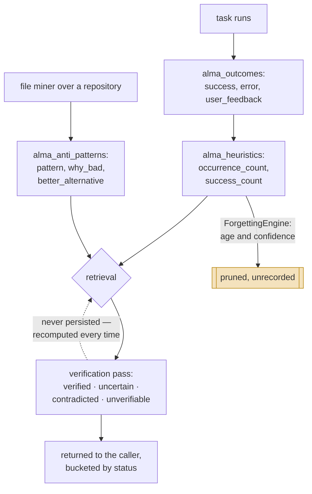

## 1. Executive Summary

ALMA — Agent Learning Memory Architecture — is a **five-table memory for agents
that learn from their own outcomes**, MIT by `pyproject.toml`, 106,594 lines of
Python, published to PyPI. There is no `LICENSE` file in the tree at this
commit; the grant is asserted in the manifest only, which is worth knowing before
copying anything.

The design divides memory by *what it is for* rather than by recency or type:

| Table | Holds |
| --- | --- |
| `alma_heuristics` | condition → strategy, with occurrence and success counts |
| `alma_outcomes` | what a task did, whether it succeeded, the error and user feedback |
| `alma_domain_knowledge` | facts with a source and a `last_verified` |
| `alma_anti_patterns` | a pattern, **why it is bad**, and a **better alternative** |
| `alma_preferences` | per-user settings |

**The anti-pattern table is the reason to read this.** It stores `pattern`,
`why_bad`, `better_alternative` and `occurrence_count` — a durable record that
something was tried, was wrong, and has a known replacement. No tombstone
anywhere in this corpus records both the *reason* and the *alternative*; the four
systems that carry one record that a value was rejected and, at best, why.

It is not a tombstone, and the distinction is exact. A rejected-value tombstone
is consulted **on the write path**, so extraction cannot re-assert what was
rejected. ALMA's anti-patterns are mined from repository files
(`ingestion/file_miner.py`) and read back as guidance — retrieval material
telling the agent what to avoid, not a guard preventing the store from re-learning
it. The mechanism is one wiring decision away from the richest correction record
in the atlas, and that wiring is not there.

**The verification states are the second near-miss, and the sharper one.**
`VerificationStatus` declares `VERIFIED`, `UNCERTAIN`, `CONTRADICTED` and
`UNVERIFIABLE`, with `VerificationMethod` recording whether the judgement came
from ground truth, cross-verification against other memories, or a confidence
fallback with no model involved. That is a better epistemic vocabulary than most
systems here have. **It is computed at retrieval and never written down** — no
column in any of the five tables holds it. A memory found `CONTRADICTED` today is
classified fresh tomorrow, the contradiction is rediscovered rather than
remembered, and nothing accumulates.

## 2. Mental Model

A memory is a **row in the table matching its purpose**, and every row carries
`agent`, `project_id` and a 384-dimension embedding.

Learning is by counter rather than by state. A heuristic has `occurrence_count`
and `success_count`; an anti-pattern has `occurrence_count` and `last_seen`; a
domain fact has `confidence` and `last_verified`. Nothing has a status column —
the epistemics live in the arithmetic and in the verification pass that runs on
the way out.

### How a thing becomes a belief, and how it stops being one

The dashed edge is the finding. The verification pass is the most sophisticated
epistemic machinery in the system and it writes nothing back, so its conclusions
have the lifetime of a single call.

## 3. Architecture

Two storage shapes for one schema: a Postgres schema with `VECTOR(384)` columns
and `TIMESTAMPTZ` defaults (`alma/cli.py`), and a local SQLite mirror
(`alma/storage/sqlite_local.py`). Indexes are declared on `(project_id, agent)` —
the scope pair — which is the right composite for the queries the system issues.

An MCP server exposes retrieval tools, and there is a CLI and a PyPI
distribution, with `benchmarks/` and `Clara_docs/` alongside.

### Deployment and ergonomics

The dual Postgres/SQLite path is the operational cost: the schema exists twice,
in two dialects, in two files, and nothing in the repository compares them. A
column added to the Postgres DDL and not to the SQLite mirror produces a local
store that silently lacks it — the same class of drift as a test that re-declares
its own schema.

## 4. Essential Implementation Paths

- **Schema (Postgres):** `alma/cli.py:300-375` — the five tables and the
  `(project_id, agent)` indexes.
- **Schema and queries (SQLite):** `alma/storage/sqlite_local.py:136` onward;
  the read predicates at `:954`, `:1005`, `:1083`, `:1136`.
- **Verification:** `alma/retrieval/verification.py:25` — `VerificationStatus`
  and `VerificationMethod`.
- **Forgetting:** `alma/learning/forgetting.py:106` — `ForgettingEngine`, age and
  confidence strategies.
- **Ingestion:** `alma/ingestion/file_miner.py` — heuristics and anti-patterns
  extracted from repository files.
- **MCP surface:** `alma/mcp/tools/retrieval.py`.

## 5. Memory Data Model

Five tables, one scope pair, no status column anywhere.

The absence is consistent rather than accidental: ALMA models confidence as a
float that moves with counters (`confidence`, `occurrence_count`,
`success_count`), and models *assessment* as something computed on demand. That
is a coherent position — it just means the assessment cannot be shared, audited
or reused, because it is never stored.

`alma_domain_knowledge` carries `source` and `last_verified`, which is provenance
plus a re-verification timestamp. `last_verified` is record time — when the check
ran — not validity time, so there is no bi-temporal pair.

## 6. Retrieval Mechanics

Per-table SQL with `WHERE project_id = ?` and, for heuristics, a
`confidence >= ?` floor, alongside vector similarity over the 384-dimension
embeddings.

**Scope is a genuine predicate**, composed into the query rather than filtered
after it, on all five tables. That is the strict form the rubric asks for, and is
why the mark is earned without the caveat that attaches to post-filtered
implementations elsewhere in this corpus.

The verification pass then sorts results into the four statuses before returning
them, and the MCP tool documents `contradicted` as "Needs review (may be stale)"
— surfacing the uncertainty to the caller rather than silently dropping it, which
is the right half of the decision.

## 7. Write Mechanics

Three write paths. Task execution records an outcome. Heuristics accumulate
counters as conditions recur. And `file_miner` performs a bulk ingestion pass
over a repository, extracting heuristics and anti-patterns from files.

The `ForgettingEngine` is the removal side: age-based decay and confidence-based
pruning, both destructive. There is no archive tier and no supersession pointer —
a pruned heuristic is gone, and a heuristic replaced by a better one is not
linked to its replacement.

## 8. Agent Integration

An MCP server with retrieval tools is the primary surface, plus a CLI and the
PyPI package. `alma/mcp/tools/retrieval.py` shapes results by verification
status, so a consuming agent receives the four buckets rather than a flat list —
a more honest interface than most, and the only place the verification work is
visible.

## 9. Reliability, Safety, and Trust

**`scope_enforced` — earned, in its strict form.** `WHERE project_id = ?` on
every read path, with a composite index behind it.

**`trust_state` — not earned, and this is the sharpest near-miss here.** Four
discrete states with three named derivation methods is a better vocabulary than
most of the systems that do carry the mark. The definition requires the
status to be a *field*, and here it is a return value. The consequence is
concrete rather than pedantic: nothing can query for contradicted memories, no
background pass can act on them, a human cannot be shown a review queue, and the
same contradiction is re-derived on every retrieval that touches the row.

**`tombstone` — not earned**, with the near-miss described in section 1. The
anti-pattern table records more than any tombstone in this corpus; it is read as
guidance rather than consulted as a write guard.

**`bitemporal` — not found.** `last_validated`, `last_verified`, `created_at`
and `last_seen` are all record time. No validity interval exists.

**`audit_log` — not found.** Searched the package for an append-only mutation
table or a log writer; there is none, and the `ForgettingEngine` prunes without
recording what it removed.

**`human_review` and `negative_eval` — not assessed.** A `benchmarks/` directory
is present and was not traced; neither mark is claimed in either direction.

## 10. Tests, Evals, and Benchmarks

A `benchmarks/` directory exists at the repository root alongside `Clara_docs/`
and `demo.py`. It was not traced and I ran nothing, so this report makes no claim
about coverage in either direction.

The schema-in-two-dialects issue from section 3 belongs here too: the property
most worth a test — that the Postgres DDL and the SQLite mirror agree — is
exactly the kind of invariant nothing in the repository appears to assert.

## 11. For Your Own Build

### Steal

- **`why_bad` and `better_alternative` as columns.** Recording *why* something
  was wrong and *what to do instead*, beside the thing itself, is more than any
  correction record in this atlas holds. Copy the columns even if you wire them
  differently.
- **Naming the verification method.** `ground_truth`, `cross_verify`,
  `confidence` and `none` distinguish "checked against an authority" from
  "checked against our own other memories" from "we guessed from a number" —
  three very different claims that most systems collapse into one score.
- **Returning results bucketed by status.** Handing a caller `contradicted`
  separately, labelled "may be stale", beats dropping those rows or mixing them
  in.

### Avoid

- **Computing an epistemic status and throwing it away.** If the pass is worth
  running, the result is worth a column — otherwise nothing accumulates and
  nothing else can act on it.
- **Two hand-maintained dialects of one schema** with nothing comparing them.
- **Pruning without a record.** The forgetting engine removes by age and
  confidence and leaves no trace of what went or why.

### Fit

This suits an agent that **learns operating heuristics from its own task
outcomes**, in a Postgres deployment, where the anti-pattern material is the
point. The five-way typed split is legible and the scope predicate is strict.

Poor fit if you need correction that persists — the verification result does not
survive the call — or if a missing `LICENSE` file beside a manifest grant is a
problem for your legal position.

## 12. Open Questions

- **Is anything wired to consult `alma_anti_patterns` before a write?** If it
  were, this would be the richest correction record in the corpus. No such path
  was found; the table is populated by the file miner and read as guidance.
- **Why is `VerificationStatus` not persisted?** Adding a column is a small
  change with a large consequence, so the omission may be deliberate — no
  reasoning was found stated anywhere.
- **Do the Postgres and SQLite schemas agree today?** Two dialects, two files, no
  comparison.
- **What does `benchmarks/` measure?** Present, untraced.

## Appendix: File Index

**Storage and schema**
- `alma/cli.py` — the five-table Postgres DDL and the `(project_id, agent)`
  indexes
- `alma/storage/sqlite_local.py` — the SQLite mirror and every read predicate

**Epistemics**
- `alma/retrieval/verification.py` — `VerificationStatus`, `VerificationMethod`

**Lifecycle**
- `alma/learning/forgetting.py` — `ForgettingEngine`, age and confidence pruning

**Write path**
- `alma/ingestion/file_miner.py` — heuristic and anti-pattern extraction

**Integration**
- `alma/mcp/tools/retrieval.py` — MCP retrieval tools, status bucketing

**Evals**
- `benchmarks/` — present, not traced

## History

**2026-08-04** — [`164d2e3e3c67f3ce1c33d2b9ccd9acaa65f9ad7a`](https://github.com/RBKunnela/ALMA-memory/commit/164d2e3e3c67f3ce1c33d2b9ccd9acaa65f9ad7a) — first reading.
