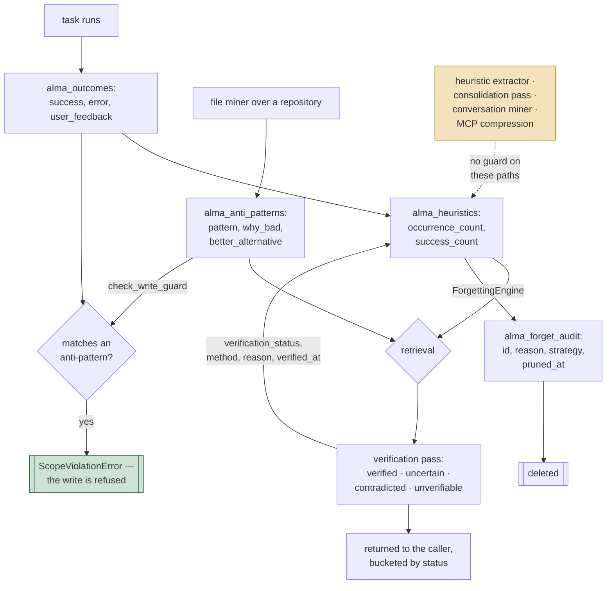

## 1. Executive Summary

ALMA — Agent Learning Memory Architecture — is a **five-table memory for agents
that learn from their own outcomes**, MIT with a `LICENSE` file in the tree,
103,832 lines of Python of which 41,848 are tests across 91 files, 193 commits,
release v0.11.0 published to PyPI and npm.

The design divides memory by *what it is for* rather than by recency or type:

| Table | Holds |
| --- | --- |
| `alma_heuristics` | condition → strategy, with occurrence and success counts |
| `alma_outcomes` | what a task did, whether it succeeded, the error and user feedback |
| `alma_domain_knowledge` | facts with a source and a `last_verified` |
| `alma_anti_patterns` | a pattern, **why it is bad**, and a **better alternative** |
| `alma_preferences` | per-user settings |

**The anti-pattern table is the reason to read this, and it has teeth.**
It stores `pattern`, `why_bad`, `better_alternative` and `occurrence_count` — a
durable record that something was tried, was wrong, and has a known replacement.
No correction record in this corpus holds both the *reason* and the
*alternative*. `alma/learning/write_guard.py` consults it before a write:
`check_write_guard` normalises the candidate text, matches it against every
stored anti-pattern by substring containment or a token overlap of 0.45 or more,
and a hit raises `ScopeViolationError` rather than returning a filtered result.
It is on by default (`ALMA_ANTI_PATTERN_WRITE_GUARD`), and the key is forgiving
in the way [Provem](../provem/)'s token-subset key is forgiving — a restatement
in different surrounding words is still caught.

**The `tombstone` mark is withheld on reach, and the arithmetic is the finding.**
The guard has exactly one call site: `learn()` in
`alma/learning/protocols.py:97`, the task-outcome path. Five other writers reach
the same store without passing it —

- `alma/learning/heuristic_extractor.py:274` and `:321`, the extractor
- `alma/consolidation/engine.py:662`, the background consolidation pass
- `alma/mcp/tools/learning.py:655` and `:672`, the compression tool
- `add_domain_knowledge` and `add_preference` in the same `protocols.py` file
  that hosts the guarded method
- `alma/ingestion/conversation_miner.py`

The atlas's definition asks that a rejected value be recorded *"so later
extraction cannot re-assert it"*, and in this codebase the extractor, the miner
and the consolidation pass are precisely the unguarded paths — the automatic
re-derivation the
[rejected-value tombstone](../../patterns/rejected-value-tombstone/) page says
matters most. The repository's own README is accurate about this where a
marketing sentence would not have been: it says `learn()` refuses, not that
writes refuse. Moving `check_write_guard` into the storage layer's `save_*`
methods would close it in one place instead of five.

**The verification states are a column.** `VerificationStatus` declares
`VERIFIED`, `UNCERTAIN`, `CONTRADICTED` and `UNVERIFIABLE`, with
`VerificationMethod` recording whether the judgement came from ground truth,
cross-verification against other memories, or a confidence fallback with no model
involved. `alma/storage/verification_store.py` writes the status, the method, the
confidence, the reason, the contradicting source and a `verified_at` back onto
the row, through `update_memory_verification`, implemented on **both** the SQLite
and Postgres backends and added to both by migration
`v1_2_0_atlas_gaps.py`. The verifier calls it by default. `trust_state` is
earned: four discrete states, as a field, on the two shipped backends.

**And the benchmark numbers are traceable, which is rarer than the rest of it.**
`benchmarks/results-v1.0-phase1.json` carries a LongMemEval run over 500
questions with a full config stamp — mode, embedding provider, `top_k`, elapsed
seconds — a published recall curve, and a per-question record holding
`correct_session_ids` and `ranked_session_ids`. Recomputing the curve from those
records at this commit reproduces every published figure exactly:

```text
k     recomputed   published
1        0.804       0.804
3        0.924       0.924
5        0.964       0.964
10       0.980       0.980
30       0.994       0.994
50       0.996       0.996
```

Read it as retrieval recall over a session haystack, not end-to-end QA accuracy —
the file says `"benchmark": "longmemeval"`, `"mode": "session"`, and the metric is
whether a correct session id appears in the top *k*.

## 2. Mental Model

A memory is a **row in the table matching its purpose**, and every row carries
`agent`, `project_id` and a 384-dimension embedding.

Learning is by counter *and* by state. A heuristic has `occurrence_count` and
`success_count`; an anti-pattern has `occurrence_count` and `last_seen`; a domain
fact has `confidence` and `last_verified`. Over the top of the arithmetic sits a
`verification_status` written by the retrieval pass, so a row carries both a
number that moves with use and a discrete judgement about whether it survived
checking.

### How a thing becomes a belief, and how it stops being one



The dotted edge is the finding. One door checks the record of what was rejected;
four others open onto the same table, and the ones that open automatically are
among them.

## 3. Architecture

Two storage shapes for one schema: a Postgres schema with `VECTOR(384)` columns
and `TIMESTAMPTZ` defaults (`alma/cli.py`), and a local SQLite mirror
(`alma/storage/sqlite_local.py`). Indexes are declared on `(project_id, agent)` —
the scope pair — which is the right composite for the queries the system issues.

An MCP server exposes 31 tools, and there is a CLI and a PyPI distribution,
with `benchmarks/` and `Clara_docs/` alongside. Beside the five-table store sits
a knowledge-graph package, `alma/graph/`, with in-memory, Kùzu, Memgraph and
Neo4j backends and an LLM extractor; nothing in `alma/core.py`, the MCP tools,
the CLI or the package root imports it, so it is a module the adopter wires
rather than part of the memory path.

The project's history was rewritten on 4 September 2026. The changelog's
*Unreleased* section records the removal of *"Company fleet adapter and internal
presentation deck. ALMA-memory stays memory-only OSS"*; the commit that had
added the adapter (`082c64e`, *"Maia Phase-1 ALMA adapter"*) reaches `main` as
a change to the changelog alone, no commit reachable from `main` contains an
`integrations/` directory, and the release tag `v0.11.0` points at a rewritten
commit. Two earlier commits of this repository are recorded in the History
section below and are no longer served by GitHub.

### Deployment and ergonomics

The dual Postgres/SQLite path is the operational cost, and it is managed by
migration: `alma/storage/migrations/versions/v1_2_0_atlas_gaps.py`
carries both dialects in one file — `ALTER TABLE ... ADD COLUMN` for SQLite,
`ADD COLUMN IF NOT EXISTS` against the schema for Postgres — and creates
`alma_forget_audit` on each. SQLite additionally self-heals on open
(`sqlite_local.py:1727`, *"Add verification columns + forget_audit if missing
(idempotent)"*), so a store predating the migration acquires the columns without
an explicit step. `tests/unit/test_atlas_gaps_561.py` asserts the SQLite columns
exist.

The residual gap is that parity is asserted on one side. A test checks the
SQLite columns; nothing compares the two dialects against each other, so a column
added to one file and not the other drifts silently.

## 4. Essential Implementation Paths

- **Schema (Postgres):** `alma/cli.py:300-375` — the five tables and the
  `(project_id, agent)` indexes.
- **Schema and queries (SQLite):** `alma/storage/sqlite_local.py:136` onward;
  the read predicates at `:954`, `:1005`, `:1083`, `:1136`.
- **Verification:** `alma/retrieval/verification.py:25` — `VerificationStatus`
  and `VerificationMethod`; the persist call at `:502`, default on.
- **Verification persistence:** `alma/storage/verification_store.py` —
  `persist_verification` and `infer_memory_type`, over
  `update_memory_verification` on `sqlite_local.py:1764` and
  `postgresql.py:2103`.
- **Write guard:** `alma/learning/write_guard.py` — `check_write_guard`,
  `text_matches_anti_pattern`; the single call site at
  `alma/learning/protocols.py:97`.
- **Forgetting:** `alma/learning/forgetting.py:106` — `ForgettingEngine`, age and
  confidence strategies; `_audit_forget` at `:306`, called at `:294`, `:384`
  and `:429`.
- **Forget audit:** `record_forget_audit` on `sqlite_local.py:1820` and
  `postgresql.py:2153`, inserting into `alma_forget_audit`.
- **Migration:** `alma/storage/migrations/versions/v1_2_0_atlas_gaps.py`.
- **Ingestion:** `alma/ingestion/file_miner.py` and `conversation_miner.py` —
  heuristics and anti-patterns extracted from repository files and conversations.
- **Decay and rescue:** `alma/learning/decay.py` — `MemoryStrength`,
  `StrengthState`, `DecayManager` (`:317`); called from
  `alma/mcp/tools/learning.py:405-518` by `alma_reinforce`,
  `alma_get_weak_memories` and `alma_smart_forget`.
- **Graph validity interval:** `alma/graph/store.py:51-54` — `valid_from` and
  `valid_to` on `Relationship`, read by `get_relationships_as_of`
  (`alma/graph/backends/memory.py:180-201`); no writer in `alma/`.
- **MCP surface:** `alma/mcp/tools/retrieval.py`, `alma/mcp/tools/learning.py`.

## 5. Memory Data Model

Five tables, one scope pair, and a verification block on the rows the retrieval
pass touches: `verification_status`, `verification_method`,
`verification_confidence`, `verification_reason`, `contradicting_source` and
`verified_at`.

Two things follow. A contradiction found on Monday is queryable on Tuesday, so
`alma_list_verification` can list rows by status and a background pass or a
person can act on them. And the assessment is auditable — the reason and the
contradicting source sit beside the verdict, which is more than a bare status
column would give.

The write-time gap is that persistence happens on the *read* path. A row nobody
retrieves is never assessed, so `verification_status` is populated as a
side-effect of traffic rather than swept. The column will therefore be sparse in
proportion to how unevenly the store is queried, and an unread row and an
unassessable one are indistinguishable by the column alone.

Beside the five tables sits `alma_forget_audit` — `id`, `project_id`,
`memory_type`, `memory_id`, `agent`, `reason`, `strategy`, `pruned_at`,
`metadata` — insert-only on both backends, written before the delete.

`alma_domain_knowledge` carries `source` and `last_verified`, which is provenance
plus a re-verification timestamp. `last_verified` is record time — when the check
ran — not validity time, and none of the five tables carries a validity interval.

**The one validity interval in the tree is on a record nothing writes.** The
knowledge graph's `Relationship` (`alma/graph/store.py:44-54`) carries
`created_at` and, beside it, `valid_from` — *"when this relationship became
true"* — and `valid_to`, `None` meaning still valid; `get_relationships_as_of`
filters an entity's edges to those whose interval contains a point in time. That
is the bi-temporal shape. What is absent is every producer and most of the
consumers: `GraphExtractor` builds a `Relationship` from id, endpoints, type and
properties and never sets either field (`alma/graph/extraction.py:172-178`); the
Kùzu, Neo4j and Memgraph backends neither persist nor read the two columns;
`get_relationships_as_of` is implemented on the in-memory backend and exercised
by `tests/unit/test_graph_temporal.py`, which constructs the intervals by hand;
and no surface in the package imports `alma.graph` at all.

## 6. Retrieval Mechanics

Per-table SQL with `WHERE project_id = ?` and, for heuristics, a
`confidence >= ?` floor, alongside vector similarity over the 384-dimension
embeddings.

**Scope is a genuine predicate**, composed into the query rather than filtered
after it, on all five tables. That is the strict form the rubric asks for, and is
why the mark is earned without the caveat that attaches to post-filtered
implementations elsewhere in this corpus.

`RetrievalEngine` scores the candidates by similarity, recency, success rate and
confidence, and accepts an optional `FeedbackAwareScorer` that re-ranks by
accumulated retrieval feedback; no caller in the package passes one. A
`HybridSearchEngine` — BM25S or TF-IDF fused with the vector list by reciprocal
rank — is exported from `alma.retrieval` and called by nothing in the engine, so
the product path has one arm.

The verification pass then sorts results into the four statuses before returning
them, and the MCP tool documents `contradicted` as "Needs review (may be stale)"
— surfacing the uncertainty to the caller rather than silently dropping it. The
same pass writes its verdict back, so retrieval is also the system's only
assessment sweep.

## 7. Write Mechanics

Six write paths, and the guard is on one. `learn()` records an outcome and is
checked against the anti-pattern table first. The heuristic extractor, the
consolidation engine, the conversation miner, the MCP compression tool and
`add_domain_knowledge` / `add_preference` all call `storage.save_*` directly.

Writes are synchronous, and the guard costs one `get_anti_patterns` call capped
at 200 rows per guarded write — a read amplification worth knowing about, since
it runs per learn rather than per session and is not cached.

The `ForgettingEngine` is the removal side: age-based decay and confidence-based
pruning, both destructive, with an audit row written first at three of its eight
delete call sites. `_audit_forget` covers the per-row heuristic, domain-knowledge
and anti-pattern prunes (`:294`, `:384`, `:429`); the bulk
`delete_outcomes_older_than` at `:232` and four further per-row deletes at
`:484`, `:512`, `:822` and `:848` remove without recording. There is no
archive tier and no supersession pointer — a heuristic replaced by a better one
is not linked to its replacement.

**Decay is a computed strength with a rescue step.** `DecayManager`
(`alma/learning/decay.py:317`) scores a memory as base decay by half-life since
last access, plus a logarithmic access bonus, plus a reinforcement bonus, scaled
by explicit importance, and buckets the number as `strong`, `normal`, `weak` or
`forgettable`. The MCP tools `alma_get_weak_memories` and `alma_reinforce` list
the weak ones and restart their clock, and `alma_smart_forget` removes the
forgettable ones — *"weak memories can be rescued before deletion,"* as the
module's header puts it. The state is derived from the number at read time, so
it is a ranking, not a persisted judgement, which is why `trust_state` rests on
`verification_status` rather than here.

**The audit row holds the value it removed.** `record_forget_audit` stores the
pruned heuristic's `strategy` alongside the reason. That is a durable record of
a removed value, keyed near enough to the value to be matchable — sitting one
lookup away from the write guard that already knows how to match text against
stored patterns. Wiring `check_write_guard` to consult `alma_forget_audit` as
well as `alma_anti_patterns` would make a deletion binding on re-derivation,
which is the property the atlas keeps looking for and almost never finds.

## 8. Agent Integration

An MCP server is the primary surface, plus a CLI, a PyPI package and a JS
package. `alma/mcp/tools/retrieval.py` shapes results by verification status, so
a consuming agent receives the four buckets rather than a flat list, and
`alma_retrieve_verified` persists the verdict when storage is wired.
`alma_list_verification` lists rows by status — the tool that only becomes
possible once the status is a column, and the clearest demonstration of why
persisting it mattered.

The model's agency is wide on the read side and deliberately narrowed on one
write: an agent calling `learn()` with a strategy that matches a known
anti-pattern receives an exception, not a silent no-op. Refusing loudly is the
right choice — a filtered write teaches the caller nothing.

The package ships no second consumer of its own: `integrations/` does not exist
in any commit reachable from `main`, and the changelog's *Unreleased* entry says
the company adapter was removed so that *"ALMA-memory stays memory-only OSS."*

## 9. Reliability, Safety, and Trust

**`scope_enforced` — earned, in its strict form.** `WHERE project_id = ?` on
every read path, with a composite `(project_id, agent)` index behind it.

**`trust_state` — earned.** Four discrete states with three named derivation
methods, written to `verification_status` on both shipped backends, with the
method, the confidence, the reason and the contradicting source stored beside the
verdict. The vocabulary was always better than most systems that carry this mark;
what it lacked was a column.

**`audit_log` — earned, and the coverage is the caveat.** `alma_forget_audit` is
an explicit insert-only table in the system's own store, written before the
delete, recording what went and why. It covers three of the `ForgettingEngine`'s
eight delete sites; the bulk outcome purge and four per-row deletes are silent.
An audit trail with known holes is still an audit trail, and knowing which holes
is the useful part.

**`tombstone` — not earned, on reach.** The record exists, is keyed on the value,
and is consulted at a write path — three of the four things the definition asks
for. The fourth is that *later extraction* cannot re-assert the value, and the
extractor, the conversation miner and the consolidation pass are exactly the
callers that do not pass the guard. This is the closest a system has come to the
mark without taking it.

**`human_review` — not earned, and the near-miss is precise.**
`VerifiedMemory.needs_review()` and `VerificationResult.needs_review()` compute a
review queue, and **nothing in the tree consumes either.** The queue is
calculated and never shown to anyone. With the status persisted and
`alma_list_verification` able to list by it, a review surface is closer than the
missing mark suggests.

**`bitemporal` — withheld, on a producer that does not exist.** The five memory
tables carry record time only — `last_validated`, `last_verified`, `created_at`,
`last_seen`, `verified_at`, `pruned_at`. The knowledge graph's `Relationship`
carries `valid_from` and `valid_to` beside `created_at` with an as-of reader,
which is the shape, and nothing in `alma/` assigns either field, the three
database-backed graph stores ignore them, and no surface imports the graph
package. A validity axis that only a test populates is declared, not tracked.

**`negative_eval` — not found.** The nearest case is
`tests/unit/test_budget_retrieval.py:377`, which asserts a `MUST_SEE` item does
not appear in the fetch-on-demand list — an internal partition assertion rather
than a claim that particular material must stay out of a result. The two new
guard tests do assert both directions of the block
(`test_write_guard_blocks_matching_learn`, `test_write_guard_allows_unrelated`),
which is the right shape one subject away from the mark.

**Fail-open by construction.** `check_write_guard` returns unblocked when the
storage backend has no `get_anti_patterns`, when the lookup raises, and when the
env var is off. Every one of the seven shipped backends implements
`get_anti_patterns`, so the docstring's *"non-SQLite"* caveat understates its own
reach — but a custom backend, or a transient database error, silently degrades
refusal to permission. For a guard, that is the correct direction to fail and the
one worth logging louder than `logger.warning`.

## 10. Tests, Evals, and Benchmarks

91 test files, 41,848 lines. `tests/unit/test_atlas_gaps_561.py` covers the
v0.11.0 mechanisms directly: the guard's env default, substring matching, a blocked learn
and an allowed unrelated one, verification persistence on an outcome, a forget
audit row, the verified retriever's persistence, and SQLite column parity.

**The benchmark artifacts are the part worth citing.**
`benchmarks/results-v1.0-phase1.json` holds a 500-question LongMemEval run with
a config stamp — `"mode": "session"`, `"embedding_provider": "local"`,
`"top_k": 50`, elapsed seconds — a published recall, nDCG and MRR set, a
per-question-type breakdown, and the per-question records that make the headline
checkable. Recomputed here from `correct_session_ids` against
`ranked_session_ids`, every published recall figure reproduces exactly at k of 1,
3, 5, 10, 30 and 50 (see section 1).

Two feedback-learning runs sit beside it, `results-flb-oracle-v1.0-phase1.json`
and `results-flb-realistic-v1.0-phase1.json`, both stamped with version, date,
`"runtime": "Google Colab T4 GPU"`, `"seed": 42`, 19,143 sessions ingested, and a
sweep over three feedback weights across three rounds. The realistic pair runs a
simulator at `"simulator_accuracy": 0.8` and reports lower numbers than the
oracle pair — publishing the weaker of two conditions beside the stronger, which
is the reporting discipline this atlas credits
[Perseus Vault](../perseus-vault/) and [memsem](../memsem/) for.

What the numbers are not: end-to-end QA accuracy. The metric is whether a correct
session id appears in the top *k* of a retrieval over a haystack, so it measures
the retrieval arm alone and is not comparable to LongMemEval QA scores quoted
elsewhere in this atlas. The recomputation above is arithmetic over committed
records, not a re-execution of the benchmark.

The invariant missing a test is cross-dialect parity: SQLite columns are
asserted, the Postgres side is not, and nothing compares the two.

The repository records where v0.11.0 came from. Section 7 of the README,
*"Hardened after external code review (2026-08)"*, links this atlas's report on
commit `164d2e3e` and tables the five changes against it; the migration's
description string reads *"Persist verification + forget_audit (Agent Memory
Atlas gaps)"*; the test file's docstring and four planning documents under
`docs/plans/` carry the same reference. Those documents are the project's own
account of its August changes, and the README's table is accurate to the code
at every row.

## 11. For Your Own Build

### Steal

- **`why_bad` and `better_alternative` as columns.** Recording *why* something
  was wrong and *what to do instead*, beside the thing itself, is more than any
  correction record in this atlas holds.
- **A forgiving key for a write guard.** `text_matches_anti_pattern` accepts
  containment in either direction or a 0.45 token overlap, so a restatement in
  different surrounding words is still caught. Exact-string keys are the usual
  choice and they are defeated by a paraphrase.
- **Refuse loudly.** The blocked write raises rather than returning a filtered
  result, so the caller learns that the store rejected it and why.
- **Write the audit row before the delete**, and put the removed *value* in it,
  not only the id. It costs one column and turns a prune log into something a
  future write could be checked against.
- **Naming the verification method.** `ground_truth`, `cross_verify` and
  `confidence` distinguish three very different claims that most systems collapse
  into one score.
- **Per-question records beside the published metric.** A recall curve that a
  reader can recompute from the committed file is worth more than a curve that
  is merely reported, and it costs one array.

### Avoid

- **A guard on one door.** A write check installed at the main entry point and
  absent from the extractor, the miner and the background pass is defeated by the
  writer least likely to be watched. Put it where the writes converge — the
  storage layer — not where the well-behaved caller enters.
- **Assessment as a side-effect of reads.** Persisting a verdict on the retrieval
  path means unread rows are never judged, so coverage tracks query traffic
  rather than the store.
- **Computing a review queue nobody consumes.** `needs_review()` exists on two
  classes and has no callers; a queue with no surface is the same shape as a
  status with no column, one level up.
- **Two hand-maintained dialects of one schema** with a test on one side only.

### Fit

This suits an agent that **learns operating heuristics from its own task
outcomes**, in a Postgres or SQLite deployment, where the anti-pattern material
is the point and a Python or JS integration is wanted. The five-way typed split
is legible, the scope predicate is strict, and the correction machinery refuses
rather than merely advises.

The judgement to make is about maintenance surface. 103,832 lines with seven
storage backends, an MCP server, a CLI, two package ecosystems and a benchmark
suite is a large thing to depend on for a five-table idea, and the parts a reader
will actually use — the anti-pattern columns, the guard, the audit row — are a
few hundred lines that transplant cleanly. Adopt it whole if the breadth is what
you want; lift the mechanisms if it is not.

Walk away if you need the guard to hold against automatic writers today. The path
that matters for that is the one it does not cover, and the fix is theirs to make
rather than yours to configure.

## 12. Open Questions

- **Will the guard reach the automatic writers?** The extractor, the
  conversation miner and the consolidation pass are the paths where a blocked
  strategy would return without anyone noticing, and they are the paths without
  the check.
- **How sparse is `verification_status` in a live store?** It is written on
  retrieval, so its coverage is a function of query traffic. Answering it needs a
  running deployment, not the source.
- **Does the Postgres schema match the SQLite one today?** A test asserts the
  SQLite columns; nothing compares the dialects.
- **What is the guard's false-positive rate?** A 0.45 token overlap against up to
  200 stored anti-patterns will refuse some legitimate writes, and nothing in the
  repository measures how often. A refusal is louder than a bad retrieval, so the
  threshold matters more than a ranking constant would.
- **Does anything consume `needs_review()`?** Not in this tree. Whether a surface
  is planned is not stated.

## Appendix: File Index

**Storage and schema**
- `alma/cli.py` — the five-table Postgres DDL and the `(project_id, agent)`
  indexes
- `alma/storage/sqlite_local.py` — the SQLite mirror, every read predicate,
  `update_memory_verification` (`:1764`), `record_forget_audit` (`:1820`), the
  idempotent column ensure (`:1727`)
- `alma/storage/postgresql.py` — `update_memory_verification` (`:2103`),
  `record_forget_audit` (`:2153`)
- `alma/storage/migrations/versions/v1_2_0_atlas_gaps.py` — both dialects,
  verification columns and `alma_forget_audit`

**Epistemics**
- `alma/retrieval/verification.py` — `VerificationStatus`, `VerificationMethod`,
  the persist call at `:502`
- `alma/storage/verification_store.py` — `persist_verification`

**Correction**
- `alma/learning/write_guard.py` — `check_write_guard`,
  `text_matches_anti_pattern`
- `alma/learning/protocols.py:97` — the only call site

**Lifecycle**
- `alma/learning/forgetting.py` — `ForgettingEngine`, `_audit_forget` (`:306`)
- `alma/learning/decay.py` — `DecayManager`, `MemoryStrength`, `StrengthState`

**Graph (unwired)**
- `alma/graph/store.py` — `Relationship` with `valid_from`/`valid_to`;
  `alma/graph/backends/memory.py` — `get_relationships_as_of`;
  `alma/graph/extraction.py` — the extractor that sets neither field

**Write path**
- `alma/ingestion/file_miner.py`, `alma/ingestion/conversation_miner.py`
- `alma/learning/heuristic_extractor.py`, `alma/consolidation/engine.py`

**MCP**
- `alma/mcp/tools/retrieval.py`, `alma/mcp/tools/learning.py`

**Tests and benchmarks**
- `tests/unit/test_atlas_gaps_561.py`, `tests/unit/test_graph_temporal.py`
- `benchmarks/results-v1.0-phase1.json` and the two feedback-learning result files

**Searches that ground the absence claims above** (run at the pinned commit):
- `rg -n check_write_guard alma/` — the definition and one call site,
  `alma/learning/protocols.py:97-99`.
- `rg -n needs_review alma/` — two definitions in `alma/retrieval/verification.py`,
  no caller.
- `rg -n '_audit_forget|delete_' alma/learning/forgetting.py` — three audited
  sites (`:294`, `:384`, `:429`) and five silent deletes (`:232`, `:484`,
  `:512`, `:822`, `:848`).
- `rg -n 'valid_from\s*=|valid_to\s*=' alma/` — no assignment outside the
  dataclass defaults; `rg -n valid_from alma/graph/backends/` — the in-memory
  backend only.
- `rg -n 'alma\.graph' alma/__init__.py alma/core.py alma/mcp/ alma/cli.py` —
  empty.
- `rg -n 'feedback_scorer=' alma/` — empty; `rg -n -i hybrid
  alma/retrieval/engine.py alma/core.py` — empty.
- `rg -l -i 'parity|dialect' tests/` — `test_atlas_gaps_561.py` only, which
  asserts the SQLite columns.
- `git log --all --name-status -- integrations/` — empty; `git fetch origin
  e2178ad48a2aefdafa743872cf2ac0bd13f4bfe9` — *"not our ref"*.
- `rg -n -i 'arxiv|bibtex|doi\.org' README.md docs/` — nothing beyond the
  LongMemEval citation; no `CITATION.cff`.

## History

**2026-09-04** — [`91a352f25fa1060c25c414770ecdfc57fb49f52d`](https://github.com/RBKunnela/ALMA-memory/commit/91a352f25fa1060c25c414770ecdfc57fb49f52d) — re-pinned at the head of a rewritten `main`, 193 commits. The two commits this report was previously pinned to, `e2178ad48a2aefdafa743872cf2ac0bd13f4bfe9` and `164d2e3e3c67f3ce1c33d2b9ccd9acaa65f9ad7a`, are no longer served by GitHub — a fetch by SHA answers *"not our ref"* — because the project rewrote its history on 4 September 2026 to remove a company integration adapter and a presentation deck; the tag `v0.11.0` points at a rewritten commit and no reachable commit contains `integrations/`. Screened again first: six build-time execution paths, three unpinned surfaces, nothing inside the seven-day cooldown, no auto-run surface; nothing was installed or run. The memory mechanism is unchanged and every absence search re-run at this commit returns what it returned before: the write guard has one call site, `needs_review()` has no consumer, three of eight delete sites are audited, nothing compares the two dialects. No mark moves. One published claim was wrong at both earlier pins and is corrected: *"No validity interval exists"* — the knowledge graph's `Relationship` has carried `valid_from` and `valid_to` beside `created_at`, with an as-of reader, since v0.9.0; the mark stays withheld because nothing in the package assigns the fields, the database-backed graph stores ignore them, and no surface imports the graph package. Two mechanisms present at both earlier pins and unreported are added: `DecayManager`'s computed strength with the reinforce and list-weak-memories tools, and the exported, uncalled `HybridSearchEngine`. The Maia adapter paragraph is removed with its file. The stack row is promoted from seeded to reviewed with the shipped store backends named where the vocabulary allows.

**2026-08-06** — [`e2178ad48a2aefdafa743872cf2ac0bd13f4bfe9`](https://github.com/RBKunnela/ALMA-memory/commit/e2178ad48a2aefdafa743872cf2ac0bd13f4bfe9) — 8 commits on, tagged v0.11.0. Four published criticisms went stale, all in the same direction: the project closed them. `verification_status` and five companion columns are written to both backends by `v1_2_0_atlas_gaps.py`, so `trust_state` is earned. `alma_forget_audit` is an insert-only prune record on both backends, so `audit_log` is earned. A `LICENSE` file is in the tree. And `alma/learning/write_guard.py` refuses a write matching a stored anti-pattern — the wiring the report described as one decision away.

`tombstone` stays withheld, on reach rather than on absence: the guard's single call site is `learn()`, and the heuristic extractor, conversation miner, consolidation pass, MCP compression tool, `add_domain_knowledge` and `add_preference` all reach `storage.save_*` without it. The definition asks that later *extraction* cannot re-assert a rejected value, and the extraction paths are the unguarded ones.

Three of the previous reading's four open questions are answered by the code and are removed. The fourth — what `benchmarks/` measures — is answered here: a 500-question LongMemEval retrieval run whose published recall curve recomputes exactly from the committed per-question records at every k, plus oracle and realistic feedback-learning runs with a seed, a weight sweep and the weaker condition published beside the stronger. `human_review` is withheld with a new near-miss: `needs_review()` exists on two classes and has no consumers.

Nothing was run — two dependency surfaces changed the day of this reading, inside the seven-day cooldown.

**2026-08-04** — [`164d2e3e3c67f3ce1c33d2b9ccd9acaa65f9ad7a`](https://github.com/RBKunnela/ALMA-memory/commit/164d2e3e3c67f3ce1c33d2b9ccd9acaa65f9ad7a) — first reading.
