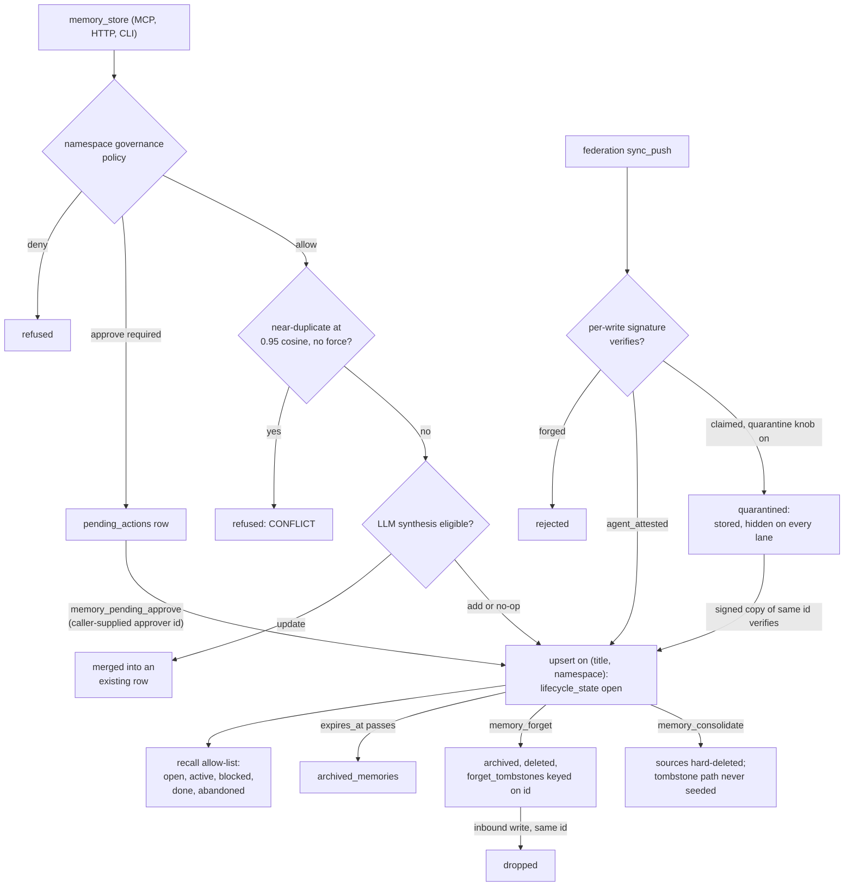

## 1. Executive Summary

ai-memory is a single Rust binary that serves persistent memory to coding
agents over MCP, an HTTP daemon and a CLI, on SQLite or an optional Postgres
backend. A memory is a titled row with a tier (`short` 6 hours, `mid` 7 days,
`long` permanent), a namespace, a visibility scope and a lifecycle state.
Recall blends FTS5 with embeddings, and the session-start hook injects the
namespace's top rows.

What is notable is the read-side discipline. One fail-closed allow-list of
lifecycle states is applied to recall, search, list, export, federation
catch-up and graph traversal, with one negative test per lane. Federated
writes without a verified author signature can be quarantined: stored, hidden
everywhere, and released when a signed copy arrives.

What is weak is the distance between what is resolved from configuration and
what is wired. The append-only revision ledger, consolidation tombstones and
the signed-approval quorum route each exist with tests and no production
caller. The MCP approve tool accepts the approver's identity as a parameter
and, by default, lets a requester approve its own queued action.

The project is Apache-2.0 with a contributor licence agreement (`CLA.md`)
and no rider on the licence text.

The surface is large: 101 MCP tools across eight families, governance rules,
leases, signals, routines, skills, personas, transcripts, federation with
mTLS and signed events, and a curator. This report covers the memory row:
how it is written, recalled, scoped, corrected and forgotten, and the trust
and review mechanisms around it. The action, routine, lease and signal planes
are coordination machinery and are read only where they touch memory.

Three marks: `trust_state`, `audit_log` and `negative_eval`. Section 9 names
the four withheld, `scope_enforced` among them: the session-start hook widens
to every namespace when the current one is empty.

## 2. Mental Model

A memory becomes a belief when `memory_store` commits a row; the local path
has no candidate state. Three gates can stop the write first. A namespace
governance policy can deny it or queue it as a `pending_actions` row. An
embedder-backed check refuses a write whose nearest neighbour is at least
0.95 cosine with different content, unless `force=true`
(`src/mcp/tools/store/mod.rs:718-765`). With an LLM and `autonomous_hooks`,
a synthesis pass can merge the write into an existing row or delete a
candidate instead (`:540-640`).

**Identity is the title within a namespace.** A unique index on
`(title, namespace)` makes a second store with the same title an update
(`src/storage/migrations.rs:222`). The upsert keeps the higher confidence,
priority and tier of the two rows (`src/storage/mod.rs:868-890`), so
re-storing a fact with lower confidence does not lower it. Correction is
`memory_update` with an optional `expected_version`.

**A memory stops being one in five ways.** It expires: `short` and `mid`
rows carry `expires_at`, and GC moves expired rows to `archived_memories` by
default. It is forgotten: `forget` archives, deletes, and writes a
`forget_tombstones` row keyed on the memory id. It is consolidated, which
hard-deletes the sources (section 7). A synthesis verdict deletes it. Or the
system sets a hidden lifecycle state.

**The lifecycle field carries two axes.** `open`, `active`, `blocked`,
`done` and `abandoned` are a work-item lifecycle a caller can move
(`src/models/memory.rs:439-450`). `tombstoned` and `quarantined` are
system-only: `validate_lifecycle_state` refuses them as input, and no caller
transition reaches them (`src/validate.rs:1047-1065`). Every read lane admits
only the first five (`src/models/memory.rs:472-520`).

**Quarantine is the only state that means "not yet believed".** A memory
relayed by a federation peer is stamped `claimed` or `agent_attested`
according to whether its per-write signature verified against the author's
enrolled key. With `AI_MEMORY_FED_QUARANTINE_UNATTRIBUTED=1`, a `claimed` row
is stored as `quarantined` (`src/handlers/federation_receive.rs:492-517`).
When a signed copy of the same id later verifies, the receive path clears it
back to `open` (`:1404-1412`). Local writes are believed on arrival.

Everything else that sounds epistemic ranks or decorates. `confidence` is a
float in the score. `confidence_tier` (`confirmed`, `likely`, `ambiguous`) is
derived from it and is an optional caller filter. `provenance_tier` and the
lineage `propagated_trust_tier` are labels on output; the code calls the
first *"decoration only — it is NOT a ranking key"*
(`src/mcp/tools/recall.rs:375`).

## 3. Architecture

The crate builds one binary, `ai-memory`, with subcommands for the stdio MCP
server (`run_mcp_server`, `src/mcp/mod.rs:3329`), the HTTP daemon
(`ai-memory serve`, bootstrapped in `src/daemon_runtime.rs`), the CLI verbs,
and `boot`, `curator`, `doctor` and `install`. `src/storage/mod.rs` (24,456
lines) is the SQLite substrate. `src/store/postgres.rs` (26,603 lines) is the
Postgres twin behind the `sal` feature, with Apache AGE for graph queries.
This reading followed the SQLite path.

**Persistence.** One SQLite file at schema version 81, built by a bootstrap
`SCHEMA` constant plus a migration ladder (`src/storage/migrations.rs`).
`memories` carries an FTS5 shadow table over title, content and tags
(`:466-472`) and an `embedding` BLOB. Beside it sit `memory_links` with
validity columns, `archived_memories`, `pending_actions`,
`forget_tombstones`, `signed_events`, `recall_observations`,
`memory_revisions`, `governance_rules`, quotas and the coordination tables.

**Retrieval stack.** FTS5 always. The `semantic` feature tier adds a local
MiniLM embedder through Candle and an in-process HNSW index, warmed in a
background thread at MCP start (`src/mcp/mod.rs:3765-3795`). `autonomous`
adds a cross-encoder reranker. The `smart` and `autonomous` tiers also take
an LLM backend: Ollama by default, or one of the hosted providers named in
`[llm]`.

**Background work lives in the daemon.** `bootstrap_serve` spawns the
access-fold loop (default every 60 seconds), the GC loop, lease sweeps and
the federation DLQ replays (`src/background/access_fold.rs:4-21`). The stdio
MCP server spawns only the HNSW warm thread. Section 7 states what that
costs.

### Deployment and ergonomics

The documented install is a prebuilt binary from `install.sh`, then
`ai-memory install claude-code` to write the SessionStart hook. The MCP
server opens the SQLite file directly, so nothing else has to run, and the
`keyword` tier needs no model and no key. Semantic recall needs a local
model download. Synthesis, auto-tagging and contradiction detection need an
LLM endpoint.

The store is SQLite, inspectable with `ai-memory list`, `get`, `export` or
SQL. Encryption at rest is a sqlcipher build plus an envelope column, off by
default. The configuration surface is large: the `asi-hard` profile alone
pins twelve environment knobs (`src/security_profile.rs:37-50`), and several
flags the documentation describes as live are never seeded (section 9).

## 4. Essential Implementation Paths

**Store (MCP).** `handle_store` (`src/mcp/tools/store/mod.rs:281`) validates
the request and runs the permission rules and `db::enforce_governance`
(`:466-500`). It fetches near candidates, runs the synthesis pass when
eligible (`:585-640`), then the exact-title dedup update (`:650-716`), the
proactive conflict check (`:718-765`) and the per-agent quota (`:775-787`).
`db::insert` (`src/storage/mod.rs:769`) applies the record-stop fence, the
optional governance pre-write hook, the secret-screen redaction backstop,
and the upsert (`:868-890`). The handler emits a `Store` audit event
(`store/mod.rs:848`).

**Recall.** `handle_recall_dto` (`src/mcp/tools/recall.rs:881`) first runs
`db::gc_if_needed` (`:981`). It resolves the namespace from the argument or
a `session_default` scope (`:1010-1012`), then calls `db::recall` or
`recall_hybrid`. The FTS query is `src/storage/mod.rs:5398-5433`; the hybrid
path is `recall_hybrid_precomputed_hnsw` (`:12882`) with `blend_and_rank`
(`:13559-13618`). After retrieval the handler applies the optional
`confidence_tier` filter and the private-scope filter (`recall.rs:957-982`),
decorates rows, and writes one `recall_observations` row per candidate
(`:702-752`).

**Session start.** `ai-memory boot` (`src/cli/boot.rs:493`) resolves the
namespace from `--namespace`, `[storage].default_namespace` or the git root,
and lists it. When the list is empty it falls back to the most recent `long`
rows across all namespaces (`:204-243`).

**Forget.** `forget` (`src/storage/mod.rs:3907`) requires a namespace,
pattern or tier, and archives and deletes the match set in one `BEGIN
IMMEDIATE`. `purge_and_tombstone_forget` writes a signed `forget_tombstones`
row per victim, crypto-erases the envelope and scrubs `cid_genesis`
(`:3494-3615`). `insert_if_newer`, the federation merge, drops any inbound
row whose id is tombstoned (`:11522-11530`).

**Consolidate.** `consolidate` (`src/storage/mod.rs:6706`) mints one row from
N sources with `metadata.derived_from`, and hard-deletes the sources unless
`consolidate_tombstone_sources_enabled()` (`:6946-6984`).

**Governance.** `enforce_governance` returns allow, deny or a pending id.
`approve_with_approver_type` (`src/storage/mod.rs:15268`) resolves the
namespace's approver type — Human, a named Agent, or Consensus of N
registered agents — and `execute_pending_action` replays the payload.

**Federation receive.** `sync_push` (`src/handlers/federation_receive.rs:830`)
checks the peer, nonce and per-write attestation, applies
`maybe_quarantine_unattributed` (`:1309`), charges the storage quota and
calls `db::merge_inbound` (`:1404`).

**Graph.** `memory_link`, `memory_kg_query`, `memory_kg_timeline` and
`memory_kg_invalidate` work over `memory_links`. `kg_query` is a recursive
CTE with a `valid_at` filter (`src/storage/mod.rs:8742-8762`).

## 5. Memory Data Model

| Field | Notes |
| --- | --- |
| `id` | UUID primary key; every foreign key and the federation tiebreak |
| `title`, `namespace` | unique together; the dedup identity |
| `tier`, `expires_at` | `short` 6 h, `mid` 7 d, `long` none (`src/models/memory.rs:852-858`) |
| `priority`, `confidence`, `confidence_source` | 1–10 and 0–1; the source names caller, derived, calibrated or decayed |
| `access_count`, `last_accessed_at` | written by the fold, never by recall |
| `memory_kind`, `kind_provenance` | sixteen kinds, among them `observation`, `reflection`, `persona`, `goal`, `told`, `instruction` |
| `lifecycle_state` | five caller states plus system-only `tombstoned` and `quarantined` |
| `metadata` | JSON: `agent_id`, `scope`, `attest_level`, `derived_from`, contradiction flags |
| `citations`, `source_uri`, `source_span` | first-class provenance pointers |
| `version` | optimistic-concurrency counter, bumped on every update |
| `cid`, `cid_genesis` | BLAKE3 content address of the genesis row; the pre-image is nulled on forget |
| `valid_from`, `valid_until` | claim-validity window with no writer and no reader (section 9) |

Schema at `src/storage/migrations.rs:52-191`.

**Scope is two keys.** `namespace` is a `/`-separated path; a hierarchical
query expands to the ancestor chain with a proximity boost.
`metadata.scope` is `private`, `team`, `unit`, `org` or `collective`, indexed
through a generated `scope_idx` column. Private visibility is keyed on the
owner's `agent_id` rather than on the namespace (`src/storage/mod.rs:197-245`).

**Provenance is rich and mostly self-asserted.** `agent_id` is preserved
across upserts. On the local path it is whatever `resolve_agent_id` returns:
an explicit parameter first, then `AI_MEMORY_AGENT_ID`, then a synthesized
`ai:<client>@<host>` (`src/identity/mod.rs:241-301`).
`AI_MEMORY_REQUIRE_AGENT_ATTESTATION` makes unsigned direct writes refusable;
only `asi-hard` pins it on.

## 6. Retrieval Mechanics

The keyword score adds the negated FTS5 rank, `priority * 0.5`,
`min(access_count, 50) * 0.1`, `confidence * 2.0`, a tier bonus of 3 for
`long` and 1 for `mid`, and a recency term on `updated_at`
(`src/storage/mod.rs:5398-5413`). The hybrid score is
`w * cosine + (1 - w) * normalized_fts`. `w` falls linearly from 0.50 at 500
characters of content to 0.15 at 5,000, and the product takes a decay factor
(`:13578-13600`).

Every lane applies the same filters: namespace or ancestor set, unexpired,
tags, a `created_at` window, archived-source exclusion, visibility, and the
lifecycle allow-list. The HNSW branch loads rows by id and re-applies each
filter in Rust (`:13367-13412`), so a candidate from the ANN walk cannot skip
them.

**An omitted namespace means every namespace.** `namespace` is optional on
`memory_recall` and on the storage function, and `?2 IS NULL OR m.namespace
= ?2` matches all rows when it is absent (`recall.rs:1010-1012`;
`storage/mod.rs:5417`). The `as_agent` position governs team, unit and org
visibility; it does not narrow the namespace.

**Session-start injection ignores relevance.** `boot` lists the namespace by
`priority DESC, updated_at DESC` (`src/storage/mod.rs:40-41`), with limit 10
and a 4,096-token budget in the installed hook. The list query carries the
lifecycle allow-list and no visibility predicate (`:4619-4669`). An empty
namespace triggers the cross-namespace `long` fallback
(`src/cli/boot.rs:205-241`): the read widens to every namespace's most
recent `long` rows instead of returning nothing. The injected header says
so in one line (`:447-450`); nothing stops the rows from reaching the
prompt.

Recall writes nothing to `memories`. Access counts, TTL extension and
promotion from `mid` to `long` at five accesses (`src/models/mod.rs:51`)
come from folding `recall_observations` later.

## 7. Write Mechanics

Writes are explicit and synchronous. The agent calls `memory_store`; nothing
extracts memories from conversation on the default path.
`memory_capture_turn` and a transcript store exist as a capture backstop,
and a stderr nag fires when an agent goes five calls without storing. A row
is retrievable by FTS on commit, and the embedding is computed inline when
an embedder is wired.

**Deduplication is by title, then by meaning.** An exact title in the
namespace updates in place and returns `duplicate: true`. A near-duplicate
with different content is refused, which turns a contradiction into an error
the agent resolves with `force` or `memory_update`. Under the `autonomous`
tier the LLM synthesis pass may merge or delete instead. Its deletes are
re-checked against the delete permission rule and capped at one per call by
default (`src/mcp/tools/store/mod.rs:540-565`).

**Consolidation destroys its sources.** The function comment says it
*"Hard-DELETEs the source memories"*, keeping their ids in
`metadata.derived_from` (`src/storage/mod.rs:6695-6705`). The alternative,
which keeps them as `tombstoned` rows behind `derived_from` edges, is gated
on a flag nothing seeds (section 9). The `trust.rs` module header records
that consolidation mints its result at `confidence = 1.0`
(`src/trust.rs:8-12`).

**Forget is id-keyed.** The archive copy survives until `archive_purge` or
`auto_purge_archive`. Re-storing the same text creates a new row; the
tombstone stops only a peer re-sending the old id.

### Operational cost

- Write: synchronous. The keyword tier costs one transaction; the semantic
  tier adds one embedding per store. The autonomous tier adds an LLM
  synthesis call, plus optional auto-tag and contradiction calls, before the
  reply.
- Lag: none on FTS. The HNSW insert is immediate in the writing process.
- Background: the daemon folds access every 60 seconds and runs GC. The
  stdio MCP server runs neither. `ai-memory gc` folds first, and its comment
  calls the CLI-only gap a *"documented deferral"* (`src/cli/gc.rs:20-29`).
- Expiry without the fold: `handle_recall_dto` calls `gc_if_needed` without
  folding. In a stdio-only setup a `mid` row therefore expires after seven
  days however often it is recalled, and goes to the archive. This was read,
  not run.
- Read: recall returns at most `limit` rows under an optional token budget.
  Boot injects at most 10 rows and 4,096 tokens as installed.

## 8. Agent Integration

The MCP server advertises 7 tools under the default `core` profile — store,
recall, list, get, search, `load_family` and `smart_load` — plus the
always-on `memory_capabilities`. The `graph`, `admin`, `power` and `full`
profiles add the rest, up to 101 (`src/profile.rs:670-674`). A call to a
tool outside the active profile is refused as unknown
(`src/mcp/mod.rs:2741-2775`), and the profile is fixed at start.

`ai-memory install claude-code` writes a SessionStart hook running
`ai-memory boot --quiet --limit 10 --budget-tokens 4096`
(`src/cli/install.rs:1006`), and `docs/integrations/` carries recipes for
twenty-odd hosts. The tree's own `CLAUDE.md` tells agents to call
`memory_store` first on any multi-step operator directive. That is the
intended posture: the model decides what to keep.

`docs/INSTALL.md` also offers `hooks/session-start.sh` as a manual
alternative. That script stores a `_ns_probe` memory on every session start
to learn the namespace, then runs `forget --pattern "_ns_probe"` with no
namespace (`hooks/session-start.sh:23-30`). The sanitizer phrase-quotes the
token, so the forget matches any row whose indexed text holds that phrase.
Read, not run.

## 9. Reliability, Safety, and Trust

**The read-side allow-list is the strongest design here.** Hidden states are
hidden by omission from a five-element allow-list, so an unknown future
state read by an older binary is hidden too. One function generates the SQL
fragment and one method mirrors it in Rust for the HNSW branch
(`src/models/memory.rs:404-420, 472-520`). The test block's header records
that before the allow-list, no SQL predicate excluded a `tombstoned` row
(`src/storage/mod.rs:24193-24198`).

**Three mechanisms are resolved from configuration and never seeded.**
`set_append_only`, `set_lineage_dag` and `set_consolidate_tombstone_sources`
have no caller outside tests (`src/config.rs:5543, 5585, 5599`). The daemon
bootstrap says why: the flags are *"DELIBERATELY NOT seeded into the
process-wide"* atomics, to keep unit tests order-independent
(`src/daemon_runtime.rs:1050-1069`). So `AI_MEMORY_APPEND_ONLY=1` writes no
`memory_revisions` leaf (`src/revisions.rs:401-424`), and consolidation
always hard-deletes. Flag-on integration tests pass by setting the atomic
directly (`tests/append_only_spine_flagon_g6.rs`).

**The signed-approval quorum has no producer.** `verify_quorum` checks m-of-n
Ed25519 signatures from enrolled approver keys over a domain-separated
pre-image (`src/approvals.rs:545-616`). `handle_pending_approve` enforces it
when a pending payload carries `requires_signed_approval`
(`src/mcp/tools/pending.rs:366-406`). Only `route_escalation_to_approval_gate`
stamps that key, and its one caller is `tests/r40_airgapped_approval.rs:208`.

**Federation is the most defended boundary.** It has peer enrollment, mTLS
pins, a persisted nonce cache, per-write signatures and tombstone-wins on
forgotten ids. A relayed `updated_at` is clamped, and inbound `attest_level`
is reset to `claimed` before the merge tiebreak
(`src/storage/mod.rs:11806-11830`). The quarantine knob defaults off
(`src/federation/receive_auth.rs:436-440`), so a default receiver shows
unattested relayed memories as believed.

**Data loss.** Archive-on-GC defaults on, and boot warns when it is disabled
(`src/config.rs:7544-7552`). Consolidation and synthesis deletes do not
archive.

**Uncertainty is representable only for federated rows.** A local agent's
store is believed at once, and `confidence` ranks without filtering by
default.

Capability marks:

- `trust_state` — awarded on the quarantine state, with the limits in the
  frontmatter record. The state withholds, a verified signature releases it,
  and a forged signature is refused at the door.
- `scope_enforced` — withheld, because the session-start read widens on an
  empty result. `fetch_boot_memories` lists the resolved namespace and, when
  it is empty, lists the most recent `long` rows of all namespaces with no
  private-scope predicate (`src/cli/boot.rs:205-241`). The near-miss is
  recall: a `namespace` column with an equality predicate on every arm
  (`src/storage/mod.rs:5417`), owner-keyed private visibility
  (`:197-245`; `src/mcp/tools/recall.rs:957-982`) and a committed
  cross-agent test. Recall's own gap is that an omitted namespace means all
  of them.
- `audit_log` — awarded on the NDJSON trail, which is opt-in. The
  `signed_events` table is append-only and hash-chained, but it records
  link creation and invalidation, approvals and coordination events rather
  than memory writes. `memory_revisions` would be the in-database record and
  has no production producer.
- `negative_eval` — awarded; evidence in section 10.
- `tombstone` — withheld. `forget_tombstones` is keyed on `memory_id`, and
  its own comment says *"a legitimate re-create mints a NEW uuid,
  unaffected"* (`src/storage/mod.rs:3644-3657`). It stops a replica from
  resurrecting a record, not a writer from re-asserting a value.
- `bitemporal` — withheld. The memory-level `valid_from` and `valid_until`
  columns (`src/storage/migrations.rs:185-191`) are absent from the `Memory`
  struct and from every insert and select. On links, `valid_from` is the
  insert clock (`src/storage/mod.rs:6216, 6295`), and `memory_kg_invalidate`
  overwrites `valid_until` in place (`:8457-8470`). A link's validity can end
  apart from record time; it cannot start apart from it.
- `human_review` — withheld. `memory_pending_approve` is a registered MCP
  tool, loaded under the `admin` and `full` profiles. Its handler takes the
  approver from the `agent_id` parameter (`src/mcp/tools/pending.rs:350`)
  and calls the `LocalOperator` surface (`:412`). There the self-approval
  check runs only when `AI_MEMORY_AGENT_ID` is set
  (`src/storage/mod.rs:15320-15336`). A committed test asserts that the
  default accepts self-approval (`:23183-23206`). With the variable set, the
  approver must be a registered agent, and `memory_agent_register` is on the
  same server. The verified-principal path is the unwired quorum above.

## 10. Tests, Evals, and Benchmarks

Nothing was built or run for this report; everything below is from reading
the tests at the pin.

**The negative cases.** `seed_lifecycle_corpus` inserts three rows sharing
the token `widget` and plants `tombstoned` and `quarantined` on two of them
with a raw `UPDATE` (`src/storage/mod.rs:24200-24221`). Six tests, one per
lane — recall, search, list, `export_all`, `memories_updated_since` and
`list_by_source_uri` — assert the open row present before asserting the
other two absent (`:24224-24351`).

`a2a_3_scoped_recall_collective_visible_private_isolated` asserts that a
cross-agent search returns exactly 2 collective rows and 0 private ones, then
that the owner sees all 5 (`tests/a2a_campaign_round1.rs:382-488`). CI runs
`cargo test --lib` on every configuration (`.github/workflows/ci.yml:386-390`).

**Tests that pin a gap.** The self-approval test above asserts the
permissive default. The quarantine helper is tested on its own
(`src/handlers/federation_receive.rs:2798-2825`). No test found in this
reading drives a relayed unattested write through `sync_push` to a hidden
recall.

**Benchmarks.** `benchmarks/longmemeval/results.md` reports LongMemEval-S
over 500 questions from a harness that drives the shipped binary: R@5 of
96.4% for keyword, 96.8% for semantic and 95.8% for autonomous. It labels the
earlier 97.8% headline as coming from a shadow harness that re-implements
scoring outside the binary. The raw per-run files are cited under
`.local-runs/`, which is not in the tree, so no figure recomputes from the
repository. The README's coverage, certification and compliance badges link
to hosted pages that were not opened.

**No paper.** The arXiv references in the tree cite other work, such as
CoALA and reviews of external papers, and there is no `CITATION.cff`.

## 11. For Your Own Build

### Steal

- **Make read visibility an allow-list generated from one constant.** A new
  state stays hidden until someone adds it, and the SQL and in-memory filters
  cannot drift because both derive from the same slice.
- **Write one negative test per read lane, seeded with a visible control.**
  Six lanes share one three-row fixture, and each asserts the positive case
  first.
- **Quarantine rather than reject when provenance is missing.** The bytes
  converge across replicas, only the local view hides them, and a later
  verified copy releases them without a person.
- **Key the forget tombstone on the id and check it before any merge.** It
  closes last-writer-wins resurrection, the usual deletion leak in
  replicated stores.
- **Refuse near-duplicate contradictions at write time**, and make the
  caller say `force`.

### Avoid

- **Behaviour flags whose seeding is deferred for test isolation.** The
  config resolves them, the docs describe them, flag-on tests pass by
  setting the atomic, and the production binary never turns them on.
- **An approver identity taken from the request.** A parameter is a claim; a
  human gate needs a principal the producing agent cannot type.
- **An optional scope argument that widens to everything when omitted.**
  Default it from the session on every read tool, as `boot` does.
- **An upsert that keeps the maximum confidence.** It makes a downward
  correction by re-store impossible.

### Fit

This suits an operator who wants one local binary that every MCP host can
share. Keyword recall works offline, and the design grows into multi-agent
or multi-node deployment with real federation controls. The cost is
surface: 101 tools, a twelve-knob hardened profile, eight tool families, and
flags whose documented effect has to be checked against the bootstrap. A
single developer who wants memory and nothing else will configure and learn
far more than they use. A team that needs reviewed memory should not rely on
the pending queue as shipped. Anyone running only the stdio server should
schedule `ai-memory gc` or run the daemon.

## 12. Open Questions

- Does the Postgres backend's approve path carry the same `LocalOperator`
  default? Only the SQLite path was read.
- Is there an operator route to dequarantine a row whose author never
  re-signs? `dequarantine` has two callers, both on federation receive.
- How do the HTTP routes authenticate `X-Agent-Id` in a default daemon, and
  can an agent holding the API key reach the approve route?
- Does any host integration schedule `ai-memory gc` for stdio-only installs?
- What do the hosted coverage and certification pages measure?

## Appendix: File Index

- **Schema and storage:** `src/storage/migrations.rs`, `src/storage/mod.rs`,
  `src/models/memory.rs`, `src/models/mod.rs`, `migrations/sqlite/`.
- **Write path:** `src/mcp/tools/store/mod.rs`,
  `src/mcp/tools/store/synthesis.rs`, `src/validate.rs`,
  `src/secret_screen.rs`, `src/quotas.rs`.
- **Retrieval:** `src/mcp/tools/recall.rs`, `src/storage/mod.rs:5269-5524,
  12827-13760`, `src/hnsw.rs`, `src/reranker.rs`, `src/cli/boot.rs`.
- **Lifecycle and forgetting:** `src/storage/mod.rs:1754-2031, 3494-3700,
  3907-4140, 6706-6990, 10502-10705`, `src/revisions.rs`,
  `src/config.rs:5531-5610`.
- **Trust and governance:** `src/handlers/federation_receive.rs`,
  `src/federation/receive_auth.rs`, `src/security_profile.rs`,
  `src/trust.rs`, `src/approvals.rs`, `src/mcp/tools/pending.rs`,
  `src/storage/mod.rs:15220-15420`, `src/identity/mod.rs`.
- **Audit:** `src/audit.rs`, `src/signed_events.rs`, `src/main.rs:105-125`,
  `src/mcp/mod.rs:140-200`.
- **Integration:** `src/mcp/mod.rs`, `src/mcp/registry.rs`, `src/profile.rs`,
  `src/cli/install.rs`, `hooks/session-start.sh`, `docs/integrations/`.
- **Background:** `src/background/access_fold.rs`, `src/daemon_runtime.rs`,
  `src/cli/gc.rs`, `src/curator/mod.rs`.
- **Tests and benchmarks:** `src/storage/mod.rs:24193-24460`,
  `tests/a2a_campaign_round1.rs`, `tests/append_only_spine_flagon_g6.rs`,
  `tests/r40_airgapped_approval.rs`, `benchmarks/longmemeval/`.

### Recorded searches

Checked against the checkout at the pinned revision.

- `rg -n 'set_lineage_dag|set_append_only|set_consolidate_tombstone_sources' --type rust .` — definitions in `src/config.rs`, a comment in `src/daemon_runtime.rs:1065`, and calls only under `tests/`.
- `rg -n 'route_escalation_to_approval_gate' --type rust .` — the definition, a comment at `src/approvals.rs:862`, and `tests/r40_airgapped_approval.rs`.
- `rg -n 'valid_from|valid_until' src/models/memory.rs src/mcp/tools/store/ src/handlers/create.rs` — no match; `awk` over `src/storage/mod.rs:769-1106`, the insert, finds none either.
- `rg -n 'fold_recall_accesses|access_fold' src/mcp/` — no match; the callers are `src/background/access_fold.rs`, `src/daemon_runtime.rs`, `src/handlers/admin.rs` and `src/cli/gc.rs`.
- `rg -n 'store\.dequarantine|db::dequarantine' src --type rust` — `src/handlers/federation_receive.rs:1411` and `src/handlers/federation_signing_check.rs:351` only.
- `rg -n 'Tombstoned\.as_str' src --type rust` — `src/storage/mod.rs:6972` inside the flag-gated consolidate branch, and the Postgres twin.
- `rg -n -i 'CREATE TABLE IF NOT EXISTS [a-z_]*(tombstone|reject|suppress|block|deny)' src migrations` — only `forget_tombstones`.
- `rg -n 'propagated_trust_tier\(|transitive_suspects\(' src --type rust` — callers in `src/mcp/tools/lineage.rs` and `src/mcp/tools/dependents_of_invalidated.rs`, both reporting tools.
- `grep -rliE 'arxiv|bibtex|@article|@misc|doi\.org' . --exclude-dir=.git` — eighteen documents citing external papers; no `CITATION.cff`.
- `ls .local-runs` — absent from the checkout.

## History

**2026-10-03** — [`948fe9995f287942a8f6b917d83a362290698ee4`](https://github.com/alphaonedev/ai-memory-mcp/commit/948fe9995f287942a8f6b917d83a362290698ee4) — first reading, at the head of `main`, a commit dated 2 October 2026. Three marks: `trust_state`, `audit_log`, `negative_eval`; `scope_enforced` withheld on the boot fallback. Screened before reading: 3 auto-run surfaces (`.claude/settings.json`, an LSP block and a write deny-list with no hook command; `hooks/session-start.sh`; the `server.json` MCP manifest), 3 build-time execution points (three deploy `Makefile`s), 13 dependency files inside the cooldown — every file in a depth-1 clone dates to the tip — and 3 unpinned surfaces; `CLAUDE.md` was treated as data. Read with `rg` and `sed`; nothing installed, built or run.
