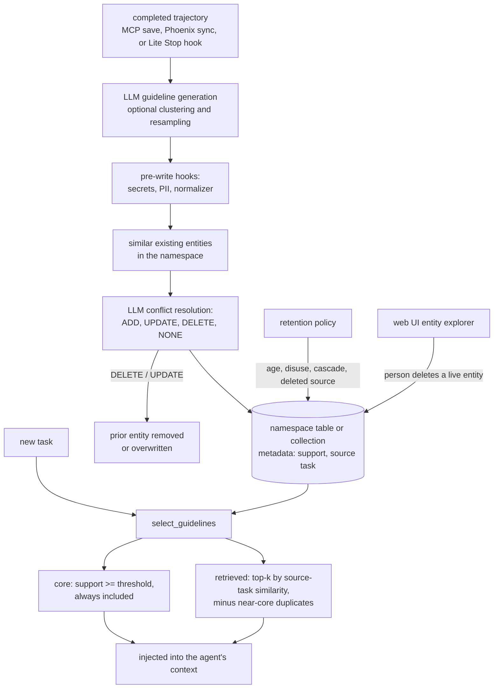

## 1. Executive Summary

ALTK-Evolve is IBM Research's system for agents that learn on the job. Apache-2.0,
246 commits since 12 December 2025, about 17,000 lines in `altk_evolve/` and 1,319
test functions, with a paper, *Trajectory-Informed Memory Generation for
Self-Improving Agent Systems*
([arXiv:2603.10600](https://arxiv.org/abs/2603.10600), March 2026).

The unit of memory is a **guideline**: an actionable lesson an LLM extracts from a
completed task trajectory — what worked, what failed, what to check next time.
Guidelines are merged into a store by LLM conflict resolution and injected into
later tasks. Two products share that idea:

- **The Evolve server** — an MCP server with a web UI and REST API over a
  pluggable backend (PostgreSQL with pgvector, Milvus, or files), a Python client,
  Phoenix trace sync, a retention engine and memory hook plugins.
- **Evolve Lite** — plugins for Claude Code, Codex, Claw Code and IBM Bob that
  inject stored entities on each prompt and run a `learn` skill from a Stop hook
  after every task, keeping each entity as a Markdown file in `.evolve/entities/`.

Two design choices stand out. **Dosage-aware retrieval**
(`llm/guidelines/retrieval.py`) always includes *core* guidelines whose support
count shows they recurred across tasks, and adds up to `top_k` more from the
source tasks most similar to the current one, dropping candidates the core
already covers — the project's argument, in its August 2026 article, that memory
should be calibrated to the model rather than simply increased. And **hooks are
template methods** (`backend/base.py`): public reads, writes, deletes and
namespace deletes fire policy hooks and delegate to protected `_impl` methods, so
a backend cannot skip a secret scanner, a PII redactor or a legal hold by
overriding the wrong method.

The published result is AppWorld: with the top five retrieved guidelines from one
prior run, a ReAct agent's scenario goal completion on unseen test tasks rose from
50.0% to 58.9%, and on hard tasks from 19.1% to 33.3% (`docs/results/index.md`).
The run artifacts behind those numbers are not committed.

The store forgets destructively. Conflict resolution can DELETE or overwrite an
entity by id, and nothing on the server side records what it replaced.

One mark: `negative_eval`.

## 2. Mental Model

A trajectory becomes guidelines, and guidelines become a curated set:

`support` is how a guideline earns standing: a count carried in metadata that
decides membership in the always-on core and, through `min_support`, which
candidates retrieval considers at all. It is a number, not a status that marks a
guideline true or withdrawn, so `trust_state` is withheld. There is no
point-in-time read and no validity interval, so `bitemporal` is withheld.

## 3. Architecture

| Area | Where | Role |
| --- | --- | --- |
| Backends | `backend/base.py`, `postgres.py`, `milvus.py`, `filesystem.py` | Namespaces and entities; hook-wrapped template methods |
| Guidelines | `llm/guidelines/` | Generation, clustering, consistency analysis, retrieval |
| Conflict resolution | `llm/conflict_resolution/conflict_resolution.py` | LLM decisions over similar entities |
| Hooks | `hooks/manager.py`, `hooks/plugins/` | Access stamp, legal hold, normalizer, regex PII, READI semantic PII, secrets |
| Retention | `retention/` | Policies, rules, engine, scheduled jobs, run reports |
| Server | `frontend/mcp/mcp_server.py`, `frontend/api/`, `frontend/ui/` | MCP tools, REST, React UI |
| Sync | `sync/phoenix_sync.py` | Importing trajectories from Arize Phoenix traces |
| Lite | `platform-integrations/`, `plugin-source/` | Generated plugins per host with hooks, skills and a shared library |

The PostgreSQL backend creates one table per namespace (`backend/postgres.py:154`),
and Milvus a collection; namespaces are physical partitions. Entities marked
`public` can be discovered across namespaces.

### Deployment and ergonomics

- **Server:** Python 3.12, `uv sync`, an OpenAI key or a LiteLLM proxy, and a
  backend. The default filesystem backend matches text and needs no database;
  semantic search needs pgvector or Milvus. The UI requires an `npm ci` build.
- **Lite:** install the plugin into the host; learning runs the host's own model
  after every task, and the README warns of up to two minutes of delay per
  interaction and API cost unless the Stop hook is narrowed or removed.
- **Hand-repairable:** the Lite store is Markdown files; the server stores are
  databases with a UI for browsing and deleting.

The screen of this checkout found one auto-run surface (a `.claude-plugin/`
marketplace definition), three build-time execution points, two unpinned
surfaces, two manifests inside the seven-day cooldown, and `AGENTS.md` read as
data. Nothing was installed or run.

## 4. Essential Implementation Paths

- **Hooked template methods** — `BaseEntityBackend.search_entities`,
  `delete_namespace` and the write and delete paths in `backend/base.py`, each
  dispatching `memory_post_read`, `memory_pre_write`, `memory_pre_delete` or
  `memory_pre_namespace_delete` before the `_impl`. Internal reads for conflict
  resolution call `_search_entities_impl` directly and fire no hook.
- **Guideline generation** — `llm/guidelines/guidelines.py` (prompt template
  `prompts/generate_guidelines.jinja2`), with `consistency_guidelines.py` adding
  step resampling and uncertainty annotations.
- **Conflict resolution** — `conflict_resolution.py`, returning `EntityUpdate`
  records with an `event` of ADD, UPDATE, DELETE or NONE and the `old_entity`
  text for the prompt; sticky metadata such as `generation_method` survives an
  update.
- **Guideline selection** — `select_guidelines` in `retrieval.py`: core by
  `core_support`, retrieved by source-task similarity with a near-core threshold
  and deduplication, `min_support` as a non-destructive filter.
- **Retention** — `retention/engine.py` evaluates age, disuse from
  `metadata.last_accessed`, provenance cascades from a session's `trace_id`, and
  deleted sources; a rule matching on a missing access stamp skips by default
  and says why in the report.
- **Sharing** — `publish_entity` and `unpublish_entity` in the MCP server set
  `visibility`, `owner_id` and `published_at`; `get_public_entities` discovers
  public entities across namespaces.
- **UI delete** — `EntityExplorer.tsx:28`, `routes.py:185`. A person browses a
  namespace's entities, opens one, creates one and deletes one behind a
  confirmation, through the same backend template methods the agent's own writes
  use — so a legal-hold plugin can veto the delete either way. This is a
  correction surface over live entities and not a review gate, which is why the
  report does not carry `human_review`: nothing is withheld pending anyone's
  decision. The retention queue described in section 9 is the nearest thing to a
  waiting state, and what waits there is a *deletion*, not an admission.

## 5. Memory Data Model

`Entity`: `content` (string, list or dict), `type`, `metadata`;
`RecordedEntity` adds `id` and `created_at` (`schema/core.py:19-37`). Metadata
conventions carry what the design depends on: `support`, `task_description` for
the source task, `trace_id` or `task_id`, `source_task_id` on derived entities,
`owner_id`, `visibility`, `published_at`, `last_accessed`, `generation_method`.

Retention state lives in `evolve_retention_policies`, `evolve_retention_runs`
with a JSON report per run, `evolve_retention_schedules`,
`evolve_retention_jobs` and `evolve_retention_deleted_sources`. The deleted-source
table records source ids whose derived memories a rule may remove; it is keyed on
a source, not on a rejected value, so `tombstone` is withheld.

**Scope** is the namespace, a separate table or collection, so it is a physical
partition rather than a key on a record. The public-discovery path filters on
`visibility`, which an agent can set through the publish tool.
`scope_enforced` is withheld.

## 6. Retrieval Mechanics

On the server, `get_relevant_guidelines` and the namespace search rank by vector
similarity on pgvector or Milvus, or by text matching on the filesystem backend.
`select_guidelines` is the part the evaluation depends on: similarity is computed
between the current task and each guideline's *source task* by default, so a
lesson is chosen because it came from a task like this one rather than because
its wording matches. Each read through the public API fires `memory_post_read`,
which the access-stamp plugin uses to record `last_accessed` for retention.

In Lite, the prompt hook loads every entity file and injects them all; the
dosage logic is the server's.

## 7. Write Mechanics

Generation and conflict resolution are LLM calls. On the server they run inside
the save call; in Lite, the Stop hook asks the host agent to run `learn` after
every task, so the cost and delay land on the user's session. Retrieval of new
guidelines is immediate once the write returns.

Conflict resolution is the only correction mechanism. An UPDATE overwrites the
entity in place; a DELETE removes it through the backend; neither leaves a
revision on the server. Retention deletes go through the same public delete path,
so a legal-hold plugin can veto them, and each run writes a report of what was
flagged, deleted, skipped and why.

## 8. Agent Integration

MCP tools cover saving trajectories, getting guidelines with or without
attribution, relevant-guideline retrieval, listing and patching entities,
recording access, publishing and retention. The Lite plugins add skills for
save, publish, subscribe, sync, synthesize-skill, provenance and retention, with
shared guidelines treated as git-synchronised multi-reader, multi-writer stores.

## 9. Reliability, Safety, and Trust

**Policy hooks are structurally unavoidable** on the public paths, which is the
right place to put a secret scanner, two PII redactors (regex and a semantic NER
model, benchmarked in the plugin's own docstring at 0.13 against 0.48 span recall
on ai4privacy) and a legal hold.

**Retention is honest about its signals.** An `unused` rule without access stamps
degrades to age, and the engine refuses to delete on a missing stamp by default
and records the fallback rather than claiming to have measured disuse.

**Audit is partial.** The Lite library has an append-only `.evolve/audit.log`, but
its writers are publish, subscribe, sync, synthesize, retention and influence
logging; saving a learned entity does not append to it, and the server records
retention runs but not entity writes. `audit_log` is withheld.

**Injected guidance is trusted text.** A guideline extracted from a trajectory
that included a prompt-injected tool result is stored and injected like any
other; the hooks redact secrets and PII, not instructions.

## 10. Tests, Evals, and Benchmarks

1,319 test functions under `tests/unit`, `tests/e2e`, `tests/llm` and
`tests/platform_integrations`, covering backends, hooks and plugins, conflict
resolution, guideline generation, consistency analysis, retrieval selection,
retention and its CLI, the MCP server and REST API, Phoenix sync and sharing.
None was run for this report.

`test_entity_sharing_e2e.py:113-128` is the retrieval-exclusion case: a guideline
published from one namespace is asserted present in public discovery and a private
note written in another namespace asserted absent, and `:95-100` asserts an entity
returned to private leaves the public results. `test_retrieval.py:84-104` asserts
a near-core duplicate is dropped from retrieval while an unrelated candidate is
kept. That earns `negative_eval`.

**Benchmarks.** AppWorld results and the paper are described above; the per-task
runs are not in the tree. `explorations/agent-wiki/experiments/` does commit
metrics JSONL files and a results summary for a separate exploration.

## 11. For Your Own Build

### Steal

- **Dose guidance by support and source-task similarity.** Always-on core lessons
  plus a few from similar tasks beats injecting the whole playbook, especially for
  weaker models.
- **Make policy hooks template methods** so no backend can bypass them.
- **Let retention say why it did not delete**, and default to sparing an entity
  when the signal is missing.
- **Cascade from a session to what was derived from it** when a source is
  withdrawn.

### Avoid

- **LLM conflict resolution that deletes without a record.** Keep the superseded
  guideline, or at least log the decision with the text it replaced.
- **A Stop hook on every task by default.** The cost and latency are the user's.
- **Headline benchmark numbers without their runs in the repository.**

### Fit

This suits teams running agents on repeated task families — API workflows,
support procedures, coding conventions — who want the agent to accumulate
lessons and can run a backend and an LLM for extraction. The Lite plugins are the
low-friction way to try it on a coding agent. For factual user memory, auditable
correction or multi-tenant isolation beyond one table per namespace, it is not
the intended shape.

## 12. Open Questions

- **Where are the AppWorld run artifacts?**
- **Should conflict resolution keep what it deletes?**
- **Does Lite ever apply the server's dosage selection** instead of injecting every
  entity?

## Appendix: File Index

- `altk_evolve/backend/base.py`, `postgres.py`, `milvus.py`, `filesystem.py`
- `altk_evolve/llm/guidelines/guidelines.py`, `consistency_guidelines.py`, `retrieval.py`, `clustering.py`
- `altk_evolve/llm/conflict_resolution/conflict_resolution.py`
- `altk_evolve/hooks/manager.py`, `hooks/plugins/`
- `altk_evolve/retention/engine.py`, `store.py`, `collection.py`, `schedule_store.py`
- `altk_evolve/frontend/mcp/mcp_server.py`, `frontend/api/routes.py`, `frontend/api/memory.py`, `frontend/ui/src/components/EntityExplorer.tsx`
- `platform-integrations/claude/plugins/evolve-lite/`
- `docs/results/index.md`
- `tests/unit/test_entity_sharing_e2e.py`, `test_retrieval.py`, `test_retention.py`

**Searches behind the absence claims**

- `git grep -n "audit.append" -- platform-integrations` — publish, subscribe, sync, synthesize, retention and influence only
- `git ls-files | grep -i result` — no AppWorld run files

## History

**2026-09-19** — re-pinned to [`b81d64ee56d29f7492eb666bad4e60642eb92add`](https://github.com/AgentToolkit/altk-evolve/commit/b81d64ee56d29f7492eb666bad4e60642eb92add), 5 commits on and none of them under `altk_evolve/` — the fourteen changed files are docs, CI and pre-commit config. `human_review` is **withdrawn**, and the code did not change: the record described the entity explorer's browse, create and delete-behind-a-confirmation, which is authoring over live entities rather than a state a memory waits in. The retention candidate machine (`altk_evolve/retention/collection.py:227`, statuses `pending`, `held`, `review`, `deleted`) was tested as the alternative and is a governance queue for *deletions* — the entity is already in use while it waits, so it is not the admission gate the mark asks for. `negative_eval` stands, anchors re-verified verbatim: `test_public_entity_in_one_namespace_visible_from_another` publishes a guideline in one namespace, writes a private note in another, and asserts the first is in the cross-namespace public result and the second is not. Screened again first; a dependency surface was inside the cooldown, so nothing was installed and no suite was run.

**2026-09-15** — [`3361a7234a8dcac0c1216f7d4fda27a1342af8cf`](https://github.com/AgentToolkit/altk-evolve/commit/3361a7234a8dcac0c1216f7d4fda27a1342af8cf) — first reading, at a commit dated 14 September 2026. Screened before opening: one auto-run surface, three build-time execution points, two unpinned surfaces, two manifests inside the seven-day cooldown, and `AGENTS.md` read as data. Nothing was installed or run; the AppWorld figures are the project's published results, not reproduced.
