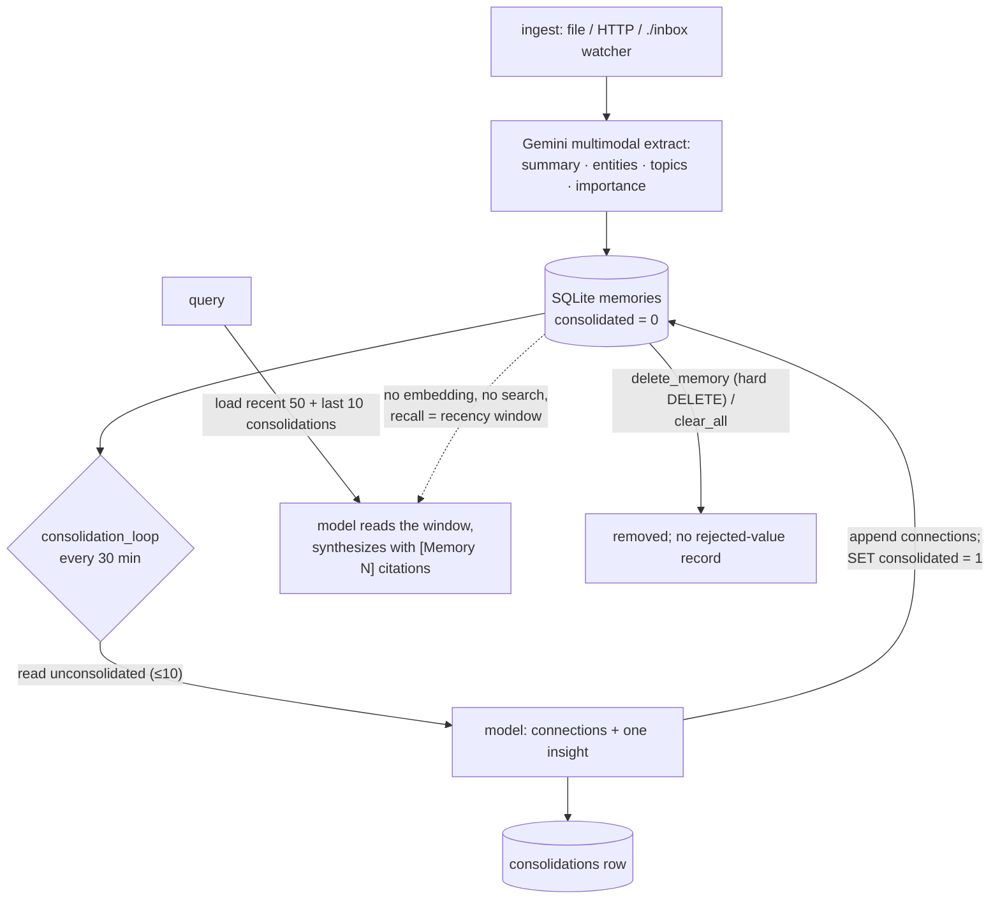

## 1. Executive Summary

The Always-On Memory Agent is a small MIT-licensed sample — about 1,000 lines of
Python (`agent.py` 677, `dashboard.py` 323) authored by Shubham Saboo and
included in Google's `generative-ai` samples repository — that is worth a report
because it commits, cleanly and on purpose, to a design most of this corpus argues
against. Its README states the bet in three sentences: *"No vector database. No
embeddings. Just an LLM that reads, thinks, and writes structured memory."* There
is no retrieval anywhere in the code. A memory is stored as a structured row in
SQLite, and when the agent is asked a question it loads the most recent fifty
memories plus the last ten consolidations into the context window and lets Gemini
synthesize an answer with citations. The model is the retriever.

The second commitment is the one the name points at. A background
`consolidation_loop` runs on a 30-minute timer, and — in the project's own analogy
to sleep — reads the memories not yet consolidated, has the model find connections
between them and one cross-cutting insight, writes that to a `consolidations`
table, appends the discovered links onto the source memories, and marks them
consolidated. This is a real always-on daemon doing active compression and
connection, not the batched summarization most systems here run at write time; it
is the closest thing in the corpus to the "replay and connect during sleep" framing
taken literally, on a clock, as its own process.

The design is honest about what it is and the atlas should be too: it earns **none
of the seven capability marks**, and the reasons are structural rather than
oversights. There is no scope key (one SQLite file, one user), no discrete trust
state (`importance` is a float, `consolidated` a processing flag), no bitemporal
axis, no audit log, and no rejected-value record — deletion is a hard `DELETE` by
id, so a claim a user removes returns the next time the same content is ingested
from a new path. And the "no retrieval" bet has a hard ceiling: recall is a
fifty-row recency window, so relevance is whatever fits, and the system is
built for a personal store measured in hundreds of memories, not a growing one.

What it is, then, is a clear, buildable illustration of an anti-RAG memory
architecture — structured capture, no embeddings, load-and-read query, and an
active consolidation daemon — from an official samples repository, with a
multimodal ingest path and a dashboard. It is a good thing to read for the shape;
it is not a store you would grow past the context window.

## 2. Mental Model

A memory is a structured note the model wrote about an input; recall is the model
reading a recent window of those notes.

```text
ingest (file / HTTP / inbox watcher)
  Gemini multimodal -> {summary, entities[], topics[], importance}
  store_memory -> memories row (raw_text, summary, entities, topics, importance, consolidated=0)

consolidate (every 30 min, always-on):
  read_unconsolidated_memories (WHERE consolidated=0, LIMIT 10)
  model finds connections + one insight
  store_consolidation -> consolidations row (source_ids, summary, insight)
                         append connections onto each source memory
                         UPDATE memories SET consolidated=1 WHERE id IN (...)

query:
  read_all_memories (ORDER BY created_at DESC LIMIT 50) + read_consolidation_history (LIMIT 10)
  model synthesizes an answer with [Memory N] citations   -- no search, no ranking
```

The unit is deliberately thin on epistemics and rich on structure. A `memories`
row carries `raw_text`, an LLM `summary`, JSON `entities` and `topics`, an
`importance` float, a `connections` list the consolidator fills in, a
`created_at`, and a `consolidated` boolean. There is no `status`, no
`superseded_by`, no scope column. The only two states a memory occupies are
*unconsolidated* and *consolidated*, and that is a processing flag — whether the
daemon has looked at it yet — not a judgement about whether it is true. Nothing in
the read path consults `importance` either; it is recorded and never ranked on.



## 3. Architecture

One SQLite file, one process, three specialist agents behind an orchestrator.

- **`agent.py`** (677) — the whole engine: the schema, the ADK tools, the three
  agents (`build_agents`), the file watcher, the consolidation loop, and an HTTP
  server.
- **`dashboard.py`** (323) — a Streamlit UI with Ingest, Query and Memory Bank
  tabs, memory cards, stats, upload and delete.
- **`docs/`**, `README.md`, `requirements.txt` — the sample's documentation.

**Storage.** `get_db()` creates three tables (`agent.py:83-107`): `memories`
(the notes), `consolidations` (`source_ids`, `summary`, `insight`, `created_at`),
and `processed_files` (`path` primary key, for the watcher's dedup). SQLite,
`node`-free, no extensions; there is no vector table and no FTS, by design.

**The agents** (`build_agents`, `:318`) are Google ADK agents on Gemini
Flash-Lite: an **IngestAgent** that extracts structure from multimodal input, a
**ConsolidateAgent** whose tools are `read_unconsolidated_memories` and
`store_consolidation`, and a **QueryAgent** whose tools are `read_all_memories`
and `read_consolidation_history`. An orchestrator routes an incoming request to
the right specialist.

### Deployment and ergonomics

- **Runs as an always-on process.** `main_async` starts the file watcher and the
  `consolidation_loop` alongside the HTTP server, so the daemon consolidates on
  its timer whether or not anyone is asking questions — that is the "always-on"
  claim, and it is literally a background asyncio task.
- **Multimodal ingest is the nice affordance.** Twenty-seven file types (text,
  images, audio, video, PDF) are handled through Gemini's multimodal extraction;
  drop a file in `./inbox`, upload it in the dashboard, or `POST /ingest`.
- **It needs a Gemini API key and nothing else** — SQLite is stdlib, the store is
  a local file, and the whole thing is a `pip install -r requirements.txt`.
- The screen found build-time execution points and unpinned surfaces typical of a
  Python sample; nothing was installed or run, and the mechanism was read from
  `agent.py` and `dashboard.py`.

## 4. Essential Implementation Paths

- **Ingest / write** — `store_memory` (`agent.py:114`) inserts a row with the
  model-extracted `summary`, `entities`, `topics`, `importance` and `source`; the
  file watcher (`watch_folder`, `:481`) skips paths already in `processed_files`.
- **Consolidate** — `consolidation_loop` (`:527`, `interval_minutes=30`) counts
  unconsolidated rows and runs the ConsolidateAgent; `read_unconsolidated_memories`
  (`:169`, `WHERE consolidated=0 … LIMIT 10`) feeds it; `store_consolidation`
  (`:190`) writes the `consolidations` row, appends `connections` onto each source
  memory (`UPDATE memories SET connections=…`), and marks them
  `consolidated=1` (`:224`).
- **Query / read** — `read_all_memories` (`:149`, `ORDER BY created_at DESC LIMIT
  50`) and `read_consolidation_history` (`:231`, `LIMIT 10`) load the window; the
  QueryAgent synthesizes an answer with `[Memory N]` citations. There is no
  search function anywhere.
- **Delete** — `delete_memory` (`:262`) is a hard `DELETE FROM memories WHERE id=?`;
  `clear_all_memories` (`:283`) wipes memories, consolidations and the inbox.

## 5. Memory Data Model

The `memories` schema (`agent.py:84-95`) is the model:

```sql
CREATE TABLE memories (
  id INTEGER PRIMARY KEY AUTOINCREMENT,
  source TEXT NOT NULL DEFAULT '', raw_text TEXT NOT NULL, summary TEXT NOT NULL,
  entities TEXT NOT NULL DEFAULT '[]', topics TEXT NOT NULL DEFAULT '[]',
  connections TEXT NOT NULL DEFAULT '[]', importance REAL NOT NULL DEFAULT 0.5,
  created_at TEXT NOT NULL, consolidated INTEGER NOT NULL DEFAULT 0);
```

Three facts about it decide the marks, and all three are the same shape — a field
that looks epistemic but is not consumed as one.

- **`importance` is a score the read path never reads.** It is extracted at ingest
  and stored, but `read_all_memories` orders by `created_at`, not importance, and
  nothing filters or ranks on it. So it is neither a trust state nor a live ranking
  signal — `trust_state` is withheld.
- **`consolidated` is a processing flag, not a status.** It records whether the
  daemon has visited a memory, not whether the memory is believed; a memory is
  read into the query window whether or not it is consolidated.
- **There is no scope, no validity time, and no lineage.** One SQLite file, one
  user, `created_at` only, no `superseded_by`. So `scope_enforced`, `bitemporal`
  and `audit_log` are all withheld on the model rather than on a technicality.

The `consolidations` table is the one genuinely additive structure: it is not an
audit of mutations (so it does not earn `audit_log`) but a derived layer of
model-authored insights over groups of memories, keyed by their `source_ids` —
a second, compressed reading of the store that the query path also loads.

## 6. Retrieval Mechanics

There is no retrieval, and that is the design. The query path loads the fifty most
recent memories and the ten most recent consolidations and hands them to the model,
which reads them and answers with citations. There is no lexical index, no vector
search, no embedding, no ranking beyond recency, and no relevance filter — the
`stack_retrieval` field is empty because nothing in the read path is a retrieval
arm.

For the intended use — a personal, always-on store of hundreds of notes — this is
a defensible bet: a few dozen structured summaries fit comfortably in a
Flash-Lite context window, and a model reading them can do associative recall a
top-k vector query cannot, because it sees the whole window at once. The
consolidation layer sharpens this: by the time the store grows, the daemon has
compressed groups of raw memories into a smaller set of insight rows, so the
recent-window read is over increasingly distilled material.

The ceiling is equally clear and worth stating plainly. Recall is a **recency
window**: the fifty-first-most-recent memory is invisible to a query unless a
consolidation happened to fold it into an insight, and there is no way to ask for
the *relevant* memory regardless of age. This system does not scale past what fits
in the window, and it is not trying to — but a reader must not mistake "the model
reads everything" for "the model can find anything." It reads everything recent.

## 7. Write Mechanics

Writes are model-mediated capture. The IngestAgent turns an input — a dropped
file, an upload, an HTTP post — into a structured memory through Gemini's
multimodal extraction, and `store_memory` records it. The file watcher dedups by
*path* through `processed_files`, so the same file is not ingested twice, but the
same *content* arriving under a new path or through the HTTP endpoint is ingested
again; there is no content-hash or semantic dedup.

The consolidation daemon is the write path that makes the system interesting. It
is not summarization-at-capture; it is a separate, recurring pass that treats the
store as a whole: read what has not been consolidated, find cross-cutting
connections and a single insight, write that insight as a first-class row, and
link the sources. This is the "compress and connect" half of the sleep analogy done
as real background work, and it is a genuine strength — most stores here only
append and decay, where this one actively builds a second, more abstract layer over
time.

Correction is the weak half. `delete_memory` is a hard `DELETE`, and there is no
update, no supersession and no rejected-value record. A user who deletes a wrong
memory removes the row, but nothing stops the same claim being re-ingested from a
new source, and nothing records that it was judged wrong — the
[rejected-value tombstone](../../patterns/rejected-value-tombstone/) gap in its
plainest form, unmitigated. And a deleted memory that had already been folded into
a consolidation leaves that insight standing, referencing a `source_id` that no
longer exists.

## 8. Agent Integration

The system is a Google ADK multi-agent application: an orchestrator routes a
request to one of three specialists — ingest, consolidate, query — each with its
own tools over the shared SQLite store. That separation is the tidy part of the
design: capture, compression and recall are distinct agents with distinct tool
sets, rather than one agent with a grab-bag of memory functions. The model's
relationship to memory is direct — it reads and writes structured rows through
tools — and the consolidation agent runs without a user in the loop, which is what
"always-on" means here.

The **Streamlit dashboard** is the human surface, and it is a near-miss for
`human_review` worth naming precisely. It has a Memory Bank tab that renders memory
cards and stats, an upload path, and delete — so a person can inspect the store and
remove a memory. But it displays and deletes; it does not offer a review-and-approve
gate before a memory is stored, nor an edit/rewrite of memory content, so it
adjudicates only by deletion. Consistent with the strict definition — a UI that
inspects and deletes but does not approve or rewrite content — the mark is withheld;
the dashboard is a viewer with a delete button, not a review queue.

## 9. Reliability, Safety, and Trust

The trust story is short because the mechanisms are deliberately absent, and the
report's job is to say which absences are principled and which are gaps.

- **The embedding-free, retrieval-free design is a principled choice, with a stated
  ceiling.** Betting the store fits in context and letting the model read it is a
  coherent architecture for a personal memory, and the consolidation daemon is a
  real mechanism that keeps the readable window meaningful as the store grows. This
  is the system's contribution and it is sound within its scope.
- **`importance` is recorded and unused**, which is the same write-only-signal
  pattern the atlas keeps finding: a field that reads as a trust or ranking lever
  and drives nothing. Either rank on it or drop it.
- **Correction does not stick.** Hard delete with no rejected-value record means a
  re-ingested claim returns, and a dangling `source_id` can outlive its memory in a
  consolidation. For a store meant to run continuously and ingest from a watched
  folder, that is the gap most likely to bite.
- **No scope and a single file** make it a single-user tool by construction;
  pointing more than one person's inputs at one instance mixes them with nothing to
  separate them.

Operationally the surface is small and local: a SQLite file, a Gemini key, a
watched folder, an HTTP port and a dashboard. The privacy posture is the disk plus
whatever the process is bound to; there is no multi-tenant boundary because there
is no tenant concept.

## 10. Tests, Evals, and Benchmarks

There are no tests and no evaluation of any kind in the sample — no unit tests, no
retrieval-quality measurement, no benchmark. For a design whose whole thesis is
that a load-and-read query beats retrieval for a personal store, the measurement
that would matter is exactly the one absent: at what store size does the recency
window start dropping answers a vector query would have found, and how much does the
consolidation layer delay that point. Nothing here measures it, which is
understandable for a samples-repo illustration but leaves the central bet
unquantified.

The atlas records this as an educational sample rather than a measured system: the
design is legible and the code is clean, but the report's confidence is in *what
the code does*, not in any claim about how well it recalls.

## 11. For Your Own Build

### Steal

- **Consider replacing retrieval with a read for a small personal store.** If the
  corpus fits in the context window, loading structured summaries and letting the
  model reason over all of them at once is simpler than an embedding pipeline and
  gives associative recall a top-k query cannot. Know the ceiling and design for
  it.
- **Run consolidation as an always-on daemon, not only at capture.** A recurring
  pass that reads the un-consolidated set, finds cross-cutting connections and
  writes a first-class insight row — then marks the sources done — builds a second,
  compressed layer over time and keeps a recency-window read meaningful. This is the
  sleep analogy done as real background work.
- **Capture structure, not text.** Extracting a summary, entities and topics at
  ingest — multimodally, so any file type becomes a memory — makes both the
  consolidation pass and the model's read more effective than storing raw blobs.

### Avoid

- **Do not store an `importance` (or any signal) you never read.** A field that
  looks like a ranking or trust lever and drives nothing is documentation
  pretending to be a mechanism.
- **Do not ship hard-delete as your only correction** if the system ingests
  continuously — a deleted claim re-ingested from a new path comes straight back,
  and a deleted memory can leave a dangling reference inside a consolidation. Key a
  rejection on the content, and repair or re-derive the insights that referenced it.
- **Do not confuse "the model reads everything" with "the model can find
  anything."** A recency window is not retrieval; past the window, an old but
  relevant memory is simply gone from the answer.

### Fit

This suits a builder who wants to prototype a personal, always-on memory without an
embedding stack, and who values the clarity of a load-and-read design and an active
consolidation daemon over scale. As a reference for the anti-RAG shape — structured
capture, no vectors, model-as-reader, background compression — it is one of the
cleaner illustrations in the corpus, and it is short enough to read in a sitting.

Walk away if your store will outgrow a context window, if you need to find the
relevant memory rather than the recent one, or if you need scope, correction that
sticks, or any of the trust and audit properties this atlas checks — none is
present, and the recency-window ceiling is a hard architectural bound, not a
tuning knob.

## 12. Open Questions

- At what store size does the recency-window read start missing answers a vector
  query would return, and how far does the consolidation layer push that point?
  Nothing measures it.
- Should `importance` gate or rank the query window, given it is already extracted?
  Today it is inert.
- What happens to a consolidation whose `source_id` was deleted — is the insight
  ever repaired or re-derived, or does it stand referencing a memory that is gone?
- Is a content-level dedup or rejected-value guard intended, given continuous
  ingest from a watched folder makes re-ingestion likely?

## Appendix: File Index

- `agent.py` — schema (`get_db`), tools (`store_memory`, `read_all_memories`, `read_unconsolidated_memories`, `store_consolidation`, `read_consolidation_history`, `get_memory_stats`, `delete_memory`, `clear_all_memories`), `build_agents`, `watch_folder`, `consolidation_loop`, `build_http`, `main_async`.
- `dashboard.py` — Streamlit UI: Ingest / Query / Memory Bank tabs, memory cards, stats, upload, delete.
- `README.md`, `docs/` — the sample's documentation and the design narrative.

## History

**2026-08-15** — [`97597c46d0c2fe9a3c187b970d32d93100f738fd`](https://github.com/GoogleCloudPlatform/generative-ai/commit/97597c46d0c2fe9a3c187b970d32d93100f738fd) — first reading, as vendored in Google's `generative-ai` samples monorepo under `gemini/agents/always-on-memory-agent`; the standalone origin is `Shubhamsaboo/always-on-memory-agent` (MIT, © Shubham Saboo). Screened before reading: build-time execution points and unpinned surfaces typical of a Python sample; nothing was installed or run. The embedding-free store, the load-and-read query (`read_all_memories` at `LIMIT 50`, no search), the 30-minute `consolidation_loop`, and the hard-delete correction were read from `agent.py` and cross-checked against the README's design narrative. No capability mark is earned; the dashboard is a display-and-delete surface (a `human_review` near-miss, withheld). No tests and no paper exist in the tree.
