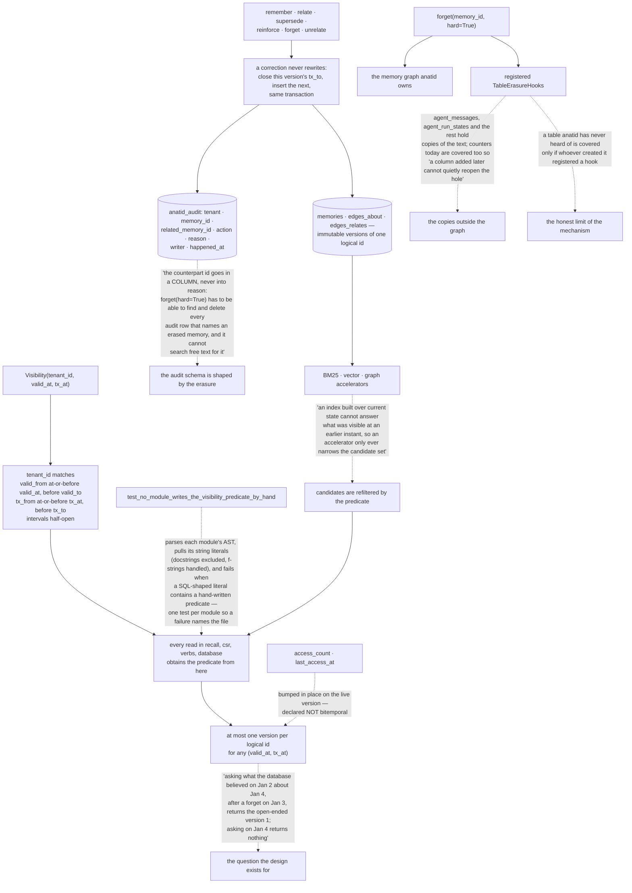

## 1. Executive Summary

anatid is "[l]ocal memory for artificial intelligence (AI) agents. Keep the
source behind a claim and the history of each correction in one DuckDB file." —
MIT, Python, version 0.4.3, 36,813 lines across 44 files.

Its framing example is a medical-device lot whose final test passes, is then
withdrawn because the fixture loaded the wrong firmware, and is scheduled for a
replacement test. The question the store exists to answer is the one that
example makes unavoidable: not just what is true now, but "what the reviewer
knew at the time".

**The mechanism to take away is how it stops a read path from forgetting the
predicate.** DuckDB "has no `AS OF SYSTEM TIME` and no row-level access
control", so both tenant scoping and time travel are predicates the library
compiles into every read — and a read that omits one "returns another tenant's
rows or a row that was not visible at the requested instant." Every system in
this corpus with that arrangement relies on reviewers to catch the query that
skipped it. anatid relies on a test:

> "`tests/test_visibility.py` scans the source tree for the literal fragments
> and fails when one appears anywhere outside this file."

`test_no_module_writes_the_visibility_predicate_by_hand` parses each module's
AST, extracts its string literals with docstrings excluded and f-strings and
implicit concatenation handled, and fails when a literal that begins like a SQL
statement also contains a hand-written tenant predicate — parameterised one test
per module "so a failure names the file." The atlas has a recurring finding
about scope predicates drifting out of one read path; this is the first system
read here that turns that into a build failure.

**The bitemporal rule is stated once and worked through.** A row is visible to
`Visibility(tenant_id, valid_at, tx_at)` when the tenant matches and both
intervals contain their instant, half-open so that "a row closed exactly at T is
already invisible at T". Corrections never rewrite: they close the current
version's `tx_to` and insert the next version in the same transaction. The
docstring then answers the question the design is for — "[a]sking what the
database believed on Jan 2 about Jan 4, after a forget on Jan 3, returns the
open-ended version 1; asking on Jan 4 returns nothing" — and immediately names
what the rule does not cover: the usage counters are bumped in place and are not
bitemporal.

**A third rule protects the whole arrangement from its own accelerators.**

> "An index built over current state cannot answer what was visible at an
> earlier instant, so an accelerator only ever narrows the candidate set."

Candidates are then refiltered with the same predicate. A stale index can cost
recall; it cannot leak a row past the guard.

**And the audit schema is shaped by the erasure it has to survive.** On the
supersede path, the counterpart memory id "goes in a COLUMN, never into
`reason`", because a hard forget "has to be able to find and delete every audit
row that names an erased memory, and it cannot search free text for it."
[Verimem](../verimem/), read just before this, reaches the same concern from the
other direction — it keeps content *out* of its immutable chain so erasure stays
possible. Both are designing the audit around the deletion rather than
discovering the conflict later.

## 2. Mental Model

A **memory** is a logical id with immutable versions behind it.

A **correction** closes one version's transaction interval and opens the next.

A **predicate** lives in one module, and a test says so.

An **index** narrows; it never decides.

An **erasure** has to reach the transcript too.

## 3. Architecture

| Area | Role |
| --- | --- |
| `src/anatid/visibility.py` | The tenant and bitemporal predicates, and the rule stated once |
| `tests/test_visibility.py` | The AST scan that keeps them there |
| `src/anatid/verbs.py` | The write verbs, versioning, and the audit inserts |
| `src/anatid/schema.py` | Tables, generated columns, and the indexes that enforce uniqueness |
| `src/anatid/erasure.py` | Hooks, and the copies of a memory outside the memory graph |
| `src/anatid/csr.py`, `fts.py`, `vector.py` | Accelerators that narrow rather than answer |

## 4. Essential Implementation Paths

`src/anatid/visibility.py:1-9` — why the predicates exist and where they are
allowed to live.

`tests/test_visibility.py:122-140` — the test that turns a convention into a
build failure.

`src/anatid/visibility.py:28-34` — versioning, and the worked bitemporal
question.

`src/anatid/visibility.py:45-50` — what an accelerator is allowed to do.

`src/anatid/verbs.py:1645-1653` — a comment that explains a column by naming the
delete it has to survive.

`src/anatid/erasure.py:1-22` — the residue problem, stated as a table.

## 5. Memory Data Model

Memories, `edges_about` and `edges_relates` are immutable versions of logical
ids, each carrying tenant, both time intervals, a writer, a confidence and
optionally an embedding. Entities carry a generated `entity_key` whose
uniqueness is enforced by an index rather than by a select-then-insert in the
verbs. `anatid_audit` records actions with typed counterparts. Everything sits
in one DuckDB file that SQL can read directly.

## 6. Retrieval Mechanics

Reference walks over the entity graph, BM25 ranking over text, and vector search
when an embedding model is configured. Each is a candidate generator; the
visibility predicate decides.

## 7. Write Mechanics

Six verbs, each producing a new version rather than an edit, with the audit row
and the version insert in the same transaction. `forget` is soft by default and
purges with `hard=True`, running registered erasure hooks over tables outside
anatid's own schema.

## 8. Agent Integration

A Python library, an MCP server, and bundled agent integrations — messages, run
states, sessions, turn usage — whose tables are explicitly enumerated in the
erasure module rather than left to be discovered.

## 9. Reliability, Safety, and Trust

The strong parts are the single predicate with mechanical enforcement, the
narrowing rule for accelerators, the typed audit counterpart, and an erasure
design that starts from where copies actually end up. The gaps are the absence
of any epistemic status beyond time, nothing keyed on an erased value, and hooks
that cover unknown tables only when somebody registers them.

## 10. Tests, Evals, and Benchmarks

A test suite that includes the source-scanning visibility test, tenant-boundary
and hop-boundary assertions with their controls in the same function, pool
isolation, backup quiescing, and conflict cases asserting that an id belonging
to another tenant is not found rather than silently acted on.

## 11. For Your Own Build

Put your scope and time predicates in one module, then write the test that fails
the build when a literal elsewhere contains one. The review that catches it by
eye works until the day it does not.

Let your indexes narrow and never decide. It is the difference between a stale
index costing recall and a stale index disclosing a row.

Shape the audit schema around the delete. If a hard erasure has to find every
row naming a memory, the id belongs in a column, not in a sentence.

Enumerate where copies of your memory end up. The transcript and the serialised
run state are memory too, and a purge that only clears the store leaves both.

## 12. Open Questions

Whether a status axis is wanted beside the time axes. Superseded and current are
temporal facts; unverified and confirmed are not, and a manufacturing record is
exactly the domain where the difference matters.

Whether the hook mechanism should fail closed for unregistered tables. The
module is clear that hooks are the only route for tables it has never heard of,
which means an erasure can succeed while a copy survives in a table nobody
wired up.

## Appendix: File Index

| Path | What to read it for |
| --- | --- |
| `src/anatid/visibility.py:1-50` | One predicate, one module, and the whole rule stated once |
| `tests/test_visibility.py:122-140` | An AST scan that makes the convention mechanical |
| `src/anatid/verbs.py:1645-1653` | An audit column explained by the delete it must survive |
| `src/anatid/erasure.py:1-22` | Where copies of an erased memory actually live |
| `tests/test_core.py:397-412` | A negative assertion with its control in the same test |

## History

**2026-09-16** — [`aa7edcdfb5fe220f855c6c74943f7090b561854b`](https://github.com/thedatasense/anatid/commit/aa7edcdfb5fe220f855c6c74943f7090b561854b) — first reading, at a commit dated 10 September 2026. Screened before opening, from a shallow clone: no auto-run surfaces, two build-time execution points, two unpinned dependency surfaces and two dependency files inside the seven-day cooldown. Nothing was installed, built or run, and no DuckDB file was opened, so every claim here is read from source.
