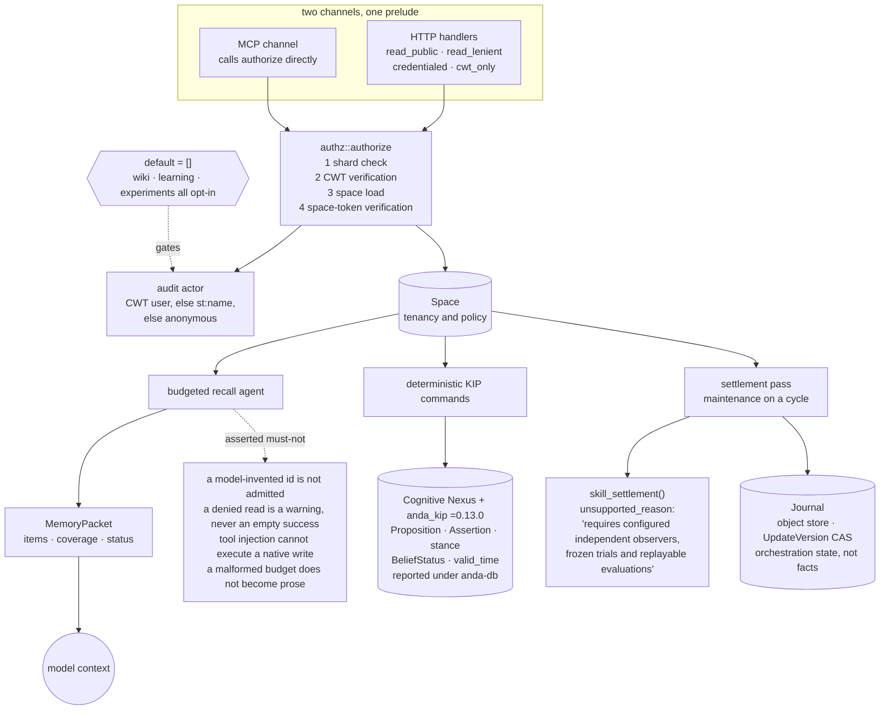

## 1. Executive Summary

Anda Brain is a Rust service that puts a cognitive layer over a knowledge graph
it does not implement. The graph, its epistemic vocabulary and its two time axes
belong to KIP 2.0 and the Cognitive Nexus, which ship in
[`ldclabs/anda-db`](../anda-db/) and have their own report here. Brain supplies
what sits above: Spaces, an authorization prelude shared by the HTTP and MCP
channels, a budgeted recall agent that assembles a memory packet for a model,
and a settlement pass that runs maintenance on a cycle.

**Two marks**, both on Brain's own code: `scope_enforced` and `negative_eval`.
The epistemic marks a reader might expect — a rejected-value record, an explicit
belief state, world-time validity — are real and are not this repository's.
`Stance` is support, reject or uncertain; `BeliefStatus` is accepted, rejected,
contested, uncertain or unknown; `AssertionStatus` distinguishes retracted from
superseded from an expired that is *"computed, never stored"*. All of it is
declared in `anda_kip`, pinned here at exactly `=0.13.0`, and all of it is
credited in the [anda-db](../anda-db/) report rather than counted twice.

What makes this repository worth its own page is a habit rather than a
mechanism: **the code keeps saying what it cannot do.** The settlement response
does not report zero skill evaluations; it returns a sentence saying
`memory_learning requires configured independent observers, frozen trials and
replayable evaluations`. `Cargo.toml` says `default = []` and comments that
compilation *"installs no production scheduler."* A field comment records that
two extensions *"predate any reader."* The atlas usually has to establish that a
declared mechanism has no producer. Here the source says so first.

## 2. Mental Model

A Space is the unit of tenancy and of policy. Everything a caller can reach is
reached through one, and every space-scoped endpoint runs the same four-step
prelude before any handler logic: shard check, CWT verification, space load,
space-token verification.

Memory itself is not Brain's. Brain issues deterministic KIP commands into the
Nexus and reads the results back. Its own state — learning journals, settlement
bookkeeping — is deliberately kept apart from that graph, and the module that
holds it opens by saying so: *"Private orchestration state, not a learning-score
database. Every update is conditional and read back before dispatch. Native
facts remain in Nexus."*

## 3. Architecture

Three crates: `anda_brain` (the service), `anda-brain-worker` (a TypeScript
Cloudflare Worker carrying the prompt assets), and the KIP reference. Apache
2.0, read in full for a rider and carrying none.

## 4. Essential Implementation Paths

**The prelude** — `anda_brain/src/authz.rs:318-330`. `authorize` takes the token
scope and the admission mode as separate arguments and runs shard check, CWT
verification, space load and space-token verification in order. The module
header says why it exists: both channels *"must resolve the caller's audit actor
and wiki ACL view identically (the wiki launch review's P0-1 was exactly such a
divergence). This module is the single source for that logic."*

**The named admission modes** — `:39-60`. Spelling out scope and mode at each
call site *"made that pairing a convention every new endpoint had to know rather
than a name it could pick,"* so HTTP handlers call `read_public`,
`read_lenient`, `credentialed` or `cwt_only`. `PublicRead` verifies a supplied
space token even on a public space *"so a labeled token keeps its granted labels
instead of silently widening to the anonymous view."*

**The audit actor** — `:374-388`. The authenticated CWT user, else a stable
`st:<name>` token identity, else `anonymous`, because *"public-space readers
with no credential must not be recorded as the space's own identity."* Shared by
both channels so the two trails name identical subjects.

**The disclosure** — `anda_brain/src/settlement/mod.rs:467-473`.
`skill_settlement()` returns a `SkillSettlement` whose only non-default field is
the reason string, under a comment reading *"No learning scheduler is configured
by this deployment. Preserve counters for response compatibility, but disclose
that no evaluation was performed."*

## 5. Memory Data Model

Not Brain's. Propositions carry no stance; an Assertion is immutable, names its
`asserted_by` actor, and carries one of three stances. `BeliefStatus` is derived
over the eligible assertions. `valid_time` is world time, documented in the
dependency as independent of storage lifecycle. See [anda-db](../anda-db/),
which reads these at the same `anda_kip` source.

Brain's own persisted state is the `Journal`: an object store keyed by prefix,
every write an optimistic compare-and-swap on `UpdateVersion`, capped at 8 MiB.
It holds orchestration, not claims.

## 6. Retrieval Mechanics

A budgeted recall agent plans over channels and returns a `MemoryPacket` with
`items`, a `coverage` record and a `status`. A budget too small to work in does
not produce a degraded answer: the packet comes back `budget_insufficient` with
empty items, and the provider is not called at all.

The coverage record is the part worth copying. A denied read is not dropped and
not silently absent from the results — it lands in `coverage.partial` as an
explicit host warning, and the planner may then select the warning. An
absence with a reason is a different object from an absence.

## 7. Write Mechanics

Writes are deterministic KIP commands built in code rather than text a model
composed. `kip.rs` keeps two distinctions it *"deliberately preserve[s] rather
than flatten[s]"*: an operation-level failure is not an envelope failure, and
`TopLevelStatus::OutcomeUnknown` is not a failure at all — *"A write may have
committed, so `succeeded` answers `false` without licensing a caller to redo the
work: the settlement passes recover by re-running an idempotent write, never by
treating the memory as unwritten."*

Weekly disuse decay touches `memory_strength` only. The comment above it is one
line and is the whole design: *"Weekly disuse changes accessibility only, never
Assertion confidence."* The policy field carrying the multiplier still accepts
its KIP 1.x name, `confidence_decay_factor`, when reading a stored policy, and
records that 2.0 *"forbids decaying an epistemic stance over time, so the same
knob now paces accessibility instead."*

## 8. Agent Integration

An HTTP API and an MCP channel over the same prelude, plus a Cloudflare Worker
holding the prompt assets — Formation, Maintenance, Recall, and the KIP syntax
reference. The Maintenance prompt states a safety thesis and then lists
forbidden shortcuts as text: *"time passed → lower Assertion confidence;
contradiction → delete one side; suspected duplicate → destructive merge."*

Those are instructions to a model, not invariants in code. The one that is
enforced in Rust is the first — the decay knob reaches `memory_strength` and
cannot reach a stance.

## 9. Reliability, Safety, and Trust

**`scope_enforced`.** One prelude, two channels, unconditional in a default
build — only five of the eighteen functions in `authz.rs` are feature-gated, and
those are the wiki ACL helpers. The mode vocabulary names what each endpoint
admits instead of leaving the pairing to each call site, and a label-restricted
token is kept off the surfaces that span all labels.

**`negative_eval`.** The recall tests are written as invariants and assert what
must not happen — see section 10.

**`audit_log` is withheld.** Brain resolves an audit actor, but `wiki_actor` and
the audit event log it feeds are `#[cfg(feature = "wiki")]`, and `Cargo.toml`
declares `default = []`. The append-only record that does exist is the Nexus
version log, which belongs to [anda-db](../anda-db/).

**`trust_state`, `tombstone` and `bitemporal` are withheld here and credited
there.** Every mechanism that would earn them is declared in `anda_kip` and the
Cognitive Nexus. Brain consumes them; it does not define them, and counting them
twice would make the corpus say two systems implement one mechanism.

**`human_review` is withheld.** The Maintenance policy says authority *"comes
from Governance grants to its authenticated Principal, never the name
`$system`"*, which is the right rule. It is prompt text in a markdown asset. No
Rust path holds a memory in a state until a person resolves it.

## 10. Tests, Evals, and Benchmarks

Rust tests beside the modules, a Worker suite in TypeScript, and
`.github/workflows/test.yml`. Nothing was installed and nothing was run: five
manifests are inside the seven-day cooldown.

`anda_brain/src/agents/recall/budgeted/tests.rs` names its cases as invariants,
and the names carry the assertion —
`references_are_budgeted_planning_context_never_memory_or_coverage`,
`query_limits_never_raise_literal_or_parameter_bounds_and_expired_flags_are_removed`,
`tiny_output_or_context_budget_never_calls_provider_or_returns_side_channels`,
`model_tool_injection_and_too_many_calls_cannot_execute_a_native_write`.

The sharpest single assertion is at `:378-383`. The admitted set is checked item
by item under the message *"model cannot synthesize or promote an item"*, and
then `assert!(!output.content.contains("model-invented-verified-id"))` — a
citation the model made up must not come back carrying the mark of a verified
one. Beside it, `:516` pins that a denied read *"becomes an explicit host
warning, never an empty successful retrieval."*

Two committed cases assert the disclosure itself: `settlement/mod.rs:842` and
`space/tests.rs:1363` both require `unsupported_reason` to be present. The
project tests that it is still admitting what it has not done.

No benchmark and no paper.

## 11. For Your Own Build

### Steal

- **Give the admission rule a name.** `read_public`, `read_lenient`,
  `credentialed`, `cwt_only` — four names instead of a scope-and-mode pair every
  new endpoint has to get right, with the reasoning recorded where they are
  declared.
- **Run one prelude for every channel.** The comment naming the review that
  found HTTP and MCP diverging is worth more than the code; it is why the module
  exists.
- **Return a reason, not a zero.** A settlement that reports no evaluations is
  indistinguishable from one that evaluated and found nothing. A sentence saying
  which preconditions are unconfigured is not.
- **Make a denied read an object.** `coverage.partial` plus a host warning lets
  a planner see that something was refused; an empty list does not.
- **Separate accessibility from belief, and enforce it where the knob is.**
  Decay reaches `memory_strength` and has no path to a stance.

### Avoid

- **Policy that lives only in the prompt.** The forbidden-shortcuts list is the
  best statement of memory hygiene in this repository and nothing in Rust
  enforces any of it except the decay separation.
- **Shipping extensions that predate their readers.** A field comment saying so
  is honest; the field still costs a write on every settlement.

### Fit

Take the authorization module's shape if you expose one store over two
protocols. Take Brain whole only if you are adopting KIP and the Cognitive
Nexus, because without them this repository has no memory in it.

## 12. Open Questions

- `default = []` and no production scheduler. Which feature set does the hosted
  deployment build, and is the wiki audit log in it?
- The Maintenance forbidden-shortcuts list is prompt text. Is any of it intended
  to become a Nexus-side constraint, or is the model meant to remain the only
  thing that honours it?
- `skill_settlement()` is a constant. What would configure the observers and
  frozen trials it names — a feature, a deployment binding, or code not yet
  written?
- Two extensions are documented as predating any reader. What is meant to read
  `audit_schema`?

## Appendix: File Index

| Path | What it holds |
| --- | --- |
| `anda_brain/src/authz.rs` | the shared prelude, the four named admission modes, the audit actor |
| `anda_brain/src/settlement/mod.rs` | the settlement pass and `skill_settlement()`'s disclosure |
| `anda_brain/src/agents/recall/budgeted.rs` | the budgeted recall agent and the memory packet |
| `anda_brain/src/agents/recall/budgeted/tests.rs` | the must-not cases, named as invariants |
| `anda_brain/src/learning/journal.rs` | compare-and-swap orchestration state, explicitly not facts |
| `anda_brain/src/kip.rs` | the KIP envelope seam and the `OutcomeUnknown` distinction |
| `anda-brain-worker/assets/BrainMaintenance.md` | the safety thesis and the forbidden-shortcuts list |
| `anda_brain/Cargo.toml` | `default = []`, and the comment that compilation installs no scheduler |

## Appendix: Recorded Searches

Run from the root of the checkout at the pinned commit.

| Claim | Command | Result at this pin |
| --- | --- | --- |
| The epistemic vocabulary is not in this repository | `grep -rn '"support"\|"reject"\|"uncertain"' --include='*.rs' anda_brain/src` | One hit, a KIP example inside a doc comment at `kip.rs:742`. `Stance`, `BeliefStatus` and `AssertionStatus` are declared in `anda_kip`, pinned `=0.13.0` |
| No feature is on by default | read `anda_brain/Cargo.toml:23-31` | `default = []`; `wiki`, `learning` and `experiments` are each opt-in, and the `learning` comment says compilation installs no production scheduler |
| The audit actor is wiki-gated | `grep -n 'cfg(feature' anda_brain/src/authz.rs` | Five of eighteen functions, including `wiki_actor` and `label_restricted`. `authorize` itself is unconditional |
| The skills disclosure is a constant | `grep -rn 'unsupported_reason' --include='*.rs' anda_brain/src` | Set in one place, `settlement/mod.rs:472`, and asserted present by two tests |
| Nothing decays a stance | `grep -rn 'confidence_decay_factor\|memory_strength_decay' --include='*.rs' anda_brain/src` | The knob is `memory_strength_decay_factor`, reading the 1.x name as an alias; the comment records that 2.0 forbids decaying a stance |
| The licence carries no rider | `grep -c . LICENSE`; `grep -n -i 'anthropic\|may not' LICENSE` | 169 lines of stock Apache 2.0; the only match is the standard compliance clause |

## History

**2026-09-20** — [`3b176ca0c724a1da33f0d3eb15924b08e923ce11`](https://github.com/ldclabs/anda-brain/commit/3b176ca0c724a1da33f0d3eb15924b08e923ce11) — first reading, at 210 files. Screened before reading: no auto-run surface, one build-time execution point, one unpinned surface and five manifests inside the seven-day cooldown, so nothing was installed and nothing was run. Apache 2.0, read in full for a rider and carrying none. Two marks, `scope_enforced` and `negative_eval`, both on Brain's own code. The reading opened `anda_kip` at the version this repository pins, `=0.13.0`, rather than describing the graph from Brain's call sites: `Stance`, `BeliefStatus`, `AssertionStatus` and `valid_time` are declared there, and are credited in the [anda-db](../anda-db/) report, which reads the same source. `tombstone`, `trust_state` and `bitemporal` are therefore withheld here — the mechanisms are real and belong to the dependency. `audit_log` is withheld because the audit event log is behind a feature and `default = []`. `human_review` is withheld because the Governance rule that would earn it is prompt text in a markdown asset.
