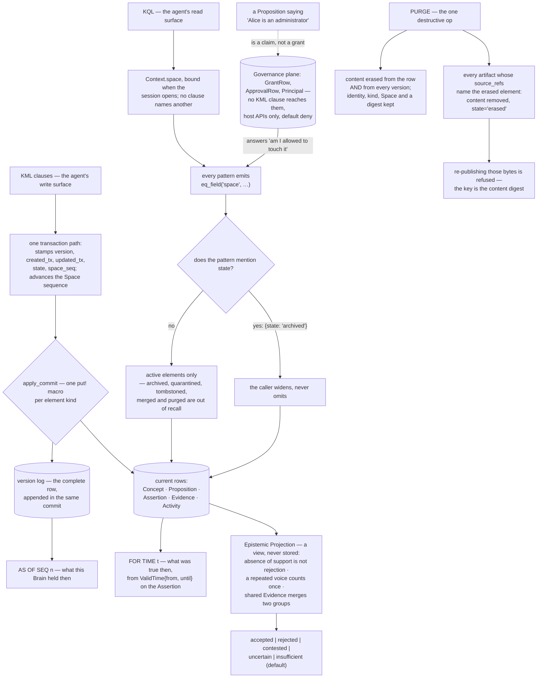

## 1. Executive Summary

Anda DB is "a modular Rust workspace for building durable AI memory systems" —
MIT, version 0.13.0, Rust 1.95 or newer, 232,178 lines of which 169,548 are Rust
across fifteen crates, with 1,642 test functions, Python and TypeScript bindings,
and a protocol specification of its own. The embedded document database with
B-Tree, BM25 and HNSW indexes is the floor; the subject here is what sits on top
of it — KIP 2.0, a declarative knowledge protocol, and the Cognitive Nexus
runtime that makes it a knowledge graph for agents.

The module worth reading first is not the retrieval engine. It is governance,
and it opens with four lines:

> "Cognitive content may describe authority. Only this plane can grant it."

The elaboration is the clearest statement of a problem this atlas has been
circling for hundreds of reports:

> "A Space can hold a Proposition saying *Alice is an administrator*, an
> Assertion supporting it with high confidence, and Evidence for both — and Alice
> still administers nothing, because administering is a `GrantRow` and a
> Proposition is a claim. Without that separation, any path that can write memory
> is a path to privilege escalation, and every Agent memory system has such a
> path by construction: it is the entire point of the system."

The enforcement matches the claim: grant rows live in the same database as
cognitive state but "no KML clause reaches them", written only by host APIs on
the runtime, and a protected operation is denied unless something explicitly
allows it — "a missing policy must never become public access".

The same module separates three questions that most systems answer with one
number:

> "Epistemic — should I believe this? Governance — am I allowed to touch it?
> Operational — how strongly may it influence what I do?"

**Belief is computed, never stored.** The projection module says why: storing it
"would create a second answer that could disagree with the Assertions it came
from, and nothing would say which one was right". Its three arithmetic rules are
a list of the failures this atlas most often finds shipped:

- "Absence of support is not rejection." An unasserted Proposition is
  `insufficient`, and `insufficient` is the default for `BeliefStatus` because
  "silence is the absence of a basis, never a verdict".
- "Evidence weight is not frequency count … Saying the same thing three times is
  one voice repeated, not three independent voices."
- "Two Assertions that cite the same Evidence are not independent … Manufactured
  corroboration is exactly what an attacker builds, so shared Evidence merges two
  groups even when the actors differ."

That last rule is the one [OWASP's guard](../agent-memory-guard/) states as a
threat and this engine implements as arithmetic.

**Two time axes, named apart.** `AS OF SEQ 41` reads what the store held at a
sequence; `FOR TIME` reads what was true in the world. The history module says
the distinction in its first sentence and then explains the mechanism: rows are
updated in place, so "every commit appends the complete row it wrote to a version
log", and a historical read is "the greatest version of this element whose
sequence is at or before the coordinate". The transaction coordinate is a
per-Space sequence rather than a clock, "because two commits in the same
millisecond must still be ordered". World time is `ValidTime { from, until }` on
the Assertion, documented as "[i]ndependent of `retention.expires_at`, which is
storage lifecycle".

That version log is also the audit record, and it is unskippable: `apply_commit`
runs every element write through one macro that calls `put` and `record_version`
together, for all five element kinds. The write path is the only code that stamps
the envelope columns, which the module notes are "non-malleable by construction …
not because a validator rejects them, but because the only code that writes them
is this module".

**Erasure propagates and leaves a marker.** `PURGE` is "the one operation here
that destroys something", and it keeps a digest stub because "a dangling
reference does not say 'this was erased', it says nothing at all, which is worse
for an auditor and worse for a reader". The part that earns the tombstone mark is
downstream: an artifact is stored under a key containing its own content digest,
and when a source element is erased, every artifact whose `source_refs` name it
has its content stripped and its state set to `erased`. Re-publishing the same
bytes then fails — "artifact identity already has a different material binding or
erasure tombstone" — and reading it fails too. The value's digest is the key, and
the refusal is consulted on both paths.

There is one more thing in that erasure validator worth quoting, because it is a
line most systems would not have written. Checking whether a backup was really
deleted, the code declines to take the plan's word for it: "Backend backups need
their own verified deletion receipt; a model-authored plan is not such a
receipt."

Six marks. The one withheld is human review. An approval is bound by a digest
over the Space, permission and element so that "[a]n approval for 'purge E-1'
therefore does nothing for 'purge E-2'", it is "[c]onsumed, not merely counted",
and `allow_self_approval` defaults false because "the same Principal proposing
and approving is the separation-of-duties failure §28.5 names first". All of that
is excellent — and a Principal is an authenticated identity, not necessarily a
person, with no review console in the tree. This is separation of duties, which
is a different guarantee.

The honest caveat is cost. A reader who wants a memory library will find a
governed graph database with its own query language, change-envelope model and
policy engine, at 169,548 lines of Rust, mid-migration from KIP 1.x to 2.0. There
is no smaller door.

## 2. Mental Model

A **Proposition** is a claim. An **Assertion** is somebody making it, with a
stance, a confidence, evidence and a window of world time it covers.

**Belief** is not a field. It is the answer a policy gives when asked.

A **Space** is who owns and may touch. A **Domain** is what something is about.
They are not the same word and the code says so.

A **grant** is not a sentence anyone can write into memory.

## 3. Architecture

| Crate | Role |
| --- | --- |
| `anda_cognitive_nexus` | The runtime: KQL, KML, projection, governance, history (59,363 lines) |
| `anda_kip` | The protocol: types, parser, wire enums (17,521) |
| `anda_db` | The embedded document database (25,612) |
| `anda_db_btree`, `_hnsw`, `_tfs` | Exact, vector and full-text indexes |
| `anda_object_store` | Object-store persistence, optional encryption at rest |
| `anda_db_shard_proxy` | Many logical databases behind one service |
| `py/`, `ts/`, `anda_kip_wasm` | Bindings |

Inside the nexus, the split that matters is `store/`, `governance/`,
`projection/` and `kql/` + `kml/` — respectively what is recorded, who may touch
it, what is believed, and how either is asked for.

## 4. Essential Implementation Paths

`governance/mod.rs:1-46` — read this before anything else in the repository.

`projection/mod.rs:1-27` — three rules and the reason belief is not a column.

`store/history.rs:1-21` — the two time questions, and why one of them is a scan.

`store/control.rs:114-138` — the commit that cannot skip its own record.

`governance/purge.rs:1-38` — what destruction is allowed to leave behind.

## 5. Memory Data Model

Five element kinds. The useful distinction is Proposition against Assertion: the
first is the claim, the second is somebody making it, and separating them is what
lets two actors disagree about the same sentence without the store having to pick
a winner at write time. `Stance`, `AssertionMode`, `confidence`, `asserted_at`,
`valid_time` and a list of `EvidenceRef` with roles hang off the Assertion.

`AssertionStatus` is `active`, `retracted`, `superseded` — and `expired`, which
is "[c]omputed, never stored … No statement produces it and no Change Envelope
carries it". The distinction between a state somebody set and a state the clock
implies is made at the type level, which is the sort of thing that stops a
migration inventing history.

Evidence carries a class from a recommended-but-open list — `observation`,
`user_statement`, `agent_statement`, `tool_result`, `measurement` — so the
distinction between what a person said and what a model said survives into the
projection's weighting.

## 6. Retrieval Mechanics

KQL patterns narrow with whatever indexes exist, load the survivors, and decide
the rest against the rendered view. Two defaults are load-bearing: the Space
predicate a caller cannot drop, and the active-only state filter a caller widens
by naming the state.

The reading discipline is stated where it matters: a raw pattern
"report[s] that a tuple exists and that somebody claimed something; they never
report that it is true. Belief is projected, and lives in `BELIEF`." A query
language that makes you ask for belief in different syntax than existence is
doing something most of this corpus does not.

## 7. Write Mechanics

One path, generic over the shared envelope columns, so the three invariants hold
for every kind without each call site remembering them. Every write advances the
Space sequence, "so a mutation that skipped it would be invisible to both"
`CHANGES` and `AS OF SEQ`. Optimistic concurrency is `EXPECT VERSION` against the
same counter.

## 8. Agent Integration

A server crate, bindings in two other languages, a WASM build of the protocol,
and a `skills/` directory. The integration argument the workspace makes is that
the policy boundary belongs in the engine rather than the adapter, which follows
from the governance premise: if the write surface is the attack surface, an
adapter-level check is a check the attacker is already past.

## 9. Reliability, Safety, and Trust

Covered throughout. Two more details deserve naming.

The `REFERENCE POLICY` default is `deny_if_referenced`, because "in a cognitive
history an Assertion, an Activity or an Experience may point at the target, and
erasing the whole dependency chain falsifies history … KIP 1.x made destructive
cascade ordinary; 2.0 deliberately does not." A default that refuses rather than
cascades, with the prior version's mistake named.

And the erasure validator checks the *claims* in an erasure plan against the
store rather than trusting them, with the backup case refused outright: a
model-authored plan is not a deletion receipt. Several systems in this corpus
treat a model's assertion that it deleted something as the deletion.

## 10. Tests, Evals, and Benchmarks

1,642 test functions, with the nexus carrying suites named for what they check —
`belief`, `cognitive_consistency`, `conformance`, `governance`, `history`,
`traversal`, `simulation`, `migrate`. Test names read as sentences:
`an_archived_element_leaves_ordinary_recall_but_still_exists`, which is also the
one that earns the negative-evaluation mark by putting its control three lines
under its negative assertion.

Nothing was built or run for this reading; the counts are from the source.

## 11. For Your Own Build

Keep authority out of the content plane. If your memory store can hold a sentence
saying somebody is an administrator, make sure the path that reads that sentence
is not the path that decides permissions — and be able to point at the code that
separates them.

Do not store what you compute. A stored belief and the evidence behind it will
disagree eventually, and nothing in the schema will say which is right.

Merge corroboration groups on shared evidence. Two citations of one source are
one source; an attacker who can write twice is otherwise an attacker who can
manufacture agreement.

Make the default the absence of a verdict. `insufficient` as the default belief,
rather than accepted or rejected, is one line that keeps an unfilled field from
reading as an opinion.

Key an erasure marker on the value. A tombstone keyed on identity can be
sidestepped by writing the same thing under a new id; one keyed on the content
digest cannot.

And if a plan says it deleted something, verify it. A receipt is not a plan.

## 12. Open Questions

Whether any host makes approval a human step. The mechanism is Principal-signed
and the tree ships no console, so it is separation of duties unless a host adds
one.

How a historical read behaves on a large Space. The scan is declared and budgeted
and refuses rather than stalls; the practical ceiling was not measured.

What the migration costs in practice. KIP 1.x to 2.0 is breaking, with a
migration guide in-tree and a `migrate` suite, and that path was not exercised.

## Appendix: File Index

| Path | What to read it for |
| --- | --- |
| `rs/anda_cognitive_nexus/src/governance/mod.rs:1-46` | Why a claim about authority is not authority |
| `rs/anda_cognitive_nexus/src/projection/mod.rs:1-27` | Three rules about evidence, and why belief is a view |
| `rs/anda_cognitive_nexus/src/store/history.rs:1-45` | Two time questions, and the log that answers one |
| `rs/anda_cognitive_nexus/src/store/control.rs:114-138` | A commit that records itself |
| `rs/anda_cognitive_nexus/src/governance/purge.rs:1-38` | Destruction with a stub, and a default that refuses |
| `rs/anda_cognitive_nexus/src/tx/durable.rs:125-220` | Erasure that propagates, and a plan that is not a receipt |
| `rs/anda_cognitive_nexus/tests/kql.rs:386-425` | A negative assertion with its control beside it |

## History

**2026-09-16** — [`450b48d0a2d6a74a42872d4a3a3f1ca3346513de`](https://github.com/ldclabs/anda-db/commit/450b48d0a2d6a74a42872d4a3a3f1ca3346513de) — first reading, at a commit dated 16 September 2026, the day the 0.13.0 KIP 2.0 release landed. Screened before opening, from a shallow clone: twenty-nine files scanned, no auto-run surfaces, three build-time execution points, three unpinned surfaces and twenty-two dependency files inside the seven-day cooldown. Nothing was installed, built or run.
