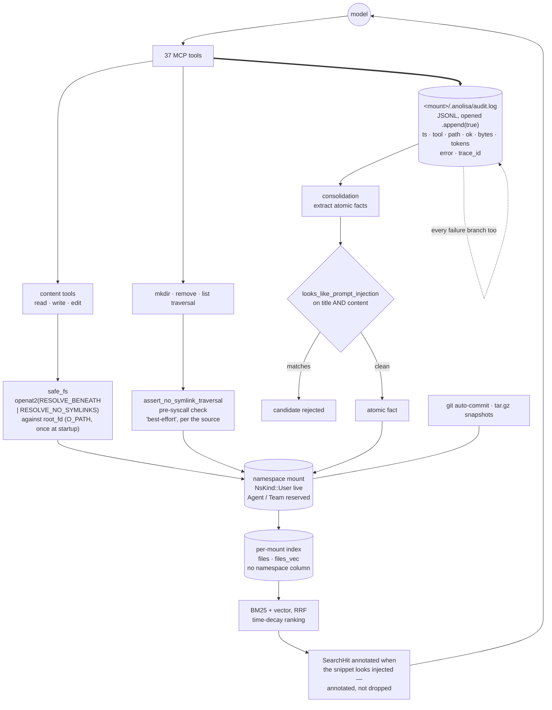

## 1. Executive Summary

ANOLISA is an agentic operating system from Alibaba Cloud — Apache 2.0, 5,758
files across a dozen components. This report covers one of them,
`src/agent-memory`: a Rust crate serving filesystem-shaped memory to agents over
MCP, with 37 tools, hybrid BM25-plus-vector search, git versioning, and
consolidation of atomic facts out of its own audit log. Linux only, by design
and by dependency.

**Two marks: `audit_log` and `negative_eval`.**

The safety work is the reason to read it. `src/safe_fs/mod.rs` opens by naming
the attack it exists to stop, concretely:

> `ns::paths::resolve_path` validates a string path is sandbox-safe AT CHECK
> TIME, but between the check and the subsequent `fs::*` call an attacker with
> write access to the mount tree could swap a component for a symlink and
> escape — e.g. swap `notes/x` for a link to `~/.ssh/id_rsa`, then have the
> model do `mem_read("notes/x")`.

The answer is `openat2(RESOLVE_BENEATH|RESOLVE_NO_SYMLINKS)` against a root
descriptor opened once at startup, so the kernel refuses `..` and symlinks
rather than a validator refusing them. And the module is candid about coverage:
content-opening tools route through it, while `mkdir`, `remove` and list
traversal get a pre-syscall check the docstring itself calls *"best-effort but
closes the common-case attack."*

The tests match that seriousness. An escape attempt is not proved by the error
it returns; it is proved by the file not being there —
`assert!(!outside.path().join("victimdir/escape.md").exists())`.

## 2. Mental Model

A memory is a file. Namespaces are mounts, one root descriptor each, and every
path the model names is resolved beneath that descriptor by the kernel. Search
runs over a per-mount index. Consolidation reads the audit log the tools wrote
and extracts atomic facts from it, so the record of what happened is also the
raw material for what is remembered.

## 3. Architecture



## 4. Essential Implementation Paths

**The sandbox** — `src/safe_fs/mod.rs:1-19`. Kernel-enforced resolution beneath
a root descriptor, requiring Linux ≥ 5.6 for `openat2`, which the docstring
notes the platform ships. The two tiers are stated rather than implied, and the
weaker one is labelled as such.

**The audit line** — `src/audit/mod.rs:14-39`. `AuditEntry` carries an RFC3339
timestamp, the tool name, the mount-relative path, an `ok` boolean, bytes,
an estimated token count for retrieval tools, an error string, and a trace id
*"for cross-tool correlation"*. The file is opened with `.append(true)` at
`:108-110`. There is no truncate, rotate or `set_len` anywhere in the module.

**The producers** — and they are the reason the mark holds. `src/tools/edit.rs`
alone emits eight entries, one per failure branch plus the success, each
carrying the error it failed with. `remove.rs` has five, `mem_revert.rs` and
`grep.rs` four each, `promote.rs` three, with more in snapshot, session history,
export, observe and index. A failed write is a line in the log, not a silence.

**The injection heuristics** — `src/safety.rs:1-13`, credited in the source to
*"the OpenClaw LanceDB extension's PROMPT_INJECTION_PATTERNS"*. What matters is
where it is applied, and the two sites differ deliberately:
`consolidation/heuristics.rs:104-105` **rejects** a candidate fact whose title
or content matches, before it can become memory; `index/store.rs:475` and `:615`
**annotate** a search hit *"so the adapter can decide whether to surface"* it.
Filter on the way in, label on the way out.

## 5. Memory Data Model

Files under a namespace mount, with an index of `files` and `files_vec` beside
them. `NsKind` is `User`, `Agent` or `Team`, and the enum carries its own status
note: *"P0+P1 only uses `User`; `Agent` / `Team` are reserved for P2."* Two of
three namespace kinds are declared and not yet in use.

No status field on a memory, no supersession pointer, no validity window, and
no occurrence of `tombstone` in the crate. Versioning is git; rollback is a
commit or a tar.gz snapshot.

## 6. Retrieval Mechanics

BM25 and dense vectors fused with reciprocal rank fusion, with time-decay
ranking. The index tables carry no namespace column: a namespace is a mount and
therefore a separate index, so separation is physical rather than predicated.

Auto-recall observes at the end of a conversation and injects relevant context
before the next prompt, with the injection heuristics annotating what it
surfaces.

## 7. Write Mechanics

Writes go through the sandbox and land as files, optionally auto-committed to
git. Consolidation is the second writer: it reads the audit log, extracts atomic
facts, and drops any candidate that trips the injection heuristics.

## 8. Agent Integration

An MCP server with 37 tools, an adapter layer, cgroup limits, and a journald
audit sink beside the JSONL one.

## 9. Reliability, Safety, and Trust

**`audit_log`.** Append-only JSONL with no rewrite path in the module, a wide
set of producers across the tool surface, and — the part that decides it —
failures recorded as entries with their error rather than dropped. The log is
per-mount, so it inherits the namespace boundary.

**`negative_eval`.** Escape attempts asserted by effect — section 10.

**`scope_enforced` is withheld.** Namespaces are real and the isolation is
strong, and it is a mount per namespace with its own index, not a stored key
composed into a read. The mark measures the second thing. Worth stating beside
it: `NsKind::Agent` and `NsKind::Team` are declared and unused, so per-agent
separation is a reserved shape rather than a live one.

**`trust_state`, `tombstone`, `bitemporal` and `human_review` are withheld.** A
memory is a file with no status, nothing keys a rejection on content — the
injection heuristic drops a *candidate* and records nothing durable about it —
there is one clock, and nothing waits for a person.

**One design decision belongs on the record.** The injection heuristic filters
on the consolidation path and only annotates on the search path. That is
defensible — a search result the adapter can still choose to show is different
from a fact written into memory — but it means tainted content already on disk
reaches the model with a flag rather than being withheld, and the decision then
belongs to whatever adapter reads the flag.

## 10. Tests, Evals, and Benchmarks

Twelve integration test files plus fixtures, covering file tools, safe_fs,
mount strategy, Linux user namespaces, cgroups, git, journald audit, MCP
integration and an end-to-end agent test. Nothing was installed and nothing was
run here.

The mark rests on how the escape cases are asserted. `tests/file_tools_test.rs`
does not stop at the error:

```rust
let err = svc.write("notes/escape.md", "evil", false).unwrap_err();
assert!(!outside.path().join("victimdir/escape.md").exists());
```

The second line is the one that matters. An error return proves the call
complained; it does not prove nothing was written, and a partial write before
the failure would satisfy the first assertion alone. Checking the target
directory on disk proves the escape did not happen. The directory case at `:446`
does the same, and `tests/safe_fs_tests.rs:313` and `:386` cover the read side
and the weaker traversal check.

No benchmark and no paper in this component.

## 11. For Your Own Build

### Steal

- **Let the kernel enforce the sandbox.** A validator and a subsequent `open()`
  are two operations with a window between them;
  `openat2(RESOLVE_BENEATH|RESOLVE_NO_SYMLINKS)` against a long-lived root
  descriptor is one, and the refusal is not yours to get wrong.
- **Name the attack in the module that stops it.** The symlink-swap example with
  `~/.ssh/id_rsa` in it is why the next maintainer will not simplify this away.
- **Label the weaker tier as weaker.** *"best-effort but closes the common-case
  attack"* is worth more than silence about which tools are covered.
- **Assert the escape by checking the filesystem.** The error is the symptom;
  the absent file is the property.
- **Log the failures.** Eight audit sites in one tool file, seven of them error
  branches, is what makes a log answer "what went wrong" and not only "what
  worked".
- **Filter on the way in, annotate on the way out** — and decide that split
  deliberately, as this does.

### Avoid

- **Declaring namespace kinds you do not use yet.** `Agent` and `Team` read as
  capabilities to anyone who does not find the comment.

### Fit

Take `safe_fs` and the audit module if an agent writes files on your behalf;
both are small, self-contained and Linux-specific. The wider component suits
anyone already running the parent OS.

## 12. Open Questions

- Injection-flagged search hits are annotated and returned. Which adapter
  decides, and what does the default do?
- The consolidation heuristic rejects a candidate fact silently. Would a
  durable record of the rejection be useful, or is the audit line enough?
- `NsKind::Agent` and `Team` are reserved. Will per-agent separation be another
  mount, or the first namespace key composed into a query?
- Consolidation reads the audit log. What happens to extracted facts when the
  log is the only copy and a mount is rolled back to an earlier snapshot?

## Appendix: File Index

| Path | What it holds |
| --- | --- |
| `src/agent-memory/src/safe_fs/mod.rs` | the TOCTOU statement, the `openat2` resolution and the two coverage tiers |
| `src/agent-memory/src/audit/mod.rs` | `AuditEntry`, the append-only open, and the journald sibling |
| `src/agent-memory/src/tools/edit.rs` | eight audit sites, seven of them failure branches |
| `src/agent-memory/src/safety.rs` | the injection heuristics and their credited origin |
| `src/agent-memory/src/consolidation/heuristics.rs` | where a tainted candidate fact is rejected |
| `src/agent-memory/src/index/store.rs` | the `files` and `files_vec` tables, and where a hit is annotated |
| `src/agent-memory/src/ns/mod.rs` | `NsKind`, with `Agent` and `Team` reserved |
| `src/agent-memory/tests/file_tools_test.rs` | the escape cases asserted by effect |

## Appendix: Recorded Searches

Run from `src/agent-memory` in the checkout at the pinned commit.

| Claim | Command | Result at this pin |
| --- | --- | --- |
| The audit log has no rewrite path | `grep -rn "truncate\|rotate\|set_len" --include='*.rs' src/audit` | Nothing; the only open is `.append(true)` at `mod.rs:108-110` |
| Failures are audited, not only successes | `grep -rn "AuditEntry::new" --include='*.rs' src` | 8 sites in `tools/edit.rs`, 7 of them carrying `.error(...)`; 5 in `remove.rs`, 4 each in `mem_revert.rs` and `grep.rs`, and more across the tool surface |
| The index carries no namespace column | `grep -rn "namespace\|ns_id\|CREATE TABLE" --include='*.rs' src/index` | Two `CREATE TABLE` statements, `files` and `files_vec`, neither mentioning a namespace |
| The injection heuristic filters on one path and annotates on the other | `grep -rn "safety::" --include='*.rs' src` | Rejects at `consolidation/heuristics.rs:104-105`; annotates at `index/store.rs:475` and `:615` |
| No tombstone or validity vocabulary | `grep -rli "tombstone\|valid_at" --include='*.rs' src` | Nothing for either |
| Two namespace kinds are unused | read `src/ns/mod.rs:12` | *"P0+P1 only uses `User`; `Agent` / `Team` are reserved for P2."* |

## History

**2026-09-20** — [`b95908b9bd6d2adc52eb3d84ee39515fbfa001c2`](https://github.com/agentic-os-org/ANOLISA/commit/b95908b9bd6d2adc52eb3d84ee39515fbfa001c2) — first reading. The repository is an agentic operating system of 5,758 files from Alibaba Cloud under Apache 2.0 with a NOTICE naming derived works; this report covers one component, `src/agent-memory`, and the other twelve are out of its scope. Screened before reading: no auto-run surface, one build-time execution point, one unpinned surface and nothing inside the cooldown; nothing was installed, built or run, and the crate is Linux-only. Two marks, `audit_log` and `negative_eval`. `scope_enforced` is withheld because a namespace is a mount with its own index rather than a key composed into a read — the fifth system read this night whose isolation is physical rather than predicated.
