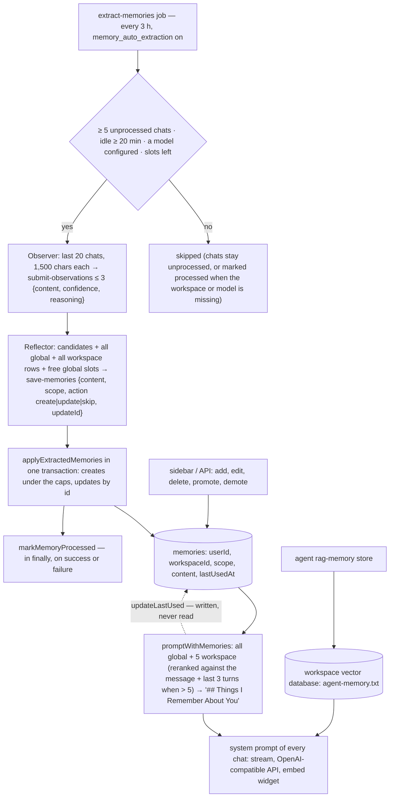

## 1. Executive Summary

AnythingLLM is a self-hosted chat application over documents — workspaces,
a vector database per workspace, an agent framework called AIbitat with a
plugin tool set, an embed widget for websites, an OpenAI-compatible API
— and since 19 May 2026 it carries a personalisation memory: a `memories`
table of one-sentence facts about the user, scoped to a workspace or
global, capped at twenty and five. MIT; 2,352 commits between 3 June 2023
and 1 September 2026, most by two authors; server version 1.16.1 tagged
27 August 2026; the memory feature is 1,354 lines across a model, an
endpoint file, a job and its helpers, and an injection helper, plus 697
lines of sidebar in the React client, with 57 unit tests in one file and
19 commits touching it. The screen found a devcontainer, a `.gitmodules`
and two VS Code files that run on open and a long list of manifests inside
the seven-day cooldown; nothing was installed or run, and the read was
from a shallow clone with history taken from a separate blobless clone.

The design is deliberately small and the constants are the design. A
background job wakes every three hours, finds users whose workspace has at
least five chats nobody has summarised and who have been idle twenty
minutes, and runs two tool-calling agents in sequence: an *observer* that
must call `submit-observations` with at most three candidates, each with a
confidence and a reason, and a *reflector* that sees the candidates, every
existing global fact, every existing workspace fact and the free global
slots, and must call `save-memories` with each candidate's scope and an
action of create, update or skip (`server/jobs/helpers/memory-extraction-utils.js`).
The model applies the result in one transaction under the limits and marks
the chats processed. Every chat then gets the facts appended to its system
prompt under *"## Things I Remember About You"* — all global, and the five
workspace facts a native ONNX reranker puts closest to the current message
and the last three user turns (`server/utils/memories/index.js`).

What is good is that it fits in a sidebar: a person sees every fact, edits,
deletes, promotes and demotes, and can switch extraction or the whole
feature off. What the report finds at the edges is what a first release
usually has. `markMemoryProcessed` runs in a `finally`, so a chat whose
extraction threw is processed forever. `updateLastUsed` stamps every
injected row and no code reads the column. And `chatPrompt(workspace, user)`
is called by the embed widget as `chatPrompt(embed.workspace, username)`
with a string, so `user?.id` is undefined, the readers run with a null
user, and in single-user mode — where every memory has a null `userId` —
the instance owner's facts are appended to anonymous widget chats whenever
memory is on.

## 2. Mental Model

A memory is a **sentence about the user that a reflector accepted**. The
observer proposes; the reflector disposes, and its disposal is the only
epistemics in the system: a candidate becomes global if *"knowing this
would help the assistant in a completely different workspace"*, workspace
otherwise; it is dropped if it overlaps an existing row *"even if worded
differently"*; it becomes an `update` with an id if it refines an existing
workspace row; and it is dropped at low confidence unless it is an
identity fact, or at medium unless strongly supported. The observer's
confidence and reasoning exist for that one decision and are not stored.
The prompts are the state machine and the row has none: no confidence, no
source chat, no status, and no record when a person deletes it or the
reflector updates it in place.

A fact enters three ways — the reflector's `create`, a person's form, or
`promoteToGlobal` and `demoteToWorkspace` moving it between scopes — and
leaves one way, a hard delete, or changes in place through `update`. The
caps are the lifecycle: at twenty workspace facts the reflector's creates
are sliced away and at five global the prompt tells it *"GLOBAL is full —
do not return any GLOBAL memories."* Nothing ages out, and the recency the
model believes in — `lastUsedAt`, described as *"for recency tracking /
reranking"* — is written at every injection and consulted by nothing.

The conversation is the evidence and it is consumed once. A chat is
unprocessed until a job reads it, and processed after, whether the
observer produced candidates, the reflector rejected them, the workspace
had no model, or the run threw; a `/reset` marks chats excluded so they are
never summarised. The consequence is that every fact the store will ever
hold from a conversation is decided in the one run that sees it.

Beside this sits the older memory, still shipped: the agent's `rag-memory`
tool, whose `store` action embeds any text as a document titled
`agent-memory.txt` by `@agent` into the workspace's vector database, where
it is retrieved by the same similarity search as every uploaded file and
listed by nothing as a memory.

## 3. Architecture

A Node server with Prisma over SQLite by default, a React client, a Bree
background worker, a per-workspace vector database through a common
`getVectorDbClass()`, and the AIbitat agent framework. The memory is one
Prisma model (`server/prisma/schema.prisma:431-446`) with indexes on
`(userId, workspaceId)` and `(userId, scope)`, a model module
(`server/models/memory.js`, 461 lines) that validates ids and scopes and
wraps every call in a try that logs and returns a safe value, an endpoint
file (`server/endpoints/memory.js`) with six routes behind
`validatedRequest` and `flexUserRoleValid([ROLES.all])`, the job
(`server/jobs/extract-memories.js`) and its helpers, and the injector
(`server/utils/memories/index.js`), which `chatPrompt` in
`server/utils/chats/index.js:114-130` calls after expanding the workspace's
system prompt variables. The reranker is `NativeEmbeddingReranker`, an
ONNX model the server downloads on first use with a Mintplex-hosted
fallback. `SystemSettings` holds `memory_enabled` and
`memory_auto_extraction` with validators that add or remove the job live
through `BackgroundWorkers.syncMemoryJob`.

The client's `MemoriesSidebar` (`frontend/src/components/WorkspaceChat/ChatContainer/MemoriesSidebar/`)
has a context that fetches the workspace's memories, tabs for the two
scopes, cards with an edit-and-delete menu, a modal to add, and a
`PersonalizationToggle` that only an admin or a single user may flip.

### Deployment and ergonomics

Nothing beyond the application: the rows live in its database and the
reranker model in its storage. A chat model is required to extract — the
job resolves the workspace's chat model, then its agent model, then the
system default, and marks the chats processed when none exists — and no
model is required to store, inject or edit. Fully local operation is a
local model plus the ONNX reranker. The table is plain SQL and the sidebar
is the intended repair surface; the docs page the README links describes
both the automatic and the managed paths.

## 4. Essential Implementation Paths

**Extraction.** `extract-memories.js`: `autoMemoriesEnabled` gate;
`WorkspaceChats.where({ memoryProcessed: null, include: true })` oldest
first, grouped by user and workspace; per group, `MIN_CHATS_TO_PROCESS = 5`,
`isGroupActive` against `MEMORY_IDLE_THRESHOLD_MS` (twenty minutes, zero
disables), `loadLatestChats` re-querying the newest twenty with a parsed
response, `resolveLLM`, the capacity check, `runObserver` and `runReflector`
(each an AIbitat with `maxRounds: 3`, a `USER` agent and one worker agent
whose only function is the submit tool, and `skipHandleExecution` once the
handler fires), then `Memory.applyExtractedMemories` and, in `finally`,
`WorkspaceChats.markMemoryProcessed(unprocessedIds)`. The prompts are at
`memory-extraction-utils.js:15-60`.

**Apply.** `memory.js:345-430`: filter malformed entries, split creates and
updates with a numeric `updateId`, compute workspace slots from the count,
slice creates to the slots, insert and update in one `$transaction`.

**Injection.** `memories/index.js:22-55` (`getMemoriesForPrompt`),
`:60-90` (`rerankMemories`, query = message plus the last three `prompt`
fields, `topK` five, fallback to the newest five), `:95-105`
(`formatMemories`), `:115-135` (`promptWithMemories`, appended after two
newlines). Callers: `chats/stream.js:266-276` with the message and history,
`chats/openaiCompatible.js:169,421` without, `chats/embed.js:182` with a
username in the user's position.

**Manual.** `endpoints/memory.js`: `GET /workspaces/:slug/memories`,
`POST /workspaces/:slug/memories`, `PUT /memories/:id`, `DELETE /memories/:id`,
`POST /memories/:id/promote`, `POST /memories/:id/demote/:slug`;
`frontend/src/models/memory.js` mirrors them.

**Agent tool.** `agents/aibitat/plugins/memory.js`: `rag-memory` with
`search` (the workspace's similarity search at `topN`, reranked when the
workspace says so) and `store` (`addDocumentToNamespace` with a fixed
title and author), behind a duplicate-call tracker.

**Tests.** `server/__tests__/models/memory.test.js` — validations, both
readers, create under and at the limits, update, delete, promote and demote
under the limits, `updateLastUsed`, `countForScope`,
`replaceWorkspaceMemories`, `applyExtractedMemories` (creates, updates,
malformed entries, the workspace cap, zero slots, `globalSlots`), the
multi-user migration and `get`, all against a mocked Prisma.

## 5. Memory Data Model

`memories`: `id`, `user_id` nullable with cascade, `workspace_id` nullable
with cascade, `scope` text default `workspace`, `content`, `last_used_at`,
`created_at`, `updated_at`. `workspace_chats.memory_processed` nullable
boolean is the extraction cursor, and `include` is the `/reset` exclusion.
Scope is two axes — the user always, the workspace for one scope and null
for the other — with `VALID_SCOPES = ["workspace", "global"]` and the
caps as constants on the model. There is no provenance, no confidence, no
state, no version and no validity; `updatedAt` moves on edit and on the
reflector's update, `lastUsedAt` on injection. In single-user mode every
row has a null `userId`; entering multi-user mode runs `migrateToMultiUser`
to assign them to the admin.

## 6. Retrieval Mechanics

There is no retrieval in the search sense. The injector loads every
global fact and every workspace fact for the user and workspace, and when
the workspace set exceeds five, reranks it with the native ONNX reranker
against the current message concatenated with the last three user turns,
keeping five; without a message or history it keeps the five newest, and
on any reranker error it does the same. The result is a bulleted list under
one heading, appended to the system prompt, at most ten lines. There is no
threshold, so five workspace facts are injected however irrelevant; there
is no query the model can issue; and a fact the reranker never ranks in
the top five is invisible to the model in that workspace until the set
shrinks. `lastUsedAt` would be the recency signal and is unread.

## 7. Write Mechanics

Automatic writes are deferred, batched and bounded: at most three
candidates per run per pair, at most one run per three hours by default,
only over idle users with five or more new chats, only from the newest
twenty chats with each message cut at 1,500 characters. Deduplication is
the reflector's judgement against the rows it is shown; consolidation is
its `update` action; conflict handling is the same — a candidate that
contradicts an existing row can be returned as an update of it, or as a
create beside it, at the model's choice. The observer is told to skip the
assistant's own assessments, emotional states, politeness and anything
only the assistant said, which is the one defence against the model
writing its own opinions into the store, and it is a prompt.

Manual writes are immediate. The agent tool's `store` is immediate too and
goes to a different store entirely: a document chunk that the workspace's
similarity search will return beside uploaded files, with no cap, no
listing and no way to delete it except as a document.

### Operational cost

Nothing blocks a chat: extraction runs in a worker on a timer, and the
lag before a fact is injectable is up to three hours plus the idle window,
or the run after the fifth new chat. Each run costs two agent
conversations of up to three rounds. On the read path the injector adds
two queries and, when a workspace holds more than five facts, one
reranker pass per turn; the appended list sits at the end of the system
prompt and changes whenever the reranked five change, so the prompt
prefix is stable only for small workspaces.

## 8. Agent Integration

The chat model has no memory tool; it receives a list. The AIbitat agent
has `rag-memory`, which is a search over documents with a `store` that
writes into the same index, and no access to the `memories` table. A
person has the sidebar and the API. The embed widget and the
OpenAI-compatible API get the same appended list as the chat, the API
without a message to rerank against. Sessions are workspace threads; the
extraction reads across all of a user's chats in a workspace regardless of
thread, and a reset excludes what it deleted.

## 9. Reliability, Safety, and Trust

**Provenance.** None: a row does not know which chat, which run or which
person created it, and an edited row is indistinguishable from a created
one.

**Verification and uncertainty.** The observer's confidence gates the
reflector and is dropped; the row has no field for it.

**Processed on failure.** `markMemoryProcessed` is in the job's `finally`
(`extract-memories.js:186-188`), so a run that threw — a provider error, a
malformed tool call, a transaction failure — consumes the chats. A
workspace with no model, or a deleted workspace, also marks its chats
processed. Nothing retries.

**The embed widget.** `embed.js:182` calls `chatPrompt(embed.workspace, username)`;
`chatPrompt` (`chats/index.js:114-130`) reads `user?.id`, gets `undefined`,
and passes `userId: null` to `promptWithMemories`. `globalForUser(null)`
and `forUserWorkspace(null, workspaceId)` return the rows whose `userId`
is null — in single-user mode, all of them. With `memory_enabled` on, an
anonymous visitor's widget chat therefore carries the instance's facts
about its owner. In multi-user mode the migration has moved those rows to
the admin and the null lookup returns nothing.

**`lastUsedAt`.** Written by `updateLastUsed` at every injection
(`memory.js:255-265`) and read by no query in `server/` or the client;
the reranker uses text. Declared and unwired.

**Isolation.** Real on the two readers and enforced by the model layer,
not the database: every route resolves the workspace by slug and the user
from the request before calling the model.

**Deletion.** Hard, from the sidebar or the API, with the chats already
processed so the same conversations will not restate the fact; new
conversations can.

## 10. Tests, Evals, and Benchmarks

57 cases in `server/__tests__/models/memory.test.js`, all against a
mocked Prisma client: the validators, the two readers' filters, creation
under and at both caps, update, delete, promotion and demotion with their
caps, `updateLastUsed`, `countForScope`, the transactional replace, the
application of extracted memories including malformed entries, the
workspace cap, zero slots and the `globalSlots` parameter, the multi-user
migration and `get`. Nothing tests the observer, the reflector, the job's
gates, `markMemoryProcessed` on failure, the injector, the reranker, or a
prompt that must not contain a fact; `rg -n 'promptWithMemories|extract-memories|runObserver|runReflector' server/__tests__`
finds nothing. There is no retrieval-quality evaluation, no benchmark and
no paper; the README's feature line links a docs page.

## 11. For Your Own Build

### Steal

- **Cap the store hard enough to read in a sidebar.** Twenty per
  workspace and five global is a product decision that makes every other
  decision cheaper.
- **Two stages, and show the second one the rows.** An observer that only
  proposes and a reflector that sees the existing facts, the free slots and
  a choice of create, update or skip is a cheap consolidation step that a
  single extractor cannot do.
- **Gate extraction on idleness and volume.** Five unread chats and twenty
  quiet minutes is a reasonable filter on when a conversation is over.
- **Live-toggle the job.** A settings validator that adds or removes the
  worker is better than a restart.

### Avoid

- **Marking input consumed in a `finally`.** A failed run should leave its
  chats unprocessed, or record why it consumed them.
- **A recency column nothing reads.** Either rank on it or drop it.
- **Passing a display name where a user object is expected.** A helper
  whose scope depends on `user?.id` should refuse a string.
- **Two memories under one name.** The agent's `store` and the
  personalisation table share a word and nothing else, and a user cannot
  list or delete what the first one wrote.

### Fit

This suits a team or a person running AnythingLLM who wants the assistant
to remember a name, a role, a preference and a project per workspace, and
who will read the sidebar. It is a feature of the application and its
constants are its shape; the extraction prompts and the two-stage
structure are the portable part. Walk away if you need facts with a
source or a state, more than a handful of them, a memory the agent can
query, or a deployment with a public embed widget in single-user mode
while memory is on.

## 12. Open Questions

- Whether the embed-widget injection is intended; the call passes a
  username where every other caller passes a user, and no test covers it.
- Whether the three-hour default in code or the fifteen-minute default in
  the sample environment file is the one a fresh install runs.
- What the reflector does with a contradiction in practice — update or
  create — since the prompt allows both and nothing measures it.
- Whether `lastUsedAt` will drive the reranker's fallback or the sidebar
  order, which its comment suggests and no code does.
- Whether chats consumed by a failed run are recoverable other than by
  hand-clearing `memory_processed`.

## Appendix: File Index

- Schema and model: `server/prisma/schema.prisma:194` (`memory_processed`),
  `:431-446` (`memories`), `server/models/memory.js` (readers `:44-83`,
  `create` `:85-125`, `update` `:127-150`, `delete`, `promoteToGlobal`,
  `demoteToWorkspace` `:150-255`, `updateLastUsed` `:255-265`,
  `countForScope`, `replaceWorkspaceMemories`, `applyExtractedMemories`
  `:345-430`, `migrateToMultiUser`), `server/models/workspaceChats.js:303-316`.
- Extraction: `server/jobs/extract-memories.js`,
  `server/jobs/helpers/memory-extraction-utils.js` (prompts `:15-60`,
  `runObserver` `:120-200`, `buildReflectorUserMessage`, `runReflector`
  `:220-360`), `server/utils/BackgroundWorkers/index.js:46-52,165-200`,
  `server/models/systemSettings.js:191-230,757-775`.
- Injection: `server/utils/memories/index.js`,
  `server/utils/chats/index.js:107-130`, `server/utils/chats/stream.js:266-276`,
  `server/utils/chats/openaiCompatible.js:169,421`,
  `server/utils/chats/embed.js:13-25,182`,
  `server/utils/EmbeddingRerankers/native/index.js`.
- API and client: `server/endpoints/memory.js`, `frontend/src/models/memory.js`,
  `frontend/src/components/WorkspaceChat/ChatContainer/MemoriesSidebar/`.
- Agent tool: `server/utils/agents/aibitat/plugins/memory.js`.
- Tests: `server/__tests__/models/memory.test.js`.
- Searches behind the absence claims: `rg -n 'lastUsedAt|last_used_at' server frontend/src --glob '!node_modules' --glob '!*.test.js'`
  (the schema, the migration and the one write); `rg -n 'promptWithMemories|extract-memories|runObserver|runReflector' server/__tests__`
  (none); `rg -n 'confidence' server/models/memory.js server/prisma/schema.prisma`
  (none); `rg -n -i 'supersed|tombstone|archived|deleted_at' server/models/memory.js server/prisma/schema.prisma`
  (none on `memories`); `rg -n 'chatPrompt\(' server/utils/chats`
  (four callers, one passing `username`); `rg -n 'MEMORY_EXTRACTION_INTERVAL' server docker`
  (`"3hr"` in the worker, `"15m"` in both sample environment files).

## History

**2026-09-07** — [`eb7df1e81c284236e1759ec7897904dc22a6704d`](https://github.com/Mintplex-Labs/anything-llm/commit/eb7df1e81c284236e1759ec7897904dc22a6704d) — first reading, at the head of `master`, five days after the last commit. Read from a shallow clone beside a blobless clone that supplied the history; screened, with a devcontainer, a `.gitmodules` and two VS Code files that run on open and many manifests inside the cooldown; nothing installed or run. One mark, `scope_enforced`, for user and workspace as filters on both readers. `human_review` withheld: the sidebar edits live rows and adjudicates no candidate. `negative_eval` withheld: the suite mocks the database and no case asserts an excluded row. `trust_state`, `tombstone`, `bitemporal` and `audit_log` withheld: a row has no state, deletion leaves no record, the only times are record times, and nothing logs a change.
