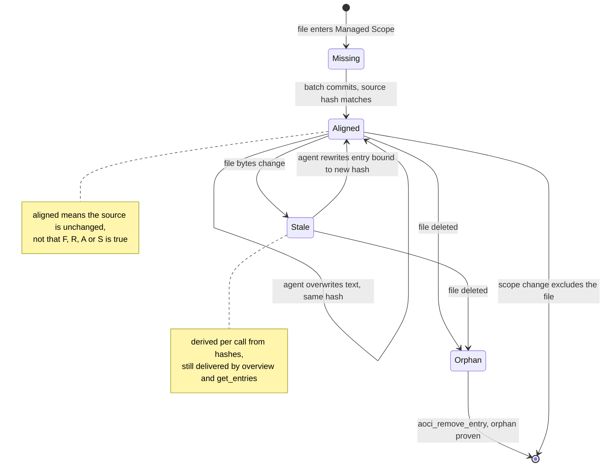

## 1. Executive Summary

AOCI-CODE is a Go CLI and stdio MCP server that keeps a persistent index of a
codebase in the repository itself: one line per file, written by the coding
agent from the source, describing what the file does, what must be read with
it, what it exposes and what must not be broken. The index is read whole at the
start of a session and maintained as files change.

What is notable is the binding between a claim and its evidence. Every Code
entry the agent writes must carry the SHA-256 of the file it describes, the
server re-hashes the file at commit, and the write is refused if the bytes
moved. Batches commit all-or-nothing, with a preimage recovery path that fails
closed on a third-party edit.

What is weak is that the only state an entry has is whether its file changed.
Nothing records whether the text is right, stale entries are delivered, and
the tool the rules name for disputing a live entry refuses in the default
layout.

The licence is FSL-1.1-MIT: source-available, with a competing-use exclusion,
converting each version to MIT two years after release (`LICENSE`, `NOTICE`).

The system is in scope because an entry is a model-authored claim that
outlives the session, is read back by later sessions and other agents, and can
be wrong. Its `S` field, *"what you cannot infer from the code but must not get
wrong"* in the README's words, is the part most like memory and the part least
checkable by the server. The machinery around it governs *transport*: which
bytes were delivered, which source a line was bound to, whether a write
completed. The README states the limit itself: all-green results *"do not mean
that every statement the model wrote is correct"*.

No mark is awarded. Section 9 names each of the seven and why.

## 2. Mental Model

**A memory is an entry about one object.** For code the object is a managed
file; for a database it is a table. An entry is a single line,
`atomic.go[CG9L]: F:… | R:… | A:… | S:…`, where the tag places the file by
layer, domain, importance and size, and the four fields are prose written by
the host model. The server validates structure, tag dictionary, budgets and
relation identities, and never authors text (`internal/codebatch/types.go:1-5`).

**An entry becomes a belief when a batch commits.** `aoci_maintain` issues
targets, files that are Missing an entry or whose entry is Stale, each with
the source digest the server saw. The agent reads the file, writes the line,
and submits it with that digest. The commit re-hashes the source and refuses
on mismatch (`internal/mcptools/tools_write_volume_commit.go:246-250`). No
candidate state is stored on the entry; a candidate that fails validation is
not written.

**An entry stops being current when its file changes, and stops existing when
its file does.** Staleness is not stored. `baseline.Detect` compares the
file's current hash with the one recorded at alignment and returns Missing,
Orphan, Stale or Unbaselined on each call (`internal/baseline/detect.go:1-11`).
A stale entry stays in the index and is still delivered. An entry is removed
only when its file is gone, proven from governance facts
(`internal/mcptools/tools_remove_volumes.go:211-230`), or when a scope change
takes the file out of management.

**A wrong entry about an unchanged file has no state at all.** It is aligned,
because its source hash matches, and it is delivered as settled. Correction is
an overwrite by the agent, bound to the same unchanged digest.

## 3. Architecture

`aoci` is one Go binary. `aoci mcp` runs a stdio MCP server that re-reads the
index, baseline and configuration on every tool call and caches nothing, on the
stated rule that a cached view would break *"a stale index is more dangerous
than none"* (`internal/mcptools/server.go:1-15`). It registers exactly nine
tools (`server.go:292-298`). No daemon runs; `aoci ui` is a separate
loopback-only, GET-only status panel.

**Two layouts.** The Legacy layout is one monolithic `aoci.txt`. The Volumes v1
layout, which `aoci init` writes, splits it: `aoci.txt` is a Root manifest
listing participating Volumes, `aoci.meta.txt` holds the tag dictionary, FRAS
rules and quotas, `aoci.code.txt` holds Code entries, and an optional
`aoci.database.txt` holds table entries bound to accepted schema evidence.
Entries sit in `===<directory>/===` sections keyed by basename.

**Local state under `.aoci/`.** `baseline.json` (per-file fingerprints and
roles), `config.json` and `curation.json` are committed; the template
`.aoci/.gitignore` denies everything else by default
(`textassets/en-US/templates/aoci-gitignore.txt`). That covers the ledger,
drafts, transactions, governance receipts and verify history, so each clone
keeps its own.

**Writes** take a cross-process index lock, compare the index hash read at plan
time, write each Volume with an atomic CAS, advance the baseline, and keep a
recovery record carrying the preimage until the baseline completes
(`internal/mcptools/tools_write_batch.go:381-686`). Database Cognition connects
read-only to PostgreSQL, MySQL or openGauss for catalog metadata, with the DSN
referenced by environment-variable name.

### Deployment and ergonomics

Nothing has to run but the binary and an MCP host. It is fully local, and no
API key is needed because the host's model does the writing through its own
channel. Install is a signed release archive or `make build`, then
`aoci init --agent` for the host, `aoci scan`, and a host restart. The store is
plain text in the repository, diffable and repairable by hand, though a hand
edit shows up as index drift that the governance gate reports. The first index
costs about an hour per 200,000 lines by the README's estimate, spent in the
host model's tokens.

## 4. Essential Implementation Paths

**Target issue.** `aoci_maintain` → `handleVolumeMaintain`
(`internal/mcptools/tools_maintain_volumes.go:110`) assesses drift, builds a
Code batch of up to 200 candidates with `candidate_id`, `batch_id`,
`source_sha256` and the existing entry (`internal/codebatch/types.go:9-16`),
and adds objects related through `R` to a changed entry to the review set
(`reviewClosure`, `tools_maintain_volumes.go:431-452`).

**Write.** `aoci_update_entry` → `handleMCPUpdateBatch`
(`internal/mcptools/tools_write_api.go:574`) refuses any item carrying
neither an issued candidate binding nor a 64-hex source digest (`:598-612`).
`planCognitionVolumeUpdates` validates candidate and batch identity against the
issued receipt (`tools_write_volume_commit.go:68-140`), requires a digest in
non-receipt mode (`:184-186`), re-hashes the source (`:246-250`), and runs
`prepareUpdateEntry` for budget, tag and S-quota checks
(`internal/mcptools/tools_write.go:123-200`). The commit is `commitAtomicBatch`
(`tools_write_batch.go:381`), which re-checks the bound sources after the write
and marks the baseline incomplete on drift (`:105-132`, `:600-606`).

**Read.** `aoci_overview` delivers the formal index verbatim between markers,
chunked at `overview_delivery.chunk_tokens` (default 7,000), and asks for an
attestation. `aoci_get_entries` looks up by path, directory (at most 50) or
object ref (`internal/mcptools/tools_read.go:544-623`). `aoci_search` runs
`index.Search` (`internal/index/query.go:145-205`). All three refuse while a
write transaction is pending (`internal/mcptools/transaction_guard.go:13-45`).

**Delete.** `aoci_remove_entry` calls `ApplyRemoveEntry(root, path, "agent",
true, false)` (`internal/mcptools/tools_remove.go:161`). A `code:` identity goes
to `planVolumeRemoveEntry`, which ignores the `orphanOnly` argument and calls
`proveVolumeOrphan` for every caller (`tools_remove_volumes.go:27`,
`:125-128`).

**Pre-edit hook.** `HandlePreTool` (`internal/hooks/pretool.go:42-146`)
injects the target file's entry before an Edit or Write, headed by a STALE
warning when the source moved, and blocks the write when `hook_strict` is on.

**Tests.** Section 10.

## 5. Memory Data Model

| Field | Where | Notes |
| --- | --- | --- |
| object | section path plus basename, or a `database://` identity | canonical identity `code:` plus the path |
| tag | bracketed after the name | layer, module, importance 1–9, optional characteristics, size band |
| F, R, A, S | the entry line | model prose; `R` names other objects by identity |
| source fingerprint | `.aoci/baseline.json` | SHA-256 per managed file at alignment |
| role | baseline and curation | `index`, `observe` or `exclude` per file |

There is no author, timestamp, status, confidence or version on an entry. Its
history is the Git history of the Volume file, which is committed. The only
per-object fact the server holds beside the text is the source digest in the
baseline, so the only question it can answer about an entry is whether its file
has changed since.

**Scope is the repository.** One index per repository; Code and Database
entries live in separate Volume files with separate ownership, and each object
has exactly one owning Volume. The `scope` argument to `aoci_search` selects
which Volumes to read (`internal/mcptools/tools_read_search.go:65-73`); it is a
partition selector, not a key on an entry.

## 6. Retrieval Mechanics

**The primary read is everything.** A new session loads the whole index through
`aoci_overview`, following `next_cursor` to the last chunk. The model then
answers a ten-ordinal challenge (object identity, tag and core `F` for
stratified positions), passed at 80% correct with at most one identity miss
and a Jaccard floor of 0.6 on `F` tokens
(`internal/mcptools/overview_attestation_v1.go:18-51`). A pass marks the
session's cognition reliable. The index is not re-injected per turn; the model
reloads after a declared compaction or past its refresh threshold, 30 distinct
semantic paths by default.

**Freshness is reported for the set, not the entry.** The Overview metadata
carries `cognition_currency: dirty_or_stale` and guidance to read current
source whenever governance is not aligned (`overview_delivery_v1.go:298-303`);
the entries themselves are delivered unmarked. The Legacy `get_entries`
prefixes each stale entry with a warning (`tools_read.go:389-404`). The
Volumes handler, used by default, prints every entry the same way
(`:611-620`).

**Search is substring and tags.** `index.Search` keeps an entry when the
lowercase keyword occurs in its full line and, if given, its tags satisfy a
filter such as `C>=5`; results cap at 30. Nothing ranks.

**The hook is the targeted read.** Before an edit, the PreToolUse hook puts the
file's own entry and its `S` constraints into context with a staleness check
(`pretool.go:94-129`). It is the one read that marks a stale entry per file in
the default layout.

## 7. Write Mechanics

Writes are explicit tool calls by the agent. The runtime rules and the managed
`AGENTS.md` block tell it to close each task by calling `aoci_maintain` and
writing the entries it issues. No model runs inside the server.

**Validation is structural.** `prepareUpdateEntry` enforces per-field token
budgets, the tag dictionary, relation identity and the S quota per importance
band; a budget overage returns a repairable finding with the exact token
counts (`tools_write.go:141-166`). What the fields claim is not checked against
the source.

**Every Code write is bound to evidence bytes.** The batch identity hashes
object, path, new text, source digest, candidate and batch ids
(`internal/mcptools/tools_write_batch_recovery.go:67-91`). A submission whose
digest differs from the issued one is refused with the expected value, and the
repair action tells the model never to compute the hash itself.

**Update is overwrite; delete is orphan-only.** In the Volumes layout,
`planVolumeRemoveEntry` requires a proven orphan or a machine ownership finding
whoever calls, and a dangling `R` in another entry is left for the model
(`tools_remove_volumes.go:139-141`). The Legacy CLI passes `orphanOnly=false`
with source `"human"` (`internal/cli/remove_entry.go:37`), so only there can a
person delete a live entry.

### Operational cost

- Write: synchronous, one lock and one CAS per batch of up to 200 entries; the
  cost is the host model reading each file and writing its line.
- Background: none. Drift is recomputed on each call by hashing managed files.
- Read: the whole index once per session and after compaction, in 7,000-token
  chunks by default; the README cites a 480-object index delivered in three
  24,000-token chunks. Stable across turns, so it does not disturb a prefix
  cache.

## 8. Agent Integration

`aoci init --agent` with `codex`, `claude`, `opencode` or `cursor` writes
project MCP configuration with absolute paths and a managed `AGENTS.md` rules
block; Cursor gets a snippet instead. `--hooks` adds the Claude Code PreToolUse
guard, or for Codex a compaction handoff limited to receipt identity,
unfinished write state and a reload instruction.

The agent holds read, write and orphan-remove verbs and nothing that approves.
`aoci_report` records a follow-up note when evidence is insufficient, and its
own description ends *"Volumes v1 returns volume_read_only"*: the handler calls
`loadRepoCtx`, which refuses the Volumes layout
(`internal/mcptools/tools_report.go:70`, `server.go:217-224`). The
`aoci_remove_entry` description meanwhile says *"Removing a non-orphan requires
a maintainer decision recorded with aoci_report"*
(`textassets/en-US/contracts/mcp/tools/remove-entry-description.txt:1`). In the
default layout that path does not exist.

Adapting it to another host needs a stdio MCP client that follows a chunk
cursor and submits an attestation. The design assumes the agent reads the
rules and complies; the server enforces transport and structure, not the order
of work.

## 9. Reliability, Safety, and Trust

**Concurrency and crash safety are the strongest part.** Writes take a lock,
compare the index hash, write atomically, and keep a recovery record with the
preimage. A retry either rolls forward to a provable postimage or restores the
exact preimage, and a third-party byte change fails closed. A read during a
half-committed cross-volume write refuses with `cognition_snapshot_unavailable`
rather than returning a mixed set (`transaction_guard.go:13-45`).

**Provenance is the source digest and nothing else.** An entry cannot say who
wrote it, when, or on what reasoning. Prompt-injected text in a source file the
agent reads can become an `S` constraint that later sessions are told to obey
before editing; the server validates its length, not its truth.

**Privacy.** The server reads schema metadata, never rows, stores no
credentials and opens no connection beyond the declared database and its own
loopback panel.

Capability marks:

- `tombstone` — no. Removal deletes the line; nothing keyed on the removed text
  refuses it later. Curation exclusions are keyed on paths.
- `trust_state` — no. Missing, Orphan, Stale and Unbaselined are derived from
  hashes on every call and never stored on the entry. No read filters on them:
  Overview and Volumes `get_entries` deliver stale entries.
- `bitemporal` — no time field on an entry.
- `scope_enforced` — no. The index is per repository and Volumes are separate
  files; no scope key sits on an entry.
- `audit_log` — withheld, and the near-miss is close. Two append-only records
  exist. `.aoci/ledger.jsonl` records every update batch and removal as
  telemetry, with op, `source`, counts and result, and never the object; its
  header calls it telemetry, and `ledger_enabled` switches it off
  (`internal/ledger/ledger.go:1-10`, `:182`). Governance receipts under
  `.aoci/governance/` are write-once, content-addressed and chained by pre- and
  post-index digest, and a reader proves supersession through them
  (`tools_write_governance_receipt.go:148-224`, `:276-339`). In the Volumes
  layout a receipt's `paths` are the Volume files, not the entries (`:166-168`).
  Removals write no receipt, and both records are git-ignored. Neither can say
  which entry changed or from what; the committed Volume's Git history can.
- `human_review` — no. The agent's `aoci_update_entry` overwrites any Code
  entry it can bind to the current source digest, with no queue. The one verb
  held back from the agent, deleting a live entry, is held back from everyone
  in the Volumes layout. Scope-change approvals govern which files are managed,
  not what an entry says.
- `negative_eval` — no. Section 10 names the two near-misses.

## 10. Tests, Evals, and Benchmarks

Nothing was built or run for this report; this section is from reading the
tests at the pin.

**Transaction safety is tested heavily.** The `tools_write_*` and
`tools_remove_*` tests cover CAS conflicts, postimage recovery, stale receipts
and budget repairs.
`TestEntriesRecoverClosesStageOnlyRunAfterProvenLaterGovernance` deletes a
stored governance receipt and asserts the run returns to pending
(`internal/cli/index_entries_recover_test.go:298-359`), so the receipts are
load-bearing.

**Two near-misses for a negative case.** `TestVolumeHeaderSearchAndGetEntries`
searches `canonical user` in the database scope and asserts that the table is
returned and `main.go` is not
(`internal/mcptools/tools_read_volumes_test.go:445-448`). The fixture's
`main.go` entry does not contain the keyword (`:69`), so the exclusion holds
whether or not the scope argument works.
`TestCrossVolumeIntermediatePostimageIsHiddenFromOrdinaryReads` asserts that a
search during a half-committed write fails with
`cognition_snapshot_unavailable`
(`internal/mcptools/tools_write_cross_volume_test.go:186-210`). That is a
refusal, with no positive control and no populated result from which material
is shown absent.

**Black-box suites.** `scripts/blackbox/` holds a protocol conformance script,
64 fault-injection scenarios, a lifecycle suite over three committed fixture
projects with an optional model track, and an upgrade axis across released
versions. CI runs conformance and scenarios on every push
(`.github/workflows/ci.yml:125-133`) and the lifecycle and upgrade suites in
`full-confidence.yml`.

**Not covered.** Nothing measures whether entries are correct, or whether an
agent with the index does better than one without. The changelog reports that
78 percent of one real build's entries had `S:-` and that a source audit found
most were misses. No paper or citation block is in the tree.

## 11. For Your Own Build

### Steal

- **Bind every stored claim to the digest of the evidence it was written
  from, and re-check the digest at commit.** The server issues the digest, the
  model echoes it, and a mismatch is refused with the expected value.
- **Make "stale" computable.** A per-object source fingerprint recorded at
  alignment turns "is this memory about a thing that changed?" into a hash
  comparison any process can run.
- **Show a memory at the moment it matters.** The pre-edit hook injects the
  file's constraints just before the write, with a staleness warning.
- **Check that delivery happened.** A recall challenge over sampled positions
  separates "the tool returned the bytes" from "the model holds them".
- **Fail reads closed during a partial write** instead of serving a mixed set.

### Avoid

- **Treating source-unchanged as correct.** A digest match proves the evidence
  did not move; it says nothing about the claim, and an index with no
  per-entry status cannot hold "on record but disputed".
- **Documenting a dispute path through a tool the default layout disables.**
  The remove description sends the agent to `aoci_report`, which refuses.
- **Audit records that name the container rather than the item.** A receipt
  chain over whole-file digests proves continuity for recovery and cannot say
  what changed.
- **Delivering stale entries unmarked on the per-object read** while the
  set-level flag says the index is dirty.

### Fit

This suits a team whose agents do sustained work on one large repository and
whose failure is re-reading the codebase each session. The cost is real: the
host model writes every entry, the first build is hours of tokens, and the
rules expect the agent to maintain the index at the end of every task. The
governance machinery is far larger than the memory it governs, and it protects
the index from torn writes and drift, not from a plausible wrong sentence.
Anyone who wants memory of decisions, preferences or conversations should look
at another design; this one remembers what files are.

## 12. Open Questions

- How often does an aligned entry misstate its file? The changelog's `S:-`
  audit is the only measurement, and it is not committed.
- What does `cognitionStatusLine` append to a Volumes `get_entries` result, and
  does it ever carry per-object drift?
- Is the Legacy `aoci_report` queue read by anything, or only by a person?
- Does the attestation challenge change model behaviour, or only the recorded
  cognition state?

## Appendix: File Index

- **Storage and schema:** `internal/cognition/`, `internal/index/parser.go`,
  `internal/index/validator.go`, `internal/baseline/baseline.go`,
  `internal/baseline/detect.go`, `textassets/en-US/templates/volume-meta.txt.tmpl`.
- **Write path:** `internal/mcptools/tools_write_api.go`,
  `tools_write_batch.go`, `tools_write_volume_commit.go`,
  `tools_write_batch_recovery.go`, `tools_write.go`, `internal/codebatch/types.go`.
- **Delete path:** `internal/mcptools/tools_remove.go`,
  `tools_remove_volumes.go`, `internal/cli/remove_entry.go`.
- **Retrieval and delivery:** `internal/mcptools/tools_read.go`,
  `tools_read_search.go`, `overview_delivery_v1.go`,
  `overview_attestation_v1.go`, `transaction_guard.go`,
  `internal/index/query.go`.
- **Maintenance:** `internal/mcptools/tools_maintain.go`,
  `tools_maintain_volumes.go`.
- **Records:** `internal/ledger/ledger.go`,
  `internal/mcptools/tools_write_governance_receipt.go`,
  `internal/cognitiontxn/transaction.go`.
- **Integration:** `internal/mcptools/server.go`, `internal/hooks/pretool.go`,
  `internal/cli/init.go`, `textassets/en-US/contracts/mcp/tools/`.
- **Tests:** `internal/mcptools/tools_read_volumes_test.go`,
  `tools_write_cross_volume_test.go`, `internal/cli/index_entries_recover_test.go`,
  `scripts/blackbox/`.

### Recorded searches

Checked against the checkout at the pinned revision.

- `grep -rliE 'arxiv|bibtex|@article|@misc|doi\.org|zenodo' . --exclude-dir=.git` — no match; no `CITATION.cff`.
- `grep -niE 'renamed|formerly' CHANGELOG.md README.md` — no match.
- `grep -rn 'saveCompletedEntriesGovernanceReceipt\|saveVolumeGovernanceReceipt' --include='*.go' internal`, non-test — callers only in `tools_write_batch.go` and `tools_write_volume_commit.go`; none on a remove path.
- `grep -rn '"governance"' --include='*.go' internal`, non-test — the receipt writer and `runmanifest.go`; no deleter.
- `grep -rn 'ApplyUpdateEntry(' --include='*.go' internal` — test files only; the single-entry pipeline has no live caller.
- `grep -rnE 'isatty|IsTerminal|term\.Is' --include='*.go' internal cmd`, non-test — no match.
- `grep -rln 'handleSearch\|handleGetEntries' --include='*_test.go' .` — four files; none asserts an exclusion that the keyword alone would not produce.
- `grep -n 'stale\|Stale' internal/mcptools/tools_read.go` — only the Legacy handler, `:390-400`.

## History

**2026-09-30** — [`fdb4cb9bf54d14bbe87002b58c6d72aefb706617`](https://github.com/aoci-spec/aoci-code/commit/fdb4cb9bf54d14bbe87002b58c6d72aefb706617) — first reading, at the head of `main`, a commit dated 29 September 2026. No mark awarded; section 9 names each near-miss. Screened before reading: no auto-run surface, two build-time execution points (`Makefile`, the vendored openGauss connector's `Makefile`), nine dependency files inside the cooldown — every file in a depth-1 clone dates to the tip — two unpinned surfaces in black-box fixtures, and `AGENTS.md` recorded as data. Read with `grep` and `sed`; nothing installed, built or run.
