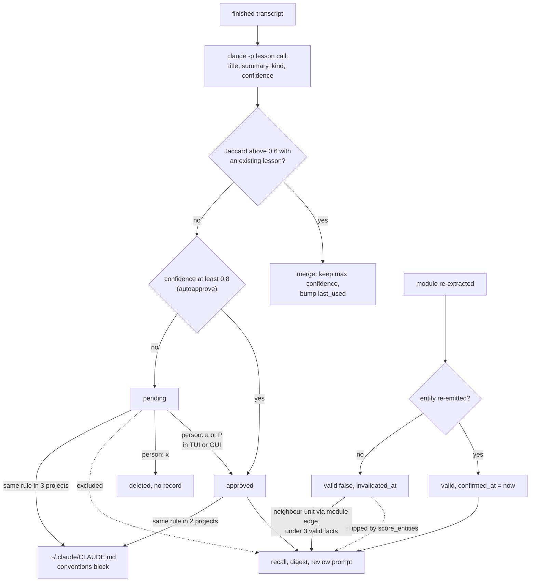

## 1. Executive Summary

archeus, formerly `claudectl`, is a terminal and desktop launcher for Claude
Code whose memory layer keeps a per-project knowledge graph of the codebase and
a set of lessons distilled from finished sessions. A headless `claude -p` call
summarises each module into entities and relations; another call per transcript
proposes lessons. Both land in one JSON file per project and reach the agent
through a small CLAUDE.md digest, path-scoped rule files and an opt-in
per-prompt hook.

What is notable is how much of the bookkeeping is right. Provenance hashes
advance only for modules a cycle actually extracted, so a failed or capped run
leaves the rest stale instead of marking it current. A fact a re-read no longer
emits is invalidated with a timestamp rather than deleted. The retrieval gate
returns nothing for a prompt made of stopwords. Nearly every one of these
carries a comment naming the measured defect it replaced.

What is weak is where the lesson review is bypassed. The extractor's own
confidence approves a lesson at 0.8 by default. A pending lesson that recurs
across three projects is written into the user-level `~/.claude/CLAUDE.md`
without review. Module-edge expansion in recall does not check validity, so an
invalidated fact can still be injected.

Two marks. `trust_state` rests on the lesson status, which every per-project
injection surface filters. `negative_eval` rests on a CI-run test asserting a
pending lesson stays out of `recall.retrieve` while an approved one on the same
words comes back. Section 9 names the five withheld.

The repository is MIT. The memory core is about 3,800 lines in nine modules;
the rest of the package is a session browser, account rotation, usage tracking,
an architecture graph and a GUI, none of which this report covers.

## 2. Mental Model

archeus holds three kinds of memory with three different epistemics.

**Code facts are re-derived, never asserted.** An entity exists because the
last extraction of its module emitted it. Re-extraction updates a surviving
entity in place, stamping `confirmed_at`, and invalidates one the model did not
re-emit with `valid: false` and `invalidated_at`
(`claude_sessions/memory.py:1240-1274`). A module that disappears from disk
invalidates its entities the same way (`:1183-1195`). Nobody, person or agent,
writes a code fact directly. Invalidated facts are kept as history for 30 days,
at most 40 at a time, and never injected by the main ranking path (`:47-52`,
`:1420-1425`, `:1465-1467`). A fact unconfirmed for 90 days is flagged `stale`
and deliberately not evicted (`:1426-1432`).

**Lessons are proposed, then reviewed or auto-approved.** One call per finished
transcript returns at most eight lessons, each with `kind` and a model-supplied
`confidence` (`claude_sessions/lessons.py:112-144`). `merge_lessons` folds a
near-duplicate into the existing lesson by token Jaccard above 0.6 and otherwise
writes a new one as `pending`, or as `approved` when the model's confidence
reaches `memory_lessons_autoapprove`, 0.8 by default (`:154-182`;
`claude_sessions/config.py:183`). A person approves, pins or evicts in the TUI
or the GUI. Unpinned lessons decay after 30 scanned sessions without being
injected (`lessons.py:185-196`).

**Conventions are lessons promoted by recurrence.** A preference, correction or
decision lesson that clusters across projects is written to the user-level
CLAUDE.md. A reviewed one needs two projects; a pending one needs three, and
the comment says why: *"waiting for a manual approval that never comes is why
this feature sat empty"* (`claude_sessions/conventions.py:20-26`).

The session agent writes none of this. It reads memory through what is
injected, and can run `archeus recall` over Bash.

## 3. Architecture

archeus is a pure-standard-library Python package (`claude_sessions/`) shipped
on PyPI, with launchers for npm, crates, NuGet, RubyGems and Packagist under
`packaging/` and a Claude Code plugin under `plugin/`. It drives the user's
installed `claude` CLI, or Codex or pi, for every model call, and needs no API
key of its own.

The store is one JSON document per project, `<project>/.archeus/memory/graph.json`,
written atomically to the working directory and mirrored to
`<config>/projects/<encoded>/.archeus/memory/` so cross-project scans can find
it (`claude_sessions/memory.py:57-63`, `:130-147`). A save that loses entities
first snapshots the old graph into a twelve-version ring under
`.archeus/snapshots/` (`:103-127`; `claude_sessions/diffview.py:26`, `:205-209`).
Beside it sit `worklog.json` (up to 50 heuristic session episodes, 60-day TTL),
`hits.log` (names injected by the prompt hook) and `dirty.log` (paths an edit
hook recorded).

Background work runs in a detached child process, `archeus --bg-scan`, spawned
with a 60-second cooldown and serialised by `scan.lock`, which is claimed with
`O_CREAT|O_EXCL` (`memory.py:209-241`, `:310-352`). `scan_guard` wraps every
refresh so the three manual build paths take the same lock (`:262-291`).
Headless calls run `claude -p --max-turns 20 --disallowedTools
Write,Edit,NotebookEdit,Bash` in the project directory, under an optional
`--max-budget-usd` and an optional routed provider (`:466-551`).

### Deployment and ergonomics

`pipx install archeus` and the Claude Code CLI are the whole install. Nothing
else runs; the GUI is a local server on 127.0.0.1 behind a per-run token held
in memory (`claude_sessions/gui.py:530-533`, `:600-610`). Fully local except
for the model calls, which spend the user's own Claude account; extraction
sends up to 40,000 characters of source per module to that account. The graph
is readable JSON and repairable by hand, and the snapshot ring gives twelve
undo points for a shrinking save.

## 4. Essential Implementation Paths

**Capture, code.** `refresh_memory` → `_refresh_locked`
(`memory.py:1112-1359`). `_units` splits the project into repo and module units
(`:762-786`); `_changed_units` compares each file's `(mtime_ns, size)` and
re-hashes only on a change (`:962-1008`). `_prioritise` orders the work by
just-edited, never-covered, dependency rank and recency (`:1024-1064`), and
`_reserve_for_new` keeps half a capped cycle for never-covered units
(`:1067-1082`). `_extract` asks for a `GRAPH_SCHEMA` object through
`--json-schema` and returns `None` on a failed call, distinct from an empty
result (`:662-714`). A failed unit keeps its old facts and its old hashes
(`:1226-1233`); provenance advances only for extracted units (`:1319-1321`).

**Capture, lessons.** `auto_cycle` runs the refresh, then `scan_sessions` over
`pending_sids` (`memory.py:1629-1706`). `pending_sids` walks the project's
session folder under every account, skips transcripts under 500 bytes, younger
than 60 seconds or written by archeus's own headless calls
(`lessons.py:45-74`). Each transcript is one `extract_lessons` call and one
save; the scan then runs `apply_decay` and `conventions.sync_to_global`
(`:222-246`).

**Consolidation.** `_consolidate` merges valid entities with the same
normalised name within one repo, summing rank, keeping the longer summary and
flagging a pair whose summaries overlap below 0.3 as a `conflict`. It then
holds pinned entities out of a 500-entity cap and evicts the rest by
`rank + 2 * hits` (`memory.py:1453-1546`).

**Forgetting.** `forget_pass` runs with no model call on every scheduler pass:
worklog TTL, lesson decay, expiry of invalidated facts past 30 days, and the
90-day stale flag (`memory.py:1390-1440`).

**Retrieval.** `recall.retrieve` → `build_index` → `score_entities` →
`expand_relations` → `render_context` (`claude_sessions/recall.py:454-509`).
Details in section 6.

**Injection.** `sync_to_claudemd` writes `build_digest_micro` between
`ARCHEUS:MEMORY` sentinels in every installed harness's instructions file
(`memory.py:1769-1840`, `:1878-1890`; `claude_sessions/claude_md.py:86`).
`memrules.sync_rules` writes one `archeus-mem-<repo>-<module>.md` per unit with
two or more valid non-lesson entities, scoped with `paths:`
(`claude_sessions/memrules.py:80-157`). `recall_hook.py` answers
`UserPromptSubmit` with the recall text as `additionalContext`
(`claude_sessions/recall_hook.py:42-73`). `worklog_hook.py` captures an episode
at Stop or SessionEnd and injects the worklog digest at SessionStart
(`claude_sessions/worklog_hook.py:53-84`).

**Review.** TUI `review_screen` and GUI `api_lessons_post` call `_set_status`
or `_evict`, each a load, edit and whole-file save (`lessons.py:254-318`;
`claude_sessions/gui_api.py:2679-2697`). `conventions.pin_convention` pins every
lesson clustering with a text in every project (`conventions.py:177-202`).

## 5. Memory Data Model

| Field | On | Notes |
| --- | --- | --- |
| `id` | entity, lesson | `entity:` plus repo, module and name, or `lesson:` plus session id and index |
| `name`, `summary`, `type` | both | type clamped to `module, component, concept, service, model` or `lesson` |
| `repo`, `module`, `source_files` | both | lessons carry `repo: ''`, `module: '(project)'` |
| `valid`, `invalidated_at` | entity | set by re-extraction; lessons never set them |
| `created_at`, `confirmed_at` | entity | first sighting; last re-emission |
| `stale` | entity | 90 days unconfirmed; flag only |
| `rank`, `hits` | both | dependency degree of the unit; injections folded from `hits.log` |
| `status` | lesson | `pending`, `approved`, `pinned` |
| `kind`, `confidence`, `sid`, `sids`, `last_used` | lesson | `last_used` is a session counter, not a time |
| `conflict` | entity | the losing summary and its module, after a disagreeing merge |

The graph also holds per-unit `summaries`, `relations` tagged with their unit,
`module_edges` from the import graph, per-file `provenance` hashes and
signatures, `lessons_scanned` by session id and a lifetime `cost_usd_total`
(`memory.py:66-75`).

There is no scope key on a row. `repo` scopes the consolidation merge
(`memory.py:1481-1489`) and is used by no read as a filter. The boundary is the
file: the prompt hook opens `.archeus/memory/graph.json` under the hook's `cwd`
(`recall_hook.py:46`), and `archeus recall` resolves the project from the
working directory (`claude_sessions/main.py:36-47`).

`invalidated_at` and `confirmed_at` are both observation times — when a re-read
stopped or kept emitting a fact. Neither records when the fact was true of the
code.

## 6. Retrieval Mechanics

Retrieval is lexical and deterministic, with no embeddings. `query_tokens`
drops stopwords and single characters, and an empty token set returns nothing
(`recall.py:44-57`, `:130-132`, `:209-212`). `build_index` computes BM25 IDF
over valid entities only (`:60-103`). `score_entities` skips invalid entities
and pending lessons, admits a candidate only on token or path-segment overlap,
and fuses four rankings — lexical, path, dependency rank, lesson confidence —
by reciprocal rank with `k = 60` and weights 1.0, 0.8, 0.35 and 0.5
(`:119-127`, `:198-261`).

`retrieve` takes the top 24 seeds, expands the top eight by one hop and, when
the seeds cost under half the budget, the top four by two hops
(`recall.py:466-474`). Expansion follows entity relations, skipping pending
lessons, and module import edges, taking the first three entities of each
neighbouring unit and skipping lessons (`:264-302`). **The module-edge branch
does not check `valid`.** `_consolidate` orders the list valid-first, so a
neighbouring unit with fewer than three valid entities contributes invalidated
ones, and `render_context` emits them as ordinary facts (`:292-299`,
`:310-384`; `memory.py:1537`). This was read, not reproduced.

`render_context` fits rather than truncates: a line that does not fit is
skipped and smaller lines behind it still enter. Relations among included
entities come next, then approved lessons, then up to two past-session episodes
scored by the same BM25 (`recall.py:149-195`, `:310-384`). The default budget
is 600 tokens. The names actually emitted go to `hits.log`, unless the call is
a preview (`:454-509`).

`hits` are folded by name, not id, so every entity sharing a name — one per
repo after consolidation — is credited for one injection (`recall.py:441-446`).

`ask_memory`, the GUI and TUI question surface, falls back on an empty recall
to the first twelve entities of the graph with no status or validity check
(`memory.py:1900-1908`). It is reached only from the GUI and TUI.

## 7. Write Mechanics

The session agent never writes memory. Every write is archeus's own:
extraction and lesson calls in a background worker, or on demand from the TUI
and GUI; heuristic episode capture at Stop; and a person's lesson actions.

**Freshness and cost.** Extraction is capped per cycle (`auto_cap`, 6 by
default, and `memory_max_calls`); the remainder is reported as queued and taken
by the next cycle at the configured interval. A failed unit is counted
separately from a capped one, with the error text kept (`memory.py:1166-1176`,
`:1322-1337`). Every model call's `total_cost_usd` is folded into a lifetime
total (`:932-950`). The prompt-path writes are one appended line to `hits.log`;
the edit hook appends one line to `dirty.log`.

**Dedup and conflict.** Code facts dedupe by normalised name within a repo; a
disagreeing pair is flagged and the longer summary still wins
(`memory.py:1500-1513`). Lessons dedupe by token Jaccard above 0.6, keeping the
higher confidence. Nothing compares a lesson against code facts.

**Delete.** A lesson's evict deletes the row (`lessons.py:315-318`). There is
no rejected state and no record of the evicted text, and `lessons_scanned`
records sessions, not lessons, so a later session that yields the same lesson
creates it again as new.

**Concurrency.** The scan lock serialises refreshes and lesson scans. The
review writers do not take it: `_set_status` and `_evict` load, edit and save
the whole file, so an approval made while a background cycle holds an earlier
copy can be overwritten when that cycle saves.

**Agent-generated content.** Lessons come from transcripts the agent wrote
into. The prompt asks for durable error-fix pairs, decisions, corrections and
preferences; nothing filters a lesson that encodes a mistaken belief, and one
the model rates at 0.8 is approved on arrival.

### Operational cost

- Write: asynchronous; nothing blocks the agent. A new code fact is retrievable
  after the next cycle reaches its module, which on an opted-in project is the
  configured interval and on a large backlog several cycles. A lesson is
  retrievable after its transcript is scanned and, unless auto-approved, after
  a person approves it.
- Background: one model call per changed module (up to 40,000 characters of
  source) and one per finished transcript. No pass re-reads the whole store
  with a model; `forget_pass` is token-free.
- Read: a digest capped at 250 tokens in CLAUDE.md on every turn, rule files
  capped at 400 tokens each loaded when Claude opens a matching path, and up
  to 600 tokens per prompt from the hook. The hook's text is a per-prompt
  `additionalContext`, which sits after the cached prefix; the CLAUDE.md digest
  changes only when a cycle rewrites it.

## 8. Agent Integration

Five surfaces, all controlled by archeus rather than the agent:

- The `ARCHEUS:MEMORY` digest in CLAUDE.md and the other harnesses'
  instruction files, ending with a pointer to `archeus recall`.
- `.claude/rules/archeus-mem-*.md` scoped by `paths:`; the code comment records
  that an earlier `globs:` key made every rule load unconditionally
  (`memrules.py:80-88`).
- The `UserPromptSubmit` recall hook, installed user-wide and enabled per
  project, off by default (`claude_sessions/hooks.py:403-421`; `config.py:176`).
- `archeus recall "<topic>"` over Bash, and the plugin's `/recall`, `/status`
  and `/review` commands (`plugin/commands/`). The review prompt includes up to
  twenty approved or pinned lessons (`claude_sessions/review.py:63-73`).
- The SessionStart worklog digest, opt-in per project.

The agent has no write verb and no review verb. The CLI exposes `workspace
status`, `recall`, `review`, `sync-accounts` and `statusline`
(`main.py:291-312`); lesson actions exist only in the TUI and in GUI routes
behind the per-run token.

The `reinject-after-compact` hook preset registers `recall_hook.py` on
`PostCompact` (`hooks.py:292-302`). `recall_hook.main` acts only when
`hook_event_name` is `UserPromptSubmit` and returns 0 otherwise
(`recall_hook.py:63-73`), so the preset installs a hook that does nothing. The
two tests that cover it assert its event name and label
(`tests/test_statusline.py:338-339`; `tests/test_tui_hooks.py:326-331`).

## 9. Reliability, Safety, and Trust

**Work is never marked done unless it was done.** A failed extraction keeps the
module's facts and leaves its hashes stale, a capped cycle leaves the skipped
units stale, and an empty-store refresh still stamps freshness without a model
call. Each of these has a comment describing the defect it replaced
(`memory.py:1219-1233`, `:1305-1321`, `:1138-1163`).

**Two bypasses around the lesson review.** The extractor writes the confidence
that decides `approved` at 0.8, and `memory_lessons_autoapprove` is on by
default. Independently, `conventions._candidates` counts `pending` lessons, and
a rule seen in three projects is promoted into the user-level CLAUDE.md that
every session on the account loads (`conventions.py:105-145`, `:218-256`).
Setting autoapprove to 0 closes the first and not the second.

**Invalidation is not enforced on every read.** `score_entities`, `build_index`,
the digest and the rule files all skip `valid: false`. Module-edge expansion
does not (section 6), and `ask_memory`'s empty-result fallback widens to the
first twelve entities regardless.

**Declared and unwired: pinning a code fact.** The docs say *"Pin any entity or
lesson and the importance cap can never evict it"*, and `_consolidate` holds
pinned entities out of the cap (`memory.py:1514-1534`). The only writers of
`status` are `_set_status`, called from the lesson table, and
`pin_convention`, which touches lessons; the GUI's pin button renders per
lesson (`claude_sessions/web/app.js:2729-2731`). No path pins a code entity.

**Privacy.** Extraction sends module source to the user's model account. The
digest and the rule files are written into the repository's own CLAUDE.md and
`.claude/rules/`, so they travel with any commit that includes them. The
conventions block crosses every project on the machine by design.

**Uncertainty.** A pending lesson is the one memory archeus holds without
believing it. A code fact's `stale` and `conflict` flags are shown in the GUI
and do not change what is injected.

Capability marks:

- `trust_state` — awarded. The lesson status is a stored, discrete field;
  `pending` is excluded from scoring, relation expansion, the digest and the
  review prompt, and module-edge expansion excludes lessons altogether. The
  auto-approval threshold and the conventions promotion are the limits.
  `valid` on code facts is supersession, not a review state.
- `negative_eval` — awarded; evidence in section 10.
- `human_review` — withheld. The queue is real and its approve verb is on no
  agent surface, but a status the producer can write fails the mark: the
  extractor's confidence approves at 0.8 by default, and pending lessons reach
  the global CLAUDE.md at three projects with no person involved.
- `tombstone` — withheld. Evicting a lesson deletes it; nothing keyed on its
  text stops a later session from proposing it again. Invalidation is keyed on
  a record and expires after 30 days.
- `bitemporal` — withheld. `created_at`, `confirmed_at` and `invalidated_at`
  are all times the system observed something.
- `scope_enforced` — withheld. One graph per project directory is a physical
  partition; `repo` is on the row and no read filters on it.
- `audit_log` — withheld. The snapshot ring keeps twelve versions and deletes
  older ones, so it is not append-only; `events.py` logs archeus's own failures,
  not memory mutations.

## 10. Tests, Evals, and Benchmarks

Nothing was installed or run for this report; everything below is from reading
the tests at the pin. CI runs `pytest tests/` on Windows with Python 3.10, 3.12,
3.13 and 3.14 and on Ubuntu and macOS with 3.12, after asserting at least 1,300
tests were collected (`.github/workflows/ci.yml`).

**The negative cases.** `test_pending_lessons_never_injected` saves a pending
and an approved lesson on the same words and asserts, through
`recall.retrieve`, that the approved one is in the text and the pending one is
not (`tests/test_lessons.py:108-121`). `test_scoring_order_and_lesson_boost`
asserts a pending lesson absent from a ranking that contains a code fact and an
approved lesson (`tests/test_recall.py:35-43`).
`test_a_pending_lesson_is_never_retrievable` repeats the check over every
eval query (`tests/test_recall_eval.py:130-133`).

**A case without a control.** `test_an_invalidated_fact_is_never_retrievable`
adds `OldCache` with `valid: false` and asserts it is absent from the ranking
for *caching layer*. No other entity in the fixture contains either word, so an
empty result passes too (`tests/test_recall_eval.py:136-142`). It tests
`score_entities` only; no test runs expansion against an invalidated fact.

**Retrieval quality.** `tests/test_recall_eval.py` is a deterministic recall
eval over a ten-entity fixture with per-category recall at six (exact name,
descriptive, path, lesson), a must-be-empty list of contentless prompts, a
budget-fit case and a check that reinforcement credits only rendered names. The
file's header states the ceiling: lexical retrieval misses a query sharing no
vocabulary with the summary.

**Beyond recall.** `tests/test_memauto.py` holds that an auto cycle writes only
inside its own sentinels and files. `tests/test_memory.py` covers the refresh,
failure and capping paths. `tests/test_conventions.py` covers promotion
thresholds and pinning.

**Not covered.** The race between a review write and a background save; the
`PostCompact` hook producing output; module-edge expansion of invalidated
facts. No paper, and no external benchmark result is committed; `CITATION.cff`
cites the software.

## 11. For Your Own Build

### Steal

- **Advance provenance only for work that completed.** Record a unit's hashes
  after its extraction succeeds, not at the end of the run, and keep the old
  facts when a call fails. A capped or failed cycle then leaves exactly the
  unfinished work stale.
- **Invalidate on non-re-emission.** When a source is re-read, a fact the
  extractor no longer produces is the strongest supersession signal available,
  and it needs no contradiction detector.
- **Gate retrieval on content tokens, not on score.** A stoplist plus "no
  overlap, no candidate" makes a contentless prompt inject nothing; an IDF that
  never reaches zero cannot.
- **Credit reinforcement to what was rendered, and never on a preview.**
  Otherwise inspecting memory reshapes eviction.
- **Mark your own headless calls.** archeus appends a marker to every prompt it
  sends so its transcripts are never mined for lessons or listed as sessions.

### Avoid

- **Letting the proposer's confidence clear its own review.** If a threshold
  must exist, compute it from something the extractor does not write.
- **A second promotion rule that counts unreviewed items.** Recurrence across
  projects is evidence, and it is also how one wrong habit of the same model
  appears in three places.
- **Putting the validity predicate in the scorer and not in the expander.** Any
  path that adds candidates after ranking needs the same filter.
- **Review writes outside the lock the background writer holds.** A
  whole-file read-modify-write needs the same lock on both sides.

### Fit

This suits a single developer who runs Claude Code across several projects and
is willing to spend model calls to keep a summarised map of each codebase
current. It is a product with a memory layer, not a memory library: the graph
format, the injection surfaces and the scheduler are tied to archeus's launcher
and to Claude Code's file conventions. A team that needs memory scoped by
person, auditable corrections, or lessons that never act before review should
treat the code as reference for the freshness bookkeeping and the recall gate,
not as a component.

## 12. Open Questions

- Does Claude Code accept `additionalContext` from a `PostCompact` hook at all,
  which would decide whether fixing the dispatch is enough?
- How often does a neighbouring unit hold fewer than three valid entities on a
  real graph, which bounds how often expansion injects an invalidated fact?
- How many lessons does the default 0.8 threshold auto-approve in practice?
- Is the review-versus-worker race observed, or does the GUI's job model keep
  them apart in practice?

## Appendix: File Index

- **Store and graph:** `claude_sessions/memory.py` (persistence, scan lock,
  extraction, refresh, consolidation, forget pass, digest), `claude_sessions/diffview.py`,
  `claude_sessions/jsonstore.py`.
- **Lessons and conventions:** `claude_sessions/lessons.py`,
  `claude_sessions/conventions.py`.
- **Retrieval and injection:** `claude_sessions/recall.py`,
  `claude_sessions/recall_hook.py`, `claude_sessions/memrules.py`,
  `claude_sessions/claude_md.py`, `claude_sessions/worklog.py`,
  `claude_sessions/worklog_hook.py`, `claude_sessions/memdirty_hook.py`.
- **Surfaces:** `claude_sessions/main.py`, `claude_sessions/cli.py`,
  `claude_sessions/hooks.py`, `claude_sessions/gui_api.py`,
  `claude_sessions/review.py`, `plugin/commands/`.
- **Settings:** `claude_sessions/config.py:174-186`.
- **Tests:** `tests/test_recall.py`, `tests/test_recall_eval.py`,
  `tests/test_lessons.py`, `tests/test_memory.py`, `tests/test_memauto.py`,
  `tests/test_conventions.py`, `.github/workflows/ci.yml`.

### Recorded searches

Checked against the checkout at the pinned revision.

- `rg -n "valid" claude_sessions/recall.py` — lines 70, 74 and 220 only; `expand_relations` has no validity check.
- `rg -n "e\['status'\]|\['status'\] = " claude_sessions --type py` — `lessons.py:310` and `conventions.py:196` are the only status writers outside job bookkeeping.
- `rg -n "action:\s*'pin'|api/lessons" claude_sessions/web/*.js claude_sessions/gui_api.py` — the pin action is sent only from the lesson table rows.
- `rg -n "argv|'recall'" claude_sessions/main.py claude_sessions/__main__.py` — no lesson, approve or forget command on the CLI.
- `rg -n -i "tombstone|rejected|blocklist|suppress|denylist" claude_sessions/lessons.py claude_sessions/memory.py claude_sessions/conventions.py` — no value-keyed rejection record.
- `rg -n "repo|module" claude_sessions/recall.py | rg -i "filter|==|!="` — no match; no read filters on `repo`.
- `rg -n "PostCompact|reinject" tests/*.py` — the two tests assert the preset's event and label only.
- `grep -rliE 'arxiv|bibtex|@article|@misc|doi\.org' --exclude-dir=.git .` — no match.

## History

**2026-10-03** — [`a52ccb47f5dcec888df27e900486fc1f1b7f38c6`](https://github.com/babarmuhammad/archeus/commit/a52ccb47f5dcec888df27e900486fc1f1b7f38c6) — first reading, at the head of `main`, a commit dated 28 September 2026. Two marks, `trust_state` and `negative_eval`. Screened before reading: one auto-run surface (`.claude-plugin/marketplace.json`, a plugin manifest pointing at `./plugin`, whose commands run `archeus` over Bash), one build-time execution point (`tests/conftest.py`, environment isolation only), eight dependency files inside the cooldown — every file in a depth-1 clone dates to the tip — and four unpinned surfaces; `www/AGENTS.md` was treated as data. Nothing installed, built or run. Only the memory layer was read.
