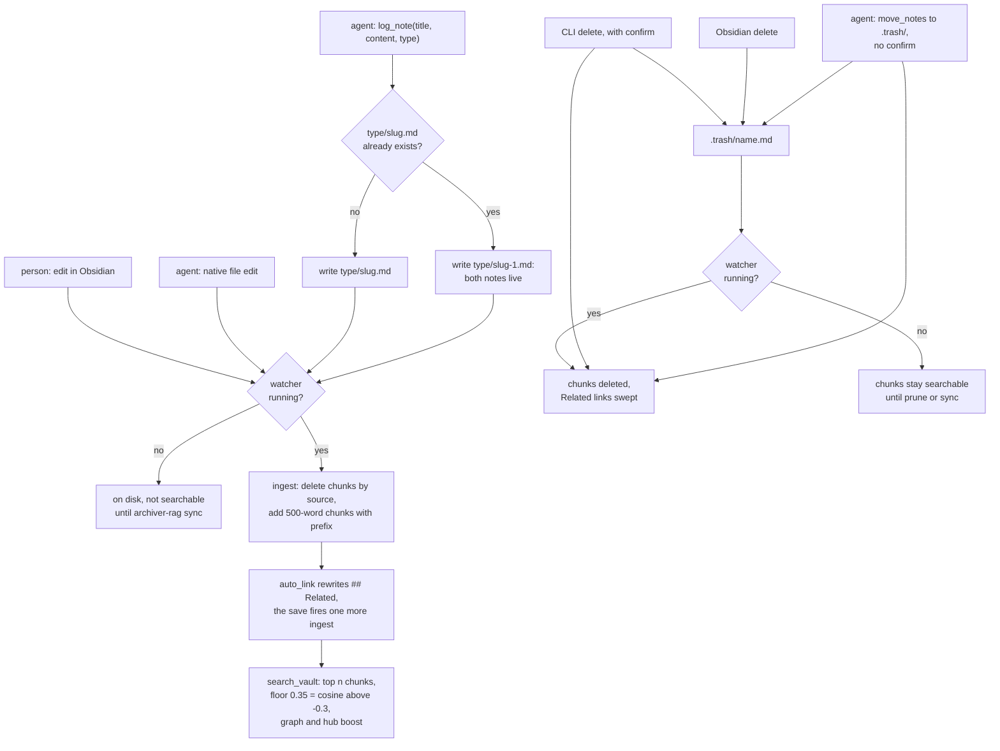

## 1. Executive Summary

Archiver RAG is a memory server for coding agents whose store is the user's
Obsidian vault. An agent searches it with `search_vault` and writes to it with
`log_note`, which creates a Markdown file under `<type>/<slug>.md`. A separate
watcher process embeds every saved note into a local Chroma collection and
rewrites the note's `## Related` section with links to its nearest neighbours.
The bundled instruction files tell each agent to treat the vault as its primary
memory, ahead of its own.

What is notable is that correction is ordinary editing. A wrong note is a file
a person opens in Obsidian and fixes or deletes, and the watcher carries the
change into the index on save. What is weak is everything the agent does on its
own: its writes are believed on arrival and never deduplicated, its one
mutating verb besides `log_note` can trash any note, and the search it relies
on has a relevance floor that admits nearly every chunk in the index.

The project is a single-author Python package published to PyPI as a beta.
Its tests cover file mechanics, the watcher's event routing, placement
arithmetic and the MCP surface; none runs `search_vault`, `ingest_file` or
`prune_orphans` against a real collection.

Five findings shape the rest of this report.

- **The score floor is not a floor.** `rerank` computes
  `base_score = 1 - dist/2` from Chroma's cosine distance, which is
  `(1 + cosine) / 2`, and drops chunks below 0.35, so a chunk passes at a
  cosine of -0.3 (`archiver_rag/graph/rerank.py:35-38`). The skill tells the
  agent to fall back to its own memory when the score is below threshold, and
  describes the parameter as a *"Minimum base cosine score"*
  (`skill/claude-code/SKILL.md:19`, `:80`).
- **A restated memory stacks.** `log_note` never reads the index; a title that
  already has a file gets `slug-1.md` beside it
  (`archiver_rag/vault/notes.py:36-47`). Nothing in the code or the skills
  tells the agent to edit or replace an existing note.
- **The agent can delete through `move_notes`.** The tool checks that source
  and destination resolve inside the vault and nothing else
  (`archiver_rag/vault/reorganize.py:62-71`), so a destination of
  `.trash/<name>.md` removes the note from the index and sweeps every link to
  it. The CLI's `delete`, which does the same thing, asks for confirmation.
- **Writes and deletes need the watcher.** `log_note` writes the file and
  returns; indexing happens only in the watcher, and the watcher does no
  catch-up when it starts. A note logged while it is down is unsearchable, and
  a note deleted while it is down stays searchable, until `sync` or `prune`.
- **The HTTP transport is open to the browser.** It performs no authentication
  by design, and DNS-rebinding protection is enabled only when the operator
  passes `--allowed-host` (`archiver_rag/mcp/http.py:57-78`). On the default
  loopback bind, a rebinding page can reach `log_note`.

No capability mark. Section 9 names the seven withheld.

## 2. Mental Model

A memory is a Markdown note. It becomes a belief when the file exists: there is
no extraction, no candidate state and no model call between an agent's
`log_note` and the note being indexed. It stops being one when the file leaves
the visible vault, by deletion or by a move into a dot-directory, and the
watcher or a later `prune` removes its chunks. There is no other exit: no
supersession, no expiry, no status.

**The file is the record and the index is a cache of it.** `ingest_file`
deletes every chunk whose `source` is the note's vault-relative path and adds
fresh ones (`archiver_rag/core/ingest.py:106-126`). An edit therefore replaces
the note's whole indexed presence, and the index never holds two versions of
one path. Identity is the path: a rename or a move is a delete of the old
source and an ingest of the new one (`archiver_rag/watcher.py:616-640`).

**Correction belongs to whoever can edit files.** The six MCP tools include no
edit and no delete (`archiver_rag/mcp/server.py:23-178`). A person corrects in
Obsidian. An agent whose harness has its own file tools, as Claude Code does,
can edit the note directly; the watcher's atomic-save handling exists because
such saves were being missed (`archiver_rag/watcher.py:573-583`). An agent
reached only over MCP can add a note, move one, or move one into `.trash/`.

**Two writers share each note.** The author owns the body; `linker.py` owns the
`## Related` section and rewrites it after every ingest
(`archiver_rag/graph/linker.py:257-299`). Ingest strips that section from the
chunk text so neighbour names do not shape the embedding
(`archiver_rag/core/ingest.py:83-87`). The embedding prefix, though, is built
from `extract_wikilinks(raw)` over the unstripped file (`:69`, `:81`). Up to
eight link targets enter every chunk's vector, auto-written ones included once
the body's own links run out.

## 3. Architecture

Three kinds of process share the vault and the Chroma directory. The MCP
server runs over stdio, spawned by each client, or as one streamable-HTTP
daemon on `127.0.0.1:8077`. The watcher runs as a launchd agent or a systemd
user service (`archiver_rag/service.py`). The CLI is a fresh process per
command.

**Persistence.** The vault is plain Markdown wherever the user keeps it. The
index is a Chroma `PersistentClient` collection named `obsidian_vault` with
cosine HNSW, under `~/.local/share/archiver-rag/chroma_db`
(`archiver_rag/core/db.py:65-73`). `centroids.json` caches one embedding per
described folder for placement. `runtime.json` under the cache directory holds
the watcher's last event and its counters since start
(`archiver_rag/runtime.py:90-115`).

**Freshness across processes.** A long-lived server holding a
`PersistentClient` does not see another process's writes. `_LazyCollection`
stats `chroma.sqlite3` before each call and reconnects when its mtime or size
moved, re-capturing the signature after its own calls so its writes do not
look external (`db.py:75-125`); the docstring explains why the HNSW segment
files would be the wrong thing to watch. Concurrent writes are a separate
matter: the watcher and the MCP server both write to the collection, and the
server's write lock is per-process by its own comment
(`archiver_rag/mcp/server.py:182-192`).

**Embedding.** `sentence-transformers` with `all-MiniLM-L6-v2` on the CPU,
loaded lazily and switched to offline mode once cached
(`archiver_rag/core/embedder.py`). The chunker cuts 500 words with a 50-word
overlap (`archiver_rag/core/chunker.py`). The model's published configuration
truncates input at 256 word pieces, so most of a full 500-word chunk, after
the prefix, is stored as text and never embedded. That limit is read from the
model card, not measured here.

**Organisation features.** Folder descriptions in `_folder.md` sidecars,
generated by c-TF-IDF with MMR (`archiver_rag/graph/terms.py`), let
`suggest_folder` place a note by cosine against each folder's centroid
(`archiver_rag/graph/placement.py`). With `auto_cluster`, `auto_describe` and
`auto_inbox` on, all three off by default at this pin, the watcher moves new notes,
rewrites descriptions and spins inbox clusters out into new folders. These
change where a note lives, and so its embedding prefix; they change nothing
about whether it is believed.

### Deployment and ergonomics

`pipx install archiver-rag` or `uv tool install`, then `archiver-rag init`,
which asks for the vault path, indexes it, registers the stdio server in
`~/.claude.json` and optionally installs the watcher at login. PyTorch makes
the install about 1.4 GB and the model is a 90 MB download on first use. No
API key and no network service are needed after that; macOS and Linux only.

The store is the best part of the deployment story. It is a folder of Markdown
the user already reads, Obsidian's own trash makes deletion recoverable, and
removing Archiver RAG leaves a normal vault. `archiver-rag index` rebuilds the
index from it at any time.

`is_hidden_path` treats any path component beginning with a dot as hidden, and
the enumerations pass it absolute paths (`archiver_rag/utils.py:48-68`,
`:80-100`; `archiver_rag/core/ingest.py:56`). A vault whose own path passes
through a dot-directory therefore indexes, links and counts nothing.

## 4. Essential Implementation Paths

**Write.** `log_note` (`archiver_rag/vault/notes.py:50-108`) reduces `type` to
its last path component, builds frontmatter with `type`, today's `date`,
`tags` and a `related` list, takes the first free name among `slug.md`,
`slug-1.md`, … (`:36-47`), writes the file, and gives an undescribed folder a
description from it. It does not ingest. The MCP dispatcher serialises it with
`move_notes` under one in-process lock (`server.py:355-359`).

**Ingest.** The watcher's `on_created`, `on_modified` and `on_moved` call
`ingest_file` then `auto_link` (`archiver_rag/watcher.py:491-528`, `:627-640`).
`ingest_file` parses frontmatter, extracts wikilinks and tags, takes `type`
from frontmatter or the folder name, builds the prefix, chunks the body with
`## Related` stripped, embeds, counts inbound links by reading the whole vault
(`ingest.py:47-49`), and replaces the note's chunks (`ingest.py:52-128`).

**Auto-link.** `select_related_candidates` embeds the stripped body, queries 40
chunks, keeps each note's best score above 0.55 on the same `(1+cosine)/2`
scale, and keeps every note within `link_margin` 0.05 of the top one, at most
15 (`linker.py:178-254`). `_append_links_section` rebuilds `## Related` from
that set, keeps links the author also wrote in the body, drops targets with no
file, and returns the original string object when nothing changed so the
caller skips the write (`linker.py:59-158`, `:294-299`).

**Search.** `search_vault` (`archiver_rag/core/search.py`) embeds the query
and asks Chroma for `n_results` chunks, three times that when `tags` will
post-filter, with an optional `where` on `type` (`:17-30`). `rerank` reads
every note to build the link map (`rerank.py:28`) and drops chunks under
`min_score`. It adds 0.10 each for an outgoing and an incoming link with the
context note, and up to 0.10 for inbound links saturating at 12, then sorts
and truncates (`rerank.py:33-74`).

**Traverse.** `get_connections` builds the same link map and walks it
breadth-first to the requested depth, returning stems per layer
(`archiver_rag/graph/connections.py`).

**Delete.** The CLI's `delete` resolves names, prints the impact, and asks for
confirmation unless `--yes` (`archiver_rag/cli.py:373-445`). `delete_notes`
then moves each file to a collision-safe name in `.trash/`, sweeps
`## Related` in every note that linked to it, and prunes the index
(`archiver_rag/vault/notes.py:147-204`). A delete in Obsidian reaches the
watcher in one of two shapes. A move into `.trash/` evicts the old source and
sweeps (`watcher.py:616-625`, `:668-678`). A delete event first waits up to a
second for the file to reappear, because an atomic save reports as modify then
delete, and then evicts and sweeps (`watcher.py:37-56`, `:530-570`).

**Move.** `move_notes` (`archiver_rag/vault/reorganize.py:49-112`) checks both
paths resolve inside the vault, refuses an existing destination, and moves the
file. When the stem changed it rewrites `[[old]]`, `[[old#h]]`, `[[old|alias]]`
and bare YAML `related` entries across the vault (`:8-46`), then prunes.

**Repair.** `sync` re-ingests notes whose file mtime is newer than the indexed
one and prunes; `prune` drops chunks whose source file is gone; `index`
re-ingests everything (`ingest.py:131-203`). `health` and `status` report the
index-vs-disk drift that tells a user to run them
(`archiver_rag/core/index_stats.py`).

## 5. Memory Data Model

| Field | Where | Written by | Read by |
| --- | --- | --- | --- |
| path | filesystem | `log_note`, a person, `move_notes`, placement | everything; it is the identity |
| `type` | frontmatter, chunk metadata | `log_note` from its argument; a person | `search_vault`'s `where`, placement fallback |
| `date` | frontmatter | `log_note`, today's date | nothing on the read path |
| `tags` | frontmatter and inline `#tag`, chunk metadata | the writer | `search_vault`'s post-filter, the prefix, folder descriptions |
| `related` | frontmatter | `log_note` from `related_notes` | `move_notes` rewrites it; nothing ranks on it |
| `## Related` | body | `log_note` once, then `auto_link` | the link map: graph boost, hub boost, `get_connections` |
| chunk metadata | Chroma | `ingest_file` | `source`, `folder`, `type`, `tags`, `links`, `incoming_count`, `title`, `mtime` |

**No scope.** No user, agent, project or session field exists on a note or a
chunk, and `type` is the only predicate on the read path (`search.py:17`).
The design is deliberate: the README's case for the project is that *"what one
agent learns, the next one already knows"*. It also means a lesson logged
while working on one codebase is returned while working on another, ranked by
similarity alone.

**No provenance beyond location.** Which agent, which session and which source
file a note came from are not recorded. `log_note` takes no author and the
frontmatter carries none (`notes.py:22-33`).

**One time field.** `date` is the day the note was logged. Chroma's `mtime` is
the file's modification time at ingest, used only by `sync`
(`ingest.py:103`, `:194-198`). Nothing is versioned beyond what Obsidian or
the user's own git does with the files.

## 6. Retrieval Mechanics

**Tool-mediated only.** Nothing injects memory into a prompt. The agent calls
`search_vault` because its instruction file says to: before answering, before
reading a source file, before reading its own memory
(`skill/claude-code/SKILL.md:34-60`, `AGENTS.md:568-579`).

**The floor admits almost everything.** Chroma's cosine distance is
`1 - cosine`, so `base_score` is `(1 + cosine) / 2`. The default `min_score`
of 0.35 therefore admits a chunk at a cosine of -0.3, and `search_vault`
returns `n_results` chunks whenever the index holds that many. The skill's
fallback rule — *"Only fall back to the auto-memory system if the vault search
returns no relevant results (score below threshold or vault unavailable)"*
(`SKILL.md:19`) — can then fire only on an empty index or an error. The
auto-linker's 0.55 is a cosine of 0.10 on the same scale. Its docstring
records about 30 notes clearing it for any query, in a vault of roughly 80
(`linker.py:195-202`), which is why the margin rule exists.

**Results are chunks, not notes.** Three chunks by default, with no
per-source deduplication, so one long note can fill the answer.

**Boosts are structural and vault-wide.** A chunk gains 0.10 for each
direction of link with `context_note`, and up to 0.10 for inbound links, most
of which the auto-linker writes. The rerank re-reads every note on every
search to build the link map (`utils.py:80-95`), so search cost grows with the
vault.

**Deleted notes stay searchable while the watcher is down.** `search_vault`
does not check that a returned `source` exists on disk. Chunks of a file
removed with the watcher stopped are returned until a `prune` or `sync`.

## 7. Write Mechanics

Writes are explicit. The agent decides what to log and the skills give it the
moments: after a non-trivial problem, and when a search came back empty on
something that matters (`README.md:349-352`). There is no extraction from
transcripts, no summarisation pass and no model call on the write path.

**No deduplication.** `log_note` does not search before writing, and the skill
tells the agent to search before *reading*, not before logging. A restatement
of an existing lesson is a second file, and both are retrieved.

**No update verb.** The skill's tool reference describes `log_note` as
*"Collision-safe: appends `-1`, `-2` if name exists"* (`SKILL.md:166`) and says
nothing about editing a note that turned out to be wrong. Correction by an
agent depends on whether its harness gives it file tools.

**Agent writes are unfiltered.** No content check, no secret scan, no length
limit on `content`. A `type` is reduced to its last path component, which
stops traversal; a `type` that begins with a dot writes into a hidden folder
the indexer skips.

### Operational cost

- **Write:** `log_note` blocks only on a file write. Indexing is asynchronous
  in the watcher, typically seconds after the save. Each new note is embedded
  at least twice, once on create and once after `auto_link` rewrites it. Every
  ingest and every auto-link reads every note in the vault to count links.
- **Background:** none beyond the watcher's per-event work. No pass re-reads
  the whole store on a schedule; `relink --apply` and `place --all --apply` are
  manual.
- **Read:** one query embedding, one Chroma query, one full read of the vault
  for the link map. The response is three chunks of up to 500 words each with
  their scores, placed in context by the agent's own call.

## 8. Agent Integration

Six MCP tools over stdio or HTTP (`server.py:20-179`). `search_vault`,
`vault_status`, `get_connections` and `suggest_folder` read; `log_note` and
`move_notes` write. During long calls the server streams log and progress
notifications to the client's log surface, not to the model
(`server.py:195-332`).

The instruction files are the integration: one per agent
(`skill/claude-code/SKILL.md`, `skill/codex/AGENTS.md`,
`skill/opencode/AGENTS.md`, `skill/copilot/copilot-instructions.md`), each
self-contained, each making the vault the first source of truth. The Claude
Code version maps Claude Code's own auto-memory categories onto `log_note`
types, `user` to `note` with a `user-profile` tag among them, and makes the
auto-memory file an optional mirror (`SKILL.md:9-30`). Adopting it moves the
agent's memory about the user into the shared vault.

The model's agency is wide on organisation and narrow on content. It can
create notes and move any file in the vault, into `.trash/` and out of it. It
cannot edit or delete a note through the server.

## 9. Reliability, Safety, and Trust

**A person is the correction mechanism.** Everything an agent writes lands as a
plain file the user can read in Obsidian, and editing or trashing it there
reaches retrieval within seconds while the watcher runs. That is a real
strength over stores a user cannot open. It is also the only check: nothing
holds an agent's note back until someone looks.

**The agent's soft delete has no gate.** `move_notes` to `.trash/` is the
operation the CLI guards with a prompt. The file is recoverable from
`.trash/`; the link sweep is not undone by moving it back.

**The HTTP daemon trusts the network it is on.** No authentication and no TLS,
by design, stated in the README and the module docstring (`http.py:8-13`).
Binding beyond loopback prints a warning (`cli.py:1002`). DNS-rebinding
protection is off unless `--allowed-host` names a host (`http.py:69-70`), and
the README presents that flag as an extra for remote setups. On the default
bind, a web page that rebinds its own name to `127.0.0.1` can call every tool,
`log_note` included, and write a note every agent treats as authoritative.
This is inferred from the transport settings and was not exercised.

**Two writers, one index, no cross-process lock.** The watcher and the MCP
server both write Chroma. The server's lock serialises its own mutating tools
only, as its comment says (`server.py:182-192`).

**Silent gaps when the watcher is down.** The watcher does no catch-up on
start (`watcher.py:681-700`). `status` and `health` show the drift and name
the repair command, which is the right design and depends on someone running
them.

Capability marks:

- `tombstone` — withheld. Deletion moves a file to `.trash/`; nothing records
  a rejected value, and logging the same text again creates a live note.
- `trust_state` — withheld. No status field exists on a note or a chunk.
- `bitemporal` — withheld. One frontmatter `date`, the day of logging.
- `scope_enforced` — withheld. No scope key exists; the `type` filter is a
  taxonomy the writer picks, not a boundary.
- `audit_log` — withheld. `runtime.json` keeps the last event and counters
  since the process started and is overwritten on every event
  (`runtime.py:90-115`); it is a heartbeat, not a record of mutations.
- `human_review` — withheld. A note is live when written; a person editing it
  afterwards is authoring, not admitting.
- `negative_eval` — withheld. The nearest case is
  `test_find_note_skips_trashed_duplicate`, which asserts that a stem lookup
  returns the live note and not a same-named copy in `.trash/`
  (`tests/test_folder_note_exclusion.py:122-130`). `find_note` serves
  `suggest_folder` and `place`, not search, and no test asserts that anything
  is absent from `search_vault` or from the index after a delete.

## 10. Tests, Evals, and Benchmarks

I ran nothing. The suite was read at the pin.

**What is tested well.** The wikilink extractor (28 cases), the `## Related`
rewrite and its pruning and margin rules, `delete_notes` on a real temporary
vault including the link sweep and path traversal, and the watcher's routing
of create, modify, delete and move events including the atomic-save cases.
Placement and term-extraction arithmetic, the lazy collection's reconnect
against a real Chroma client (`tests/test_db.py`), the HTTP transport and the
MCP dispatch shape are covered too. `conftest.py` makes `get_vault_path` raise
in every test unless the test opts into a temporary vault, so no test can
touch the developer's real vault.

**What is not.** `search_vault`, `ingest_file`, `prune_orphans` and
`sync_vault` never run against a populated collection. The dispatch tests
replace `search_vault` with a lambda (`tests/test_mcp_dispatch.py:201`,
`:450`), the delete and move tests replace `prune_orphans`
(`tests/test_delete_note.py:13-20`), and the watcher tests replace
`ingest_file`. The rerank tests pass `min_score=0.0`
(`tests/test_rerank.py:27`), so the floor's scale is never pinned. Whether a
deleted note leaves search, whether an edit replaces its chunks, and whether
search returns the right note are all untested.

**CI.** Ruff, then `pytest -m "not slow and not vault"` on Ubuntu and macOS for
Python 3.11 to 3.14, on every push and pull request to `main`
(`.github/workflows/test.yml`). The `slow` marker covers the 18 cases that load
the embedding model; no test carries the `vault` marker declared in
`pyproject.toml:87`.

No benchmark and no retrieval evaluation is committed, and no paper or
citation file is in the tree. The README's first-search latency of about 5 s,
and about 70 ms after, has no committed artifact behind it.

## 11. For Your Own Build

### Steal

- **Make the store something the user already reads.** A vault of Markdown
  files hands correction, deletion and backup to tools the user trusts, and
  the index becomes a disposable cache.
- **Replace an indexed document by its path, all at once.** Delete every chunk
  for the source, then add the new ones, so an edit cannot leave stale chunks
  behind.
- **Treat a delete event as a claim until the file stays gone.** Atomic saves
  report modify then delete; a one-second settle check stops each save from
  evicting the note.
- **Reconnect a long-lived index handle on an external change.** Stat the file
  every write touches, and re-capture after your own writes.
- **Report index-vs-disk drift with the command that repairs it.**
- **Make auto-linking adaptive.** Keep every neighbour within a margin of the
  best one instead of a fixed top-n, so dense neighbourhoods get more links and
  isolated notes fewer.

### Avoid

- **A relevance floor on a transformed scale.** If the score is
  `(1 + cosine) / 2`, a threshold chosen as if it were cosine admits almost
  everything, and any rule built on "nothing relevant came back" never fires.
- **A write verb with no lookup.** A collision suffix keeps files safe and
  memory wrong; the second statement of a fact should find the first.
- **A move tool that can reach the trash.** If deletion needs a confirmation
  on one surface, a generic move on another surface should not reach the same
  destination.
- **Indexing that lives only in a daemon.** If the write tool returns before
  anything is searchable, it should ingest itself or say that it did not.
- **Feeding generated links into the embedding.** Strip machine-written
  sections from every input to the vector, the prefix included.

### Fit

Archiver RAG suits one person who already keeps an Obsidian vault, works with
several coding agents on one machine, and will read what the agents write. The
cost of entry is low and the exit is free, because the vault stays a vault.
It does not suit anyone who wants the agent to keep its memory correct by
itself: there is no deduplication, no status and no update path, and the
search never says it found nothing. Keep separate projects in separate vaults,
because nothing else separates them. Do not expose the HTTP transport beyond
loopback without the authenticating proxy the README asks for.

## 12. Open Questions

- Is the 0.35 floor meant on the `(1 + cosine) / 2` scale, given that the
  skill calls it a cosine score and tells the agent to fall back below it?
- Should `log_note` ingest synchronously, or report that the watcher is not
  running?
- Is `move_notes` into `.trash/` an intended agent delete, or should hidden
  destinations be refused?
- Should `--allowed-host` default to the bind address on the HTTP transport?
- How have the inbox and auto-cluster features behaved on the author's own
  vault, which `AGENTS.md` lists as open monitoring items?

## Appendix: File Index

- **Storage:** `archiver_rag/core/db.py`, `archiver_rag/paths.py`,
  `archiver_rag/runtime.py`, `archiver_rag/graph/centroids.py`.
- **Write:** `archiver_rag/vault/notes.py` (`log_note`, `delete_notes`,
  `sweep_dead_links`), `archiver_rag/vault/reorganize.py`,
  `archiver_rag/core/ingest.py`, `archiver_rag/core/chunker.py`,
  `archiver_rag/core/embedder.py`.
- **Read:** `archiver_rag/core/search.py`, `archiver_rag/graph/rerank.py`,
  `archiver_rag/graph/connections.py`, `archiver_rag/utils.py`,
  `archiver_rag/wikilinks.py`.
- **Background:** `archiver_rag/watcher.py`, `archiver_rag/graph/linker.py`,
  `archiver_rag/graph/placement.py`, `archiver_rag/graph/terms.py`,
  `archiver_rag/graph/inbox.py`, `archiver_rag/vault/folder_notes.py`,
  `archiver_rag/service.py`.
- **MCP and CLI:** `archiver_rag/mcp/server.py`, `archiver_rag/mcp/http.py`,
  `archiver_rag/cli.py`, `archiver_rag/core/index_stats.py`,
  `archiver_rag/report.py`.
- **Agent instructions:** `skill/claude-code/SKILL.md`,
  `skill/codex/AGENTS.md`, `skill/opencode/AGENTS.md`,
  `skill/copilot/copilot-instructions.md`.
- **Tests:** `tests/conftest.py`, `tests/test_delete_note.py`,
  `tests/test_folder_note_exclusion.py`, `tests/test_watcher_delete.py`,
  `tests/test_watcher_moved.py`, `tests/test_linker_margin.py`,
  `tests/test_rerank.py`, `tests/test_db.py`, `tests/test_mcp_dispatch.py`,
  `.github/workflows/test.yml`.

### Recorded searches

Checked against the checkout at the pinned revision, from the tree root.

- `git grep -n -E 'name="[a-z_]+"' -- archiver_rag/mcp/server.py` — six tools; no edit, no delete.
- `git grep -n -E 'trash|is_hidden|startswith\("\."\)' -- archiver_rag/vault/reorganize.py archiver_rag/mcp/server.py` — no match; `move_notes` does not refuse a hidden destination.
- `git grep -n -E 'ingest_file|collection\.' -- archiver_rag/vault/notes.py archiver_rag/mcp/server.py` — no match; `log_note` does not ingest.
- `git grep -n -E 'sync_vault|ingest_vault|prune_orphans' -- archiver_rag` — callers are the CLI, `init`, `delete_notes` and `move_notes`; none on the watcher's start path.
- `git grep -n -E 'where=|"where"|\$eq' -- archiver_rag` — the only read predicate is `type` at `search.py:17`; the rest are deletes and an existence check by `source`.
- `git grep -n -i -E 'project|tenant|user_id|agent_id|namespace|scope' -- archiver_rag/core archiver_rag/mcp/server.py archiver_rag/vault/notes.py` — one comment about lock scope.
- `git grep -n -i -E 'valid_from|valid_to|valid_until|as_of|expires|ttl|superseded|supersede' -- archiver_rag skill` — only the watcher's delete-settle constant.
- `git grep -n -i -E 'audit|append-only|journal|history' -- archiver_rag` — comments and systemd's `StandardOutput=journal`; no mutation record.
- `/usr/bin/grep -n -i -E 'correct|outdated|stale|supersed|update|edit|wrong|delete|forget|contradict' skill/*/*` — rules about `## Related` and wikilinks only; no correction guidance.
- `git grep -n -E 'core\.search|ingest_file|prune_orphans|sync_vault' -- tests` — every use is a monkeypatch or a spy.
- `git grep -n -E 'search_vault' -- tests` — dispatch and HTTP tests only, with `search_vault` replaced.
- `git grep -n -E 'mark\.vault|ARCHIVER_RAG_VAULT' -- tests archiver_rag` — no match; the marker is declared in `pyproject.toml:87` and unused.
- `git grep -n -E 'max_seq_length|truncat' -- archiver_rag` — no handling of the model's input limit.
- `git grep -l -i -E 'arxiv|bibtex|@article|@misc|doi\.org|CITATION' -- .` — no match, and no `CITATION.cff`.

## History

**2026-10-08** — [`72e6d82bb4d5ec2e978f109d5e8ffba13ba33e1e`](https://github.com/FernandoJRR/archiver-rag/commit/72e6d82bb4d5ec2e978f109d5e8ffba13ba33e1e) — first reading, at the head of `main`, a documentation commit of 28 September 2026 one commit after the 0.2.2 release. No mark. Screened before reading from a full clone: no auto-run surface, one build-time execution point (`tests/conftest.py`), no file inside the cooldown, one unpinned surface (`pyproject.toml` with no lockfile); `CLAUDE.md`, which includes `AGENTS.md`, and `AGENTS.md` itself were read as data. Read with `git grep` and `sed`; nothing installed, built or run.
