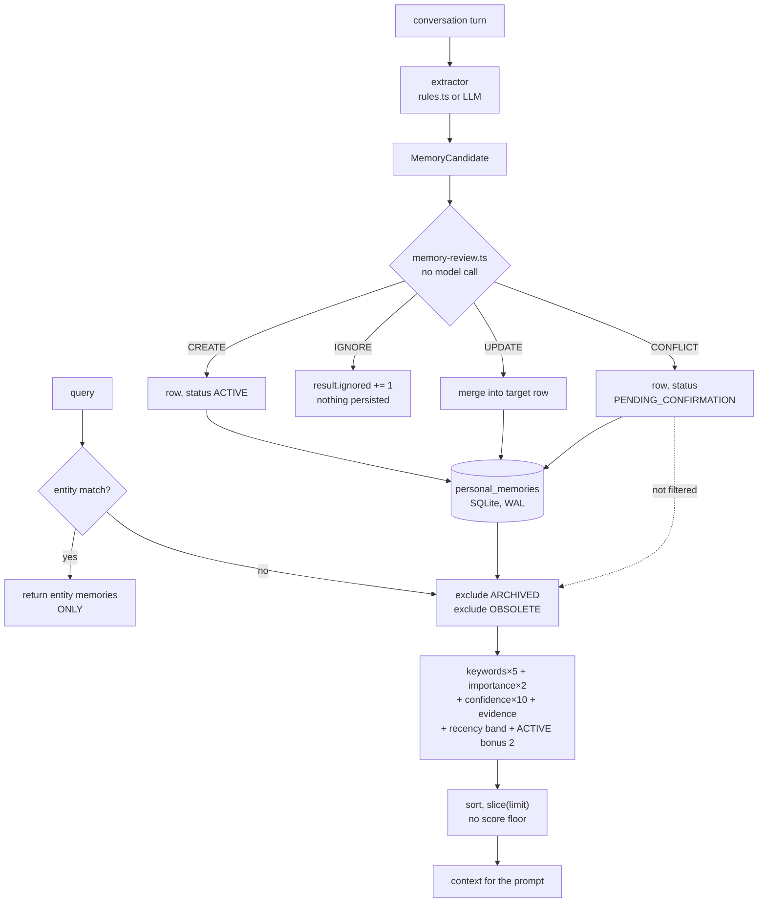

## 1. Executive Summary

Arcon is a local-first "cognitive architecture for a persistent digital
companion" — about 15,900 lines of TypeScript across seven packages, 24 commits
since 29 May 2026, running against local Ollama with a SQLite store. Its pitch
is that memory alone is not enough: identity, mood, emotion, relationships and
interests should shape what the companion says before it says it, and each has
its own package.

The README states its own status — *"not production-ready and breaking changes
should be expected"* — and this report reads it on those terms. **The licence
badge in the README points at a `LICENSE` file that is not in the tree**, which
is worth stating because a reader cannot tell from this repository what they may
do with it.

**The write path is the good part.** Extraction produces candidates, and
`memory-review.ts` classifies each one as `CREATE`, `UPDATE`, `IGNORE` or
`CONFLICT` before anything is stored — deterministically, with no model call, on
stopword-stripped content and a preference-root vocabulary. Most stores in this
corpus decide *whether to write* with a similarity number or not at all; a
four-way decision computed without a model is a better shape, and the `CONFLICT`
branch is better still: it keeps the conflicting candidate as a row with
`status: PENDING_CONFIRMATION` rather than dropping it or overwriting what it
contradicts.

**No capability marks, and the reason is one finding that recurs in four
places.** The schema declares a rich epistemic vocabulary and the code operates
almost none of it:

| Declared | Written by | Read by |
| --- | --- | --- |
| `ACTIVE` | pipeline, default | ranking (a `+2` bonus) |
| `ARCHIVED` | `archiveMemory` | retrieval filter |
| `PENDING_CONFIRMATION` | pipeline, on `CONFLICT` | **nothing** |
| `OBSOLETE` | **nothing** | retrieval filter |
| `CONTRADICTED` | **nothing** | **nothing** |
| `USER_CONFIRMED` (source type) | **nothing** | **nothing** |
| `supersedes_id` | **nothing** | **nothing** |

So a memory stored *because it contradicted another one* is retrievable
immediately, alongside the one it contradicts; the state that would withhold it
is never written; and the source type that would resolve it has no writer, which
means a `PENDING_CONFIRMATION` row has no path out of that state.

## 2. Mental Model

```text
turn ──► extractor (rules or LLM) ──► candidates
                                          │
                              memory-review.ts  (no model)
                                          │
        ┌─────────────┬───────────────────┼──────────────┐
     CREATE        UPDATE               IGNORE        CONFLICT
        │             │                    │              │
     new row     merge into            counter++      new row,
     ACTIVE      target row            (nothing        PENDING_
                                        durable)      CONFIRMATION
                                                           │
                                                    still retrievable,
                                                     −2 on the score

query ──► entity lookup ──► if any hit, return ONLY those
                └── else ──► every non-ARCHIVED, non-OBSOLETE row
                             scored: keywords×5 + importance×2
                                   + confidence×10 + evidence + recency
                             sorted, sliced, no floor
```

Two things follow from that shape. **The pipeline's most careful decision has
the least consequence** — `CONFLICT` produces a row that is two points worse
than an ordinary one on a scale where importance alone contributes up to twenty.
And **a refusal leaves no trace**: `IGNORE` increments a counter in the run's
result object and nothing durable records that a candidate was seen and
declined, so the same input on the next turn is judged from scratch.

## 3. Architecture



**Runtime.** A pnpm-style workspace: `packages/memory`, `cognition`,
`personality`, `ai`, `voice`, `shared`, `logger`, with `apps/chat`,
`apps/desktop` and `apps/server`, plus a Python-side `services/arcon-inference`
and a `training/` directory for the V1 LoRA. Models are local Ollama.

**Persistence.** One SQLite database opened with `better-sqlite3` in WAL mode.
The schema is stricter than most in this corpus: `CHECK` constraints on the type,
status and source-type enumerations, a range check on `importance_score` (1–10),
another on `confidence_score` (0–1), a non-negative `evidence_count`, and a
self-referencing foreign key for `supersedes_id`. Putting the vocabulary in the
database rather than only in TypeScript means a migration or a hand-edit cannot
introduce a status the code has never heard of — which is the right instinct, and
makes the unwired half of that vocabulary visible from the schema alone.

**Companion state is separate.** `packages/personality` carries mood, emotion
(with a bidirectional user-emotion detector), interests, experiences,
relationship profiles and an identity builder, each with its own repository and
tests. That is a second store of durable state about the relationship, and it is
outside the memory schema above.

## 4. Essential Implementation Paths

**Review.** `pipeline/memory-review.ts` returns
`{decision: "CREATE" | "UPDATE" | "IGNORE" | "CONFLICT", targetMemory?}`. It
works on stopword-stripped content against a `PREFERENCE_ROOT_WORDS` set —
`prefer`, `prefers`, `like`, `likes`, `dislike`, `dislikes`, `favorite` — so
"user likes tea" and "user dislikes tea" are recognised as the same subject with
opposed values rather than as two unrelated facts. That recognition is what
produces `CONFLICT`, and it is done in plain code.

**The pipeline.** `memory-pipeline.ts` switches on the decision. `CREATE` writes
a row; `UPDATE` merges into the target and falls back to `ignored` when the merge
returns nothing; `CONFLICT` writes a new row with
`status: MemoryStatus.PENDING_CONFIRMATION`; `IGNORE` increments a counter.

**Retrieval.** `memory-retriever.ts` tries entity memories first and **returns
them exclusively if there are any** — `if (entityMemories.length > 0) return
entityMemories;` — so a query that resolves to a known entity never sees the
semantic store. Otherwise it lists every memory, filters two statuses, scores,
sorts and slices.

**Ranking.** `memory-ranking.ts` is a weighted sum:
`keywordMatches × 5 + importance × 2 + confidence × 10 + min(evidenceCount, 10)`
plus a recency band (10 within a week, 7 within a month, 4 within a quarter,
1 otherwise) plus `+2` when the status is `ACTIVE`. Matching is
`content.includes(word)` over lowercased text — substring, not token — so
"art" matches "started".

The coefficients are worth reading against each other. Importance contributes up
to 20 and confidence up to 10, while a keyword match is 5. **A maximally
important memory with no keyword overlap outranks a memory that matches two
words of the query**, and since there is no score floor, the top *N* are returned
whatever they scored. Query-independent priors dominating relevance is a pattern
this atlas records elsewhere; here it is visible in four constants.

## 5. Memory Data Model

Six types — `FACT`, `PREFERENCE`, `PROJECT`, `GOAL`, `RELATIONSHIP`,
`CONSTRAINT` — five statuses, four source types, and per-row `importance_score`,
`confidence_score`, `tags`, `evidence_count`, `last_used_at`, `subject`, and
`supersedes_id`.

**The table in section 1 is the finding.** Restated as a rule: this schema
describes a system that can hold a belief, doubt it, mark it superseded, and
have a person confirm it — and the code implements one archive operation and one
filter. That is not a criticism of the design; it is a statement about which
parts of it currently run, and the distance between the two is the thing a reader
evaluating this repository needs.

**`supersedes_id` deserves its own line** because it is the most valuable of the
unwired fields. The column exists, the foreign key exists, and three TypeScript
interfaces carry `supersedesId`. Nothing assigns it. A correction therefore
either merges into the old row through `UPDATE`, losing the prior value, or lands
as a second row with no link to the first.

**No scope key of any kind.** One database, one companion, no user, agent or
tenant column — coherent for a single-person companion, and the reason the scope
mark is withheld rather than a defect.

## 6. Retrieval Mechanics

Substring keyword matching over the whole memory list, in JavaScript, per query.
No embeddings in the memory package: `packages/ai` has an embedding path for
other purposes, and `calculateMemoryScore` does not use it.

**The entity short-circuit is the mechanic most likely to surprise.** If
`resolveTargetEntity` finds an entity in the query and that entity has memories,
those are the entire result. A question that names a person and also asks about a
project returns only what is filed under the person. The two stores never merge,
and nothing reports that a fallback did not run.

**Two statuses are filtered and three are not.** `PENDING_CONFIRMATION` — the
status the pipeline assigns to a candidate it identified as contradicting
something already stored — is not among them, so the conflicting pair is
retrieved together and the model sees both. The only consequence of the status is
the missing `+2` bonus.

## 7. Write Mechanics

Extraction has a rule path (`extractor/rules.ts`, 489 lines) and an LLM path with
its own prompt, JSON parser and client; the semantic layer adds a normalizer, a
validator, a quality scorer and a `to-memory-candidate` adapter. Everything then
passes through review before the store is touched, which is the right ordering
and is not universal in this corpus.

**Nothing durable records a refusal.** `IGNORE` is `result.ignored += 1` on an
in-memory result object. So the store holds what it admitted and nothing about
what it declined — the shape this atlas finds most often — and here it has a
specific cost: the review is deterministic, so the same candidate will be
re-derived, re-reviewed and re-ignored on every turn that produces it, at whatever
the extractor cost.

**Nothing can leave `PENDING_CONFIRMATION`.** The resolution would be a person
confirming the memory, which the schema anticipates with
`MemorySourceType.USER_CONFIRMED`. That value appears in the CHECK constraint and
in one repository test, and in no production code. There is no confirm command,
no review surface, and no prompt that asks. The pending state is a terminal state.

## 8. Agent Integration

Three apps — a chat CLI, a desktop shell and a server — over local Ollama, with a
voice package (Whisper STT, Piper/Flite/SAPI TTS) and a separate inference
service for the project's own LoRA. `packages/ai` assembles the prompt from the
memory context, the identity, the mood and the relationship profile, which is the
architecture's actual thesis: memory is one input among several to how the
companion speaks.

## 9. Reliability, Safety, and Trust

**No audit of mutations.** No log table, no event record; a memory changes and
the previous value is gone unless the change was an archive.

**No provenance beyond the source type**, and the one source-type value that
would mean *a person vouched for this* is never written, so in practice the
distinction that operates is `USER_EXPLICIT` versus `INFERRED`.

**Confidence is a float and status is a state, which is the right split** — and
the state's effect on retrieval is two points. The atlas's usual complaint is
that a system collapses "how sure" into "may this be used"; Arcon separates them
correctly in the schema and then makes the second one almost weightless in the
ranker.

**Single-user, local, no network beyond Ollama.** Prompt injection is unaddressed
in the memory path: extracted content becomes a candidate and, if reviewed
`CREATE`, a memory, with no check on what the text asks the reader to do.

## 10. Tests, Evals, and Benchmarks

204 cases across 25 files, using `node:test` and `node:assert` — memory
extractor, pipeline, ranking, repository, retriever, entity graph, context
builder, plus the personality engines and the voice package. I did not run them.
For a 24-commit project this is a good ratio, and the pipeline and repository
suites cover the decision branches.

**The one negative retrieval test does not establish what it looks like it
establishes, and the reason is worth spelling out.**
`memory-retriever.test.ts` opens a fresh database in `beforeEach`, so each case
starts empty. The archived-memory case creates exactly one memory, archived, then
asserts:

```ts
assert(results.every((m) => m.status !== MemoryStatus.ARCHIVED));
```

`Array.every` on an empty array is `true`. The test passes if retrieval returns
the archived memory's exclusion *or* if retrieval returns nothing at all — and a
retriever that had stopped working entirely would satisfy it. That is why
`negative_eval` is withheld: the mark asks for a committed case asserting that
particular material is absent from a result set, and a vacuous pass is not one.

The fix is one line in the same test: create a second, non-archived memory
matching the query, and assert it *is* in the results beside the `every` check.
The suite already writes that shape elsewhere — `"retrieves matching memories"`
is the positive control, sitting in the same file, in a different test.

No benchmark, no retrieval-quality measurement, and no committed numbers behind
the ranking coefficients.

## 11. For Your Own Build

### Steal

- **Decide four ways at the door, without a model.** `CREATE` / `UPDATE` /
  `IGNORE` / `CONFLICT` computed from stopword-stripped content and a
  preference-root vocabulary is cheap, reproducible and testable, and it is a
  better write path than a similarity threshold.
- **Keep the conflicting candidate as a row.** Dropping it loses the
  disagreement and merging it loses one of the two values; a row with a status
  keeps both and defers the decision.
- **Put the enumerations in the database.** `CHECK(status IN (...))` alongside
  range checks on the scores means no migration or hand-edit can introduce a
  value the code has never seen — and it makes an unwired vocabulary auditable
  from the schema.
- **Separate companion state from memory.** Mood, emotion, interests and
  relationship profiles in their own packages with their own repositories keeps
  "what I know" and "how I am" from contaminating one table.

### Avoid

- **Do not let the status vocabulary outrun the code that reads it.** Five
  statuses, one of them both written and read, is a schema that describes a
  system nobody has built yet — and the two states that most need to withhold a
  memory are the two that do not.
- **Do not create a pending state with no way out.** `PENDING_CONFIRMATION` with
  no confirm path and no review surface is a permanent label, and because
  retrieval ignores it, a permanent label with no effect.
- **Do not let a query-independent prior outweigh the query.** Importance at
  ×2 over a 1–10 range beats two keyword matches at ×5, and with no score floor
  the top *N* are returned however badly they scored.
- **Do not assert `every` on a result set you did not force to be non-empty.**
  The archived-memory test passes against a retriever that returns nothing.
- **Do not count a refusal in a variable that dies with the run.** A
  deterministic reviewer that leaves no record re-does the same work every turn.

### Fit

Take Arcon's *write path* if you are building anything that ingests candidates
from conversation: the four-way deterministic review is the reusable idea here
and it does not need the rest of the project. Take the schema discipline too.

Look elsewhere for a store to run today. The retrieval is substring matching over
a full table scan with no floor, the correction path cannot link a new value to
the one it replaces, and the epistemic states the design is built around are
mostly not connected yet. The README says the project is not production-ready and
this reading agrees with it for reasons the README does not list.

## 12. Open Questions

- **What was `supersedes_id` going to do?** The column, the foreign key and three
  interface fields exist. Wiring `UPDATE` to write it instead of merging in place
  would turn the correction path into a lineage, and the schema is already
  shaped for it.
- **Who confirms a `PENDING_CONFIRMATION` memory?** No command, no surface, no
  prompt. The likely answer is a review screen in `apps/desktop` that does not
  exist yet, and until it does the `CONFLICT` branch produces rows nobody can
  resolve.
- **Should the retrieval filter be a denylist or an allowlist?** It currently
  excludes two named statuses, which is why adding a third state to the enum did
  not change retrieval. `status === ACTIVE` would have failed loudly instead.
- **Why does an entity hit suppress the semantic store entirely?** The
  short-circuit returns early rather than merging two ranked lists, and nothing
  reports that the second path did not run.
- **Where did the ranking coefficients come from?** Six weights and four recency
  bands, no measurement in the repository, and no harness that would produce one.
- **What licence is this?** The README badge points at a `LICENSE` file that the
  tree does not contain.

## Appendix: File Index

- **Store:** `packages/memory/src/personal-memory.ts` (schema, `MemoryStatus`,
  `MemorySourceType`, `archiveMemory`, `updateMemory`)
- **Write path:** `packages/memory/src/pipeline/memory-review.ts` (the four-way
  decision), `pipeline/memory-pipeline.ts` (the switch),
  `extractor/rules.ts`, `extractor/llm/`, `semantic/` (normalizer, validator,
  quality, `to-memory-candidate`)
- **Read path:** `retrieval/memory-retriever.ts` (the entity short-circuit and
  the status filter), `retrieval/memory-ranking.ts` (the weights),
  `retrieval/context-builder.ts`
- **Entities:** `entity/entity-repository.ts`, `entity-resolver.ts`,
  `entity-fact-repository.ts`, `entity-graph-query.ts`,
  `entity-relationship-extractor.ts`, `entity-memory-linker.ts`
- **Companion state:** `packages/personality/src/` — `mood/`, `emotion/`,
  `interest/`, `experience/`, `relationship/`, `identity/`, `profile/`
- **Reasoning:** `packages/cognition/src/` — `pipeline/reasoning-pipeline.ts`,
  `plugins/intent/`, `plugins/strategy/`, `engine/reasoning-engine.ts`
- **Tests:** `packages/memory/tests/` (`memory-retriever.test.ts` holds the
  vacuous negative), `packages/personality/tests/`, `packages/ai/tests/`

## History

**2026-08-23** — [`7bbbbc54728fe6a6a733f0feee47591104136023`](https://github.com/vmDeshpande/Arcon/commit/7bbbbc54728fe6a6a733f0feee47591104136023) — first reading, 24 commits since 29 May 2026, ~15,900 lines of TypeScript. Screened before anything was read: no auto-run surface, no build-time execution, ten unpinned surfaces and nine files inside the seven-day cooldown; nothing was installed and no test was run. No capability marks. `trust_state` is withheld not for absence but for wiring — of five CHECK-constrained statuses, `ARCHIVED` is the only one both written and read, `PENDING_CONFIRMATION` is written and never consulted, `OBSOLETE` is consulted and never written, and `CONTRADICTED` is neither; the same holds for `USER_CONFIRMED` and for `supersedes_id`. `negative_eval` is withheld because the single archived-memory assertion is `results.every(...)` against a database seeded with one archived row and nothing else, so it passes on an empty result. `scope_enforced`, `audit_log`, `bitemporal` and `tombstone` are absent rather than partial. The README's licence badge points at a `LICENSE` file the tree does not contain.
