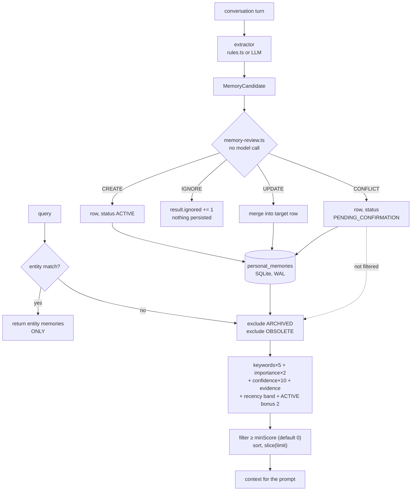

## 1. Executive Summary

Arcon is a local-first "cognitive architecture for a persistent digital
companion" — about 27,000 lines of TypeScript across seven packages, 42 commits
since 29 May 2026, running against local Ollama with a SQLite store. Its pitch
is that memory alone is not enough: identity, mood, emotion, relationships and
interests should shape what the companion says before it says it, and each has
its own package.

The README states its own status — *"not production-ready and breaking changes
should be expected"* — and this report reads it on those terms. **The licence
badge in the README points at a `LICENSE` file that is not in the tree**, which
is worth stating because a reader cannot tell from this repository what they may
do with it.

**The write path is the good part.** Extraction produces candidates, and
`memory-review.ts` classifies each one as `CREATE`, `UPDATE`, `IGNORE` or
`CONFLICT` before anything is stored — deterministically, with no model call, on
stopword-stripped content and a preference-root vocabulary. Most stores in this
corpus decide *whether to write* with a similarity number or not at all; a
four-way decision computed without a model is a better shape, and the `CONFLICT`
branch is better still: it keeps the conflicting candidate as a row with
`status: PENDING_CONFIRMATION` rather than dropping it or overwriting what it
contradicts.

**Three marks, and the interesting part is which half of the vocabulary each
side of the system operates.** The status enum runs to six values and
`EXCLUDED_FROM_NORMAL_RETRIEVAL` covers five of them, so the field decides
admissibility rather than weight — that is the trust mark. A `scope` column is
filtered before scoring and restricts normal retrieval to the human's memories
and the companion's own, which is the scope mark. And every negative retrieval
test seeds a matching control beside the excluded memory, which is the third.

The write side does not reach as far as the read side:

| Declared | Written by | Read by |
| --- | --- | --- |
| `ACTIVE` | pipeline, default | ranking bonus |
| `ARCHIVED` | `archiveMemory` | excluded from retrieval |
| `SUPERSEDED` | the supersede path | excluded from retrieval |
| `PENDING_CONFIRMATION` | pipeline, on `CONFLICT` | excluded from retrieval |
| `OBSOLETE` | `rejectMemory`, `resolveContradiction` | excluded from retrieval |
| `CONTRADICTED` | `markContradicted` | excluded by *three* lists |
| `USER_CONFIRMED` (source type) | `confirmMemory` | **nothing** |
| `MemoryScope.PROJECT` | **nothing** | queried by the cognitive processor |
| `MemoryScope.CONVERSATION` | **nothing** | **nothing** |

**And one consequence is worth stating on its own.**
`PENDING_CONFIRMATION` is the status the pipeline assigns to a candidate that
contradicts something already stored, and it is excluded from every read — the
right behaviour. The way out of it exists and is well made:
`confirmMemory` (`personal-memory.ts:314-339`) moves the row to `ACTIVE`, stamps
`sourceType = USER_CONFIRMED`, increments `evidenceCount` and records a `CONFIRM`
mutation with `source: "user"`; `rejectMemory` (`:347-366`) moves it to
`OBSOLETE` with a `REJECT` row. Both refuse to act on a row in any other status,
so a transition cannot be applied to the wrong state. The contradiction pair is
the same shape: `markContradicted` (`:286-300`) and `resolveContradiction`
(`:368-394`), which will only move a row that is currently `CONTRADICTED`, to
`ACTIVE` or `OBSOLETE` by the caller's choice. `packages/memory/tests/memory-lifecycle.test.ts:135-205`
walks them.

The limit is reach, not coverage. All four are library methods, on the
repository and mirrored on the pipeline (`memory-pipeline.ts:386-393`), and
nothing above the library calls them: `apps/server` imports `MemoryRepository`
and `MemoryPipeline` and exposes no route for any of them, and there is no CLI.
So from a running Arcon a conflicting memory is stored, withheld from every
read, and unresolvable — while from the API it is resolvable in one call. The
dead end is in the surface, not in the state machine, which is the better
problem to have and a different one from the one to fix.

## 2. Mental Model

```text
turn ──► extractor (rules or LLM) ──► candidates
                                          │
                              memory-review.ts  (no model)
                                          │
        ┌─────────────┬───────────────────┼──────────────┐
     CREATE        UPDATE               IGNORE        CONFLICT
        │             │                    │              │
     new row     supersede:            counter++      new row,
     ACTIVE      successor gets        (nothing        PENDING_
                 supersedesId,          durable)      CONFIRMATION
                 predecessor →                             │
                 SUPERSEDED                          excluded from
                                                     every read, and
                                                     nothing can
                                                     confirm it

query ──► entity lookup ──► if any hit, return ONLY those
                └── else ──► rows not in the five excluded statuses,
                             scoped to USER or ARCON
                             scored: keywords×5 + importance×2
                                   + confidence×10 + evidence + recency
                             ≥ minScore (default 0), sorted, sliced
```

Two things follow from that shape. **The pipeline's most careful decision has
the sharpest consequence and no exit** — `CONFLICT` writes a row that no read
will ever return, and nothing can confirm it. And **a refusal leaves no trace**:
`IGNORE` increments a counter in the run's result object and nothing durable
records that a candidate was seen and declined, so the same input on the next
turn is judged from scratch.

## 3. Architecture



**Runtime.** A pnpm-style workspace: `packages/memory`, `cognition`,
`personality`, `ai`, `voice`, `shared`, `logger`, with `apps/chat`,
`apps/desktop` and `apps/server`, plus a Python-side `services/arcon-inference`
and a `training/` directory for the V1 LoRA. Models are local Ollama.

**Persistence.** One SQLite database opened with `better-sqlite3` in WAL mode.
The schema is stricter than most in this corpus: `CHECK` constraints on the type,
status and source-type enumerations, a range check on `importance_score` (1–10),
another on `confidence_score` (0–1), a non-negative `evidence_count`, and a
self-referencing foreign key for `supersedes_id`. Putting the vocabulary in the
database rather than only in TypeScript means a migration or a hand-edit cannot
introduce a status the code has never heard of — which is the right instinct, and
makes the unwired half of that vocabulary visible from the schema alone.

**Companion state is separate.** `packages/personality` carries mood, emotion
(with a bidirectional user-emotion detector), interests, experiences,
relationship profiles and an identity builder, each with its own repository and
tests. That is a second store of durable state about the relationship, and it is
outside the memory schema above.

## 4. Essential Implementation Paths

**Review.** `pipeline/memory-review.ts` returns
`{decision: "CREATE" | "UPDATE" | "IGNORE" | "CONFLICT", targetMemory?}`. It
works on stopword-stripped content against a `PREFERENCE_ROOT_WORDS` set —
`prefer`, `prefers`, `like`, `likes`, `dislike`, `dislikes`, `favorite` — so
"user likes tea" and "user dislikes tea" are recognised as the same subject with
opposed values rather than as two unrelated facts. That recognition is what
produces `CONFLICT`, and it is done in plain code.

**The pipeline.** `memory-pipeline.ts` switches on the decision. `CREATE` writes
a row; `UPDATE` merges into the target and falls back to `ignored` when the merge
returns nothing; `CONFLICT` writes a new row with
`status: MemoryStatus.PENDING_CONFIRMATION`; `IGNORE` increments a counter.

**Retrieval.** `memory-retriever.ts` tries entity memories first and **returns
them exclusively if there are any** — `if (entityMemories.length > 0) return
entityMemories;` — so a query that resolves to a known entity never sees the
semantic store. Otherwise it lists every memory, filters two statuses, scores,
sorts and slices.

**Ranking.** `memory-ranking.ts` is a weighted sum:
`keywordMatches × 5 + importance × 2 + confidence × 10 + min(evidenceCount, 10)`
plus a recency band (10 within a week, 7 within a month, 4 within a quarter,
1 otherwise) plus `+2` when the status is `ACTIVE`. Matching is
`content.includes(word)` over lowercased text — substring, not token — so
"art" matches "started".

The coefficients are worth reading against each other. Importance contributes up
to 20 and confidence up to 10, while a keyword match is 5. **A maximally
important memory with no keyword overlap outranks a memory that matches two
words of the query**, and the `minScore` filter that would stop the worst of that
defaults to zero, so unless a caller sets one the top *N* are returned whatever
they scored. Query-independent priors dominating relevance is a pattern
this atlas records elsewhere; here it is visible in four constants.

## 5. Memory Data Model

Six types — `FACT`, `PREFERENCE`, `PROJECT`, `GOAL`, `RELATIONSHIP`,
`CONSTRAINT` — five statuses, four source types, and per-row `importance_score`,
`confidence_score`, `tags`, `evidence_count`, `last_used_at`, `subject`, and
`supersedes_id`.

**The table in section 1 is the finding.** The read side consults nine
enumerated values; the write side produces five. That asymmetry has a specific
cost in each direction. A status nothing writes makes its filter dead weight —
`CONTRADICTED` is named in three separate exclusion lists and can never occur.
A scope nothing writes makes its query silently empty — the cognitive processor
resolves a subject of `"project"` to `MemoryScope.PROJECT` and asks for memories
under it, and no write path assigns that scope, so the branch returns nothing and
reports nothing.

**`supersedesId` is wired, and it completes the correction path.** The pipeline
writes `supersedesId: review.targetMemory.id` on the successor and the repository
sets the predecessor to `SUPERSEDED`, which the retriever excludes — so a
correction leaves a lineage rather than merging in place, and the replaced value
stays on disk pointing at what replaced it.

**Scope is a stored column and a read predicate.** `MemoryScope` is written with
a default of `USER`, and normal retrieval filters to `USER` or `ARCON` before
scoring, so the companion's beliefs about itself and its beliefs about the person
are separable populations. Entity facts are fetched under `ENTITY` on a separate
path. That is a key reaching the query, which is what the mark measures — with
`PROJECT` and `CONVERSATION` declared and unwritten.

## 6. Retrieval Mechanics

Substring keyword matching over the whole memory list, in JavaScript, per query.
No embeddings in the memory package: `packages/ai` has an embedding path for
other purposes, and `calculateMemoryScore` does not use it.

**The entity short-circuit is the mechanic most likely to surprise.** If
`resolveTargetEntity` finds an entity in the query and that entity has memories,
those are the entire result. A question that names a person and also asks about a
project returns only what is filed under the person. The two stores never merge,
and nothing reports that a fallback did not run.

**Five statuses are excluded and the scope is filtered twice.**
`EXCLUDED_FROM_NORMAL_RETRIEVAL` drops `ARCHIVED`, `OBSOLETE`, `CONTRADICTED`,
`PENDING_CONFIRMATION` and `SUPERSEDED`, and a second filter restricts what
remains to `MemoryScope.USER` or `MemoryScope.ARCON` before anything is scored.
So a candidate the pipeline identified as contradicting something already stored
is withheld rather than returned beside it, and a superseded predecessor leaves
the read path while staying on disk pointing at its successor.

**The exclusion is a denylist, written twice.** The same five-status set appears
in `memory-retriever.ts` and again in the pipeline's `getActiveMemories`. A
seventh status has to be remembered in both places, and the allowlist form —
`status === ACTIVE` — would have failed loudly instead of silently admitting the
new value. It is the shape of defect that produced `CONTRADICTED`'s current
state: named in three exclusion lists and written by nothing.

## 7. Write Mechanics

Extraction has a rule path (`extractor/rules.ts`, 489 lines) and an LLM path with
its own prompt, JSON parser and client; the semantic layer adds a normalizer, a
validator, a quality scorer and a `to-memory-candidate` adapter. Everything then
passes through review before the store is touched, which is the right ordering
and is not universal in this corpus.

**Nothing durable records a refusal.** `IGNORE` is `result.ignored += 1` on an
in-memory result object. So the store holds what it admitted and nothing about
what it declined — the shape this atlas finds most often — and here it has a
specific cost: the review is deterministic, so the same candidate will be
re-derived, re-reviewed and re-ignored on every turn that produces it, at whatever
the extractor cost.

**Nothing can leave `PENDING_CONFIRMATION`.** The resolution would be a person
confirming the memory, which the schema anticipates with
`MemorySourceType.USER_CONFIRMED`. That value appears in the CHECK constraint and
in one repository test, and in no production code. There is no confirm command,
no review surface, and no prompt that asks. The pending state is a terminal state.

## 8. Agent Integration

Three apps — a chat CLI, a desktop shell and a server — over local Ollama, with a
voice package (Whisper STT, Piper/Flite/SAPI TTS) and a separate inference
service for the project's own LoRA. `packages/ai` assembles the prompt from the
memory context, the identity, the mood and the relationship profile, which is the
architecture's actual thesis: memory is one input among several to how the
companion speaks.

**Every lifecycle move is now written down, with both sides of the change.**
`memory_audit_log` records an `action`, the status before and after, the content
before and after, a `reason` and a `source` of `user` or `system`. One function
writes it, `recordMutation`, and it holds the table's only `INSERT`; no `DELETE`
or `UPDATE` against the table exists anywhere in the tree. Seven call sites cover
the lifecycle end to end — `CREATE`, `SUPERSEDE`, `CONTRADICT`, `CONFIRM`,
`REJECT` and `RESOLVE_CONTRADICTION` — and `memory-audit.test.ts` asserts a row
for each, plus that the reader filters by action and by source. Storing
`previous_content` alongside `new_content` is what makes it a record rather than
a notification: the log holds what the memory said before it changed.

**And extraction now refuses instruction-shaped content.**
`containsInstructionPattern` screens a candidate before it can become a memory,
with a committed case asserting that a candidate carrying an
ignore-all-instructions pattern is rejected — the store declining to remember
text whose purpose is to be obeyed later.

**The status vocabulary is wired now, and each transition checks the state it
is leaving.** `SUPERSEDED`, `CONTRADICTED`, `OBSOLETE` and
`PENDING_CONFIRMATION` all have writers, and the moves out of them are guarded
rather than assumed: confirming or rejecting refuses a memory whose status is
not `PENDING_CONFIRMATION`, and resolving refuses one that is not
`CONTRADICTED`. `supersedesId` is assigned on the write path, so the column that
had a foreign key and no writer now records which memory replaced which. The
pipeline reads `OBSOLETE` and `SUPERSEDED` when it selects what is live.

## 9. Reliability, Safety, and Trust

**No audit of mutations.** No log table, no event record; a memory changes and
the previous value is gone unless the change was an archive.

**No provenance beyond the source type**, and the one source-type value that
would mean *a person vouched for this* is never written, so in practice the
distinction that operates is `USER_EXPLICIT` versus `INFERRED`.

**Confidence is a float and status is a state, which is the right split** — and
the state's effect on retrieval is two points. The atlas's usual complaint is
that a system collapses "how sure" into "may this be used"; Arcon separates them
correctly in the schema and then makes the second one almost weightless in the
ranker.

**Single-user, local, no network beyond Ollama.** Prompt injection is unaddressed
in the memory path: extracted content becomes a candidate and, if reviewed
`CREATE`, a memory, with no check on what the text asks the reader to do.

## 10. Tests, Evals, and Benchmarks

543 cases across 52 files, using `node:test` and `node:assert` — memory
extractor, pipeline, ranking, repository, retriever, entity graph, context
builder, two phase suites for retrieval and reflection, plus the personality
engines and the voice package. I did not run them.
For a 42-commit project this is a good ratio, and the pipeline and repository
suites cover the decision branches.

**The negative retrieval tests carry their controls, and that is what earns the
mark.** `memory-retriever.test.ts` opens a fresh database in `beforeEach`, so a
bare `Array.every` assertion would pass on an empty result — a retriever that had
stopped working entirely would satisfy it. Each excluded-status case therefore
seeds two memories, one in the excluded status and one matching the same query,
and asserts both halves:

```ts
assert(results.every((m) => m.status !== MemoryStatus.CONTRADICTED));
assert(results.some((m) => m.content === "User likes tea"));
```

The `some` is the control. `phase-c-retrieval.test.ts` repeats the shape for the
other excluded statuses. Writing the positive assertion inside the negative test,
rather than trusting a positive test elsewhere in the file to have run, is the
difference between a case that measures exclusion and one that measures nothing.

No benchmark, no retrieval-quality measurement, and no committed numbers behind
the ranking coefficients.

## 11. For Your Own Build

### Steal

- **Decide four ways at the door, without a model.** `CREATE` / `UPDATE` /
  `IGNORE` / `CONFLICT` computed from stopword-stripped content and a
  preference-root vocabulary is cheap, reproducible and testable, and it is a
  better write path than a similarity threshold.
- **Keep the conflicting candidate as a row.** Dropping it loses the
  disagreement and merging it loses one of the two values; a row with a status
  keeps both and defers the decision.
- **Put the enumerations in the database.** `CHECK(status IN (...))` alongside
  range checks on the scores means no migration or hand-edit can introduce a
  value the code has never seen — and it makes an unwired vocabulary auditable
  from the schema.
- **Separate companion state from memory.** Mood, emotion, interests and
  relationship profiles in their own packages with their own repositories keeps
  "what I know" and "how I am" from contaminating one table.

### Avoid

- **Do not duplicate a denylist across two files.** The exclusion set is
  written out in the retriever and again in the pipeline's `getActiveMemories`;
  a new status has to be remembered in both, and the allowlist form
  (`status === ACTIVE`) would have failed loudly instead.
- **Do not duplicate a denylist across two files.** The same five-status
  exclusion set is written out in the retriever and again in the pipeline's
  `getActiveMemories`; a seventh status has to be remembered in both, and the
  allowlist form (`status === ACTIVE`) would have failed loudly instead.
- **Do not let a query name a scope nothing writes.** The cognitive processor
  resolves a `"project"` subject to `MemoryScope.PROJECT` and queries it; no
  write path assigns that scope, so the branch returns empty and says nothing.
- **Do not let a query-independent prior outweigh the query.** Importance at
  ×2 over a 1–10 range beats two keyword matches at ×5, and the score floor
  defaults to zero.
- **Do not count a refusal in a variable that dies with the run.** A
  deterministic reviewer that leaves no record re-does the same work every turn.

### Fit

Take Arcon's *write path* if you are building anything that ingests candidates
from conversation: the four-way deterministic review is the reusable idea here
and it does not need the rest of the project. Take the schema discipline too.

Look elsewhere for a store to run today. The retrieval is substring matching over
a full table scan with no floor, the correction path cannot link a new value to
the one it replaces, and the epistemic states the design is built around are
mostly not connected yet. The README says the project is not production-ready and
this reading agrees with it for reasons the README does not list.

## 12. Open Questions

- **Where does a person meet a `PENDING_CONFIRMATION` memory?** The transitions
  out of it exist and are guarded, but the surface that would show a waiting
  conflict to someone is still the part this reading cannot find.
- **Is the exclusion set still written twice?** The retriever and the
  pipeline each spell it out, so a status added to one and forgotten in the
  other would be excluded on one read path and returned on the other.
- **What writes `MemoryScope.PROJECT`?** The cognitive processor resolves a
  `"project"` subject to that scope and queries it; no write path assigns it, so
  the branch returns empty and reports nothing.
- **Should the retrieval filter be a denylist or an allowlist?** It currently
  excludes two named statuses, which is why adding a third state to the enum did
  not change retrieval. `status === ACTIVE` would have failed loudly instead.
- **Why does an entity hit suppress the semantic store entirely?** The
  short-circuit returns early rather than merging two ranked lists, and nothing
  reports that the second path did not run.
- **Where did the ranking coefficients come from?** Six weights and four recency
  bands, no measurement in the repository, and no harness that would produce one.
- **What licence is this?** The README badge points at a `LICENSE` file that the
  tree does not contain.

## Appendix: File Index

- **Store:** `packages/memory/src/personal-memory.ts` (schema, `MemoryStatus`,
  `MemorySourceType`, `archiveMemory`, `updateMemory`)
- **Write path:** `packages/memory/src/pipeline/memory-review.ts` (the four-way
  decision), `pipeline/memory-pipeline.ts` (the switch),
  `extractor/rules.ts`, `extractor/llm/`, `semantic/` (normalizer, validator,
  quality, `to-memory-candidate`)
- **Read path:** `retrieval/memory-retriever.ts` (the entity short-circuit and
  the status filter), `retrieval/memory-ranking.ts` (the weights),
  `retrieval/context-builder.ts`
- **Entities:** `entity/entity-repository.ts`, `entity-resolver.ts`,
  `entity-fact-repository.ts`, `entity-graph-query.ts`,
  `entity-relationship-extractor.ts`, `entity-memory-linker.ts`
- **Companion state:** `packages/personality/src/` — `mood/`, `emotion/`,
  `interest/`, `experience/`, `relationship/`, `identity/`, `profile/`
- **Reasoning:** `packages/cognition/src/` — `pipeline/reasoning-pipeline.ts`,
  `plugins/intent/`, `plugins/strategy/`, `engine/reasoning-engine.ts`
- **Tests:** `packages/memory/tests/` (`memory-retriever.test.ts` holds the
  vacuous negative), `packages/personality/tests/`, `packages/ai/tests/`

## History

**2026-09-25** — [`f04a5e493510a7b293f8ef986064f9c95afa427e`](https://github.com/vmDeshpande/Arcon/commit/f04a5e493510a7b293f8ef986064f9c95afa427e) — census re-measured at the same commit, read and never run. The commits API's last page gives 42 commits reachable from this pin, 27 at `ef74011` and 24 at `7bbbbc5`, so the second re-read was 15 commits on. TypeScript anywhere in the tree, tests included, counts 26,981 lines from a depth-1 fetch; the same count gives 15,946 at `7bbbbc5`, the summary's first-reading figure. `*.test.ts` files number 52 with 543 `it` and `test` calls; the same count gives 26 files and 252 calls at `ef74011`, section 10's figure. No mark moved.

**2026-09-19** — [`f04a5e493510a7b293f8ef986064f9c95afa427e`](https://github.com/vmDeshpande/Arcon/commit/f04a5e493510a7b293f8ef986064f9c95afa427e) — `trust_state` re-tested, and the record's negative half was wrong in four places, all of them wrong when it was written rather than changed since: `packages/memory/src/personal-memory.ts` is byte-for-byte at the same line numbers at the previous pin. It said `CONTRADICTED` is assigned by nothing, `OBSOLETE` likewise, `MemorySourceType.USER_CONFIRMED` has no writer anywhere, and a `PENDING_CONFIRMATION` memory has no path out of the state. Each of the four has a writer in that file, and the four together are a guarded state machine: `markContradicted` (`:286-300`), `confirmMemory` (`:314-339`), `rejectMemory` (`:347-366`) and `resolveContradiction` (`:368-394`). Every one refuses to act on a row that is not already in the status it transitions from, and every one writes a mutation row carrying the previous status, the new status and a source of user or system. `confirmMemory` is what stamps `USER_CONFIRMED` and increments `evidenceCount`. `packages/memory/tests/memory-lifecycle.test.ts:135-205` walks the contradiction states end to end. The effect the report described is real and the reason given was not. The four are library methods, mirrored on the pipeline (`memory-pipeline.ts:386-393`), and nothing above the library calls them: `apps/server` imports `MemoryRepository` and `MemoryPipeline` and exposes no route for any of them, and there is no CLI. So a pending memory is unresolvable from a running Arcon and resolvable from the API in one call — the dead end is in the surface, not in the state machine. The declared-versus-written table, section 1, the matrix rows and the verdict entry were corrected. Screened again first; nothing was installed and no suite was run.

**2026-09-16** — [`f04a5e493510a7b293f8ef986064f9c95afa427e`](https://github.com/vmDeshpande/Arcon/commit/f04a5e493510a7b293f8ef986064f9c95afa427e) — re-read at a commit dated 2026-09-15, 10 commits past the previous pin. The three existing marks re-tested and held, and **`audit_log` is added**: `memory_audit_log` is an append-only table written by one function at seven call sites covering `CREATE`, `SUPERSEDE`, `CONTRADICT`, `CONFIRM`, `REJECT` and `RESOLVE_CONTRADICTION`, carrying the status on both sides, the content on both sides, a reason and a `source` of `user` or `system`. No `DELETE`, `UPDATE` or `DROP` against it exists in the tree, and `memory-audit.test.ts` pins a row for each action and the reader's filters. A `PENDING_CONFIRMATION` status joins the lifecycle, and `containsInstructionPattern` screens a candidate before it can become a memory, with a committed case asserting an ignore-all-instructions payload is refused. Screened before reading, from a full clone: no auto-run surface, no build-time execution point, nine unpinned dependency surfaces and none inside the seven-day cooldown. Nothing was installed, built or run.

**2026-08-24** — [`ef74011fe6d74959d901a593d42696fe4929aa30`](https://github.com/vmDeshpande/Arcon/commit/ef74011fe6d74959d901a593d42696fe4929aa30) — second reading, three commits on, at v0.4.0. Screened again first: no auto-run surface, no build-time execution, nine unpinned surfaces and nine files inside the seven-day cooldown; nothing was installed and no test was run. Three marks where there were none. The status vocabulary gained a sixth value and an `EXCLUDED_FROM_NORMAL_RETRIEVAL` set covering five, so the field decides admissibility rather than weight; the supersede path writes `supersedesId` on the successor and retires the predecessor as `SUPERSEDED`, completing a correction lineage that was a column and three interface fields with no writer; `MemoryScope` arrived as a stored column filtered before scoring, restricting normal retrieval to the human's memories or the companion's own; and every negative retrieval test now seeds a matching control beside the excluded memory, so none of them can pass on an empty result. What did not move: `MemorySourceType.USER_CONFIRMED` still has no writer, and because `PENDING_CONFIRMATION` is now excluded from retrieval, a conflicting memory is withheld from every read and remains unresolvable. `CONTRADICTED` is named in three exclusion lists and assigned by nothing; `MemoryScope.PROJECT` is queried by the cognitive processor and written by nothing; `CONVERSATION` appears only in the enum. A reflection module and two phase test suites are new; the suite is 252 cases across 26 files.

**2026-08-23** — [`7bbbbc54728fe6a6a733f0feee47591104136023`](https://github.com/vmDeshpande/Arcon/commit/7bbbbc54728fe6a6a733f0feee47591104136023) — first reading, 24 commits since 29 May 2026, ~15,900 lines of TypeScript. Screened before anything was read: no auto-run surface, no build-time execution, ten unpinned surfaces and nine files inside the seven-day cooldown; nothing was installed and no test was run. No capability marks. `trust_state` is withheld not for absence but for wiring — of five CHECK-constrained statuses, `ARCHIVED` is the only one both written and read, `PENDING_CONFIRMATION` is written and never consulted, `OBSOLETE` is consulted and never written, and `CONTRADICTED` is neither; the same holds for `USER_CONFIRMED` and for `supersedes_id`. `negative_eval` is withheld because the single archived-memory assertion is `results.every(...)` against a database seeded with one archived row and nothing else, so it passes on an empty result. `scope_enforced`, `audit_log`, `bitemporal` and `tombstone` are absent rather than partial. The README's licence badge points at a `LICENSE` file the tree does not contain.
