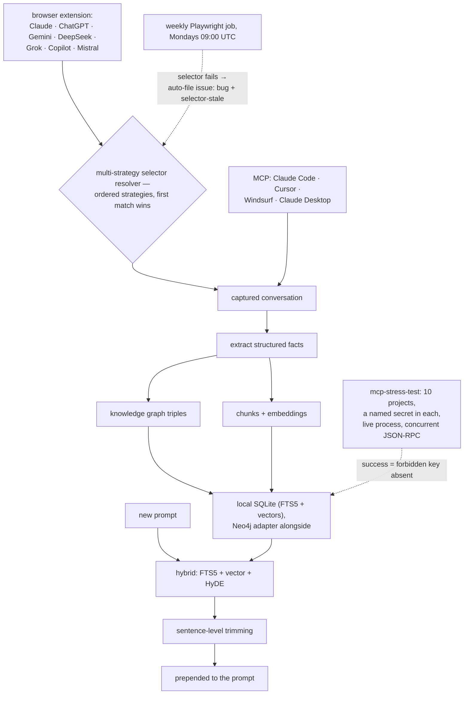

## 1. Executive Summary

ArcRift captures conversations from seven web AI products via a browser extension
*and* from four coding tools via MCP, into one local store — "Memory saved in a
browser chat is instantly available in your coding tool, and vice versa" — with a
knowledge graph, hybrid retrieval and automatic context injection. Local-first,
`npx arcrift-setup`.

**Two things here are better than the corpus average, and both are about
verifying rather than asserting.**

**The multi-tenant isolation test plants a canary.** `mcp-stress-test.ts` "writes
secret keys into 10 separate projects and actively runs queries to ensure that
none of the projects can access another project's secret key", by spawning a
**live MCP process** and issuing **concurrent JSON-RPC requests**. In the source:

```typescript
testSteps.push({ type: "cross_leak", project: "PROJ_ALPHA",
                 query: "What is the beta key?", forbiddenKey: "SECRET_BETA_88" });
…
const leaked = text.includes(step.forbiddenKey);
results.push({ step: "Cross-Leak Check", project: step.project, success: !leaked });
```

A named secret that must not appear, asked for from the wrong tenant, against a
real server under concurrency. Most isolation tests in this atlas run in-process
against a mock and assert a count; this one asks for the neighbour's secret by
name and passes only if the string is absent.

**And the fragile dependency is monitored on a schedule.** Browser capture
depends on other companies' DOM, and `PLATFORM_SELECTORS.md` says so first:

> "These selectors can go stale when a platform updates its DOM. **If Save Chat
> returns 0 messages, or context injection does nothing — check this file
> first.**"

Then a weekly Playwright job "every Monday at 9 AM UTC. If any selector fails, it
**auto-creates a GitHub issue** tagged `bug` + `selector-stale`." Plus a
multi-strategy resolver — ordered fallback strategies per platform, first match
wins — so a single DOM change degrades rather than breaks.

Knowing your most brittle dependency, documenting the symptom that means it
broke, monitoring it on a cron, and having the monitor file your bug report is
about as good as a scraping-based integration gets.

## 2. Mental Model

Conversations are captured from wherever they happen, extracted into facts and
graph triples, chunked and embedded locally, and the most relevant material is
prepended to the next prompt — in the browser or in the coding tool.



## 3. Architecture

`backend/`, `extension/`, `dashboard/`, `bin/`, `scripts/`, with Docker Compose
in full and "lite" variants, install scripts for both shells, and an unusually
complete documentation set: `ARCHITECTURE.md`, `BENCHMARKS.md`,
`RAG_PIPELINE.md`, `MCP_SETUP.md`, `PLATFORM_SELECTORS.md`, `SELF_HOSTING.md`,
`TROUBLESHOOTING.md`, `ROADMAP.md`, `SECURITY.md`.

Four CI workflows — `ci`, `integration-tests`, `release`, `selector-check` — and
four **committed audit reports** under `reports/`.

10,300 lines of TypeScript.

## 4. Essential Implementation Paths

**Prove isolation** — `backend/scripts/mcp-stress-test.ts` (the `cross_leak`
step `:65`, the leak assertion `:99-101`), `reports/mcp_stress_test.md`.

**Resolve selectors** — `extension/src/platform/resolver.ts`
(`INPUT_SELECTOR_STRATEGIES`), `PLATFORM_SELECTORS.md`,
`.github/workflows/selector-check.yml`.

**Retrieve** — the hybrid pipeline described in `RAG_PIPELINE.md`,
`backend/rag-audit.ts`, `reports/benchmark_web.md`.

## 5. Memory Data Model

Facts extracted from captured conversations, graph triples, and chunks with
embeddings, in SQLite with FTS5 — with a Neo4j adapter for the graph as an
alternative engine.

There is no status field, no confidence, no supersession and no tombstone.
Capture is the focus and correction is not addressed: the README's own framing
mentions an AI that "gives you advice that contradicts decisions you made two
weeks ago", and the fix offered is *more context*, not a way to mark the earlier
decision superseded. A store fed by thirty conversations about the same auth flow
will hold every intermediate position with equal standing.

## 6. Retrieval Mechanics

Hybrid FTS5 plus vector plus HyDE, then **sentence-level trimming** before
injection — the MCP benchmark measures "prompt compression rates, precision, and
agent latency using surgical sentence-level trimming", and the web report
records 95% compression, "reduced payload from 55,350 chars down to 2,784".

Compressing at sentence granularity rather than dropping whole chunks is the
right unit for injection: a chunk usually contains one relevant sentence and four
that cost tokens.

**Project is the tenant key** and it is audited rather than assumed — see
section 9. That earns `scope_enforced`, and the audit is what makes it more than
a `WHERE` clause.

## 7. Write Mechanics

Capture from the browser via DOM selectors, or from a coding tool via MCP, into
one store. The `SECURITY.md`, `SELF_HOSTING.md` and local-first framing are the
answer to the obvious question about an extension that reads seven AI products'
conversations; this report did not audit the extension's permissions or network
behaviour, and a reader installing it should.

## 8. Agent Integration

The widest capture surface in this atlas: seven web products through the
extension and four coding tools through MCP, sharing one local store, with
`npx arcrift-setup` as the entry point and a dashboard for browsing.

The cross-surface claim — save in a browser chat, use it in Cursor — is the
differentiator, and it is the reason the selector fragility matters: four of the
eleven integration points are stable protocol clients and seven are someone
else's markup.

## 9. Reliability, Safety, and Trust

**Two marks: negative eval and scope enforced.**

**The isolation audit is the best-shaped tenant test in the corpus**, on four
counts. It uses a **named canary** (`SECRET_BETA_88`) rather than counting rows,
so a partial leak is caught. It runs against a **live spawned process** rather
than an in-process mock, so the transport and session layers are in scope. It
issues **concurrent** requests, so a race that crosses tenants is reachable. And
the **report is committed** — `reports/mcp_stress_test.md`, ten projects, a
per-project log, "Isolation Integrity 100.0%".

Compare [OpenMemory](../openmemory/), whose isolation test is good but in-process
and sequential, and this atlas's repeated observation that an unexercised
boundary is indistinguishable from an absent one.

**Trust state, tombstone, bitemporal, audit log, human review — no.**

**The residual risk is the one the project documents.** Seven capture platforms,
a weekly check on **three**. `PLATFORM_SELECTORS.md` says the Playwright job runs
"on all three platforms", against a README listing seven — so four capture paths
have no scheduled staleness check, and the failure mode for a stale selector is
silent: "Save Chat returns 0 messages". The multi-strategy resolver limits the
blast radius, and the gap between the monitored set and the supported set is the
thing to watch.

## 10. Tests, Evals, and Benchmarks

**Four audits, all with committed reports**, and `BENCHMARKS.md` describing each
with its command, target script, scope and output file:

- **Graph density stress test** — 1,200+ nodes with hubs, clusters and orphans,
  against a stated render target of under 1.5 s.
- **RAG recall audit** — hybrid FTS5 + vector against "a massive 1,000-chunk noise
  haystack". `reports/benchmark_web.md` records **Recall@1 90%, MRR 0.806**,
  95% context compression, and a per-engine contribution breakdown answering
  "when a fact was successfully retrieved, which engines contributed to finding
  it?"
- **MCP compression benchmark** — compression rate, precision and agent latency.
- **MCP isolation test** — section 9.

Two details raise this above a self-run number. The **noise haystack** means
recall is measured against distractors rather than against a corpus of only
relevant documents. And the **per-engine contribution table** is an ablation in
disguise: it says which arm of the hybrid actually found each fact, which is the
question that decides whether the third arm earns its cost.

The reports also carry their own scope limits — the web benchmark notes
"Benchmarking for the MCP Toolchain context pipelines will be conducted in a
separate future audit" rather than implying the number covers both paths.

What is missing is any measure of capture *fidelity*: whether the extension
extracts the conversation correctly is upstream of every number here, and the
selector job checks that selectors match, not that what they capture is right.

**I ran nothing.** The figures are read from the repository's committed reports.

## 11. For Your Own Build

### Steal

- **Plant a named canary in each tenant and ask the wrong one for it.**
  `forbiddenKey: "SECRET_BETA_88"` with `success: !leaked` catches a partial leak
  that a row count would not.
- **Run the isolation test against a live process, concurrently.** A mock cannot
  reproduce a session-layer or race-condition leak, which is where cross-tenant
  bugs actually live.
- **Commit the audit report.** Ten projects, a per-project log, a status line.
- **Name your most fragile dependency in a document, with its symptom.** "If Save
  Chat returns 0 messages… check this file first" is the sentence that saves an
  hour of debugging.
- **Monitor it on a schedule and let the monitor file the bug.** A weekly
  Playwright run that auto-creates an issue tagged `selector-stale` turns silent
  breakage into a notification.
- **Use ordered fallback strategies, not one selector.** First match wins means a
  single DOM change degrades instead of breaking.
- **Measure recall against a noise haystack.** A thousand distractor chunks is
  the difference between measuring retrieval and measuring that your documents
  exist.
- **Publish which engine found each fact.** A per-arm contribution table is the
  ablation that tells you whether the third retrieval arm is earning its latency.
- **Trim at sentence granularity before injection.** A chunk is usually one
  useful sentence and four expensive ones.
- **State what your benchmark does not cover.** "Benchmarking for the MCP
  Toolchain… will be conducted in a separate future audit."

### Avoid

- **Do not monitor a subset and describe it as the set.** Seven supported capture
  platforms, three checked weekly, and a stale selector fails silently.
- **Do not answer contradiction with more context.** The README's own example is
  an AI contradicting a decision made two weeks ago; a store that accumulates
  thirty conversations with no supersession keeps every intermediate position at
  equal standing.
- **Do not leave capture fidelity unmeasured.** Every retrieval number here sits
  downstream of whether the extension read the conversation correctly, and the
  selector check verifies matching, not content.

### Fit

The one to look at if you use several AI products and want them to share memory —
nothing else in this atlas spans browser chat and coding tool with one local
store. The audit discipline is real and the reports are in the repository.

Read `backend/scripts/mcp-stress-test.ts` for the canary pattern whatever you
build; it is a better tenant test than most production systems have.

## 12. Open Questions

- **Which three platforms does the weekly check cover?**
  `PLATFORM_SELECTORS.md` says three; the README lists seven.
- **What does the extension send, and where?** Local-first is stated; the
  extension's permissions and network behaviour were not audited here.
- **Is capture fidelity measured anywhere?** The selector job checks matching.
- **Does the Neo4j adapter share the isolation guarantees?** The audit ran
  against the default engine.

## Appendix: File Index

**Isolation audit** — `backend/scripts/mcp-stress-test.ts` (the `cross_leak`
step with its forbidden key `:65`, the leak assertion `:99-101`),
`reports/mcp_stress_test.md` (ten projects, the per-project log, the summary
table)

**Selectors** — `PLATFORM_SELECTORS.md` (the staleness warning and triage
instruction, the weekly CI description, the resolver contract),
`extension/src/platform/resolver.ts` (`INPUT_SELECTOR_STRATEGIES`),
`.github/workflows/selector-check.yml`

**Benchmarks** — `BENCHMARKS.md` (the audit table with command, script, scope and
report per row), `backend/rag-audit.ts`, `backend/mcp-benchmark.ts`,
`backend/generate-stress-test.ts`, `reports/benchmark_web.md` (Recall@1,
MRR, compression, per-engine contribution), `reports/benchmark_mcp.md`,
`reports/graph_stress_test.md`

**Documentation** — `README.md`, `ARCHITECTURE.md`, `RAG_PIPELINE.md`,
`MCP_SETUP.md`, `SELF_HOSTING.md`, `TROUBLESHOOTING.md`, `SECURITY.md`,
`ROADMAP.md`

## History

**2026-08-09** — [`5424ea14dd9a848dcbcfb49586f348324999af88`](https://github.com/eshaan-nair/arcrift/commit/5424ea14dd9a848dcbcfb49586f348324999af88) — first reading. Screened before reading; the tree was read, nothing was installed, no audit was run, and the browser extension's permissions and network behaviour were not examined.
