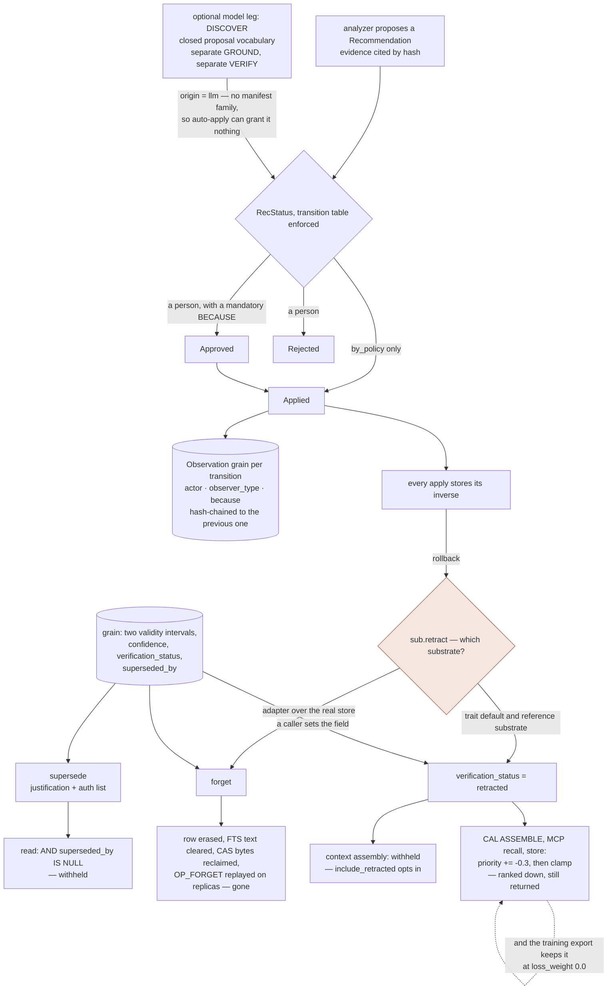

## 1. Executive Summary

A content-addressed store of typed grains, one query language over it, and a
governed learning loop on top. 185,265 lines of Rust across seventeen crates,
dual-licensed MIT or Apache-2.0, 270 commits since 16 August 2026.

The README states the problem in the terms this atlas uses: an agent that
rewrites its own memory unsupervised *"fails every security review on the same
four questions: what changed, on what evidence, on whose authority, and can we
take it back?"* Three of the four are answered mechanically here, and the fourth
is answered better than almost anything in this corpus.

**Two temporal axes, and the caller picks one.** `entity_at` takes an `Axis`:
`World` is *"What was true in the world at T"* over `valid_from`/`valid_to`;
`Knowledge` is *"What did the agent know at T"*, walking the supersession chain.
Both parse from the wire in every binding. Most bi-temporal systems here store
two timestamps and query one; this one makes the question a parameter.

**The review record is the strongest in the corpus.** Every recommendation
transition writes an immutable Observation grain, hash-chained to its
predecessor, carrying the from and to status, a host-asserted actor like
`user:alice`, an observer type, and a **mandatory** written reason capped at 500
characters. The transition table is enforced rather than advisory, and the one
path that skips a person is named in a comment as it is allowed: `Pending →
Applied` requires `by_policy`, *"the auto-apply actor, the only one permitted the
reasonless pending → applied jump."* A model may propose into that lifecycle
and cannot shorten it: an LLM draft is stamped with an analyzer id that carries
no manifest family, so the auto-apply policy has nothing to grant it, and a
proposed rewrite of an executable tool is refused an apply without the run id
of an evaluation that executed the evalset **the tool itself declared** — read
from that run's journal rather than from the arguments of the apply.

**Deletion is done properly, and the code says what that means.** `forget` erases
the row, clears the free-text index — *"a tombstone that leaves the text findable
is not a tombstone"* — reclaims the content-addressed attachment bytes —
*"a tombstone that leaves the attachment bytes on disk is not a tombstone"* —
cleans the namespace registry, and writes an op-log tombstone that
`import_bundle` replays, so an erasure reaches replicas instead of diverging
them.

**`verification_status` withholds at one door and ranks at the others.** It is
a four-value discrete status — unverified, verified, contested, retracted — held
apart from a `confidence` float and classified once, in
`areev_core::verification::Trust`, whose `is_actionable` is false for exactly
one value. Context assembly withholds a retracted grain by default, from the
main body and from the Knowledge Update section, and admits it only under an
explicit `include_retracted` meant for audit reads. The store does not filter,
on purpose: the DSAR `subject_report` shares one selector with erasure and must
disclose exactly what an erasure would remove. Between those two sit the
surfaces that hand grains to a model without the assembler — CAL's own
`ASSEMBLE`, every MCP recall tool, the bindings and the HTTP server — and on all
of them a retracted grain is still `-0.3` on a clamped priority, or nothing.
The withholding earns the mark; its reach is the finding.

The verb behind that status is the more interesting finding, because **the
codebase contains two incompatible definitions of it**. The `OmsSubstrate` trait
documents `retract` as *"Index-layer retraction (`verification_status =
retracted`) — the inverse of an applied ADD, used by rollback. Not destructive"*,
and the in-memory reference substrate implements exactly that. The adapter over
the real store refuses the mapping in as many words — *"No index-only retraction
primitive exists; the honest mapping for undoing an engine-created ADD is a
tombstone of that grain"* — and calls `forget`. So on the real store a rollback
**erases**; the demotion is what the trait promises and what the test double
does. Nothing in the conformance kit covers `retract`, which is the one operation
whose two backends disagree.

And the content hash that a value-level tombstone would key on is not consulted
on write. `forget` and its neighbours name the scenario three separate times —
*"a forget + re-add of identical content can move this hash to a NEW seq"* — and
each time solve the concurrency half of it under a row lock. Whether the
re-assertion should be allowed is asked in the project's own guarantees
document and answered: not yet, for a reason it calls a compliance decision
rather than an engineering one — *"May a rejection ledger keep a hash of content
we just erased for someone?"* Its GDPR note classes a content address as a
pseudonymous identifier, so refusing a value later means remembering something
about it. That is the sharpest statement in this corpus of why a rejected-value
tombstone and an erasure guarantee pull against each other.

Six marks. The project states three limits itself, and they are accurate:
it improves *"memory, never model weights"*, *"nothing applies itself"* without an
explicit host grant, and there is *"no daemon"*.

## 2. Mental Model

A memory is a **grain**: one of thirteen types under a versioned spec the code
calls OMS, content-addressed, and carrying more lifecycle metadata than anything
else in this atlas. `Fact`, `Event`, `State`, `Workflow`, `Tool`, `Observation`,
`Goal`, `Reasoning`, `Consensus`, `Consent`, `Skill`, `Recommendation`,
`Trigger` — and the enum carries its own migration hazard as a comment, because
`areev-store` indexes the type column as the ordinal: *"inserting a variant
mid-enum would silently renumber every stored row and break type-filtered recall
in every existing file."* New variants are appended, and the reason is written
down.

**Two axes describe a grain's standing and they are kept apart.**
`verification_status` is `unverified | verified | contested | retracted`, and the
comment records that it *"replaces deprecated `contradicted` boolean"* — a
project that widened a boolean into a status because the boolean could not
express contested. Beside it sits `confidence: f64`. That separation is the thing
this atlas asks for in every report.

**Correction has three distinct moves, and the vocabulary distinguishes them.**
*Supersede* writes a successor, sets `superseded_by`, closes the record-time
interval, and carries a `supersession_justification` and a
`supersession_auth` list — correction is an authorised act, not an overwrite.
*Retract* is the loop's inverse of an applied ADD, and it is the one whose
meaning depends on which substrate answers: a non-destructive
`verification_status = retracted` in the trait contract and the reference
substrate, a `forget` in the adapter over the real store. *Forget* erases. Three
verbs for three different situations is rarer here than it should be — but only
two of them mean one thing.

**And the loop above it is a proposal lifecycle.** An analyzer proposes a
`Recommendation` citing evidence by hash; a person approves or rejects with a
reason; an apply stores its inverse; a later re-measurement can propose its own
revert. `RecStatus` moves `Pending → Approved → Applied → RolledBack`, with
`Expired` computed from `valid_to`.

What the state machine does not decide is where a caller-authored retraction
stops: at the assembler, and on no read surface before it, which is the split
the diagram draws — along with the fork in what `retract` means.



## 3. Architecture

Seventeen crates, and the shape is a store with surfaces rather than a service.

- **`areev-cal`** (54,396 lines) — the query language. The largest crate, which
  says where the design's weight sits.
- **`areev-store`** (22,201) — the content-addressed store over SQLite or
  Postgres: grains, triples, an OSP index for inbound traversal, `entity_latest`
  materialisation, an op log with a hybrid logical clock, a CAS for attachments.
- **`areev-core`** (17,607) — the grain types, the OMS wire format, authz
  primitives, pseudonymisation.
- **`areev-loop`** (13,756) — analyzers, recommendations, the audit record, the
  optional model proposer, and a substrate trait third parties can implement.
- **`areev-context`** (5,335) — budget-shaped context assembly and the priority
  model.
- **`areev-loop-adapter`** (2,506) — the loop's substrate trait implemented over
  the real store. Small, and where the two definitions of `retract` meet.
- Surfaces and runtime: **`areev-cli`**, **`areev-mcp`**, **`areev-server`**,
  **`areev-js`**, **`areev-py`**, **`areev-llm`**, **`areev-run`**,
  **`areev-run-core`**, **`areev-trigger`**, plus **`areev-conformance`**,
  **`areev-bench`** (11,294) and a **`fuzz`** target.

### Deployment and ergonomics

*"No daemon — everything runs when you run it."* A memory is a file; the CLI, the
MCP server and the bindings all open it. That is a genuinely low floor for a
system with this much machinery, and it is the reason the single-user path never
meets the authorisation model at all — the owner session is *"a local open with
no principal asserted"*, the implicit superuser.

Postgres is the alternative backend and is exercised by the conformance kit
(`crates/areev-conformance/tests/pg.rs`), so the store's contract is tested
against two engines rather than asserted to hold for both.

**Nothing here was built or run.** Nineteen dependency surfaces sit inside the
seven-day freshness cooldown at this commit, `Cargo.lock` among them, so the
tree was read rather than compiled and every number this report derives comes
from the source. `AGENTS.md` and `CLAUDE.md` were read as data. The benchmark
figures quoted in section 10 are the project's own, taken from files it
commits.

## 4. Essential Implementation Paths

**Write** — a grain is serialised to the OMS format, hashed, and inserted with
its namespace, subject, predicate, object, both validity intervals, and its
supersession pointers, with `INSERT INTO oplog(op_seq,hlc,op,hash)` recording the
mutation.

**Supersede** — `UPDATE grains SET superseded_by=?1, svt=?2 WHERE seq=?3`. One
statement closes the record-time interval and points at the successor, so the
two cannot drift apart.

**Forget** — `crates/areev-store/src/lib.rs:5170-5300`. The pre-transaction read
takes only the `(ns, s, p)` key and deliberately not the sequence, because *"a
concurrent forget + re-add can move this hash to a new seq"*; the sequence is
re-resolved under the row lock so *"two racing forgets must produce one success
and one NotFound"*. Then the row goes, the FTS text goes, the namespace registry
entry goes, the CAS attachments are reclaimed, and `OP_FORGET` is written.

**Read** — CAL over hybrid recall: a vector query filtered by namespace and
optionally subject and predicate, a BM25 leg, and graph traversal by relation
with an `In` direction served from the OSP index. Latest-materialisation filters
`AND superseded_by IS NULL`.

**Time travel** — `entity_at(entity, t, axis)`. `World` filters the validity
interval; `Knowledge` walks the supersession chain to what was current at `t`.

**The loop** — an analyzer emits a `Recommendation` with a `dedup_key` computed
from the analyzer family, target and action kind, *"never author-chosen"*, a
deterministic template-rendered summary — *"never analyzer prose"* — a
`metric_snapshot` carrying *"the measurable claim the recommendation rests on,
for outcome review"*, and an `evidence_query` in CAL that regenerates the full
evidence set when the cited subset was truncated. A transition then writes the
audit Observation.

**The model leg** — optional, and additive by construction: with no backend
attached the stages are the identity function, so the deterministic output stays
*"a pure function of `(store, params, now)`"*. With one, `ANALYZE → DISCOVER →
ENRICH → VALIDATE+DEDUP → STORE` gains a proposer, and a separate GROUND call
and a separate VERIFY call — *"proposer ≠ grounder"*, and the adversarial pass is
*"an independent adversarial pass (a separate call from the proposer — the
anti-Goodhart rule)"*. A garbled response yields no drafts rather than failing
the run; a garbled GROUND or VERIFY response yields no results, which drops every
draft — and the funnel counts the verdicts GROUND returned and flags a failed
call separately, because *"a grounding pass that REFUSED every draft and one
that never answered are the same number of survivors and opposite problems."*
What survives is written through the ordinary candidate path as a
`Recommendation` grain — so a model does put a grain in the store — but the
change that grain *proposes* is never applied without a person.

## 5. Memory Data Model

`GrainCommon` is the widest common record in this atlas: namespace, user id,
tags, confidence, source type, importance, temporal type, four timestamps,
content and embedding refs, a provenance chain, related-to links, author and
origin DIDs, origin namespace, `derived_from`, consolidation level, success and
failure counts, `superseded_by`, `verification_status`, an invalidation policy,
a supersession justification, a supersession auth list, and `created_at`.

**Bi-temporality is complete and queryable**, per section 1 — two intervals, two
named axes, and both spellings parseable from every binding.

**`verification_status` is the near miss, and it is a near miss for a specific
reason.** The field is right: four values, discrete, separate from `confidence`,
widened from a boolean because the boolean could not say *contested*. What is
missing is a producer and a consequence.

The producer first, because it is not what the trait says it is.
`crates/areev-loop/src/substrate.rs:210-217` documents `retract` as
*"Index-layer retraction (`verification_status = retracted`) — the inverse of an
applied ADD, used by rollback. Not destructive"*, and
`crates/areev-loop/src/reference.rs:245-258` — the in-memory double — implements
it, setting `superseded_by = "retracted"`, the status field and a
`retract_reason`. The adapter over the real store declines
(`crates/areev-loop-adapter/src/substrate.rs:645-650`):

```rust
fn retract_op(f: &AreevFacade, hash: &str) -> WResult<()> {
    // No index-only retraction primitive exists; the honest mapping for undoing
    // an engine-created ADD is a tombstone of that grain.
    let h = Hash::from_hex(hash).map_err(we)?;
    f.with_store(|m| m.forget(&h)).map_err(we)
}
```

So `Engine::rollback` calling `sub.retract(h, …)` erases on the real store and
demotes in tests, and the only automatic writer of `"retracted"` in the tree is
the test double at `reference.rs:253`. On a real deployment the status is
caller-authored — the Python and JS bindings let a user set it — rather than
engine-written.

The consequence is split by surface, and the split is designed. One classifier,
`Trust` (`crates/areev-core/src/verification.rs`), maps the field's four values
plus the non-OMS `"rejected"` — which the corpus exporter had treated as
retracted and the context renderer had ignored — and answers two questions:
`is_actionable` (`:19`), false only for `Retracted`, and `priority_delta`
(`:27`), `-0.3` for retracted and `-0.15` for contested. `areev-context`
consults the first before the second. `assembly.rs:444-461` collects every hit
whose status is not actionable into a withheld set, drops any supersession
chain touching one — *"rendering the surviving half as an update would state
the retracted value as the thing that changed"* — and filters the candidate
list before scoring; `render.rs:239` then applies the delta to what survives.
`FormatPolicy::include_retracted` (`policy.rs:102`) is off by default and
exists for *"audit and forensic reads, which want the withdrawn record
precisely because it was withdrawn."* `contested` keeps its penalty and is never
withheld — *"that one genuinely is a degree."* The corpus export
(`crates/areev-cli/src/corpus.rs:209-218`) maps the same classifier to
`("rejected", 0.0)`, emitting the record rather than dropping it.

The store does not filter, and a conformance case pins that it must not.
`store_recall_still_returns_retracted_grains`
(`crates/areev-conformance/src/cases/recall_purity.rs:95`) adds a retracted
grain, asserts store recall returns it, and asserts the DSAR `subject_report`
discloses it, because that report *"shares one selector with erasure, so
filtering retraction inside the store would make a DSAR under-disclose"* — a
right-of-access obligation that would have been created while fixing an
epistemics one, which the project's design note names as the risk that gated
the change.

What lies between the two is the finding. The assembler is reached by two CLI
commands, `recall --render` and `recall-hook`
(`crates/areev-cli/src/main.rs:1769`, `:2407`), and by the bench. CAL's own
`ASSEMBLE` is executed inside `areev-cal`, which displays the status as
metadata and filters on nothing; the MCP server's `areev_recall`,
`areev_search` and `areev_nearest` return store rows; the JS and Python
bindings and the HTTP server never import `areev-context`. On every one of
those a retracted grain still reaches a model, ranked down or not at all. The
guarantees document anticipated exactly this — *"CAL queries returning
retracted grains would change under step 2: that needs a CHANGELOG entry and
probably `WITH include_retracted`"* — and `areev-cal` is byte-identical to the
previous pin. The mark asks for at least one state that withholds a memory from
being treated as true and draws the line at usage; one read path filters on the
state, so the mark is earned, and the reach of that path is the narrower claim
a reader should carry.

**The divergence is untested.** `crates/areev-conformance/src/cases/` holds
eleven case modules and none calls `retract`; the word appears only in
`recall_purity.rs`, where a retracted *status* is written by hand to pin that
the store returns it. Every other correction verb is
covered against `&dyn Backend` in both directions — `supersede_forget.rs` and
`erasure.rs` do the work the report credits under `negative_eval` — so the single
operation whose two implementations mean different things is the single one the
multi-backend kit does not exercise. A substrate author implementing the trait to
its documentation gets the demotion, and nothing tells them the reference
deployment does something else.

**The tombstone is the other near miss, and it is closer than most.** The store
is content-addressed, so the hash *is* a function of the content — precisely the
key a rejected-value tombstone needs, already computed and already in the op log.
What is absent is the consult. Three separate comments in
`crates/areev-store/src/lib.rs` — at the supersede recheck (`:5064`), inside
`forget` itself (`:5176`) and at its delete recheck (`:5209`) — name the exact
scenario: *"a forget + re-add of identical content can move this hash to a NEW
seq — deleting the stale one would report success while erasing nothing (and
diverge replicas via the tombstone)"*. Each re-resolves the row under a lock so
the bookkeeping stays correct. The question the anticipation raises — whether
the re-assertion should be allowed at all — is put in `docs/memory-guarantees.md`
under the heading *"real gap, deliberately not implemented"*, and the document
is a better account of the mechanism than most implementations of it. It
counts seven write paths and says a check that misses `import_bundle` *"is
bypassed by replication and is decorative"*; it wants one normalizer shared
with rendering, or look-alike characters evade the key; it notes the ledger
cannot grow unbounded; and it names the blocker as the interaction with
erasure, since retaining a hash of erased content retains a derivative of it.
The nearest thing in the tree is `add_if_novel`, a write-path check on the
`(ns, subject, relation, object)` key against live heads rather than a
rejection ledger — the right key on the right path for one of seven entry
points. The document also records that the roadmap item the honesty metrics
cite for the paraphrase case, `SP-1`, *"is referenced there and defined
nowhere in the repo"*, which a grep confirms.

## 6. Retrieval Mechanics

One language over three arms. CAL compiles to a namespace-scoped vector query,
a BM25 leg, and graph traversal with `Out`, `In` or `Both` — where `In` is served
from a dedicated OSP index and the doc notes the consequence, that it *"only sees
entity-valued relations"*.

**Scope is applied as a predicate, before ranking**, on every arm — the vector
query's documented shape is `WHERE g.ns = ? [AND g.s = ?] [AND g.p = ?] ORDER BY
<distance> LIMIT k`, so the filter is in the SQL rather than over the results.

**Context assembly is budget-shaped and pseudonymised.** `areev-context` builds a
priority per candidate from a base by grain type, a score boost, a confidence
boost above 0.5, and the verification penalty above, then fills a token budget.
Grain-type overrides are policy.

**The failure mode is the one section 5 names.** Everything the read path can
withhold, it withholds by a predicate — a superseded grain by
`superseded_by IS NULL`, a foreign namespace by `ns = ?`, a forgotten grain by
not existing, and a retracted grain by a set difference in the assembler, but
only there. On every other arm the one axis that is a judgement about truth is
applied as arithmetic.

**Reading never changes belief, and a case pins it on both backends.**
`recall_never_mutates_belief` (`recall_purity.rs:30`) snapshots every grain
field that could drift — hash, confidence, status, success and failure counts,
both validity bounds — runs seven read paths eight times each, and asserts the
snapshot and the op-log length unchanged; a sibling case reopens the file so a
write buffered until drop cannot pass. The module header gives the reason, which
is the one this atlas's decay pattern argues: *"ranking by how often a memory is
retrieved makes a popular error indistinguishable from a settled fact."*
Recall's only write goes to a telemetry sidecar that never syncs and feeds
nothing that ranks, and the project observes what holds that in place is
stronger than intent — a ranking that read the sidecar would make the same
query answer differently on different hosts, which the replication guarantee
forbids.

## 7. Write Mechanics

Writes are synchronous and no model sits on the grain-write path — a grain is
retrievable when the transaction commits. There is no background pass, and the
project says so rather than leaving it to be discovered. A model reaches the
store only through the loop, and only as a proposal.

That held locally and not on a replica. Until 2 September 2026 the bundle-import
path wrote the grain row without its BM25 postings, so a memory that had just
imported answered `search_text` with nothing until its next open, when a
self-heal written for files predating the text index rebuilt it — which is also
why no test caught it, since every import case reopened before searching. A
long-running follower importing and serving from one handle answered every
free-text query empty for the life of the process, a failure the code's own
comment calls *"indistinguishable from an honest empty result."* `insert_blob`
(`crates/areev-store/src/lib.rs:8713`) writes the postings, and
`imported_grains_are_text_searchable_without_reopen` pins it on both backends.

**Supersession is authorised, not merely recorded.** `supersession_justification`
and `supersession_auth` sit on the grain, so a correction carries who permitted
it and why, in the record rather than in a log beside it.

**The loop's write discipline is worth naming.** A recommendation's `dedup_key`
is computed rather than chosen; its summary is template-rendered and explicitly
*"never analyzer prose"*, so the text a reviewer reads cannot be argued into
being persuasive; its `metric_snapshot` is *"the measurable claim the
recommendation rests on, for outcome review"*, which is what makes a later
re-measurement possible; and its `evidence_query` regenerates the full evidence
set when the citation was truncated, so a reviewer is never stuck with a sample.

**What a model is allowed to propose is a closed enum, and the bounds are
structural rather than advisory.** `DraftProposal` has five variants — a lesson,
a fact under a model-chosen relation, a rewrite of a saved CAL query, field-level
edits to a workflow plan, and new source for a tool — and the constraint worth
copying is what each variant *cannot carry*: *"the subject of a `Fact`, the name
of a `QueryRevision`, the hash of a `PlanRevision` and the tool of a
`CodeRevision` all come from the draft's `target`, and the evalset a
`CodeRevision` is gated against comes from the substrate — so the model names the
change but never names its own scope or its own grader."*

Three of those bounds are enforced in code rather than in a prompt.
`plan_edit_allowed` matches only `edges.<i>.cond`, `edges.<i>.max_cycles` and
`retries.<node>`, so `nodes`, edge endpoints and `bindings` *"are simply not
matchable here"* — a topology change is not expressible by any proposal the model
can write, and each edit carries a `from` that must equal the live value, which is
the staleness check. `safe_definition_body` rejects a query body containing a
brace or the tokens `FORGET`, `PURGE`, `DROP` or `DEFINE`, so a rewrite cannot
close its own block or carry a destruction. And a definition rewrite is refused on
the auto-apply path outright, in a comment that says why: *"it changes what every
future context contains, so it requires a human APPROVE + APPLY with BECAUSE."*
An unparseable proposal degrades the draft to advisory instead of falling back to
whatever else it carried — *"applying an `ADD fact` when the model asked for
something we could not read is doing something it never proposed."*

**Every apply stores its inverse**, which is what makes the rollback path real
rather than aspirational — and on the real store that inverse for an ADD is a
`forget`, so an undone recommendation is erased rather than demoted.

### Operational cost

No embedding pass on write unless the caller supplies one — `EmbeddingRef`
points at an external vector store rather than owning one. No nightly
consolidation. The cost is the analyzers, which run when invoked, and the LLM
calls in `areev-llm` for the context that is assembled. Nothing scales with
corpus size on a schedule.

## 8. Agent Integration

A CLI, an MCP server, JS and Python bindings, an HTTP server, and a substrate
trait with a conformance kit — *"it doubles as the conformance kit for
third-party substrates"*, and the reference substrate exists so *"engine CI runs
the full suite against it with zero Areev, so the portability claim stays
testable"*. A portability claim with a test behind it is unusual.

**Agency is bounded by the grant model.** Policy is grant grains in the file,
credentials are host-side and hold no policy and no raw secrets, and the default
is refusal. The single-user path never meets it: a local open with no principal
asserted is the implicit superuser, which is the right default and worth knowing
before reading the authorisation code as though it always applies.

**The capability gates in the substrate trait are the other half.** `put_blob`
and `get_blob` default to refusing — *"CAPABILITY-GATED: the default refuses, so
a loop can only carry code on substrates that explicitly opt in"* — and `retract`
defaults to unsupported so substrates opt in. A trait whose dangerous methods
fail closed by default is a design decision most trait-based seams in this atlas
do not make.

## 9. Reliability, Safety, and Trust

**Provenance is a chain, not a field**: `provenance_chain`, `author_did`,
`origin_did`, `origin_namespace`, `derived_from`. Recommendations cite evidence
by hash and carry a CAL query that regenerates it.

**The audit is two records and both are append-only.** The op log is one row per
mutation with a hybrid logical clock, replayed by `import_bundle` so replicas
converge including on erasures. The loop's audit is one immutable Observation per
transition, hash-chained, with a mandatory reason — so the sequence of decisions
about a recommendation is tamper-evident in the same store as the memory it
changed.

**Erasure is treated as a security property rather than a bookkeeping one.** The
comments make the standard explicit twice, on text and on attachment bytes, and
the file-level path is named as the strong one: *"File-level crypto-erasure
remains the strong path."*

**Uncertainty is represented in two registers and only the stronger one is
enforced.** `contested` exists as a state and costs a grain 0.15 of priority,
never a withholding, by decision. A system that can say *I have this on record
and do not believe it* ranks that down; the stronger word, *retracted*, is the
one it acts on at assembly.

**The withholding is measured in both directions.** `honesty_metrics` M5
(`crates/areev-bench/src/bin/honesty_metrics.rs:259-333`) stores twelve live
and four retracted grains, asserts the store returns all sixteen, and reports
two counts from assembly — retracted grains surfaced, live grains dropped —
*"because they move in opposite directions: tighten withholding and the second
number rises."* M6 asserts six write-to-readable legs — structural, text and
vector, locally and on a replica after import — each readable on the next call
with no reopen and no reindex, and says why the unit is a boolean: synchronous
capture makes a latency distribution zero by construction. The replica text leg
is the regression guard for the import defect in section 7.

**One mark withheld.** `tombstone` — the content hash is not consulted on
re-add, and the project has written down why not yet.

## 10. Tests, Evals, and Benchmarks

**2,575 test functions** across the seventeen crates, a fuzz target, a
`deny.toml`, and a dedicated
conformance crate — and the conformance kit is the artifact worth describing,
because it is doing something most test suites here do not.

Its cases take `b: &dyn Backend` and report `b.name()` in every assertion
message, so the same case runs against the real store, the Postgres backend and
the in-memory reference substrate. A contract tested against more than one
implementation is a contract; tested against one it is a description.

The negative cases are non-vacuous by construction. `forget_clears_head_row`
asserts the head exists before forgetting and then asserts four different
absences. `forget_new_head_does_not_resurrect_old` forgets the newer version and
checks the older one stays superseded — *"the superseded old version stays
superseded — no silent resurrection"* — while asserting `get(&h1)` still
succeeds, *"old blob is still readable, just not live"*. That last pair is the
withheld-versus-deleted distinction this atlas spends whole reports drawing,
asserted in two lines.

`ns_scope` covers the leak directly: after seeding a value in another namespace,
`assert!(!hits.iter().any(|o| o == "personal-value"), "BM25 leg leaked outside
the scope")`. It also asserts that a malformed pattern *refuses* while an unknown
prefix answers empty — the distinction between an error and an absence, tested.

And `crates/areev-conformance/tests/pg.rs:192` asserts
`telemetry_access_stats(...).is_empty()` under the message *"scrubbed on
forget"*, so the erasure standard is checked against telemetry too.

**The gap this report names is tested in the direction the code takes.** Three
unit tests in `assembly.rs` (`:3620`, `:3646`, `:3661`) assert that a retracted
grain is withheld from the body and from the Knowledge Update section, that the
opt-in admits it, and that a contested grain is demoted and never withheld; the
conformance case asserts the store does *not* filter. No case asserts that
re-adding forgotten content is refused, because none is — an absence consistent
with the code, which is worth saying plainly: this suite tests what the system
does.

The one absence not consistent with the code is unchanged. `retract` is called
in none of the eleven case modules, and it is the one verb whose two implementations disagree
— an erasure through the adapter, a status demotion in the reference substrate
the kit also runs against. A case that called `retract` and asserted the same
post-condition on both backends would fail today, and that is the point of
owning a conformance kit.

**The benchmark results ship, with their receipts, and that is the unusual
part.** `areev-bench` is 11,132 lines and `crates/areev-bench/results/` carries
the runs behind `RESULTS.md`: a LoCoMo run over 1,982 QAs reporting 54.2% answer
accuracy and 74.5%/81.6% hit@10/hit@20, and three `selfimprove_aba` A/B/A/B
directories. What is committed beside each number is not a table. It is
`*.transcripts*.jsonl` — one row per question or per model call, carrying the
question, the gold answer, the model's answer and the judge's verdict — under a
stated reason: *"the category has a history of unreproducible claims; we publish
the receipts."*

Each run directory carries a `MANIFEST.md` generated by
`scripts/verify_run.py --write-manifest`, recording the exact command, the git
rev, and a SHA-256 of every file, and the script's own docstring says what the
check is for: it has caught an overwrite of published evidence in this
repository before, *"when the single-seed pilot's transcripts were renamed and
overwritten by the three-seed run."*

**And a published run can declare itself no longer comparable.** The manifest
body is compared byte-for-byte on regeneration with one exception — a blockquote
under the title is carried through instead of being deleted — and all three
self-improvement manifests use it to say that the environment gained three
silent rules after they ran, that the task prompts and pools are byte-identical
across that change but *"what moved is the SCORER"*, that the pinned digests in
`tests/golden/reproducibility.txt` no longer match, and that *"the run stands as
published; it is a measurement of a different environment."* The note is prose
and never a number, because *"every file is still checksummed, so a note cannot
make a changed transcript verify."* A benchmark that dates its own numbers
against the instrument that produced them is rare enough to be worth naming.

The figures above are the project's, read from files it commits rather than
reproduced here.

### A real workflow, paired, and three null results it exposed

`crates/areev-bench/EXPENSE.md` measures governed self-improvement on a private
corpus — one company's supplier invoices and the spreadsheet a person fills in
from them, 206 rows, none of which are in the repository. Only counts travel.
The design is the reason to read it. Eight exploratory whole-run comparisons
were discarded because two runs differing only by a prompt header scored 13.0%
and 0.9%: *"the noise between runs was larger than the effect being looked
for."* So each held-out invoice is its own control, read twice under prompts
byte-identical except that the learned rules are present or rolled back — and
the rollback travels the governance path rather than skipping the render,
because the claim is that the governed apply is the lever.

| Seed | Rules on vs rolled back | Noise floor, same state twice | p |
| --- | --- | --- | --- |
| 1 | 21 wins, 0 losses | 1 | <0.0001 |
| 2 | 32 wins, 0 losses | 1 | <0.0001 |
| 3 | 30 wins, 0 losses | 0 | <0.0001 |

Thirty invoices, 210 field trials per arm, McNemar's exact test over the
discordant pairs. The learning curve is a step: nearly all of the gain arrives
in the first ten corrections and the curve is flat after. The document reports
against itself in three places — absolute accuracy is low, 17% exact; three of
seven fields never move; and the running score *during* learning falls, which
it explains as the accountant adding required fields so the denominator grows,
and declines to present as a curve.

The three engine defects the run exposed are the sharper result, because each
*"produced a plausible null result rather than an error"* and survived a
synthetic benchmark. Every human note in every memory reached the model as an
empty string: the renderer's fact-triple branch needed a relation, an
Observation has none, and the fallback never checked `object`, where the store
puts the text — *"the single highest-value evidence in a memory was the one
shape that rendered to nothing."* The test helper had encoded the same mistake.
A lesson could only prevent, never start doing something: the contract asked for
a rule preventing a recurring mistake, so when the agent simply never produced a
field the model reached for *"validate all required fields before
submission"*, which *"passed DISCOVER, GROUND, VERIFY, human review, apply and
render, and changed nothing"* — 0 of 30 coverage against 6 of 6 under a rule
naming the action. And a failing grader was indistinguishable from a model with
nothing to say. The general form is the one worth carrying out of this
repository: **a proposal can clear every gate the engine has and still be a
no-op, because no gate asks whether the wording names an action the agent can
take.** The contract was reworded; no gate was added.

## 11. For Your Own Build

### Steal

- **Make the temporal axis a query parameter.** `entity_at(entity, t, axis)` with
  `world` and `knowledge` spelled out in the wire protocol turns "what was true"
  and "what did we believe" into two answerable questions instead of one
  ambiguous one. It costs a parameter and a documented enum.
- **Require the reason in the type.** `AuditRecord.because` is a `String`, not an
  `Option<String>`, capped at 500 characters and described as *"the review
  statement's BECAUSE"*. A reason that cannot be omitted is worth more than a
  policy saying it should not be.
- **Hash-chain the decisions, not just the data.** One immutable Observation per
  transition, each pointing at its predecessor, gives you a tamper-evident record
  of *who decided what and why* in the same store as the thing they decided
  about.
- **Write down what a tombstone has to clear.** *"A tombstone that leaves the
  text findable is not a tombstone"* and *"a tombstone that leaves the attachment
  bytes on disk is not a tombstone"* are the two failure modes this atlas finds
  most often, named in the code that avoids them.
- **Make the dangerous trait methods fail closed.** `put_blob` and `retract`
  default to refusing, so a capability arrives by opting in rather than by
  forgetting to opt out.
- **Ship the conformance kit with the trait.** A substrate seam whose test suite
  runs against a reference implementation keeps the portability claim honest
  without anyone re-deriving it.
- **Never let the proposer name its own scope or its own grader.** A model here
  says *what* to change; the subject, the target and the evalset that will grade
  it are all resolved from the store. That is one design rule and it removes a
  whole class of Goodharting without a prompt asking nicely.
- **Make the dangerous edits unmatchable rather than disallowed.** A plan
  revision can only touch `edges.<i>.cond`, `edges.<i>.max_cycles` and
  `retries.<node>`, so rewiring a graph is not a rejected proposal — it is a
  proposal the vocabulary cannot express.
- **Withhold where the model reads and disclose where the person does.** One
  classifier answers "may this be acted on"; the assembler filters on it and
  the DSAR selector is required, by a conformance case, not to. The same state
  hides a grain from a prompt and shows it to a data-subject request, and the
  case that pins the second is what makes the first safe to ship.
- **Report abstention in both directions.** Grains surfaced that the state said
  to withhold, and grains withheld that were held, move in opposite directions.
  One number can improve while the system gets worse in use; print both on
  every run.
- **Pin that reading never writes.** Snapshot every field a read could drift,
  run every read path, assert the snapshot and the op-log length unchanged, and
  reopen the file so a buffered write cannot pass. It is the cheapest case in a
  suite and systems get it wrong in both directions.
- **Checksum the evidence under the number, and let a run say it is stale.**
  Every transcript is hashed in a generated manifest, and a hand-written note
  under the title survives regeneration so a published run can record that the
  scorer moved beneath it. A benchmark result with an expiry is worth more than
  one without.

### Avoid

- **Withholding in one crate and calling it a guarantee.** The assembler
  withholds; CAL `ASSEMBLE`, the MCP tools and the bindings hand the same grain
  to a model with `-0.3` on its priority. A state that filters on one path and
  ranks on the others is a guarantee with an asterisk, and the asterisk is the
  path an agent actually calls.
- **Computing the key a refusal needs and not consulting it.** A content-addressed
  store already knows whether the exact value coming in is one that was thrown
  out. Not asking is a choice; here it is made in a comment that anticipates the
  re-add and handles the race instead.
- **Parsing one field in two places.** The corpus exporter and the context
  renderer each parsed `verification_status` on their own and disagreed about
  the non-OMS value `"rejected"` — excluded by one, ignored by the other — until
  a single `Trust::from_field` replaced both. One enum, one parse, every reader.
- **Documenting a trait method as one thing and implementing it as another.** The
  `retract` doc comment promises a non-destructive index-layer demotion; the
  adapter over the real store erases. The adapter's choice is the better one, and
  the trait it implements should say so — otherwise the next substrate author
  writes to the documentation.

### Fit

This is a more complete correction model than most systems here carry, in one of
the larger implementations, and the two are related: bi-temporality, authorised
supersession, replicating erasure, a hash-chained review record and a
capability-gated substrate seam are each a few thousand lines, and they only add
up because the store underneath them is content-addressed and typed.

Who should read it: anyone building a memory that has to survive a security
review, and anyone who has written `superseded_by` into a schema and not yet
decided what a *retraction* is as distinct from it. The three-verb vocabulary —
supersede, retract, forget — is worth taking on its own.

Who should be careful: adopters who read the marks as a summary. Six is high
for this corpus, and the one that is missing is about *belief*. What Areev
governs extremely well is the **process** by which memory changes — who proposed,
who approved, on what evidence, how to undo. The retraction it withholds at the
assembler still reaches a model through CAL, the MCP tools and the bindings —
though a recommendation rolled back through the loop is erased outright on the
real store, which is the stronger answer.

## 12. Open Questions

- **Will the withholding reach CAL and the MCP tools?** The guarantees
  document names `WITH include_retracted` as the likely CAL shape. Nothing in
  `areev-cal` or `areev-mcp` reads `Trust`, and the MCP recall tools are the
  path an agent calls.
- **Which `retract` is the contract?** The adapter erases and the trait documents
  a demotion. Whichever is intended, a conformance case would pin it and a
  third-party substrate would then have something to implement against. The
  design note that rejected the demotion as a rollback inverse did so because
  *"retracted grains are only demoted in recall, not excluded"*; at the
  assembler that premise no longer describes the code, and the note stands.
- **May a rejection ledger keep a hash of erased content?** The project's own
  question, and the one blocking the tombstone. The op log already holds every
  `OP_FORGET` hash, so the mechanism is cheap; what is unsettled is whether a
  pseudonymous identifier of erased content may be kept to refuse it.
- **Do the self-improvement numbers survive the scorer that replaced theirs?**
  Three published runs carry a note saying they were measured against a
  six-rule environment that has since gained three silent rules, and no run
  against the current scorer is committed. The expense measurement is a
  different instrument on a private corpus and does not answer this.
- **Would a model proposal survive a reviewer who is not the author of the
  fixture?** On the expense workflow the reviewer is a model applying a fixed
  rubric, agreeing with pre-registered expectations on 10 of 11 cases and not
  deterministic. The two model-proposing examples run keyless in CI against a
  committed draft, which *"proves the governed path and deliberately
  claims nothing about what a model would propose."* A person has not reviewed
  a measured run.
- **Does any gate ask whether a lesson names an action?** The expense run showed
  a rule can clear DISCOVER, GROUND, VERIFY, human review, apply and render and
  change nothing. The prompt contract was reworded to demand an action; no
  gate checks for one.
- **How much of the authorisation model is exercised in the single-user path?**
  The owner session is the implicit superuser, so the grant machinery may be
  reached mostly by tests.

## Appendix: File Index

**Types and format**
- `crates/areev-core/src/types/grain.rs:12-33` — the thirteen grain types and the
  ordinal-stability comment; `:58-64` — `TemporalType`; `:160-200` —
  `GrainCommon`, including `verification_status` and the supersession fields.
- `crates/areev-core/src/types/recommendation.rs` — the recommendation grain.
- `crates/areev-core/src/authz.rs:1-16` — the grant model and the fail-closed
  default.
- `crates/areev-core/src/verification.rs` — `Trust`, the one classifier of
  `verification_status`; `:19` `is_actionable`, `:27` `priority_delta`.

**Store**
- `crates/areev-store/src/lib.rs:40-49` — `OP_FORGET` and the `Axis` enum;
  `:85-93` — the axis wire spellings; `:1217` — the op-log schema; `:4617,:4744` —
  `superseded_by IS NULL`; `:5080` — the supersession update; `:5170-5300` —
  `forget` and its tombstone standard.

**Loop**
- `crates/areev-loop/src/recommendation.rs:236-271` — `Proposal` and `RecDraft`;
  `:345-383` — `RecStatus` and `can_transition_to`; `:394-418` — `AuditRecord`
  and the mandatory `because`; `:92-101` — the summary templates, including the
  four for the model proposal vocabulary.
- `crates/areev-loop/src/model.rs:169-206` — `ActionKind`, including `Record`
  (`:189`) and `Revise` (`:194`) and the note that a revision *"changes every
  future run"*.
- `crates/areev-loop/src/substrate.rs:210-233` — `retract`, `put_blob` and the
  capability gates; `:161-191` — `validate_plan` and `tool_evalset`, both
  defaulting to refuse; `:23-31` — the `plans` and `code` capability flags.
- `crates/areev-loop/src/llm.rs:164-207` — `DraftProposal`, the closed
  vocabulary and what each variant does not carry; `:39-55` — the caps;
  `:209-226` — `parsed_proposal` and the advisory degradation.
- `crates/areev-loop/src/engine.rs:2265-2276` — `safe_definition_body`;
  `:2331-2347` — `plan_edit_allowed` and the structural exclusion of topology;
  `:2634-2692` — stamping a draft as `Origin::Llm`; `:160-171` — the funnel's
  `ground_verdicts` and `ground_call_failed`.
- `crates/areev-loop/src/reference.rs:1-12` — the reference substrate;
  `:245-258` — `retract` as a demotion.
- `crates/areev-loop-adapter/src/substrate.rs:645-650` — `retract_op` mapping
  it to `forget`; `:312-324` — `validate_plan` over the runtime's own
  `PlanGraph::build`; `:405-425` — `tool_evalset`, the pin read from the tool's
  live definition.

**Read path**
- `crates/areev-context/src/assembly.rs:444-461` — the withheld set and the
  chain filter; `policy.rs:102-123` — `include_retracted`.
- `crates/areev-context/src/render.rs:234-241` — `adjusted_priority` and the
  verification penalty.
- `crates/areev-cli/src/corpus.rs:209-218,:251-260` — the export's quality label
  and loss weight.
- `crates/areev-cli/src/main.rs:1769,:2407` — the two commands that run the
  assembler.

**Tests and published evidence**
- `crates/areev-conformance/src/cases/supersede_forget.rs`, `ns_scope.rs`,
  `heads_forks.rs`, `blobs_hybrid.rs`, `recall_purity.rs`,
  `oplog_import.rs:141`; `tests/pg.rs`.
- `crates/areev-context/src/assembly.rs:3620-3690` — the withholding tests.
- `crates/areev-bench/src/bin/honesty_metrics.rs:259-395` — M5 and M6.
- `crates/areev-bench/EXPENSE.md` — the paired expense measurement and the
  three defects it found; `docs/memory-guarantees.md` — the five decisions,
  including the two deliberately not built.
- `crates/areev-loop-adapter/tests/proposal_substrate.rs` — the plan validator
  and the evalset pin, asserted in the refusal direction:
  `an_unreachable_node_is_refused`, `an_unbounded_cycle_is_refused`,
  `a_malformed_edge_fails_instead_of_being_skipped`,
  `an_execution_record_never_supplies_the_pin`,
  `a_session_without_the_grant_resolves_no_pin`.
- `crates/areev-loop/src/integration.rs:2601-2637` — an apply with no gating
  edge, a wrong pin and a failing run all refused before a clean one applies.
- `crates/areev-bench/RESULTS.md`, `crates/areev-bench/results/README.md`, and
  the three `results/selfimprove-*/MANIFEST.md` files carrying the checksums and
  the comparability note; `crates/areev-bench/scripts/verify_run.py`.

**Absence claims, and the commands behind them**

Run from the checkout root. Each returns nothing at this commit.

```sh
# "the op log is never updated or deleted"
rg -n 'UPDATE oplog|DELETE FROM oplog' .

# "no conformance case calls the verb"
rg -n 'retract\(|fn retract|\.retract\b' crates/areev-conformance/
ls crates/areev-conformance/src/cases/*.rs        # eleven case modules plus mod.rs

# "nothing outside areev-context filters on the status"
rg -n 'verification::Trust|include_retracted' crates/ -g '*.rs' -l   # context, corpus, bench only
rg -n 'retracted|Trust' crates/areev-mcp/src/lib.rs crates/areev-cal/src/executor.rs
```

These return the counts the report states:

```sh
# the seven op-log insert sites
rg -n 'INSERT INTO oplog' crates/areev-store/src/lib.rs

# "never analyzer prose" / "never author-chosen"
rg -n 'never analyzer prose|never author-chosen' crates/

# 2,575 test functions across crates/, 2,597 tree-wide
rg -n --no-heading '^\s*#\[(test|tokio::test)' crates/ -g '*.rs' | wc -l
```

## History

**2026-09-02** — [`8b0f012671c1792204182fa2589426176a627ccf`](https://github.com/AreevAI/areev/commit/8b0f012671c1792204182fa2589426176a627ccf) — re-pinned 11 commits on, through v1.7.1. Screened before reading: no auto-run surface, two build-time execution surfaces, three unpinned surfaces, and nineteen dependency surfaces inside the seven-day cooldown, `Cargo.lock` and `Cargo.toml` at zero days. Nothing was built and nothing was run; `AGENTS.md` and `CLAUDE.md` were read as data.

**`trust_state` moves from withheld to awarded — five marks to six.** `areev_core::verification::Trust` classifies `verification_status` once, `is_actionable` is false for `retracted` alone, and `ContextAssembler::format` withholds every non-actionable hit by default, from the body and from the Knowledge Update section, under an opt-in `include_retracted` for audit reads. The mark's own line is usage — a state gets filtered — and one read path filters. The reach is the finding the report carries in its place: the assembler is reached by two CLI commands and the bench, while CAL `ASSEMBLE`, the MCP recall tools, the bindings and the server still hand a retracted grain to a model, and `areev-cal` is byte-identical to the previous pin. The store keeps returning retracted grains by design and a conformance case pins it, because the DSAR selector is shared with erasure.

The change arrived with `docs/memory-guarantees.md`, which works through five findings and records the two it deliberately did not build. Three of the five are the ones this report published — the ranked retraction, the unconsulted content hash, the abstention that was not measured — stated in the document's own words rather than the atlas's, which cites nothing. The tombstone stays withheld on the ground the document gives: a content hash of erased content is a pseudonymous identifier, so a refusal ledger may not survive an erasure obligation, and that is a compliance decision the maintainer declines to guess.

Also in range: `recall_purity.rs` pins on both backends that no read path writes a field or an op-log row; `insert_blob` writes BM25 postings, closing a replica text leg that answered empty until the next open; `honesty_metrics` gained M5, withholding reported in both directions, and M6, six write-to-readable legs; and `EXPENSE.md` publishes a paired McNemar measurement on a private invoice corpus that exposed three engine defects producing plausible null results, one of them that every human note had reached the model as an empty string.

Absence claims re-run. `rg -n retract crates/areev-conformance/` returns hits at this pin, all of them the *status* in `recall_purity.rs`; the claim was re-scoped to the verb and its command rewritten, and no case calls `retract`. The op-log greps hold; the seven insert sites moved to 5127, 5290, 5932, 6153, 8090, 8851, 9374. Counts: 185,265 Rust lines across seventeen crates, 270 commits, 2,575 test functions in `crates/` and 2,597 tree-wide, eleven conformance case modules. Line citations in `engine.rs`, `integration.rs`, `render.rs` and `corpus.rs` were re-resolved; the trait, reference substrate, adapter, grain and authz files did not move.

**2026-09-01** — [`e31adeb23c28c207e1802a4927ca2f1ba86ff2db`](https://github.com/AreevAI/areev/commit/e31adeb23c28c207e1802a4927ca2f1ba86ff2db) — re-pinned 17 commits on. Screened before reading: **no auto-run surface**, two build-time execution surfaces (`crates/areev-js/build.rs`, `crates/areev-py/build.rs`), three unpinned surfaces, and **twenty dependency surfaces inside the seven-day cooldown** — up from fourteen, and all but one at zero days, because a release landed the day before. Nothing was built and nothing was run; `AGENTS.md` and `CLAUDE.md` were read as data.

One published claim was **wrong when it was written**, not overtaken. Section 10 said `areev-bench` ships no committed result file, leaderboard or run artifact and that no performance claim could be checked. `crates/areev-bench/results/` held a LoCoMo run with per-question transcripts and three `selfimprove_aba` run directories at the previous pin as well as this one, each with a `MANIFEST.md` carrying a SHA-256 of every file — a benchmark-evidence discipline stricter than anything else this reading has compared it against, missed by a reading that took the crate's size for its output. Section 10 and the corresponding open question are rewritten. The error direction is the one that matters: a criticism of an absence that was not absent.

The mechanism the report is about did not move. `crates/areev-store/src/lib.rs`, `crates/areev-context/src/render.rs`, `crates/areev-cli/src/corpus.rs`, `crates/areev-mcp/src/lib.rs`, `crates/areev-core/src/types/grain.rs`, `crates/areev-core/src/authz.rs` and every file under `crates/areev-conformance/` are byte-identical between the two commits, so both sharp findings stand unchanged and re-verified: `retract` still means a non-destructive demotion in the trait doc (`substrate.rs:210-217`) and the reference substrate (`reference.rs:245-258`) and an erasure in the adapter (`loop-adapter/src/substrate.rs:645-650`), and `rg -n retract crates/areev-conformance/` still returns nothing across ten case modules. The read path still spends the status as `-0.3`. `rg -n 'UPDATE oplog|DELETE FROM oplog'` still returns nothing; `INSERT INTO oplog` still returns the same seven sites.

What moved is the loop. An optional model leg gained a **closed proposal vocabulary** — lesson, fact, query revision, plan revision, code revision — with the bounds enforced structurally rather than by prompt: the subject, target and grading evalset are all resolved from the store rather than named by the model; `plan_edit_allowed` matches only three threshold paths so a topology change is inexpressible; `safe_definition_body` refuses a brace or a `FORGET`/`PURGE`/`DROP`/`DEFINE` token; a definition rewrite is refused on the auto-apply path outright; and a code revision is refused an apply without the run id of an evaluation against the tool's own declared evalset. Sections 4, 7 and 11 carry it, and the diagram gains the model leg entering the same gate. `crates/areev-loop-adapter/tests/proposal_substrate.rs` is new and asserts five of those refusals by name.

Five marks, unchanged in both directions. `human_review` is better evidenced than it was — the new paths are categorically excluded from auto-apply — and nothing bears on `tombstone` or `trust_state`, whose evidence files did not change. One claim was tightened rather than corrected: the report said no query in the tree excludes on `verification_status`; CAL can express the predicate and a committed test writes it, so the claim is now scoped to the system's own recall and assembly paths, which is both runnable and the sharper version. Counts: 184,611 Rust lines across seventeen crates (was 181,665), 259 commits (242), 2,564 test functions in `crates/` (2,525) and 2,586 tree-wide (2,547), `areev-loop` 13,633 (12,095) and `areev-bench` 11,132 (10,141). No paper, no `CITATION.cff`.

**2026-08-31** — [`663caa8b0897f82a59a29dba0a7232639c55bc1f`](https://github.com/AreevAI/areev/commit/663caa8b0897f82a59a29dba0a7232639c55bc1f) — count audit at the same pin, alongside the `retract` reading below. Two figures were low. The `audit_log` evidence record said the oplog row is inserted at six sites; `grep` for `INSERT INTO oplog` in `crates/areev-store/src/lib.rs` returns seven — 5127, 5290, 5932, 6153, 8090, 8838, 9358 — and the record's citation list carried only four of them. Section 10's test-function count was 2,522; counting `#[test]` and `#[tokio::test]` across `crates/` on the same scope as the 181,665-line figure gives 2,525. Tree-wide, including `areev-sandbox/`, `fuzz/` and `examples/`, it is 2,547. "Never updated or deleted" holds: no `UPDATE oplog` or `DELETE FROM oplog` exists anywhere. No finding or mark changed.

**2026-08-31** — [`663caa8b0897f82a59a29dba0a7232639c55bc1f`](https://github.com/AreevAI/areev/commit/663caa8b0897f82a59a29dba0a7232639c55bc1f) — second reading at the same commit, correcting one claim about `retract`. The first reading traced the verb to the `OmsSubstrate` trait doc and the in-memory reference substrate, both of which define it as a non-destructive `verification_status = retracted`, and reported rollback as writing that status. `crates/areev-loop-adapter/src/substrate.rs:513-518` overrides it for the real store, rejecting the mapping in a comment — *"the honest mapping for undoing an engine-created ADD is a tombstone of that grain"* — and calling `forget`. A rollback on a real deployment therefore erases; the demotion is what the trait promises and what the test double does, and `crates/areev-loop/src/reference.rs:182` is the only automatic writer of `"retracted"` in the tree, which makes the status caller-authored in practice. `trust_state` stays withheld on the unchanged read-path evidence: the `-0.3` penalty at `crates/areev-context/src/render.rs:237-241` is still how the status is consumed and no query excludes on it. Two findings added: the trait and its production implementation disagree about what `retract` means, and no case in `crates/areev-conformance/src/cases/` exercises it, so the multi-backend kit does not cover the one operation whose backends diverge. The re-add finding is unchanged and sharpened — the store names the forget-then-re-add scenario at three sites and solves the concurrency half at each.

**2026-08-30** — [`663caa8b0897f82a59a29dba0a7232639c55bc1f`](https://github.com/AreevAI/areev/commit/663caa8b0897f82a59a29dba0a7232639c55bc1f) — first reading, at 242 commits. Screened before reading: no auto-run surface, two build-time execution surfaces, three unpinned surfaces, and **fourteen dependency surfaces inside the seven-day freshness cooldown** including `Cargo.lock`, so nothing was built and nothing was run; `AGENTS.md` and `CLAUDE.md` were read as data. Five marks. The report is organised around the three correction verbs, because supersede, forget and retract have three different read-path consequences here and only two of them withhold — which is also why the two missing marks are the two about belief rather than about process.
