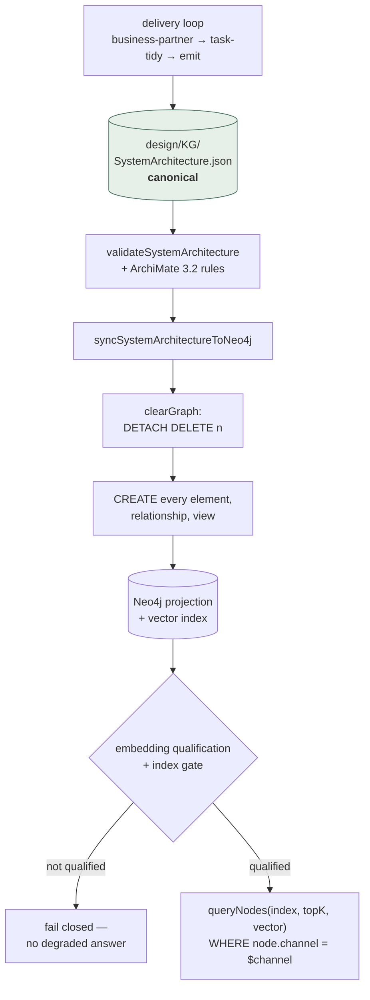

## 1. Executive Summary

ARGO is a delivery harness — requirements through architecture, coding, testing
and archival — whose distinguishing choice is what it remembers. Instead of
storing conversation turns or extracted facts, it maintains an **ArchiMate 3.2
enterprise-architecture model** of the system under construction, and makes that
model the thing agents query. The README's argument for the choice is that
ArchiMate's constrained relationship types make architectural context
*"queryable, traceable, and usable by agents"*, which is a claim about the
schema doing work that free-form extraction cannot.

The committed graph is real: `design/KG/SystemArchitecture.json` is 400 KB
holding **96 elements, 140 relationships and 47 views**. Around it sit 6,674
lines of GraphRAG JavaScript over Neo4j with a live embedding lifecycle, MCP
servers, and platform bundles for Cursor, GitHub Copilot and OpenCode. MIT
licensed, 861 commits.

**Its test posture is inverted from almost everything in this atlas.** 27,152
lines of tests across 100 files against 6,674 lines of graph-rag implementation —
roughly four to one — and the tests are not unit checks but *architecture fitness
functions*: entry-point boundaries, dependency direction, contract traceability,
credential boundaries. `node .argo/scripts/runArchitectureTests.js` executes 61
named acceptance cases on a clean clone with no services.

**It fails.** 114 passed, 8 failed, exit 1, four unique failing cases. Two need a
live provider or Neo4j. The other two do not, and one of them is worth reading
closely because the project's own gate is red about its own code.

**And the memory has no correction semantics of its own**, which is the finding
that matters most here. `syncSystemArchitectureToNeo4j` calls `clearGraph` —
`MATCH (n {graphKey: $graphKey}) DETACH DELETE n` — and then `CREATE`s every
element again. The graph is a projection, not a system of record. Nothing in
Neo4j supersedes, versions, tombstones or dates a belief; the JSON is canonical
and git is its history. That is a defensible architecture and it means every
question this atlas asks about correction has to be asked of a file and a review
process rather than of the store.

## 2. Mental Model

A fact about the architecture is written to a schema-validated JSON file,
projected into a graph that is rebuilt from scratch, and served only if the index
is qualified.



The shaded node is the memory. Everything to its right is derived and disposable,
which is why the delete path is a wipe rather than a correction: there is nothing
in the graph worth preserving that is not already in the file.

The consequence for this atlas's questions is direct. Ask "can a wrong belief be
retracted so it cannot return?" and the answer is not in the code — it is that
someone edits the JSON and re-syncs, and whether the wrong value comes back
depends on the review process around a file. The store cannot help, and does not
pretend to.

## 3. Architecture

`.argo/` is the payload: `scripts/graph-rag/` (6,674 lines) holds
`productionGraphRagRuntime.js`, `mutationEmbeddingVectorLifecycle.js`,
`defaultSemanticRetrieval.js`, the three gates
(`embeddingQualificationGate`, `liveEmbeddingIndexGate`,
`canonicalProjectionAuthority`), `semanticReadinessAttestationStore.js` and a
`semantic-persistence/` subtree. Beside it, `.argo/scripts/` carries the Neo4j
store, three MCP servers, the ArchiMate rule engine, and validators for the
architecture and for each stage handoff. `.argo/schema/` holds four JSON schemas;
`.argo/rules/` holds three checklists; `.argo/history/decision-tree/` holds dated
decision records as Markdown.

`ARCHITECTURE.md` inside `graph-rag/` is 54 KB, which is a larger design document
than most systems here ship for their whole product.

### Deployment and ergonomics

Copy a platform bundle plus `.argo/` into a workspace and run `/argo-init`, which
checks that the `argo` MCP tools and the vector graph are reachable. Neo4j is
required for the graph, and an embedding provider for the vector arm — the README
states that *"automatic embedding and persistence run only when a vector-ranking
model is configured"*, so the degraded mode is declared rather than discovered.

The real adoption cost is not the services. It is that ARGO expects you to model
your system in ArchiMate and keep that model current, because the model *is* the
memory. A team that will not maintain it gets a harness whose central asset is
stale, and no amount of the surrounding machinery compensates.

## 4. Essential Implementation Paths

### The graph is a projection, and the code says so

```js
async function clearGraph(tx, graphKey) {
  await tx.run('MATCH (n {graphKey: $graphKey}) DETACH DELETE n', { graphKey });
}
```

then, per batch, `CREATE (e:Element)`, `SET e += row`, `MERGE (g)-[:OWNS_ELEMENT]->(e)`.
Elements are created, never merged by identity; relationships and views the same.
`canonicalProjectionAuthority.js` names the arrangement outright — the canonical
artifact has authority, the projection does not.

A canonical store with a rebuildable projection is a shape many reports here
describe without naming, and ARGO is the cleanest instance of it — the one where
the trade is most visible: rebuildability buys you a graph that can never drift from the file, and
it costs you every per-record property that would have made the graph itself
correctable. There is no `valid_from`, no `superseded_by`, no status, no audit
row, because a node's whole life is one sync.

### Retrieval that fails closed

Recall is Neo4j native vector search:

```cypher
CALL db.index.vector.queryNodes($indexName, $topK, $vector)
YIELD node, score
WHERE node.channel = $channel
RETURN properties(node) AS record, score
ORDER BY score DESC
```

Fully parameterised, with the channel applied as a filter in the query rather
than after it — so the scope key reaches the read path, which is what the
[scope as a first-class key](../../patterns/scope-as-a-first-class-key/) mark
certifies.

In front of it sit `embeddingQualificationGate` and `liveEmbeddingIndexGate`, and
the committed acceptance cases assert what happens when they are unhappy:
`SP-04-FailClosedReadiness` and `BP-AUTOALIGN-QUERY-FAILS-CLOSED` both pass. A
retrieval path that refuses to answer when its index is not qualified — rather
than silently returning lexical or stale results — is the behaviour this atlas
asks about under negative evidence, and here it is asserted rather than
described.

### Architecture tests as the product's own gate

`tests/` is 100 files and 27,152 lines, and its centre of gravity is
`tests/architecture/` and `tests/explicit/entries/`: entry-point boundary,
dependency direction, contract traceability, credential boundary, delivery
gates. `runArchitectureTests.js` drives 61 named cases and prints a per-case
verdict with its command line, which makes the suite legible as evidence rather
than as a pass/fail.

Run at this commit, from a clean clone, with no Neo4j and no provider key:

```text
61 acceptance cases — 114 passed, 8 failed — exit 1
```

The four unique failures: `TS-06-Provider-E2E` and `SP-03-DefaultVectorRetrieval`
need a live provider and a live database respectively, which is expected.
`TS-07-Provider-Secret-Isolation` and `TS-07` do not.

### The gate that is red about its own code

`runExternalCredentialBoundary.js` first asserts that each missing credential
blocks delivery with `EXTERNAL_CREDENTIALS_REQUIRED` and no fallback — those
assertions pass — and then audits every production source file for three things:
hardcoded credential defaults, credential fallback expressions, and
credential-bearing Cypher. At HEAD:

```text
hardcodedDefaults    []
fallbackCredentials  []
cypherCredentialLeaks [".argo/scripts/graph-rag/mutationEmbeddingVectorLifecycle.js"]
```

`TS07_CYPHER_CREDENTIAL_BOUNDARY_VIOLATION`, in 30 ms, no services required.

**The flagged Cypher carries no credential.** It is the vector query above —
`indexName`, `topK`, `vector`, `channel`. The detector taints identifiers by
credential name across the *whole file*, and `mutationEmbeddingVectorLifecycle.js`
contains `embeddingCredential: configuration.qwenKey` at line 158, so every
`session.run` in that file is thereafter treated as a credential transport.

Two things worth separating, because they point opposite ways. The rule is
file-scoped where it needed to be dataflow-scoped, so this specific failure is a
false positive and not a leak. And the project ships at HEAD with its own
security gate red, which means the signal it built is currently not being read —
the failure mode where a well-designed check is present, correct in intent, and
routinely overridden by whoever runs the suite and knows which reds to ignore.
A test suite that is expected to be partly red teaches its readers to stop
reading it.

### Injection defence in the handoff validator

`validateStageHandoff.js` validates each stage handoff against a JSON schema and
additionally refuses acceptance criteria that look like commands —
`DISALLOWED_ACCEPTANCE_CRITERIA_PATTERNS` rejects anything starting with `node`,
`npm`, `python` and friends, anything shaped like a path plus arguments, and
anything containing backticks, quotes, pipes or semicolons.

Acceptance criteria are model-authored text that a later stage executes against,
which makes them an injection surface most harnesses leave open. Refusing the
shell-shaped ones at the schema boundary is a cheap, specific defence.

## 5. Memory Data Model

The unit is an ArchiMate 3.2 construct. `SystemArchitecture.schema.json` governs
the canonical file; `archimate32-rules.js` enforces which relationship types may
connect which element types, which is the constraint the README's whole argument
rests on. In the graph, nodes carry `graphKey` for partitioning and `channel` for
retrieval scope, plus an embedding.

Three further schemas cover the handoffs — intent to implementation,
implementation to coding, and an implementation-to-intent trace proposal. The
last is the interesting one: a proposal to write back from code to intent,
schema-validated, so drift between what was designed and what was built has a
typed channel rather than a conversation.

What is absent, measured against this atlas's rubric, follows from the projection
model rather than from oversight. No discrete trust state on an element — the
vocabulary of `qualified`, `blocked`, `aligned`, `approved` and `rejected`
belongs to gates and delivery stages, and attaches to a run or an index, never to
a belief as a field. No validity time apart from record time. No mutation audit
in the store: `semanticReadinessAttestationStore` writes a readiness attestation
to `.argo/temp/` with an ACL check, which is a record of whether the index may be
trusted, not of what changed. And no value-keyed rejection, so a wrong element
removed from the JSON and re-added by a later modelling pass arrives as new.

## 6. Retrieval Mechanics

One embedding of the query, one Neo4j vector index lookup per channel, filtered
and ordered by score. No lexical arm and no fusion, so the failure the
[hybrid retrieval fusion](../../patterns/hybrid-retrieval-fusion/) pattern
describes applies — except that the corpus here is a controlled vocabulary of
ArchiMate element names rather than free prose, which narrows the exposure
considerably. Exact identifiers are what the graph structure is for; the vector
arm is for finding the right region of it.

`defaultSemanticRetrieval.js` is 34 KB, and `neo4jNativeRetrieval.js` is a
1 KB adapter over the native index — the size difference is where the gating,
channel routing and fallback policy live.

## 7. Write Mechanics

The delivery loop edits the canonical JSON; `validateSystemArchitecture` and the
ArchiMate rules check it; `syncSystemArchitectureToNeo4j` projects it, with a
`--verify` mode that checks the projection matches without writing.
`mutationEmbeddingVectorLifecycle.js` maintains embeddings across mutations, and
its acceptance cases assert the aligned-write and the failure-is-not-complete
paths — `BP-AUTOALIGN-WRITE-ALIGNED` and
`BP-AUTOALIGN-WRITE-FAILURE-NOT-COMPLETE` both pass, so a write that fails to
index does not report success.

### Operational cost

A Neo4j instance and an embedding provider, both required for the semantic path
and both declared. The sync is O(graph) on every run because it rebuilds, which
is cheap at 96 elements and is the number to watch if the model grows. No model
sits in the read path; the models sit in the delivery loop that authors the
model.

## 8. Agent Integration

Three MCP servers — architecture, validation, system metadata — plus prompt
bundles for Cursor, GitHub Copilot and OpenCode, each exposing the same
entrypoints. `/business-partner` converges a decision tree with a human;
`/task-tidy` packages it; `/task-emit-human-in-the-loop` keeps a person on stage
approvals while `/task-emit-afk` runs unattended and returns failing tasks until
they pass.

The human-in-the-loop mode is a real workflow distinction and it is **not** a
memory review surface. No schema carries an approver, a reviewer or an approval
timestamp — `acceptanceCriteria` is the only related field — so the approval
happens in the conversation and leaves nothing on the record it approved. That is
the near-miss for `human_review`: the ceremony exists and the evidence of it does
not.

## 9. Reliability, Safety, and Trust

Strengths:

- **Four times more test code than implementation**, weighted toward architecture
  fitness functions rather than unit tests.
- **A runner that prints a verdict and a command per case**, so a reader can
  re-execute any single one.
- **Retrieval that fails closed** when the index is not qualified, asserted by two
  committed cases rather than described.
- **A write path that cannot report success on a failed index**, also asserted.
- **Scope applied inside the query**, not after it.
- **A constrained schema doing real work** — ArchiMate's legal relationship types
  are enforced by a rule engine, so the graph cannot express a connection the
  language forbids.
- **Injection defence on acceptance criteria**, refusing shell-shaped text at the
  schema boundary.
- **A declared degraded mode** — no vector model configured means no automatic
  embedding, stated up front.

Gaps:

- **The store has no correction semantics.** A wipe-and-rebuild projection has no
  supersession, no history, no tombstone and no per-element status; correction
  lives in a file and a review process.
- **The suite is red at HEAD**, including one case whose subject is a credential
  boundary.
- **That case is a false positive** from a file-scoped taint rule, which is its
  own problem: a check that cries wolf is a check that gets ignored.
- **No approver recorded** on anything a human approved.
- **Single-arm retrieval**, mitigated by the controlled vocabulary rather than by
  design.

## 10. Tests, Evals, and Benchmarks

Run at this commit: **61 acceptance cases, 114 passed, 8 failed, exit 1**, on a
clean clone with `npm install` and nothing else. Four unique failures, two
environmental (`TS-06-Provider-E2E`, `SP-03-DefaultVectorRetrieval`) and two not
(`TS-07`, `TS-07-Provider-Secret-Isolation`).

There is no retrieval-quality benchmark and nothing that measures whether the
architecture graph improves an agent's output — which is the claim the whole
design rests on. The tests establish that the machinery behaves, not that the
machinery helps. For a project whose thesis is that ArchiMate structure makes
context *"queryable, traceable, and usable"*, the missing measurement is the one
that would settle it, and its absence should be read as the honest state of an
unproven thesis rather than as a gap in diligence.

The suite's real contribution to this atlas is the genre. Architecture fitness
functions — dependency direction, entry-point boundary, contract traceability —
are rare in the corpus, and they are the only committed tests here that would
catch a *structural* regression rather than a behavioural one.

## 11. For Your Own Build

### Steal

- **Make the schema carry the constraint.** ArchiMate's legal relationship types
  mean a malformed architectural claim is rejected by a rule engine rather than
  by review. A controlled vocabulary is worth more than a validator over free
  text.
- **Fail retrieval closed when the index is not qualified.** Returning degraded
  results silently is the failure a user cannot see; refusing is one they can.
  Assert both directions.
- **Make a failed index a failed write.** `BP-AUTOALIGN-WRITE-FAILURE-NOT-COMPLETE`
  is the assertion that stops a store reporting success while being unsearchable.
- **Write architecture fitness functions**, not only unit tests — dependency
  direction and entry-point boundaries catch the regressions that survive every
  behavioural test.
- **Refuse shell-shaped text at the schema boundary** when model-authored fields
  are later executed against.
- **Give drift a typed channel.** A schema-validated trace proposal from code
  back to intent beats noticing the divergence in a conversation.

### Avoid

- **Shipping with your own gate red.** A suite expected to be partly red trains
  its readers to skip the reds, and the case being ignored here is a credential
  boundary.
- **Taint analysis scoped to a file.** One credential-named identifier anywhere
  in a module marks every query in it, and the resulting false positive is
  indistinguishable from the true one it was written to catch.
- **Treating a rebuildable projection as a memory.** It is an index. If you need
  correction semantics, they belong in the canonical artifact, and you should say
  so rather than let a graph database imply otherwise.
- **Recording an approval only in the conversation.** Human-in-the-loop that
  leaves no field is a mode, not a record.

### Fit

Right for a team that already models its system and will keep doing so — the
payoff is an agent that can query architecture rather than re-derive it, and the
harness around that query is more carefully tested than most things in this
atlas. The delivery-mode split and the stage handoffs are a coherent product.

Wrong as a memory component, and wrong for a team that will not maintain an
ArchiMate model. There is no general-purpose store here: the memory is one
project's architecture, its correction story is git, and adopting ARGO means
adopting a modelling practice first and a retrieval stack second.

## 12. Open Questions

- Does the architecture graph measurably improve delivery outcomes? The thesis is
  stated and nothing in the repository tests it.
- Will the credential-boundary rule become dataflow-scoped, or will the
  suppression be an allowlist? Either fixes the red; only one keeps the check
  meaningful.
- Is the wipe-and-rebuild sync intended to stay O(graph), and what is the model
  size at which it stops being free?
- Should an approver be recorded on a stage acceptance, given the
  human-in-the-loop mode exists to produce one?
- The trace proposal writes from implementation back to intent — what
  adjudicates a proposal that contradicts a decision already recorded in
  `.argo/history/decision-tree/`?

## Appendix: File Index

- Canonical memory: `design/KG/SystemArchitecture.json` (96 elements, 140
  relationships, 47 views), `.argo/schema/SystemArchitecture.schema.json`,
  `.argo/scripts/archimate32-rules.js`.
- Projection: `.argo/scripts/neo4j-system-architecture-store.js` (`clearGraph`,
  element/relationship/view writers), `.argo/scripts/syncSystemArchitectureToNeo4j.js`.
- Retrieval and gates: `.argo/scripts/graph-rag/defaultSemanticRetrieval.js`,
  `neo4jNativeRetrieval.js`, `embeddingQualificationGate.js`,
  `liveEmbeddingIndexGate.js`, `canonicalProjectionAuthority.js`,
  `productionGraphRagRuntime.js`, `mutationEmbeddingVectorLifecycle.js`,
  `semanticReadinessAttestationStore.js`, and `graph-rag/ARCHITECTURE.md`.
- Validation: `.argo/scripts/validateSystemArchitecture.js`,
  `validateStageHandoff.js` (`DISALLOWED_ACCEPTANCE_CRITERIA_PATTERNS`),
  `validateTraceProposal.js`.
- MCP: `.argo/scripts/argo-mcp-server.js`,
  `systemarchitecture-mcp-server.js`, `validator-mcp-server.js`.
- Tests: `.argo/scripts/runArchitectureTests.js`, `tests/architecture/`,
  `tests/explicit/entries/` (notably `runExternalCredentialBoundary.js`,
  `runProductionSemanticReadinessGate.js`, `runMutationIndexLifecycle.js`),
  `tests/harness/productionGraphRagHarness.js`.
- Decisions: `.argo/history/decision-tree/`, `.argo/rules/`.

## History

**2026-08-04** — [`9cd3e70fa28f4336b6df1181a771af9289f0f0f7`](https://github.com/derekhu0002/Argo/commit/9cd3e70fa28f4336b6df1181a771af9289f0f0f7) — first reading. `node .argo/scripts/runArchitectureTests.js` was executed on a clean clone: 61 acceptance cases, 114 passed, 8 failed, exit 1. The `TS-07` credential-boundary failure was traced to `cypherCredentialLeaks` naming `mutationEmbeddingVectorLifecycle.js`, and the flagged Cypher was extracted and confirmed to carry no credential — a file-scoped taint rule, not a leak. Marks are withheld for trust state, bi-temporal validity, audit log, tombstone and human review because the Neo4j graph is rebuilt wholesale by `clearGraph` on every sync and carries no per-element lifecycle, and because no schema records an approver.
