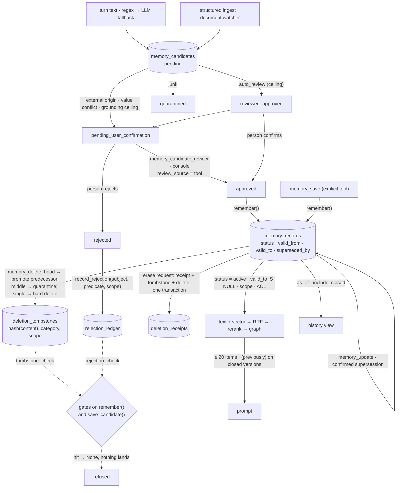

## 1. Executive Summary

Argos is **persistent memory for a Hermes agent** — a plugin for Nous
Research's Hermes host with a standalone service behind it — and it is
also a standalone memory server, because the same store answers an MCP
stdio server, a REST server and a local admin console through one facade.
Business Source License 1.1, production use licensed separately,
converting to Apache 2.0 on 21 August 2030; 402 commits between 2 August
and 6 September 2026, 397 by the maintainer and five by a coding agent
that signs its pull requests; 220 issues and 123 pull requests in those
five weeks; 46,635 lines of Python in `argos_plugin/` at the previous pin beside 152 test
files carrying 2,803 test functions and 55,102 lines. The store is
DuckDB 1.5.5 for records and a Kùzu 0.11.3 graph for entities, with
`bge-small-en-v1.5` embeddings computed locally and an optional
`bge-reranker-base` cross-encoder.

The unit is a `memory_records` row with forty-odd columns
(`store_core.py:96-133`): a category from eight, content, an embedding,
a `status`, a `source`, a `confidence`, a `durability`, five scope
columns, a `provenance_origin` of `internal` or `external`, a
`grounding` of `observed`, `extracted`, `inferred` or `speculative`, a
validity interval with a `superseded_by` link, a lifecycle `tier`, and
the document and embedder that produced it. Nothing an extractor finds
becomes one of these directly. Every turn is mined by regex with an LLM
fallback into `memory_candidates` (`provider_session.py:526-680`), and
a candidate climbs a ladder — `pending`, `reviewed_approved`,
`pending_user_confirmation`, `approved`, `rejected`, `quarantined`,
`deduplicated` — whose top rung the automatic reviewer cannot write:
`review_candidate` raises if `review_source="auto_review"` asks for
`approved` (`store_write.py:1339-1349`), downgrades an external-origin
approval to confirmation, and caps promotion at what the record's
grounding allows. The one bypass is `memory_save`, the explicit tool,
which the README and the project's own claims audit both name as the
exception.

**What makes it unusual is that forgetting is remembered on both write
paths.** A hard delete writes a `deletion_tombstones` row keyed on a
normalised hash of the content (`store_write.py:3120-3160`); a
rejection, and every conflict resolution that keeps the old value, writes
a `rejection_ledger` row keyed on the claim slot — `(subject, predicate,
user_scope)` — so a paraphrase is caught too (`:3213-3260`); and both
`remember` (`:247-266`) and `save_candidate` (`:1108-1130`) consult both
tables and return `None` on a hit, so a re-fed fact neither lands nor
reaches the reviewer. Both are reversible only by an explicit purge.
Updates chain versions rather than overwrite, with `valid_from` set to
the in-world time and a backdating parameter for the new version
(`:2391-2430`), and retrieval defaults to `valid_to IS NULL` with
`as_of` and `include_closed` to widen it (`store_retrieval.py:98-107`).
An erase request writes a `deletion_receipts` row in the same
transaction as the tombstone and the delete, carrying the hash and not
the content (`store_maintenance.py:1420-1460`).

The numbers are unusual too, in how they are kept. A `CLAIMS-AUDIT.md`
maps every README figure to a committed judged artifact under
`eval/repro/` and a script that re-derives each one, and records its
own corrections: that *"nothing becomes a memory silently"* had to be
scoped around `memory_save`, and — the entry that matters most here —
that across every LongMemEval run database *"store-level version chains
are absent … 0 of 2,424 records with `valid_to`/`superseded_by`; ingest
is `remember(dedup=False)`, so supersession never fires and chain-unfold
has nothing to walk."* The headline 89.8 % and baseline 70.4 % recompute
from the committed files (449 and 352 `True` labels in 500 rows each), and
they measure retrieval plus an answerer, not the machinery this report
is about.

Seven marks. The repository names this atlas as the reference design
for its trust model, implements the atlas's contradiction test as a
parametrised suite with a control against vacuous passes, and closed
its tombstone gap against the atlas's deletion canary; those are facts
about the repository, and every mark below is earned by a line of code
and the test beside it. No paper.

## 2. Mental Model

A memory begins as a proposal. The turn is scanned by regex patterns
and, when they miss, by an auxiliary model; each hit becomes a
candidate row with the evidence sentence, the session, a confidence and
a `grounding` label — `extracted` for anything a model or a pattern
produced, `observed` only for what a person stated. A candidate cannot
be injected. It becomes a belief when a person, or the agent-facing
confirmation tool acting for one, approves it; the automatic reviewer
may only mark it `reviewed_approved`, and if the candidate came from
outside the conversation, or conflicts in value with a current fact, or
is grounded below what approval requires, the storage layer turns the
automatic verdict into `pending_user_confirmation` whatever the model
said. Approval with a named predecessor chains the new fact behind the
old one; the old one closes with `valid_to` and points forward.

A belief is current while `status = 'active'` and `valid_to IS NULL`. It
stops being current four ways. It is superseded by an update or a
confirmed replacement, and stays readable at `as_of`. It is quarantined
— by maintenance for staleness or duplication, by the forgetting pass
after a year without a retrieval, by `memory_feedback` marking it
incorrect — and can be restored. It expires, when a category has a
TTL. Or it is deleted: the head of a chain hands current back to its
predecessor, a middle version is quarantined so the arc is not severed,
and a lone version is removed and its content fingerprinted so that no
later turn, no re-fed transcript and no import can bring it back
without someone purging the tombstone. A rejected proposal leaves the
same kind of mark on its claim slot.



## 3. Architecture

`argos_plugin/` is one package with the store split into mixins —
`store_core.py` (schema and migrations), `store_write.py` (3,304 lines:
`remember`, candidates, review, update, delete, tombstones, ledgers),
`store_retrieval.py` (the filter builder, hybrid search, access audit,
listings), `store_maintenance.py` (consolidation, quarantine, expiry,
erase, receipts, portable export and import, `explain_retrieval`) — a
`graph.py` over Kùzu, `embeddings.py`, `extractor.py` with a patterns
directory, `reviewer.py`, `distillation.py`, `rollup.py`,
`compaction.py`, `watcher.py` for documents, `structured_ingest.py`,
`provenance.py`, `access_scoping.py`, `namespace_partition.py`,
`inbound_security.py`, `egress.py`, and the provider in three files
(`provider_core.py`, `provider_session.py`, `provider_retrieval.py`).
`memory_service.py` is the shared RPC service that owns the DuckDB
writer so several Hermes processes share one store; `service_client.py`
is its client. `api_facade.py` (2,220 lines) is the trust boundary the
external surfaces share: `mcp_server.py`, `rest_server.py` and
`admin_console.py` all pass through its auth → ACL → validation → audit
chain and its allowlisted operation set. `schema_migrations.py` runs
ordered migrations after an additive `ALTER TABLE … IF NOT EXISTS` layer,
with a `schema_meta` version.

Tables (`store_core.py:96-268,:491-535`; `schema_migrations.py:145-158`):
`memory_records`, `memory_candidates`, `memory_evidence` (one row per
memory linking it to the exact statement and the reviewer's decision),
`file_catalog` and `file_aliases` for the document tier,
`entity_aliases`, `deletion_tombstones`, `rejection_ledger`,
`access_audit`, `system_state`, `deletion_receipts`, `schema_meta`. The
graph has `Entity(id, entity_type, attributes, user_scope)` nodes and
`RelatesTo(relation_type, attributes, user_scope, memory_ids[])` edges
(`graph.py:932-945`), with validity intervals stamped on nodes
(`:1052-1134`).

`tool_compression/` and `ambient_context/` are reference copies of
patched Hermes core files, marked as not runtime code; the plugin uses
the host's provider, pre-call hook and user-context injection APIs. The
README says a stock upstream Hermes build has not been verified.

### Deployment and ergonomics

Python 3.11 with pinned dependencies, no service beyond the plugin's own
RPC process; the embedder is a 130 MB local model and the reranker an
optional 420 MB one that the docs say needs CUDA to be usable. The store
is two directories a person can open, one `hybrid_memory.json`
configures everything (a Pydantic model with `extra="forbid"`), and the
external servers bind to loopback with a bearer token. Tenants are
provisioned as separate stores behind the one service. `deploy.py`
syncs the repository to a live plugin directory and reports drift by
hash. Backups, a reindex of the graph, a re-embed on model change and a
portable JSONL export exist as commands.

## 4. Essential Implementation Paths

- **Propose.** `sync_turn` (`provider_session.py:526`) runs
  `extract_facts` with the regex patterns and, when configured, the LLM
  fallback, and calls `save_candidate` (`:658`) per hit.
  `save_candidate` (`store_write.py:994-1140`) sanitises for instruction
  injection (a hit is stored `quarantined`, not dropped), dedups against
  pending candidates by exact and substring match, then applies the
  tombstone and rejection checks (`:1108-1130`) and returns `None` on
  either. Auto-review (`provider_session.py:425-495`) maps the model's
  verdict through `{"approve": "reviewed_approved", "reject":
  "rejected", "quarantine": "quarantined"}` and forces a value-conflicting
  proposal to `pending_user_confirmation` with `supersedes_memory_id`
  pre-filled.
- **Review.** `review_candidate` (`store_write.py:1306-1480`): the
  allowed decisions; the approval invariant raise; the injection scan on
  approval; the external-origin downgrade (`:1370-1392`); the grounding
  ceiling (`:1400-1420`); then, in one transaction, `remember(...)`, the
  optional chaining behind `supersedes_memory_id`, the candidate status,
  the evidence row, and on `rejected` a `record_rejection` (`:1540-1546`).
- **Write.** `remember` (`:70-350`): sanitise, the inbound-security scan
  for external-origin content, dedup by exact and substring against
  active rows, `tombstone_check` and `rejection_check` (`:247-266`),
  TTL by category when enabled, embed with the embedder's identity
  stamped, insert with `valid_from = created_ts` (`:340`), then
  opportunistic re-embedding of rows written during an embedder outage.
- **Read.** `_build_domain_filters` (`store_retrieval.py:51-135`):
  `COALESCE(status,'active') = 'active'`, the temporal fragment,
  expiry relative to `as_of` or now, `user_scope IS NULL OR = ?`,
  project, namespace, `client_scope IS NULL OR = ?`, category
  exclusions, `tier`. `_hybrid_search`: text and vector legs, RRF,
  optional rerank, phrase lift, feedback and recency; the provider then
  expands the query when the top hit is weak, expands aliases, boosts by
  graph, and annotates chains; `explain_retrieval`
  (`store_maintenance.py:699`) reports why a record did not surface.
- **Inject.** `on_turn_start` (`provider_retrieval.py:1155`) prefetches
  in a thread; up to twenty items (`provider_core.py:56`) are rendered
  with an id, *(previously)* on a closed version (`:1392`), a freshness
  marker when configured, and `[negative]` on an exclusion; chain
  unfolding runs only in the `memory_search` tool path under a
  150-token cap.
- **Update, delete, restore.** `update_memory` (`store_write.py:2391`)
  creates the new version, optionally backdated, and closes the old row;
  `delete_memory` (`:3001`) is chain-aware and tombstones a hard delete
  (`:3059,:3100`); `restore_memory` (`:2307`) clears a quarantine and
  warns when the row is also closed.
- **Erase.** The POPIA workflow (`store_maintenance.py:1400-1460`):
  preview first, strict confirm, then per record a receipt, a tombstone
  and the delete in one transaction; `verify` (`:1575-1600`) later
  proves a receipt's record is gone and its tombstone present.
- **External writes.** The facade's class A (`memory_propose`, a
  proposal), class B (candidate approval, denied to model principals
  even as `tool`), class C (`memory_save`, `memory_update`,
  `memory_delete` for loopback callers with server-derived identity),
  with idempotency keys and compare-and-swap on `expected_version`;
  `facade_delete_memory` requires the version (`memory_service.py:841-895`).
- **Background.** Session-end consolidation quarantines duplicates and
  stale temporaries; archival, forgetting and rollups are off by default
  (`config_model.py:148-152`); distillation clusters new records at
  cosine 0.75 to a seed (`distillation.py:38`) and emits proposals only,
  behind novelty, cooldown and budget gates.

## 5. Memory Data Model

Two record shapes and two ledgers carry the design. `memory_records`
and `memory_candidates` share the provenance columns — `source`,
`confidence`, `durability`, `scope`, `user_scope`, `namespace`,
`client_scope`, `doc_class`, `provenance_origin`, `grounding` — and the
candidate adds `evidence_text`, `evidence_role`, `source_timestamp`,
`review_confidence`, `review_model`, `review_reason`, `reviewed_at`. The
backfill for older stores derives `grounding` from `source`
(`store_core.py:395-420`): explicit is `observed`, extraction is
`extracted`, distillation is `inferred`, and anything else is
`speculative`, the strictest — and an unknown `provenance_origin`
normalises to `external`, the stricter class. Document-sourced facts add
`source_doc_id` (a content hash, never a path), `source_loc`,
`extraction_method`, `verified_state` and `verified_at`.

`deletion_tombstones (content_hash, category, user_scope, reason,
created_at)` and `rejection_ledger (subject, predicate, user_scope,
reason, created_at)` are written with `INSERT OR REPLACE`, so a repeated
deletion refreshes the row rather than appending. `deletion_receipts`
is append-only by design and carries `request_id`, `subject`,
`memory_id`, `content_hash`, `outcome` and who asked.
`access_audit` stores a sixteen-hex prefix of the query's SHA-256, never
the query, with granted and denied counts and the denied scopes.

The graph is indexed at save time: entities and typed relations
extracted from the content, alias mappings resolved both ways, and
`memory_ids` on each edge so a delete or an *incorrect* feedback can
detach a memory; a purge at session end removes orphaned junk entities.
The version chain lives only in the records table; the graph carries
validity on nodes.

## 6. Retrieval Mechanics

The store's search is a fixed pipeline: an ILIKE text leg and a cosine
leg over the stored vectors, fused by reciprocal rank, an optional
cross-encoder rerank blended 20/80 with similarity, a phrase lift that
is a no-op at its default, then feedback and recency. The provider adds
a second pass when the top similarity is below a floor — the LLM
rewrites the query into sub-queries, cached for an hour — and alias and
graph expansion. The 2026-09-02 A/B recorded in the claims audit found
graph traversal *flat* on every metric over a 1,201-record corpus and
300 queries, and the audit's verdict is that the graph is a boost
signal, not a traversal engine.

The current view is the default and the history is opt-in. A closed
version is invisible to a plain search, visible under `as_of` for the
interval it was current, and visible under `include_closed`; when a
historical query surfaces one it is labelled. The contradiction matrix
test records the consequence as a prediction it confirms: a plain
current-time question about an old value fails, because `valid_to IS
NULL` hides closed versions entirely, while the as-of form passes.
`memory_why_not` and the facade's `explain_retrieval` answer the
question the filter chain otherwise swallows — which fragment excluded
a record.

## 7. Write Mechanics

The explicit path blocks on one insert plus an embedding; the proposal
path is a background worker per turn, and a proposal is retrievable
only after review, so the lag from a turn to an injectable memory is
the reviewer's — the auto-reviewer's model call when enabled, or a
person's next visit to the queue. Prefetch runs recall for the incoming
message before the model is called.

Three passes rewrite the store. Consolidation at session end merges
near-duplicates by embedding similarity, newest wins and the older is
chained or quarantined, and quarantines stale temporaries — never a
delete. The forgetting pass, off by default, quarantines
`context_note`, `event` and `goal` records older than a year with no
retrievals. Distillation, off by default, clusters and asks a model for
insights, contradictions and guardrails, honours contradiction ids only
for records it showed the model, and saves proposals with their
grounding — nothing it produces is active until reviewed. The
`system_state` table advances the run marker only on a completed run.

Every write is scanned for instruction-injection patterns; external-
origin content is scanned by the inbound security module and a scanner
import failure refuses the write rather than allowing it — a fix the
claims audit records as issue 23, closed 28 August 2026. The
egress gate returns `False` for an unknown call kind, issue 24, closed
the next day. The document watcher extracts only from files its policy
marks hot, and a fact inherits access from its source document's folder.

### Operational cost

A turn costs one regex pass and, when the fallback is on, one model
call for extraction and one for review; a search costs one text query,
one vector scan over the user's active rows and, when enabled, a
cross-encoder pass the docs price at eight seconds per query on CPU.
The access log grows one row per facade query and is trimmed to the
newest 100,000 at startup. Nothing external is required; the model
calls go to whatever the host has configured, behind an egress gate
that can be set to local-only.

## 8. Agent Integration

The Hermes agent sees sixteen tools in five groups — store and search,
version chains, graph, review and restore, feedback and maintenance,
diagnostics — three slash commands (`/ilog`, `/revisit`, `/neg`), and a
`pre_llm_call` hook that injects time, location, weather and recent
file activity. Any other MCP client sees `memory_search`,
`memory_fetch`, `memory_fetch_history`, `memory_explain`,
`memory_why_not`, `memory_propose` and `memory_capabilities` over
stdio; REST exposes the same read set. A person has the review queue in
the tool and in the console, where every mutation carries
`review_source="tool"` and an audit row, and a `Cache-Control` header
and a server-derived identity keep the console from trusting the
browser.

The trust model as the spec states it: *"the question that matters when
the store is an injection surface is 'what may this memory be allowed
to do?', and the labels are permanent from ingest."* The labels are
`provenance_origin` and `grounding`; a person's confirmation lifts the
grounding, recall counts never do.

## 9. Reliability, Safety, and Trust

**Tombstone — awarded, the strong form.** Two ledgers, one keyed on the
normalised value and one on the claim slot, consulted before the write
on both the direct and the proposal path, with a hit refusing the write
outright. The `INSERT OR REPLACE` means a second deletion of the same
content overwrites the first row's reason and time; the purge is
explicit and scoped.

**Trust state — awarded.** A seven-state candidate ladder and a record
status, both read as filters: a candidate is never injected, a
quarantined record is excluded by the first fragment of every query,
and the transitions that matter are enforced in `review_candidate`
rather than in a prompt.

**Bitemporal — awarded.** `valid_from` is an in-world time that an
update can backdate independently of `updated_at`; `as_of` reads the
interval. The claims audit's own finding stands beside it: in the
benchmark runs no chain was ever formed, so the machinery is tested by
the unit and contradiction suites and not by the headline numbers.

**Scope — awarded.** Tenant, user, project, namespace, client scope and
document class, applied in SQL and to graph nodes before ranking, with
the facade's scope invariant tested under concurrency.

**Audit — awarded, narrowly.** Erasure receipts are an append-only
record of a mutation, written in the same transaction as the mutation,
and the two ledgers record every delete and rejection with a reason.
No row records a create, an approval or an update; the access log is a
log of reads and denials and rotates. A reader who wants *who approved
this and when* has the candidate's `reviewed_at` and `review_reason`
and the evidence row's `reviewer_decision`, which are state.

**Human review — awarded.** The confirmation tool and the console are
the only sources that can write `approved`; a model caller on the
external API cannot approve at all.

**Negative evaluation — awarded.** The contradiction matrix asserts the
stale value stays out while the current one comes back, and controls
for the empty store; the scope suites assert zero records across a
populated boundary.

**What the audit says about itself.** The README's trust-model sentence
*"every feature is gated by a measurement"* is listed under
*aspirational*; the test-count row has been refreshed five times and is
guarded by a parity test that fails when the quoted counts drift more
than 5 % from disk; the README's 2,350 tests over 131 modules and the
audit's 2,493 over 137 were both behind the tree's 2,750 over 148 at
this commit. The audit records two fail-open defects it found and
fixed, and a facade docstring that claimed deny-all on an invalid ACL
while the code warned and opened.

**The bypass and the rotation.** `memory_save` is a direct write with
no review — the agent's explicit act, by design, and the one path where
a model's judgement lands as active memory. The access log's rotation
means a denial older than 100,000 rows is gone.

**The sweep reaches the never-finalized states.** `stale_review_sweep.py`
re-reviews candidates left in `pending`, `reviewed_approved` and
`pending_user_confirmation`, deduplicated across the three, so an
auto-approved candidate nobody confirmed is re-examined rather than left
forever; the sweep never promotes to `approved`
(`tests/test_stale_review_sweep.py`, `test_no_auto_promotion_to_approved`).

**Collections and the access audit.** `store_collections.py` (466 lines) adds
typed collections whose every SQL carries the `user_scope IS NULL OR
user_scope = ?` predicate and whose listing is exhaustive by design;
`tests/test_spec10_collections.py` (30 cases) includes `test_user_scope_isolation`
and `test_facade_scope_isolation`. `tests/test_rpc_access_audit.py` (19 cases)
pins that a facade denial, a forged `confirmed` flag in the envelope or the
arguments, a forged HMAC and a CAS conflict each land in the access audit and
survive a service restart, and that reads are not gated.

## 10. Tests, Evals, and Benchmarks

152 test files, 2,803 test functions, 55,102 lines — more test than
implementation — run hermetically with `HF_HUB_OFFLINE=1`. The suites
that carry the marks: `test_deletion_tombstones.py` (nine cases, the
re-feed blocked, case-insensitive, category-scoped, user-scoped,
purgeable), `test_rejection_scope.py`, `test_approval_invariant.py`
(the automatic reviewer cannot write `approved`; the tool path can),
`test_candidate_review_integration.py`, `test_ingest_versioning.py`,
`test_facade_scope_invariant.py` (a second principal gets zero records,
scope resets after an exception, concurrent threads do not
cross-contaminate), `test_multitenant_cells.py` (text, fetch, count,
candidate, alias, tombstone and graph isolation between tenants),
`test_facade_durable_audit.py` (a denial survives reopening the store;
an allowed search writes no denial row), `test_spec10_writes.py` (869
lines on the write classes, idempotency and CAS), and thirty files
named `*_audit.py` that pin the findings of the project's per-module
reviews.

`test_contradiction_matrix.py` is the atlas's contradiction test as a
parametrised suite: five cases — replacement, polarity, retraction,
partial, bounded — each scored on answer, prompt hygiene, durability
after a forced no-LLM background pass, history at `as_of` and at
current time, and derived reach; `test_empty_store_control_no_vacuous_pass`
asserts the search returns nothing on an empty store first, and the
predicted failures — retraction, and current-time history — are
`xfail` with the reason written. The tombstone suite's search assertion
after a blocked re-feed can pass on an empty result; the `is None` on
the write beside it is the assertion that carries the case.

**Benchmarks.** Seven judged JSONL files under `eval/repro/`, each
500 rows with an `autoeval_label`, recompute exactly: 449 `True` in
`judged_glm500_final.jsonl` (89.8 %, a GLM answerer with a gpt-4o
judge), 352 in `judged_capexp_c1500_k96_gpt4o.jsonl` (70.4 %, the
baseline), 411 and 383 in the gpt-4o pair (82.2 % without and 76.6 %
with the distilled store), 240 and 433 in the flash pair (48.0 % and
86.6 %). The dataset is LongMemEval_S, 500 questions, SHA-256 recorded;
per-category denominators are listed; `verify_repro.sh` re-derives each
figure and exits non-zero on drift, given the external run artifacts it
expects in a sibling checkout. The protocol ingests each question's
sessions per turn into a fresh store with `dedup=False`, and the claims
audit's 30 August correction records what that means: no version chain
formed in any run, the update-order gains come from the answerer's
reasoning over a chronologically rendered list, and the store-level
supersession claim *"remains unproven."* Chain unfold (93 % precision
and recall on eight cases), phrase lift and the reranker A/B have their
own committed harnesses and result files. The README calls the numbers
self-measured and answerer-conditional, and lists what is measured
internally and not yet claimed.

## 11. For Your Own Build

### Steal

- **Consult the tombstone on every write path, not just the one that
  deletes.** Two tables, two keys — the value and the claim slot — and
  two gates that return `None`; the reviewer never sees a ghost.
- **Put the approval invariant in storage.** A `ValueError` when
  `auto_review` asks for `approved` is a stronger guarantee than a
  system prompt, and the downgrade rules — external origin, value
  conflict, grounding ceiling — live next to it.
- **Write the receipt in the same transaction as the erasure.** Hash,
  not content; proof that survives the thing it proves.
- **Keep a claims audit that records its own corrections.** The
  0-of-2,424 finding is the kind of sentence a README never volunteers,
  and here it is dated and linked.
- **Give `why_not` an endpoint.** A filter chain that can explain a miss
  is one a person can tune.

### Avoid

- **A benchmark whose protocol switches off the mechanism.** With
  `dedup=False` into a fresh store per question, the supersession
  machinery is idle while the number is quoted; say so as the audit
  does, or run the protocol that exercises it.
- **A read log that rotates and a write log that does not exist.** A
  create or an approval leaves state, not an event; a denial older than
  the cap is gone.
- **An explicit-save tool that skips the ladder.** Reasonable for a
  person's own agent, and the one place a model's judgement becomes
  active memory with no second look.
- **Replacing the ledger row on repeat.** `INSERT OR REPLACE` keeps one
  reason per deleted value; the first reason is lost.

### Fit

For a single person running Hermes who wants memory that forgets on
purpose and never lets an extractor decide alone, this is the most
complete implementation of the review-then-remember shape in this
corpus, and it is also usable from any MCP client as a read tier and,
from loopback, a write tier. The maintenance budget is the caveat: five
weeks, four hundred commits, a Business Source licence, and a claims
audit that has to be refreshed every few days because the code moves
faster than its README. A team should read the audit before the
README, and should expect to run the benchmark protocol that the audit
says was never run.

## 12. Open Questions

- What does the LongMemEval score become under a protocol that ingests
  with `dedup=True` and lets supersession fire? The audit filed it as
  issue 74; no artifact answers it.
- How much of the 89.8 % is the answerer? The 2×2 matrix shows the same
  store moving gpt-4o down and flash up with distillation, which is a
  statement about the answerer as much as the memory.
- When two values for one claim slot are both rejected at different
  times, which reason survives the `INSERT OR REPLACE`?

## Appendix: File Index

| Path | Lines | What it holds |
| --- | --- | --- |
| `argos_plugin/store_write.py` | 3,304 | `remember`, `save_candidate`, `review_candidate`, `update_memory`, `delete_memory`, tombstones, rejection ledger |
| `argos_plugin/graph.py` | 2,649 | Kùzu entities, relations, aliases, validity on nodes, junk purge |
| `argos_plugin/store_maintenance.py` | 2,310 | Consolidation, quarantine, expiry, erase and receipts, export and import, `explain_retrieval` |
| `argos_plugin/api_facade.py` | 2,220 | Auth → ACL → validation → audit, write classes A/B/C, idempotency, CAS |
| `argos_plugin/store_retrieval.py` | 1,976 | The filter builder, hybrid search, access audit |
| `argos_plugin/provider_session.py` | 1,924 | `sync_turn`, auto-review, tool handlers |
| `argos_plugin/memory_service.py` | 1,734 | The shared RPC service, tenants, strict CAS delete |
| `argos_plugin/extractor.py` | 1,661 | Regex and LLM extraction |
| `argos_plugin/provider_retrieval.py` | 1,471 | Prefetch, injection rendering, chain unfold |
| `argos_plugin/provider_core.py` | 1,103 | Provider init and config |
| `argos_plugin/store_core.py` | 702 | Schema, additive migrations, backfills, indexes |
| `argos_plugin/schema_migrations.py` | 684 | Ordered migrations, `deletion_receipts`, `schema_meta` |
| `argos_plugin/admin_console.py`, `mcp_server.py`, `rest_server.py` | 880, 829, 550 | The three external surfaces |
| `argos_plugin/distillation.py`, `rollup.py`, `compaction.py`, `watcher.py`, `structured_ingest.py` | 754, 365, 333, 781, 375 | The passes and the ingest tiers |
| `argos_plugin/access_scoping.py`, `inbound_security.py`, `egress.py`, `reviewer.py` | 340, 290, 472, 454 | ACL, inbound scan, egress gate, LLM review |
| `argos_plugin/tests/` | 152 files | 2,803 test functions |
| `eval/repro/` | 7 judged files | LongMemEval_S artifacts, `verify_repro.sh`, results notes |
| `CLAIMS-AUDIT.md`, `MEMORY_SYSTEM.md`, `feature-specs/spec-04-trust-model.md` | — | The claims map, the design document, the trust spec |

Searches behind the absence claims above, run from the repository root:

```sh
rg -n 'tombstone_check\(|rejection_check\(' argos_plugin --glob '*.py' --glob '!*/tests/*'   # remember() and save_candidate(), nothing else — both paths gated
rg -n -o 'INSERT (OR REPLACE )?INTO [a-z_]+' argos_plugin --glob '*.py' --glob '!*/tests/*' | sort -u   # no event table for creates or approvals
rg -n 'DELETE FROM' argos_plugin --glob '*.py' --glob '!*/tests/*'                          # access_audit rotation, records, evidence, tombstones, ledger, aliases
rg -n 'safety|approved.*auto_review' argos_plugin/store_write.py | rg -n 'raise'          # the approval invariant raises
rg -n -i 'arxiv|bibtex|citation|doi\.org' README.md docs MEMORY_SYSTEM.md CLAIMS-AUDIT.md  # no paper
rg -n -i 'agent-memory-atlas|neoneye|perseus' --glob '!*.jsonl' .                         # spec-04, the contradiction matrix, the claims audit
python3 -c "import json;print(sum(json.loads(l)['autoeval_label']['label'] for l in open('eval/repro/judged_glm500_final.jsonl')))"   # 449
```

## History

**2026-09-07** — [`755f652a5d1cff21b1a38c371f5790f79feb87af`](https://github.com/bobaba76/Argos/commit/755f652a5d1cff21b1a38c371f5790f79feb87af) — re-pinned two commits on. `store_collections.py` adds scope-filtered, exhaustively listed collections behind the facade with 30 cases, `test_rpc_access_audit.py` adds 19 cases on forged confirmations and audited denials, and `stale_review_sweep.py` now re-reviews `reviewed_approved` and `pending_user_confirmation` candidates beside `pending`, which closes the open question this report carried about auto-approved candidates never confirmed. 152 test files, 2,803 test functions. Seven marks stand on the same evidence. Screened before reading: `requirements.txt` inside the seven-day cooldown, nothing installed or run.

**2026-09-06** — [`f292996d9eb8f422a282be3850667f3471835124`](https://github.com/bobaba76/Argos/commit/f292996d9eb8f422a282be3850667f3471835124) — first reading, at the head of `master`, the twelfth commit of that day. Screened first: no auto-run surface, one build-time execution path (a pytest `conftest.py`), `requirements.txt` inside the seven-day cooldown, an `AGENTS.md` treated as data; nothing installed or run. Seven marks, each with a producer on a reachable path and a test beside it. The headline benchmark figures were recomputed from the committed judged files and match; the project's own claims audit records that those runs formed no version chain, and the report carries that as its main caveat. The repository cites this atlas as the reference design for its trust model and implements the atlas's contradiction test; the marks are read from the code.
