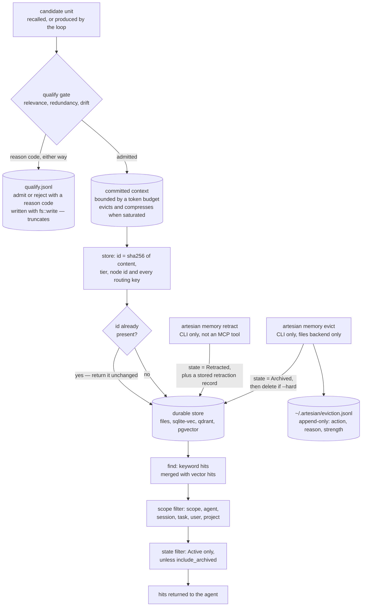

## 1. Executive Summary

Artesian is two systems in one workspace, and the interesting thing about it is
which half the engineering went into. `headgate` is a **context governor**: it
decides what enters one agent loop's bounded committed context, evicts under
saturation, compresses to fit, and records an admit-or-reject decision with a
reason code for every candidate. `aquifer` is the **durable memory** underneath
it: nineteen thousand lines of store, backends, decay, eviction, entity
extraction, relations and consolidation. Both are real. The marks in this report
all sit on the second, and that is worth saying plainly, because a reader who
follows the better prose will end up in the first.

Apache-2.0; fourteen crates and 67,852 lines of Rust; 213 commits between 13
June and 21 August 2026 from two authors; version 0.5.11; 523 test cases across
28 integration files and the inline modules. The screen found no auto-run
surface, no build-time execution path, nothing inside the seven-day cooldown,
one unpinned dependency surface in the Python bindings, and an `AGENTS.md` and
`CLAUDE.md` treated as data; nothing was installed, built or run.

**A memory's identity is a hash of its value and its address.**
`stable_memory_id` (`crates/aquifer/src/identity.rs:7-31`) is a SHA-256 over the
content, the tier, the node id, and each of the six routing keys that is set.
Two consequences follow, and they are the spine of this design. Storing the same
sentence twice is idempotent — the second `store` finds the existing record and
returns it without writing. And storing the same sentence under a different
project, user or session produces a *different* record, so deduplication can
never collapse two tenants' memories into one.

**The scope key is applied inside the index, not after it.** Every populated key
on a `MemoryQuery` becomes an equality requirement: a predicate in the files
backend (`files.rs:795-812`), a `must_eq` condition pushed into the vector
store's own filter in the other family (`vector_memory.rs:1973-2003`). The
producers are wired — the MCP server stamps `project` from its config, takes
`agent_id` and `user_id` from the request, and fills scope, user, session and
task from a `SessionKey` for session-scoped recall. This earns `scope_enforced`.

**A committed CI gate proves the isolation, and cannot pass vacuously.**
`run_files_leak_gate` (`gauge/src/retrieval_regression.rs:355-392`) stores three
sentinels — project `A`, `shared`, project `B` — queries as `A`, then queries
with no project at all. The pass condition is a five-clause conjunction:
`!project_leaks_b && project_has_a && project_has_shared && !default_has_private
&& default_bounded`. The two negative clauses are guarded by two positive
controls in the same result set, so an empty result fails rather than passes.
`run_regression_suite` hard-fails on it and CI runs the binary on every push.
This earns `negative_eval`, and it is the single best-built thing in the
repository.

**Retraction withholds without deleting, and only a person can do it.**
`MemoryState` is `Active`, `Archived` or `Retracted` on the record itself.
`retract` sets the state, stamps `retracted_at`, adds a `superseded_by` relation
and stores a separate retraction record; the original stays reachable through
`get_node` or a query with `include_archived`, and leaves default recall
entirely. Both backends filter on the state rather than ranking with it, which
is the line the `trust_state` mark draws — and `confidence` sits beside it as a
float used for ranking, on the other side of that line. Neither `retract` nor
`evict` is an MCP tool: the twenty-eight-tool surface an agent sees has no way
to remove anything.

**The eviction log is the audit record, and it is narrower than the README
implies.** `append_eviction_log` (`eviction.rs:243-262`) opens
`~/.artesian/eviction.jsonl` in append mode and writes one JSON object per
decision, carrying the action, a reason and the retrieval strength that produced
it. That earns `audit_log`. But the README's headline — *"every admit/reject
decision in an append-only audit log"* — points at `qualify.jsonl`, and that
file is written with `std::fs::write` (`headgate/src/bundle.rs:602-607`), which
truncates: it is a dump of an in-memory vector, append-only in RAM and rewritten
whole on disk. `lifecycle.jsonl` is written the same way (`:393-398`).

**And the audit only ever fires on one backend.** The `artesian memory evict`
handler constructs `aquifer::FilesBackend::new(&files_root)` unconditionally
(`artesian-cli/src/main.rs:3900-3913`) and applies its decisions by walking the
memory directory for `.md` files. On the sqlite-vec backend the README
recommends as the zero-infrastructure default, the eviction pass reads no
records, archives nothing, deletes nothing, and appends nothing. Decay is
computed at read time and still ranks, so retrieval degrades gracefully — but
the forgetting model the type documentation describes is unreachable wherever
most users will start.

## 2. Mental Model

A candidate arrives — recalled from the durable store, or produced by the loop —
and meets a gate before it is allowed to occupy context. The gate scores it on
relevance, checks it against what is already committed for redundancy, and can
consult an LLM judge or a council for drift; whatever it decides, it emits a
`QualifyDecision` carrying `admitted`, a score, a human reason and a
`ReasonCode` from a closed enum. Admitted units live in a bounded committed
state that evicts and compresses when the token budget saturates. That is the
governor, and it is about the present turn.

Underneath, and on a different clock, is the store. A memory is written once,
addressed by the hash of what it says and where it belongs, and then it is
subject to three forces. Recall filters it by its routing keys and its lifecycle
state. Decay dampens how strongly it ranks as it goes untouched. A person can
retract it — which is a claim about its truth — or evict it, which is a claim
about its usefulness. The two are deliberately different verbs with different
records: retraction leaves a superseding memory in the store, eviction leaves a
line in a log outside it.

The design's central bet is that these two clocks should not be the same
mechanism. What the agent may act on right now is a budget problem; what the
system believes is a lifecycle problem. Most of the systems that fail at this
conflate them, and Artesian's separation is the reason its scope filter and its
state filter are one line apart in the same predicate while its gate lives in a
different crate entirely.



## 3. Architecture

A Rust workspace on edition 2024, minimum toolchain 1.85, resolver 2. Fourteen
member crates, of which five carry the memory story: `aquifer` (19,750 lines) is
the store, its backends and its lifecycle; `headgate` (5,674) is the context
governor; `flume` (8,833) is the agent loop, its quota accounting and its
subagent receipts; `headrace` (1,335) is a small store-and-verify layer; and
`gauge` (2,928) is the evaluation harness. `artesian-mcp` (9,237) and
`artesian-cli` (12,279) are the two surfaces. `artesian` itself is a
ten-line name-reservation placeholder that says so in its own manifest.

Four backends implement one `MemoryBackend` trait
(`crates/aquifer/src/backend.rs`): Markdown files on disk, sqlite-vec, Qdrant,
and TencentDB, with pgvector beside them. The trait carries default
implementations for the optional half of the surface — `mark_used`, `retract`,
`neighbors`, `by_entity`, `projects` and `bulk_store` all default to a no-op or
an empty vector so a third-party backend stays source-compatible. That is a
deliberate and honest choice, and it is also where the coverage asymmetry in
this report comes from: a backend that does not override `retract` silently has
no retraction.

Operationally the floor is low. `artesian init --backend sqlite-vec` needs no
infrastructure; the files backend needs none either. Qdrant and pgvector are
opt-in network dependencies. There is no daemon in the memory path: decay is a
function of the record and the clock evaluated during ranking, not a sweep.
Consolidation, backfill, the `dream` pass and eviction are commands a person
runs. A Homebrew tap, a Dockerfile and a `deploy/` directory exist; Python
bindings ship under `bindings/python` with a `pyproject.toml` that declares
dependencies without a lockfile beside it — the one unpinned surface the screen
found.

## 4. Essential Implementation Paths

- **Write.** `MemoryBackend::store` → `memory.validate_confidence()` →
  `SessionLaneLock::acquire` on the collection and session →
  `stable_memory_id(&memory)` → an existence check that returns the stored
  record unchanged if the id is present → construct the `MemoryRecord` with
  `state: MemoryState::Active` → atomic file write → `append_update_log`
  (`crates/aquifer/src/files.rs:236-292`).
- **Read.** `MemoryBackend::find` → keyword hits and vector hits gathered
  separately → `merge(&[keyword_hits, vector_hits], options)` in the trait
  default (`backend.rs:60-72`) → tenancy predicate → state predicate → decay
  applied to the score → optional MMR diversification.
- **Scope filter.** `matches_tenancy` (`files.rs:795-812`) for the files family;
  `filter_from_query` (`vector_memory.rs:1973-2003`) for the vector family,
  which also excludes the compatibility sentinel point by `must_not`.
- **Retract.** `artesian-cli/src/main.rs:3319` → `backend.retract(node_id)` →
  set `Retracted`, stamp `retracted_at`, normalise a `superseded_by` relation
  onto a `retract:<node_id>` target, write the record, then `store` a second
  record whose content is *"Memory `<node_id>` was retracted."* with tags
  `retraction` and `supersede` and the retracted ids in metadata
  (`files.rs:294-336`).
- **Evict.** `artesian-cli/src/main.rs:3900-3980` → load every record including
  archived through a `FilesBackend` → `evict(&all_records, &policy)` computes a
  plan of `EvictionLogEntry` values → `apply_eviction_to_dir` walks the
  directory applying archives and deletes and counting its own successes →
  `append_eviction_log(&report.log_entries)` appends the *plan*.
- **Qualify.** `headgate::gate` scores a candidate and returns a
  `QualifyDecision`; `council` and `judge` add an LLM arm when configured;
  `bundle` collects the decisions and dumps them as `qualify.jsonl`.

## 5. Memory Data Model

`MemoryRecord` (`crates/aquifer/src/types.rs:123-163`) carries `id`, `node_id`,
`content`, `tags`, a `BTreeMap<String, String>` of metadata, a `tier`, a
`created_at`, and then the parts that make this report interesting.

**Six routing keys.** `scope` is a `MemoryScope` — `Shared`, `Agent`, `Session`
or `Task`. Beside it sit `agent_id`, `session_id`, `task_id`, `user_id` and
`project` as optional strings, plus `source` and an `author_id` documented as
*"Writer identity/provenance. Distinct from `scope`, `user_id`, and project
routing keys."*

**Four tiers.** `L0Raw`, `L1Atom`, `L2Scenario`, `L3Project` — a coarseness
ladder rather than a trust ladder. The decay pass treats `L0Raw` specially: a
record is a decay candidate only when its score is under half the admit
threshold *and* its tier is `L0Raw` (`dream.rs:369-370`), so refined material is
protected from automatic forgetting.

**One lifecycle state.** `MemoryState` is `Active` by serde default, or
`Archived` — *"excluded from default `find`, stored, drillable via
`get_node`"* — or `Retracted` — *"excluded from default `find`, stored for
audit/drill-down."* The type's own documentation frames the model: decay
*"dampens accessibility (retrieval strength) without silent deletion."*

**Three usage counters and one score.** `last_access`, `access_count` and
`useful_count` feed the decay function; `confidence` is an `Option<f32>`
validated to `0.0..=1.0` and used for ranking. Keeping the ranking number and
the filtering state as separate fields is what makes the `trust_state` mark
clean here rather than arguable.

**No validity time.** A search of the whole workspace for `valid_from`,
`valid_to`, `valid_time`, `as_of`, `observed_at` and `transaction_time` returns
nothing. `created_at` is a record time; there is no way to say a memory was true
between two dates, and no way to ask what the store believed at a past moment.
`bitemporal` is withheld on that.

## 6. Retrieval Mechanics

`find` takes a `MemoryQuery` — text, limit, tags, an optional node id, the six
routing keys, and `include_archived`. The trait's default implementation gathers
keyword hits and vector hits and merges them; backends that can do better
override it. Filtering happens before ranking and in two stages.

The tenancy stage is an AND over the populated keys. `matches_tenancy` requires
each of `scope`, `agent_id`, `session_id`, `task_id` and `user_id` to match when
the query sets it, and delegates the project to `matches_project_union`, which
admits the shared project alongside the named one — the behaviour the leak gate
pins. The vector family expresses the identical thing as filter conditions the
store evaluates itself, which matters for a hosted Qdrant: the excluded records
never leave the index.

The state stage is one predicate: `include_archived || record.state ==
MemoryState::Active` (`vector_memory.rs:2006-2012`). The flag's name says
*archived* and its behaviour covers retracted too — the backend contract test
calls it *"include archived/retracted"* in its own message. That is a naming
seam rather than a defect, but a caller reading the field name will not expect
retracted material back.

Ranking then applies decay. `retrieval_strength` (`decay.rs:68`) is an
exponential over days since last access with a thirty-day half-life —
`lambda = ln(2) / half_life` — boosted by access and usefulness counts. Its unit
tests are specific about the intent: `stale_record_is_dampened_but_not_zeroed`
and `stale_downranks_vs_fresh_same_base_score`. `mmr.rs` diversifies the result.
`neighbors` and `by_entity` walk the relation graph, but as separate trait
calls — the graph is not an arm of `find`, which is why this report's retrieval
stack is lexical and vector rather than lexical, vector and graph.

A semantic cache sits in front, and it is careful: `is_cacheable`
(`semantic_cache.rs:194-204`) returns false unless the node id and all six
routing keys are `None` and the tag list is empty, so a scoped query is never
answered from a cache a different tenant's question populated — the cache serves
only the unscoped case, where there is nothing to leak.

## 7. Write Mechanics

Writes are synchronous, local and cheap. `store` validates the confidence range,
acquires a per-session lane lock scoped to the collection, computes the identity
hash, and checks for an existing record. **If the id is already present, the
write returns the stored record and does nothing else** — including when that
record's state is `Retracted`. No LLM call is on this path; the README's *"zero
LLM writes"* claim holds, and consolidation, compression and the judge are
opt-in.

The lag between a write and its retrievability is a file write plus, on the
vector backends, an upsert — there is no queue and no batch window. `bulk_store`
exists for imports and the vector family overrides it to batch the upserts and
skip the per-chunk existence round-trip.

The files backend also appends to `log.md`: one Markdown bullet per store,
carrying the timestamp, the record id and the node id
(`files.rs:106-124`). It records stores only — not retractions, not deletions —
and it exists only in that backend. The same file doubles as the session anchor
store (`anchor.rs:46-52`), which is a small overload worth knowing about.

**The retraction record is a memory, not a log line.** `retract` stores a second
`MemoryRecord` whose content is a sentence about the first, tagged `retraction`
and `supersede`, with `retracted_node_id`, `retracted_record_id` and
`retracted_at` in its metadata and `artesian.retract` as its source. That record
is itself `Active` and itself retrievable — a design that keeps the history
inside the store rather than beside it, at the cost of putting a sentence about
bookkeeping into the same result set as substance.

## 8. Agent Integration

Twenty-eight MCP tools, of which nine touch memory: `memory.find`,
`memory.store`, `memory.answer`, `memory.context`, `memory.anchor.get`,
`memory.anchor.set`, `memory.session.checkpoint`, `memory.session.resume` and
`agents.list`. The other nineteen are orchestration and team coordination —
`orchestrate.delegate`, `orchestrate.handoff`, `team.task.claim`,
`team.task.complete` and the rest.

**Nothing on that surface removes anything.** A search of the MCP crate for
`retract` and `evict` finds only a metrics counter and two doc comments; both
destructive commands live on the CLI alone. Whether that is a safety property or
a gap depends on the deployment — an agent that cannot retract cannot correct
itself without a human, and an agent that cannot retract cannot poison the store
by retracting what it dislikes. The repository does not argue the point either
way, which is the one place a sentence of intent would help.

Session continuity is the feature the README leads with. A deterministic session
anchor plus targeted recall lets a loop resume after a context reset or a
disconnect; `memory.session.checkpoint` and `memory.session.resume` are the tool
pair, and `session_scoped_hits` is the read that fills them, with scope, user,
session and task all pinned from a `SessionKey` and the session's own bookkeeping
records filtered out by tag.

The CLI is the larger surface: `init`, `memory store|find|retract|evict`,
`tokens`, `perf`, `doctor`, `migrate`, `import`, plus team and orchestration
subcommands. A `team task complete --reviewer --approved` command exists and is
a review of a *task*, not of a memory — which is why `human_review` is withheld
below.

## 9. Reliability, Safety, and Trust

**Scope — awarded.** Six stored keys, the same six on the query, applied as an
AND before ranking by both backend families, with the vector family pushing them
into the store's own filter. The producers are wired on the read path, the keys
are part of the record's identity hash so a cross-tenant duplicate is
impossible, the project filter's shared-union behaviour is explicit, and the
semantic cache declines to serve any query that carries a key. A CI gate
proves it.

**Trust state — awarded, on a lifecycle rather than a ladder.** `MemoryState` is
a stored, discrete, three-value field; `Retracted` withholds a memory from being
treated as true; both backends *filter* on it rather than ranking with it; and
the ranking number lives in a separate `confidence` field. That is what the mark
asks for. The limit is worth naming precisely: there is no candidate tier.
Everything enters `Active`, so the state can only ever demote something already
trusted — it cannot gate admission, and nothing in the store distinguishes a
memory a person asserted from one an agent inferred except the `author_id`
string, which nothing filters on.

**Audit log — awarded, on eviction only.** `~/.artesian/eviction.jsonl` is
opened in append mode and takes one JSON object per archive or delete, carrying
the action, the reason and the retrieval strength that justified it. It is an
explicit, append-only, structured record of mutations, and it is exactly the
kind that is hard to reconstruct after the fact. Three limits: the log records the
plan `evict` computed, while `apply_eviction_to_dir` counts its applied archives
and deletes into separate variables, so a partial application leaves the log
claiming more than happened; and the file lives in the home directory rather
than in the memory collection, so a store that is copied, synced or committed to
a repository arrives without its own history. And it is the only log of its
kind: the `dream` consolidation pass, which never mutates its source, records
its promote, merge, drop and supersede decisions into `qualify.jsonl` — the file
whose writer truncates.

**Negative evaluation — awarded, and it is the most carefully built mechanism
in this repository.** The partition leak gate is described in section 10.

**Tombstone — withheld, and this is the closest miss.** Retraction produces a
durable record, and there is a real sense in which a retracted value cannot come
back: `store` computes the content-and-scope hash, finds the retracted record,
and returns it rather than writing a fresh `Active` one. But that is
content-addressing doing the work, not a rejection record being consulted. The
retraction memory — the one tagged `retraction` and `supersede` — is read by
nothing on any write path — `rg -n '"retraction"' crates` finds two writers,
one per backend, and no reader. Change one word of the content and the sentence
re-enters as `Active`; store the same sentence under a different project and it
enters as a different record entirely. And a hard delete of the retracted row
removes the block, because the block *was* the row.

**Human review — withheld.** The `--reviewer --approved` pair on
`team task complete` adjudicates a delegated task, not memory content. No
surface in this repository shows a person a memory and asks whether to keep it.

**Bitemporal — withheld.** No validity time exists; the search is in the
appendix.

**Two claims in the tree that the code does not support.** The type
documentation for `MemoryState` says *"Hard deletion is explicit and audited"* —
hard deletion is explicit, and the audit reaches it only through the eviction
path on the files backend. And the receipts and bundle modules say they mirror
`ocf/SPEC.md` and `ocf/schema/receipts.schema.json` *"exactly"*; neither file is
in this repository, and a search of the tree for `SPEC.md` and
`receipts.schema.json` returns nothing. The code names a sibling repository for
them, so this is a split-repo layout rather than a fabrication — but a schema
described as a checkable contract is not checkable from here.

## 10. Tests, Evals, and Benchmarks

523 test cases across 28 integration files and the inline `mod tests` modules.
The backend contract suite (`crates/aquifer/tests/memory_backend_contract.rs`)
is the load-bearing one: it runs the same assertions against the files backend
and the vector backend, which is how a trait with this many defaulted methods
stays honest.

**The partition leak gate.** `run_files_leak_gate` stores three sentinels whose
content is deliberately near-identical — *"partition sentinel belongs to project
A private memory"*, *"...to shared memory"*, *"...to project B private
memory"* — so a lexical retriever cannot separate them by accident. It queries
as project `A`, then with no project. `validate_partition_hits` passes only on
`!project_leaks_b && project_has_a && project_has_shared && !default_has_private
&& default_bounded`. The two present controls sit in the same conjunction as the
two absence checks, which is precisely the guard against a negative assertion
passing over an empty result. `run_regression_suite` returns
`RegressionError::Gate` when it fails, and `.github/workflows/ci.yml:30-31` runs
`gauge-ci-eval` on every push. The scope of it is one backend: the gate is named
`run_files_leak_gate` and constructs a `FilesBackend`, while the surrounding
regression suite runs both families.

**The retraction contract case** (`memory_backend_contract.rs:583-639`) asserts
the state changed, the supersede record carries `artesian.retract` as its source
and a `superseded_by` relation, the retracted node is absent from default
recall, and the same query with `include_archived` returns it. The absence
assertion there is weaker than the leak gate's: nothing in the test establishes
that the default result set was non-empty, so it would pass over a retriever
that returned nothing. The `include_archived` assertion proves the record
exists, which is not the same guarantee.

**Decay and eviction** (`decay_reconcile_eviction.rs`) drive the policy through
TTL, LRU, minimum strength and keep-cap arms and check the log entries name the
right records with the right action. The decay unit tests assert direction
rather than exact values — `stale_record_is_dampened_but_not_zeroed`,
`stale_downranks_vs_fresh_same_base_score` — which is the right shape for a
scoring function.

**Benchmarks and papers.** `gauge` ships an agentic eval harness the README
describes as *"multi-session tasks where success = correct next action given
accumulated memory, not just recall of a fact"*, and it is explicit that
**published scores are not committed**: *"Published scores vary by model and task
set — run `just bench-agentic` to measure on your own setup."* No score file is
in the tree; `artesian-bench` and `gauge` provide the harness. The project has
no paper of its own — a search of the README, `docs/` and `ARTESIAN.md` for
`arxiv`, `bibtex`, `@article`, `@misc`, `Citation`, `CITATION.cff` and `doi`
turns up citations *to* others and none of its own. Two are load-bearing and
worth following: [arXiv:2601.11653](https://arxiv.org/abs/2601.11653)
(Bousetouane, *AI Agents Need Memory Control Over More Context*), which the
README names as *"the model `headgate` implements"*, and
[arXiv:2602.16313](https://arxiv.org/abs/2602.16313) (MemoryArena), which it
credits for the *"recall ≠ use"* framing. Neither was re-derived here; the
claim checked is that the repository contains the harness and not the results.

## 11. For Your Own Build

### Steal

- **Hash the routing keys into the memory's identity.** Making `id` a digest of
  content *plus* project, user, session and scope means deduplication can never
  merge two tenants' memories, and idempotent re-import stays idempotent per
  tenant. It costs one line in the hasher and removes a whole class of leak.
- **Put the scope filter inside the store's filter, not after the search.**
  `filter_from_query` builds `must_eq` conditions the vector database evaluates
  itself, so excluded records never cross the wire. A post-filter over returned
  hits gives the same answers and a worse failure mode.
- **Guard a leak test with two present controls in the same assertion.** The
  five-clause conjunction in `validate_partition_hits` is the cheapest possible
  defence against the vacuous negative, and it turns an isolation claim into
  something CI can hold.
- **Separate the number that ranks from the state that filters.** `confidence`
  and `MemoryState` are different fields with different jobs, and the read path
  uses each for one thing. Systems that spend a trust state as a score multiplier
  end up with neither.
- **Log the reason and the strength, not just the action.** An eviction line
  carrying `retrieval_strength` at decision time lets someone later ask whether
  the policy was too aggressive, which an action-only log cannot answer.

### Avoid

- **A destructive command that hardcodes one backend.** `artesian memory evict`
  builds a `FilesBackend` regardless of configuration, so on the recommended
  backend the entire decay-and-forget lifecycle is a no-op that reports success.
  A command whose behaviour silently depends on a setting it ignores is worse
  than one that refuses to run.
- **Calling a file append-only when the writer truncates it.**
  `qualify.jsonl` and `lifecycle.jsonl` are `std::fs::write` of a serialized
  vector. The in-memory list is append-only; the artifact is a snapshot. If a
  reader is expected to tail it, the difference is the whole feature.
- **Logging the plan and applying it separately.** `append_eviction_log` takes
  the decisions `evict` computed, while `apply_eviction_to_dir` counts what it
  managed to change. The two numbers are printed side by side and the log keeps
  only the optimistic one.
- **Trait defaults that turn a missing capability into a silent no-op.**
  `retract` defaulting to `Ok(None)` keeps third-party backends compiling and
  means a backend without retraction reports nothing rather than failing.

### Fit

Artesian suits a team running one or a few agent loops on a workstation or a
single node, that has felt the specific pain of a context reset losing the
thread, and that wants the recovery to be deterministic rather than a
re-embedding of everything. The Rust build and the single-binary install make
the operational cost genuinely low, and the scope model is strong enough to put
several projects in one store without worrying. It is a poor fit for a
multi-tenant service today — not because the isolation is weak, which it is not,
but because the destructive half of the lifecycle only works on the files
backend and the audit trail lives in one user's home directory. It is also a
poor fit for anyone who needs to reason about *when* a fact was true, which the
data model has no way to express. A reader evaluating it should install the
files backend first, run an eviction, and read `eviction.jsonl` — that is the
fastest way to see both what this design gets right and where it stops.

## 12. Open Questions

- Should `evict` respect the configured backend? The plan step is
  backend-agnostic — `evict(&records, &policy)` takes a slice — so the gap is
  entirely in the loading and the applying, which is a smaller change than it
  looks.
- Should the retraction record be consulted on write? The store already computes
  a content hash; matching against retracted content under *other* scope keys,
  or on a normalized form, would turn the current incidental block into a
  tombstone.
- Is the absent MCP retraction tool a policy or an omission? An agent can write
  and read but not correct, and nothing in the tree states which of those was
  intended.
- Where does `author_id` get used? It is documented as writer provenance and
  distinct from the routing keys, it is hashed into the identity, and no read
  path filters or ranks on it.

## Appendix: File Index

| Path | Lines | What it holds |
| --- | --- | --- |
| `crates/aquifer/` | 19,750 | The durable store: types, backends, decay, eviction, entities, relations, consolidation |
| `crates/aquifer/src/types.rs` | — | `MemoryRecord` (123-163), `MemoryState` (17-35), `MemoryScope` (100-119), `MemoryTier` (93-99), `MemoryQuery` (321-341) |
| `crates/aquifer/src/identity.rs` | 31 | `stable_memory_id` — the SHA-256 over content, tier, node id and every routing key |
| `crates/aquifer/src/files.rs` | — | The Markdown backend: `store` (236-292), `retract` (294-336), `append_update_log` (106-124), `matches_tenancy` (795-812) |
| `crates/aquifer/src/vector_memory.rs` | — | The vector backend: `filter_from_query` (1973-2003), the state predicate (2006-2012), retraction (1543) |
| `crates/aquifer/src/eviction.rs` | — | `EvictionLogEntry` (33-41), `EvictionAction` (44-51), `append_eviction_log` (243-262), the policy tests (264-330) |
| `crates/aquifer/src/decay.rs` | — | `DecayConfig` with a 30-day half-life, `retrieval_strength` (68) |
| `crates/aquifer/src/semantic_cache.rs` | — | The scoped-query refusal (195-203) |
| `crates/aquifer/src/backend.rs` | — | The `MemoryBackend` trait, its merged default `find` (60-72), the defaulted optional methods (76-115) |
| `crates/headgate/` | 5,674 | The context governor: `gate`, `council`, `judge`, `ccs`, `controller`, `compressor`, `bundle` |
| `crates/headgate/src/gate.rs` | — | `QualifyDecision` and the `ReasonCode` enum (18-36) |
| `crates/headgate/src/bundle.rs` | — | `write_dir` (383-401), `write_ocf_dir` (588-612), `QualifyRecord` (562-580) |
| `crates/flume/src/receipts.rs` | — | `SpawnReceipt`, `ReturnReceipt`, `StopReason`, the fail-closed toggle |
| `crates/gauge/src/retrieval_regression.rs` | — | `run_regression_suite` (131-152), `run_files_leak_gate` (355-392), `validate_partition_hits` (394-431) |
| `crates/artesian-mcp/src/lib.rs` | 9,237 | Twenty-eight tools; `session_scoped_hits` (1398-1418); the project stamp (4135) |
| `crates/artesian-cli/src/main.rs` | 12,279 | `retract` (3319), the eviction handler (3900-3980), the team review command (2455-2475) |
| `crates/aquifer/tests/`, `crates/*/tests/` | — | 28 files; 523 cases with the inline modules |

Searches behind the absence claims above, run from the repository root:

```sh
rg -n 'valid_from|valid_to|valid_time|as_of|observed_at|transaction_time' crates   # none: no validity time, so no bitemporal
rg -n 'retract|evict' crates/artesian-mcp/src/lib.rs                    # a metrics counter and two doc comments: neither is a tool
rg -n 'append_update_log|log\.md'  crates                               # the store log exists only in the files backend
rg -n 'MemoryState::Retracted' crates                                   # one writer per backend, one CLI caller, two test assertions
rg -n '"retraction"' crates                                             # two writers, one per backend; no reader anywhere
fd -g 'SPEC.md' -g 'receipts.schema.json' .                             # none: the OCF schema the code mirrors is not in this tree
rg -n 'arxiv|bibtex|@article|@misc|Citation|CITATION.cff|doi' README.md docs ARTESIAN.md  # citations to others; no paper of its own
rg -n 'FilesBackend::new' crates/artesian-cli/src/main.rs                # the eviction handler constructs one unconditionally
```

## History

**2026-09-10** — [`14e4f2d9494d396695f79350b9e42bacd82d953d`](https://github.com/aquifer-labs/artesian/commit/14e4f2d9494d396695f79350b9e42bacd82d953d) — first reading, at the head of `main`, the last commit of 21 August 2026. Screened before reading: no auto-run surface, no build-time execution path, nothing inside the seven-day cooldown, one unpinned dependency surface in the Python bindings, and `AGENTS.md` and `CLAUDE.md` treated as data; nothing was installed, built or run, and the read was made from a full clone. Four marks. The reading covered the durable store — records, identity, backends, retrieval filters, decay, retraction and eviction — and treated the context governor, the orchestration tools and the team runtime as context rather than subject, which is the boundary the marks are checked against: every one of them is earned by a mechanism in `aquifer` or by a gate over it, not by the committed-context machinery in `headgate`.
