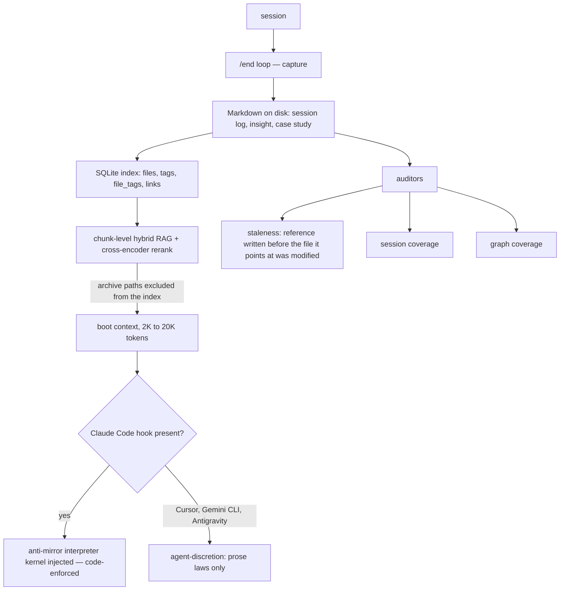

## 1. Executive Summary

Project Athena is a local-first personal knowledge and memory layer — plain
Markdown on disk, indexed into SQLite, pointed at any model. MIT, roughly
60,000 lines of Python. The README carries a stars badge and a Reddit-views
badge; this atlas has a [standing rule](../../methodology/atlas-rubric/) against treating
adoption as evidence, and neither influenced anything below.

**What earns the report is the epistemic apparatus, which is the most developed
in this corpus.**

The README contains a section titled *"Validation Status — What's Proven vs.
What's Proposed"*, opening: "Most AI-agent READMEs state every claim in the same
confident voice. This one doesn't." It then grades six layers:

| Layer | Status |
| --- | --- |
| Storage & retrieval | ✅ Shipped & battle-tested |
| Portability & ownership | ✅ Shipped — "structural — inspect the repo; there's nothing to take on faith" |
| Compounding personalization | 🟡 "Credible architecture, N=1 evidence" |
| Governed autonomy | 🟡 "Designed & used, not adversarially tested" |
| "The right answer for *you*" | 🔴 "Partially unfalsifiable — by nature" |
| Independent vantage under personalization | 🟡 "Real tension, partial + conditional mitigation" |

The third row's own wording is the model: "The honest claim is *'this worked for
one person who built it around his own thinking'* — you are the replication
experiment."

**The sixth row is the one this atlas should carry forward.** It states that the
mechanism the product is built on is the mechanism most likely to make it
useless, with citations: user-memory profiles raise agreement sycophancy by
**+45%** on Gemini 2.5 Pro (Jain et al. 2025) atop a ~58% baseline
(SycEval 2025) — and then, "Athena is *built on* that mechanism." The stated
defence is two-part, and both parts come with limits: a code-enforced
meta-awareness gate that is "**Claude-Code-only**", and an advisory framing
"enforced by disposition + the gate's nudge, not proven under adversarial
pressure".

Naming the specific literature that predicts your product's failure mode, in
your own README, is not something any other system in this atlas does.

**And the reason for publishing it is stated as a design principle.** The
project's `_shared.md` defines an **Epistemic Status Convention
(anti-self-mythologizing)** with three labels — `code-enforced`,
`agent-discretion`, `aspirational` — and names the failure it prevents: "a
protocol describes machinery in the present tense ('the system continuously
monitors X and emits Y') that **no code implements**. An agent reads it at boot,
believes the mechanism is running, and either (a) skips the manual step it
should have done, or (b) reports 'compliance' with a process that never
executed."

That is, almost word for word, the defect this atlas has found in five systems
in this pass alone. Athena has written the rule against it.

**The finding is that the rule is barely applied.** The convention permits a
frontmatter `epistemic_status:` key or an inline note. The frontmatter key
appears **zero** times in the repository — the single grep match is the sentence
defining it. The three labels appear inline across about eight files,
concentrated in the README, the changelog and the convention document itself,
against **569 Markdown files**, 408 of them under `examples/`.

The convention's own rule is "Tag on touch; tag any mechanism you actually rely
on for a decision." At this commit the tagging is essentially confined to the
documents that argue for tagging.

## 2. Mental Model

The store is a directory of Markdown that the user owns, version-controls and
reads. `src/athena/core/schema.sql` is four tables — `files`, `tags`,
`file_tags`, `links` — which is the whole index: the filesystem is the memory
and SQLite is a rebuildable projection over it, the same position
[CortexGraph](../cortexgraph/)'s spec argues for.

Sessions produce logs; generators produce insights and case studies; protocols
and workflows are themselves Markdown the agent reads.

The branch at the bottom is the project's own scope caveat, drawn where it puts
it: "Portability of *memory* is structural and travels everywhere; portability
of *governance* does not yet."

## 3. Architecture

Python over a Markdown corpus with a SQLite index, an MCP server, a CLI, and an
optional Supabase tier. `src/athena/core/` holds the governance and operational
modules — `governance.py`, `gate.py`, `gate_meta.py`, `permissions.py`,
`ruin_check.py`, `ruin_structured.py`, `sandbox.py`, `security.py`,
`flight_recorder.py`, `pulse_check.py`, `system_pulse.py`,
`diagnostic_relay.py`, `skill_telemetry.py`.

`gate_meta.py` is the anti-sycophancy classifier and it is a *regex* engine, not
a model call — a list of inbound patterns (`why (did|would|does)…`, "reading
between the lines", "am i missing something", "left (me )?on read", "ghosted")
that classify a prompt as one where the user is asking the model to interpret
someone else's behaviour. That is precisely the class of question where a
personalized model will confirm the user's reading, and catching it
deterministically rather than with a model is the right instinct.

## 4. Essential Implementation Paths

**Capture** — the `/end` workflow, with generators under `src/athena/generators/`.

**Index** — `core/schema.sql` and the memory package, chunked and embedded.

**Retrieve** — hybrid RAG with a cross-encoder reranker, archive paths excluded.

**Gate** — `core/gate_meta.py` classifies, `core/gate.py` and the committed
`.claude/settings.json` hook inject the interpreter kernel.

**Audit** — `src/athena/auditors/`: `audit_staleness.py` scans logs and memory
files "for references to other Athena files … and flags any where the referenced
file has been modified AFTER the reference was written", plus
`audit_session_coverage.py`, `audit_graph_coverage.py` and `audit_runner.py`.

## 5. Memory Data Model

Four index tables over Markdown. There is no status column, no confidence, no
supersession pointer and no validity interval — the epistemic machinery lives in
prose conventions and in the auditors, not in the schema.

That is a coherent position for a store whose unit is a document a person edits,
and it means every property this atlas measures has to be looked for in the
tooling rather than the data. The staleness auditor is the closest thing to a
freshness mechanism, and it is a good one: it does not ask whether a *memory* is
old, it asks whether a *reference* is older than the thing it references —
catching the case where a session log cites a protocol that has since changed
underneath it. That is [Kage](../kage/)'s idea applied to prose instead of code,
using git timestamps instead of hashes.

## 6. Retrieval Mechanics

Chunk-level hybrid RAG with a cross-encoder reranker, and the reason the
reranker defaults on is recorded as an incident: the validation table credits
"a silent retrieval regression *our own monitoring missed*, which is why the
reranker is now on by default and archive paths are excluded from the index."

A project that names a regression its own monitoring failed to catch, and cites
it as the evidence for a default, is doing the thing the atlas asks for. It is
also, precisely, an admission that the monitoring was insufficient — which the
table does not soften.

Boot cost is tiered (~2K for chat, ~10K for `/start`, ~20K for `/ultrastart`)
with the claim that "80–98% of your context window stays free, even after 10,000
sessions".

There is no scope key. The store is one person's, and the README says so.

## 7. Write Mechanics

Capture is a session-end workflow; correction is curation by the user, with the
README's own caveat attached: "compounding needs curation. Keep the `/end` loop
running; unpruned memory decays like any archive."

Nothing is keyed on a rejected value, nothing records a verdict, and a wrong
memory is corrected by editing the Markdown. The stated risk is named in the
same section: "a *stale or wrong* memory retrieved with confidence is worse than
no memory, which is exactly why the verification machinery above exists."

## 8. Agent Integration

An MCP server, a CLI, workflows and skills as Markdown, and a committed
`.claude/settings.json` hook. Model-portable by design; **governance-portable it
is not**, and the scope caveat says so — on Cursor, Gemini CLI and Antigravity
the gate degrades "from a code-enforced injection to **agent-discretion** — the
model's own disposition plus the prose laws."

## 9. Reliability, Safety, and Trust

**Audit log — awarded, for the auditors and the flight recorder.**
`audit_staleness`, `audit_session_coverage`, `audit_graph_coverage` and
`audit_runner` produce durable, re-runnable records of the store's condition, and
`flight_recorder.py` records operation. It is a health-and-coverage audit rather
than a mutation log — an edit to a Markdown file is caught by git, not by
Athena — and it is more instrumentation than most file-backed stores here carry.

**Trust state — withheld, and the near-miss is the whole report.** The
three-label convention *is* an epistemic vocabulary, it is well-argued, and it is
applied to documents rather than to memories, in about eight of 569 files, with
the frontmatter form unused. A convention is not a field.

**Scope, tombstone, bitemporal, human review, negative eval — no.**

**The most valuable thing here for another builder is the sycophancy row.** It
should be read alongside [NornicDB](../nornicdb/)'s Kalman filter, which attacks
the same problem numerically, and [Recall](../recall-substrate/)'s Brier
calibration, which attacks it by scoring the writer. Athena attacks it with a
regex classifier and a prompt injection, and — uniquely — states in its own
README that its chosen defence is unproven under adversarial pressure.

## 10. Tests, Evals, and Benchmarks

**No paper**, and a `docs/REFERENCES.md` claiming full APA citations with "every
DOI Crossref-verified" for Kelly sizing, ergodicity economics, prospect theory,
IFS and the memory-architecture literature (MemGPT, Generative Agents, CoALA).
Two sycophancy papers are cited inline with arXiv links.

There is a `tests/` directory including `test_eval_harness.py`. **No benchmark
result is committed**, and the validation table is explicit that this is the
state: "what doesn't exist yet is *published, systematized* validation", with a
commitment that "if a claim above ever moves a tier, the change lands in the
changelog, not silently in the marketing copy."

The N=1 admission is worth repeating as the finding rather than as a criticism:
1,900+ sessions of longitudinal use by the author, no multi-user study, no
controlled benchmark, and the README says so in the row where a different
project would have written "battle-tested".

**I ran nothing.**

## 11. For Your Own Build

### Steal

- **Grade your claims by evidence level, in the README, in a table.** Shipped,
  credible-architecture-N=1, designed-but-not-adversarially-tested, partially
  unfalsifiable. It costs one section and it is the single highest-integrity
  artifact in this atlas.
- **Name the literature that predicts your failure mode.** Citing the paper that
  says user-memory profiles raise agreement sycophancy by 45%, in the README of a
  user-memory product, is how you make a defence claim assessable.
- **Write the anti-self-mythologizing rule down.** `code-enforced` /
  `agent-discretion` / `aspirational`, with the failure spelled out — an agent
  reads a present-tense description at boot and reports compliance with a process
  that never ran. Then apply it more widely than this project has.
- **Audit for stale *references*, not just stale memories.** A note that cites a
  protocol modified after the note was written is wrong in a way no
  content-freshness check catches, and git timestamps make it a cheap scan.
- **Catch the interpretive question with a regex, not a model.** The prompts
  where personalization does most damage — "why did they…", "reading between the
  lines", "left me on read" — are lexically recognisable, and a deterministic
  classifier cannot itself be flattered.
- **Cite the incident that justifies a default.** "The reranker is now on by
  default *because* of a silent retrieval regression our own monitoring missed"
  tells a reader more than any benchmark row.
- **State where governance stops travelling.** Memory portability and governance
  portability are different properties, and conflating them is how a safety claim
  quietly becomes false on a different IDE.

### Avoid

- **Do not write a labelling convention and leave it unapplied.** The
  `epistemic_status:` frontmatter key appears nowhere; the labels appear inline
  in a handful of files out of 569. The rule says "tag on touch", and at this
  commit the tagged set is roughly the documents about tagging.
- **Do not rely on a single-IDE hook for the one code-enforced safeguard.** The
  project says this; a reader on Cursor should read the governance claims as
  prose.
- **Do not read N=1 longitudinal use as validation**, and note that the project
  does not ask you to.

### Fit

This suits one person who wants their own context to outlive any model, is
willing to curate Markdown, and specifically wants an assistant that will
disagree with them. It is not multi-user, not scoped and not benchmarked, and it
says all three.

Read the validation table whatever you are building. It is the clearest
demonstration in this atlas that the honest thing and the persuasive thing are
usually the same paragraph.

## 12. Open Questions

- **Has the convention been applied since?** It is dated and its own rule is
  "tag on touch", so adoption should rise with edits.
- **What does the meta-awareness gate do when it fires?** `gate_meta.classify`
  and a `REMINDER_TEMPLATE` are exposed "for SDK-wide use"; the injected kernel's
  content and whether it measurably changes the answer were not traced.
- **Does the staleness auditor gate anything?** It flags; whether a flagged
  reference is excluded from boot context or merely reported was not established.
- **Is there a cross-IDE gate yet?** Named as roadmap, alongside "code that
  actually checks 'am I ranking by the user's weights or my own?'".

## Appendix: File Index

**The validation table and the convention** — `README.md` §Validation Status,
`examples/workflows/_shared.md:67-86` (the Epistemic Status Convention, the
failure it prevents, the three labels and the tag-on-touch rule)

**Anti-sycophancy** — `src/athena/core/gate_meta.py` (the `T1_INBOUND` pattern
list), `src/athena/core/gate.py`, the committed root `.claude/settings.json`

**Auditors** — `src/athena/auditors/audit_staleness.py` (the reference-versus-file
comparison `:4-9`), `audit_session_coverage.py`, `audit_graph_coverage.py`,
`audit_runner.py`

**Governance** — `src/athena/core/governance.py`, `permissions.py`,
`ruin_check.py`, `ruin_structured.py`, `sandbox.py`, `security.py`

**Operations** — `src/athena/core/flight_recorder.py`, `pulse_check.py`,
`system_pulse.py`, `diagnostic_relay.py`, `skill_telemetry.py`,
`session_efficiency.py`

**Index** — `src/athena/core/schema.sql` (`files`, `tags`, `file_tags`,
`links`), `src/athena/memory/`

**Integration** — `src/athena/mcp_server.py`, `src/athena/cli/`,
`examples/workflows/`, `examples/skills/`, `examples/hooks/`, `supabase/`

**References** — `docs/REFERENCES.md`, `SAFETY.md`, `docs/CHANGELOG.md`

## History

**2026-08-09** — [`2e4898e3bd28a79a58dc1b17437ace050bea2479`](https://github.com/winstonkoh87/Athena-Public/commit/2e4898e3bd28a79a58dc1b17437ace050bea2479) — first reading. Screened before reading; the tree was read, never installed, and no test was run.
