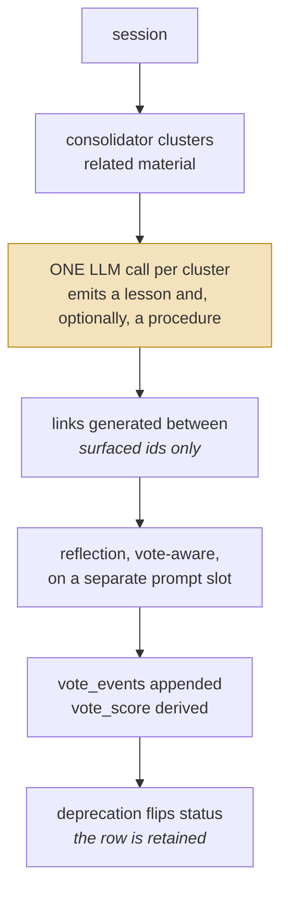
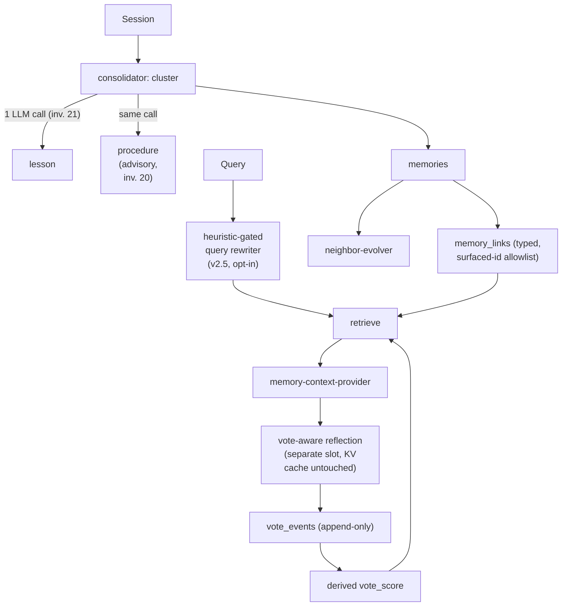

## 1. Executive Summary

Atomic Agent is an MIT-licensed agent whose `src/memory/` is about **14,000 lines** across `consolidator/`, `embeddings/`, `evolution/`, `lessons/`, `links/`, `procedures/`, `reflection/`, `retrieve/`, and `voting/`, with a test file beside nearly every module.

The code is substantial, but what makes it worth studying is that **the memory system is built like a specification**. Three artifacts sit alongside it:

- `MEMORY_FABRIC_V2.md` — the design plan, including §14 acceptance criteria.
- `MEMORY_FABRIC_V2.5.md` — an **implementation ledger** recording which phases actually landed, with all three v2.5 features shipped **opt-in** (`default: false` in config v18+).
- `eval-memory/PLAN.md` — an evaluation campaign whose stated purpose is *"is memory actually useful"*, with numbered integration experiments E9–E12 behind `npm run eval:memory:v25`.

And the design document is not decorative. The SQL schema comments cite **numbered cross-phase invariants** back into it — "cross-phase invariant 7 in `MEMORY_FABRIC_V2.md` §13.7", invariant 20, invariant 21 — so a reader can trace a column to the rule that governs it. Across the atlas, nothing else has invariants as first-class, referenced artifacts.

Three mechanisms stand out.

**Votes are append-only events with derived scores.** `vote_events(id, kind, target_id, direction, session_id, turn_index, created_at)` is the log; `vote_score` columns on `memories`, `lessons`, and `profile_facts` are derived and indexed. This is precisely what this atlas recommends — "keep retrieval events append-only; derive counters from events" — and the direct opposite of [Holographic](../holographic/), where a rating mutates the score that gates retrieval and enough ratings silently delete a fact.

**Procedures are advisory and never executed.** Invariant 20 states that the runtime never auto-executes a procedure; they are "advisory text the agent reads and either follows or consciously deviates from." [Voyager](../voyager/) stores executable skills and gains an empirical verification gate; Atomic Agent stores procedural knowledge and deliberately gives up execution to avoid the trust boundary that comes with it. Both positions are defensible, and having both in the atlas makes the [skills as procedural memory](../../patterns/skills-as-procedural-memory/) tradeoff concrete.

**The vote prompt is isolated from the main KV cache.** The schema comment records that the vote micro-prompt "lives entirely on the reflection slot — the main agent slot's KV cache is untouched." That is the same prompt-caching concern driving [Hermes Agent](../hermes-agent/)'s frozen snapshot, solved by slot isolation instead.

The reservation is scale of surface: v2.5 adds a query rewriter, reflection segmentation, and typed NOTE extraction, all optional, on top of an already large fabric — and no scored campaign results were found committed, so the evaluation machinery's verdict is unknown.

**And two of the three timestamp columns on a profile fact are the same number.** `valid_from`, `created_at` and `updated_at` are written with one `now` on every insert, which the code documents rather than hides; the supersession chain is genuine valid-time history, and there is no second axis and no read that takes a time. See section 2.

## 2. Mental Model

Four domain objects, connected by typed links:

```sql
memories        -- extracted memory rows, with vote_score
lessons         -- distilled guidance; status 'active' | 'deprecated'
profile_facts   -- user facts as a supersession chain
procedures      -- read-only how-to templates, advisory only

memory_links (from_id, to_id, kind)   -- PRIMARY KEY (from_id, to_id, kind)
                                      -- multiple link kinds between one pair
vote_events (id, kind, target_id, direction, session_id, turn_index, created_at)
```

Profile facts are versioned through an explicit supersession chain:

```sql
profile_facts(
  key, value, pinned, keywords,
  valid_from      INTEGER NOT NULL,   -- when the row started being authoritative
  created_at      INTEGER NOT NULL,   -- audit timestamp
  superseded_by, supersedes,
  ...
)
```

The comments document the legacy migration explicitly — `valid_from = legacy.updated_at`, `created_at = legacy.updated_at` — so the point at which versioning was retrofitted is recoverable rather than silently assumed.

**Three timestamps, one clock.** `valid_from`, `created_at` and `updated_at` are written with the same `now` on every insert, and the code says so rather than leaving it to be discovered: `profile-store.ts:32-38` documents `updatedAt` as *"identical to `validFrom` because every write creates a fresh row — the column is kept so phase 7a can stamp `applyVote` timestamps without another migration"*, and `memory-schema.ts:196-201` says the same of `created_at`, that it is *"copied from `valid_from` on a fresh row"* and exists to give a later phase somewhere to hang vote scores. The columns are a migration-free landing site, not a second axis.

**`bitemporal` is withheld.** The chain records every version of a key and the order they took effect, which is valid-time history and is more than most stores here keep. What it cannot express is a fact whose validity began before the system learned it, and no read anywhere takes a time argument — `get`, `getById`, `list` and `history` are the whole surface, and the last returns a chain rather than a state at a moment:

```sh
grep -rn "asOf\|as_of\|AsOf\|pointInTime\|point_in_time\|validAt\|valid_at" --include="*.ts" src/
```

Nothing at the pinned commit, and nothing at `d69332c589733e38ae7393dd81fcbc5a375d02fb` either — the same doc comment stands in `profile-store.ts` there, so this is a correction to what this atlas published rather than a change upstream made. *"Where did I live last March"* and *"what did this store believe last March"* are still the same question here.

### The scope key is real and the switch is in the wrong hand

`memories`, `lessons` and `procedures` all carry a `working_dir` column, indexed, and the schema comments call it a *"per-project scoping mirror"*. It reaches the read path: `MemoryStore.recall` and `MemoryStore.list` both push `working_dir = ?` into the WHERE clause, and both fail closed inside that branch — a `scope: "project"` call with no directory returns `[]` rather than everything.

But `const scope = opts.scope ?? "all"`, so the filter is off unless a caller turns it on, and the docstring says so: *"the caller is responsible for passing the current working directory when they want that filter."* Two callers matter, and they resolve it differently.

The automatic injection path, `memory-context-provider.ts:273` and `:366`, spreads `{ scope: "project", workingDir: args.workingDir }` in whenever a working directory is known and nothing when it is not — scoped by default, unscoped when the host cannot say where it is.

The tool path does not. `src/tools/memory/notes-recall.ts:48` reads `const scope = rawArgs.scope === "project" ? "project" : "all"` — **the model decides whether the project boundary applies**, and anything other than the literal `"project"` means no boundary. The one thing the model cannot do is aim it: `workingDir` comes from `ctx.workingDir`, the host's value, so the boundary can be switched off but not redirected.

**`scope_enforced` is withheld.** The mark certifies that a stored key reaches the query; here it reaches the query on request, and the request most likely to matter is made by the model, whose default is the whole corpus. The distinction is not academic — [Project N.E.K.O.](../neko/) holds a committed test named `test_model_supplied_subjects_cannot_influence_scope` for exactly this surface, and derives the subject list from the host precisely so the model has no vote.

Searches behind that paragraph:

```sh
grep -rn "working_dir" --include="*.ts" src/memory/ | grep -v "\.test\.ts"
grep -rn 'scope: "project"' --include="*.ts" src/ | grep -v "\.test\.ts"
```

Lifecycle:



The highlighted step is invariant 21, cited by number in the source: **at most one
model call per cluster even when it produces both a lesson and a procedure.** The
cost bound is written down as a rule rather than left to whoever edits the
consolidator next.

## 3. Architecture

`src/memory/` (~14,000 lines):

- `memory-schema.ts` — versioned migrations with commentary and invariant references.
- `memory-store.ts`, `profile-store.ts` — storage, with `profile-store-bitemporal.test.ts`.
- `consolidator/` — clustering and distillation.
- `voting/` — `vote-grammar.ts`, `vote-prompt.ts`, `vote-parser.ts`, `vote-response-format.ts`, `vote-runner.ts`, `vote-store.ts`, `vote-aware-reflection.ts`.
- `evolution/neighbor-evolver.ts` — neighbour metadata evolution.
- `lessons/`, `procedures/`, `links/`, `reflection/`, `retrieve/`, `embeddings/`.
- `notes-renderer.ts`, `profile-renderer.ts`, `memory-context-provider.ts`.



## 4. Essential Implementation Paths

### Invariants as referenced artifacts

The schema does not merely implement rules; it cites them. Reading `memory-schema.ts` you encounter "cross-phase invariant 7 in `MEMORY_FABRIC_V2.md` §13.7", invariant 20 on procedure execution, and invariant 21 on LLM call budget per cluster.

This matters more than it sounds. Most systems in this atlas encode their rules implicitly in code, so a later contributor cannot tell an intentional constraint from an accident. Numbered invariants with stable references make the difference visible, and make a violation reviewable as a violation rather than as a diff.

### Append-only votes

`vote_events` records direction, target kind and id, session, turn index, and timestamp. `vote_score` is a derived, indexed column on each votable kind. Because the events are retained, a scoring change can be recomputed from history, a suspicious pattern can be audited, and no single vote is destructive.

Set against the atlas's other feedback designs, this is the disciplined end of the range. Holographic mutates trust directly and deletes by threshold. [RainBox](../rainbox/) keeps feedback as a review signal behind a human gate. [MetaClaw](../metaclaw/) lets telemetry tune retrieval policy through a promotion gate. Atomic Agent keeps the raw signal and derives from it — which preserves the option to do any of the others later.

The voting subsystem is also unusually complete for what could have been a thumbs-up counter: a grammar, a response format, a parser with tests, a runner, a store, and a reflection path that consumes votes.

### Procedures without execution

Invariant 20 is a deliberate limit: procedures are "advisory text the agent reads and either follows or consciously deviates from," never auto-executed. Invariant 21 constrains their cost — a lesson and its procedure come from the *same* consolidator cluster in a single LLM call.

The pairing is neat. A procedure derived alongside its parent lesson shares that lesson's evidence, so the how-to and the why-it-matters cannot drift apart, and the budget rule stops the procedures layer from doubling distillation cost.

### Surfaced-id allowlist in neighbour evolution

`neighbor-evolver.ts` operates against "the surfaced-id allowlist used by the link-generator", with `skipped_invalid` as an explicit outcome and metrics recorded per outcome.

This is precisely the defence [A-MEM](../a-mem/) lacks. A-MEM's evolution returns vector rank positions and later applies them to insertion order, so an LLM can rewrite a different neighbour than the one it saw — the atlas's "ranking positions used as identities" antipattern. Atomic Agent constrains evolution to ids that were actually surfaced and counts the rejections.

### Deprecation retains the row

Lessons carry `status: 'active' | 'deprecated'`, and the comment is explicit that "deprecated lessons stay". Combined with `supersedes`/`superseded_by` on profile facts, correction is a state transition with history rather than a delete.

What is still missing is a value-level tombstone: a deprecated lesson is a deprecated row, and nothing found here prevents an equivalent lesson being distilled again from the same cluster.

### Default-off features

All three v2.5 features ship with `default: false` in config v18+. Shipping behind a flag while the evaluation campaign runs is the ordinary discipline of software that intends to know whether it works — and it is close to unique in this atlas, where new memory behaviour typically arrives on by default.

## 5. Memory Data Model

SQLite with numbered migrations (V9 introduces voting, V10 the procedures layer), each documented in place. Typed links with a composite primary key allow several relationship kinds between the same pair, which is more expressive than the single-edge graphs elsewhere here.

Gaps:

- **Scoping was not traced.** No user, project, or tenant key surfaced in the schema sections read; for a single-user agent that may be by design.
- **No rejected-value tombstone**, so deprecation does not prevent re-derivation.
- **`vote_score` semantics are undocumented** in what was read — whether it can influence anything other than ranking is the line this atlas cares about, and it was not established.

## 6. Retrieval Mechanics

`retrieve/` plus embeddings and links, with v2.5 adding a **heuristic-gated query rewriter** — gated so rewriting only runs when a heuristic says it is worth the call, rather than on every query. Links participate in retrieval, and votes inform ranking through `vote_score`.

## 7. Write Mechanics

The consolidator clusters material and distils it; the one-call-per-cluster invariant bounds cost. Reflection is vote-aware and runs on its own prompt slot. Neighbour evolution adjusts metadata within the surfaced-id allowlist.

## 8. Agent Integration

`memory-context-provider.ts` supplies memory to the agent, with `notes-renderer.ts` and `profile-renderer.ts` formatting the two durable surfaces. The separate reflection slot is the notable structural choice: the expensive, prompt-heavy memory work happens off the main conversational slot, protecting its cache.

## 9. Reliability, Safety, and Trust

Strengths:

- **Numbered invariants cited from code** into a design document.
- **Append-only vote events** with derived, indexed scores.
- **A supersession chain enforced by a partial unique index**, so two active rows for one key are rejected at insert rather than by convention — the storage-layer guard for a numbered invariant in the design document.
- **Surfaced-id allowlist** closing the rank-as-identity failure.
- **Procedures never auto-executed**, stated as an invariant.
- **One LLM call per cluster**, stated as an invariant.
- **KV-cache isolation** for the vote prompt.
- **Deprecation retains rows.**
- **Features default-off** pending evaluation.
- **A design plan with acceptance criteria and a numbered experiment campaign.**

Gaps:

- **No tombstone**; deprecation is not durable against re-distillation.
- **Scope not established.**
- **Large optional surface** — three v2.5 features on an already substantial fabric.
- **No committed campaign results**, so the acceptance criteria's verdict is unknown.

## 10. Tests, Evals, and Benchmarks

`reflection-decorator-fire-safety.test.ts` is the newest and the most interesting shape: a regression pin on the *contract* of the reflection decorators — which of the wrapped runners may fire, when, and what happens to the others when one throws — rather than on any single behaviour. Decorator stacks are where a wrapper silently stops calling the thing it wraps, and this atlas has recorded that failure elsewhere; a test file named for the stack rather than for a function is the cheap defence.

Test files sit beside nearly every module (`memory-store-v2`, `memory-store-archive`, `memory-store-evolve`, `profile-store-bitemporal`, `vote-parser`, `vote-runner`, `vote-store`, `neighbor-evolver`, `notes-renderer`, `profile-renderer`, `memory-schema`, `memory-context-provider`), plus `eval-memory/` with its own `vitest.config.ts`, campaign profiles, and environment config.

Nothing was run for this review. The campaign structure — a plan document, acceptance criteria in the design doc, numbered experiments, a runner script — is the most developed evaluation *process* in the atlas. What is absent is the output: no scored artifacts were found committed, which is the same gap the atlas records for [OpenViking](../openviking/) and [open-cowork](../open-cowork/). A campaign that has run and reported would be a first here.

## 11. For Your Own Build

### Steal

- **Number your invariants and cite them from the code.** A schema comment pointing at "§13.7 invariant 7" turns an implicit rule into a reviewable one, and is nearly free.
- **Votes as append-only events, scores as derived columns.** Keeps the raw signal, permits recomputation, and leaves every downstream policy choice open.
- **Advisory-only procedures.** If you store how-to knowledge but do not want the trust boundary of executing it, say so as an invariant rather than by omission.
- **Bound distillation cost explicitly** — one LLM call per cluster even when producing two artifacts.
- **Isolate expensive prompts to a separate slot** so the main conversation's cache survives.
- **Constrain evolution to surfaced ids**, and count the rejections.
- **Ship new memory behaviour default-off** until an evaluation says otherwise.

### Avoid

- **Deprecation without a value tombstone** in a system that re-distils from clusters.
- **A large optional surface**, where the configuration matrix determines behaviour.
- **Evaluation machinery without published results.**
- **Unestablished scope** in a memory system this elaborate.

### Fit

Borrow:

- The invariant-numbering practice — the highest value-per-effort idea here.
- The `vote_events` table shape and derived-score approach.
- The surfaced-id allowlist.
- The default-off-pending-evaluation discipline.

Do not copy:

- The full fabric unless you need it; the practices transfer better than the surface.
- Deprecation as the only correction mechanism.

### The export path

`src/memory/obsidian-export.ts` renders the corpus into an Obsidian vault as plain markdown, one-way, and its design comment is worth reading for how carefully it stays out of the way. The database is opened `{ readonly: true }` and migrations are deliberately not applied, so an export cannot bump a schema; rows are read with `SELECT *` so a vault built against an older schema degrades to `undefined` columns rather than throwing; filenames are id-based and content is a pure function of the row, so re-exporting rewrites only the files whose bytes changed and leaves mtimes stable for sync tools; and pruning is restricted to the machine-owned `note-<n>.md` / `lesson-<n>.md` / `procedure-<n>.md` patterns inside the three export folders, so anything a person put there survives.

It also takes no scope argument and exports the whole corpus, which is the right default for a personal vault and the wrong one anywhere a `working_dir` boundary was meant to mean something.

## 12. Open Questions

- What did the E9–E12 experiments conclude? The machinery exists; the answers are not committed.
- Can `vote_score` influence anything beyond ranking? If it can reach confidence, the Holographic failure is reachable from here.
- What prevents a deprecated lesson from being re-distilled from the same cluster?
- What is the scope model for a multi-user deployment?
- Are the numbered invariants tested anywhere, or only documented and cited?

## Appendix: File Index

- Schema, migrations, invariant citations: `src/memory/memory-schema.ts`.
- Stores: `src/memory/memory-store.ts`, `profile-store.ts` (bi-temporal).
- Voting: `src/memory/voting/vote-{grammar,prompt,parser,response-format,runner,store}.ts`, `vote-aware-reflection.ts`.
- Evolution: `src/memory/evolution/neighbor-evolver.ts`.
- Distillation and layers: `src/memory/consolidator/`, `lessons/`, `procedures/`, `links/`, `reflection/`, `retrieve/`, `embeddings/`.
- Rendering and provision: `notes-renderer.ts`, `profile-renderer.ts`, `memory-context-provider.ts`.
- Design and evaluation: `MEMORY_FABRIC_V2.md` (§14 acceptance criteria), `MEMORY_FABRIC_V2.5.md` (implementation ledger), `eval-memory/PLAN.md`, `eval-memory/config/`.

## History

**2026-09-13** — [`ae12759ad5185cd53ee81eb82c6d0f24763310a9`](https://github.com/AtomicBot-ai/atomic-agent/commit/ae12759ad5185cd53ee81eb82c6d0f24763310a9) — 801 commits past the previous pin, of which `src/memory/` took about 2,000 added lines. **`bitemporal` is withdrawn, and it was wrong when awarded rather than overtaken.** `valid_from`, `created_at` and `updated_at` are written with the same `now` on every insert; `profile-store.ts:32-38` and `memory-schema.ts:196-201` both say so in comments that stand unchanged at `d69332c589733e38ae7393dd81fcbc5a375d02fb`, and a grep for `asOf`, `as_of`, `pointInTime`, `validAt` and their variants returns nothing across `src/` at either commit. The supersession chain is real valid-time history and the report says so; a second axis is not there. The `scoping: "Not traced"` gap is closed in the other direction: `working_dir` is a real read-path filter that fails closed, but `scope` defaults to `all` and `src/tools/memory/notes-recall.ts:48` takes it from the model's own arguments, so `scope_enforced` is withheld with the reason recorded. Two features arrived: a one-way read-only Obsidian export, and a regression pin on the reflection decorators' fire-safety contract. The screen reports `FRESH` on `package.json` and `package-lock.json` within the cooldown, so nothing was installed and no test was run.

**2026-07-27** — [`d69332c589733e38ae7393dd81fcbc5a375d02fb`](https://github.com/AtomicBot-ai/atomic-agent/commit/d69332c589733e38ae7393dd81fcbc5a375d02fb) — first reading.
