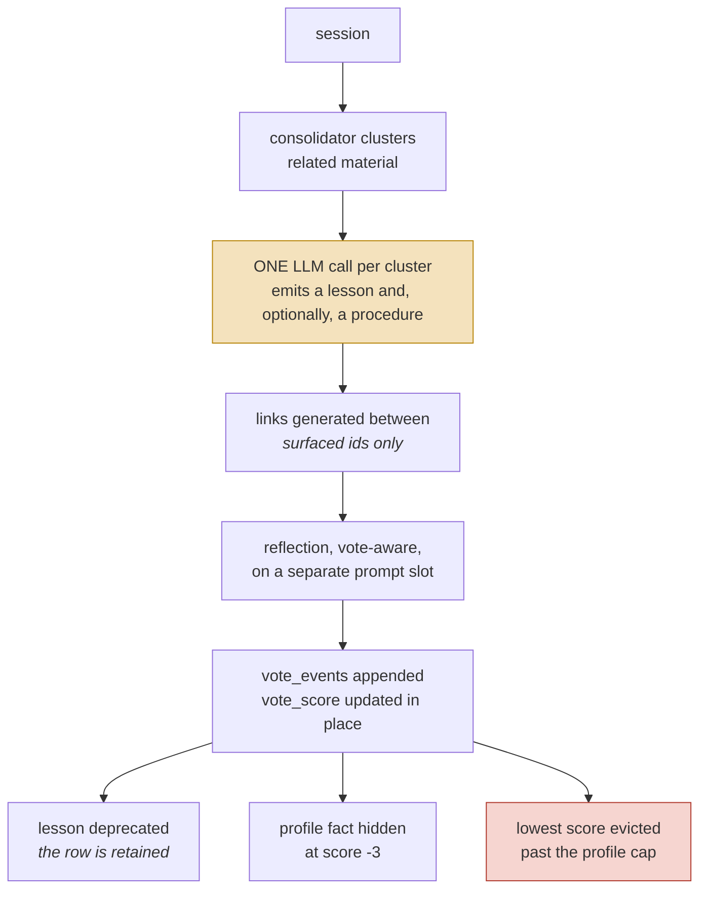
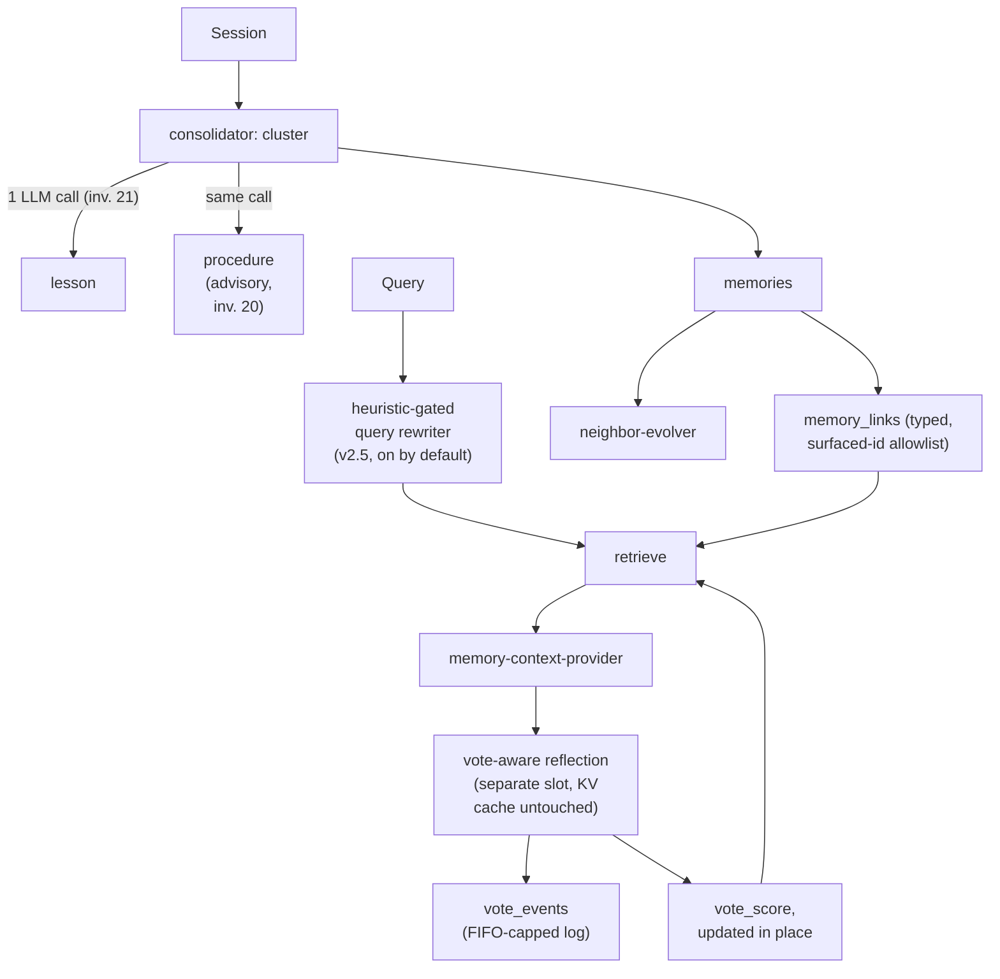

## 1. Executive Summary

Atomic Agent is an MIT-licensed local-first agent whose memory fabric is built like a specification: schema comments cite numbered cross-phase invariants into a design document, and a lesson, a procedure, a profile fact and a note are each governed by rules a reader can trace. The weakness is that model-cast votes reach deletion and hiding, on by default, while the evaluation campaign that would justify the defaults commits no results.

Three artifacts sit beside the code:

- `MEMORY_FABRIC_V2.md` — the design plan, including §14 acceptance criteria and a §10 table of shipped defaults.
- `MEMORY_FABRIC_V2.5.md` — the ledger for the query rewriter, reflection segmentation and typed NOTE extraction.
- `eval-memory/PLAN.md` and `eval-memory/CAMPAIGN_HYPOTHESES.md` — an evaluation campaign whose stated purpose is *"is memory actually useful"*, with pre-registered hypotheses marked DRAFT and numbered experiments E1–E15.

The design document is not decorative. The SQL schema comments cite **numbered cross-phase invariants** back into it — "cross-phase invariant 7 in `MEMORY_FABRIC_V2.md` §13.7", invariant 20, invariant 21 — so a reader can trace a column to the rule that governs it.

**The advanced layers ship on.** `USER_CONFIG_DEFAULTS` enables links, neighbour evolution, lessons, procedures, the consolidator, voting and the query rewriter; only embeddings, reflection segmentation and typed notes default off (`src/config/config-schema.ts:2871-2951`). A config file older than version 22 has those seven switches forced on at load, whatever it says (`config-schema.ts:3525-3535`). `MEMORY_FABRIC_V2.md` §10 states the same defaults, pinned by `src/config/agents-md-defaults.test.ts`; `MEMORY_FABRIC_V2.5.md`, outside that test, calls the rewriter `default: false`.

Three mechanisms stand out.

**Votes are logged beside a score that is not derived from them.** `vote_events(id, kind, target_id, direction, session_id, turn_index, created_at)` is the log, and `applyVote` writes it in the same transaction as the score (`src/memory/voting/vote-store.ts:282-345`). The indexed `vote_score` columns on `memories`, `lessons`, `profile_facts` and `procedures` are incremented and clamped in place and decayed in bulk by each consolidator tick. They outlive the events, which `evictOldestEvents` deletes oldest-first past `memory.voting.eventLogMaxRows`, 50,000 by default (`vote-store.ts:9-29`). So the score cannot be recomputed from the log.

The score is read back into belief, and every use is on by default. Utility-weighted eviction deletes memories ordered by `vote_score ASC` first (`memory-store.ts:331-345`). A lesson with a negative score and `success_count = 0` is deprecated at the next tick (`lessons/lesson-store.ts:521-551`, `consolidator/consolidator-job.ts:473-490`). The profile renderer hides a fact, pinned or not, at or below minus `profileFilterThreshold`, 3 by default (`profile-renderer.ts:82-87`). And past 500 active unpinned profile facts, `ProfileEvictor` deletes the lowest score first (`profile-eviction.ts:53-104`).

That is closer to [Holographic](../holographic/), where a rating mutates the score that gates retrieval and enough ratings silently delete a fact, than to the "derive counters from events" shape the schema resembles.

**Procedures are advisory and never executed.** Invariant 20 states that the runtime never auto-executes a procedure; they are "advisory text the agent reads and either follows or consciously deviates from." [Voyager](../voyager/) stores executable skills and gains an empirical verification gate; Atomic Agent stores procedural knowledge and gives up execution to avoid the trust boundary that comes with it. Both positions are defensible, and the pair makes the [skills as procedural memory](../../patterns/skills-as-procedural-memory/) tradeoff concrete.

**The vote prompt is isolated from the main KV cache.** The schema comment records that the vote micro-prompt "lives entirely on the reflection slot — the main agent slot's KV cache is untouched." That is the same prompt-caching concern driving [Hermes Agent](../hermes-agent/)'s frozen snapshot, solved by slot isolation instead.

**One mark, `negative_eval`.** Lesson recall is asserted to drop a deprecated lesson beside an active control, and note recall to keep two project directories apart (section 10).

**And two of the three timestamp columns on a profile fact are the same number.** `valid_from`, `created_at` and `updated_at` are written with one `now` on every insert, which the code documents rather than hides; the supersession chain is valid-time history, and there is no second axis and no read that takes a time. See section 2.

## 2. Mental Model

Four domain objects, connected by typed links:

```sql
memories        -- extracted memory rows, with vote_score
lessons         -- distilled guidance; status 'active' | 'deprecated'
profile_facts   -- user facts as a supersession chain
procedures      -- read-only how-to templates, advisory only

memory_links (from_id, to_id, kind)   -- PRIMARY KEY (from_id, to_id, kind)
                                      -- multiple link kinds between one pair
vote_events (id, kind, target_id, direction, session_id, turn_index, created_at)
```

Profile facts are versioned through an explicit supersession chain:

```sql
profile_facts(
  key, value, pinned, keywords,
  valid_from      INTEGER NOT NULL,   -- when the row started being authoritative
  created_at      INTEGER NOT NULL,   -- audit timestamp
  superseded_by, supersedes,
  ...
)
```

The comments document the legacy migration explicitly — `valid_from = legacy.updated_at`, `created_at = legacy.updated_at` (`memory-schema.ts:214`) — so the point at which versioning was retrofitted is recoverable rather than silently assumed.

**How a profile fact stops being shown.** Four ways, and only one is a correction. A newer `set()` for the key supersedes it. `memory.profile.remove` deletes the active row. The renderer hides it once model votes drive its score to −3. And the eviction cap deletes it when it has the lowest score among more than 500 active unpinned facts. Superseded rows survive the last two, so `history(key)` shows a chain with no active row at the end.

**Three timestamps, one clock.** `valid_from`, `created_at` and `updated_at` are written with the same `now` on every insert, and the code says so. `profile-store.ts:37-42` documents `updatedAt` as *"identical to `validFrom` because every write creates a fresh row — the column is kept so phase 7a can stamp `applyVote` timestamps without another migration"*. `memory-schema.ts:196-201` says `created_at` is *"copied from `valid_from` on a fresh row"*. The columns are a migration-free landing site, not a second axis.

**`bitemporal` is withheld.** The chain records every version of a key and the order they took effect, which is valid-time history. What it cannot express is a fact whose validity began before the system learned it, and no read takes a time argument — `get`, `getById`, `list` and `history` are the whole read surface (`profile-store.ts:411-456`), and the last returns a chain rather than a state at a moment. *"Where did I live last March"* and *"what did this store believe last March"* are the same question here. The search is in the appendix.

### The scope key is real and the switch is in the wrong hand

`memories`, `lessons` and `procedures` all carry a `working_dir` column, indexed, and the schema comments call it a *"per-project scoping mirror"*. `profile_facts` carries none, so the profile is global. The key reaches the read path: `MemoryStore.recall` and `MemoryStore.list` both push `working_dir = ?` into the WHERE clause, and both fail closed inside that branch — a `scope: "project"` call with no directory returns `[]` rather than everything.

But `const scope = opts.scope ?? "all"`, so the filter is off unless a caller turns it on, and the docstring says so: *"the caller is responsible for passing the current working directory when they want that filter."* Two callers matter, and they resolve it differently.

The automatic injection path, `memory-context-provider.ts:273` and `:366`, spreads `{ scope: "project", workingDir: args.workingDir }` in whenever a working directory is known and nothing when it is not — scoped by default, unscoped when the host cannot say where it is.

The tool path does not. `src/tools/memory/notes-recall.ts:48` reads `const scope = rawArgs.scope === "project" ? "project" : "all"` — **the model decides whether the project boundary applies**, and anything other than the literal `"project"` means no boundary. The one thing the model cannot do is aim it: `workingDir` comes from `ctx.workingDir`, the host's value, so the boundary can be switched off but not redirected.

**`scope_enforced` is withheld.** The mark certifies that a stored key reaches the query; here it reaches the query on request, and the request most likely to matter is made by the model, whose default is the whole corpus. [Project N.E.K.O.](../neko/) holds a committed test named `test_model_supplied_subjects_cannot_influence_scope` for exactly this surface, and derives the subject list from the host so the model has no vote.

**`trust_state` and `audit_log` are withheld too.** A lesson's `active`/`deprecated` is a lifecycle with no candidate state, and deprecation is archival. `vote_events` records feedback, not mutations, and deletes its own oldest rows.

Lifecycle:



The highlighted step is invariant 21, cited by number in the source: **at most one
model call per cluster even when it produces both a lesson and a procedure.** The
cost bound is written down as a rule rather than left to whoever edits the
consolidator next.

## 3. Architecture

`src/memory/`:

- `memory-schema.ts` — versioned migrations with commentary and invariant references.
- `memory-store.ts`, `profile-store.ts`, `profile-eviction.ts` — storage, with `profile-store-bitemporal.test.ts` and `profile-eviction.test.ts`.
- `consolidator/` — clustering and distillation.
- `voting/` — `vote-grammar.ts`, `vote-prompt.ts`, `vote-parser.ts`, `vote-response-format.ts`, `vote-runner.ts`, `vote-store.ts`, `vote-aware-reflection.ts`.
- `evolution/neighbor-evolver.ts` — neighbour metadata evolution.
- `health/` — a streak tracker that warns once when memory sub-calls keep timing out or failing.
- `lessons/`, `procedures/`, `links/`, `reflection/`, `retrieve/`, `embeddings/`.
- `notes-renderer.ts`, `profile-renderer.ts`, `memory-context-provider.ts`.

Everything lives in one SQLite file (`config.paths.memoryDbFile`) opened in WAL mode. Model sub-calls — reflection, votes, link generation, distillation, the query rewriter — run against the agent's own LLM backend on a separate slot. The embedding arm needs a local embedding daemon and is off by default.



## 4. Essential Implementation Paths

### Invariants as referenced artifacts

The schema does not merely implement rules; it cites them. Reading `memory-schema.ts` you encounter "cross-phase invariant 7 in `MEMORY_FABRIC_V2.md` §13.7", invariant 20 on procedure execution, and invariant 21 on LLM call budget per cluster (`memory-schema.ts:397-398`, `:424-432`).

Numbered invariants with stable references let a later contributor tell an intentional constraint from an accident, and make a violation reviewable as a violation rather than as a diff.

### Logged votes

`vote_events` records direction, target kind and id, session, turn index, and timestamp, with `target_id` a soft pointer so the record of a vote outlives an evicted target. `vote_score` is an indexed column on each votable kind, written beside the event rather than derived from it: a vote against a score already at the clamp writes no event, the per-tick decay writes none, and the log is FIFO-capped. The log can show a suspicious recent pattern; it cannot replay a changed scoring rule over the whole history.

Set against other feedback designs, the schema sits at the disciplined end of the range and the store does not. Holographic mutates trust directly and deletes by threshold. [RainBox](../rainbox/) keeps feedback as a review signal behind a human gate. [MetaClaw](../metaclaw/) lets telemetry tune retrieval policy through a promotion gate. Atomic Agent keeps a bounded raw signal and a live score that, by default, orders deletion, deprecates lessons and hides profile facts.

The voting subsystem is more than a thumbs-up counter: a grammar, a response format, a parser with tests, a runner, a store, and a reflection path that consumes votes.

### The profile cap

`ProfileEvictor` counts active unpinned facts inside the `set()` transaction and, past `memory.profile.maxEntries` (500 by default, `config-schema.ts:2818`), deletes the overflow ordered `vote_score ASC, updated_at ASC, id ASC` (`profile-eviction.ts:64-78`, `profile-store.ts:357`). Pinned facts are never counted or evicted, the row being written is never a candidate, and the delete statement repeats the filter so it cannot remove a pinned or superseded row whatever id it is handed.

The eviction reaches a log line and the session trace through `onEvicted` (`src/runtime/bootstrap.ts:1290-1310`), not the store. Because updated_at equals valid_from, "stalest" means oldest-written, and the first-ranked criterion is the score the model's votes set.

### Procedures without execution

Invariant 20 is a deliberate limit: procedures are "advisory text the agent reads and either follows or consciously deviates from," never auto-executed. Invariant 21 constrains their cost — a lesson and its procedure come from the *same* consolidator cluster in a single LLM call.

A procedure derived alongside its parent lesson shares that lesson's evidence, so the how-to and the why-it-matters cannot drift apart, and the budget rule stops the procedures layer from doubling distillation cost.

### Surfaced-id allowlist

`neighbor-evolver.ts` operates against "the surfaced-id allowlist used by the link-generator", with `skipped_invalid` as an explicit outcome and metrics recorded per outcome (`evolution/neighbor-evolver.ts:34`, `:179`). The same list bounds the note candidates for link generation and votes.

This is the defence [A-MEM](../a-mem/) lacks. A-MEM's evolution returns vector rank positions and later applies them to insertion order, so an LLM can rewrite a different neighbour than the one it saw — the "ranking positions used as identities" antipattern. Atomic Agent constrains evolution to ids that were surfaced and counts the rejections.

The list is the union of note ids surfaced at every step of the turn, capped at the 32 most recent (`src/agent/agent-loop.ts:638`, `:1443-1446`). Until [`d37c185ede03f31faf84e3bfaf1edf5be2d9b776`](https://github.com/AtomicBot-ai/atomic-agent/commit/d37c185ede03f31faf84e3bfaf1edf5be2d9b776) on 21 September 2026 it came from the last recall refresh of the turn, so on a multi-step turn it was usually empty and link generation never fired.

### Deprecation retains the row

Lessons carry `status: 'active' | 'deprecated'`, and the comment is explicit that "Deprecated lessons stay" (`memory-schema.ts:275`). Combined with `supersedes`/`superseded_by` on profile facts, correction is a state transition with history rather than a delete.

What is missing is a value-level tombstone. The consolidator never re-clusters episodes already archived into a lesson (`consolidated_into IS NULL`, `consolidator-job.ts:15-16`), but `LessonStore.create` compares nothing against existing or deprecated lessons (`lessons/lesson-store.ts:280-320`), so a later cluster of new episodes can distil the deprecated lesson again.

## 5. Memory Data Model

SQLite with numbered migrations (V9 introduces voting, V10 the procedures layer), each documented in place. Typed links with a composite primary key allow several relationship kinds between the same pair.

Gaps:

- **Scope is a project key the caller may omit.** `working_dir` on memories, lessons and procedures; none on profile facts; no user or tenant key, which fits a single-user agent.
- **No rejected-value tombstone**, so deprecation does not prevent re-derivation from new episodes.
- **`vote_score` reaches more than ranking.** By default it orders utility-weighted memory eviction and the profile cap, deprecates negatively voted lessons with no recorded success, and hides profile facts — model votes acting on belief, with configuration as the only gate.

## 6. Retrieval Mechanics

Note recall is FTS5 BM25 through `recallHybridAsync`, which adds an embedding arm only when the embedding daemon is attached (`memory-context-provider.ts:257-270`). With links on by default, recall folds in a one-hop BFS expansion over `memory_links`, capped at 12 ids. Lessons and procedures are recalled by FTS5 and re-ranked by a blend with `vote_score` (`scoreBlend` 0.6).

The v2.5 **heuristic-gated query rewriter** runs only when a referential-word detector (`retrieve/referential-detector.ts`) says the message needs it — `gateMode: "heuristic"` by default, with `embedding` and `always` as alternatives — and runs once per turn.

## 7. Write Mechanics

The consolidator clusters material and distils it; the one-call-per-cluster invariant bounds cost. Reflection is vote-aware and runs on its own prompt slot. Neighbour evolution adjusts metadata within the surfaced-id allowlist. Reflection writes at most three profile facts a turn, and each `set()` runs the eviction cap in its own transaction.

## 8. Agent Integration

`memory-context-provider.ts` supplies memory to the agent, with `notes-renderer.ts` and `profile-renderer.ts` formatting the two durable surfaces. The profile section renders pinned facts first, so the `memory.profile.maxTokens` clip (512 by default) drops contextual facts before any pinned one, and a TUI line reports how many facts, and how many pinned, the clip left out.

The separate reflection slot is the notable structural choice: the expensive, prompt-heavy memory work happens off the main conversational slot, protecting its cache. `health/track-subcall-health.ts` warns the operator once when those sub-calls keep timing out or failing, and counts a gate that declined to call the model as neither success nor failure.

## 9. Reliability, Safety, and Trust

Strengths:

- **Numbered invariants cited from code** into a design document.
- **Vote events written atomically with the score change**, with a soft target pointer so the record outlives the row.
- **A supersession chain enforced by a partial unique index** (`memory-schema.ts:238`), so two active rows for one key are rejected at insert rather than by convention.
- **Surfaced-id allowlist** closing the rank-as-identity failure.
- **Procedures never auto-executed**, stated as an invariant.
- **One LLM call per cluster**, stated as an invariant.
- **KV-cache isolation** for the vote prompt.
- **Deprecation retains rows**, and deprecated lessons are asserted out of recall.
- **Pinned profile facts are exempt from the cap and ranked ahead of the clip.**
- **A design plan with acceptance criteria and a pre-registered experiment campaign.**

Gaps:

- **No tombstone**; deprecation is not durable against re-distillation.
- **Model votes reach deletion by default** — memory eviction, the profile cap, lesson deprecation and profile hiding, including a pinned fact once its score reaches −3.
- **Scope is off on the recall tool unless the model asks for it.**
- **A large surface on by default**, forced on at load for a config file older than version 22, whatever it says.
- **Campaign results are gitignored**, so the acceptance criteria's verdict is unknown.

## 10. Tests, Evals, and Benchmarks

Nothing was run for this reading: the screen reports `package.json` and `package-lock.json` inside the seven-day cooldown.

**The `negative_eval` cases.** `src/memory/lessons/lesson-store.test.ts:185-200` creates an active and a deprecated lesson that both match `pnpm`, then asserts the recall returns the active id and not the deprecated one. `src/memory/memory-store.test.ts:74-87` stores notes under `/repos/a` and `/repos/b` and asserts each project-scoped recall returns exactly its own directory. Each holds a positive control in the same populated result, so neither exclusion passes on an empty list. Both stand unchanged at every pin this report has read.

**Scorecard suites pin the numbered invariants.** `procedures/scorecard-7b.test.ts` asserts one lesson and one procedure from one distill call (7b.A, invariant 21), vote-ordered FIFO demotion and deprecation cascade (7b.F), and invariant 20 (7b.D). The invariant-20 case is weaker than its name: it shells out to `rg` with `|| true`, so a machine without ripgrep returns no output and passes. Its sibling asserts `typeof` on an object literal the test itself builds, and cannot fail. `voting/scorecard-7a.test.ts` does the same for voting.

`reflection-decorator-fire-safety.test.ts` pins the *contract* of the reflection decorators — which wrapped runners may fire, when, and what happens to the others when one throws. `profile-eviction.test.ts` pins the cap, and `src/agent/agent-loop-recalled-memory-allowlist.test.ts` pins the 32-id allowlist across a six-refresh turn. `src/config/agents-md-defaults.test.ts` compares every default quoted in `AGENTS.md` and `MEMORY_FABRIC_V2.md` §10 with the value the code ships.

The campaign structure — `PLAN.md`, acceptance criteria in the design doc, `CAMPAIGN_HYPOTHESES.md` pre-registering predictions for a LoCoMo run, experiment runners E1–E15 plus LoCoMo and LongMemEval harnesses — writes its output to `eval-memory/reports/`, which `eval-memory/.gitignore` excludes. The hypotheses file is marked DRAFT, pending approval before the first scored run. No scored result is committed, the gap [OpenViking](../openviking/) and [open-cowork](../open-cowork/) share.

## 11. For Your Own Build

### Steal

- **Number your invariants and cite them from the code.** A schema comment pointing at "§13.7 invariant 7" turns an implicit rule into a reviewable one, and is nearly free.
- **Write the vote event in the same transaction as the score change.** Then decide whether the score is a projection — if it is meant to be, keep the log uncapped and log the decay, which this store does not.
- **Advisory-only procedures.** If you store how-to knowledge but do not want the trust boundary of executing it, say so as an invariant rather than by omission.
- **Bound distillation cost explicitly** — one LLM call per cluster even when producing two artifacts.
- **Isolate expensive prompts to a separate slot** so the main conversation's cache survives.
- **Constrain evolution to surfaced ids**, and count the rejections.
- **Test documented defaults against shipped ones** — `agents-md-defaults.test.ts` found `eventLogMaxRows` documented as 2,000 and shipped as 50,000.

### Avoid

- **Deprecation without a value tombstone** in a system that re-distils from clusters.
- **A feedback score that deletes.** A model's downvote is evidence the memory was unhelpful in one turn, not that it was false; letting it order eviction turns ranking noise into loss.
- **A migration that overrides an explicit off.** Forcing a layer on for old config files cannot tell an operator's choice from the schema's former default.
- **Evaluation machinery whose outputs are gitignored**, beside defaults the evaluation was meant to decide.

### Fit

Borrow:

- The invariant-numbering practice — the highest value-per-effort idea here.
- The `vote_events` table shape, with the score derived from it rather than kept beside it.
- The surfaced-id allowlist.
- The pinned-first ordering ahead of a token clip.

Do not copy:

- The full fabric unless you need it; the practices transfer better than the surface.
- Deprecation as the only correction mechanism.

### The export path

`src/memory/obsidian-export.ts` renders the corpus into an Obsidian vault as plain markdown, one-way, and stays out of the way. The database is opened `{ readonly: true }` and migrations are deliberately not applied, so an export cannot bump a schema. Rows are read with `SELECT *`, so a vault built against an older schema degrades to `undefined` columns rather than throwing. Filenames are id-based and content is a pure function of the row, so re-exporting rewrites only the files whose bytes changed and leaves mtimes stable for sync tools. Pruning is restricted to the machine-owned `note-<n>.md` / `lesson-<n>.md` / `procedure-<n>.md` patterns inside the three export folders, so anything a person put there survives.

It also takes no scope argument and exports the whole corpus, which is the right default for a personal vault and the wrong one anywhere a `working_dir` boundary was meant to mean something.

## 12. Open Questions

- What did the E9–E12 experiments conclude? The machinery exists; the outputs are gitignored.
- How often does a model downvote land on a fact that was true, and does the −3 hiding threshold survive that rate?
- What prevents a deprecated lesson from being re-distilled from later episodes?
- Why does the pre-v22 migration override an explicit `enabled: false` rather than only a missing key?

## Appendix: File Index

- Schema, migrations, invariant citations: `src/memory/memory-schema.ts`.
- Stores: `src/memory/memory-store.ts`, `profile-store.ts`, `profile-eviction.ts`.
- Voting: `src/memory/voting/vote-{grammar,prompt,parser,response-format,runner,store}.ts`, `vote-aware-reflection.ts`.
- Evolution: `src/memory/evolution/neighbor-evolver.ts`.
- Distillation and layers: `src/memory/consolidator/`, `lessons/`, `procedures/`, `links/`, `reflection/`, `retrieve/`, `embeddings/`, `health/`.
- Rendering and provision: `notes-renderer.ts`, `profile-renderer.ts`, `memory-context-provider.ts`.
- Tools and wiring: `src/tools/memory/`, `src/agent/agent-loop.ts`, `src/runtime/bootstrap.ts`.
- Defaults: `src/config/config-schema.ts` (`USER_CONFIG_DEFAULTS`, `parseMemoryV2FeatureEnabled`), `src/config/agents-md-defaults.test.ts`.
- Design and evaluation: `MEMORY_FABRIC_V2.md` (§10 defaults, §14 acceptance criteria), `MEMORY_FABRIC_V2.5.md`, `eval-memory/PLAN.md`, `eval-memory/CAMPAIGN_HYPOTHESES.md`, `eval-memory/.gitignore`.

### Recorded searches

Run from the repository root at the pinned commit.

```sh
# no read takes a time argument (bitemporal withheld)
grep -rn "asOf\|as_of\|AsOf\|pointInTime\|point_in_time\|validAt\|valid_at" --include='*.ts' src/
# scope key on the read path, and which callers ask for it
grep -rn "working_dir" --include='*.ts' src/memory/ | grep -v "\.test\.ts"
grep -rn 'scope: "project"' --include='*.ts' src/ | grep -v "\.test\.ts"
# no caller recalls deprecated lessons
grep -rn "includeDeprecated" --include='*.ts' src | grep -v '\.test\.ts'
# no value-keyed rejection record
grep -rn -i "tombstone\|rejected_value" --include='*.ts' src/memory | grep -v '\.test\.ts'
# campaign outputs are ignored, none committed
git check-ignore -v eval-memory/reports/x
git ls-files eval-memory/reports
# shipped defaults for the memory layers
awk '/^export const USER_CONFIG_DEFAULTS/{f=1} f' src/config/config-schema.ts | awk '/^  memory: \{/{f=1} f' | grep -n -E ' enabled:|utilityWeighted|profileFilterThreshold'
```

## History

**2026-09-26** — [`f31ec05d91254e10a5a05598d711f33f8cf85d42`](https://github.com/AtomicBot-ai/atomic-agent/commit/f31ec05d91254e10a5a05598d711f33f8cf85d42) — 254 commits on; the schema, memory store, vote store, lesson store and recall tool are byte-identical. **`negative_eval` is awarded, and was wrong to withhold**: the two cases in [section 10](#10-tests-evals-and-benchmarks) stand at all three pins read. The report called phases 2–7b and the query rewriter default-off; `USER_CONFIG_DEFAULTS` has shipped them on since 21 May 2026, before the first pin. It also left scope "not traced" in sections 5, 9 and 11 against section 2, placed re-distillation in "the same cluster", and recorded no retrieval arm. Upstream added a vote-ordered profile cap, pinned-first rendering, and a per-turn allowlist that lets link generation fire on multi-step turns. The screen reports `FRESH` on `package.json` and `package-lock.json`; nothing installed, built or run.

**2026-09-25** — [`ae12759ad5185cd53ee81eb82c6d0f24763310a9`](https://github.com/AtomicBot-ai/atomic-agent/commit/ae12759ad5185cd53ee81eb82c6d0f24763310a9) — same commit. The report described `vote_score` as derived from `vote_events` and recomputable from them. It is not: `applyVote` updates the score in place beside the event, a clamp hit and the per-tick decay write no event, and `evictOldestEvents` FIFO-caps the log at 50,000 by default (`src/memory/voting/vote-store.ts:9-29`, `:282-345`). The open question whether the score reaches beyond ranking is answered from the code: when enabled it orders utility-weighted eviction (`memory-store.ts:331-345`), deprecates negatively voted lessons (`lessons/lesson-store.ts:521-551`), and hides profile facts (`profile-renderer.ts:53-62`). Description, trust field, both diagrams and the vote sections are corrected. No mark moved.

**2026-09-13** — [`ae12759ad5185cd53ee81eb82c6d0f24763310a9`](https://github.com/AtomicBot-ai/atomic-agent/commit/ae12759ad5185cd53ee81eb82c6d0f24763310a9) — 801 commits past the previous pin, of which `src/memory/` took about 2,000 added lines. **`bitemporal` is withdrawn, and it was wrong when awarded rather than overtaken.** `valid_from`, `created_at` and `updated_at` are written with the same `now` on every insert; `profile-store.ts:32-38` and `memory-schema.ts:196-201` both say so in comments that stand unchanged at `d69332c589733e38ae7393dd81fcbc5a375d02fb`, and a grep for `asOf`, `as_of`, `pointInTime`, `validAt` and their variants returns nothing across `src/` at either commit. The supersession chain is real valid-time history and the report says so; a second axis is not there. The `scoping: "Not traced"` gap is closed in the other direction: `working_dir` is a real read-path filter that fails closed, but `scope` defaults to `all` and `src/tools/memory/notes-recall.ts:48` takes it from the model's own arguments, so `scope_enforced` is withheld with the reason recorded. Two features arrived: a one-way read-only Obsidian export, and a regression pin on the reflection decorators' fire-safety contract. The screen reports `FRESH` on `package.json` and `package-lock.json` within the cooldown, so nothing was installed and no test was run.

**2026-07-27** — [`d69332c589733e38ae7393dd81fcbc5a375d02fb`](https://github.com/AtomicBot-ai/atomic-agent/commit/d69332c589733e38ae7393dd81fcbc5a375d02fb) — first reading.
