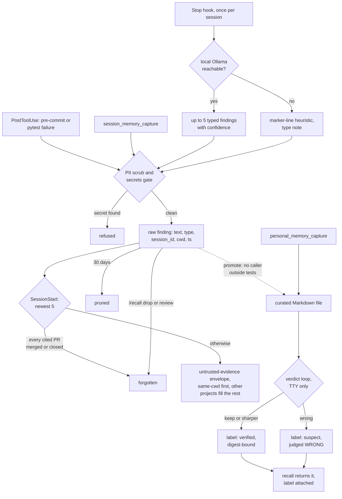

## 1. Executive Summary

Attune AI is a Claude Code plugin and Python package whose memory suite
stashes findings a local model extracts from each session, injects the newest
ones at the next session start, and keeps a curated Markdown tier that a person
reviews. Around it sit workflows, an MCP server with dozens of tools and a
lessons file retrieved at the prompt that needs it.

What is notable is the discipline at the boundaries. A write reports success
only when a readback proves it landed. Every recalled body passes one renderer
that frames it as untrusted evidence. A human verification is bound to a digest
of the text it verified.

What is weak is that the strongest machinery labels rather than decides. The
session-start block takes other projects' findings when the current one has few.
The review-gated promotion into the curated tier is never called. A verdict of
`wrong` leaves the memory served.

The repository contains four memory surfaces, and this report covers the
three an agent writes to:

- **The raw stash.** Findings the Stop hook extracts with a local Ollama model,
  in a JSONL file by default or the
  [Redis Agent Memory Server](../redis-agent-memory-server/) when reachable.
- **The curated tier.** Markdown under `~/.attune/memory`, written by
  `personal_memory_capture` and reviewed by an interactive verdict loop.
- **The unified pattern store.** JSON files written by the `memory_store` MCP
  tool, with classification, encryption and an audit log.

The fourth, a lessons file under `.claude/` retrieved on each prompt, is
described in section 6 and carries no mark.

Two marks. `audit_log` is on the pattern store's append-only event file.
`negative_eval` is on file-stash tests that an expired and a forgotten finding
stay out of the read the session-start hook injects from. Section 9 names the
five withheld, and two of them are deliberate refusals the code documents.

The licence is Apache-2.0. `LICENSE_CHANGE_ANNOUNCEMENT.md`, dated 28 January
2026, records the move from Fair Source 0.9. The CHANGELOG names the project's
former name, Empathy Framework.

## 2. Mental Model

A raw finding becomes memory without review and stops being one by age,
deletion or a resolved reference. A curated memory becomes memory when someone
writes the file, and a person's verdict afterwards changes its label, not its
standing. A pattern is memory from the moment `memory_store` persists it.

**A raw finding is a model's paraphrase of the session.** The Stop hook asks
`llama3.1:8b` for at most five findings, each typed, one sentence, with a
required confidence. The prompt restricts it to what the assistant concluded or
the user decided in this session (`plugin/hooks/session_stash.py:281-298`).
Tool results are replaced by a marker before extraction, so a file the session
read cannot be restated as a user's claim (`:214-248`). Without Ollama a
keyword heuristic takes marker-bearing lines as `note` findings (`:461-484`).

**It dies four ways.** It expires 30 days after it was written
(`src/attune/memory/file_stash.py:37`, `:134-156`). A person drops it by id
through `/recall drop` or `/recall review`. At session start, a finding citing
`PR #N` is forgotten when every PR it cites reports `MERGED` or `CLOSED`
(`plugin/hooks/session_recall.py:126-160`). Or it is promoted into the curated
tier, which section 7 shows is not wired.

**A curated memory carries an epistemic tier as a label.** The tier is
`settled`, `check-before-acting` or `suspect`, computed from days since
verification times a per-type volatility (`src/attune/memory/curated_audit.py:506-531`).
A `wrong` verdict makes the age basis `tombstoned`, which forces `suspect`
(`:390-391`). An edit since the verdict makes it `invalidated`, because the
recorded digest no longer matches (`:396-398`). Decision D1 forbids acting on
the label: *"Nothing here may filter a memory out of a result on the basis of
age"* (`:15-18`). Recall annotates each hit with the label and returns it.

## 3. Architecture

The plugin is a directory of Python hook scripts registered in
`plugin/hooks/hooks.json`, each run as a fresh process on its event. They
import the `attune` package when it is installed and degrade to a silent no-op
when it is not. The package is a library, a CLI and an MCP server
(`src/attune/mcp/server.py`). The AMS integration is a bundled plugin package,
`attune_redis/`, registered through the `attune.memory_backends` entry point.

**Backend resolution is per call.** `resolve_backend` loads every registered
backend, skips any whose `is_connected()` fails, prefers a connected upgrade
over the file fallback, and honours a recorded `file` preference
(`src/attune/memory/session_stash.py:120-181`). `backend_status` reports which
tier answered and whether an upgrade is unreachable, and the session-start hook
prints a warning line when it is (`plugin/hooks/session_recall.py:350-377`).

**Three stores, three locations.** The raw stash is
`~/.attune/session_stash/findings.jsonl` and a sibling `kv.json`. Curated
memory is Markdown under `~/.attune/memory/`, project-local `.attune/memory/`,
and `~/.attune/memory/curated/` for promoted nodes. Patterns are one JSON file
per id under `~/.attune/memdocs_storage`
(`src/attune/memory/storage_backend.py:30-42`).

**A fourth serving layer is out of tree.** `recall_digest.py` reads curated
nodes from a Redis Function, `FCALL recall_digest`, that a SessionStart
hydration hook loads (`src/attune/memory/recall_digest.py:32-34`). The hook and
its `functions.lua` live in an `attune-agent-memory` checkout that
`tests/unit/memory/test_session_hydrate_fail_open.py` calls *"personal infra, not
tracked in this repo"*. Its repository was not found on GitHub on 3 October
2026, so the digest's filtering is unverified here.

### Deployment and ergonomics

`pip install attune-ai` and the plugin are enough for the raw stash, the
curated tier and the pattern store, all as local files. Model extraction needs
a local Ollama with `llama3.1:8b`; without it the heuristic runs. Semantic
recall needs a Redis Agent Memory Server; `agent-memory-client` 0.14.0 is
locked in `uv.lock`. Curated and lessons ranking come from the separately
published `attune-rag` package, locked at 1.2.0, which this reading did not
open. No API key is needed to store or recall anything. Every store is
readable by hand, and the curated tier is meant to be edited.

## 4. Essential Implementation Paths

**Capture, Stop hook.** `main` (`plugin/hooks/session_stash.py:781-879`) skips
a session already marked done (`:794-796`) and one below a 0.05 utilisation
gate (`:798-807`). It extracts with Ollama or the heuristic (`:827-834`) and
writes through `_stash_findings` (`:660-701`). It then emits the stashed
findings as Stop-hook `additionalContext` with short ids and the review
commands (`:732-778`).

**Capture, the write contract.** `stash_entry`
(`src/attune/memory/session_stash.py:326-372`) runs `_sanitize`, which turns on
PII scrubbing and secret detection explicitly and refuses the write if a secret
is found or the gate cannot load (`:300-323`). It writes through
`backend.remember` and diverts to the file tier when the upgrade cannot confirm
the write (`:375-398`). `AMSMemoryBackend.remember` passes `deduplicate=False`
and returns True only after `_readback` fetches the id it wrote
(`attune_redis/memory.py:451-481`).

**Other writers of the stash.** `trap_stash.py` stashes pre-commit rejections
and pytest failures as `bug` findings
(`src/attune/telemetry/lessons/__init__.py:26-68`). The MCP tool
`session_memory_capture` stashes what the agent passes
(`attune_redis/mcp_tools.py:640-702`). Handoffs are stashed by
`src/attune/handoff/memory_link.py:68`.

**Recall at session start.** `session_recall.main`
(`plugin/hooks/session_recall.py:327-430`) skips `source == "compact"`, calls
`recent_entries(top_k=5, cwd=cwd)`, reconciles PR references, and renders each
surviving finding through `render_recall_for_context` within a 1,400-character
budget (`:184-236`).

**Recall on demand.** `recall_entries` (`session_stash.py:401-433`) calls
`target.search(query, limit=top_k)` and then sorts same-cwd results first. The
`/recall` skill also queries `LessonsIndex`
(`plugin/skills/recall/SKILL.md:16-28`).

**Correction.** `forget_entries` (`session_stash.py:494-542`) is the single
deletion chokepoint and emits one `memory_feedback` event with
`verdict="rejected"` and a count. `forget_by_prefix` (`:545-599`) resolves short
ids against the most recent records and skips any prefix matching zero or more
than one.

**Curated write and recall.** `PersonalMemory.capture`
(`src/attune/memory/personal.py:193-240`) gates secrets, builds a skeleton,
polishes it, and atomically writes `root/topic/kind.md`, replacing any file
already there. `query` (`:242-326`) ranks both roots through attune-rag, then
annotates each hit with staleness, status and provenance.

**Curated review.** `scripts/review_curated_memory.py` sweeps the corpora,
queues the top three by risk, and records `keep`, `wrong` or `sharper`
(`:114-166`). It refuses to prompt when stdin is not a TTY (`:205-212`).

**Pattern store.** `memory_store` with a `pattern_type` calls
`UnifiedMemory.persist_pattern` (`src/attune/mcp/memory_handlers.py:63-124`;
`src/attune/memory/mixins/long_term_mixin.py:36-98`), which reaches
`SecureMemDocsIntegration.store_pattern`
(`src/attune/memory/long_term_integration.py:145-293`).

## 5. Memory Data Model

| Unit | Fields | Where |
| --- | --- | --- |
| Raw finding | `id`, `session_id`, `cwd`, `timestamp`, `type` (decision, pattern, bug, reference, note), `content` up to 500 characters, `tags`, `ttl_days` | `SessionStashEntry`, `session_stash.py:56-117` |
| File-stash record | `id`, `text`, `session_id`, `topics`, `cwd`, `ts` | `file_stash.py:190-197` |
| Curated memory | frontmatter `name`, `description`, `metadata.type`, optional `verified`; body | `curated_audit.py:42-46`, `:104-125` |
| Verdict | `stem`, `verdict` (keep, wrong, sharper), `digest`, `who`, `at` | `verdict_log.py:50-83` |
| Promoted node | adds `node_id`, `status: active`, `promoted_from_stash_id`, `review_verdict`, `review_response_id` | `promotion.py:186-212` |
| Pattern | content, `created_by`, `classification`, `workspace`, retention, encryption flag | `long_term_pipelines.py:220-266` |

**Typed annotations ride as tags.** Extractor confidence and an optional
`source_ref` are stored as `confidence:0.9` and `source_ref:…` strings in
`tags`, so the entry schema stays fixed (`plugin/hooks/session_stash.py:673-682`).
A refs-v2 binder that checks each cited file, PR or spec against the session's
own tool calls ships behind `ATTUNE_MEMORY_REFS_V2`, off by default (`:371-378`,
`:607-657`).

**The verdict key is the filename stem within a corpus root.** `sweep` binds a
root's latest verdict to every memory under that root whose stem matches
(`curated_audit.py:808-814`), and `PersonalMemory._latest_verdict_for` does the
same (`personal.py:386-397`). Personal memory files are named
`<topic>/<kind>.md`, so every `decision` under one root shares the stem
`decision`. A `wrong` verdict on one topic's decision therefore labels every
topic's decision `suspect · judged WRONG`, and a `keep` verdict reads on
siblings as `invalidated`, since their digests differ. This was read, not
reproduced.

**Time.** Raw findings carry one creation time. Curated memories carry a
`verified` date and file mtime. No field records when a fact held.

## 6. Retrieval Mechanics

**Raw stash, file tier.** `search` scores token overlap plus a recency term
with a 3-day half-life, and adds 1.0 when the record's cwd equals a `cwd`
filter (`file_stash.py:219-253`). `recall_entries` never passes that filter,
so on this path the boost is dead: it calls `target.search(query, limit=top_k)`
and sorts same-cwd results first only within the top_k it got back
(`session_stash.py:424`, `:431-432`). A same-project finding ranked just below
the cut is not recovered.

**Raw stash, AMS tier.** `search` runs semantic search filtered to one
namespace, `attune` unless `AMS_NAMESPACE` is set
(`attune_redis/memory.py:533-541`; `attune_redis/config.py:31`). The namespace
is per install, not per project.

**Session start.** Five findings, newest first, with same-cwd findings sorted
ahead (`file_stash.py:255-281`). When the current project has fewer than five,
other projects' findings fill the block. The block is headed *"Recent findings
from this project"* (`session_recall.py:225-230`). Each body is wrapped in
`<recalled_memory … trust="untrusted-evidence">` with any instruction-shaped
text flagged (`src/attune/memory/provenance.py:167-210`). If the renderer cannot
be imported, nothing is injected (`session_recall.py:68-71`, `:202-203`).

**Lessons.** `lesson_recall.py` runs on every prompt at least 20 characters long
that is not a slash command. It retrieves from `.claude/lessons.md` through
attune-rag's keyword retriever and injects only above a score floor of 8.0, once
per lesson per session (`plugin/hooks/lesson_recall.py:11-20`, `:70`, `:86-88`,
`:147`). `jit_recall.py` injects rules from a static map keyed on tool name
before `AskUserQuestion`, `Bash` and `Edit` (`plugin/hooks/jit_recall.py:1-30`).

**Curated.** Both roots are ranked by attune-rag and merged, with project hits
winning ties by 0.001 (`personal.py:271-308`). Nothing reorders or drops on
status.

**Patterns.** `memory_retrieve` reads by key with an access check;
`memory_search` scores every pattern file by keyword without one (section 9).

## 7. Write Mechanics

The Stop hook acts once per session and never blocks: every path exits 0. The
hook's timeout is 15 seconds while the Ollama call's default timeout is 40, so
on a cold model the runner can kill the hook before extraction returns
(`plugin/hooks/hooks.json:64-65`; `session_stash.py:255-258`). A finding is
recallable as soon as the append lands, and the hook also surfaces it into the
next turn of the current session.

**Deduplication is by id only.** The file tier appends every finding. The AMS
tier upserts on a caller id or a content hash and turns off the server's
semantic merge, because it *"silently MERGES distinct-but-similar findings"*
(`attune_redis/memory.py:425-436`).

**Malformed output is dropped whole.** A finding with control characters, a
frontmatter delimiter line or role and tool-call tokens is discarded before it
is stored (`session_stash.py:95-112`). Prose such as *"ignore previous
instructions"* is kept and flagged at recall instead.

**Promotion is designed and unwired.** `promotion.py` drafts candidates from the
stash, renders one Promote or Skip decision per candidate, and writes a curated
file with `review_verdict: promote` and the stash id
(`src/attune/memory/promotion.py:41-224`). Its docstring says *"this module has
no promote-all path"*. Nothing outside tests calls `promote`,
`promotion_candidates` or `promotion_form_dict`. The `/remember` command the
`/recall` skill points at is a 15-line prompt offering store, retrieve, search
and forget (`src/attune/commands/remember.md`).

**Curated writes bypass review.** `personal_memory_capture` lets the agent write
`~/.attune/memory/<topic>/<kind>.md` directly, overwriting a previous capture
under the same topic and kind (`personal.py:228-236`).

### Operational cost

- Write: one local-model call per session at Stop, bounded at 40 seconds; no
  hosted model; the agent never waits on it.
- Lag: none once the append lands.
- Background: no pass rewrites the store; TTL pruning rewrites the JSONL under a
  lock after a session's stash.
- Read: at most 1,400 characters of finding text at session start, plus up to
  three PR lookups through `gh` with a 4-second timeout each; lesson injection
  per prompt only above the floor.

## 8. Agent Integration

`hooks.json` registers `session_recall.py` on SessionStart, `session_stash.py`
on Stop, `jit_recall.py` on PreToolUse, `trap_stash.py` on PostToolUse and
`lesson_recall.py` on UserPromptSubmit (`plugin/hooks/hooks.json:44`, `:64`,
`:76`, `:158`, `:169`).

The agent holds every memory verb. The MCP server registers `memory_store`,
`memory_retrieve`, `memory_search`, `memory_forget` and four
`personal_memory_*` tools (`src/attune/mcp/server.py:390-397`). The bundled
plugin adds five `session_memory_*` tools, five `redis_memory_*` tools and
`redis_health_check` (`attune_redis/mcp_tools.py:58-283`). No tool records a
verdict.

The `/recall` skill routes by transport: MCP tools when present, in-process
Python from a trusted host, and an honest refusal otherwise
(`plugin/skills/recall/SKILL.md:30-50`). Its review mode asks the user one
multi-select question and deletes what they pick (`:165-174`).

The session-start hook skips compaction restarts, so after a compaction the
model keeps only what survived in the summary (`session_recall.py:335-337`).

## 9. Reliability, Safety, and Trust

**Provenance is stamped, not enforced.** Raw findings are `machine-extracted`
and curated ones `human-curated`, and both reach the model as untrusted evidence
(`session_stash.py:436-464`; `personal.py:328-351`). The provenance module
states the limit: the envelope is *"the weakest known"* defence and must pair
with raw-tier quarantine (`provenance.py:13-19`). In this tree the quarantine
is the absence of a promotion caller; raw findings are injected every session.

**The pattern store's access model has a documented hole.** `check_access`
grants PUBLIC to all, INTERNAL only from the workspace that stored it, and
SENSITIVE only to the creator
(`src/attune/memory/long_term_classification.py:142-236`). `memory_retrieve`
applies it. `memory_search` and `search_patterns` do not, and say so:
*"This is an UNGOVERNED read path"*, left that way by a ruling dated
20 August 2026 because `user_id` is the OS login
(`src/attune/mcp/memory_handlers.py:227-235`;
`long_term_mixin.py:311-323`).

**Silent degradation is surfaced.** A dead AMS prints a warning at session
start, a write the AMS acknowledged but cannot read back diverts to the file
tier, and a stash that wrote nothing is logged to `stash.log`
(`session_stash.py:849-852`).

**Privacy.** Raw writes are PII-scrubbed and refused on secrets. Curated
captures raise on a secret before any model call (`personal.py:105-138`).
SENSITIVE patterns are encrypted when `cryptography` is installed. Deleted raw
findings leave the JSONL on rewrite.

**The verdict loop records before it stamps.** `keep` appends the verdict, then
sets `verified:` (`scripts/review_curated_memory.py:135-142`). A file with no
frontmatter makes `set_verified` raise, and the loop prints *"no verdict
recorded"* while the `keep` record is already in the log (`:222-227`;
`src/attune/memory/verdict_log.py:201-205`). Personal-memory skeletons carry
no frontmatter block (`personal.py:59-102`).

Capability marks:

- `audit_log` — awarded on the pattern store; evidence in the frontmatter.
  `.verdicts.jsonl` is a second append-only record, of verdicts only.
- `negative_eval` — awarded; section 10.
- `scope_enforced` — withheld. Raw findings store `cwd`, and every stash read,
  including the session-start hook, uses it to sort and never to exclude. The
  pattern store's workspace predicate is on `memory_retrieve`, and
  `memory_search` reads the same files without it.
- `trust_state` — withheld, and the reason is a written rule. The tiers
  `settled`, `check-before-acting`, `suspect` and the `tombstoned` basis are
  discrete, human-driven states, and D1 forbids every read path from dropping
  on them. Recall attaches them as labels (`personal.py:353-384`).
- `tombstone` — withheld. A `wrong` verdict is keyed on the file stem and keeps
  a digest of the rejected text, which is the key a value tombstone needs.
  `canonical_digest` is read only by the audit; no capture, stash or promotion
  path consults the log.
- `human_review` — withheld. The verdict loop passes the actor test: it needs a
  TTY and no tool records a verdict. But nothing waits for it. Curated memories
  are served before review and after a `wrong` verdict, and the per-candidate
  promotion gate has no caller.
- `bitemporal` — no validity time on any unit.

## 10. Tests, Evals, and Benchmarks

Nothing was built or run for this report; everything below was read at the pin.
The CI workflow runs `pytest -m "not network and not integration"`
(`.github/workflows/tests.yml:213`).

**The negative cases.** `test_ttl_prunes_expired_on_search` writes a fresh and
a 31-day-old record with the same text and asserts search returns the first
and not the second (`tests/unit/memory/test_file_stash.py:147-164`).
`test_forget_removes_by_id` stores three findings, forgets two, and asserts
`recent()` returns exactly the third (`:435-440`). Both assert the included
record, so an empty result fails.

**A scope boundary, tested on the governed path only.**
`test_internal_pattern_is_invisible_from_another_checkout` stores an INTERNAL
pattern from one checkout and asserts `retrieve_pattern` raises from another,
and a sibling test asserts the storing checkout can read it
(`tests/unit/memory/test_workspace_scoping.py:65-101`). No test covers
`search_patterns` across workspaces.

**Audit.** `test_audit_log_created_on_pattern_store` stores through the real
integration and asserts `store_pattern` and the user appear in the JSONL
(`tests/unit/memory/test_long_term_security.py:254-276`).
`test_delete_success_writes_audit_event` asserts one `delete_pattern` event
against a fake logger (`tests/memory/test_long_term_operations.py:158-166`).

**Evaluations without assertions.** `scripts/memory_recall_eval.py` captures a
corpus through `PersonalMemory` and runs positive queries and five negative
ones, such as *"What's the office WiFi password?"*, then reports the negative
queries' top scores without a threshold (`:183-210`, `:254-281`). The lessons
benchmark scores a golden query file against the real index for P@1 and P@3
(`scripts/phase0/lessons_rag_benchmark.py:1-75`). The README's 96% P@3 is
stated in the CHANGELOG, and no result file is committed.

**A committed live pilot.** `benchmarks/trap_battery_results_2026-07-13.md`
records 30 headless sessions across three traps with memory on and off. Its
own verdict calls the scale a pilot whose numbers are not quotable.

**Not covered.** No test asserts the session-start block excludes another
project's findings, because it does not. No test drives the verdict loop
against a personal-memory layout with two topics. No paper or citation block
describes this system; the only arXiv references are in an unrelated research
note on parallel lanes.

## 11. For Your Own Build

### Steal

- **Prove the write before reporting it.** A remote memory server that
  acknowledges before persisting is common; read the id back, and divert to a
  local tier when the readback fails.
- **One renderer for every recall surface,** with the instruction scan inside it
  so a caller cannot forget it, and fail closed when it cannot load.
- **Bind a verification to a digest of what was verified.** Normalise
  whitespace, separate fields, and keep the date outside the digest, so an edit
  voids the verification and a reformat does not.
- **Expire notes by their referent.** A note about an open PR is stale when the
  PR closes; checking the referent at read time beats a longer TTL.
- **Refuse ambiguous deletion.** Resolve short ids against a bounded recent set
  and skip any prefix with zero or several matches.

### Avoid

- **A header that states a scope the query does not enforce.** If a block says
  "from this project", filter by project, or change the header.
- **Labels where a filter is needed.** Rejecting suppression by age is sound;
  extending the rule to a person's explicit `wrong` verdict leaves the rejected
  claim in every recall.
- **Keying review state on a name the layout repeats.** A filename stem is an
  identity only when filenames are unique within the root.
- **A review gate the write path can walk around.** A per-candidate promotion
  form means little while the agent can write the curated tier directly.

### Fit

This suits one developer on Claude Code who wants findings carried between
sessions with no infrastructure and is willing to read what is injected. The
engineering around failure is careful, and the reasoning is written down in
the code. It does not suit anyone who needs project isolation, a review gate
that holds memories back, or a small surface: the memory sits beside an MCP
server with many tools, and several memory surfaces overlap. A reader wanting
only the stash-and-recall loop would do better to copy `session_stash.py`,
`file_stash.py` and `provenance.py` than to adopt the package.

## 12. Open Questions

- Does the out-of-tree hydrator honour `wrong` verdicts, and does
  `recall_digest` filter on `status: active` as `promotion.py` says?
- How often does the 15-second Stop-hook timeout cut off a cold Ollama
  extraction in practice, and does the heuristic then run at all?
- How does attune-rag 1.2.0's keyword retriever score, and what does the 8.0
  lesson floor correspond to?
- Is the stem collision visible in real personal corpora, or do users keep one
  kind per topic?

## Appendix: File Index

- **Raw stash:** `src/attune/memory/session_stash.py`,
  `src/attune/memory/file_stash.py`, `attune_redis/memory.py`,
  `attune_redis/config.py`, `src/attune/telemetry/lessons/__init__.py`.
- **Hooks:** `plugin/hooks/hooks.json`, `plugin/hooks/session_stash.py`,
  `plugin/hooks/session_recall.py`, `plugin/hooks/lesson_recall.py`,
  `plugin/hooks/jit_recall.py`, `plugin/hooks/trap_stash.py`,
  `plugin/hooks/_memory_verdicts.py`.
- **Curated tier:** `src/attune/memory/personal.py`,
  `src/attune/memory/curated_audit.py`, `src/attune/memory/verdict_log.py`,
  `src/attune/memory/promotion.py`, `src/attune/memory/recall_digest.py`,
  `scripts/review_curated_memory.py`.
- **Trust framing:** `src/attune/memory/provenance.py`.
- **Pattern store:** `src/attune/mcp/memory_handlers.py`,
  `src/attune/memory/mixins/long_term_mixin.py`,
  `src/attune/memory/long_term_integration.py`,
  `src/attune/memory/long_term_operations.py`,
  `src/attune/memory/long_term_classification.py`,
  `src/attune/memory/security/audit_logger.py`.
- **MCP and skills:** `src/attune/mcp/server.py`, `attune_redis/mcp_tools.py`,
  `plugin/skills/recall/SKILL.md`, `src/attune/commands/remember.md`.
- **Tests and evals:** `tests/unit/memory/test_file_stash.py`,
  `tests/unit/memory/test_workspace_scoping.py`,
  `tests/unit/memory/test_long_term_security.py`,
  `tests/memory/test_long_term_operations.py`,
  `scripts/memory_recall_eval.py`, `scripts/phase0/lessons_rag_benchmark.py`,
  `benchmarks/trap_battery_results_2026-07-13.md`.

### Recorded searches

Checked against the checkout at the pinned revision.

- `rg -n 'stash_entry\(|recall_entries\(|recent_entries\(|forget_entries\(|forget_by_prefix\(' --type py -g '!tests/**'` — callers in `plugin/hooks/`, `attune_redis/mcp_tools.py`, `src/attune/handoff/memory_link.py`, `src/attune/telemetry/lessons/__init__.py` and `promotion.py`.
- `rg -n 'promotion\.promote\(|import promote\b|promote\(proposal|promotion_form_dict|promotion_candidates' -g '!tests/**'` — definitions in `promotion.py`, a CHANGELOG line and an archived spec; no caller.
- `rg -n 'append_verdict|latest_verdicts|load_verdicts|tombston' --type py -g '!tests/**'` — `append_verdict` is called only by `scripts/review_curated_memory.py`; the memory readers are `curated_audit.py`, `personal.py` and `session_recall.py`.
- `rg -n 'canonical_digest|\.verdicts\.jsonl|VERDICTS_FILENAME' -g '!tests/**' -g '!docs/**' -g '!website/**' -g '!CHANGELOG.md'` — the memory digest is read only in `curated_audit.py`; the other hits are an unrelated function of the same name in `src/attune/elicitation/`.
- `rg -n -i 'approve|verdict' src/attune/mcp/tool_schemas.py attune_redis/mcp_tools.py` — two hits about workspace edits; no verdict tool.
- `rg -n 'valid_from|valid_to|valid_at|valid_until|event_time|t_valid|invalid_at' src attune_redis plugin --type py` — no validity field on a memory unit.
- `rg -n -i 'quarantin' --type py -g '!tests/**'` — comments in `provenance.py` and `session_recall.py`, and a corpus string in `scripts/memory_recall_eval.py`; no quarantine filter.
- `find . -path ./.git -prune -o -name 'functions.lua' -print` — no match; `gh api repos/Smart-AI-Memory/attune-agent-memory` returned 404 on 3 October 2026.
- `find . -path ./.git -prune -o -iname '*remember*' -print` — `src/attune/commands/remember.md` and two readback tests.
- `grep -rliE 'arxiv|bibtex|@article|@misc|doi\.org' . --exclude-dir=.git --exclude-dir=node_modules --exclude-dir=website` — one hit, `docs/research/parallel-lane-execution.md`, about parallel agent lanes; no `CITATION.cff`.

## History

**2026-10-03** — [`2e3e4f1b50c490b106cc7d5737db5965e36abdfb`](https://github.com/Smart-AI-Memory/attune-ai/commit/2e3e4f1b50c490b106cc7d5737db5965e36abdfb) — first reading, at the head of `main`, a commit dated 1 October 2026. Two marks, `audit_log` and `negative_eval`. Screened before reading: 4 auto-run surfaces (`.claude-plugin/`, `.claude/settings.json` with SessionStart, Stop, PreToolUse and PostToolUse hooks, `.devcontainer/devcontainer.json`, `.mcp.json`), 17 build-time execution points, 12 dependency files inside the cooldown — every file in a depth-1 clone dates to the tip — and 6 unpinned surfaces; `AGENTS.md` and `CLAUDE.md` were treated as data. Read with `grep`, `sed` and `rg`; nothing installed, built or run.
