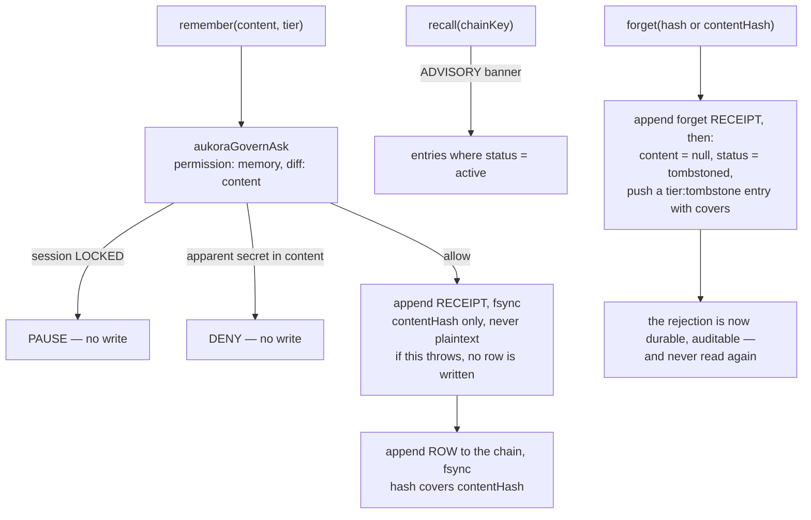
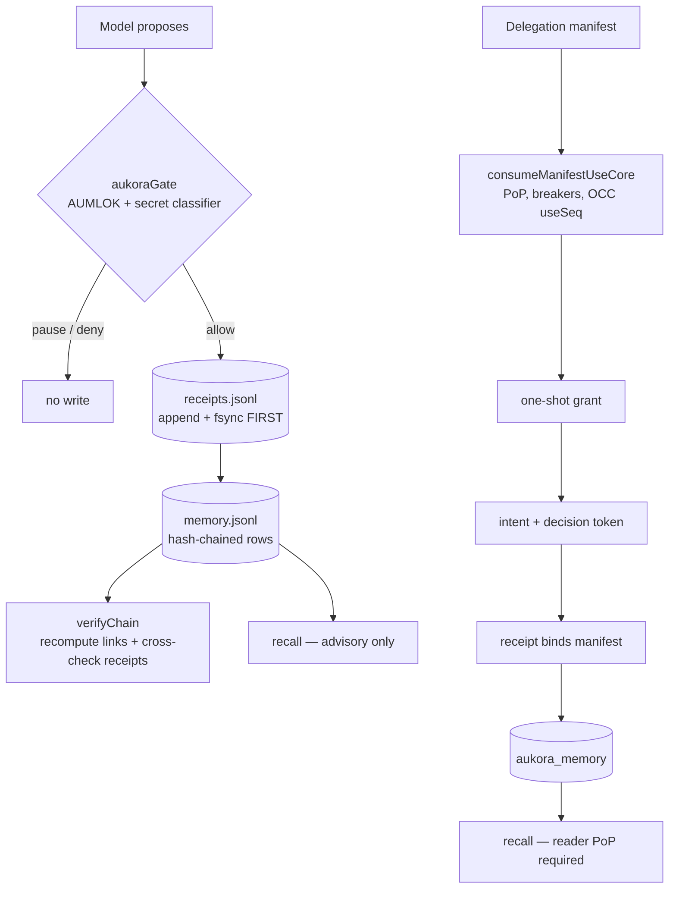

## 1. Executive Summary

Aukora is a research kernel whose organising sentence is on the front page:
*"A model proposes. The kernel verifies authority, advances replay state, and
drafts evidence. Adapters execute."* Memory is one effect among several routed
through that pipeline, and it is the most carefully built memory write path in
this atlas.

Three properties, each of which is rare here and all three of which are in one
238-line module:

- **Every durable write is authority-gated.** `remember` and `forget` both call
  `aukoraGovernAsk({ permission: 'memory', … })` — the same gate every
  write-capable tool uses. A locked session pauses the write; an apparent secret
  in the content denies it. The module's own words: *"Memory is never stored
  ungoverned."*
- **Every write is receipt-coupled and hash-chained**, and the ordering is
  fail-closed on purpose: the receipt is appended and fsynced *before* the row,
  so a row without a receipt is impossible while a receipt without a row is
  merely benign. `verifyChain` recomputes every link *and* cross-checks each
  entry against the independent receipts log, so a store-only rewrite is caught.
- **Forgetting erases the plaintext and keeps the chain.** `forget` nulls the
  content, marks the row tombstoned, appends a tombstone entry carrying
  `covers`, and emits a forget receipt — and because the chain hashes
  `contentHash` rather than plaintext, erasure does not break verification.

It is also the most honest repository in this atlas. `LIMITATIONS.md` calls
itself "the honest fence-line"; the code says *"HONEST LIMIT: it is NOT a
signature"* directly above the mechanism that might be mistaken for one, and
*"Tamper-evident, not tamper-proof"* in the docs. A dead demo path is labelled
"the superseded rehearsal demo … NOT an authority path" in its own header.

The finding is one `if` wide. `forget` durably records that a specific
`contentHash` was rejected — keyed on the value, auditable, with the plaintext
gone — and `remember` never consults it. Write the same content again and it is
stored again, active, as though nothing had happened. This is the closest any
system in the atlas comes to a rejected-value tombstone without earning the
mark, and it is closer on *privacy* than the systems that do earn it, because a
value-keyed tombstone must retain the wrong value in order to block it.

## 2. Mental Model

A memory is an entry on a per-`chainKey` hash chain. Its payload is
`{v, actor, chainKey, seq, operation, tier, contentHash, createdAt, covers?}`,
and the entry adds `hash`, `prevHash`, `content` (nullable) and
`status: 'active' | 'tombstoned'`.

`MemoryTier` is `'episodic' | 'fact' | 'tombstone'`, and the docstring is
explicit that the promotion between the first two is not implemented: *"Baby-seed
ceiling: episodic facts do not auto-promote to belief (that is an operator-gated
step, not done here)."* The tier is a caller-supplied argument defaulting to
`episodic`, and — see §5 — `recall` never reads it.



The epistemic stance is stated rather than implied, and it is unusual: **memory
navigates, it does not authorize.** `recall` returns a banner saying so on every
call — *"ADVISORY — memory NAVIGATES, it does NOT AUTHORIZE. Only the gate +
AUMLOK authorize effects."* No stored memory can cause an effect; only the gate
can. That is a cleaner separation of recall from authority than anything else
here, and it is the correct answer to memory-as-injection-surface: a poisoned
memory can mislead the model and cannot itself authorize anything.

## 3. Architecture

TypeScript, AGPL-3.0, with a Convex backend. Memory exists on two paths that do
not share an implementation.

**Path 1 — the symbiote store** (`apps/symbiote/memory/`, 338 lines across
`memory.ts`, `chain.ts`, `cli.ts`, plus an embedder daemon and a boot-recall
runtime). Two JSONL files under `${AUKORA_SYMBIOTE_HOME:-~/.aukora-symbiote}`:
the store and an independent receipts log. Cross-session persistence is stated
plainly in the header — *"the store is a file outside any session's context
window, so a brand-new session reads what a prior session wrote."*

**Path 2 — the Convex boundary** (`convex/aumlokMemory.ts`,
`aumlokManifests.ts`, ~500 lines). A delegation manifest is the authority for a
one-shot kernel grant, which flows through grant → intent → decision token →
receipt → `aukora_memory` row, in **one Convex mutation and therefore one
serializable transaction**. A use is spent if and only if the whole mutation
commits, and two concurrent writes on the same `useSeq` conflict on the manifest
row so exactly one commits.



### Deployment and ergonomics

- **What has to run:** for path 1, nothing — two JSONL files and a Node process.
  For path 2, a Convex deployment.
- **Local and offline: yes** for the symbiote store, and no model is required.
  An embedder daemon exists but the recall path read here is chain-ordered, not
  embedding-ranked.
- **No API key is needed to store anything.**
- **Hand-repairable: partly, and deliberately not fully.** The files are JSONL
  you can read, but editing one breaks `verifyChain`, which is the point. The
  store is also on the gate's SENSITIVE denylist, so a governed edit to it is
  refused.
- The project describes itself as **PROVEN-LAB, not production**, and repeats
  that in the module headers. Take it at its word.

## 4. Essential Implementation Paths

**Write.** `remember` (`apps/symbiote/memory/memory.ts:109`) — gate, then
`loadEntries`, `headFor(chainKey)` for `prevHash`/`seq`, `sha256Hex(content)`,
`buildReceiptChainHash(payload, prevHash)`, `appendReceiptDurable` **then**
`writeEntries`. The comment at the ordering is explicit: *"durably append the
RECEIPT FIRST (no plaintext — contentHash only). If this throws, NO row is
written."*

**Gate.** `apps/symbiote/authority/gate/opencodeAskBridge.ts` — reads an AUMLOK
session file that *"defaults to LOCKED → write-capable tools PAUSE until an
AUMLOK session is explicitly unlocked."* `types.ts` defines
`GateEffect = 'allow' | 'deny' | 'pause'`, and records an "always allow"
preference while noting it is *"NEVER used to skip the Aukora risk decision"*.

**Read.** `recall` (line 142) — filters `chainKey`, `status === 'active'`,
`operation === 'remember'`, `content != null`, sorts by `seq`, slices to a
limit, and returns the advisory banner. A corrupt store surfaces as
`corrupt: true` with zero facts rather than reading as empty.

**Forget.** `forget` (line 159) — selectable by `hash` **or** `contentHash`,
gate-checked, receipt-first, then `target.content = null`,
`status = 'tombstoned'`, `forgottenAt`, and a pushed tombstone entry whose
payload carries `covers: target.hash`.

**Verify.** `verifyChain` (line 213) — recomputes each hash from
payload+prevHash, checks link continuity, and cross-references
`memoryReceiptIndex()` for matching `seq`/`prevHash`/`contentHash`. Entries
present with an empty receipts log is **not ok** — it returns "unverifiable".

**Convex authority.** `convex/aumlokMemory.ts` → `consumeManifestUseCore` and
`resolveManifestAuthority` in `aumlokManifests.ts`.

**Tests.** `tests/aumlokMemory.test.ts` (the manifest boundary),
`tests/nodeImportMemory.test.ts`, `tests/aumlokPrivacy.test.ts`.

## 5. Memory Data Model

The schema is small and every field earns its place: `actor` for attribution,
`chainKey` for timeline identity, `seq` and `prevHash` for order and linkage,
`contentHash` so the chain survives erasure, `covers` to bind a tombstone to
what it retired, `status` and `forgottenAt` for the RTBF state.

Two honest gaps in it:

**The tier is stored and never applied.** `MemoryTier` distinguishes `episodic`
from `fact`, which is the candidate/belief distinction this atlas looks for. But
the tier arrives as a caller argument, nothing validates it, and `recall`'s
filter does not mention it — so a `fact` and an `episodic` entry are returned
identically. The header is candid that promotion is out of scope for this round.
That is the definition of a scope key stored as a tag and not applied, so
`trust_state` is withheld.

**Chain identity is not principal identity.** The header states it directly:
*"Chain identity is PER-CHAINKEY … the actor is recorded per entry for
attribution (NOT a separate per-actor chain)."* So on the symbiote path, `actor`
never filters anything.

**Scope is earned on the Convex path, not the file path.** There, memory is
addressed on a `mem:{owner}:{key}` effect chain, reads require a reader
proof-of-possession bound to a domain, and revoking a manifest severs the
subject while leaving the owner unaffected — all exercised in tests. That is a
stored scope key applied on the read path and enforced cryptographically, so
`scope_enforced` is marked, with the caveat that the local store's `chainKey` is
a timeline rather than a principal.

There is no validity interval, so nothing here is bi-temporal: `createdAt` and
`forgottenAt` are both record times.

## 6. Retrieval Mechanics

Deliberately minimal, and the minimalism is the design. `recall` is chain-ordered
— filter by `chainKey`, take the tail — with no ranking, no similarity, no
recency weighting and no query at all. An `embedder-daemon.ts` and a
`bootRecall.ts` runtime exist alongside, so semantic recall is clearly intended;
the path read here does not use them.

Two behaviours worth stealing regardless of scale:

- **The advisory banner is returned with every result**, not documented
  somewhere. Whatever consumes recall is told, in the payload, that this content
  cannot authorize anything.
- **A corrupt store is surfaced, not swallowed.** `loadEntries` throws on a
  malformed line and `recall` converts that to `corrupt: true, facts: []` with
  the banner amended to `[STORE CORRUPT — recall withheld]`. The failure mode
  this avoids — a corrupt store reading as a clean empty one — is exactly how a
  memory system silently forgets everything.

The ceiling is the obvious one: a chain-ordered tail does not scale, and there is
no mechanism by which a relevant old memory surfaces because it is relevant.

## 7. Write Mechanics

Writes are **synchronous, gated, and free of any model**. The gate call is the
only pre-condition, `sha256Hex` and the chain hash are the only computation, and
two `fsync`s are the only cost. There is no extraction, no consolidation, no
deduplication, and no background pass anywhere on the memory path.

The secret classifier is the one content filter: the content rides into the gate
as `metadata: { diff: input.content }` specifically so the classifier scans it,
and a detected secret denies the write. So *"we never durably store secrets"* is
enforced on the write path rather than asserted in a README.

Conflict handling does not exist, because supersession does not exist: two
contradictory `remember` calls both persist as active entries on the same chain,
and `recall` returns both. Correction is available only as `forget` followed by a
new `remember`, performed by whoever noticed.

### Operational cost

- **Synchronous and cheap.** Two fsyncs per write, one gate call, no network and
  no model.
- **Lag before a memory is retrievable: none.** The write returns after the row
  is durable.
- **No background pass exists**, so nothing rewrites the store and the token bill
  for memory is zero.
- **The store is rewritten whole on every write.** `writeEntries` serialises all
  entries and `openSync(file, 'w')` truncates — so write cost is O(store) per
  remember, and the JSONL append-only appearance is not how it is persisted. On a
  small governed store that is fine; it is the first thing that breaks at scale.
- **On the read path**, `recall` takes a `limit` and nothing else bounds the
  injected volume.

## 8. Agent Integration

The consumer is Auma, the IDE agent, through `apps/symbiote/memory/cli.ts` and a
boot-recall runtime that loads context at session start. The gate bridge is
generic — `OpenCodeAskReq` is described as *"a generic per-action ask request,
not tied to any specific external tool"* — and the header notes, with a dated
issue reference, that a previously-documented external integration and patch
script **did not exist in the repository** and the docstring was corrected. That
kind of self-correction in a comment is rare and worth naming.

Agency is narrow by construction: the model proposes a write, the gate decides,
and recall is advisory. The model cannot promote a tier, cannot bypass the gate
with a remembered preference, and cannot cause an effect by remembering
something.

## 9. Reliability, Safety, and Trust

**The audit trail is real and it is the strongest in the atlas.** Two
independent append-only artifacts, cross-checked: an entry whose hash is absent
from the receipts log fails verification with `no matching receipt … (store-only
forge?)`. Receipts never contain plaintext — only `contentHash` — so the audit
log is not a second copy of the data it audits. Both files are fsynced. This
earns `audit_log` without qualification.

**And the scope of that guarantee is stated by the code, correctly.**
`verifyChain`'s docstring: it proves internal consistency and receipt-backing, so
a store-only rewrite is caught, and *"It is NOT a signature: a determined raw-FS
attacker who rewrites BOTH the store and the receipts log consistently is only
defeated by the SIGNED chain head (Ed25519, … mounted in Step 4)."* The
system knows exactly which attacker it defeats and says so.

**Fail-closed is applied consistently**, and each instance is annotated with why:
a corrupt store throws rather than reading empty; a missing receipts log makes a
non-empty chain unverifiable rather than ok; a forget over a corrupt store is
refused so erasure never happens atop corruption; the AUMLOK session defaults to
locked.

**The tombstone is the near-miss.** `forget` produces a durable, auditable,
value-keyed record that a specific `contentHash` was rejected, with the plaintext
erased — and `remember` computes `contentHash` and never checks it against
tombstones. The same content can be re-remembered immediately, arriving active.
The atlas's definition requires that later extraction *cannot re-assert* the
rejected value, so the mark is withheld. Two things follow, and the second is the
more interesting:

1. The gap is one membership check on the write path, over data the system
   already stores and already keys correctly.
2. Because the record is a hash rather than the value, this design would be
   *better* than the three systems that hold the mark. Verel, RainBox and Daimon
   must retain the rejected value in order to block it; Aukora would block it
   while having erased it. That is the construction the
   [encryption note](https://github.com/neoneye/agent-memory-atlas/blob/main/notes/2026-07-29-what-survives-encryption.md)
   argued for, sitting in production-shaped code with the check missing.

**Human review is withheld** and the near-miss is worth a sentence: AUMLOK
unlocks a *session*, after which writes pass the lock check for the window. An
operator authorizes the window; nobody adjudicates the item.

## 10. Tests, Evals, and Benchmarks

The memory tests are about **authority**, not recall quality, and they are the
best negative-assertion suite in the atlas after Verel's.

`tests/aumlokMemory.test.ts` covers: a valid manifest producing one authorized
write and a verifiable receipt binding it; wrong action, ring or resource-scope
refusing with **no memory row**; a revoked root key killing delegated authority;
revoked, paused and expired manifests refusing; `maxUses` exhaustion; a
double-consume on the same `useSeq` refused (no double-spend); a manifest bound
to another node granting nothing; and a subject PoP forgery refused.

The read-side test earns `negative_eval` outright, because it asserts denial
*and* keeps a positive control in the same block:

```text
owner (root PoP)      → "the secret"
subject (subject PoP) → "the secret"
demo.eve (attacker)   → ok: false          ← unrelated principal cannot retrieve
…revoke the manifest…
subject               → ok: false          ← severed
owner                 → "the secret"       ← and the denial is targeted, not a blanket failure
```

A companion test refuses a spoofed principal, a spoofed owner, and a *right key
with the wrong domain* — `reader_pop_invalid` for all three.

Two tests assert properties of the source itself: that the live boundary never
touches the frozen B0 delegation lane, and that the module writes `aukora_memory`
only through the manifest chokepoint. Asserting a chokepoint by grepping your own
source is a cheap and unusually direct way to keep an authority boundary from
eroding.

**What is not tested:** the symbiote JSONL path has no test asserting that a
forgotten `contentHash` cannot be re-remembered — which is unsurprising, since
the behaviour it would assert does not exist. Nor is `verifyChain` exercised
against a doctored receipts log in what was read here.

## 11. For Your Own Build

### Steal

- **Append the receipt before the row, and fsync both.** It makes the dangerous
  orphan — a durable memory with no audit record — structurally impossible, and
  leaves only the benign one. Four lines of ordering, and the comment explaining
  the asymmetry is what makes it survive a refactor.
- **Hash the content, not the plaintext, into the chain.** Erasure then leaves
  verification intact, which is what lets a right-to-be-forgotten path coexist
  with a tamper-evident log at all.
- **Route memory writes through the same gate as every other effect.** A separate
  memory-write policy is a second policy to keep correct; reusing the tool gate
  means a secret is refused by the code that already knows what a secret is.
- **Return the advisory status in the payload.** A banner saying "this cannot
  authorize anything" travels with the data; a sentence in the docs does not.
- **Surface a corrupt store instead of reading it as empty.** The alternative is
  a system that silently forgets everything and reports success.
- **State the attacker you do not defeat, next to the mechanism.** "HONEST LIMIT:
  it is NOT a signature" prevents the next reader from over-trusting the chain,
  and costs one comment.

### Avoid

- **Recording a rejection you never read.** A tombstone that no write path
  consults is an audit artifact, not a correction mechanism. If you store
  `contentHash` on forget, check it on remember — otherwise the user who asked
  you to forget something watches it come straight back.
- **Storing a tier the read path ignores.** `episodic` versus `fact` is the right
  distinction and it changes nothing at this commit; a field that no query filters on
  will be assumed to work by the next person who reads the schema.
- **Rewriting the whole store per write** while presenting it as an append-only
  log. It is O(n) per remember and it is not what the file extension implies.

### Fit

This suits someone building an agent where the *provenance of a write* matters
more than the recall quality — regulated work, audit-facing tooling, or anything
where "prove this memory was authorized and has not been altered" is a real
question. Nothing else in this atlas answers that question as well, and the code
is small enough to read in an afternoon.

It is not a memory system for scale or for recall. Chain-ordered retrieval, a
whole-file rewrite per write, and no consolidation put a low ceiling on corpus
size, and the project says PROVEN-LAB in four places rather than letting you
discover it. If what you need is "find the relevant thing among fifty thousand",
this is the wrong shape and the authors would tell you so.

The interesting middle case is borrowing the *write path* alone. The gate,
receipt-first ordering, chained hashes over content hashes, and RTBF-by-erasure
are separable from the retrieval design, and any of them would improve a system
whose recall is already good.

## 12. Open Questions

- **Is the tombstone check intended?** `forget` accepts a `contentHash` selector,
  which is exactly the key a re-assertion guard would need, so the data model
  anticipates the check that is missing. Whether that is a deliberate scope
  boundary or an unfinished edge is not stated.
- **What mounts the embedder?** `embedder-daemon.ts` and `bootRecall.ts` exist;
  the recall path read here is chain-ordered. Which one runs in the IDE agent was
  not determined.
- **Does the Convex path share the symbiote chain?** They are two stores with two
  authority models; whether anything reconciles them, or whether one supersedes
  the other, is not visible here.
- **Is the Ed25519 signed head implemented anywhere in this checkout?** It is
  referenced as "Step 4" and as the thing that would defeat a two-file rewrite.
- **How large can the JSONL store get** before the whole-file rewrite becomes the
  binding constraint? No cap, prune or rotation was found.

## Appendix: File Index

**Local memory path**

- `apps/symbiote/memory/memory.ts` — `remember`, `recall`, `forget`,
  `verifyChain`, `loadEntries`, `writeEntries`, `appendReceiptDurable`
- `apps/symbiote/memory/chain.ts` — `sha256Hex`, `buildReceiptChainHash`
- `apps/symbiote/memory/cli.ts`
- `apps/symbiote/memory/runtime/bootRecall.ts`,
  `apps/symbiote/memory/embedder/embedder-daemon.ts`

**Authority gate**

- `apps/symbiote/authority/gate/opencodeAskBridge.ts` — `aukoraGovernAsk`
- `apps/symbiote/authority/gate/aukoraGate.ts`, `types.ts`, `risk.ts`,
  `sensitivePolicy.ts`

**Convex memory boundary**

- `convex/aumlokMemory.ts` — the manifest-enforced write
- `convex/aumlokManifests.ts` — `consumeManifestUseCore`,
  `resolveManifestAuthority`
- `convex/memory.ts` — labelled in its own header as the superseded demo path

**Evidence**

- `src/evidence/` — `canonical.ts`, `catalogue.ts`, `digest.ts`, `validate.ts`

**Disclosure**

- `LIMITATIONS.md`, `CLAIMS.md`, `SECURITY.md`, `ORGANISM.md`

**Tests**

- `tests/aumlokMemory.test.ts` — authority and the read-denial suite
- `tests/nodeImportMemory.test.ts`, `tests/aumlokPrivacy.test.ts`

## History

**2026-07-29** — [`b441edc4d17de778d30ae955f46408edae39bffe`](https://github.com/aumara-xyz/aukora-kernel/commit/b441edc4d17de778d30ae955f46408edae39bffe) — first reading.
