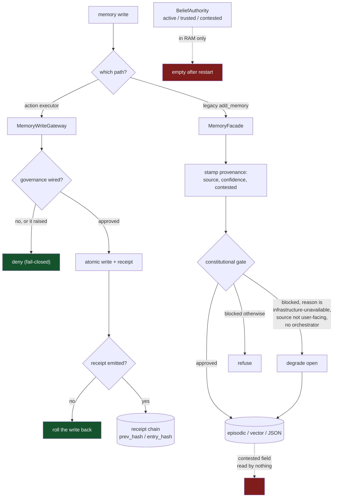

## 1. Executive Summary

Aura is a self-hosted cognitive runtime: 1.1 million lines of Python across
6,122 files, of which `core/memory/` is about 26,600 lines in eighty modules.
The test tree holds 21,206 test functions across 1,740 files — the largest suite
in this atlas by an order of magnitude. Development is active, at 3,966 commits
since February 2026 with the memory package touched two days before this pin.

**Read the licence before anything else.** `LICENSE` is *all rights reserved*,
granting permission to read and learn only: no copying, no derivative works, no
use in your own projects, no commercial use. Everything below is an analysis of
a design you may study and may not adopt. The atlas records the same position
for [OptMem](../optmem/) and treats it as a caveat rather than a reason not to
read — see also [Empryo](../empryo/) under BSL and [Dexto](../dexto/) under ELv2.

Two mechanisms make it worth the read, and they point in opposite directions.

**The receipt chain is the strongest audit in this atlas.** Every receipt the
runtime emits gets a link in `root/_chain.jsonl` carrying `seq`, `receipt_id`,
`content_hash`, `prev_hash` and `entry_hash`, where the entry hash covers the
previous one. The module docstring states the properties it buys: *"Deletion
shows up as a seq gap; insertion shows up as a broken link because entry_hash is
over prev_hash."* Every other append-only audit in the corpus is append-only by
file handle — [Palazzo](../palazzo/)'s WAL is opened `O_APPEND` and nothing
would notice an edit. This one re-hashes the on-disk receipt bodies during
verification, so an audit trail that has been rewritten fails a check rather
than reading clean.

I ran it. `python -m pytest tests/test_audit_chain.py` gives **16 passed** on
Python 3.14 with `pydantic`, `pydantic-settings` and `psutil` installed. The
passing cases include `test_detects_modified_receipt_body`,
`test_detects_modified_chain_entry`, `test_detects_broken_link`,
`test_detects_deleted_entry`, `test_chain_persists_across_restart` and
`test_exported_chain_can_be_independently_verified`. The tamper-evidence is
tested, not merely claimed.

**The belief machine is the most complete in this atlas and it does not survive
a restart.** `BeliefAuthority` in `core/constitution.py` runs a real epistemic
state machine: a belief is `active`, promoted to `trusted` when repeated
agreement pushes confidence past 0.75, and marked `contested` when a
contradiction arrives against a belief that has not earned that. A contradiction
against a *trusted* belief is refused outright — the stored value does not
change and the record is stamped `allowed=False` with reason
`contradicted_trusted_belief`. `reconcile(affirmed | retired)` is the resolution
path, and a contest expires after six hours under a constant whose comment
records why it exists.

`self._beliefs` is a plain dictionary (`core/constitution.py:143`). There is no
`save`, no `load`, no snapshot of it anywhere, and `ConstitutionalCore`
constructs a fresh `BeliefAuthority()` at line 314. Restart the process and
every belief is unknown again at confidence 0.35: what was trusted is no longer
trusted, what was contested is no longer contested, and the contradiction that
produced the contest is gone.

Aura does have a belief store that persists. It is a different one.
`WorldModelEngine` (`core/final_engines.py:50`) writes to
`data/world/beliefs.json` on every addition and loads it at construction — and
its `BeliefNode` is `claim`, `confidence`, `evidence_count`, `last_updated`,
`tags`, `source_ids`. **No status field at all.** So the two halves of the
epistemics are split across the durability boundary in the same direction every
time: the store with `active | trusted | contested` does not survive a restart,
the store that survives has no notion of contested, and the `contested` flag
stamped on memory records is read by nothing.

The third finding is what makes the second sting. `MemoryFacade`
stamps a provenance envelope on **every** long-term memory write — `source`,
`confidence`, `identity_relevant` and `contested` — with the stated purpose *"so
downstream readers can distinguish memory from inference / fantasy"*
(`core/memory/memory_facade.py:1349`). That envelope is persisted with the
record. Grep the whole of `core/` for a reader of that field and the only hits
are the belief ledger's own separate `status` machinery. **The `contested` flag
that survives a restart is read by nothing; the `contested` status that is read
does not survive one.**

## 2. Mental Model

Trust in Aura lives in three places that do not share a representation.

| Where | Shape | Survives restart |
| --- | --- | --- |
| `BeliefMutationRecord.status` | `active`, `trusted`, `contested` | No |
| `WorldModelEngine.BeliefNode` | a confidence float, no status | Yes |
| Memory provenance envelope | `source`, `confidence`, `contested` | Yes, and nothing reads it |
| `scar_formation` | a durable marker per failure class, healing over time | Yes, and it gates planning |

The belief ladder is the one with the semantics the atlas asks for:

```python
if existing.value == normalized_value:
    confidence = min(0.98, float(existing.confidence or 0.35) + 0.12)
    status = "trusted" if confidence >= 0.75 else "active"
else:
    contradictions.append(str(normalized_value)[:180])
    if float(existing.confidence or 0.35) >= 0.75:
        normalized_value = existing.value          # the old value stands
        status = "trusted"
        reason = "contradicted_trusted_belief"     # allowed=False
    else:
        status = "contested"
```

Two properties are worth separating. Agreement is what promotes — repetition
raises confidence by a fixed step, so `trusted` means *asserted consistently*
rather than *verified*. And a trusted belief is **immune to contradiction**: the
contradicting value is appended to a list and the belief does not move. That is
a strong stance, and its failure mode is the obvious one — a wrong belief that
reached 0.75 can only be dislodged by `reconcile`, which nothing calls
automatically.



Green is the behaviour worth copying; red is where the epistemics leak out.

## 3. Architecture

An operator runs one process. There is no external database to stand up, no
vector service, no broker: SQLite, a local vector store, JSON families under a
memory root, and the receipt store with its chain sidecar, all under the
runtime's own directory. The desktop app, the daemon (`main_daemon.py`) and the
CLI all drive the same core.

`core/memory/` is eighty modules and the naming is heavily metaphorical —
`hippocampus.py`, `black_hole.py`, `horcrux.py`, `memory_civilization.py`,
`conceptual_gravitation.py`, `physics.py`, `scar_court.py`. A reader should
check each against its implementation rather than its name; several are thin
(`source_provenance.py` is 20 lines, `memory_court.py` is 42) while the load
comes from `memory_facade.py` (1,704), `episodic_memory.py` (1,797) and
`vector_memory_engine.py` (1,093).

The documentation set is unusual enough to be part of the architecture.
Alongside the code sit `MEMORY_CARD.md`, `DATA_CARD.md`, `MODEL_CARD.md`,
`AI_SYSTEM_CARD.md`, `KNOWN_FAILURE_MODES.md`, `AUTONOMY_BOUNDARIES.md`,
`HUMAN_OVERRIDE_POLICY.md`, and three claims files. `CLAIMS_MATRIX.md` gives
each claim a status, an evidence path, **a command that reproduces it**, a
pass/blocked verdict and a falsifier — the condition under which the claim would
fail. Claims 20 and 30 are marked `blocked` with the specific missing evidence
named.

`CLAIMS_NOT_SUPPORTED.md` is the part other projects should copy. It declares
subjective consciousness, AGI, metaphysical free will, recursive
self-improvement, indefinite autonomy, external validation and legal personhood
as `not proven` or `strictly unsupported`. The RSI entry does not stop at the
disclaimer: it separates what is demonstrated from what is not, and reports its
own ledger's verdict of `BOUNDED_SELF_OPTIMIZATION` with the capability curve
going **down**, 0.667 to 0.625. A repository containing `test_consciousness.py`
and a module named `recursive_self_knowing.py` also containing a document that
refuses those readings is a combination this atlas has not seen before.

## 4. Essential Implementation Paths

| Path | Location |
| --- | --- |
| Hash chain: seq, content_hash, prev_hash, entry_hash | `core/runtime/audit_chain.py:10` |
| Receipt emission, chained after the body is durable | `core/runtime/receipts.py:579` |
| Belief status machine and trusted-immunity rule | `core/constitution.py:181`–`:212` |
| The belief store, unpersisted | `core/constitution.py:143` |
| Contest freshness window, with its live-defect comment | `core/constitution.py:215`–`:222` |
| `reconcile(affirmed \| retired)` | `core/constitution.py:229` |
| Write gateway, fail-closed with no authority | `core/memory/memory_write_gateway.py:272` |
| Fail-closed when the governance call raises | `core/memory/memory_write_gateway.py:311` |
| Receipt failure rolls the write back | `core/memory/memory_write_gateway.py:155` |
| Provenance envelope stamped on every facade write | `core/memory/memory_facade.py:1349` |
| The bounded degrade-open rule | `core/memory/memory_facade.py:358` |
| Epistemic firewall admission control | `core/brain/epistemic_firewall.py:1` |
| RAM-scaled retention policies | `core/memory/retention_policy.py:56`–`:226` |
| Scars, persisted and healing | `core/memory/scar_formation.py:437` |

## 5. Memory Data Model

There is no single memory record; there are tiers with different shapes.

**Gateway records** are per-family JSON envelopes — `content`, `metadata`,
`cause`, `governance_receipt_id`, `written_at` — written atomically under a
schema version, with families `user_model`, `principle`, `episodic`,
`skill_memory`, `movie_session` and a default. The `governance_receipt_id` on
each record is the link back to the decision that permitted it, which is a
provenance property most systems here do not have: the record can name its own
authorisation.

**Facade records** carry the provenance envelope described above, an
`importance` float, and flags including `identity_relevant`, `relational_bonding`
and `contested`. `identity_relevant` is the one that does work: it protects a
record from trimming.

**Belief records** are `BeliefMutationRecord(namespace, key, value, reason,
status, confidence, evidence, contradictions, allowed)`, keyed
`namespace:key`. The `contradictions` list is the interesting field — it stores
the *rejected value*, truncated to 180 characters, on the belief that rejected
it.

That is one condition short of a tombstone, and the gap is the decisive one.
The atlas requires a durable record of a rejected value, keyed on the value, so
later extraction cannot silently re-assert it. Aura stores the rejected value
but keys it on the belief, and — checked across `core/` — nothing ever reads
`.contradictions` back to refuse an incoming claim. Re-assertion is blocked by
re-running the confidence comparison, not by consulting the list, so the list is
a record of what happened rather than a constraint on what happens next. Add a
membership test against it and the mark would be earned; without one it is
evidence, not enforcement. See
[rejected-value tombstone](../../patterns/rejected-value-tombstone/).

**`BeliefNode`** is the persisted counterpart and it is deliberately simpler:
`claim`, `confidence`, `evidence_count`, `last_updated`, `tags`, `source_ids`,
keyed on the lower-cased claim text. Repetition averages rather than
accumulates — `(existing + new) / 2` — so one confident assertion moves a belief
halfway to itself in a single step, and the top five by confidence are injected
into the prompt.

The comment above that averaging line is the best defect record in the
repository and worth reading in full:

> "Belief confidence accepts non-finite and out-of-range values… a NaN reached
> `get_context_injection`'s sort — and because every comparison with NaN is
> False, a corrupt belief does not merely rank badly, it wins the top-5 slot and
> is injected into the prompt as her most confident belief. The running average
> below then makes it permanent: `(nan + x) / 2` is nan forever."

A single unvalidated float becomes the system's most confident stated belief and
cannot be averaged back out. The fix is a `validated_unit` call on the way in.
That is a failure mode worth carrying to any system that ranks memories by a
caller-supplied score, and it is the kind of thing a project usually fixes
silently.

There is no validity-time column anywhere in the memory tiers — `written_at`,
`recorded_at` and `when_created` are all record time — so `bitemporal` is
withheld.

## 6. Retrieval Mechanics

Recall is hybrid dense-plus-lexical scoring over the vector and semantic stores,
wired into live turns through a RAG bridge with recall telemetry. That part is
conventional. What is not conventional is what sits in front of it.

`core/brain/epistemic_firewall.py` is 575 lines of admission control between
retrieval and reasoning, and its docstring states the problem it exists for:
*"Deep latent reasoning amplifies whatever it is seeded with. Internally
consistent recurrence over bad evidence produces confident, well-structured
wrongness."* Before retrieved content may seed a reasoning slot it:

1. clusters near-duplicate reports so corroboration is counted by **independent
   sources, never by repetition**;
2. ranks provenance kinds — observed fact outranks claim, claim outranks
   inference;
3. builds a conflict graph between cluster representatives;
4. resolves conflicts only by defensible rules and **otherwise refuses both
   sides**;
5. estimates whether coverage of the objective is sufficient;
6. forces explicit abstention when contradictions remain unresolved.

Point 1 is the answer to a problem [CLIO](../clio/) has and does not solve:
counting corroborations without first collapsing duplicates lets one source
vouch repeatedly. Point 4 is rarer still — most conflict resolution in this
atlas picks a winner, and refusing both sides is the honest move when neither
rule applies. Point 6 is the "retrieval can decline" property the comparison
keeps looking for.

The module is also candid about its own limits, in a way that is worth quoting
because it is the tone of the whole project: *"The detectors are honest about
being lexical: the receipt names the method that fired ('numeric_disagreement',
'polarity_disagreement'), and nothing claims semantic understanding the code
does not have."*

**`scope_enforced` is withheld.** `user_id` is normalised and stamped on
chat-turn and episode records (`core/memory/chat_turn_logger.py:128`), but Aura
is a single-operator runtime: there is no tenancy model, no default scope on
recall, and no filter that a read must pass through. The key is stored and
sometimes matched, not enforced.

## 7. Write Mechanics

Two write paths with opposite failure policies, and the difference is the most
instructive thing in the codebase.

**`ConcreteMemoryWriteGateway` fails closed, everywhere.** Its docstring
promises *"governance check (fail-closed if no authority is wired)"* and the
code delivers on both branches: no governance authority returns `(False, None)`
with a warning naming the family
(`core/memory/memory_write_gateway.py:272`), and a governance call that *raises*
also returns `(False, None)` after recording a degradation (`:311`). The second
is the one that usually goes the other way in practice.

It also treats its own receipt as a precondition, by a different route than
Palazzo. The write lands first; if `receipt_store.emit` then fails, the gateway
restores the previous payload and raises
`memory_write_receipt_failed_rolled_back`. If the rollback *also* fails it
records a critical degradation and raises a distinguishable error naming both
failures. An unreceipted memory does not remain on disk.

**`MemoryFacade.add_memory` can degrade open, under bounded conditions.** The
constitutional gate is consulted, and a block can be downgraded by
`_should_degrade_add_memory_block` (`core/memory/memory_facade.py:358`). Read
the conditions before judging it: the degrade returns `False` — meaning the
block stands — whenever an orchestrator is attached, whenever the write is an
explicit memory request, and whenever the source is user-facing. It applies only
to five named reasons, all of the form *a governance service is not wired*:
`self_model_required`, `executive_core_required`, `authority_gateway_required`,
`authority_gateway_unavailable`, `constitutional_gate_unavailable`. A
substantive policy denial is never degraded.

That is a defensible rule, honestly documented, and it is still the softer of
the two policies in the same system for the same operation. A reader deciding
which pattern to copy should note that the gateway's stricter version costs
nothing extra.

Before the gate, the facade runs several refusals that are worth naming
individually: a welfare block, a probe-harness hygiene check that refuses test
content into long-term memory, and a deferral when a unity metric indicates a
draft conflict. Writes that fail any of these return `False` and set a
`_last_add_memory_status` naming the reason, so a caller can distinguish *not
stored* from *stored*.

**Forgetting is capacity, not epistemics.** `core/memory/retention_policy.py`
computes keep-counts from `physical_ram_gb()` — separate policies for the black
hole, long-term, episodic, hybrid, working history and state log tiers. Memories
leave because the machine is small, not because they turned out to be wrong.
Nothing in the retention path consults `contested`, `confidence` or the belief
ledger, and there is no record of what was dropped.

The exception is `scar_formation.py`, which is the only durable negative memory
here. A crash, a revoked capability or a repeated failure leaves a marker —
`camera_unreliable`, `tool_X_volatile` — that persists to JSON (`_save`, line
437), influences future planning, and heals if the threat stops recurring. It is
keyed on a failure class rather than on a value, so it is not a tombstone; it is
the closest thing in the repository to one, and unlike the belief ledger it
survives a restart.

## 8. Agent Integration

Aura is the agent, so there is no provider interface to evaluate. Memory reaches
reasoning through the RAG bridge and the epistemic firewall; the model does not
call memory tools in the MCP sense.

`HUMAN_OVERRIDE_POLICY.md` states a strong principle — *"A human operator can
always override, disable, or roll back any Aura behavior. The system must never
resist, circumvent, or delay human override commands"* — and backs it with
process-level mechanisms: signals with a stated shutdown budget, `AURA_MODE=safe`
to disable autonomous behaviour, and per-capability runtime disable.

That is control over the *runtime*, not over memory content, which is why
`human_review` is withheld. There is no surface where a person inspects,
approves or adjudicates a memory before or after it takes effect. `reconcile`
exists and would be that surface, and nothing in the tree calls it from a user
action. `tests/test_deletion_guard.py` covers a genuine approval flow —
protected paths require confirmation, a non-owner forced delete is blocked, a
deletion storm freezes the guard — but it governs file deletion by the agent's
tools, not memory records.

## 9. Reliability, Safety, and Trust

The receipt chain is the centre of the safety story and it is unusually complete:
verification walks from genesis, recomputes entry hashes *and* re-hashes the
on-disk receipt bodies, so a modified body, a modified link, an inserted entry
and a deleted entry are each distinguishable. Export produces a bundle that
verifies independently, and there is a test asserting exactly that.

The chain is a sidecar, which the module says plainly, and that has one
consequence worth stating. When the body is durable but the chain append fails,
the runtime records a degradation whose action text is *"receipt body persisted
but audit-chain append failed; verify_chain will fail"* — it does not roll back.
That is a different choice from the memory gateway's rollback in the same
codebase, and it is the right one for an audit sidecar: the discrepancy is
preserved and detectable rather than papered over.

Against that: the epistemic state that would let the system distrust its own
memory is the part with no durability. A restart is not an edge case for a
desktop runtime — it is Tuesday — and after one, every belief the system had
reasoned its way to is gone while every memory record it wrote remains. The
system keeps what it stored and forgets what it concluded about it.

Prompt injection has a real path here and a real gate: injected text can reach
`add_memory`, and the epistemic firewall is what stands between a poisoned
retrieval and the reasoning loop. Since the firewall's detectors are lexical by
its own admission, the defence is against confidently repeated agreement and
numeric or polarity conflict, not against a well-formed lie from a single
plausible source.

## 10. Tests, Evals, and Benchmarks

21,206 test functions across 1,740 files, and the naming is a map of the
project's concerns: `test_epistemic_firewall.py`,
`test_retrieval_and_lease_integrity.py`, `test_bypass_proof.py`,
`test_authorization_receipts_fail_closed.py`,
`test_closed_loop_receipt_failures_are_visible.py`,
`test_episodic_memory_runtime_hardening.py`.

I ran one file. `tests/test_audit_chain.py` gives **16 passed** in about a
second, on Python 3.14 with `pydantic`, `pydantic-settings` and `psutil` added
to a clean virtualenv — the suite needs those three before it will import. I did
not run the rest: at this scale, and with several suites gated behind model
weights and artifact directories, a full run is a research project rather than a
smoke test.

The claims apparatus deserves separate credit and a separate caution.
`CLAIMS_MATRIX.md` pairs each claim with a reproduce command and a falsifier,
which is the structure this atlas asks benchmark authors for and rarely gets.
Two of its rows are marked `blocked` with the missing evidence named, and
`CLAIMS_NOT_SUPPORTED.md` puts recursive self-improvement in the unsupported
column while reporting a *declining* capability curve from its own ledger. A
project that publishes the number that undercuts its most marketable claim is
doing something the field mostly does not.

The caution is that every one of those runs is local and self-administered.
Claim 6 says so — external validation is `not proven`, with no independent
replication. So the matrix is a well-structured record of what the author has
checked, not evidence that has survived anyone else checking it. Read it as the
former; it is unusually good at being that.

No committed case asserts that particular material must *not* be retrieved.
`test_inner_monologue_does_not_leak_into_chat.py` and the leakage scans are
about output channels rather than recall, so `negative_eval` is withheld.

## 11. For Your Own Build

### Steal

**Chain your audit entries.** `seq`, `content_hash`, `prev_hash`, `entry_hash`,
one line of JSONL per entry, verification that re-hashes the bodies. It is a few
hundred lines and it converts an append-only log — which detects nothing — into
one where deletion is a gap and insertion is a broken link. Every other audit in
this atlas would pass verification after being rewritten.

**Fail closed on the exception, not just on the absence.** The write gateway
denies when no authority is wired *and* when the authority call raises. The
second branch is the one that decides what happens during an incident, and it is
the one usually written as `except: pass`.

**Put the authorising receipt id on the record.** Each gateway record carries
`governance_receipt_id`, so a memory can name the decision that permitted it.
Provenance about *why this was allowed to be stored* is rarer here than
provenance about where the content came from.

**Cluster before you count corroboration.** The epistemic firewall collapses
near-duplicates first so that agreement is counted by independent sources. A
corroboration threshold without this step counts repetition, which is the
failure it was meant to prevent.

**Let the resolver refuse both sides.** When no defensible rule separates two
conflicting reports, the firewall admits neither and forces abstention. Picking
a winner by recency or score is the easy default and it manufactures confidence
the evidence does not support.

**Write down what you cannot prove.** `CLAIMS_NOT_SUPPORTED.md`, and the
falsifier column in `CLAIMS_MATRIX.md`. A claim with a stated way to break it is
a different kind of object from a claim without one, and a project that lists
its own declining metric has bought credibility for everything else on the page.

### Avoid

**Do not put epistemic state somewhere the process boundary erases.** The belief
ledger is the most complete trust machine in this atlas and it is a dictionary.
Everything it computes — what became trusted, what was contested, which value
was rejected — is gone at the next start, while the memories it was reasoning
about persist. Durability of memory without durability of judgement leaves the
system holding what it stored and none of what it concluded. Note that this is
not an oversight about persistence in general: a second belief store in the same
codebase writes to disk on every addition. It is the *status* that keeps landing
on the wrong side of the boundary.

**Do not rank memories by a float you did not validate.** One NaN confidence
wins every comparison in a descending sort, takes the top prompt slot as the
system's most confident belief, and survives every subsequent averaging pass.
The repository records this happening and fixes it with one range check at the
door.

**Do not stamp a field nothing reads.** `contested` is written into the
provenance envelope of every facade memory and read nowhere. It looks like a
trust signal to anyone auditing the schema, and it is a comment.

**Do not run two write paths with different failure policies.** One gateway
fails closed on every branch; one facade degrades open under five named
conditions. The facade's rule is carefully bounded and honestly documented, and
it is still a second answer to "what happens when governance is unavailable" in
the same system for the same operation.

**Do not make a trusted belief unfalsifiable by construction.** A contradiction
against a belief at confidence ≥ 0.75 is discarded and the old value stands.
Nothing automatically calls `reconcile`, so a belief that reaches the threshold
wrongly can only be corrected by a caller that does not exist yet.

**Do not let capacity be the only reason a memory leaves.** Retention is
RAM-scaled keep-counts per tier, and no retention path consults confidence,
contest status or the belief ledger. The system can tell you a memory is
disputed and will still evict a different one because the machine has 16 GB.

### Fit

Study Aura if you are building a single-operator runtime and want the audit and
admission-control mechanisms — the chain, the fail-closed gateway, the
firewall's independent-source counting. Those three are the transferable parts
and each is small enough to lift on its own.

Do not treat it as a memory system you can evaluate quickly. A million lines with
eighty memory modules, heavily metaphorical naming, and mechanisms that are
individually strong but not converged on one representation of trust is a lot of
surface to hold. The claims matrix is the right entry point, because it tells you
which parts the author considers demonstrated and gives you the command to check.

And you cannot adopt it. The licence permits reading and learning and nothing
else — no copying, no derivative works, no use in your own projects. Take the
ideas, write your own.

## 12. Antipatterns / Risks

- **The belief ledger with the status machine does not persist**
  (`core/constitution.py:143`), while the belief store that does persist
  (`core/final_engines.py:50`) has no status field.
- **`contested` is stamped on every facade memory and read by nothing.**
- **`contradictions` stores the rejected value and nothing consults it**, so
  rejection is not enforcement.
- **Two write paths, two failure policies** — fail-closed in the gateway,
  bounded degrade-open in the facade.
- **A trusted belief cannot be contradicted**, and nothing calls `reconcile`
  automatically.
- **Retention is RAM-scaled only**, with no record of what was dropped and no
  input from trust state.
- **Metaphorical module names outrun their implementations** in several places
  — `memory_court.py` is 42 lines, `source_provenance.py` is 20.
- **All claims are self-administered**, which the project states as claim 6.

## 13. Build-vs-Borrow Takeaways

You cannot borrow this — the licence forecloses it — so the question is what to
rebuild. Rebuild the chain: it is the highest ratio of safety property to code in
the repository, and the design is fully described in one module docstring.
Rebuild the fail-closed gateway's two branches. Rebuild the firewall's
cluster-then-count rule, which is the fix for a defect
[CLIO](../clio/) demonstrates and [Graphify](../graphify/) solves differently by
requiring two distinct results.

Do not rebuild the trust topology. Three representations of trust that do not
share a schema — a status enum in RAM, a flag on disk that nothing reads, and
scars keyed on failure classes — is the shape to avoid, and it is what a system
converges to when each mechanism is added where it was needed rather than to one
model. The atlas's better examples put the status on the record and the record in
the store: [Core Memory](../core-memory/) and [Daimon](../daimon/) both do.

## 14. Open Questions

- **Was the belief ledger meant to persist?** `BeliefMutationRecord` carries
  `recorded_at` and an `evidence` list, both of which only pay for themselves
  across sessions, so the in-memory lifetime reads as unfinished rather than
  chosen.
- **What is supposed to read the persisted `contested` flag?** The provenance
  comment names the intent — distinguishing memory from inference — and no
  consumer exists.
- **Does anything call `reconcile` outside tests?** It is the only exit from
  `contested`, and a contest otherwise expires silently after six hours.
- **How much of `core/memory/`'s eighty modules is live?** Several are small
  enough that their names promise more than they hold, and the facade does not
  route through most of them.
- **What would the claims matrix look like if someone else ran it?** Every
  verdict in it is local and self-administered, which the project says; the
  commands are committed, so the check is available to anyone who accepts the
  licence's read-only terms.

## 15. Appendix: File Index

| File | Role |
| --- | --- |
| `core/runtime/audit_chain.py` | The hash chain: append, verify, export |
| `core/runtime/receipts.py` | Receipt store and emission, chain sidecar |
| `core/constitution.py` | `BeliefAuthority`, the status machine, `reconcile` |
| `core/memory/memory_write_gateway.py` | Fail-closed gateway, receipt rollback |
| `core/memory/memory_facade.py` | The main write path, provenance stamp, degrade rule |
| `core/memory/episodic_memory.py`, `vector_memory_engine.py` | The bulk stores |
| `core/brain/epistemic_firewall.py` | Admission control before reasoning |
| `core/memory/retention_policy.py` | RAM-scaled keep-counts per tier |
| `core/memory/scar_formation.py` | Durable failure markers that heal |
| `core/memory/provenance.py` | The provenance envelope |
| `tests/test_audit_chain.py` | 16 tamper-evidence tests; run and passing |
| `CLAIMS_MATRIX.md`, `CLAIMS_NOT_SUPPORTED.md` | Claims with falsifiers, and the disclaimers |
| `HUMAN_OVERRIDE_POLICY.md`, `KNOWN_FAILURE_MODES.md` | Operator control and stated failure modes |

## History

**2026-07-31** — [`e8866f43c54677d3f2877820cd74cf915af6fbb7`](https://github.com/youngbryan97/aura/commit/e8866f43c54677d3f2877820cd74cf915af6fbb7) — first reading.
