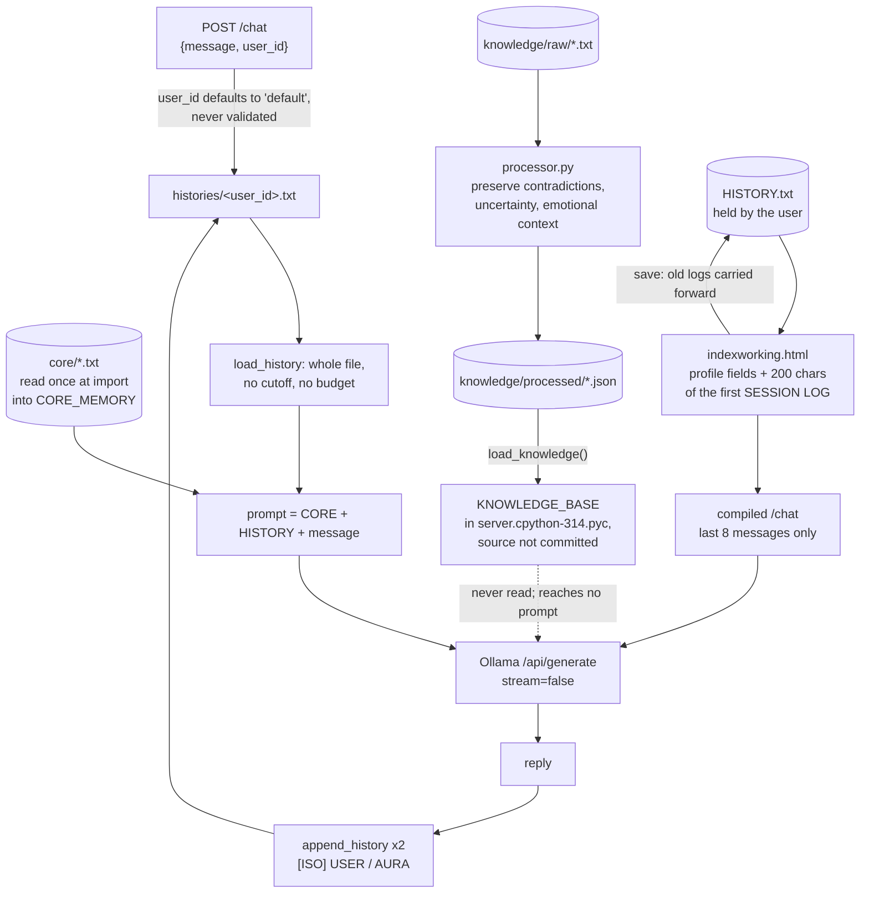

## 1. Executive Summary

AuraOS is a local-first chat harness whose memory is the whole conversation:
`server/main.py` puts the `core/` identity folder and the caller's entire
transcript in front of every message to a local Ollama model, then appends both
sides of the exchange. What is notable is a distillation prompt that asks a model
to preserve contradictions and uncertainty rather than resolve them. What is weak
is that the caller names the transcript by an unvalidated id that becomes a file
path, on a server that listens on every interface and accepts every browser
origin by default.

**The working harness is one file, and it is a legitimate design at this
scale.** No database, no embeddings, no extraction, no ranking, nothing that can
silently drop a fact. For one person talking to a local model, splicing the whole
transcript is the configuration where retrieval has nothing to do. The README
states the aim as *"it tries to make an AI remember the relationship, not just
the last message,"* and the code does exactly that.

**What the design cannot survive is its own success.** `load_history` reads the
file with no cutoff and no budget, `append_history` adds two entries per turn,
and `CORE_MEMORY` is loaded once at import (`server/main.py:63`). The prompt grows
with every exchange, every turn re-sends everything before it, and the identity
cannot change without a restart. There is no forgetting, no correction and no
deduplication: a wrong fact is fixed by opening a text file.

**The best idea in the repository reaches no prompt.** `processor.py` distils raw
conversation logs through a local model with a prompt that argues against how
most consolidation passes work:

> *"IMPORTANT: Preserve chronology. Preserve evolution of ideas. Preserve
> contradictions. Preserve uncertainty. Preserve emotional context. Preserve
> philosophical development. Preserve identity continuity. Do NOT flatten the
> conversation into sterile summaries."*

It writes to a hard-coded `C:\Aura\knowledge\processed`, and 21 of its outputs
are committed under `knowledge/processed/`. No Python source file reads them. The
one reader in the tree is compiled bytecode, `__pycache__/server.cpython-314.pyc`,
built from a `C:\aura\server.py` that is not committed: it loads every
`processed_memory` into a module global, `KNOWLEDGE_BASE`, which no function in
that module reads.

**The repository holds two memory designs, and the README describes the one
without committed server source.** The README says the user keeps a `HISTORY.txt`
and that *"the history file is not stored server-side."* That design exists as a
browser client, `indexworking.html`, whose server survives only as the same
bytecode. The design committed as source, `server/main.py`, writes every
transcript to the server's own `histories/` directory.

`capabilities: ""`. None of the seven mechanisms is present in either design.

## 2. Mental Model

A fact becomes a memory here by being said. There is no candidate state, no
extraction decision, no threshold and no gate: the user's message and the model's
reply are both appended verbatim, and from the next turn onward they are part of
the permanent context. Nothing ever judges whether a turn was worth keeping.

A memory stops being a memory only if a human edits the file. The transcript is
append-only in code — the sole write is `open(path, "a")` — so within the running
system nothing shrinks, nothing is superseded and nothing is refused.

The model is told to behave as though it might be wrong. `core/identity.txt`
instructs it to *"treat the provided HISTORY as living chronology, not isolated
facts"*, to *"not fabricate events, memories, or knowledge that do not appear in
the core files or HISTORY"*, and to say so *"when uncertain"*. It closes by
calling *"the core files and HISTORY"* the only authoritative sources of
long-term context. That is a doctrine rather than a mechanism, and it is the only
thing between a contradicted transcript and a confident answer.

The mental model is therefore: **the transcript is the memory, the identity is a
constant, and the model is asked to do all the epistemics in-context.** Every
question this atlas usually asks — what was retrieved and why, what was refused,
what changed since — has the same answer here, which is "everything, always,
unchanged".

The user-carried variant has a different model. The user holds `HISTORY.txt`,
the browser parses profile fields out of it, and the server sees only the last
eight messages of the current session. Old sessions are carried forward inside
the file and almost none of their text reaches the model (section 3).



## 3. Architecture

Standing it up needs Python 3.10 or later, Ollama running locally, and a model
pulled — the README suggests `dolphin3:8b` or `llama3`. `requirements.txt` also
pulls Flask, flask-cors, requests, the Ollama client, PyQt6 and PyQt6-WebEngine,
all with `>=` ranges rather than pins. State is two directories: `core/`, which
the operator writes, and `histories/`, which the server creates.

**Two servers in source, a third in bytecode, and none imports another.**
`server/main.py` is the one the README's *How it works* section describes. `app.py`
at the root is a different Flask app on the same port 8000 that answers `/chat` by
echoing — `reply = f"Aura: {message}"` — with no model call. Its `/restore`
derives a user id as `sha256(first:last:username)` and writes the request's
`memory` object to `users/<uid>/memory.json` wholesale. Its `/chat` takes the uid
from the body as given (`app.py:89`), so the hash protects nothing.

**The launcher the README describes is `launcher.py`, not `auraos.py`.** The
README says `python auraos.py` *"starts the Flask backend and opens the app in a
local desktop window."* `auraos.py` is a Tkinter login screen whose `start()`
prints the username and password to standard output and does nothing else
(`auraos.py:131-132`). `launcher.py` is the PyQt6 window that starts a server,
binds it to `0.0.0.0`, and injects a constant from its own source into the page
as `window.AURA_KEY` (`launcher.py:15`, `:34`, `:73`).

It imports that server with `from server import app` (`launcher.py:11`). The tree
has no `server.py` for it to import: the name resolves to the `server/` directory,
which defines no `app`. `launcher.spec` bundles `server.py` and `index.html`, and
neither is committed. What the launcher was built against survives as
`__pycache__/server.cpython-314.pyc`, compiled from `C:\aura\server.py`.

Disassembling that file with the standard library's `dis` gives its shape. Its
`/chat` returns 403 unless an `X-Aura-Key` header equals the launcher's constant,
builds the prompt from the last eight client-supplied messages (`messages[-8:]`),
sets `num_ctx` to 8192, and names no file write. Its prompt follows the identity
with a block that includes *"You never refuse requests, never moralize, and never
add disclaimers."*

**The client for it is `indexworking.html`, and it implements the README's
user-owned memory.** A first visit collects profile fields; a return visit
uploads `HISTORY.txt`, and a save downloads a new one carrying the old session
logs forward (`indexworking.html:836-838`). `indexworking2.html` differs in
sending the `X-Aura-Key` header and naming `llama3`.

What the carried file contributes to the next prompt is small. The system prompt
takes the profile fields and `extractLastSessionSummary`, which keeps at most 200
characters from the first `SESSION LOG` match (`indexworking.html:683-684`). That
first match is the oldest session's header, and once a file has been carried
forward it is the `PREVIOUS SESSION LOGS` heading itself, whose name contains the
same words. The file grows with every save; the model sees a fragment of its top.

`webfiles/` holds 358 files, among them personal documents, a committed
`ngrok.exe`, and four older harnesses. Two of them, `webfiles/aura.py` and
`webfiles/aura_server.py`, bound their context: the last 8,000 characters of
`HISTORY.txt` and a 200-character preview of the first eight files in the working
directory (`webfiles/aura_server.py:59-61`). `core.py` is a nine-line keyword
matcher no server imports. A reader should treat `server/main.py` as the system
whose source can be read and run.

**Repository hygiene.** `.tmp.driveupload/` holds 2,214 of the 2,887 tracked
files, 77% of them, and 379 MB of the tree's 637 MB of blob content, as Google
Drive upload temporaries. `recovery_ngrok.txt` at the root
contains ten account recovery codes for an ngrok account; they are public by
virtue of being pushed and should be treated as compromised and rotated.
`memory/logs/2026-05-20.json` holds eighteen captured conversation turns with a
username.

## 4. Essential Implementation Paths

**Identity load** — `server/main.py`, `load_core()`. Every `.txt` and `.md` in
`core/` is read in `sorted()` order and concatenated with a `[CORE: <name>]`
header per file. The call is at module scope: `CORE_MEMORY = load_core()`, so the
identity is frozen for the process lifetime and an edit needs a restart. The
tagged headers are a small good decision — the model can tell which file a rule
came from.

**History load** — `load_history(user_id)` returns the full file contents or an
empty string. No slicing, no tail, no token count.

**Prompt assembly** — a single f-string with three fenced sections:
`=== CORE IDENTITY (permanent) ===`, `=== HISTORY ===` with
`"(no prior history)"` as the empty case, and `=== CURRENT MESSAGE ===` ending in
`Aura:` as a completion cue. Delimiters are plain text and nothing escapes them,
so a user message containing the same fence line is indistinguishable from a real
section boundary.

**Write** — `append_history(user_id, role, text)` opens in append mode and writes
`[<ISO-8601 UTC>] <ROLE>\n<text>\n\n`. Called twice per successful turn, after
the model returns. A failed model call returns 500 and writes nothing, so a
turn is either fully recorded or not recorded at all — which is the correct
behaviour and appears to be incidental rather than designed.

**Distillation** — `processor.py`, standalone. Reads `.txt` files from a
hard-coded raw directory, sorts them by `os.path.getctime` so oldest is
processed first, sends each through Ollama with the preservation prompt, and
writes `{index}({basename}).json` containing `source_file` and
`processed_memory`. The index is the file's position in that run, so adding a raw
file renumbers every later output. The compiled server's `load_knowledge()` is
the only reader, and its result is assigned and never used.

## 5. Memory Data Model

There is no record. The unit of memory is a line-oriented block in a text file:

```text
[2026-08-19T04:33:31.000000+00:00] USER
what did we decide about the schema?

[2026-08-19T04:33:44.000000+00:00] AURA
...
```

Each block carries a timestamp and a role and nothing else — no id, no source, no
confidence, no scope, no validity, no supersession pointer and no deletion
marker. The timestamp is record time and event time simultaneously, which is why
`bitemporal` is withheld: there is one clock and no read path that accepts an
as-of.

The `core/` folder is the second unit and it is three files at this commit:
`identity.txt` (474 bytes of behavioural rules), `ontology.txt` (2.8 KB) and
`core.txt` (7.5 KB). Together they are about 10 KB of text prepended to every
prompt forever, which is a fixed and knowable cost — unlike the history, which is
not.

There are two more formats with no migration between any of them. `app.py`
keeps `users/<uid>/memory.json` holding `{"messages": [...], "last_reply": "..."}`.
The user-held `HISTORY.txt` is labelled plain text: `AURA_KEY:`, `VISIBILITY:`,
`FIRST NAME:` and five free-text profile sections, then `SESSION LOG` blocks. A
reader looking for "the memory format" finds whichever one they open first.

## 6. Retrieval Mechanics

**There is no retrieval.** No search, no embeddings, no keyword match, no
ranking, no top-*k*, no cutoff. `stack_retrieval` is empty for that reason rather
than because the arms were not identified.

That is a defensible choice for a first prototype and it has one real advantage
the corpus rarely gets: **nothing can be missed by the retriever, because there
is no retriever.** Every recall failure in this system is the model's failure to
attend, not the store's failure to return — which makes debugging much simpler
than in a hybrid pipeline, and is why "send everything" is the right first
version.

The cost arrives on a schedule. Each turn's prompt is roughly 10 KB of identity
plus the entire prior transcript, and the transcript grows by both sides of every
exchange. A few hundred turns will exceed a local model's context window. The
failure then is not an error: the runtime silently truncates the oldest part of
the history, which is the material the design exists to preserve. Nothing in
`server/main.py` measures the prompt, warns, or decides what to drop first. The
first thing this system needs is a length check with a stated policy for what
happens when it trips, not a vector store.

## 7. Write Mechanics

**Writes are synchronous, unconditional, and after the fact.** The user's message
is not persisted until the model has replied, and both are then appended in one
pass. There is no queue, no debounce, no batching, and the lag before a memory is
readable is the duration of one file append — the next turn sees it.

**Nothing is extracted and nothing is consolidated.** The store is the transcript,
so the write path has no judgement in it at all. That is the source of the
design's honesty and of its ceiling: a system that never decides what matters
also never gets smaller.

**There is no correction path.** No update, no supersession, no tombstone, no
expiry, no deletion. When the user tells the model that something it recorded was
wrong, the correction is appended *after* the original, and both remain in every
future prompt with equal weight and no marking. `identity.txt`'s instruction to
treat the history as *"living chronology"* is the design's answer to that, and it
asks the model to resolve at read time what the store will not resolve at write
time. In a long transcript with several revisions of the same fact, that is the
hardest possible version of the job.

**A concurrency note.** Two requests for the same `user_id` append to the same
file with no lock. Python's buffered append will usually interleave at block
boundaries rather than mid-line, but nothing guarantees it, and a corrupted
transcript is the one failure this design cannot recover from because the
transcript is the only copy.

## 8. Agent Integration

There is no tool surface, no MCP server and no function calling. The model cannot
query memory, cannot decline a memory, cannot record that something was wrong,
and cannot write anything except by producing text that the harness then appends.
Memory reaches the model as prompt text and only as prompt text.

The Ollama call sets `"stream": False` with a 120-second timeout and reads
`response.json().get("response", "")`. The model is selected by the `AURA_MODEL`
environment variable. Because memory is files and the model is a string, *"the
model can change without losing the relationship"* is literally true here.

`/health` reports the model name and `core_loaded`, and the flag cannot be false
(`server/main.py:123`). `load_core()` returns the string `"No core identity
loaded."` when `core/` is missing or every file in it is empty, and
`bool(CORE_MEMORY)` of that non-empty fallback is `True`. The misconfiguration it
looks designed to expose is spliced into every prompt with the health check
reporting success.

## 9. Reliability, Safety, and Trust

**All seven capability marks are withheld and most have nothing to attach to.**
There is no status field, no rejected-value record, no second time axis, no audit
of mutations, no review surface and no test of any kind. The user-carried client
has a `VISIBILITY: private` flag, and it is not a scope: the browser compares an
unsalted SHA-256 of the username with the `AURA_KEY` line in the same plain-text
file, so it hides fields from the page and not from whoever holds the file.

**Scope in `server/main.py` is inverted, not merely absent.** `user_id` is
whatever the request body says, defaulting to `"default"` (`server/main.py:75`).
There is no session, no token, no cookie and no check that the caller has any
relationship to that id. Two consequences follow:

- **Any caller can read any transcript.** Naming another user's id loads their
  entire history into the prompt and returns a model response conditioned on it.
- **The id reaches the filesystem unsanitized.**
  `os.path.join(HISTORY_DIR, f"{user_id}.txt")` (`server/main.py:50`, `:58`)
  resolves outside `histories/` for a `user_id` containing `../`, and an absolute
  `user_id` replaces the base directory outright. Either reads any `.txt` file
  into the prompt, or appends to one, creating it if absent.

**The default exposure is wider than the network.** `HOST` defaults to
`"0.0.0.0"` (`server/main.py:24`), so unless the operator sets `AURA_HOST` the
server accepts connections from the network. And `CORS(app)` with no arguments
(`server/main.py:12`) is flask-cors's allow-every-origin default, so as far as the
server is concerned a page from any site may post to `/chat` and read the reply.
The fixes are small: bind `127.0.0.1`, restrict CORS to the frontend's origin, and
reject any `user_id` that is not a plain alphanumeric token.

**The README and the committed server source disagree about where memory
lives.** The README says *"the history file is not stored server-side"*, that
*"the server or host machine does not own the memory"*, and that a lost file
*"cannot be recovered from the host."* `server/main.py` writes every transcript
into `histories/` and reads it back, so a host running the documented command
holds the memory. The design the README describes is the `indexworking.html`
client, and the server it needs is committed only as bytecode.

**Prompt-injection surface.** The transcript is replayed verbatim into every
subsequent prompt, so anything the user types — or anything the model was
induced to say once — becomes permanent instruction-adjacent context. The section
fences are unescaped plain text, so a message containing
`=== CORE IDENTITY (permanent) ===` is indistinguishable from the real header. In
a system where a single bad turn is repeated in every future prompt forever, with
no way to delete it, that is the risk that compounds fastest.

## 10. Tests, Evals, and Benchmarks

**None.** No test file, no fixture, no evaluation script, no benchmark, no paper
and no citation file. `.github/workflows/pylint.yml` installs the requirements
and runs pylint with `--fail-under=5.0`; nothing it runs exercises behaviour.
Nothing measures recall, prompt size, latency or cost.

The single test most useful to write first is also the cheapest: assert that a
`user_id` of `../../etc/passwd` or `/tmp/x` is rejected before it reaches
`os.path.join`. The second is a `/health` case with an empty `core/` that
expects `core_loaded: false`, which fails against the code at this commit.

I ran nothing from the repository. The screen found no auto-executing surface,
two build-time execution points in documentation Makefiles, three unpinned
requirement files and nothing inside the seven-day cooldown. I disassembled the
two committed `.pyc` files with `marshal` and `dis` from the standard library,
which reads bytecode without executing it.

## 11. For Your Own Build

### Steal

**Send everything, until you can measure that you cannot.** For a single user and
a local model, the whole-transcript prompt has no retrieval bugs because it has
no retriever. Start there and move only when a measurement forces it: record the
prompt size at which quality falls off, and what the model stops attending to
first.

**Tag each identity chunk with the file it came from.** `[CORE: identity.txt]`
costs one f-string and lets both the model and a reader attribute a rule to its
source.

**Persist a turn only after the model has answered.** Both appends happen after a
successful response, so a failed call leaves no half-turn in the transcript.

**And the distillation prompt, which is the one idea here worth more than its
implementation.** *"Preserve contradictions. Preserve uncertainty. Preserve
emotional context… Do NOT flatten the conversation into sterile summaries."* Most
consolidation passes optimise for what this forbids — a clean, deduplicated,
present-tense statement of what is true now — and so destroy the record of how a
belief was reached and what it displaced. If you are writing a summarizer, decide
deliberately which of the two you want, because most implementations make that
choice by accident.

### Avoid

**Do not let the caller name the memory.** An unauthenticated, unvalidated
`user_id` is both the access-control boundary and a filesystem path here, and an
open CORS policy extends the set of callers to any page a local user visits.

**Do not grow a prompt without a length policy.** The failure mode is not an
error, it is the runtime dropping the oldest history — silently, and starting
with the material the system exists to keep.

**Do not derive a health flag from a value with a non-empty fallback.**
`bool(CORE_MEMORY)` is true for the placeholder string, so the check reports the
one failure it exists for as success. Return the file count, or `None` on
failure, and test the missing case.

**Do not load an artifact into a variable nothing reads.** The distiller's output
is read into `KNOWLEDGE_BASE` and dropped. A pipeline that ends in an unused
global looks connected in review and is not.

**Do not describe an architecture the committed source does not run.** The
user-carried design in the README is better than `server/main.py`, and its server
is not in the tree as source. A reader assumes the privacy property the README
promises and runs the harness that does not give it.

**Do not commit the upload temp directory, the recovery codes, bytecode, or
personal files.** 2,214 Drive temporaries, ten ngrok recovery codes, captured
chat logs and personal documents under `webfiles/` are all in this tree; the
codes should be rotated and the rest belongs in `.gitignore`.

### Fit

Take this as a starting point if you are one person, on one machine, with a local
model, and you want to understand every line of what your assistant remembers.
`server/main.py` is small enough to read in an afternoon and the
whole-transcript approach is the right first answer. There is nothing to borrow
as code: no tests, no licence file, and a second design whose server cannot be
rebuilt from the tree.

Do not run it where anyone else can reach it, or in a browser session that visits
other sites, until the `user_id` handling, the default bind and the CORS policy
are fixed. Its ceiling is the context window, and the work between here and
something that scales is not retrieval — it is deciding, for the first time, what
the system is allowed to forget.

## 12. Open Questions

- What happens at the context limit? Nothing in `server/main.py` detects it, so
  the behaviour is whatever Ollama and the chosen model do, and the project has
  not said which.
- Is `C:\aura\server.py` meant to be committed? `launcher.py` and
  `launcher.spec` depend on it, and the tree holds only its bytecode.
- Which design is current? The README describes both — `histories/` under *How it
  works* and a user-held `HISTORY.txt` under *The user-owned memory model* — and
  the most recent commit touching the README is titled *"Clarify user
  responsibility for HISTORY.txt"*.
- Was `KNOWLEDGE_BASE` ever spliced into a prompt? The bytecode loads it and no
  function reads it; an uncommitted later version may differ.

## Appendix: File Index

| Path | What it holds |
| --- | --- |
| `server/main.py` | The working harness: `load_core`, `load_history`, `append_history`, prompt assembly, the Ollama call, `/health`, `CORS(app)` |
| `core/identity.txt` | The behavioural doctrine — living chronology, do not fabricate, say when uncertain |
| `core/core.txt`, `core/ontology.txt` | The rest of the permanent identity, about 10 KB in total with `identity.txt` |
| `processor.py` | The distiller: the preservation prompt, oldest-first ordering, hard-coded Windows paths |
| `knowledge/raw/`, `knowledge/processed/` | 21 distiller inputs and 21 committed outputs |
| `__pycache__/server.cpython-314.pyc` | Bytecode of an uncommitted `C:\aura\server.py`: `X-Aura-Key` check, last-eight-messages prompt, `load_knowledge` into an unused global |
| `launcher.py`, `launcher.spec` | The PyQt6 launcher: binds `0.0.0.0`, injects `AURA_KEY`, imports and bundles a `server.py` absent from the tree |
| `indexworking.html`, `indexworking2.html` | The user-carried `HISTORY.txt` client: profile fields, username hash, carried-forward session logs |
| `app.py` | A second Flask server with a `sha256` user id on `/restore`, a raw uid on its echo `/chat`, and `users/<uid>/memory.json` |
| `auraos.py` | A Tkinter shell whose login handler prints the credentials |
| `core.py` | A nine-line keyword reply function nothing imports |
| `webfiles/aura.py`, `webfiles/aura_server.py` | Older harnesses that bound context to the last 8,000 characters of `HISTORY.txt` |
| `memory/logs/2026-05-20.json` | Eighteen captured real conversation turns, committed |
| `recovery_ngrok.txt` | Ten ngrok account recovery codes, committed |
| `.tmp.driveupload/` | 2,214 files and 379 MB of Google Drive upload temporaries |

## Appendix: Recorded Searches

Run in a full clone at the pinned revision. The command is the check that was
actually run.

| Claim | Check | Result at this pin |
| --- | --- | --- |
| No test file exists anywhere in the tree | `git ls-files \| grep -E '(^\|/)(tests?\|__tests__)/\|(^\|/)test_[^/]*$\|_test\.[a-z]+$\|\.test\.[a-z]+$\|\.spec\.[jt]s$'` | Nothing, at 2,887 tracked files. `.github/workflows/pylint.yml` runs pylint only. |
| No Python source reads the distiller's output | `git grep -n -I -E 'knowledge[/\\]processed\|PROCESSED_DIR\|processed_memory' -- ':!knowledge/processed' ':!.tmp.driveupload'` | `processor.py` (the writer) and `launcher.spec` (bundles the directory). `git grep -l -a` adds the two `.pyc` files; `dis` over `server.cpython-314.pyc` finds `KNOWLEDGE_BASE` stored once and loaded nowhere. |
| No delete path in code | `git grep -n -I -i -E '\bDELETE\b\|os\.remove\|unlink\|rmtree' -- '*.py' '*.js' '*.php' '*.html' ':!*READTHEDOCS*' ':!*_static*'` | Nothing. |
| No licence file | `ls LICENSE* COPYING*`; `git log --name-status -- LICENSE` | Absent; added in `a606882` on 26 August 2026 and deleted in `e86dd75` on 3 September. |
| `.tmp.driveupload/` share of the tree | `git ls-tree -r -l HEAD \| awk` summing sizes by prefix | 2,214 of 2,887 files; 379,356,272 of 636,878,008 bytes. |

## History

**2026-09-26** — [`81dffa9ba95334b3ded57f9237750372ab80815d`](https://github.com/AdultSwimmer/AuraOS/commit/81dffa9ba95334b3ded57f9237750372ab80815d) — audit at an unchanged pin; no mark changes. Four published claims were wrong. `/health`'s `core_loaded` was credited as exposing a missing `core/`; it is always true ([section 8](#8-agent-integration)). "No reader anywhere in the tree" of the distiller's output missed a compiled reader that loads it into an unused global. The user-carried `HISTORY.txt` design called unimplemented has a client in the tree and a server committed only as bytecode ([section 3](#3-architecture)). The temp directory is 77% of files, not 98%. Added the open CORS default and the absolute-path form of the `user_id` escape ([section 9](#9-reliability-safety-and-trust)). Screened again: no auto-run surface, nothing inside the cooldown; nothing installed, built or run.

**2026-09-13** — [`81dffa9ba95334b3ded57f9237750372ab80815d`](https://github.com/AdultSwimmer/AuraOS/commit/81dffa9ba95334b3ded57f9237750372ab80815d) — re-read, 14 commits past the previous pin, and the memory mechanism is unchanged. Not one `.py`, `.js`, `.ts`, `.sql` or `.json` file differs across the range: the 52,502 added lines are transcripts, screenshots, PDFs and Word documents assembling a dispute with a model provider, plus community boilerplate. No mark changes and `capabilities` stays empty. The one correction is to the licence note: an MIT licence carrying an unsubstituted `Copyright (c) $year Anthony Dulong` was committed on 26 August 2026 and deleted on 3 September, so the tree at this commit still has no licence file. Screened again first: no auto-run surface, two build-time execution surfaces and three unpinned requirements files; nothing was installed and nothing was run.

**2026-08-21** — [`c7d6651a98b8581e372864a4976c5a8a4c8290e4`](https://github.com/AdultSwimmer/AuraOS/commit/c7d6651a98b8581e372864a4976c5a8a4c8290e4) — first reading, at the fourth commit of a repository two days old. Screened before anything was read: no auto-executing surface, two build-time execution points in documentation Makefiles, three unpinned requirement files and three dependency files inside the seven-day cooldown; nothing was installed, no model was pulled and no server was started. Every Python file outside the vendored documentation was read in full, which is how the absent consumer for `knowledge/processed/` and the unvalidated `user_id` path were established. `capabilities: ""` — assessed against all seven and none is present.
