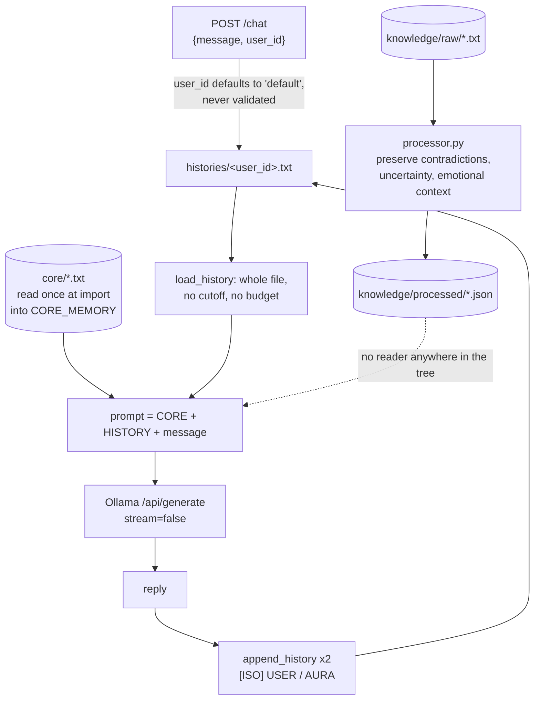

## 1. Executive Summary

AuraOS is two days old at this commit — four commits, first pushed on
19 August 2026 — and it is a prototype in the honest sense: about 590 lines of
Python that do one thing end to end, surrounded by several things that do not
connect to it. There is no licence file, so the default is all rights reserved.
There are no tests.

**The working system is one file.** `server/main.py` puts a Flask endpoint in
front of a local Ollama model and assembles every prompt the same way: the
`core/` folder read whole as permanent identity, then the caller's entire
transcript, then the current message. Both sides of the exchange are appended to
that transcript afterwards. The README states the ambition in a sentence worth
quoting because the code does exactly it — *"it tries to make an AI remember the
relationship, not just the last message."*

This is the simplest possible memory design and the report should say plainly
that it is a legitimate one at this scale. No database, no embeddings, no
extraction, no ranking, nothing that can silently drop a fact. For a single user
talking to a local model, splicing the whole transcript is not a shortcut around
retrieval — it is the configuration where retrieval has nothing to do. The
corpus contains larger systems whose recall is worse than this.

**What the design cannot survive is its own success**, and the shape of that is
worth naming precisely. `load_history` reads the file with no cutoff and no
budget; `append_history` adds two entries per turn; and `CORE_MEMORY` is loaded
once at import into a module global. So the prompt grows monotonically with the
conversation, every turn re-reads and re-sends everything that came before, and
the identity that governs the whole thing cannot be changed without restarting
the process. There is no forgetting, no correction, no deduplication, and no
`DELETE` anywhere in the tree — a wrong fact is fixed by opening a text file.

**The best idea in the repository is in a file nothing calls.** `processor.py`
distils raw conversation logs through the same local model with a prompt that
argues directly against how most systems in this atlas consolidate:

> *"IMPORTANT: Preserve chronology. Preserve evolution of ideas. Preserve
> contradictions. Preserve uncertainty. Preserve emotional context. Preserve
> philosophical development. Preserve identity continuity. Do NOT flatten the
> conversation into sterile summaries."*

It writes its results to `knowledge/processed/`. A grep across every Python file
in the tree finds no reader of that directory: `server/main.py` loads `core/` and
`histories/` and nothing else. The distiller also hard-codes `C:\Aura\knowledge\raw`
as its input, so it runs on one machine. The most interesting position in the
repository is taken by a subsystem that reaches no prompt.

**Three things a reader should know before running it.** `user_id` arrives in the
request body, defaults to `"default"`, is never validated, and is interpolated
directly into `os.path.join(HISTORY_DIR, f"{user_id}.txt")` — so a caller chooses
which transcript is read into the prompt and appended to, and a `user_id`
containing `../` escapes the directory in both directions. `HOST` defaults to
`0.0.0.0`, so the server listens on every interface unless told otherwise. And
the README's claim that *"the history file is not stored server-side"* and that
*"the server or host machine does not own the memory"* is contradicted by
`append_history`, which writes it to the server's own `histories/` directory at
this commit.

`capabilities: ""`. None of the seven mechanisms is present, and for most of them
there is nothing in the design they would attach to.

## 2. Mental Model

A fact becomes a memory here by being said. There is no candidate state, no
extraction decision, no threshold and no gate: the user's message and the model's
reply are both appended verbatim, and from the next turn onward they are part of
the permanent context. Nothing ever judges whether a turn was worth keeping.

A memory stops being a memory only if a human edits the file. The transcript is
append-only in code — the sole write is `open(path, "a")` — so within the running
system nothing shrinks, nothing is superseded and nothing is refused. The model
is told to behave as though it might be wrong: `core/identity.txt` instructs it
to *"treat the provided HISTORY as living chronology, not isolated facts"*, to
*"not fabricate events, memories, or knowledge that do not appear in the core
files or HISTORY"*, and to say so *"when uncertain"*, closing with the claim that
*"the core files and HISTORY are the only authoritative sources of long-term
context."* That is a doctrine rather than a mechanism, and it is the only thing
standing between a contradicted transcript and a confident answer.

The mental model is therefore: **the transcript is the memory, the identity is a
constant, and the model is asked to do all the epistemics in-context.** Every
question this atlas usually asks — what was retrieved and why, what was refused,
what changed since — has the same answer here, which is "everything, always,
unchanged".



## 3. Architecture

Standing it up needs Python 3.10 or later, Ollama running locally, and a model
pulled — the README suggests `dolphin3:8b` or `llama3`. `requirements.txt` also
pulls Flask, flask-cors, requests, the Ollama client, PyQt6 and PyQt6-WebEngine,
all with `>=` ranges rather than pins. State is two directories: `core/`, which
the operator writes, and `histories/`, which the server creates.

The confusing part of the layout is that **there are two servers with
incompatible memory models and neither imports the other.** `server/main.py` is
the one the README describes: identity plus transcript plus Ollama. `app.py` at
the repository root is a different Flask app on the same port 8000 that derives a
user id as `sha256(first:last:username)`, keeps `users/<uid>/memory.json`, and
answers `/chat` by echoing — `reply = f"Aura: {message}"` — with no model call at
all. It also exposes `/restore`, which takes a `memory` object from the request
body and writes it to that user's file wholesale, with no validation and no
authentication.

Beside them, `auraos.py` is a Tkinter window with username and password fields
whose `start()` handler prints both to standard output and does nothing else, and
`core.py` is a nine-line keyword matcher (*"Hello. I'm here."*) that no server
imports. A reader should treat `server/main.py` as the system and the rest as
scaffolding from earlier attempts.

Two things in the tree are worth flagging as repository hygiene rather than
design. `.tmp.driveupload/` holds 2,214 files and 368 MB of Google Drive upload
temporaries, which is 98% of the repository's file count. And
`recovery_ngrok.txt` at the root contains ten account recovery codes for an ngrok
account; they are already public by virtue of being pushed, and anyone reading
this should treat them as compromised and rotate them. `memory/logs/2026-05-20.json`
likewise contains real captured conversation turns with a username.

## 4. Essential Implementation Paths

**Identity load** — `server/main.py`, `load_core()`. Every `.txt` and `.md` in
`core/` is read in `sorted()` order and concatenated with a `[CORE: <name>]`
header per file. The call is at module scope: `CORE_MEMORY = load_core()`, so the
identity is frozen for the process lifetime and an edit needs a restart. The
tagged headers are a small good decision — the model can tell which file a rule
came from.

**History load** — `load_history(user_id)` returns the full file contents or an
empty string. No slicing, no tail, no token count.

**Prompt assembly** — a single f-string with three fenced sections:
`=== CORE IDENTITY (permanent) ===`, `=== HISTORY ===` with
`"(no prior history)"` as the empty case, and `=== CURRENT MESSAGE ===` ending in
`Aura:` as a completion cue. Delimiters are plain text and nothing escapes them,
so a user message containing the same fence line is indistinguishable from a real
section boundary.

**Write** — `append_history(user_id, role, text)` opens in append mode and writes
`[<ISO-8601 UTC>] <ROLE>\n<text>\n\n`. Called twice per successful turn, after
the model returns. A failed model call returns 500 and writes nothing, so a
turn is either fully recorded or not recorded at all — which is the correct
behaviour and appears to be incidental rather than designed.

**Distillation** — `processor.py`, standalone. Reads `.txt` files from a
hard-coded raw directory, sorts them by `os.path.getctime` so oldest is
processed first, sends each through Ollama with the preservation prompt, and
writes `{index}({basename}).json` containing `source_file` and
`processed_memory`. Nothing consumes the output.

## 5. Memory Data Model

There is no record. The unit of memory is a line-oriented block in a text file:

```text
[2026-08-19T04:33:31.000000+00:00] USER
what did we decide about the schema?

[2026-08-19T04:33:44.000000+00:00] AURA
...
```

Each block carries a timestamp and a role and nothing else — no id, no source, no
confidence, no scope, no validity, no supersession pointer and no deletion
marker. The timestamp is record time and event time simultaneously, which is why
`bitemporal` is withheld: there is one clock and no read path that accepts an
as-of.

The `core/` folder is the second unit and it is three files at this commit:
`identity.txt` (474 bytes of behavioural rules), `ontology.txt` (2.8 KB) and
`core.txt` (7.5 KB). Together they are about 10 KB of text prepended to every
prompt forever, which is a fixed and knowable cost — unlike the history, which is
not.

The second, unused server has a different model again: `users/<sha256>/memory.json`
holding `{"messages": [...], "last_reply": "..."}`. Two persistence formats in one
repository with no migration between them is worth noting because a reader
looking for "the memory format" will find whichever one they open first.

## 6. Retrieval Mechanics

**There is no retrieval.** No search, no embeddings, no keyword match, no
ranking, no top-*k*, no cutoff. `stack_retrieval` is empty for that reason rather
than because the arms were not identified.

That is a defensible choice for a first prototype and it has one real advantage
the corpus rarely gets: **nothing can be missed by the retriever, because there
is no retriever.** Every recall failure in this system is the model's failure to
attend, not the store's failure to return — which makes debugging much simpler
than in a hybrid pipeline, and is why "send everything" is the right first
version.

The cost arrives on a schedule. Each turn's prompt is roughly 10 KB of identity
plus the entire prior transcript, and the transcript grows by both sides of every
exchange. A few hundred turns of ordinary conversation will exceed a local
model's context window, and the failure mode when it does is not an error — it is
the runtime silently truncating the oldest part of the history, which is exactly
the material the design exists to preserve. Nothing in the code measures the
prompt size, warns about it, or decides what to drop first. The first thing this
system needs is not a vector store; it is a length check with a stated policy for
what happens when it trips.

## 7. Write Mechanics

**Writes are synchronous, unconditional, and after the fact.** The user's message
is not persisted until the model has replied, and both are then appended in one
pass. There is no queue, no debounce, no batching, and the lag before a memory is
readable is the duration of one file append — the next turn sees it.

**Nothing is extracted and nothing is consolidated.** The store is the transcript,
so the write path has no judgement in it at all. That is the source of the
design's honesty and of its ceiling: a system that never decides what matters
also never gets smaller.

**There is no correction path.** No update, no supersession, no tombstone, no
expiry, no deletion. When the user tells the model that something it recorded was
wrong, the correction is appended *after* the original, and both remain in every
future prompt with equal weight and no marking. `identity.txt`'s instruction to
treat the history as *"living chronology"* is the design's answer to that, and it
asks the model to resolve at read time what the store will not resolve at write
time. In a long transcript with several revisions of the same fact, that is the
hardest possible version of the job.

**A concurrency note.** Two requests for the same `user_id` append to the same
file with no lock. Python's buffered append will usually interleave at block
boundaries rather than mid-line, but nothing guarantees it, and a corrupted
transcript is the one failure this design cannot recover from because the
transcript is the only copy.

## 8. Agent Integration

There is no tool surface, no MCP server and no function calling. The model cannot
query memory, cannot decline a memory, cannot record that something was wrong,
and cannot write anything except by producing text that the harness then appends.
Memory reaches the model as prompt text and only as prompt text.

The Ollama call sets `"stream": False` with a 120-second timeout and reads
`response.json().get("response", "")`. The model is selected by the `AURA_MODEL`
environment variable, which is the design's one genuinely portable claim: because
memory is files and the model is a string, *"the model can change without losing
the relationship"* is literally true here.

`/health` reports the model name and `core_loaded` as a boolean. Reporting
whether identity loaded, rather than assuming it, is a small good habit —
`load_core()` returns the string `"No core identity loaded."` when the folder is
missing, which would otherwise be spliced into every prompt unnoticed.

## 9. Reliability, Safety, and Trust

**All seven capability marks are withheld and most have nothing to attach to.**
There is no status field, no rejected-value record, no second time axis, no audit
of mutations, no review surface and no test of any kind.

**Scope is the significant one, because it is not merely absent — it is
inverted.** `user_id` is whatever the request body says, defaulting to
`"default"`. There is no session, no token, no cookie and no check that the
caller has any relationship to that id. Two consequences follow directly:

- **Any caller can read any transcript.** Naming another user's id loads their
  entire history into the prompt and returns a model response conditioned on it.
- **The id reaches the filesystem unsanitized.**
  `os.path.join(HISTORY_DIR, f"{user_id}.txt")` with a `user_id` containing
  `../` resolves outside `histories/` — for reading a file into the prompt, and
  for appending to one.

`HOST` defaults to `"0.0.0.0"`, so unless the operator sets `AURA_HOST` the
server accepts connections from the network rather than from localhost. The
prototype is described as local-first and its default binding is not local. Both
fixes are small — bind `127.0.0.1` by default, and reject any `user_id` that is
not a plain alphanumeric token — and they belong before the first person other
than the author runs it.

**The README and the code disagree about where memory lives.** The document says
*"the history file is not stored server-side"*, that *"the server or host machine
does not own the memory"*, and that if the file *"is shared, lost, or stolen, it
cannot be recovered from the host."* At this commit `append_history` writes into
the server's `histories/` directory and `load_history` reads from it, so the host
does hold the memory and could recover it. The described architecture — the user
carries a `HISTORY.txt` that travels with them — is a coherent and interesting
design, and it is not the one implemented here. A reader relying on the privacy
claim would be relying on something the code does not do.

**Prompt-injection surface.** The transcript is replayed verbatim into every
subsequent prompt, which means anything the user types — or anything the model
was induced to say once — becomes permanent instruction-adjacent context. The
section fences are unescaped plain text, so a message containing
`=== CORE IDENTITY (permanent) ===` is indistinguishable from the real header. In
a system where a single bad turn is repeated in every future prompt forever, with
no way to delete it, that is the risk that compounds fastest.

## 10. Tests, Evals, and Benchmarks

**None.** No test file, no fixture, no evaluation script, no benchmark, no paper
and no citation file. Nothing measures recall, prompt size, latency or cost, and
there is no committed output of any kind from running the system apart from the
captured logs in `memory/logs/`.

For a four-commit prototype that is not a criticism so much as a description. The
single test most worth writing first is also the cheapest: assert that a
`user_id` of `../../etc/passwd` is rejected before it reaches `os.path.join`.

I ran nothing. The screen found no auto-executing surface, two build-time
execution points in the documentation Makefiles, three unpinned requirement
files, and three dependency files changed within the seven-day cooldown, so
nothing was installed.

## 11. Patterns Worth Stealing

### Steal

**Send everything, until you can measure that you cannot.** For a single user and
a local model, the whole-transcript prompt has no retrieval bugs because it has
no retriever. Several systems in this atlas would answer better if they had
started here and moved only when a measurement forced them to.

**Tag each identity chunk with the file it came from.** `[CORE: identity.txt]`
costs one f-string and lets both the model and a reader attribute a rule to its
source.

**Report whether identity loaded, in the health check.** `core_loaded` as a
boolean beside the model name turns a silent misconfiguration — an empty or
missing `core/` — into something a reader can see without inspecting a prompt.

**Persist a turn only after the model has answered.** Both appends happen after a
successful response, so a failed call leaves no half-turn in the transcript.

**And the distillation prompt, which is the one idea here worth more than its
implementation.** *"Preserve contradictions. Preserve uncertainty. Preserve
emotional context… Do NOT flatten the conversation into sterile summaries."*
Almost every consolidation pass in this corpus optimises for exactly what this
forbids — a clean, deduplicated, present-tense statement of what is true now —
and in doing so destroys the record of how a belief was arrived at and what it
displaced. Anyone writing a summarizer should read that prompt before they write
theirs, whether or not they agree with it.

### Avoid

**Do not let the caller name the memory.** An unauthenticated, unvalidated
`user_id` is both the access-control boundary and a filesystem path here.

**Do not grow a prompt without a length policy.** The failure mode is not an
error, it is the runtime dropping the oldest history — silently, and starting
with the material the system exists to keep.

**Do not describe an architecture the code does not implement.** The
user-carries-the-file design in the README is genuinely better than the one in
`server/main.py`, which is exactly why the gap matters: a reader will assume the
privacy property that the better design would have given them.

**Do not ship two servers with two memory formats.** Whichever one a contributor
opens first becomes what they believe the system is.

**Do not commit the upload temp directory, the recovery codes, or the captured
conversations.** 368 MB of `.tmp.driveupload`, ten ngrok recovery codes and a day
of real chat logs are all in this tree; the codes should be rotated and the rest
belongs in `.gitignore`.

### Fit

Take this as a starting point if you are one person, on one machine, with a local
model, and you want to understand every line of what your assistant remembers.
The design is small enough to read in an afternoon and the whole-transcript
approach is the right first answer.

Do not take it as a component, and do not run it where anyone else can reach it
until the `user_id` handling and the default bind are fixed. Its ceiling is the
context window, and the work between here and something that scales is not
retrieval — it is deciding, for the first time, what the system is allowed to
forget.

## 12. Antipatterns / Risks

- **Caller-supplied `user_id` is the only access control, and it is also a file
  path.** Any transcript can be read or appended to by naming it, and `../`
  escapes the directory in both directions.
- **`HOST` defaults to `0.0.0.0`.** A local-first prototype that listens on every
  interface out of the box.
- **The prompt grows without bound and nothing measures it.** When the context
  window fills, the runtime truncates the oldest history — the opposite of what
  the design wants — with no warning.
- **No deletion or correction of any kind.** A wrong or malicious turn is
  permanent and is re-sent in every future prompt.
- **Unescaped section fences.** A user message can impersonate the
  `=== CORE IDENTITY (permanent) ===` header, and the transcript replays it
  forever.
- **`CORE_MEMORY` is frozen at import.** Editing the identity has no effect until
  the process restarts, and nothing says so.
- **The distiller has no consumer and hard-codes `C:\Aura\knowledge\raw`.** The
  best-argued component in the repository cannot run off one machine and reaches
  no prompt when it does.
- **Two servers, two memory formats, one port.** `app.py` and `server/main.py`
  both bind 8000 and disagree about what memory is.
- **Committed secrets and user data.** Ten ngrok recovery codes at the repository
  root, real conversation logs under `memory/logs/`, and 368 MB of Drive upload
  temporaries.
- **No licence.** Public and all rights reserved by default, which makes reuse a
  question rather than a decision.

## 13. Build-vs-Borrow Takeaways

There is nothing here to borrow as code — 590 lines, no tests, no licence. What
is worth taking is one prompt and one decision.

The prompt is `processor.py`'s. If you are building consolidation, read it and
decide deliberately whether your summarizer should preserve contradictions and
uncertainty or resolve them, because most implementations make that choice by
accident.

The decision is the whole-transcript baseline. Before adding a retriever, run
the version that sends everything and record where it breaks — the prompt size at
which quality falls off, and what the model stops attending to first. That
measurement is the thing this project would need next, and almost nobody in this
atlas has it either.

## 14. Open Questions

- What happens at the context limit? Nothing in the code detects it, so the
  behaviour is whatever Ollama and the chosen model do, and the project has not
  said which.
- Is `app.py` intended to replace `server/main.py` or is it abandoned? They share
  a port and share nothing else.
- Was the README's user-carried `HISTORY.txt` implemented anywhere and reverted,
  or is it a description of the intended next version? The commit that touched it
  is titled *"Clarify user responsibility for HISTORY.txt"*, which reads as the
  latter.
- What was the distiller's output meant to feed? A `[CORE: processed.md]` chunk
  would connect it in about four lines, and the fact that it does not suggests
  the pipeline was built before the harness.

## 15. Appendix: File Index

| Path | What it holds |
| --- | --- |
| `server/main.py` | The working harness: `load_core`, `load_history`, `append_history`, prompt assembly, the Ollama call, `/health` |
| `core/identity.txt` | The behavioural doctrine — living chronology, do not fabricate, say when uncertain |
| `core/core.txt`, `core/ontology.txt` | The rest of the permanent identity, about 10 KB in total with `identity.txt` |
| `processor.py` | The distiller: the preservation prompt, oldest-first ordering, hard-coded Windows paths, no consumer |
| `app.py` | A second Flask server with a `sha256` user id, `users/<uid>/memory.json`, an echo `/chat` and an unauthenticated `/restore` |
| `auraos.py` | A Tkinter shell whose login handler prints the credentials |
| `core.py` | A nine-line keyword reply function nothing imports |
| `memory/logs/2026-05-20.json` | Captured real conversation turns, committed |
| `recovery_ngrok.txt` | Ten ngrok account recovery codes, committed |
| `.tmp.driveupload/` | 2,214 files and 368 MB of Google Drive upload temporaries |

## History

**2026-08-20** — [`c7d6651a98b8581e372864a4976c5a8a4c8290e4`](https://github.com/AdultSwimmer/AuraOS/commit/c7d6651a98b8581e372864a4976c5a8a4c8290e4) — first reading, at the fourth commit of a repository two days old. Screened before anything was read: no auto-executing surface, two build-time execution points in documentation Makefiles, three unpinned requirement files and three dependency files inside the seven-day cooldown; nothing was installed, no model was pulled and no server was started. Every Python file outside the vendored documentation was read in full, which is how the absent consumer for `knowledge/processed/` and the unvalidated `user_id` path were established. `capabilities: ""` — assessed against all seven and none is present.
