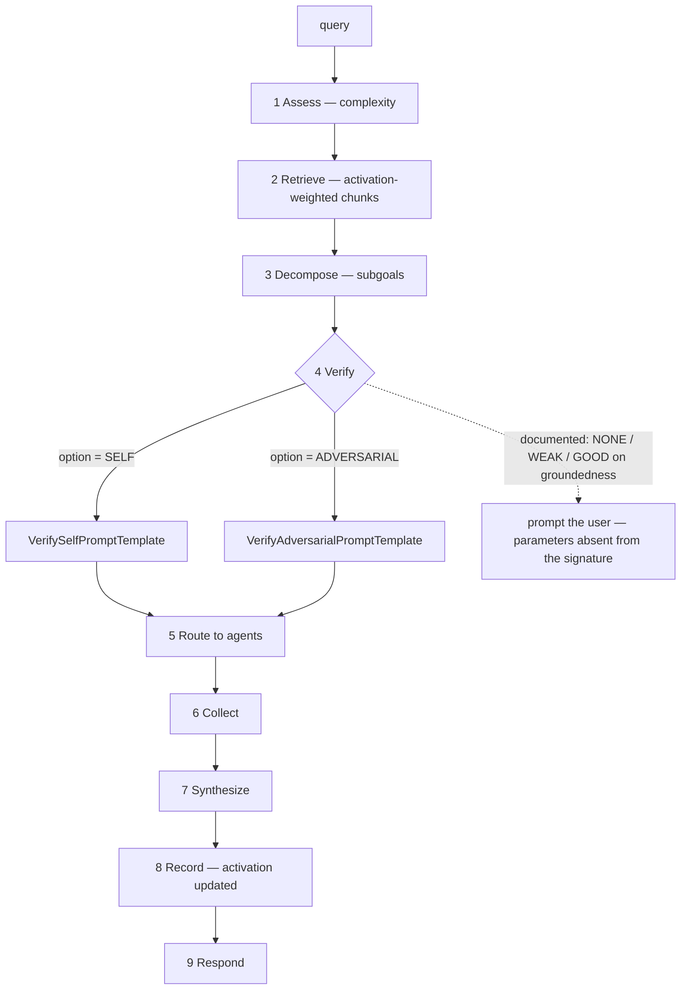

## 1. Executive Summary

AURORA is "code-aware memory and intelligence for AI coding assistants" —
Apache-2.0, roughly 145,000 lines of Python across twelve packages
(`core`, `soar`, `reasoning`, `context-code`, `context-doc`, `planning`,
`implement`, `testing`, `lsp`, `cli`, `spawner`, `examples`).

The memory layer is an ACT-R activation store over code chunks: an `activations`
table keyed on `chunk_id` with `base_level`, `last_access` and `access_count`,
alongside `chunks`, `relationships`, `file_index` and `doc_hierarchy`.

**What earns the report is where verification sits.** The SOAR pipeline is nine
phases — Assess → Retrieve → Decompose → Verify → Route → Collect → Synthesize →
Record → Respond — and Verify comes *before* Route, Collect and Synthesize. The
plan is checked before the expensive work is dispatched, not after.

`aurora_reasoning.verify.verify_decomposition` takes a `VerificationOption` of
`SELF` or `ADVERSARIAL` and selects a prompt template accordingly —
`VerifySelfPromptTemplate` or `VerifyAdversarialPromptTemplate`. An adversarial
option that tries to break the query decomposition, run as a routine phase
rather than as a special case, is the pattern this atlas credits under
[gate the expensive path](../../patterns/gate-the-expensive-path/), applied to
planning rather than to storage.

**And the documented retrieval-quality gate does not match the function it names.**
The `aurora-soar` README specifies quality levels in detail —

- **NONE**: no indexed context → proceed on general knowledge
- **WEAK**: groundedness < 0.7 or fewer than 3 high-quality chunks → prompt the
  user in CLI, auto-continue under MCP
- **GOOD**: groundedness ≥ 0.7 and ≥ 3 chunks → proceed

— with an example calling `verify_decomposition(query=..., decomposition=...,
verification_option="self", interactive_mode=True, retrieval_context={
"high_quality_count": 2, "total_chunks": 5})` and a sample warning showing the
groundedness against its target.

The function's actual signature is
`verify_decomposition(llm_client, query, decomposition, option,
context_summary=None, available_agents=None)`. There is no `interactive_mode`,
no `retrieval_context`, and the option parameter is named `option`, not
`verification_option`. The example as written would raise.

The idea is the right one — *tell the user when the retrieved context is too
weak to answer from*, which is the query-time signal
[ClawMem](../clawmem/) documents itself as lacking — and at this commit the
documentation describes an interface the code does not expose.

## 2. Mental Model

A codebase is chunked and indexed. Each chunk gets an activation record, and
retrieval is weighted by activation rather than by similarity alone — so a chunk
the agent has used recently and often surfaces above an equally-similar one it
has never touched.

Above that sits the pipeline, and the pipeline is the product: a query is
assessed for complexity, context is retrieved, the query is decomposed into
subgoals, the decomposition is verified, subgoals are routed to agents, results
collected and synthesised, and the outcome recorded back.



The dotted edge is the gap in section 1, drawn where the README puts it.

The `Record` phase is worth its own note: the pipeline's second-to-last step
writes back, so using a chunk is what reinforces it. Retrieval and reinforcement
are the same loop, which is what makes the activation model mean anything.

## 3. Architecture

A twelve-package monorepo with `pyproject.toml` per package, strict tooling
(`mypy.ini`, `ruff.toml`, `pytest.ini`) and a `Makefile`.

Storage is SQLite in WAL mode with a `schema_version` table and a migrations
module, and the store code carries explicit legacy-schema detection — the tests
construct a database with an old `activations` shape and check that
`SQLiteStore` recognises it. A memory store that can tell it has been opened
against an older schema, and says so rather than failing on a missing column, is
doing the minimum an upgradeable local store owes its user.

`decomposition_cache` and `query_metrics` as tables mean the expensive planning
step is cached and the pipeline measures itself.

## 4. Essential Implementation Paths

**Index** — `packages/context-code` and `context-doc` chunk the tree into
`chunks`, with `file_index` and `doc_hierarchy` for structure.

**Activate** — `packages/core/src/aurora_core/store/` (`schema.py`, `base.py`,
`memory.py`, `migrations.py`), with `base_level`, `last_access` and
`access_count` per chunk.

**Verify** — `packages/reasoning/src/aurora_reasoning/verify.py:114`
(`verify_decomposition`, `VerificationOption`, `VerificationResult`,
`VerificationVerdict`, `_auto_correct_verdict`, `_calculate_overall_score`).

**Route** — `packages/soar/src/aurora_soar/phases/` (`assess`, `retrieve`,
`verify`, `record`), with `verify_lite` as the lighter in-pipeline check that
"replac[es] the previous heavy `verify_decomposition` + `route_subgoals`
workflow".

## 5. Memory Data Model

Six tables. `activations` is the memory-specific one and it is four columns:
`chunk_id`, `base_level`, `last_access`, `access_count` — the minimum ACT-R needs
and no more.

`relationships` gives the graph, `doc_hierarchy` the document structure, and
`file_index` the mapping back to the tree. There is no status, no confidence, no
provenance and no supersession pointer: a chunk is a piece of the codebase, and
the codebase is the source of truth. Correction is reindexing.

That is a coherent position and it is why this report carries no marks. The
epistemic questions this atlas asks — is this believed, who said it, when did it
stop being true — do not apply to a chunk of the user's own code, and AURORA does
not pretend otherwise.

## 6. Retrieval Mechanics

Activation-weighted retrieval over chunks, with the `Retrieve` phase feeding a
`Decompose` phase rather than answering directly. The "high-quality chunks" the
README's gate counts are those with activation ≥ 0.3, which ties the quality
signal directly to the ACT-R model.

There is no scope key — the store is one codebase.

**And there is a hybrid retriever the first version of this report did not
reach.** `packages/context-code/src/aurora_context_code/semantic/` holds
`bm25_scorer.py`, `embedding_provider.py` and a 1,253-line
`hybrid_retriever.py`, and `HybridConfig` fuses three signals rather than two:

```python
bm25_weight: float = 0.3
activation_weight: float = 0.3
semantic_weight: float = 0.4
```

with `__post_init__` rejecting any weight outside `[0, 1]` and warning when the
three do not sum to one. The docstring names a second intended configuration —
`bm25_weight=0.0` for what it calls dual-hybrid, activation 0.6 and semantic 0.4
— so the lexical arm is switchable off by weight rather than by branch.

That is the part worth noticing about this design: ACT-R activation is not a
post-filter applied to a ranked list, it is one of three weighted terms in the
fusion, so how often a chunk has been used competes directly with how well it
matches. Most hybrid retrievers in this atlas fuse lexical and vector and then
multiply by recency; here recency-of-use is a first-class arm with a third of
the weight. FTS5 backs the lexical side — it appears in `memory_manager.py`,
`commands/memory.py` and the retriever itself. `stack_retrieval` was recorded as
empty and is now `lexical, vector`.

## 7. Write Mechanics

Indexing is a batch operation; the `Record` phase updates activation on use.
There is no correction mechanism because there is nothing to correct: a stale
chunk is a chunk whose file changed, and the fix is to reindex.

The `decomposition_cache` is the one place where a derived artifact persists,
and it is a cache — an incorrect decomposition would persist until evicted, and
nothing found gates what enters it.

## 8. Agent Integration

A CLI, an LSP package, an MCP surface and a `spawner` for sub-agents, with
`planning`, `implement` and `testing` packages suggesting the pipeline is meant
to run whole workflows rather than answer questions.

## 9. Reliability, Safety, and Trust

**No marks**, and the reasons are structural rather than omissions: no scope key
because there is one codebase, no trust state because a chunk is not a claim, no
tombstone because reindexing is the correction, no audit log because
`query_metrics` measures performance rather than recording mutations.

**The verification design is the transferable part** and it is worth separating
from the documentation gap. Running an adversarial check on a *plan* before
dispatching agents is cheap relative to what it gates, and having `SELF` and
`ADVERSARIAL` as an option on the same function — with distinct prompt
templates and `_auto_correct_verdict` behind it — is the right shape.

**The gap a reader must know about** is that the retrieval-quality feature is
documented with parameters the function does not accept. Anyone choosing AURORA
because it warns when context is too weak should verify that behaviour exists on
the path they will use, because the example in the README does not run.

## 10. Tests, Evals, and Benchmarks

**No paper.** 153 test files, a `conftest.py` at the root, per-package test
directories, and `phase2b_baseline_perf.txt` — a committed performance baseline,
which is a modest and honest artifact: a text file recording where performance
stood at a named phase.

No retrieval-quality benchmark is committed, and the groundedness thresholds in
the README (0.7, three chunks) have no evaluation behind them in the tree — they
are stated as targets, not derived from a measurement.

**`negative_eval` is earned, on a contract test run against both store
implementations.** `packages/core/tests/integration/test_memory_store_contract.py`
saves two chunks, sets their activations to 0.1 and 0.9, and queries with a
threshold between them:

```python
result = store.retrieve_by_activation(min_activation=0.5, limit=10)
chunk_ids = [chunk.id for chunk in result]

assert "code:high.py:func" in chunk_ids
assert "code:low.py:func" not in chunk_ids
```

One store, one query, one chunk in and one out, on adjacent lines — so the
refusal cannot be an empty result. The file's fixture is
`@pytest.fixture(params=["memory", "sqlite"])`, so the assertion is made twice,
once against each implementation, which is a stronger guarantee than a single
in-memory case. `packages/context-code/tests/e2e/test_context_retrieval.py:131`
carries the weaker form of the same idea — after a query about a subject the
corpus does not contain, either no results or no result whose name mentions it.

**And one contract test documents a defect rather than failing on it.**
`test_record_access_accepts_optional_parameters` opens with

```python
# Skip MemoryStore due to known bug (access_history not initialized)
if isinstance(store, MemoryStore):
    pytest.skip("MemoryStore has known bug: access_history not initialized")
```

The consequence is visible in the activation model: `base_level.py:139` returns
`self.config.default_activation` when `access_history` is empty, so on a store
that never initialises it every chunk carries the same base-level activation and
the ACT-R term of the fusion is flat. The scope is narrow and worth stating
exactly — `MemoryStore` is the in-memory implementation, reached from
`aurora_testing/fixtures.py` and a docstring example, while `SQLiteStore` is what
the CLI opens. So this is a fixture that does not model the store it stands in
for, which makes every in-memory activation test weaker than it looks. Writing
the bug into a skip is more honest than most repositories manage; the test that
would close it is one `setdefault` away.

**I ran nothing.**

## 11. For Your Own Build

### Steal

- **Verify the plan before you dispatch it.** Verify is phase four of nine, ahead
  of Route, Collect and Synthesize. Checking a decomposition costs one model call
  and gates every call after it.
- **Make adversarial verification an option, not a separate path.** `SELF` and
  `ADVERSARIAL` selecting different prompt templates behind one function means
  the harder check is a parameter away rather than a rewrite.
- **Keep the activation table to four columns.** `chunk_id`, `base_level`,
  `last_access`, `access_count` is all ACT-R needs, and separating it from the
  chunk row keeps the hot-path write small.
- **Make the record phase part of the pipeline.** Reinforcement that happens
  because the pipeline finished, rather than because someone remembered to call
  it, is what keeps an activation model honest.
- **Detect a legacy schema and say so.** The store's tests construct an old
  `activations` table and assert detection — cheaper than a failed migration and
  far cheaper than silent misbehaviour.
- **Commit a performance baseline as a file.** `phase2b_baseline_perf.txt` is not
  a benchmark and it is a fixed point a later change can be compared against.

### Avoid

- **Do not document a function signature you do not have.** The quality-gate
  example passes `interactive_mode` and `retrieval_context` to a function that
  accepts neither, and names the option parameter wrongly. A reader following the
  README gets a `TypeError`, and a reader skimming it gets a feature that is not
  there.
- **Do not state thresholds without the measurement behind them.** Groundedness
  ≥ 0.7 and three chunks are precise numbers with nothing in the tree deriving
  them.
- **Do not cache a decomposition without gating what enters the cache.** A bad
  plan cached is a bad plan repeated.

### Fit

This suits a developer wanting an agent that plans, verifies and executes over
their own codebase, with retrieval that gets better at the parts they work in.
The twelve-package structure and strict tooling suggest it is built to be
extended rather than embedded.

It is not a memory system in the sense this atlas usually measures — nothing is
believed, corrected or forgotten, because the codebase is the truth and the store
is an index over it. Read it for the pipeline, not for the store.

## 12. Open Questions

- **Does the retrieval-quality gate exist on any path?** The thresholds and the
  warning text are documented; the parameters are not in the signature, and no
  `RetrievalQuality` enum was found.
- **What is `verify_lite`'s relationship to the adversarial option?** The soar
  phase is described as replacing the heavy workflow; whether the adversarial
  template is reachable from the pipeline was not traced.
- **What evicts the decomposition cache?** A cached plan for a query whose
  codebase has changed is the obvious hazard.
- **Where did 0.7 come from?** No derivation is committed.

## Appendix: File Index

**Store** — `packages/core/src/aurora_core/store/schema.py` (`chunks` `:13`,
`activations` `:35`, `relationships` `:54`, `file_index` `:75`, `doc_hierarchy`
`:90`, `schema_version` `:127`), `base.py`, `memory.py`, `migrations.py`

**Verification** — `packages/reasoning/src/aurora_reasoning/verify.py:114`
(`verify_decomposition` and its real signature), the `VerificationOption`,
`VerificationResult` and `VerificationVerdict` types,
`packages/reasoning/tests/unit/test_verify.py`

**Pipeline** — `packages/soar/src/aurora_soar/phases/` (`assess.py`,
`retrieve.py`, `verify.py` with `verify_lite`, `record.py`),
`packages/soar/README.md` (the nine phases, the quality levels and the example
that does not match)

**Indexing** — `packages/context-code/`, `packages/context-doc/`,
`packages/core/src/aurora_core/chunks/reasoning_chunk.py`

**Integration** — `packages/cli/`, `packages/lsp/`, `packages/spawner/`,
`packages/planning/`, `packages/implement/`, `packages/testing/`

**Baseline** — `phase2b_baseline_perf.txt`

## History

**2026-09-18** — [`750a39da51ed947aab851e9fd5c06a2587402e2b`](https://github.com/hamr0/aurora/commit/750a39da51ed947aab851e9fd5c06a2587402e2b) — re-read at the same commit. Nothing upstream had moved, so every change is the atlas's own, and the first reading had covered a 145,000-line repository in 305 lines without reaching its retriever.

`stack_retrieval` was empty. `packages/context-code/src/aurora_context_code/semantic/` holds a 1,253-line `hybrid_retriever.py` beside `bm25_scorer.py` and `embedding_provider.py`, and `HybridConfig` fuses BM25 at 0.3, ACT-R activation at 0.3 and embedding similarity at 0.4, validating each weight and warning when the three do not sum to one. Activation is a weighted arm of the fusion rather than a post-filter, which is the distinctive thing about this design and is now in section 6. The field is now `lexical, vector`.

**`negative_eval` is awarded.** `test_memory_store_contract.py:224-226` saves two chunks, sets activations of 0.1 and 0.9, queries at a threshold of 0.5 and asserts the high one is present and the low one is not, on adjacent lines — and the enclosing fixture is parametrized over the in-memory and SQLite stores, so the property is asserted against both.

One more finding from the same file. `test_record_access_accepts_optional_parameters` skips `MemoryStore` with the reason in its own docstring: *"known bug: access_history not initialized"*. `base_level.py:139` returns `default_activation` when the history is empty, so on that store every chunk shares one base-level activation and the ACT-R term goes flat. `MemoryStore` is the in-memory implementation used by `aurora_testing/fixtures.py` and a docstring example rather than by the CLI, so the cost is that the fixture does not model the store it stands in for — which makes every in-memory activation test weaker than it looks. `stack_source` goes from seeded to reviewed.

**2026-08-09** — [`750a39da51ed947aab851e9fd5c06a2587402e2b`](https://github.com/hamr0/aurora/commit/750a39da51ed947aab851e9fd5c06a2587402e2b) — first reading. Screened before reading; the tree was read, never installed, and no test was run.
