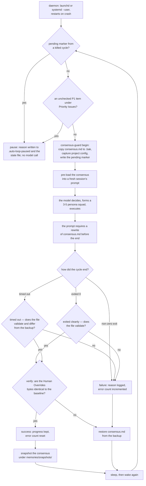

## 1. Executive Summary

Auto Company is a shell loop that runs fourteen agent personas as an
autonomous software company — 518 commits between 1 July 2025 and 16 September
2026 by four authors, now 3,205 lines of shell and 2,354 lines of Python across
`scripts/`, a dashboard, a charter and a prompt, with the personas and skills as
markdown under `.claude/`. The screen found one auto-run surface, one build-time
execution point, three unpinned dependency surfaces and one manifest inside the
seven-day cooldown; nothing was installed or run, and the read was made from a
full clone. The auto-run surface is worth naming: `.claude/settings.json` ships
`"defaultMode": "bypassPermissions"` with Bash, Edit and Write allowed and
nothing in `deny`, which is coherent for an unattended loop and is also what any
reader gets by opening this repository in the same tool. **The README carries an
MIT badge and the repository still contains no licence file**, which is stated
here so a reader knows what they may do with what they read.

**The whole memory is one markdown file.** `memories/consensus.md` is what the
project calls the relay baton: each cycle spawns a fresh session, the loop
pre-loads the file into the prompt, the model decides what to do from it, and
the prompt requires the model to rewrite it before the cycle ends in a stated
layout — a timestamp, the current phase, what this cycle did, the key decisions
and their reasons, the active projects, the company state and the next action.
Humans are told they steer only by editing that file's next-action section
(`CLAUDE.md:17`). The directory it lives in is excluded from the repository by
`.gitignore`, so the mechanism ships and the content does not, which is the
right way round.

**The finding at this pin is that part of the document has been taken away from
the agent.** A 238-line `scripts/core/consensus-guard.sh` and a 110-line
`consensus-format.py` now stand between the loop and the file, and they are
built around two headings the agent may not own:

- **`## Human Overrides` is compared byte for byte.** `begin` copies the file to
  a baseline; after the cycle, `verify_cycle` compares only that section's bytes
  against it (`consensus-format.py:98`). A cycle that changed or deleted it gets
  the pre-cycle consensus restored, a pause flag written with the reason
  `human_override_mutated`, and every subsequent cycle refused until a person
  resumes.
- **An unchecked `- [ ] P1:` blocks the cycle before the model is called.**
  `preflight` returns 41, the loop pauses, and nothing is invoked — so the
  blocking item is not advice the model may weigh but a gate in front of it.

Both are enforced structurally rather than asked for in a prompt, and both are
driven by committed tests against the real loop: one starts the loop with an
unchecked P1, waits for the state file to say `unresolved_p1`, asserts that no
engine call was recorded *at all*, then checks the item off and asserts exactly
one call follows. **`human_review` is earned**, and it is this report's first
mark.

The rest of the guard is the kind of care that is rare at this size. The
consensus must be a regular file — a symlink or a NUL byte is refused, and a
committed test replaces the file with a symlink mid-cycle and asserts the
external target is untouched. Writes go through `mkstemp` and `os.replace`. A
`restore` validates the baseline's structure before trusting it, and a missing
baseline pauses with `restoration failed` rather than claiming a restore that did
not happen — asserted, in those words, by the test beside it. `init` refuses to
re-seed from the template when a backup, a state file, a snapshot directory or a
reset directory says a consensus used to exist. `reset` refuses to run inside a
cycle at all: *"consensus reset is human-only"*, and it preserves both human
sections, keeps the pause flags and writes the prior document to
`memories/resets/` with an exclusive-create open. Every successful cycle leaves a
timestamped snapshot, so the series of past documents now survives — which
retires the previous reading's sharpest criticism, that the only prior state was
one backup the next cycle overwrote.

**The gap is that only one of the two human sections is protected.**
`human_overrides_unchanged` compares `HEADINGS[0]`; `## Priority Issues` is
required to exist exactly once and its contents are the agent's to rewrite. The
rule that only a person may resolve a blocker lives in `PROMPT.md` as prose. The
exposure is narrow, because an unchecked P1 stops the loop before the model runs
— but a P1 a person adds while a cycle is in flight can be checked off or deleted
by that cycle, and verification will pass. The section that stops the agent is
the one the agent can edit.

Three marks stay withheld for reasons worth stating, all in section 9: the
snapshots are a version series rather than a record of what changed;
the checkbox is a discrete state that gates the whole cycle rather than
filtering a read; and the suite's must-not assertions are about the store's bytes
after a rollback and about the engine not being invoked, neither of which is a
negative *retrieval* assertion.

## 2. Mental Model

A memory here is **the whole document**, and the document is a handoff. The
system is deliberately built out of fresh sessions: nothing carries between
cycles except the file, which is why the prompt makes rewriting it mandatory
rather than advisory and the loop treats a cycle that did not update it as a
failed one.

There is no notion of a fact, a claim or a record. There are headings, and under
them prose the next model reads as its entire past. Correction is rewriting,
and forgetting is not writing something down again.

What the guard adds is not structure but **ownership**. The document has an
agent-owned body and two human-owned headings, and the difference between them is
not a schema or a permission bit — it is a byte comparison run twice per cycle
against a copy taken before the model was allowed to start.

The human's role is no longer one line of the charter. Direction is still given
by editing the file, and confirmation is still never requested — but a person now
has two enforced levers: a section the agent cannot keep a change to, and a
checkbox that stops the loop before it spends a model call.



## 3. Architecture

3,205 lines of shell and 2,354 lines of Python across `scripts/`, of which
`scripts/core/auto-loop.sh` (820 lines) is still the spine: it resolves the
engine, builds the prompt, runs the cycle under a timeout, extracts cost and
result metadata, classifies the outcome, trips a circuit breaker on consecutive
errors, and waits on a usage limit. What is new around it is a set of small,
single-purpose modules, and the split is the architectural change worth
recording:

- **`consensus-guard.sh`** (238 lines) — the memory's transaction boundary:
  `init`, `preflight`, `begin`, `verify`, `close`, `recover`, `finish`,
  `snapshot`, `reset`, each a subcommand the loop calls by name.
- **`consensus-format.py`** (110 lines) — the only code that parses the
  document: canonical-heading validation, the protected-section byte compare,
  the unresolved-P1 scan, atomic write, and reset.
- **`project-context.py`** — captures and verifies the human-owned project
  selection around a cycle, the same pattern applied to configuration.
- **`engine-adapters.sh`** — a named adapter contract (`validate`, `resolve`,
  `run`, `extract_metadata`, `write_record`) normalising status, cost and token
  counts across Claude Code, Codex and an OpenAI-compatible agent.
- **`usage.py` / `usage_lib.py`** — a structured per-cycle usage ledger with a
  budget pause.
- **`loop-lock.py`** — an advisory `flock` on the pid file's inode before
  exec'ing bash, so two loops cannot own one checkout.
- **`localization.py`** and `i18n/` — a second language for the runtime
  resources, with `i18n/source-hashes.json` recording what each translation was
  made from and an instruction to keep the protocol headings unchanged.

The engine boundary and the memory boundary are separate files with separate
contracts, which is what makes the governance readable at all.

The agent layer is markdown: fourteen personas under `.claude/agents/`, each
around seventy lines and named for a practitioner, plus thirty-six skills. The
loop does not read them — it tells the model to read a team skill and assemble a
squad, so the composition of each cycle's team is the model's choice.

The dashboard is a small Python server and browser code that render a preview of
the consensus, the recent cycle log and the usage ledger. Its payload
distinguishes a known cost from an unknown one — `status: partial` with
`known_cycles` and `unknown_cycles` counted separately — and counts records it
could not parse rather than dropping them.

### Deployment and ergonomics

- **What has to run:** a coding-agent CLI, a shell, and a daemon supervisor.
  Claude Code by default, Codex CLI as an alternative.
- **Fully local and offline:** the store is a local file; every cycle is a model
  call.
- **Hand-repairable:** entirely — the memory is one markdown file a person can
  open and edit, which is also the documented way to steer the system.
- **Install:** a make target and a per-platform daemon installer.

## 4. Essential Implementation Paths

- **Recover, then gate.** `preflight` (`consensus-guard.sh:70`) runs
  `recover_pending` first — a marker left by a killed cycle forces a restore of
  both the consensus and the human project configuration, and pauses — then
  validates the canonical headings, then returns 41 if an unresolved P1 exists.
  All of this happens before the engine is resolved.
- **Baseline.** `begin_cycle` (`:88`) copies the file to `.bak`, captures the
  project configuration, and writes the pending marker through a `mktemp` and
  `mv` so the marker's appearance is atomic.
- **Pre-load.** The loop reads the whole file into the prompt
  (`auto-loop.sh:615`).
- **Validate, twice and differently.** `validate_consensus`
  (`auto-loop.sh:400-414`) still greps for `# Auto Company Consensus`,
  `## Next Action` and `## Company State`. The guard separately requires
  `## Human Overrides` and `## Priority Issues` each exactly once in canonical
  form — `consensus-format.py:15-40` rejects a trailing space, a trailing `##`,
  a tab after the hashes, a case variant and a duplicate.
- **Detect a real update.** `consensus_changed_since_backup`
  (`auto-loop.sh:416`) still separates a timed-out cycle that made progress from
  one that did not.
- **Verify ownership.** `verify_cycle` (`consensus-guard.sh:153`) compares the
  Human Overrides bytes and the project configuration; either mismatch restores
  the pre-cycle file, writes a pause reason, and returns 42.
- **Snapshot.** `finish_cycle` (`:194`) verifies, snapshots to
  `memories/snapshots/consensus-cycle-NNNN-<UTC timestamp>-<pid>.md`, then clears
  the pending marker — in that order, so a snapshot is never claimed for a cycle
  whose verification failed.
- **Prompt.** `PROMPT.md` gives the cycle its steps and the section layout, and
  states in prose that an unchecked P1 blocks the cycle and may only be resolved
  or checked off by a human.

## 5. Memory Data Model

There is still no schema for a claim, but the document now has a *typed
boundary*. Five headings are enforced rather than asked for: three by the loop's
greps (`# Auto Company Consensus`, `## Next Action`, `## Company State`) and two
by the guard's parser, which requires `## Human Overrides` and
`## Priority Issues` to appear exactly once each in canonical form. A section
runs from its heading to the next line matching `^ {0,3}#{1,2}(?:[ \t]|$)`, so a
`###` subheading stays inside the section it was written under.

Everything under the three loop-checked headings is prose nothing parses. The
layout there remains a convention between the prompt and the next model. The
difference is that two sections are now data the system reads: one it compares,
one it scans for a blocking pattern.

**Temporal:** a timestamp the model writes into the document, plus a UTC stamp
in every snapshot filename. Record time now exists as a filesystem fact and
nothing reads it; there is still no validity time and no as-of query.
`bitemporal` withheld.

**Trust:** none on a claim. The one discrete state in the file is a priority
item's `- [ ]` / `- [x]`, and `unresolved_p1` treats anything other than `x` or
`X` inside the brackets as unresolved — including an empty pair. It gates the
cycle rather than filtering a read, and no stored decision carries a status, so
`trust_state` is withheld. This is the closest this system has come.

**Scoping:** one consensus file per installation. There is now a project
registry and a human-owned active-project selection, captured and verified
around each cycle, but it routes work rather than partitioning memory.
`scope_enforced` withheld.

**Tombstone:** withheld, with one guard nearby that is worth naming.
`init_consensus` refuses to re-seed from the template when a backup, a state
file, a snapshot directory or a reset directory shows a consensus used to exist
— *"existing consensus is missing; restore it explicitly before resuming"* — so
a deleted memory cannot come back as a blank one. That prevents resurrection by
re-initialisation, which is a different thing from a record keyed on a rejected
value. A decision reversed in a later cycle is still simply not written down
again.

## 6. Retrieval Mechanics

There is no retrieval. The file is pre-loaded into the prompt in full, with the
prompt instructing the model to read it from disk if that did not happen. Every
cycle sees all of the memory or none of it.

That is a defensible choice at this scale — one document a person can read is
worth more than an index over it — and it sets the ceiling on how much the
system can remember: whatever fits in a prompt, minus everything else the cycle
needs.

**Failure modes.** The file grows until it crowds the cycle, and nothing prunes
it or summarises it. A model that rewrites it badly still passes the loop's
validation as long as the headings survive. Each rewrite still replaces the whole
document and nothing diffs it — but the failure is no longer silent in the same
way: `memories/snapshots/` holds the document as it stood after every successful
cycle, so a decision that vanished last week is recoverable by reading two files,
even though nothing in the system will tell you it vanished.

## 7. Write Mechanics

The model writes the whole file. Nothing extracts, summarises or merges, and
nothing checks a claim against what the document said before.

What is checked is ownership and shape. The pre-cycle copy is now used for two
purposes rather than one: it is the restore source, and it is the baseline the
Human Overrides bytes are compared against. A cycle that fails the comparison is
rolled back whatever else it achieved, and the pause it writes persists across a
process restart — asserted by a test that kills and restarts the loop.

Three write-path details are better than the size of the system suggests. Writes
go through `mkstemp` plus `os.replace`, so a crash cannot leave a half-written
consensus. The file must be a regular file: a symlink is refused, and a
committed test swaps the consensus for a symlink to an external file mid-cycle
and asserts that the external file's contents are untouched and the consensus is
restored. And `restore` validates the baseline's own structure before copying it
back, so a corrupt baseline pauses instead of overwriting a good file with a bad
one.

### Operational cost

- One model call per cycle, with cost, token counts and subtype normalised by
  the engine adapter and appended to a structured usage ledger.
- Three file copies per successful cycle: the baseline, the snapshot, and the
  project-configuration capture.
- A circuit breaker stops the loop after a configured number of consecutive
  errors; a budget pause stops it when the ledger says the spend is over
  threshold or cannot be verified.
- Snapshots accumulate one file per successful cycle and nothing prunes them.

## 8. Agent Integration

The engine is a coding-agent CLI invoked per cycle with the prompt on standard
input, so the fourteen personas are prompt material rather than processes. The
model is told to pick three to five per cycle through a team skill, and to read
a front-end design skill before producing any user-facing interface.

The human surfaces are the consensus file — with two sections the loop defends
on the person's behalf — the dashboard's read-only preview, the pause flag and
its reason, the project registry, and the stop script. The engine itself is now
behind a named adapter contract, so a reader swapping Claude Code for Codex or
an OpenAI-compatible endpoint changes one file rather than the loop.

## 9. Reliability, Safety, and Trust

**One mark, and each remaining absence was checked rather than assumed.**

- **Human review — earned.** A section of the memory the agent cannot keep a
  change to, compared byte for byte around every cycle and restored with a named
  pause reason on violation; and a blocking item checked before the engine is
  resolved, so the loop stops without spending a model call. Both are exercised
  against the real loop, including across a process restart. The evidence record
  in the frontmatter names the files, the symbols and the tests.
- **Audit log — withheld, and close.** `log_cycle` and the guard's own
  `log_guard` write an append-only line per governance event, keyed to the cycle
  number: baseline captured, snapshot saved with its path, consensus restored,
  interrupted-cycle recovery, each pause with its reason. And
  `memories/snapshots/` holds the document as it stood after every successful
  cycle, so a diff between two cycles is derivable by a reader. What is missing
  is the thing the mark is for: nothing records *what changed* in the document,
  a cycle's own rewrite produces no entry, and a failed cycle leaves no snapshot
  of what it tried to write. A version series plus an operations log is not an
  event record of mutations, and the log directory is `.gitignore`d.
- **Negative evaluation — withheld, and the two near-misses are worth naming.**
  `test_priority_section_deletion_during_cycle_rolls_back_and_pauses` asserts
  that after a violating cycle the file is byte-identical to the baseline — a
  must-not about the store's bytes after a rollback, not about what a query
  returned. `test_unresolved_p1_blocks_real_loop_until_human_resolves_it`
  asserts no engine call was made at all — the retriever not being called rather
  than material being withheld from a result. The suite's one content exclusion,
  `assertNotIn("private-sentinel", json.dumps(payload))` in the dashboard test,
  keeps an API key out of a rendered payload: a secret-leak test on a
  projection.
- **Trust state — withheld.** See section 5: a checkbox that gates the cycle, no
  status on any stored decision.
- **Bitemporal — withheld.** A model-written timestamp in prose and a UTC stamp
  in snapshot filenames that nothing reads.
- **Tombstone — withheld.** A grep for tombstone, rejected, denylist, blocklist
  or a do-not-retry instruction across `scripts/`, `memories/`, `PROMPT.md` and
  `CLAUDE.md` returns nothing at this pin.
- **Scope — withheld.** One consensus per installation. The grep for `tenant` or
  `namespace` returns two hits and both are `argparse.Namespace`, which is
  recorded in the appendix because the search word and the mechanism happen to
  share a spelling.

**What the guard does and does not protect.** It protects the human-owned
section absolutely, the priority gate before any spend, and the file's integrity
against a crash, a kill, a symlink swap and a corrupt baseline. It does not
protect the agent-owned body from being rewritten confidently and wrongly, since
validation there is still heading presence. It does not protect Priority Issues
from the cycle. And it cannot tell anyone that something was lost — only leave
the evidence that it was.

**Two things a reader should weigh.** The repository shows an MIT badge and
still carries no licence file, so the terms are unstated in the tree. And
`.claude/settings.json` ships `bypassPermissions` with Bash, Edit and Write
allowed, which is what an unattended loop needs and also what a curious reader
inherits by opening the repository in the same tool.

## 10. Tests, Evals, and Benchmarks

**The previous reading's sharpest criticism is retired.** It said the one
mechanism the report credited was the one with no coverage. There are now
sixteen test files and 4,579 lines under `tests/`, with fixtures that stand in
for the engine, for `systemctl`, and for a signal harness — and the governance
of the memory is the most heavily tested thing in the repository.

`tests/test_governance_boundaries.py` (562 lines) is the file to read. It runs
the real scripts in a temporary framework root with its own git repository, and
its second class drives the actual loop against a fake engine. The cases that
matter here:

- An unchecked P1 blocks the loop until the item is checked off, asserted by the
  absence of any engine-call record and then by exactly one.
- A human-override pause survives a process restart.
- SIGTERM during the engine restores the pre-cycle consensus before exit, clears
  the pending marker and leaves the pause reason `interrupted_cycle`.
- SIGKILL followed by a restart recovers the pending governance *before* another
  engine call is allowed.
- A missing baseline pauses with `restoration failed` and explicitly **not**
  with `restored pre-cycle consensus` — the test asserts the absence of the
  reassuring message.
- Replacing the consensus with a symlink to an external file mid-cycle leaves
  the external file untouched.
- Malformed governance headings — a trailing space, a trailing `##`, a tab after
  the hashes — are each rejected, parametrized over both headings.
- A reset preserves the human sections and the pause, and leaves exactly one
  recoverable original.
- A completed cycle allows human edits while the loop is stopped.

A GitHub Actions workflow runs the shell entrypoints, the project and consensus
governance, the process supervisor and a loop integration script, and it
exercises real `systemd` installation and both PowerShell editions rather than
mocking them.

There is still no benchmark, no evaluation and no measured claim about the
memory itself — which is the right shape for this system: the tests assert
mechanism, and mechanism is all it claims.

**One test worth borrowing outright.** `test_localization.py` asserts that
`i18n/source-hashes.json` still matches the sources it was derived from, and
that a translation whose source has changed is *not served*: the loop falls back
to the user's own text. `source_digest` normalises CRLF to LF before hashing, and
a committed case asserts that a line-ending-only change keeps the translation
while a content change drops it. Re-derived here at this pin, all twenty-two
recorded digests match the tree. A derived artifact that carries the hash of what
it was derived from, and is discarded rather than served when they disagree, is
exactly the mechanism most memory systems lack for their summaries.

## 11. For Your Own Build

### Steal

- **Give a person a region of the memory the agent cannot keep a change to.**
  Not a permission system: a copy taken before the model starts and a byte
  comparison afterwards, with the pre-cycle file restored and every later cycle
  refused when they differ. About forty lines of shell and one small parser.
- **Put the blocking check before the spend.** An unresolved item that stops the
  loop *before* the engine is resolved costs nothing and cannot be argued with by
  the model, which is the difference between a gate and an instruction.
- **Record what a derived artifact was derived from, and refuse to serve it when
  that changes.** A hash per source file, a normalisation that ignores line
  endings, and a fallback to the original. This is the summary-staleness problem
  most of this corpus has and does not solve.
- **Wrap a markdown memory in a transaction.** Copy it, run, validate the
  structure, and restore on failure. Three shell functions and about twenty
  lines, and they turn a crash from data loss into a lost cycle.
- **Snapshot on success only, and name the snapshot after the cycle.** A
  version series costs one `cp` and turns "the decision is gone" from
  unanswerable into a diff.
- **Do not claim a restore you did not perform.** When the baseline is missing,
  pause with `restoration failed` and assert in a test that the reassuring
  message is absent.
- **Treat a timeout that still updated memory as a success.** Distinguishing
  *the run was cut short* from *the run achieved nothing* is what stops a slow
  cycle discarding real work, and it costs one comparison against the backup.
- **Fail a cycle whose memory does not validate, even when the process exited
  cleanly.** A zero exit code says the model stopped, not that it handed
  anything on.
- **Say in one line how a human steers.** Naming the section a person edits, and
  saying that confirmation is never requested, is a clearer contract than a
  configuration surface.

### Avoid

- **Validating headings and calling it validation.** Greps accept a document
  whose every decision was replaced with an empty bullet, and that is still the
  rule for everything outside the two governed sections.
- **Protecting one of two human sections.** The section that stops the agent is
  the one the agent may rewrite, and the rule that only a person may resolve a
  blocker lives in the prompt rather than in the comparison.
- **A case-insensitive match as a supersession key.** This repository's own
  Windows fix is the cleanest statement of it in the corpus: PowerShell's
  `-match` folds case against the current culture, so under `tr-TR` an `I`
  lowercases outside `[A-Za-z]`, no existing key matched, *"none is treated as
  superseded, and each run appends a full copy"* — and all four keys written
  contain an `I`. The config file grew without bound and behaviour stayed correct
  because the last value wins, which is why nobody would have noticed. The fix
  is `-cmatch`, with the reason stated as a property rather than a workaround:
  environment variable keys are case-sensitive.
- **Shipping a licence badge without a licence file.** Still true at this pin.

### Fit

Right as a worked example of how little machinery an autonomous loop needs, and
now also as the smallest honest implementation of a human-owned region in an
agent's memory: a copy, a byte comparison and a pause reason. Take the guard and
the source-hash staleness rule whatever you are building. Wrong as a memory
system — there is no retrieval, no status and no scope, the history is a version
series rather than a record of change, and the document is bounded by what fits
in a prompt.

## 12. Open Questions

- Will the Priority Issues section be compared too? The parser already returns
  both sections and the comparison is one more equality; the question is whether
  a cycle is meant to be able to *add* a blocker, which byte equality would
  forbid.
- What would a content-level validator check outside the governed sections?
  Section presence is cheap and weak; a decision count that never falls, or a
  next action that changed, are both one `grep` away.
- Do the snapshots get pruned, or read? Nothing reads `memories/snapshots/` and
  nothing removes from it, so the series grows one file per successful cycle and
  exists for a person who thinks to look.
- Does the consensus get pruned? Nothing summarises it, and it is read in full
  each cycle.
- Would the four-field discipline the project applies to its Windows fixes suit
  its memory? The commit that fixed the culture-sensitive match states the
  failure as a property of the operator rather than as a bug report; nothing in
  the consensus records a reason that way.

## Appendix: File Index

| Path | Lines | What it holds |
| --- | --- | --- |
| `scripts/core/consensus-guard.sh` | 238 | The memory's transaction boundary: `init_consensus` (53), `preflight` (70), `begin_cycle` (88), `recover_pending` (99), `human_overrides_unchanged` (140), `snapshot_consensus` (144), `verify_cycle` (153), `reset_consensus` (179), `finish_cycle` (194) |
| `scripts/core/consensus-format.py` | 110 | The only parser: `HEADINGS` (12), `sections` with its symlink and NUL refusals (15), `unresolved_p1` (43), `atomic_write` (56), `reset_consensus` (68), and the `unchanged` comparison that covers `HEADINGS[0]` only (98) |
| `scripts/core/auto-loop.sh` | 820 | The loop; the guard calls (611, 708), backup (387), restore (393), heading validation (400-414), change detection (416), the pre-load (615), classification (687-716), the restore call (752) |
| `memories/consensus.template.md` | 34 | The seeded document, including the line that teaches the `- [ ] P1:` convention — and it does not itself match the P1 scan |
| `PROMPT.md` | — | The cycle steps and the consensus layout, in Chinese; the English resource is `i18n/en/PROMPT.md` |
| `CLAUDE.md` | — | The charter; the human-steering rule and the baton rule |
| `scripts/core/localization.py` | — | `source_digest` (76) and the manifest read (80): a translation is served only while its source hash matches |
| `scripts/core/project-context.py`, `project.sh` | — | Capture and verify of the human-owned project selection |
| `scripts/core/engine-adapters.sh`, `usage.py`, `loop-lock.py` | — | The engine contract, the usage ledger and the pid-file advisory lock |
| `tests/test_governance_boundaries.py` | 562 | The governance suite, including the real-loop cases under SIGTERM and SIGKILL |
| `tests/` | 16 files, 4,579 lines | Up from one file and 195 lines at the previous pin |
| `.github/workflows/auto-company-runtime-ci.yml` | — | Runs the shell entrypoints, both governance suites, the supervisor and a loop integration script |
| `.gitignore` | — | Excludes `memories/*` with an exception for `consensus.template.md`, so the mechanism and its seed ship and the content does not |

**Searches recorded for the negative claims**

Re-run at this pin, over `scripts/`, `memories/`, `PROMPT.md` and `CLAUDE.md`
rather than over the loop script alone:

```sh
grep -rniE 'tombstone|rejected|denylist|blocklist|do not retry' scripts memories PROMPT.md CLAUDE.md
                                                                # none: no record of a rejected value
grep -rniE 'status:|confidence|verified|provisional' PROMPT.md CLAUDE.md memories/consensus.template.md
                                                                # none: no status on anything stored
grep -rniE 'tenant|namespace' scripts/core/*.sh scripts/core/*.py
                                                                # two hits, both `argparse.Namespace`
grep -rniE 'valid_from|valid_to|as_of|expires_at|superseded' scripts memories PROMPT.md
                                                                # none: no validity axis
grep -rn 'assertNotIn' tests/*.py                               # 78 negative assertions in the suite; the
                                                                # only content exclusion keeps an API key
                                                                # out of the dashboard payload
ls LICENSE* COPYING*                                            # still absent, against an MIT badge
```

The `tenant`/`namespace` hits are the reason this list exists: a search word and
an unrelated identifier can share a spelling, and a count is not a reading.

## History

**2026-09-19** — re-pinned to [`e1dfce15a036be3627b4da394ae362f85b8f5b50`](https://github.com/MaxMiksa/Auto-Company/commit/e1dfce15a036be3627b4da394ae362f85b8f5b50), 37 commits and 156 files on. **The mark holds**, and the evidence record is rewritten around the part that answers the producer question, which the first reading — made on 2026-09-17, a day before the rubric narrowed — did not name. The byte-for-byte baseline is unchanged: `unchanged` in `consensus-format.py:98-100` diffs the `Human Overrides` section against the backup, and `verify_cycle` restores the pre-cycle consensus, writes a `human_override_mutated` pause flag and refuses every later cycle with 42. An unchecked `- [ ] P1:` still returns 41 from `preflight`, before the engine is invoked, so work waits on a box only a person ticks. What settles it is `reset_consensus`: `auto-loop.sh:465` exports `AUTO_COMPANY_CYCLE=1` around the agent's cycle, and the reset opens by dying with *"consensus reset is human-only"* when that flag is set. The gate is the execution context, not a string the caller supplies — the agent cannot present itself as not-the-cycle from inside the cycle. Screened again first; nothing installed or run.

**2026-09-17** — [`8a85f3b5cc3d925fd1b65cc6606dcf7265c20ebc`](https://github.com/MaxMiksa/Auto-Company/commit/8a85f3b5cc3d925fd1b65cc6606dcf7265c20ebc) — second reading, 16 commits along `main` and three tagged releases (v1.2.0, v1.2.1, v1.3.0) after three and a half months of no movement. The three tags exist in the repository, and the commits reaching them are merges of `agent/`- and `release/`-prefixed branches, so most of the change lands in a few large commits rather than incrementally. 95 files changed, 13,087 insertions. Screened at this pin: one auto-run surface, one build-time execution path, three unpinned dependency surfaces and one manifest inside the seven-day cooldown; nothing was installed and nothing was run, from a full clone. The auto-run surface is `.claude/settings.json`, and it is now recorded in the report rather than counted: `"defaultMode": "bypassPermissions"` with Bash, Edit and Write allowed and an empty `deny` list.

**`human_review` is earned, and it is the first mark this report carries.** A 238-line `consensus-guard.sh` and a 110-line `consensus-format.py` now sit between the loop and the file. `## Human Overrides` is copied to a baseline before the model starts and compared byte for byte afterwards; a cycle that changed it has the pre-cycle consensus restored, a pause written with the reason `human_override_mutated`, and every later cycle refused. An unchecked `- [ ] P1:` item under `## Priority Issues` returns 41 from `preflight`, which runs before the engine is even resolved, so the loop stops without a model call. Both are driven by committed tests against the real loop: one waits for the state file to read `unresolved_p1`, asserts that no engine call was recorded at all, then checks the item off and asserts exactly one follows.

**Two published criticisms are retired by the code rather than narrowed.** The previous reading said the only prior state was one backup the next cycle overwrote; `finish_cycle` now writes `memories/snapshots/consensus-cycle-NNNN-<UTC>-<pid>.md` after every successful cycle, and `reset` keeps the prior document under `memories/resets/` with an exclusive-create open. It also said no test exercised the loop at all, and that the one mechanism the report credited was the one with no coverage; `tests/` has gone from one file and 195 lines to sixteen files and 4,579 lines, with `test_governance_boundaries.py` (562 lines) driving the real loop under SIGTERM and SIGKILL, swapping the consensus for a symlink mid-cycle to assert an external file is untouched, and asserting that a missing baseline pauses with `restoration failed` and explicitly *not* with `restored pre-cycle consensus`. A GitHub Actions workflow runs the governance suites, the supervisor, a loop integration script, real `systemd` installation and both PowerShell editions.

**The new criticism is that only one of the two human sections is defended.** `human_overrides_unchanged` compares `HEADINGS[0]`; `## Priority Issues` must exist exactly once and its contents are the cycle's to rewrite, with the rule that only a person may resolve a blocker living in `PROMPT.md` as prose. The exposure is narrow — an unchecked P1 stops the loop before the model runs — but a blocker a person adds while a cycle is in flight can be checked off or deleted by that cycle and verification will pass. Three marks stay withheld with the reasons now stated as near-misses rather than as absences: the snapshots plus the guard log are a version series and an operations log rather than a record of what changed; the P1 checkbox is a discrete state that gates a whole cycle rather than filtering a read; and the suite's must-not assertions are about the store's bytes after a rollback and about the engine not being invoked. The appendix's searches were re-run at a wider scope than the loop script, and the `tenant`/`namespace` grep's two hits are both `argparse.Namespace`.

**Verified rather than assumed:** all twenty-two digests in `i18n/source-hashes.json` match their sources at this pin, re-derived here with the same CRLF normalisation `source_digest` applies. That mechanism — a derived artifact carrying the hash of its source, and a fallback to the source when they disagree — is the best transferable idea in the repository and is now recorded in section 11. The README still carries an MIT badge over no licence file.

**2026-09-08** — [`ebfab9b4bd5f0ab5ad452a1ff85285b3c141acdd`](https://github.com/MaxMiksa/Auto-Company/commit/ebfab9b4bd5f0ab5ad452a1ff85285b3c141acdd) — first reading, at the head of `main`, on a commit from 20 May 2026. Screened before anything was read: one auto-run surface, one build-time execution point, nothing inside the seven-day cooldown; nothing was installed or run, and the read was made from a full clone. No capability marks, and each of the seven was checked with a search recorded in the appendix rather than assumed from the system's size. The finding is the transactional guard around the consensus file — back up, validate three headings, keep a timed-out cycle that still updated it, restore on any hard failure — which is more than most single-file memory systems in this corpus do, and which is itself untested. The repository shows an MIT badge and carries no licence file; that is recorded in section 1 rather than treated as an exclusion. The reading covers the loop, the consensus mechanism, the prompt and charter that define the document's shape, and the dashboard; the per-platform installers, the thirty-six skills and the single sample project were treated as context.
