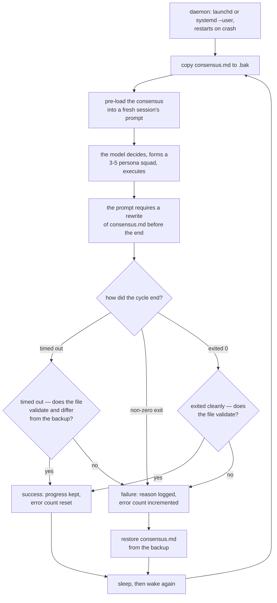

## 1. Executive Summary

Auto Company is a shell loop that runs fourteen agent personas as an
autonomous software company — 502 commits between 1 July 2025 and 20 May 2026
by three authors, 1,410 lines of shell across eight scripts, 396 lines of
dashboard, a 191-line charter and a 68-line prompt, with the personas and
thirty-six skills as markdown under `.claude/`. The screen found one auto-run
surface and one build-time execution point; nothing was installed or run, and
the read was made from a full clone. **The README carries an MIT badge and the
repository contains no licence file**, which is stated here so a reader knows
what they may do with what they read.

**The whole memory is one markdown file.** `memories/consensus.md` is what the
project calls the relay baton: each cycle spawns a fresh session, the loop
pre-loads the file into the prompt, the model decides what to do from it, and
the prompt requires the model to rewrite it before the cycle ends in a stated
layout — a timestamp, the current phase, what this cycle did, the key decisions
and their reasons, the active projects, the company state and the next action.
Humans are told they steer only by editing that file's next-action section
(`CLAUDE.md:17`). The directory it lives in is excluded from the repository by
`.gitignore`, so the mechanism ships and the content does not, which is the
right way round.

**The one thing worth taking is the guard around it.** Before each cycle the
loop copies the file to `.bak` (`scripts/core/auto-loop.sh:245-249`, called at
`:647`). Afterwards it classifies the outcome, and the classification is more
careful than the size of the script suggests. A cycle that timed out but left a
consensus that both validates and differs from the backup is recorded as a
success and its progress kept (`:691-693`, `:702-707`). A cycle that timed out
without that is a failure. A non-zero exit is a failure. And a cycle that exited
cleanly whose consensus does not validate is *also* a failure, with the reason
recorded as `consensus.md validation failed after cycle` (`:698-700`). On any
hard failure the backup is restored (`:719`), so a crashed or truncated cycle
cannot leave a half-written memory in place. Validation itself is three `grep`s
for required headings plus a non-empty check (`:258-272`).

That is a transaction around a markdown file, and it is the finding: most
single-file memory systems in this corpus write and hope.

**No capability marks.** There is no record of a rejected value, no status on
anything stored, no validity time, no scope key, no append-only record of what
changed, no surface where a person reviews a candidate rather than editing the
live file, and no test that asserts anything must not be retrieved — the sole
test file covers the dashboard server. Each is recorded as an absence in section
9 with the search that grounds it.

**Three limits belong beside the strength.** The file is rewritten wholesale
each cycle and nothing keeps what it said before, so the only prior state in
existence is one backup the next cycle overwrites — a decision reversed on
Tuesday leaves no trace by Thursday. The validator checks that three headings
exist and nothing about what is under them, so a cycle that replaces every
decision with one empty bullet passes. And no test exercises the loop at all.

## 2. Mental Model

A memory here is **the whole document**, and the document is a handoff. The
system is deliberately built out of fresh sessions: nothing carries between
cycles except the file, which is why the prompt makes rewriting it mandatory
rather than advisory and the loop treats a cycle that did not update it as a
failed one.

There is no notion of a fact, a claim or a record. There are headings, and under
them prose the next model reads as its entire past. Correction is rewriting,
and forgetting is not writing something down again.

The human's role is stated in one line of the charter: direction is given by
editing the next-action section, and confirmation is never requested.



## 3. Architecture

Eight shell scripts totalling 1,410 lines, of which `scripts/core/auto-loop.sh`
(743 lines) is the system: it resolves the engine, builds the prompt, runs the
cycle under a timeout, extracts cost and result metadata, classifies the
outcome, manages the consensus backup, trips a circuit breaker on consecutive
errors, and waits when it detects a usage limit. Beside it are a monitor and a
stop script, and per-platform installers for macOS launchd and Windows or WSL.

The agent layer is markdown: fourteen personas under `.claude/agents/`, each
around seventy lines and named for a practitioner, plus thirty-six skills. The
loop does not read them — it tells the model to read a team skill and assemble a
squad, so the composition of each cycle's team is the model's choice.

The dashboard is a small Python server and 396 lines of browser code that render
a preview of the consensus and the recent cycle log.

### Deployment and ergonomics

- **What has to run:** a coding-agent CLI, a shell, and a daemon supervisor.
  Claude Code by default, Codex CLI as an alternative.
- **Fully local and offline:** the store is a local file; every cycle is a model
  call.
- **Hand-repairable:** entirely — the memory is one markdown file a person can
  open and edit, which is also the documented way to steer the system.
- **Install:** a make target and a per-platform daemon installer.

## 4. Essential Implementation Paths

- **Back up.** `backup_consensus` (`scripts/core/auto-loop.sh:245-249`) copies
  the file to `.bak`; called once per cycle at `:647`.
- **Validate.** `validate_consensus` (`:258-272`) fails on an empty file or a
  missing `# Auto Company Consensus`, `## Next Action` or `## Company State`
  heading.
- **Detect a real update.** `consensus_changed_since_backup` (`:274`) is what
  separates a timed-out cycle that still made progress from one that did not.
- **Classify.** `:687-700` sets a failure reason from the timeout, the exit code
  or a failed validation, and `:702-716` records a soft timeout or a success and
  resets the error count.
- **Roll back.** `restore_consensus` (`:251-257`) is called at `:719` on a hard
  failure, and logs that it did.
- **Prompt.** `PROMPT.md` gives the cycle its four steps and the exact section
  layout the rewritten consensus must carry; `CLAUDE.md:183` names the file as
  the cross-cycle baton that must be updated before the cycle ends.

## 5. Memory Data Model

There is no schema. The document must carry three headings for the loop to
accept it, and the prompt asks for several more — last updated, current phase,
what we did this cycle, key decisions made, active projects. Nothing parses any
of them, so the layout is a convention between the prompt and the next model
rather than a structure the system understands.

**Temporal:** a timestamp the model writes into the document. No record time, no
validity time, nothing queryable. `bitemporal` withheld.

**Trust:** none. `trust_state` withheld.

**Scoping:** one file. `scope_enforced` withheld.

**Tombstone:** withheld. A decision reversed in a later cycle simply is not
written down again, and nothing records that it was tried.

## 6. Retrieval Mechanics

There is no retrieval. The file is pre-loaded into the prompt in full, with the
prompt instructing the model to read it from disk if that did not happen. Every
cycle sees all of the memory or none of it.

That is a defensible choice at this scale — one document a person can read is
worth more than an index over it — and it sets the ceiling on how much the
system can remember: whatever fits in a prompt, minus everything else the cycle
needs.

**Failure modes.** The file grows until it crowds the cycle, and nothing prunes
it or summarises it. A model that rewrites it badly passes validation as long as
three headings survive. And because each rewrite replaces the whole document,
the failure is silent: there is no diff, no history and no signal that a
decision recorded last week is gone.

## 7. Write Mechanics

The model writes the whole file. Nothing extracts, summarises or merges, and
nothing checks a claim against what the document said before — the previous
version exists only as the backup, which is there to survive a crash rather than
to be compared against.

The one guard is structural and it is applied after the fact: if the rewrite
does not carry the three headings, the cycle is a failure and the backup comes
back. That catches a truncated or empty write, which is the failure a
crash-prone loop actually has.

### Operational cost

- One model call per cycle, with cost and subtype extracted into the log.
- Two file copies per cycle.
- A circuit breaker stops the loop after a configured number of consecutive
  errors.

## 8. Agent Integration

The engine is a coding-agent CLI invoked per cycle with the prompt on standard
input, so the fourteen personas are prompt material rather than processes. The
model is told to pick three to five per cycle through a team skill, and to read
a front-end design skill before producing any user-facing interface.

The human surfaces are the consensus file, the dashboard's read-only preview,
and the stop script.

## 9. Reliability, Safety, and Trust

**No marks, and each absence was checked rather than assumed.**

- **Tombstone.** No record of a rejected value: a search for tombstone, rejected,
  denylist, blocklist or a do-not-retry instruction across the whole tree returns
  nothing.
- **Trust state.** No status, confidence, verified or provisional vocabulary in
  the prompt or the charter, and nothing on the document to filter.
- **Bitemporal.** One timestamp, written by the model into prose.
- **Scope.** One file per installation; the only occurrence of the word is an
  instruction to persist partial decisions when the work is large.
- **Audit log.** `log_cycle` writes cycle outcomes — start, guard, ok, fail,
  summary, limit — to a log directory that `.gitignore` excludes. It is a record
  of runs, not of memory mutations: no consensus write, restore or validation
  failure produces a record keyed to what changed in the document.
- **Human review.** A person edits the live file. The charter is explicit that
  confirmation is never requested, and the dashboard renders a preview and
  writes nothing.
- **Negative evaluation.** The only test file covers the dashboard server, and
  its assertions are that a module spec and loader are not `None`.

**What the guard does and does not protect.** It protects against a cycle that
died mid-write or produced nothing usable. It does not protect against a cycle
that wrote confidently and wrongly, because the validator reads headings rather
than content, and it cannot protect against loss, because the only prior version
is a backup that the next cycle's first action overwrites.

**Two things a reader should weigh.** The repository shows an MIT badge and
carries no licence file, so the terms are unstated in the tree. And the last
commit is 20 May 2026, so this report describes a system that has not moved in
three and a half months.

## 10. Tests, Evals, and Benchmarks

One test file, 195 lines, covering the dashboard server. Nothing tests the loop,
the consensus validator, the backup or the restore — which is to say the one
mechanism this report credits is the one with no coverage. No benchmark, no
evaluation and no measured claim.

## 11. For Your Own Build

### Steal

- **Wrap a markdown memory in a transaction.** Copy it, run, validate the
  structure, and restore on failure. Three shell functions and about twenty
  lines, and they turn a crash from data loss into a lost cycle.
- **Treat a timeout that still updated memory as a success.** Distinguishing
  *the run was cut short* from *the run achieved nothing* is what stops a slow
  cycle discarding real work, and it costs one comparison against the backup.
- **Fail a cycle whose memory does not validate, even when the process exited
  cleanly.** A zero exit code says the model stopped, not that it handed
  anything on.
- **Say in one line how a human steers.** Naming the section a person edits, and
  saying that confirmation is never requested, is a clearer contract than a
  configuration surface.

### Avoid

- **Validating headings and calling it validation.** Three greps accept a
  document whose every decision was replaced with an empty bullet.
- **Rewriting the whole memory each cycle with no history.** One backup that the
  next cycle overwrites means a decision can vanish between two runs with no
  diff and no signal.
- **Leaving the one mechanism you rely on untested.** The dashboard has a test
  file; the consensus transaction does not.
- **Shipping a licence badge without a licence file.**

### Fit

Right as a worked example of how little machinery an autonomous loop needs:
fourteen personas, a prompt, and one file that must be rewritten before the
cycle ends. The transactional guard is worth copying whatever you are building.
Wrong as a memory system — there is no retrieval, no history, no status and no
scope, and the document is bounded by what fits in a prompt.

## 12. Open Questions

- What would a content-level validator check? Section presence is cheap and
  weak; a decision count that never falls, or a next action that changed, are
  both one `grep` away.
- Should the backup chain be longer than one? A single `.bak` protects against a
  crash and not against a bad cycle, and a dated copy per cycle is one `cp`.
- Does the file get pruned? Nothing summarises it, and it is read in full each
  cycle.

## Appendix: File Index

| Path | Lines | What it holds |
| --- | --- | --- |
| `scripts/core/auto-loop.sh` | 743 | The loop; backup (245-249), restore (251-257), validate (258-272), change detection (274), classification (687-716), the restore call (719) |
| `PROMPT.md` | 68 | The four cycle steps and the required consensus layout |
| `CLAUDE.md` | 191 | The charter; the human-steering rule (17) and the baton rule (183) |
| `.claude/agents/` | 14 files | The personas, about seventy lines each |
| `.claude/skills/` | 36 | The skills a cycle may read, including the team assembly one |
| `dashboard/` | 396 plus a Python server | A read-only preview of the consensus and the cycle log |
| `tests/test_dashboard_server.py` | 195 | The only test file |
| `.gitignore` | — | Excludes `memories/*`, so the store ships as a mechanism and not as content |

**Searches recorded for the negative claims**

```sh
rg -i 'tombstone|rejected|denylist|blocklist|do not retry' .    # none: no record of a rejected value
rg -i 'status:|confidence|verified|provisional' PROMPT.md CLAUDE.md   # none: no status on anything stored
rg -i 'scope|tenant|namespace' scripts/core/auto-loop.sh        # one hit, an instruction about large work
rg -n 'assert.*not |not in ' tests/test_dashboard_server.py     # two, both about a module loader
ls memories/                                                     # absent: gitignored, mechanism ships and content does not
ls LICENSE*                                                      # absent, against an MIT badge in the README
```

## History

**2026-09-08** — [`ebfab9b4bd5f0ab5ad452a1ff85285b3c141acdd`](https://github.com/MaxMiksa/Auto-Company/commit/ebfab9b4bd5f0ab5ad452a1ff85285b3c141acdd) — first reading, at the head of `main`, on a commit from 20 May 2026. Screened before anything was read: one auto-run surface, one build-time execution point, nothing inside the seven-day cooldown; nothing was installed or run, and the read was made from a full clone. No capability marks, and each of the seven was checked with a search recorded in the appendix rather than assumed from the system's size. The finding is the transactional guard around the consensus file — back up, validate three headings, keep a timed-out cycle that still updated it, restore on any hard failure — which is more than most single-file memory systems in this corpus do, and which is itself untested. The repository shows an MIT badge and carries no licence file; that is recorded in section 1 rather than treated as an exclusion. The reading covers the loop, the consensus mechanism, the prompt and charter that define the document's shape, and the dashboard; the per-platform installers, the thirty-six skills and the single sample project were treated as context.
