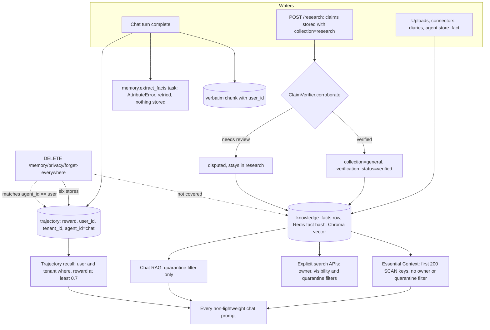

## 1. Executive Summary

AutoBot is a self-hosted AI platform — chat, a RAG knowledge base, a fleet
manager and installable modules — whose memory is spread over six stores. The
knowledge-base fact store feeds an always-loaded *Essential Context* block and
the chat RAG search. A trajectory store recalls similar high-reward past turns.
Verbatim turns, a Redis memory graph, working memory and a SQLite store sit beside
them. This report covers what stores, retrieves and corrects memory, and leaves
the rest of the platform out.

What is notable is the per-store engineering. The fact row lives in Postgres and
Redis and ChromaDB are projections. The SQLite store cannot be queried without an
owner. Trajectories are filtered by user and tenant with a client-side backstop.
Web-research claims sit in a quarantine that only a corroboration gate lifts.

What is weak is the composition. The Essential Context block reads 200
arbitrary facts with no owner, visibility or quarantine filter and prepends them
to every chat turn. The chat RAG path excludes quarantine and nothing else. The
per-turn fact extraction calls a method that no class defines. The user-facing
forget spans six stores and omits the fact store.

The six stores were built under separate issues and are exposed together by the
transparency engine in `memory/transparency.py`, which lists, forgets and exports
per user. That engine's store map is the clearest account of what the project
treats as memory, and its omissions are the clearest account of where the stores
disagree. The project's own audit of 8 August 2026
(`docs/research/layered-agent-memory-and-context-offload.md`) found the SQLite
store untenanted; the required owner argument is the fix, issue #13688.

Four marks: `trust_state`, `scope_enforced`, `audit_log` and `negative_eval`.
Section 9 names the three withheld.

## 2. Mental Model

A memory here is whichever row a store holds, and the stores give different
answers about how it becomes believed. A knowledge-base fact is believed on
write: `_apply_provenance_defaults` stamps `verification_status: unverified` and
`quality_score: 0.0`, and nothing reads the status to withhold the fact
(`knowledge/facts.py:383-411`). The exception is a web-research claim, which is
written into the `research` collection and withheld from general reads until
promoted.

The research path is the one state machine with a gate. `POST /research` fetches
sources, extracts claims and stores each one quarantined
(`services/research/orchestrator.py:104-126`). Only claims the synthesiser cited
are corroborated. `ClaimVerifier.corroborate` either returns verified, and
`_promote_fact` moves the fact to the `general` collection, or asks for human
review, and `_flag_contradiction` writes `contradicts` relations and marks it
`disputed` in quarantine (`orchestrator.py:153-199, 302-324`). Nothing drains
`disputed`.

A trajectory becomes recallable when a judge scores it. After each chat turn
`capture_chat_trajectory` asks `TaskOutcomeJudge` for a score in `[0, 1]` and
stores the turn with that reward. Retrieval admits only rewards of at least
0.7 (`chat_workflow/trajectory_context.py:38, 133-189`). A nightly pass
collapses duplicates and prunes rows below a 0.4 reward floor or past 30 days
(`memory/trajectory_store.py:75-76`).

A memory-graph entity is valid from creation until `invalidate_entity` sets
`valid_to`, and invalidated entities drop out of search by default
(`autobot_memory_graph/entities.py:348-383`, `queries.py:27-37, 242`). Facts,
trajectories and verbatim chunks die by hard delete, whether through a route,
retention or the privacy API. No store keeps a record of a rejected value.

## 3. Architecture

The memory code lives in the FastAPI backend, `autobot-backend/`. The fact store
is `knowledge/facts.py`, one of thirteen mixins composed with a core class into
`KnowledgeBase` (`knowledge/_composed.py:36-51`). Its system of record is the Postgres table
`knowledge_facts`, declared in `knowledge/fact_store.py:1-38`. The Redis
`fact:<id>` hash and the ChromaDB vector are projections that a reconciler
repairs, and every write reaches the row first and raises if it cannot
(`facts.py:770-805`).

The other stores are smaller. `memory/trajectory_store.py` and
`memory/verbatim_store.py` are ChromaDB collections.
`autobot_memory_graph/` keeps RedisJSON documents under `memory:entity:<id>` in
Redis database 0. `memory/working_memory.py` keeps session keys in the
`knowledge` Redis database. `memory/storage/general_storage.py` is an SQLite
table, `memory_entries`, behind the `MemoryManager` facade.

Background work runs on Celery. The chat workflow's stop hook enqueues
`memory.write_verbatim` twice and `memory.extract_facts` once per turn, then
captures the trajectory in process (`chat_workflow/stop_hook.py:61-105`).
Beat schedules `memory.consolidate_trajectories` at 04:00 UTC and
`memory.consolidate_facts` at 04:20 UTC (`celery_app.py:245-252`).

### Deployment and ergonomics

The memory cannot run alone: it needs Postgres, Redis with RediSearch and
RedisJSON, ChromaDB, a Celery worker and beat, and an embedding model, plus an
LLM for the trajectory judge and research corroboration. The documented install
is a one-line script that deploys the Service Lifecycle Manager, or a Docker
Compose file for evaluation. It can run fully local with Ollama. The Postgres
row is repairable by hand; the Redis and ChromaDB copies are meant to be rebuilt,
not edited.

## 4. Essential Implementation Paths

**Always-loaded context.** `_prepare_llm_request_params` checks
`TIERED_CONTEXT_ENABLED`, which defaults to false
(`autobot_shared/ssot_config.py:2136`), and on that default calls
`EssentialStoryGenerator().generate()` and prepends the result to the system
prompt (`chat_workflow/llm_handler.py:873-929`). `_fetch_top_facts` calls
`kb.get_all_facts(limit=200)`. It sorts by `quality_score` plus a bounded usage
and recency boost, fills a 300 to 800 token budget and bumps `access_count` on
what it surfaced (`memory/essential_story.py:102-125, 212-255`).

**Chat RAG.** `ChatKnowledgeService.conversation_aware_retrieve` runs intent
detection, query enhancement and `RAGService.advanced_search`, then the RAG
firewall (`services/knowledge/service.py:683-760`). The semantic arm is
`kb.search(query, top_k=limit, filters=RESEARCH_QUARANTINE_FILTER)`
(`advanced_rag_optimizer.py:391-399`).

**Trajectory recall and capture.** `retrieve_trajectory_context` calls
`find_similar_trajectories` under a 0.15-second timeout with the session's user
and tenant (`trajectory_context.py:87-130`; `llm_handler.py:952-963`).
`capture_chat_trajectory` scores the turn and stores it with `agent_id="chat"`
(`trajectory_context.py:133-189`), gated by `SELF_IMPROVEMENT_ENABLED`, on by
default (`autobot_shared/ssot_config.py:110`).

**Per-turn extraction.** `_async_extract_facts` constructs
`KnowledgeExtractionAgent` and awaits `agent.extract_facts_from_messages(...)`
(`tasks/memory_tasks.py:63-74`). No class in the tree defines that method. The
Celery task retries three times at 60-second intervals and then fails
(`memory_tasks.py:226-266`).

**Research quarantine.** `POST /research` in `services/research/routes.py:39-55`
reaches `ResearchOrchestrator.research`, which plans, fetches, stores
quarantined claims, synthesises an answer and corroborates the cited claims
(`orchestrator.py:326-357`).

**Correction.** `update_fact` merges metadata and overwrites content, row first,
then Redis and ChromaDB (`facts.py:1158-1224`). `delete_fact` removes the row,
then the mappings and the vector (`facts.py:1263-1305`). The privacy routes in
`api/memory_privacy.py` dispatch to `memory/transparency.py`.
`invalidate_entity` sets `valid_to` on a graph entity
(`autobot_memory_graph/entities.py:348-383`).

**Integration.** `mcp_server/autobot_server.py` registers `kb.search`,
`kb.get_document`, `kb.list_categories`, `kb.list_tags` and the memory tools
`memory.entity_lookup`, `memory.timeline`, `memory.related`, `memory.path` and
`memory.verbatim_search`, all reads (`autobot_server.py:169-285`).

## 5. Memory Data Model

The fact row has `id`, `content`, `metadata_json`, `content_hash`, `unique_key`,
`owner_id`, `source_session_id`, vector bookkeeping and source-liveness columns
(`models/knowledge_fact.py:34-98`). Most of the semantics sit in the metadata
JSON: `owner_id`, `visibility`, `organization_id`, `group_ids`, `shared_with`,
`collection`, `category`, the provenance defaults and the injection-sanitising
flags. Usage counters live as top-level Redis hash fields so an access bump is
one atomic `HINCRBY` (`facts.py:339-352`).

Visibility is a designed model. `ingestion_visibility.py` stamps `system` only on
facts from trusted ingestion sites and keeps chat, diary, extraction and
transcript facts private (`knowledge/ingestion_visibility.py:5-21`).
`build_chromadb_permission_filter` and `filter_search_results_by_permission`
turn that into a read filter, and fail closed with no ownership manager
(`knowledge/search_filters.py:26-155`).

A trajectory carries `task_text`, `reward`, `outcome`, `agent_id`, `plan_id`,
`strategy`, `tenant_id`, `user_id` and a timestamp
(`trajectory_store.py:301-385`). A graph entity carries `type`, `name`,
`observations`, and metadata with `created_at`, `status`, `version`,
`valid_from` and `valid_to` (`entities.py:34-65`). `valid_from` is always the
creation instant; `_prepare_entity_metadata` overwrites any value a caller
supplies.

Time is single-axis everywhere except the graph. A fact has a `timestamp` and an
`updated_at` that overwrites. The source-liveness columns record probe
observations and a `source_gone_at` event, and nothing on a read path consults
them (`knowledge/source_liveness.py:1-35`).

## 6. Retrieval Mechanics

The Essential Context block is the one read that runs on every non-lightweight
turn, and its candidate set is not ranked. `get_all_facts` scans `fact:*`, keeps
keys in SCAN order and slices the first 200 before any sort
(`facts.py:1019-1066`; `knowledge/base.py:626-648`). Documents are facts too,
because `add_document` calls `store_fact` (`knowledge/documents.py:92`), so the
200 are drawn from every upload, connector ingest, diary entry and research
claim in the deployment. The ranking then selects inside that sample.

The reinforcement is bounded by construction. `_effective_score` is
`quality + weight * (usage_boost + recency)`, with usage normalised against the
busiest candidate and recency halving every 30 days, so the boost is at most
twice the weight of 0.3 (`essential_story.py:61-125`). A deterministic `fact_id`
tiebreak keeps the order-sensitive cache fingerprint stable.

The chat RAG path is hybrid. The optimiser runs semantic and keyword arms, fuses
them, reranks with a cross-encoder and drops results below 0.3
(`services/knowledge/service.py:244-360`). `advanced_search` also consults
semantic and topic caches keyed on the query and a per-user retrieval-pattern
learner, and merges the indexed documentation (`services/rag_service.py:700-800`).

Trajectory recall is scoped vector search: four times `top_k` candidates, the
`where` predicate, the backstop, then the reward floor (`trajectory_store.py:420-500`).
The result is framed as reference, not instructions, and given the lowest
priority and a 20 per cent share in prompt allocation (`llm_handler.py:728-769`).

## 7. Write Mechanics

Every fact write goes through one chokepoint. `store_fact` runs
`sanitize_fact_content`, which neutralises injection patterns, redacts
credentials and records what it did in metadata
(`knowledge/ingest_sanitize.py:96-131`). It then deduplicates on a unique key, a hash of
the raw submission and a vector-similarity check at 0.92 by default, and writes
the row (`facts.py:458-563, 807-836`). The sanitiser strips no metadata keys, so a caller
can supply `collection`, `visibility`, `quality_score` or `verification_status`.

Writes from chat are background. The verbatim chunks and the extraction are
Celery tasks; the trajectory capture is an awaited judge call inside a task the
turn does not wait on (`chat_workflow/manager.py:3580-3612`). Extraction stores
nothing, as section 4 shows. `memory.update_graph` is registered and routed to a
queue, and no code enqueues it, so the graph grows only from conversation
entities, security events and the admin API.

Fact consolidation is designed not to lose data. A fact is prunable only when
unprotected, low quality, never recalled, created after a configured epoch and
older than 180 days. An unset epoch makes the pass inert, and a circuit breaker
refuses a run that would prune more than 100 (`facts.py:293-326`).

### Operational cost

No write blocks the reply. A verbatim chunk is retrievable once its Celery task
runs, usually seconds; a trajectory once the judge returns. The per-turn read
cost is one essential-story build — a Redis SCAN of the whole `fact:*` keyspace
and a 200-key pipeline — plus one hybrid RAG search and one trajectory query.
The five-minute cache is keyed on a fingerprint of the ranked selection, so the
scan runs on every turn and the cache saves only the render. The block is
prepended ahead of the static system prompt, and each build bumps the access
counts that rank the next one, so the prompt prefix can change turn to turn. Nightly passes read up to 50,000
trajectories and 5,000 facts.

## 8. Agent Integration

The agent does not manage memory; the platform does. Context is injected
automatically, capture happens after the turn, and the model sees memory as
prompt text. The MCP server gives external agents read-only access: `kb.search`
under `non_private_where`, which admits a fact outside quarantine only when its
visibility is `system` or `public` or its access level is `general` or `autobot`
(`knowledge/search_filters.py:224-254`), and the graph and verbatim tools.

`ToolRegistry.store_fact` passes the caller's metadata straight into
`kb.store_fact` with `ingest_route: agent_tool` added
(`tools/tool_registry.py:485-497`). This reading did not establish which runtime
dispatches that registry to a model.

A compaction hook enqueues a pre-compaction snapshot of the session into the
verbatim store when context use reaches 85 per cent, with turn `-1` as the
sentinel (`chat_workflow/compact_hook.py:30`; `tasks/memory_tasks.py:128-143`).

Adapting this memory to another agent means adopting the platform. The stores
are importable modules, but each reaches for the platform's Redis databases,
settings and knowledge-base singleton.

## 9. Reliability, Safety, and Trust

**The always-loaded block has no scope.** The Essential Context path passes no
owner, visibility or collection to `get_all_facts`, and the block is cached per
model rather than per user (`essential_story.py:34, 212-220`). In a multi-user
deployment one user's private facts, an agent's diary entry or a quarantined
research claim can be prepended to another user's system prompt. The search
filters in `knowledge/search_filters.py` exist and are not on this path.

**Chat grounding is quarantine-scoped, not owner-scoped.** The optimiser's
semantic arm and the chat API's citation step both pass only
`RESEARCH_QUARANTINE_FILTER` (`advanced_rag_optimizer.py:399`;
`api/chat.py:870-878`). The permission filters run on the explicit search routes
— `api/knowledge_search.py`, `api/knowledge_search_aggregator.py`,
`api/knowledge_search_scoped.py`, `api/ai_stack_integration.py` — and not on the
path that grounds every chat turn.

**Forget-everywhere misses two things.** Its store map is verbatim, trajectory,
working, graph, retrieval-learner and general (`memory/transparency.py:12-19`).
Knowledge-base facts are absent, and they are what the Essential Context block
injects. The trajectory branch lists and forgets by `agent_id == user_id`
(`transparency.py:130-144, 529-541`), while chat capture writes
`agent_id="chat"` and workflow capture writes the plan's assigned agent
(`trajectory_context.py:178`; `orchestration/workflow_runner.py:406`). A user's
trajectories never appear in their list and a forget of one is refused.

**The extraction pipeline stores nothing.** The per-turn extraction's only test
replaces `KnowledgeExtractionAgent` in `sys.modules` with a mock carrying the
missing method (`tasks/memory_tasks_test.py:95-106`). The suite passes and the
task raises in production.

**Trust.** The research quarantine is the one state that withholds, and it earns
`trust_state` for that reason. It is overloaded on a field named `collection`
whose default quarantine value is `research`, and any writer that sets it hides
its own fact. `verification_status` is written by research promotion,
connectors, the verification routes and any caller of `store_fact`, and read by
`_fact_is_protected` only (`facts.py:309-326`).

**Withheld marks.**

- *`human_review` — withheld; the queue has no producer.* `GET
  /verification/pending` lists facts whose status is `pending_review`
  (`api/knowledge_verification.py:61-63, 103-117`), and no production code writes
  that value. Connectors write their `verification_mode`, `collaborative` or
  `autonomous`, into the field instead (`knowledge/connectors/base.py:601`).
  Approve and reject are admin-only routes acting on any fact id, `verified_by`
  is a request-body string, and no read filters on the result
  (`knowledge_verification.py:42-45, 140-260`). The research path's
  `disputed` status and `requires_human_review` flag are written into fact
  metadata and read back by nothing (`orchestrator.py:189`).
- *`tombstone` — withheld.* Reject either deletes the fact or sets a status no
  read consults, and delete removes the content-hash mapping with the row
  (`facts.py:1226-1249`). Nothing keyed on a rejected value survives to stop a
  later writer.
- *`bitemporal` — withheld.* Graph entities carry `valid_from` and `valid_to`,
  and `invalidate_entity` accepts a caller's `ended_at`. But `valid_from` is
  always the creation instant, the time an invalidation was recorded survives
  only in an `updated_at` the next write overwrites, and `get_entities_as_of`
  has no caller outside tests (`queries.py:328-361`). Facts carry one timestamp.

**Smaller defects.** `add_observations` wraps its own "Entity not found" in
`RuntimeError("Add observations failed")`. The session save's fallback checks
the message for "Entity not found" and so never creates the missing
conversation entity (`entities.py:344-346`; `chat_history/session.py:626-640`).
`revert_to_version` writes the Redis hash only, and `create_version` has no
caller but revert itself, so a fact has no versions to revert to
(`knowledge/versioning.py:202-248`). Trajectory recall fails open when the
session carries no `user_id`.

## 10. Tests, Evals, and Benchmarks

The tree is heavily tested and the memory tests are specific. I did not run
them. `memory/general_storage_tenancy_test.py` stores two owners' rows in a real
SQLite file and asserts search, retrieve and delete stay inside the owner. It
also covers the migration's parking of unowned rows and a race between two
initialisers. `tests/memory/test_trajectory_user_scoping.py` asserts the `where`
clause and the backstop. `knowledge/quarantine_test.py` drives the quarantine
filter through a real in-memory collection, excluding a fact before promotion
and including it after.

Other suites cover the essential-story reinforcement, the verbatim store's
recency and symbolic index, fuzzy name resolution in the graph, temporal
validity, the privacy API's cross-user rejection, IDOR regressions and the fact
store's durable-row ordering.

**Where the suite cannot fail.** `tasks/memory_tasks_test.py:86-125` tests the
extraction helper against a mock of the method that does not exist.
`memory/memory_privacy_test.py` patches `_list_trajectory` to return canned
items (`:114, 134-137`), so the `agent_id` mismatch is never exercised. No test
asserts that the Essential Context block or the chat RAG path excludes another
owner's fact.

**Benchmarks.** `knowledge/rag_benchmarks.py` exists, and the project's own
audit describes it as a fake embedding over 20 synthetic documents. The
tiered-context A/B is recorded in `docs/research/tiered-context-ab-13689.md`,
and the flag was reverted to off on 10 August 2026 because the comparison had
run against test doubles (`llm_handler.py:873-881`). No paper describes this
memory. A search for `arxiv`, `bibtex`, `@article`, `@misc` and `doi.org` finds
only research-agent allowlists, unrelated research notes and test fixtures, and
there is no `CITATION.cff`.

## 11. For Your Own Build

### Steal

- **Make the owner a required argument, not a filter someone remembers.**
  `_require_user_id` raises on a blank scope, strips whitespace so two spellings
  cannot split a tenant, and parks pre-migration rows under a reserved owner no
  write may use.
- **Give the deliberately unscoped caller a sentinel type.** `UNSCOPED_ALL_USERS`
  is a singleton compared by identity, so no username can spell it — the string
  version it replaced was a valid username.
- **Quarantine by a filter defined once.** One constant, passed at every general
  read, excluded before promotion and included after, with a test of each.
- **Refuse fuzzy writes.** A near-miss name may answer a read with a warning;
  it must never receive another entity's observations.
- **Keep the row authoritative and the indexes rebuildable.** Write the durable
  row first and let it raise; repair projections afterwards.

### Avoid

- **An always-loaded block that bypasses the filters the search path uses.** The
  session-start assembler is the read most likely to be written first and scoped
  last; give it the same predicate, and test it.
- **Taking a limit before the sort.** A top-N over the first N keys of a SCAN is
  a random sample, then a ranking of the sample.
- **A forget that enumerates stores by hand.** Derive the list from the writers,
  and match ownership on the field the writer sets.
- **Mocking the method under test into existence.** A `sys.modules` patch that
  supplies the missing attribute certifies the call shape, not the callee.

### Fit

This suits an operator who wants a whole self-hosted AI platform and accepts its
memory as a component: single-tenant, or multi-user where every user may see
every fact. A multi-tenant deployment should treat the Essential Context block
and chat grounding as shared until they carry an owner predicate. A reader who
wants a memory library to embed will not find one here. The best ideas —
required owner scope, sentinel-typed exceptions, a quarantine gate — are a few
hundred lines each and transfer without the rest.

## 12. Open Questions

- Does any deployment run with more than one user in the knowledge base, and is
  the unscoped Essential Context block known and accepted there?
- Which runtime, if any, dispatches `tools/tool_registry.py`'s `store_fact` to a
  model, and with what metadata?
- Is `extract_facts_from_messages` a rename that missed its caller, and on what
  date did the per-turn extraction last store a fact?
- Does the conversation-entity writer receive a `user_id` through the session
  metadata, so the transparency engine's graph listing can find it?
- How many trajectories carry an empty `user_id`, and so reach every unscoped
  recall?

## Appendix: File Index

- **Fact store and schema:** `knowledge/facts.py`, `knowledge/fact_store.py`,
  `models/knowledge_fact.py`, `knowledge/_composed.py`, `knowledge/base.py`,
  `knowledge/documents.py`, `knowledge/versioning.py`,
  `knowledge/ingest_sanitize.py`, `knowledge/ingestion_visibility.py`.
- **Scope and trust filters:** `knowledge/search_filters.py`,
  `knowledge/quarantine.py`, `knowledge/ownership.py`,
  `api/knowledge_verification.py`, `services/research/orchestrator.py`,
  `services/research/routes.py`.
- **Context injection:** `chat_workflow/llm_handler.py`,
  `memory/essential_story.py`, `chat_workflow/trajectory_context.py`,
  `services/knowledge/service.py`, `services/rag_service.py`,
  `advanced_rag_optimizer.py`, `api/chat.py`.
- **Other stores:** `memory/trajectory_store.py`, `memory/verbatim_store.py`,
  `memory/storage/general_storage.py`, `memory/manager.py`,
  `memory/working_memory.py`, `autobot_memory_graph/entities.py`,
  `autobot_memory_graph/queries.py`.
- **Write path and workers:** `chat_workflow/stop_hook.py`,
  `chat_workflow/manager.py`, `tasks/memory_tasks.py`, `celery_app.py`,
  `tools/tool_registry.py`.
- **Correction and audit:** `memory/transparency.py`, `api/memory_privacy.py`,
  `services/audit_logger.py`, `api/memory.py`.
- **Integration:** `mcp_server/autobot_server.py`.
- **Tests:** `memory/general_storage_tenancy_test.py`,
  `tests/memory/test_trajectory_user_scoping.py`, `knowledge/quarantine_test.py`,
  `tasks/memory_tasks_test.py`, `memory/memory_privacy_test.py`,
  `tests/memory_graph/test_temporal_validity.py`.

Paths are relative to `autobot-backend/` except `autobot_shared/`.

### Recorded searches

Checked against the checkout at the pinned revision, from the repository root.

- `grep -rnE 'extract_facts_from_messages' --include='*.py' .` — the caller at `tasks/memory_tasks.py:69` and two mocks in its test; the only definition is the differently named private `_extract_facts_from_messages` in `agents/graph_entity_extractor.py:692`.
- `grep -rnE 'PENDING_REVIEW|"pending_review"' --include='*.py' autobot-backend | grep -vE '_test\.py|/tests/'` — the verification reader, a grounding conflict enum, a skill-proposer response check and a docstring example; no writer of `verification_status`.
- `grep -rnE 'update_graph_task|memory\.update_graph' --include='*.py' . | grep -vE '_test\.py|/tests/'` — the definition, its export, a queue route and log strings; no `.delay` or `.apply_async`.
- `grep -nE 'collection|QUARANTINE|owner|visibility|user_id' autobot-backend/memory/essential_story.py` — no match.
- `grep -nE 'owner|visibility|user_id|permission|check_access' autobot-backend/advanced_rag_optimizer.py autobot-backend/services/knowledge/service.py` — no match.
- `grep -nE 'fact:|knowledge_facts|get_knowledge_base' autobot-backend/memory/transparency.py` — no match.
- `grep -rnE 'agent_id=' autobot-backend/chat_workflow/trajectory_context.py autobot-backend/orchestration/workflow_runner.py` — `_CHAT_STRATEGY` and the plan's `assigned_agent`, the two production captures.
- `grep -rnE 'get_entities_as_of|\.create_version\(' --include='*.py' . | grep -vE '_test\.py|/tests/'` — the as-of method's own definition and error log, and one `create_version` call inside `revert_to_version`.
- `grep -rniE 'tombstone|rejected_value|do_not_remember' --include='*.py' autobot-backend autobot_shared | grep -vE '_test\.py|/tests/'` — no match.
- `grep -rliE 'arxiv|bibtex|@article|@misc|doi\.org' --exclude-dir=.git --exclude-dir=node_modules .` — research-agent code, domain allowlists, two research notes and test fixtures; `git ls-files | grep -i citation` finds no `CITATION.cff`.

## History

**2026-09-30** — [`2b88c1c2e590b7a534574a6de72b8dcc1de6c92f`](https://github.com/mrveiss/AutoBot-AI/commit/2b88c1c2e590b7a534574a6de72b8dcc1de6c92f) — first reading, at the head of `main`, a commit from the same day. Four marks: `trust_state`, `scope_enforced`, `audit_log`, `negative_eval`. Screened before reading: three auto-run surfaces (`.claude/hooks/`, `.claude/settings.json`, `.vscode/settings.json`), 30 build-time execution points, 39 unpinned dependency surfaces and 50 dependency files inside the cooldown — every file in a depth-1 clone dates to the tip — with `CLAUDE.md` recorded as data. Read with `grep` and `sed`; nothing installed, built or run. The platform outside its memory stores is not covered.
