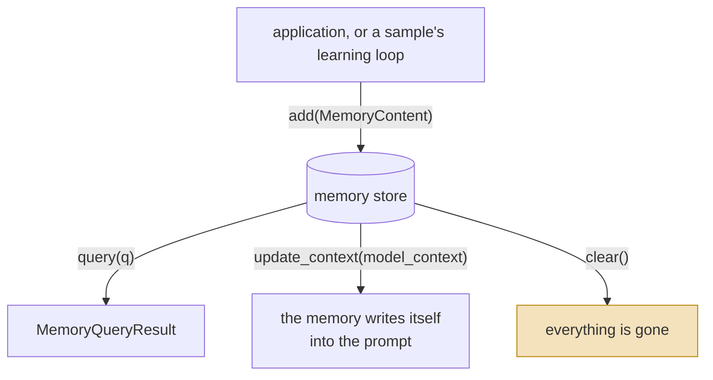
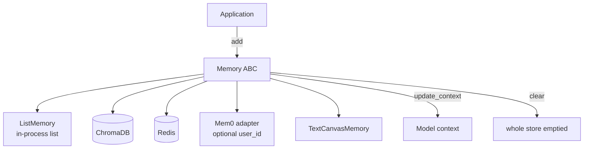

## 1. Executive Summary

AutoGen is Microsoft's multi-agent framework, and like [Google ADK](../adk-python/)
its memory is a **protocol** rather than a store: a five-method `Memory` ABC in
`autogen-core`, with a list, ChromaDB, Redis, Mem0 and text-canvas
implementations in `autogen-ext`. It belongs in this atlas for the same reason
ADK does — what the interface omits is what an ecosystem of agents cannot do.

The interesting design choice is `update_context`. Rather than being a store the
agent queries through a tool, an AutoGen memory is handed the model context and
edits it: memory pulls itself into the prompt. That is a cleaner injection point
than most frameworks offer and it makes memory composable with the rest of the
component system.

The finding is one field. `MemoryContent` carries `content`, `mime_type` and
`metadata` — **and no identifier**. A memory in this framework has no name, no
key, no id. The consequence follows immediately and is visible in the protocol:
the only removal operation is `clear()`, which empties the whole store, and no
shipped adapter adds a targeted delete because there is nothing to address one
by. This is a step below ADK, which at least gives `MemoryEntry` an optional
`id` and then declines to use it.

Scope is the second gap and has the same shape. The protocol has no scope
parameter at all. Exactly one adapter — Mem0 — carries a `user_id`, it is
`Optional`, and when omitted the constructor does
`self._user_id = user_id or str(uuid.uuid4())`. So a caller who forgets the user
does not get an error; they get a fresh random identity, and a memory store that
silently becomes unreachable on the next construction.

Read alongside ADK, the pair makes the atlas's provider-contract finding sharper
than either does alone: ADK requires scope in the signature and cannot delete;
AutoGen cannot delete *because* it cannot address, and treats scope as an
adapter's business.

## 2. Mental Model

A memory is a `MemoryContent`: a payload (`str`, `bytes`, `dict` or `Image`), a
`MemoryMimeType`, and an optional `metadata` dict. That is the whole schema, and
it is deliberately closer to "a piece of content" than to "a belief".

Four verbs, and the fourth is the only removal the protocol has. `MemoryContent`
carries no identifier, so there is nothing for a targeted delete to name — which
is why `clear()` is all-or-nothing rather than a convenience.

There are no states. Nothing is a candidate, verified, superseded, expired or
rejected. There is no supersession because there is no identity to supersede: two
`add` calls with contradicting content produce two entries and `query` may return
both.

Control is **application-controlled**. The core does no extraction and no
consolidation; something outside decides what to `add`. The `samples/
task_centric_memory` tree is where AutoGen's actual memory *research* lives —
teachability, self-teaching, learning from demonstration — and those are samples
with their own loops rather than framework guarantees, which is worth knowing
before reading AutoGen's memory story from its papers.

## 3. Architecture

Python (and a .NET tree not read here), MIT and CC-BY licences. The memory
surface is small and deliberately so:

- `autogen-core/src/autogen_core/memory/_base_memory.py` — `MemoryMimeType`,
  `MemoryContent`, `MemoryQueryResult`, `UpdateContextResult`, and the `Memory`
  ABC with `update_context`, `query`, `add`, `clear`, `close`.
- `autogen-core/.../memory/_list_memory.py` — `ListMemory`, a chronological
  in-process list that appends *all* stored memories into the context.
- `autogen-ext/.../memory/` — `chromadb`, `redis`, `mem0`, `canvas`.

`Memory` extends `ComponentBase`, so a memory is a declaratively configurable
component — it can be serialised into a config and restored, which is a genuine
ergonomic advantage over hand-wiring.

### Deployment and ergonomics

- **What has to run:** nothing for `ListMemory`, which is the default and is a
  Python list. Durable memory means standing up ChromaDB or Redis, or signing up
  for Mem0.
- **Local and offline:** yes with ChromaDB; the framework itself needs no model
  for memory because it performs no extraction.
- **No API key is required to store**, unless the chosen adapter is hosted.
- **Hand-repairable:** as repairable as the backend you picked. AutoGen adds no
  store of its own.

## 4. Essential Implementation Paths

**The contract.** `_base_memory.py` — five methods, all abstract:
`update_context(model_context) -> UpdateContextResult`,
`query(query, cancellation_token) -> MemoryQueryResult`,
`add(content, cancellation_token) -> None`, `clear() -> None`, `close() -> None`.

**The schema.** Same file. `MemoryContent` is `content: ContentType`,
`mime_type: MemoryMimeType | str`, `metadata: Dict[str, Any] | None`. Search the
class for an id field and there is not one.

**Default behaviour.** `_list_memory.py` — `ListMemory` stores a
`List[MemoryContent]` and its `update_context` appends *all* of them to the
context. That is not retrieval; it is context stuffing with extra steps, and the
class docstring says so plainly ("retrieves them in chronological order").

**Durable adapters.** `autogen-ext/.../memory/chromadb/`, `redis/`, `mem0/`.
The Mem0 adapter is where scope appears: `user_id: Optional[str] = None` in the
config and constructor, resolved by
`self._user_id = user_id or str(uuid.uuid4())`.

**Canvas.** `memory/canvas/` — `TextCanvasMemory` plus a writer tool, a
different shape again: a shared editable artifact the agents write into, rather
than a retrieval store.

**Where the research is.** `python/samples/task_centric_memory/` —
`eval_teachability.py`, `eval_self_teaching.py`,
`eval_learning_from_demonstration.py`, `eval_retrieval.py`,
`chat_with_teachable_agent.py`.

**Tests.** 56 memory test functions across the core and ext suites.

## 5. Memory Data Model

Three fields, and the absent fourth is the report.

**No identifier.** Nothing in `MemoryContent` names the memory. A caller who
wants to remove one specific thing cannot express the request in this protocol's
vocabulary — which is why `clear()` is the only removal method and why none of
the four adapters adds a targeted delete even though ChromaDB and Redis both
support one natively. The gap is not that the authors forgot a method; it is
that the schema makes the method unwritable.

**No scope in the contract.** `query` takes a query. `add` takes content. Neither
takes a user, tenant, session or project. The one adapter that has a notion of a
principal is Mem0's, it is optional, and its default is a random UUID — so
misuse is silent, and the failure mode is a store you cannot find again rather
than a leak.

**`metadata` is the escape hatch**, typed `Dict[str, Any]`, with no conventions
declared. Anything an application puts there is by definition not portable across
adapters, which is the same anti-portability property ADK's `custom_metadata`
has.

**No temporal fields, no provenance, no confidence, no state.** A `MemoryContent`
cannot say when it was true, where it came from, or how sure anyone is.

## 6. Retrieval Mechanics

`query(query, cancellation_token) -> MemoryQueryResult`. No `k`, no filter, no
threshold, no scoring contract on the way back — `MemoryQueryResult` carries
results and the ranking semantics are the adapter's.

The default is the notable case: `ListMemory.update_context` appends **every**
stored memory to the model context. For a small session that is fine and honest.
As a default for a framework whose users will accumulate memories over months,
it is an unbounded prompt, and nothing in the protocol offers a budget parameter
in which an adapter could be asked to behave differently.

`update_context` is nonetheless the best idea here. Making memory responsible for
its own injection — rather than making the agent call a tool and paste the result
— means a memory implementation can decide *how* to present itself, and the
`UpdateContextResult` return makes what it did inspectable. Several systems in
this atlas would be improved by having that seam.

## 7. Write Mechanics

`add(content)` and nothing else. No deduplication, no conflict detection, no
consolidation, no extraction — the core framework never decides that something is
worth remembering, and never decides that two things disagree.

That is a defensible position for a protocol, and it means AutoGen's memory
*behaviour* in practice is whichever adapter is mounted: Mem0 brings its
extraction and consolidation, ChromaDB brings none.

Nothing filters input. Content whose text is a prompt injection is stored and
then, via `update_context`, writes itself into the prompt — which is the same
exposure every system here has, with a shorter path than most.

### Operational cost

- **Writes are as cheap as the adapter.** The core adds a method call.
- **Lag before a memory is retrievable** is the adapter's; the protocol says
  nothing.
- **No background pass exists in the core.**
- **On the read path, nothing is bounded.** The default injects the entire store
  into context on every turn, and the protocol has no budget parameter, so a
  well-behaved adapter cannot be *asked* for less — only written to decide for
  itself.

## 8. Agent Integration

Memory is a constructor argument on an agent, and `update_context` runs as part
of building the model context. So integration is close to invisible at the call
site, which is the point.

Because `Memory` is a `ComponentBase`, a memory configuration can be serialised
and shipped with an agent definition. Adapting a third-party memory system means
implementing five methods, two of which (`clear`, `close`) are trivial — the
lowest-friction provider interface in this atlas, and the reason its omissions
travel.

## 9. Reliability, Safety, and Trust

**No trust model, and no room for one.** `MemoryContent` has no field in which an
implementation could return provenance, confidence or state, so an adapter that
tracks them internally must flatten them into untyped `metadata`. As with ADK,
the interface does not merely lack a trust model — it makes a portable one
inexpressible.

**Deletion is all-or-nothing.** `clear()` is in the protocol; targeted removal is
not, in the ABC or in ChromaDB, Redis, Mem0 or canvas. An application asked to
delete one user's one memory has two options: wipe the store, or bypass the
abstraction and talk to the backend directly. This atlas's
[pluggable memory provider](../../patterns/pluggable-memory-provider/) page
records that none of the reviewed provider contracts carries deletion; AutoGen is
the instance where the reason is structural rather than an omission.

**Scope failure is silent.** `user_id or str(uuid.uuid4())` turns a forgotten
argument into a working-but-orphaned store. A required argument, or a raised
error, would cost one line and convert a silent data-partitioning bug into a
stack trace — which is exactly what ADK does and the clearest thing AutoGen could
borrow from it.

**Multi-tenancy** is therefore the application's problem entirely, and the
framework provides no seam at which to solve it uniformly.

## 10. Tests, Evals, and Benchmarks

**56 memory test functions** across `autogen-core` and the ext adapter suites,
covering the protocol's behaviour, `ListMemory` semantics, and each adapter's
round-tripping. Proportionate for an interface package.

The evaluation story lives in `samples/task_centric_memory/`, and it is more
substantial than most frameworks ship: separate harnesses for teachability,
self-teaching, learning from demonstration, and retrieval. These are **samples,
not tests** — they are not run by CI and they measure a memory *design* built on
top of the protocol rather than the protocol itself. Worth reading; not evidence
about the interface.

No test asserts that particular material must *not* be retrieved, so
`negative_eval` is withheld. Given that scope is optional and defaults to a
random UUID, a test that two Mem0-backed memories with different `user_id`s
cannot see each other would be the single most valuable addition.

## 11. For Your Own Build

### Steal

- **`update_context` as a first-class seam.** Letting the memory write itself
  into the prompt — and returning a result describing what it did — is better
  than making the agent call a tool and splice the output. It puts the
  presentation decision with the component that knows the data.
- **Make the memory a configurable component.** Serialising a memory
  configuration alongside an agent definition removes a whole class of wiring
  bugs and makes swapping providers a config change.
- **Keep the protocol small.** Five methods is genuinely easy to implement, and
  low friction is why adapters exist at all. The critique below is about *which*
  five.

### Avoid

- **A memory schema with no identifier.** Everything downstream follows from it:
  no targeted delete, no update, no supersession, no correction chain, no way for
  an adapter to expose one portably. If you ship a memory type, give it an id in
  v1 even if your first backend ignores it.
- **`clear()` as your only removal verb.** "Delete everything" is not a deletion
  story; it is the absence of one, and the first compliance request will route
  around your abstraction.
- **Defaulting an identity to a random UUID.** `user_id or str(uuid.uuid4())`
  converts a caller's mistake into silently partitioned data. Require it, or
  raise.
- **A default implementation that injects the entire store.** It teaches every
  new user that memory is free, and the protocol offers no parameter with which a
  more careful adapter could be asked for less.

### Fit

If you are building on AutoGen, the memory protocol is fine for what it is —
mount Mem0 or ChromaDB, pass `user_id` explicitly every time, and treat deletion
as something you will implement against the backend directly. The
`update_context` seam is genuinely good and worth designing around.

Do not adopt this as your provider interface if you are designing one. It is the
clearest demonstration in the atlas that an interface's omissions are permanent
in a way an implementation's are not: a better ChromaDB adapter cannot add an id
to `MemoryContent`, and every agent written against the protocol inherits the
ceiling.

And if you came to AutoGen for the task-centric memory research, read the samples
rather than the protocol. They are the interesting part and they are not what the
framework guarantees.

## 12. Open Questions

- **Is the missing identifier deliberate?** A content-addressed design would be a
  coherent answer — hash the content, address by hash — but nothing in the
  protocol hints at one, and the adapters do not behave that way.
- **Do the ChromaDB and Redis adapters expose their native delete anywhere?**
  Both backends support targeted removal; nothing in the AutoGen wrapper surfaces
  it, and whether that is policy or backlog is not stated.
- **What does the .NET implementation's memory look like?** Only the Python tree
  was read; whether the two protocols agree matters for anyone using both.
- **Are the task-centric memory samples run anywhere in CI?** They are the
  strongest evaluation material in the repository and appear to be examples.
- **Is `update_context` expected to be idempotent** across repeated turns? The
  default appends everything each time, and the contract does not say.

## Appendix: File Index

**Contract and schema**

- `python/packages/autogen-core/src/autogen_core/memory/_base_memory.py`
- `python/packages/autogen-core/src/autogen_core/memory/__init__.py`

**Default implementation**

- `python/packages/autogen-core/src/autogen_core/memory/_list_memory.py`

**Adapters**

- `python/packages/autogen-ext/src/autogen_ext/memory/chromadb/`
- `python/packages/autogen-ext/src/autogen_ext/memory/redis/`
- `python/packages/autogen-ext/src/autogen_ext/memory/mem0/_mem0.py`
- `python/packages/autogen-ext/src/autogen_ext/memory/canvas/`

**Evaluation samples**

- `python/samples/task_centric_memory/eval_teachability.py`
- `python/samples/task_centric_memory/eval_self_teaching.py`
- `python/samples/task_centric_memory/eval_learning_from_demonstration.py`
- `python/samples/task_centric_memory/eval_retrieval.py`

**Tests**

- `python/packages/autogen-core/tests/test_memory.py`
- `python/packages/autogen-ext/tests/memory/`

## History

**2026-07-29** — [`027ecf0a379bcc1d09956d46d12d44a3ad9cee14`](https://github.com/microsoft/autogen/commit/027ecf0a379bcc1d09956d46d12d44a3ad9cee14) — first reading.
