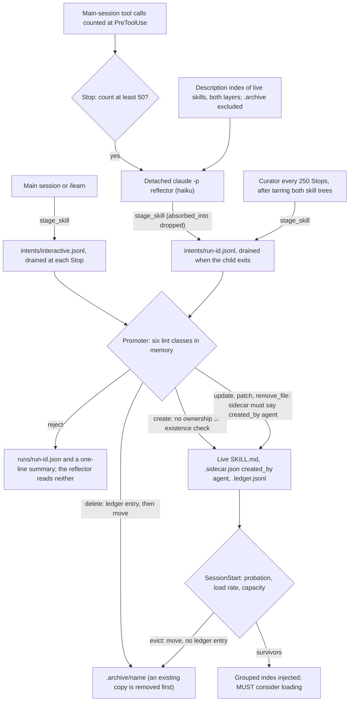

## 1. Executive Summary

autoharness is a Claude Code plugin whose memory is a library of `SKILL.md`
folders it writes into `.claude/skills/` and `~/.claude/skills/`. What is
notable is the split between proposing and landing. Every model — a background
reflector, a periodic curator, the working session itself — can only stage an
intent through one MCP tool, and a deterministic promoter lints the final text
in memory before an atomic write. Survival is measured by loads per request
since landing, not by age. What is weak is the boundary the README leads with.
Ownership is checked only on modifying actions, so a `create` overwrites a
hand-written skill of the same name and marks it as its own. The MCP tool drops
the field that marks a fold, and no person approves anything.

The memory is procedural. A reflector reads a redacted slice of the host
transcript and decides whether to create, patch, update, drop a subfile or
delete. The lesson it keeps is a rule of at most 25 non-blank lines, with a
description short enough to survive a 60-character index line, and that index
opens every session, grouped by category. A lifecycle pass at session start
archives a skill that was neither loaded nor viewed through a whole probation,
and the lowest-rate graduates once a layer's mature pool exceeds its cap.

The design is careful about the failures it names. Rejected intents write
nothing to the library and are reported in a one-line summary at the next
session start.
Evidence is redacted a second time and written by the promoter under a content
hash, so the model never picks a provenance filename. A delete is a folder
move, and a curator run tars both skill trees before it starts.

Four gaps sit between that design and the code at this pin, each on a reachable
path. The ownership test skips `create`; the `stage_skill` handler rebuilds the
intent without `absorbed_into`; lifecycle archival appends nothing to the
ledger; and archiving a name already in `.archive/` deletes the earlier folder
with its ledger.

One mark, `negative_eval`: a committed test asserts an archived skill is absent
from the reflector's index while two live skills are present. Section 9 names
the six withheld.

## 2. Mental Model

A memory is a skill folder, and a skill is an instruction the next session is
told to consider. The unit is deliberately a rule, not a fact. The promoter
rejects a body over `SKILL_BODY_MAX_LINES` (25) as a transcript, and a
description with neither a `when` clause nor a quoted phrase as a label that
never fires (`src/autoharness/lib/validate.py:40-41`, `:68-82`, `:180-188`).

**A lesson becomes a skill in two steps, and only the second is trusted.** A
model calls `stage_skill`, which checks the schema and structure and appends a
JSON line to a per-run queue (`src/autoharness/stage_skill/server.py:157-168`).
The promoter reads the queue, shapes the final text, runs six lint classes and
only then writes (`src/autoharness/hook/promoter.py:142-187`). There is no
candidate state after landing: a landed skill is in the next session's index.

**Probation protects without withholding.** For its first 100 project-layer
requests (300 global) a skill is exempt from eviction and from the capacity
count, and it is injected like any other (`src/autoharness/lib/lifecycle.py:21-41`).
Probation is computed from a creation anchor on each pass, not stored as a
status.

**A skill stops being live in two ways, and they leave different records.** A
`delete` intent appends a ledger entry and moves the folder to `.archive/`
(`promoter.py:118-123`). The lifecycle pass moves the folder and writes no
ledger entry (`src/autoharness/hook/on_session_start.py:115-130`). Revival is a
manual folder move; `skill_store.restore` has no caller outside the tests. The
pipeline never deletes a skill, except that archiving a name already in
`.archive/` removes the older copy first (`src/autoharness/lib/skill_store.py:58-67`).

**Who may move it.** Models propose; the promoter lands; the lifecycle
archives; a person edits files. Memory is treated as instruction, not evidence:
the injected header reads *"you MUST consider loading that skill before
proceeding"* (`on_session_start.py:22-25`).

## 3. Architecture

A Claude Code plugin with no daemon and no third-party dependency. Four hook
events — `SessionStart`, `Stop`, `PreToolUse`, `SessionEnd` — all run
`python3 -m autoharness.hook.dispatch`, which routes on `hook_event_name` and
swallows any handler exception so the host never sees a crash (`hooks/hooks.json`,
`src/autoharness/hook/dispatch.py:94-141`). `.mcp.json` registers one stdio
server, `stage_skill`, whose JSON-RPC loop is written by hand because the
project forbids an MCP SDK dependency (`src/autoharness/stage_skill/server.py:179-216`).

Reflection and curation run as child Claude Code sessions. The dispatcher
launches `python -m autoharness.hook.spawn` detached with `start_new_session=True`.
That process pipes a bundle into `claude -p --agent autoharness:reflector
--dangerously-skip-permissions`, waits for it, and drains the run's queue
(`dispatch.py:64-91`, `src/autoharness/hook/spawn.py:90-129`). An opt-in fork
carrier, `AUTOHARNESS_CARRIER=fork`, resumes the parent session with
`--fork-session` instead (`spawn.py:79-81`, `src/autoharness/config.py:76`).

All state is files. Skills live under `.claude/skills/` at a layer root; the
project root is the session's cwd, remapped to the main worktree root only
inside a linked git worktree (`src/autoharness/lib/layer.py:36-58`). Counters,
offsets, queues, run accounts and curator snapshots live under
`.claude/autoharness/`. Writes go through one temp-file, `fsync`, `os.replace`
primitive (`src/autoharness/lib/atomic.py:13-28`).

### Deployment and ergonomics

- Running: nothing. Each hook is a short-lived Python process; Python 3.11 or
  later is needed for `tomllib`.
- No API key beyond Claude Code's own. Reflection and curation spend model
  tokens through a child `claude` on `PATH`, on haiku per the agent frontmatter
  (`agents/reflector.md:5`).
- Install is two plugin commands and a reload.
- Fully local and readable by hand: every skill, counter, ledger line and run
  account is a text file. Revival and snapshot restore are manual.

## 4. Essential Implementation Paths

**Trigger.** Every main-session `PreToolUse` bumps a `session-` counter file
(`dispatch.py:125-131`). At `Stop` the dispatcher bumps both layers' request
counters, drains the interactive queue, and asks `on_stop` whether the count
reached `REFLECT_EVERY_N` (50); if so it resets and launches reflection
(`dispatch.py:103-114`, `src/autoharness/hook/on_stop.py:17-31`). `SessionEnd`
flushes any remainder (`src/autoharness/hook/on_session_end.py:16-29`).

**Capture.** `capture.window` reads the host transcript from the session's byte
watermark to EOF, clips each record at 4,000 bytes and the window at 200,000
from the tail, and redacts with ten regex rules (`src/autoharness/hook/capture.py:30-50`,
`src/autoharness/lib/redaction_rules.toml`). A digest of up to 20 earlier
exchanges rides beside it (`capture.py:77-105`). The watermark advances only
after the run returns (`spawn.py:167-179`).

**Reflect.** `spawn.run` builds the bundle — window, digest, a description index
of every live skill in both layers including hand-written ones, and the format
spec — and runs the child (`spawn.py:24-53`, `:111-129`). The reflector's tools
are `Read`, `Grep`, `Glob` and `stage_skill` (`agents/reflector.md:4`).

**Stage.** `server.stage` enforces the action enum, per-action required and
exclusive fields, required `reason` and `evidence`, a 100,000-byte body cap,
structure and the description gate. It then appends the intent that `_intent`
builds (`server.py:68-168`).

**Land.** `promoter.drain` sweeps orphan temp files, promotes each intent in
order, writes a run account and clears the queue (`src/autoharness/hook/promoter.py:234-243`).
`promote` resolves the layer — the intent's `level` for a create, a two-layer
`find` otherwise — then checks the fold umbrella and validates. It lands
subfiles, the evidence slice, the body, the sidecar and the ledger in that order
(`promoter.py:51-54`, `:118-187`).

**Inject and evict.** `on_session_start` evaluates each layer's members, moves
the losers to `.archive/`, and builds the index afterwards
(`on_session_start.py:42-65`, `:115-130`).

**Count use.** `PreToolUse(Skill)` bumps `use`; a main-session `Read` into a
live skill folder bumps `view`; only self-authored skills are counted
(`src/autoharness/hook/on_skill_call.py:47-74`).

**Curate.** When the project request count is a multiple of 250 the dispatcher
launches `spawn --curate`. That tars both skill trees, shows the curator an index
of self-authored skills only, and drains its intents (`dispatch.py:112-113`,
`spawn.py:132-164`).

## 5. Memory Data Model

| File | Holds | Writer |
| --- | --- | --- |
| `SKILL.md` | `name`, `description`, optional `category`; the body | promoter, atomically |
| `.sidecar.json` | `created_by`, `use`, `view`, `patch`, `reused_gen`, `anchor`, `verification` | promoter at create; hooks bump counters |
| `.ledger.jsonl` | one line per landed intent: `action`, `reason`, `evidence`, and `path` or `absorbed_into` when present | promoter only |
| `references/evidence-` files | the redacted evidence slice, named by the first eight hex digits of its SHA-256 | promoter only |

**Ownership is one field in one file.** `created_by: "agent"` in
`.sidecar.json` is the membership key for the lifecycle, the index, the use
counters and the promoter's modify check (`src/autoharness/lib/sidecar.py:47-51`,
`:75-76`). The README calls it a ledger marker; the code reads the sidecar. A
skill folder that arrives with such a sidecar is treated as the plugin's own,
whether it was copied in or committed by a teammate's plugin.

**The ledger records what landed and why, not when or by whom.** Entries carry
no timestamp, run id or proposing agent (`promoter.py:74-82`). Line order
within one file is the only sequence. The `verification` field is
written as `None` at creation and read by nothing.

**Scope is two directories.** The global layer is `~/.claude`; the project layer
is the cwd's `.claude`, or the main worktree's. A skill carries no layer or
project key; the layer is where the folder sits. The same name in both layers
makes `skill_store.find` raise. That rejects every later update, patch or delete
of the name and stops its use counter (`src/autoharness/lib/skill_store.py:35-40`,
`on_skill_call.py:50-53`).

## 6. Retrieval Mechanics

There is no search. Two listings are the read paths, and the host's own
description-based skill recall runs underneath both, unmodified.

**The session-start index** is every live self-authored skill in both layers,
grouped by `category`, missing ones under `general`. Each line is `- name
[layer]: description`, with the description flattened and cut to 60 characters
with an ellipsis (`on_session_start.py:28-65`). Newlines are collapsed so a
description cannot forge an index line. The index is injected once as
`additionalContext`, after the lifecycle pass, so an evicted skill is not listed
in the session that evicted it. `AUTOHARNESS_INDEX_SUSPENDED=1` turns it off and
leaves the counters running, which is the switch for measuring what the index
buys.

**The README's bound on the index does not hold during probation.** It says the
index cannot exceed the two capacity caps combined. Probationary skills are
outside the capacity count (`lifecycle.py:26-27`) and inside the index, which
lists every self-authored live skill. A reflector told to *"capture liberally"*
can therefore grow the index without limit while its skills are young
(`agents/reflector.md:8`).

**The reflector's index** lists every live skill in both layers, hand-written
ones included, with full descriptions. It skips `.archive/` because the glob is
one level deep (`spawn.py:24-40`). The curator's version is filtered to
self-authored skills (`spawn.py:34-35`). No listing carries use counts, so the
reflector's compare-first choice rests on descriptions alone.

Failure modes follow from the shape. Recall depends on the model matching a
60-character line and choosing to `Read` or invoke the skill; nothing checks
that a loaded skill applies. An archived skill is invisible to the component
that would otherwise re-create it.

## 7. Write Mechanics

**What the promoter checks.** Six classes run over the shaped text before any
write (`validate.py:163-214`). A regex scan across six families — exfiltration,
injection, destructive, persistence, network, obfuscation — covers the body and
every subfile (`src/autoharness/lib/skills_guard.py:15-70`). Then come
frontmatter, referenced-path and Python-syntax structure; no `TODO` or
placeholder; for a global skill, no absolute home path; `reason` and `evidence`
present; and `created_by: "agent"` on the target of an update, patch,
remove_file or delete. A create or update must also fit the 25-line body cap and
carry a trigger cue inside the 60-character budget. A patch is exempt from both,
so an over-long legacy skill stays fixable.

**The global check is half-wired.** `validate` also rejects a global skill that
names the current repository, when it is given `repo_name`. No reachable caller
passes one: the Stop drain, `spawn.main` and the curator all leave it `None`
(`dispatch.py:108`, `spawn.py:167-177`). Only the absolute-path test runs.

**Landing order is the commit protocol.** Subfiles land first, after every
parent is resolved and a symlink escaping the folder is refused. Then the
evidence slice, then `SKILL.md`, which is what recall reads, then the sidecar
and the ledger (`promoter.py:94-139`). A crash between landing and clearing the
queue replays the run; the sidecar is not recreated, and the ledger may gain a
duplicate line, as the module docstring states (`promoter.py:27`).

**Folds.** A fold is a `patch` to an umbrella and a `delete` of the sibling with
`absorbed_into`. The promoter refuses a fold whose umbrella is missing, is the
target itself, or is not self-authored (`promoter.py:161-174`). Section 9 shows
the field never reaches it.

**Conflict handling** is delegated to the reflector's prompt: a new rule that
contradicts an old skill must be staged as a patch to the old one in the same
run (`agents/reflector.md:40`). Nothing in code detects a contradiction.

### Operational cost

- **Blocking:** no. Reflection and curation are detached. The Stop hook bumps
  counters and drains the interactive queue, a few file operations when the
  queue is empty.
- **Lag:** a reflected skill is live once the child exits and the drain runs,
  and reaches the model at the next session start. Reflection fires on the Stop
  after the 50th tool call, so the lag is that threshold plus one child session.
  A `/learn` intent lands at the end of the same turn.
- **Whole-store passes:** the curator reads the whole self-authored index every
  250 Stops and tars both skill directories, hand-written skills and the archive
  included, keeping five per layer (`spawn.py:132-146`). The lifecycle pass reads
  every sidecar at each session start and calls no model.
- **Read-side cost:** one index per session in `additionalContext`, stable for
  the session, so it does not invalidate a prompt-prefix cache mid-session. Its
  size is bounded only as section 6 describes.

## 8. Agent Integration

The working model has more agency than the pipeline diagram in the README
suggests. `.mcp.json` registers `stage_skill` for every session with the plugin
loaded, and a server started without a child's run id writes to the
`interactive` queue (`server.py:204-208`, `config.py:82-86`). The Stop hook
drains that queue on every turn (`dispatch.py:108`). So the working model can
create, rewrite or archive any self-authored skill by calling the tool, and the
change lands when the turn ends. `/learn` is a skill telling it to do exactly
that (`skills/learn/SKILL.md`).

Child sessions are fenced by an agent tool allowlist and one hook backstop. A
`PreToolUse` for `Write`, `Edit`, `MultiEdit` or `NotebookEdit` from a child or a
reflector is denied (`dispatch.py:36`, `:120-124`). The fence is narrower on the
fork carrier, as section 9 says.

Adapting it to another agent means replacing three host contracts: the hook
payloads (`session_id`, `transcript_path`, `tool_name`, `agent_type`), the
Claude Code transcript format the digest parses, and `claude -p --agent` as the
child launcher. The promoter, validator, lifecycle and ledger are host-neutral.

## 9. Reliability, Safety, and Trust

**"Only its own skills" holds for four actions and not the fifth.** `validate`
applies the ownership test to `update`, `patch`, `remove_file` and `delete`;
`create` is exempt (`validate.py:33`, `:211-212`). `_resolve_level` takes the
intent's layer without looking for an existing skill (`promoter.py:51-54`). So
a create naming a hand-written skill in the same layer overwrites its
`SKILL.md`. The folder has no sidecar, so `_land` stamps one with
`created_by: "agent"` (`promoter.py:129-139`), and the skill enters the index,
the lifecycle pool and the curator's reach. The reflector sees hand-written
names in its index (`spawn.py:24-40`), so a collision needs only a shared class
name. The tests cover the four guarded actions and no create over an existing
skill.

**The fold marker is dropped at the only door a model has.** The tool schema
accepts `absorbed_into` on a delete (`server.py:53-57`, `:83-84`). `_intent`
builds the queued intent from `action`, `name`, `reason`, `evidence` and
per-action fields, and never copies it (`server.py:139-154`). Every fold staged
through MCP reaches the promoter as a plain retirement. The umbrella check does
not run, the ledger entry has no `absorbed_into`, and `metrics._deaths` counts
it as pruned (`src/autoharness/lib/metrics.py:39-50`). The promoter tests pass
the field by calling `promote` directly. The one cross-process fold test goes
through `server.stage` and does not send it (`tests/test_spawn.py:231-269`).

**The ledger is append-only per file and not per name.** Its only writer opens
it in append mode (`src/autoharness/lib/ledger.py:28-32`). Lifecycle eviction,
the commonest death, writes no line, although the module docstring says the
lifecycle records retirements (`ledger.py:4`). And `archive` removes an existing
`.archive/` copy of the name before the move (`skill_store.py:62-66`). A name
evicted once, re-created by a reflector that cannot see the archive, and
evicted again loses the first folder with its ledger and evidence.

**Fork carrier.** With `AUTOHARNESS_CARRIER=fork` the child resumes the parent
conversation with `--dangerously-skip-permissions` and no `--agent`, so it holds
the parent's tools (`spawn.py:79-81`). The hook backstop denies four
file-writing tools; `Bash` is not among them and appears nowhere under `src/`.
The README says a fork carrier's inherited write tools are denied at the hook.
The default carrier is `bundle`.

**Redaction covers evidence, not the skill.** `redact.redact` runs on the
captured window, the digest and the evidence slice (`capture.py:50`, `:105`,
`promoter.py:86`). The `SKILL.md` body and subfiles are not redacted. On the
bundle carrier the reflector saw only redacted text; on the fork carrier and in
the main session it saw the raw conversation.

**Prompt injection.** The transcript window includes tool output, so a web page
the session fetched reaches the reflector. The six regex families catch explicit
strings, as the module states (`skills_guard.py:10-11`). A skill that passes
them is injected as an instruction the model must consider.

**Concurrency.** Sidecar bumps and request counters are read-modify-write
without a lock, and ledger appends from concurrent drains are unordered. Each
module docstring defers the lock (`sidecar.py:15-17`,
`src/autoharness/lib/counters.py:8-9`). An interactive drain on a Stop and a
child's drain can run at once in one project.

**Uncertainty is not representable.** A skill is live or archived.

Capability marks:

- `negative_eval` — awarded; evidence in section 10.
- `audit_log` — withheld. `.ledger.jsonl` is a named, append-only record of
  landed mutations with reason and redacted evidence, which is most of the mark.
  It misses lifecycle eviction, carries no time, loses the fold marker on the
  MCP path, and a reachable re-archive deletes an earlier ledger whole. A record
  that one path erases and another never writes is not the mutation log.
- `tombstone` — withheld. A rejected intent leaves its name and finding families
  in a run account, and an archived skill stays on disk by name. The reflector
  reads neither, the promoter's create consults neither, and a test asserts the
  archive is hidden from the reflector.
- `trust_state` — withheld. Probation is computed from counters and does not
  withhold a skill from the index; archival is a folder move; `verification` is
  written `None` and never read.
- `human_review` — withheld. Nothing waits for a person, and the working model
  holds `stage_skill`, whose intents land at the end of its own turn.
- `scope_enforced` — withheld. The layers are directories; no skill carries a
  scope key and no read applies a predicate.
- `bitemporal` — withheld. No time field on a skill, its sidecar or its ledger.

## 10. Tests, Evals, and Benchmarks

I read the suite and ran none of it. CI runs `ruff check` and `pytest -m "not
live"` on Python 3.11 and 3.12 (`.github/workflows/ci.yml`). The one live-host
test is marked `live` and its body is `pytest.skip`, pointing at a runbook under
`experiments/` (`tests/test_e2e_live.py:9-16`). `experiments/` and `docs/plans/`
are in `.gitignore` as dev-branch material. The calibration measurements the
code comments cite, such as `E8_numerator_capture` for the Read path, are
therefore not in this tree.

**What is tested well.** The promoter has zero-write assertions on every
rejection family, symlink-escape refusals that assert nothing landed,
idempotent evidence materialisation, and fold refusals for a hallucinated,
hand-written or traversing umbrella (`tests/test_promoter.py`). The lifecycle is
pinned by probation, graduation, capacity, tie-break and view-pardon cases
(`tests/test_lifecycle.py`). `tests/test_lifecycle_e2e.py` drives birth, use,
eviction and restore through `dispatch.dispatch` with a fake reflector.

**`negative_eval`, and its vacuous twin.** `test_description_index_both_layers_skip_archive`
seeds three skills across two layers and archives one. It asserts the other two
and their descriptions are listed, then asserts the archived one is not
(`tests/test_spawn.py:45-57`). `test_description_index_agent_only_filters_native`
does the same for the curator's view (`:124-131`). The session-start index's own
exclusion test asserts the whole context is `None` after archiving the only
self-authored skill (`tests/test_on_session_start.py:121-129`). An index that
listed nothing would pass it too.

**What the suite misses** is the boundary between the tool and the promoter.
`test_delete_accepts_absorbed_into` asserts `ok` and not the queued intent
(`tests/test_stage_skill.py:353-356`). No test creates over an existing skill,
archives a name twice, or runs `Bash` in a fork child.

**Paper.** The project has none; the search in Recorded searches finds two
README links and one example line in the format spec. The README cites
*Holistic Agent Leaderboard* ([arXiv:2510.11977](https://arxiv.org/abs/2510.11977),
submitted 13 October 2025) for a CORE-Bench jump from 42% to 78% with the same
model and a different harness. The id resolves to that paper; the figure is not
in its abstract and I did not check the body. It motivates the project and is
no claim about this code. *Self-Harness* ([arXiv:2606.09498](https://arxiv.org/abs/2606.09498),
8 June 2026) appears in a comparison table. No benchmark result for autoharness
is committed.

## 11. For Your Own Build

### Steal

- **Give the model a staging verb and nothing else.** One tool that appends a
  proposal, one deterministic writer that shapes, validates in memory and lands
  atomically, and a run account for what was refused. A rejection then leaves
  the library untouched and stays visible.
- **Materialise provenance yourself.** Take the evidence as text, redact it
  again at the write, name it by content hash, and refuse any intent that tries
  to carry or remove such a file.
- **Measure survival against opportunity.** Loads divided by requests since the
  skill landed, with a probation window and a view that pardons but does not
  count, keeps an idle week from ageing anything out.
- **Evict to an archive folder**, so an eviction is a move a person can undo.

### Avoid

- **An ownership check keyed on the action list.** Check the target, not the
  verb: any write that lands on an existing path must prove the path is yours,
  and a create must refuse a name that is already live.
- **Two representations of one intent.** When the tool handler rebuilds the
  payload the writer consumes, every new field has to be added twice. Pass the
  validated parameters through, or test the queued intent rather than the
  handler's `ok`.
- **Hiding the archive from the writer that could re-create it.** If retirement
  is a judgement, the next proposer needs to see it, or the library regenerates
  what it just measured as unused.
- **An archive that overwrites by name.** Key archived copies on name plus
  landing, or append.

### Fit

This suits one developer who wants Claude Code to accumulate its own procedures
and accepts an automatic writer whose output the next session is told it must
consider. It assumes the user reads diffs of `.claude/skills/`, since nothing
else is a review. It fits poorly where hand-written skills share a namespace
with generated ones, where skills are committed and shared across a team, or
where a transcript can carry hostile tool output. Walk away if skills must be
approved before they reach a prompt.

## 12. Open Questions

- Does Claude Code's native skill discovery ever descend into
  `.claude/skills/.archive/`? The design assumes an archived skill leaves host
  recall; that is host behaviour, not in this tree.
- How often does a reflector `create` reuse a live hand-written name in
  practice? A collision needs only a common class name such as a workflow label.
- Is the `absorbed_into` omission known upstream? The prompts, the promoter and
  the metrics all rely on the field.
- What do the excluded `experiments/` results show for the index's effect on
  load rate, the question `AUTOHARNESS_INDEX_SUSPENDED` exists to answer?

## Appendix: File Index

- **Storage and layout:** `src/autoharness/lib/layer.py`,
  `src/autoharness/lib/atomic.py`, `src/autoharness/lib/skill_store.py`,
  `src/autoharness/lib/sidecar.py`, `src/autoharness/lib/ledger.py`,
  `src/autoharness/lib/counters.py`, `src/autoharness/lib/intent_queue.py`.
- **Write path:** `src/autoharness/stage_skill/server.py`,
  `src/autoharness/hook/promoter.py`, `src/autoharness/lib/validate.py`,
  `src/autoharness/lib/skills_guard.py`, `src/autoharness/lib/redact.py`,
  `src/autoharness/lib/redaction_rules.toml`, `src/autoharness/lib/format_spec.md`.
- **Capture and trigger:** `src/autoharness/hook/capture.py`,
  `src/autoharness/hook/on_stop.py`, `src/autoharness/hook/on_session_end.py`,
  `src/autoharness/hook/dispatch.py`, `hooks/hooks.json`.
- **Background:** `src/autoharness/hook/spawn.py`, `agents/reflector.md`,
  `agents/curator.md`, `skills/learn/SKILL.md`.
- **Retrieval and lifecycle:** `src/autoharness/hook/on_session_start.py`,
  `src/autoharness/lib/lifecycle.py`, `src/autoharness/hook/on_skill_call.py`,
  `src/autoharness/lib/metrics.py`.
- **Configuration:** `src/autoharness/config.py`, `.mcp.json`,
  `.claude-plugin/plugin.json`.
- **Tests:** `tests/test_promoter.py`, `tests/test_stage_skill.py`,
  `tests/test_spawn.py`, `tests/test_on_session_start.py`,
  `tests/test_lifecycle.py`, `tests/test_lifecycle_e2e.py`,
  `tests/test_dispatch.py`, `tests/test_ledger.py`, `tests/test_e2e_live.py`.

### Recorded searches

Checked against the checkout at the pinned revision.

- `git grep -n -E 'absorbed_into' -- src/autoharness/stage_skill/server.py` — lines 53, 83 and 84: the schema and the non-delete refusal; nothing in `_intent`.
- `git grep -n -E 'ledger\.append' -- src` — `promoter.py:121`, `:127`, `:139`; no call from the lifecycle path.
- `git grep -n -E 'repo_name' -- src` — declarations and pass-throughs in `promoter.py`, `spawn.py` and `validate.py`; no caller supplies a value.
- `git grep -n -E 'restore\(' -- src` — the definition at `skill_store.py:70` only.
- `git grep -n -E 'metrics' -- src` — `metrics.py` itself and a `sidecar.py` comment; no caller.
- `git grep -n -E 'verification' -- src` — the sidecar's `None` at creation, its docstring, and an unrelated format-spec line.
- `git grep -n -E 'is_agent_created' -- src` — the promoter call guarded by `_MODIFY`, the fold umbrella, the index, the lifecycle members, the use counter, the curator index and metrics; none on the create path.
- `git grep -n -E 'approv|pending|review' -- src agents skills` — graduation review and comments only; no approval state.
- `git grep -n -E 'Bash' -- src` — no match.
- `git grep -n -E 'timestamp|time\.time|datetime|strftime' -- src` — no match.
- `git grep -n -E 'archive_dir|\.archive' -- src` — writers in `skill_store.py`, readers in `ledger.py` and `metrics.py`, and the read-path exclusion in `on_skill_call.py`; nothing in the promoter's create path or the reflector's index.
- `git grep -n -i -E 'renamed|formerly'` — no match.
- `git grep -n -i -E 'arxiv|bibtex|@article|@misc|doi\.org|CITATION'` — `README.md:13`, `README.md:238` and `src/autoharness/lib/format_spec.md:43`.

## History

**2026-09-29** — [`f74a9fb4db512f641bd241e1959fade53044bd7b`](https://github.com/tigerless-labs/autoharness/commit/f74a9fb4db512f641bd241e1959fade53044bd7b) — first reading, at the head of `main`, a merge dated 28 September 2026. One mark, `negative_eval`. Screened before reading: four auto-run surfaces (`.claude-plugin/`, `.mcp.json`, `hooks/` and `hooks/hooks.json`), no build-time execution, no dependency manifest, so nothing inside the cooldown and nothing unpinned; a depth-1 clone dates every file to the tip, which had nothing to inflate here. `AGENTS.md` and `CLAUDE.md` are gitignored and absent; the subagent prompts under `agents/` were read as data. MIT, with no rider. Read with `git grep` and `sed`; nothing installed, built or run.
