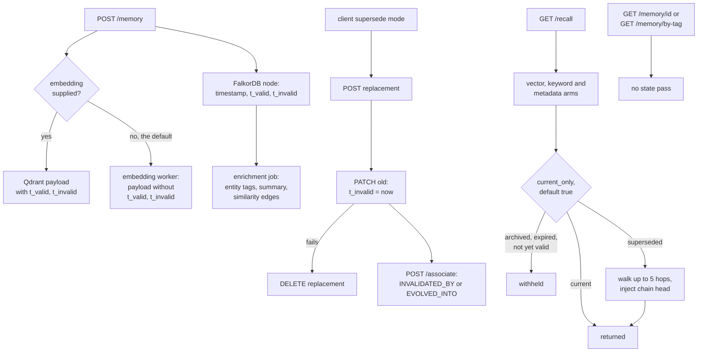

## 1. Executive Summary

AutoMem is a single-tenant memory service: a Flask API over FalkorDB, which
holds memories as nodes with typed edges, and Qdrant, which holds their vectors.
Agents reach it through [mcp-automem](https://github.com/verygoodplugins/mcp-automem),
the author's stdio MCP client and installer, or through an MCP bridge the
service ships. Writes are explicit; the service classifies, summarizes, embeds
and enriches in the background.

What is notable is the default read. Ranked recall runs a current-state pass
that withholds a memory whose validity window has closed or not yet opened, or
that a later memory superseded through an `INVALIDATED_BY` or `EVOLVED_INTO`
edge, and returns the head of the supersession chain in its place. The client's
supersede mode writes exactly the state that pass reads.

What is weak is that the pass depends on a payload two writers build
differently. Four findings, all read rather than run:

- **The vector arm does not see a validity window set at store time.** The
  embedding worker builds the Qdrant payload from the graph node and leaves out
  `t_valid` and `t_invalid`, and a vector hit's memory is that payload.
- **Two read modes skip the pass.** Tag listing and id fetch return superseded
  and expired memories, and the client strips the validity fields before the
  model sees them.
- **Scope is a tag the caller chooses.** Nothing on the row or the request
  enforces one, and one token opens the whole graph.
- **The Qdrant recovery script rebuilds nodes without validity or edges**, so a
  restore through it makes every superseded memory current again.

Two marks: `bitemporal` and `negative_eval`. Section 9 names the five withheld.

## 2. Mental Model

A memory is a node a client wrote. The service extracts nothing from
conversation; the mcp-automem Hermes provider can store raw turns when an
operator turns that on. On write the service classifies the type and
summarizes content over 500 characters, and enrichment later adds entity tags,
a summary and similarity edges.

**A memory stops being current in three ways, none of which deletes it.** Its
`t_invalid` passes; its `t_valid` has not yet arrived; or an `INVALIDATED_BY` or
`EVOLVED_INTO` edge leads from it to a memory that is still current
(`automem/api/recall.py:83`, `:438-449`). A fourth, decay archiving, exists and
is off by default. `DELETE` removes the node and its point outright.

**A correction is a new memory plus a closed window.** The service has no
supersede endpoint. The mcp-automem client composes one: fetch the old memory,
store the replacement, PATCH the old one with `t_invalid` set to the client's
clock, then create the edge; if the PATCH fails, it deletes the replacement
(section 8).

**Recall walks to the head.** The current-state pass batch-loads each result's
supersession edges, follows the chain up to five hops with a per-source visited
set, drops the old result and injects the head with `match_type:
"state_replacement"` and a `state_replaces` pointer (`recall.py:525-594`,
`:597-724`).

## 3. Architecture

`app.py` builds the service state and hands blueprint registration to
`automem/api/runtime_bootstrap.py:110-201`. The live memory routes are
`create_memory_blueprint_full` (`automem/api/memory.py:457`). A second
implementation of the same routes, `automem/api/runtime_memory_routes.py`, 713
lines with its own size constants, has no importer in the tree. Recall is
`handle_recall` (`recall.py:1704`), consolidation is `consolidation.py`, and
worker threads run embeddings, enrichment and the consolidation scheduler.

Auth is one bearer token for every memory route, with `/health` open
(`automem/api/auth_helpers.py:45-61`), and a separate admin token for admin
routes. Every client of one service shares one graph and one collection.

### Deployment and ergonomics

`make dev` or Docker Compose runs the API with FalkorDB and Qdrant; a Railway
template deploys the same stack. An embedding provider is required for vector
search, and OpenAI, when a key is present, is used for classification,
summaries and auto-summarization. Without Qdrant a store answers `qdrant:
unconfigured` and recall falls back to the graph arms. The mcp-automem
installer clones this repository's default branch and starts Compose for its
local path (section 8).

## 4. Essential Implementation Paths

**Store.** `store` (`automem/api/memory.py:486-777`) rejects content over 2,000
characters, replaces content over 500 with a model summary and keeps the
original in `metadata.original_content` (`:498-557`), mints a UUID (`:543`),
and classifies the type when none is given (`:572`). It writes the node with
`MERGE` (`:626-668`), writes the Qdrant point itself only when the caller
supplied an embedding (`:683-718`) and otherwise queues one (`:719-722`), then
queues enrichment (`:776`). Batch store is `POST /memory/batch` (`:1204`), up
to 500 items, without `t_valid`, `t_invalid` or embeddings.

**Recall.** `GET /recall` → `handle_recall` (`recall.py:1704`). `GET
/memory/{id}` returns one node and bumps `last_accessed`; `GET /memory/by-tag`
pages exact tag matches (`memory.py:295-334`).

**Update.** `PATCH /memory/{id}` → `update` (`memory.py:813-993`): read the
node, fall back to current values for every field not sent, `SET` them all,
re-embed when content changed or copy the existing vector otherwise, and upsert
the Qdrant payload with the window (`:954-968`).

**Delete.** `DELETE /memory/{id}` detaches and deletes the node and its point
(`memory.py:996-1023`); `DELETE /memory/by-tag` loops pages of 200 until none
match (`:1026-1077`).

## 5. Memory Data Model

| Field | Where | Notes |
| --- | --- | --- |
| `id` | node, point id | server-minted UUID; a client id is ignored |
| `content`, `summary` | node, payload | summary written by enrichment |
| `tags`, `tag_prefixes` | node, payload | enrichment appends `entity:category:slug` tags |
| `importance` | node, payload | 0 to 1, caller-set, ranks |
| `type`, `confidence` | node, payload | seven types; confidence is the classifier's |
| `timestamp` | node, payload | creation time; a caller may supply it and a PATCH may overwrite it |
| `t_valid`, `t_invalid` | node; payload only on some writers | the validity window |
| `updated_at`, `last_accessed` | node, payload | `last_accessed` bumped on read |
| `archived`, `archived_at`, `relevance_score` | node, some payloads | written by consolidation |
| `metadata` | node as JSON, payload as object | free-form |

Relationships are typed edges. Eleven types are authorable through
`/associate`, three more are system-only, and the recall pass reads two.

**The validity window has two writers that disagree.** The store handler puts
`t_valid` and `t_invalid` in the Qdrant payload when it writes the point itself
(`memory.py:691-707`). The embedding worker, which writes the point in the
default case, lists eleven payload fields and omits both, along with `archived`
(`automem/embedding/runtime_pipeline.py:161-181`). The update handler writes them
again when it upserts. Which copy a memory has depends on which path last wrote
its point.

**`updated_at` does not move on update.** The PATCH handler takes
`payload.get("updated_at", current.get("updated_at", …))` (`memory.py:859`), so
an edit leaves the previous value in place unless the caller sends one. The
mcp-automem session-start prompt recalls preferences sorted by `updated_desc`.

## 6. Retrieval Mechanics

Ranked recall runs up to three candidate arms per query: Qdrant vector search
with a tag filter and an exclusion of `MetaPattern` types, a graph keyword
search, and a metadata search (`recall.py:1960-2040`). Vector hits come first
and the graph arms skip ids already seen, so a memory found by both carries the
Qdrant payload as its memory. Scores blend vector, keyword, metadata, relation,
tag, importance, confidence, recency and exact-match terms with fixed weights
(`automem/utils/scoring.py:250-262`). Optional relation and entity expansion add
neighbours; `scope_fallback`, off by default, tops up a tag-scoped result from
an unscoped vector search and labels the fills `outside_tag_scope`.

The current-state pass runs last over the combined list, and again over
fallback fills (`recall.py:2300-2313`, `:894-906`). Its payload-level check
reads `archived`, `t_valid` and `t_invalid` off whatever memory dict the result
carries. Its edge-level check queries the graph by id.

**So the vector arm misses a window set at store time.** A memory stored on
1 March with `t_invalid` set to 8 March, and no caller-supplied embedding, gets
a payload without it. On 9 March a vector hit carries no `t_invalid`, the
payload check passes, and no supersession edge exists to catch it. The graph
arms read the node and would withhold it, but they skip ids the vector arm
already returned. A supersession is caught either way, because the edge check
goes to the graph.

**Two modes skip the pass.** `GET /memory/{id}` returns any node, and
`GET /memory/by-tag` filters only on tags (`memory.py:311-318`).
`GET /startup-recall` selects by tag with no state predicate
(`recall.py:2696-2753`); no mcp-automem file calls it.

Decay runs daily and writes `relevance_score`, which the final score weights at
`0.0` by default (`automem/config.py:484`), so decay changes no ranking unless
an operator sets the weight.

## 7. Write Mechanics

Writes are explicit HTTP calls. The service adds no deduplication: every store
mints a new UUID.

**An update does not re-enrich.** The PATCH handler neither enqueues
enrichment nor resets `processed`, and it keeps the current tags when none are
sent (`memory.py:848-849`). Entity tags derived from the replaced text stay on
the memory, and entity expansion selects by those tags (`recall.py:1445`).

**Enrichment writes metadata and tags wholesale.** `enrich_memory` reads the
node, computes entities, links and a summary, then sets `metadata` and `tags`
from its own read (`automem/enrichment/runtime_orchestration.py:191-283`). A
PATCH landing between the read and the write is overwritten. The window is the
enrichment job's duration; this was read, not reproduced.

**Consolidation names its own collection.** Every Qdrant call in
`consolidation.py` passes `collection_name="memories"`, at six sites including
the forget step's delete and archive payload (`:715`, `:779`), while the rest of
the service uses `QDRANT_COLLECTION` (`automem/config.py:14`), and
`docs/QDRANT_SETUP.md:225-227` suggests per-environment names. Under a custom
name, an enabled forget step deletes or archives the node and leaves the vector
point as it was.

**Recovery from Qdrant drops the correction state.**
`scripts/recover_from_qdrant.py` rebuilds each node with `CREATE` from the
payload's content, timestamp, importance, type, confidence and tags, with
metadata keys flattened into node properties (`:85-120`). It writes no
`t_valid`, `t_invalid` or `archived` and no edges, although its docstring says
the API "will rebuild all graph relationships".

### Operational cost

- Write: one graph `MERGE`; a model call for classification, and another for
  summarization over 500 characters, when a key is configured; an embedding and
  an enrichment job queued.
- Background: embedding and enrichment workers; decay daily, creative
  association weekly, clustering monthly; forgetting off.
- Read: one to three arms per query plus batched edge queries per supersession
  hop, up to five.

## 8. Agent Integration

**[mcp-automem](https://github.com/verygoodplugins/mcp-automem)**, read at
[`9a0bbf754dd31db524da25638b0e97907e32ff37`](https://github.com/verygoodplugins/mcp-automem/commit/9a0bbf754dd31db524da25638b0e97907e32ff37)
(25 August 2026, MIT), is the main surface. It is 18,397 lines of TypeScript
outside tests, 12,429 of them an installer that configures Claude Code, Codex,
Cursor, OpenClaw, Hermes and Grok, with Copilot and Claude Desktop set up
separately. Its local install clones this repository's default branch
(`src/cli/install.ts:289`, `:1460`). At the client's pin date that head was
[`969755deb47934125d4face18816f3a1039766a7`](https://github.com/verygoodplugins/automem/commit/969755deb47934125d4face18816f3a1039766a7);
`recall.py`, the embedding pipeline, enrichment and `consolidation.py` are
byte-identical to the revision read here.

The client's six stdio tools map onto the routes. `store_memory` exposes
`t_valid` and `t_invalid` to the agent (`src/mcp-surface.ts:189-198`) and adds
the supersede mode (`src/automem-client.ts:299-366`). `recall_memory` chooses
id fetch, tag listing or ranked recall by argument, rejects ranked-only
parameters in listing mode, and maps results through `mapStoredMemory`, which
keeps none of `t_valid`, `t_invalid` or `archived` (`:75-89`). A superseded
memory listed by tag therefore reads as current.

The client never replays a POST after an unparseable response, because a
committed store with a truncated body *"would mint a second UUID"*
(`src/automem-client.ts:212-227`). Its SessionStart hook prints a recall prompt
with `PROJECT=$(basename "$PWD")` as the tag gate (`src/memory-policy/shared.ts:245-283`);
the model runs it. The OpenClaw plugin recalls automatically before each prompt
(`src/openclaw-plugin.ts:669-789`), merging default tags into every store and
none into recall.

The agent holds every verb, including `delete_memory` by tag, whose description
says *"There is NO dry-run"* (`src/mcp-surface.ts:900`).

This repository also ships `mcp-sse-server/server.js`, an SSE and
streamable-HTTP MCP bridge with the same six tool names and no supersede mode,
and a parity harness that compares it with the published client.

## 9. Reliability, Safety, and Trust

**The read side substitutes rather than merely hides**, so a question whose
best match is a superseded memory still gets the current answer. The edge walk
is bounded at five hops and cycle-safe.

**Scope is advisory.** There is no user, project or agent key on the row and
no scope argument on any route. The client's project tag comes from prompt
text, and any holder of the one token reads and deletes everything.

**Privacy.** Content over 500 characters is sent to the classification model
for summarization, and the original is kept in metadata.

Capability marks:

- `bitemporal` — awarded; the validity window is caller-settable, stored beside
  the record clock, and applied by default. The limits in the evidence record
  are real: validity is compared only with now, and corrections carry no system
  time of their own.
- `negative_eval` — awarded; section 10.
- `tombstone` — supersession is keyed on the record, and delete removes the
  node. Nothing keyed on rejected text stops a client storing it again.
- `trust_state` — no status field. `confidence` is the type classifier's and
  ranks. `archived` is a decay outcome, off by default. The client's supersede
  keys `deprecated` and `superseded_by` are read by nothing in the service.
- `scope_enforced` — tags are a filter the caller may pass, not a scope key;
  `scope_fallback` lifts even that.
- `audit_log` — `emit_event` puts store, update and delete events on in-memory
  SSE queues and drops them when a subscriber is slow
  (`automem/api/stream.py:48-70`). Consolidation persists run summaries, not
  per-memory mutations.
- `human_review` — no queue. The graph viewer displays, and every client holds
  update and both deletes.

## 10. Tests, Evals, and Benchmarks

Nothing was built or run for this report. CI runs `pytest tests/` without the
benchmarks directory (`.github/workflows/ci.yml:85-87`).

**The negative cases.** `test_recall_current_only_filters_temporal_state`
seeds three memories under one tag, the two stale ones at higher importance,
and asserts default recall returns only the active one with reasons `expired`
and `not_yet_valid`, then that `current_only=false` returns all three
(`tests/test_api_endpoints.py:1201-1248`). The replacement case asserts that at
`limit=1` a superseded importance-1.0 memory is absent and its 0.1 replacement
returned, for both relations (`:1397-1426`).

**Why the vector-arm gap passes.** The helper writes memories straight into a
fake graph (`tests/test_api_endpoints.py:1180-1198`), so no case stores through
the handler and lets the embedding worker build the payload. The assertion is on
the filter's output given a memory dict, not on the dict the vector arm
produces.

The mcp-automem client's 986 Vitest cases mock `fetch` and assert request
shapes, including the supersede sequence and both failure paths.

**Benchmarks.** The README reports LoCoMo and LongMemEval on the project's own
harness with a self-hosted judge and states that the judge alone moves scores by
about 12 points, and separately reports runs on a third-party benchmark. None
were run here. `docs/RESEARCH.md` cites HippoRAG 2 and three other papers as
design sources; the tree carries no paper of its own.

## 11. For Your Own Build

### Steal

- **Make "current" the default read, and substitute rather than drop.** Walking
  a supersession chain to its head, bounded and cycle-safe, answers the question
  the caller asked instead of returning nothing.
- **Exclude internal artifacts at one chokepoint.** `_result_passes_filters`
  drops `MetaPattern` rows for every arm and expansion path
  (`automem/search/runtime_recall_helpers.py:398-406`).
- **Ship destructive maintenance disabled.** Forget interval and thresholds
  default to zero (`automem/config.py:40-42`, `:64-65`).
- **Mint ids on the server.** A client-chosen id cannot overwrite another
  memory.

### Avoid

- **Two writers of one payload with different field lists.** Build the vector
  payload in one function and test the filter against a point the default path
  wrote.
- **Read modes that bypass the state predicate.**
- **A recovery path that rebuilds rows from a projection.** The vector payload
  is a partial copy; restoring from it loses whatever it never carried.
- **Literal store names inside a maintenance job** when the rest of the service
  reads them from configuration.

### Fit

This suits one person who wants a shared graph-vector memory across several
agent hosts, runs the service themselves, and values a default recall that
prefers the current version of a fact. It does not suit several people or
projects on one service: there is no scope key, one token opens everything, and
a client can bulk-delete by tag. A reader borrowing the current-state pass
should borrow the edge walk and the default, and put the validity window
wherever every read arm will see it.

## 12. Open Questions

- Which revision does the Railway template deploy, and does its image track
  `main` or a tag?
- How often do clients set `t_invalid` at store time, rather than through
  supersession? That is the case the vector arm misses.
- Is `automem/api/runtime_memory_routes.py` a staged replacement or a leftover?
- Does `scripts/restore_from_backup.py`, which restores from a full export,
  replace `recover_from_qdrant.py` for every documented recovery?

## Appendix: File Index

- **Write:** `automem/api/memory.py`, `automem/embedding/runtime_pipeline.py`,
  `automem/enrichment/runtime_orchestration.py`, `automem/utils/text.py`.
- **Read:** `automem/api/recall.py`, `automem/search/runtime_recall_helpers.py`,
  `automem/utils/scoring.py`.
- **Background:** `consolidation.py`,
  `automem/consolidation/runtime_scheduler.py`, `automem/config.py`.
- **Events, auth, wiring:** `automem/api/stream.py`,
  `automem/api/auth_helpers.py`, `automem/api/runtime_bootstrap.py`, `app.py`.
- **Operator scripts:** `scripts/recover_from_qdrant.py`,
  `scripts/restore_from_backup.py`.
- **MCP bridge:** `mcp-sse-server/server.js`, `mcp-sse-server/parity/`.
- **Tests:** `tests/test_api_endpoints.py`, `tests/support/fake_graph.py`.
- **Client (mcp-automem at its pin):** `src/mcp-surface.ts`,
  `src/automem-client.ts`, `src/memory-policy/shared.ts`,
  `src/openclaw-plugin.ts`, `src/cli/install.ts`.

### Recorded searches

Checked against the checkout at the pinned revision, and mcp-automem at
`9a0bbf754dd31db524da25638b0e97907e32ff37` where marked.

- `grep -rnE 'deprecated|superseded_by|supersede_reason' --include='*.py' .`, excluding `tests/` — no match; the client's supersede keys have no reader.
- `grep -rn 't_invalid' automem/embedding automem/enrichment automem/sync` — no match; the embedding, enrichment and sync writers never set the window.
- `grep -n 't_valid\|t_invalid\|archived' scripts/recover_from_qdrant.py` — no match.
- `grep -n 'processed\|enqueue' automem/api/memory.py` — enrichment enqueued at `:776` and `:1459` only, both store paths; none in `update`.
- `grep -rn 'runtime_memory_routes' --include='*.py' .` — no match; the module has no importer.
- `grep -n 'collection_name="memories"' consolidation.py` — six sites: `:375`, `:715`, `:743`, `:779`, `:801`, `:1104`.
- `grep -rniE 'tenant|user_id|namespace|workspace_id|project_id|isolation' --include='*.py' automem app.py consolidation.py` — one match, a comment about `SimpleNamespace`; no scope key.
- `grep -n 'supersede' mcp-sse-server/server.js` — no match; the bridge has no supersede mode.
- `grep -rn 'startup-recall'` over mcp-automem's `.ts`, `.sh`, `.py`, `.md`, `.mjs` and `.ps1` files — no match.
- `grep -rliE 'arxiv|bibtex|@article|@misc|doi\.org|CITATION' . --exclude-dir=.git` — `README.md`, `docs/RESEARCH.md`, `docs/TESTING.md`, `benchmarks/EXPERIMENT_LOG.md` and one benchmark test, all links to other papers; no `CITATION.cff`.

## History

**2026-09-26** — [`0e8c4174b799abb9eab3370400a80ea9e8ad1f02`](https://github.com/verygoodplugins/automem/commit/0e8c4174b799abb9eab3370400a80ea9e8ad1f02) — first reading, at the head of the default branch `develop`, a commit dated 28 August 2026. Two marks, `bitemporal` and `negative_eval`. The mcp-automem client was read at [`9a0bbf754dd31db524da25638b0e97907e32ff37`](https://github.com/verygoodplugins/mcp-automem/commit/9a0bbf754dd31db524da25638b0e97907e32ff37) for the integration surface. Screened before reading: no auto-run surface, 3 build-time execution points (`Makefile`, two `conftest.py`), 4 unpinned surfaces, nothing inside the cooldown, and `AGENTS.md` and `CLAUDE.md` recorded as data. The client's screen showed 2 auto-run surfaces, 2 build-time points, 1 unpinned manifest and nothing inside the cooldown. Nothing was installed, built or run.
