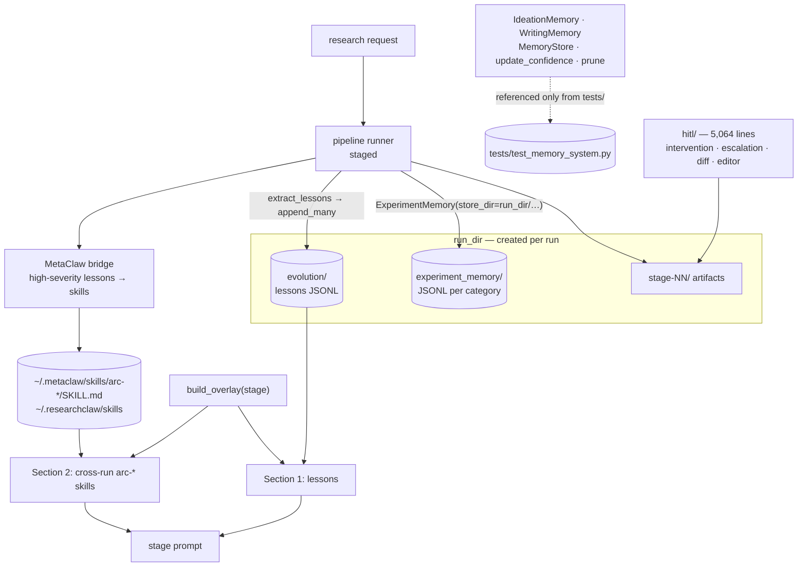

## 1. Executive Summary

AutoResearchClaw is an MIT-licensed autonomous research pipeline — 81,500 lines
of Python across 275 modules, 303 commits since 15 March 2026, with an
[arXiv paper](https://arxiv.org/abs/2605.20025), a benchmark released on Hugging
Face as ARC-Bench, 101 test files, a CLI, an MCP server, an OpenClaw
integration, a dashboard and a 5,000-line human-in-the-loop subsystem. The pitch
is *"Chat an Idea. Get a Paper. Autonomous, Collaborative & Self-Evolving."*

It is in this atlas because something does survive a run, and the useful part of
this report is *which* thing. **The directory named `memory/` is not it.**

**Three memory categories, one production caller, and it writes into the run.**
`researchclaw/memory/` holds a `MemoryStore` with `ideation`, `experiment` and
`writing` categories, embeddings, time decay, confidence and pruning — about 900
lines with a dedicated 500-line test file. `MemoryStore`, `update_confidence`
and `prune` are referenced nowhere outside `tests/`. `IdeationMemory` and
`WritingMemory` have no production caller at all. `ExperimentMemory` has exactly
one, and it reads:

```python
_mem_dir = run_dir / "experiment_memory"
exp_memory = ExperimentMemory(store_dir=str(_mem_dir))
```

So the experiment memory is created inside the directory for the run that is
about to use it, and a later run has a different `run_dir`.

**The self-evolution store makes the same move, against its own docstring.**
`evolution.py` opens by saying it *"records lessons from each pipeline run
(failures, slow stages, quality issues) and injects them into future runs as
prompt overlays"*, and its usage example constructs `EvolutionStore(Path("evolution"))`
— a stable path. Both real callers construct `EvolutionStore(run_dir / "evolution")`.
Nothing scans a sibling run directory. The lessons are appended where the next
run will not look.

**What does survive is a skill, and the code says so.** `build_overlay` assembles
the per-stage prompt in two labelled sections: lessons from the evolution store,
and then `# --- Section 2: cross-run MetaClaw arc-* skills ---`, which scans
`~/.metaclaw/skills` for directories named `arc-*` and reads their `SKILL.md`.
The MetaClaw bridge promotes high-severity lessons into those skills after a run.
Section 1 is intra-run; section 2 crosses. The comment naming section 2
*"cross-run"* is the clearest statement in the repository of where the boundary
actually falls, and it is four words in a source file rather than anything in the
README.

**No capability marks.** Confidence is a float with no discrete state; both
timestamps are record-axis; the categories separate kinds of memory rather than
principals; `save()` rewrites each JSONL whole rather than appending; the
human-in-the-loop subsystem never imports the memory package; and no committed
test asserts that particular material is absent from a result set.

## 2. Mental Model

```text
run N                                            run N+1
  ├── run_dir/experiment_memory/  ──┐              ├── run_dir/experiment_memory/   (new, empty)
  ├── run_dir/evolution/         ──┤ discarded     ├── run_dir/evolution/           (new, empty)
  └── extract_lessons()          ──┘              │
          │                                       │
          └─► MetaClaw bridge                     │
                promotes high-severity            │
                lessons to skills                 │
                      │                           │
                      ▼                           │
            ~/.metaclaw/skills/arc-*/SKILL.md ────┘
                      │
              build_overlay(stage):
                Section 1: lessons  ← from run_dir/evolution  (this run only)
                Section 2: arc-* skills ← "cross-run"          (survives)
```

Read the diagram as the answer to one question: what can run N+1 know that run N
learned? Only what became a skill. Everything the memory package holds, and
everything the evolution store appends, is written under a path that is created
for the current run and never read again.

## 3. Architecture



**Runtime.** A staged pipeline (`pipeline/runner.py`) over agents, a literature
layer, an experiment executor with a sandbox, an assessor, writing and Overleaf
integration, a web dashboard, MCP servers, a voice surface, and domain packs.
Persistence is files: JSONL and YAML under a run directory, plus skills under the
home directory.

**The memory package.** `store.py` (294 lines) defines `MemoryEntry` and
`MemoryStore` with `add`, `get`, `get_all`, `update_confidence`, `mark_accessed`,
`prune`, `save`, `load` and `count`. `retriever.py` scores by cosine with a
time-decay weight; `decay.py` holds `time_decay_weight` and `confidence_update`;
`embeddings.py` wraps the embedder. Three thin category wrappers sit on top. It
is a competent small memory layer, and section 1 is about where it is plugged in.

**The human-in-the-loop subsystem is the largest thing here after the pipeline**
— `intervention.py`, `escalation.py`, `smart_pause.py`, `diff_view.py`,
`editor.py`, `claim_verifier.py`, `branching.py`, `cost_guard.py`, a TUI and a
workshops directory, 5,064 lines. It governs the pipeline: which stage pauses,
what a person edits, what gets approved. **It does not import the memory
package.** So `human_review` is withheld not because the surface is thin but
because it is pointed at the artifacts rather than at what the system remembers —
the mirror image of a system whose review queue holds memories and whose
artifacts nobody sees.

## 4. Essential Implementation Paths

**The one production construction of a memory.** `pipeline/runner.py:472-479`
creates `run_dir / "experiment_memory"`, wraps it in `ExperimentMemory`, and
guards the whole thing in a `try` that logs at debug and continues:
*"Experiment memory initialisation skipped"*. A memory layer that fails to
initialise leaves `exp_memory = None` and the run proceeds without it, silently.

**Lesson extraction.** After the stages complete, `extract_lessons(results,
run_id=run_id, run_dir=run_dir)` classifies failures, slow stages and quality
issues into six `LessonCategory` values with a severity, and
`EvolutionStore(run_dir / "evolution").append_many(lessons)` persists them. The
whole block is wrapped in `except Exception` with
*"Evolution lesson extraction failed (non-blocking)"*.

**The overlay.** `build_overlay(stage_name, max_lessons=5, skills_dir=_METACLAW_SKILLS_DIR)`
returns prompt text in two sections. Section 1 draws time-weighted lessons from
the store — `_time_weight` decays them — and ends with *"Use these lessons to
avoid repeating past mistakes."* Section 2 iterates `~/.metaclaw/skills`, takes
directories whose name starts with `arc-`, and inlines each `SKILL.md`.

**Skill promotion.** `_metaclaw_post_pipeline(config, results, lessons, run_id,
run_dir)` runs after lesson extraction and converts high-severity lessons into
skills. `_helpers.py` resolves two stable directories —
`~/.metaclaw/skills` and a cross-project `~/.researchclaw/skills` — and adds them
to the skill registry when they exist. This is the atlas's
[skills as procedural memory](../../patterns/skills-as-procedural-memory/)
pattern: what the system learned becomes an instruction file that a later run
loads, rather than a row it queries.

## 5. Memory Data Model

`MemoryEntry` carries `id`, `category`, `content`, a free-form `metadata` dict,
an `embedding`, a `confidence` float, `created_at`, `last_accessed` and
`access_count`.

**One clock in two fields.** `created_at` is when the entry was written and
`last_accessed` is when it was last read; neither says when the thing it records
was true. There is no validity axis, so `bitemporal` is absent rather than
partial.

**No status and no supersession.** Confidence moves by a clamped delta and
nothing marks an entry wrong, replaced or withheld. The only removal is `prune`,
which trims a category to `max_entries_per_category` by rank — so a memory leaves
because the store is full, never because it was found to be false. That is why
`trust_state` and `tombstone` are both absent.

**Category is not a scope key.** `ideation`, `experiment` and `writing` separate
kinds of memory, not principals; nothing carries a user, project or agent
identifier. The separation that actually operates is the run directory, which is
isolation by construction and not a predicate.

**`save()` rewrites.** Each category's JSONL is opened `"w"` and written whole,
so the file is a snapshot rather than an append-only record — which is why the
JSONL format does not carry `audit_log`.

## 6. Retrieval Mechanics

`MemoryRetriever` embeds the query, scores cosine similarity across a category,
and weights by time decay and confidence. It is a reasonable small retriever and
its reach is bounded by the store it is handed, which in production is the one
created for the current run.

Retrieval that a later run can benefit from happens elsewhere and is not a query:
`build_overlay` reads whole `SKILL.md` files off disk by directory-name prefix
and inlines them into the stage prompt. There is no ranking, no budget beyond
`max_lessons` on the other section, and no way for a skill to be scored,
demoted, or excluded once it exists.

## 7. Write Mechanics

Within a run: `add` with an embedding and an initial confidence; `mark_accessed`
on read; `update_confidence` with a clamped delta. Across runs: a lesson becomes
a skill file, and a skill file is a document rather than a record — nothing
carries its provenance, its severity, or the run that produced it once it has
been written.

**Every memory path is wrapped in a broad `except`.** Store initialisation,
lesson extraction and the MetaClaw hook each catch `Exception`, log at debug or
warning, and continue. Non-blocking is the right posture for a research pipeline
whose product is a paper. It also means a deployment where none of the three ever
worked looks exactly like one where all three did — the same shape this atlas
recorded for GENOME's automatic fact detector and for llmaker's Redis writes.

## 8. Agent Integration

A CLI, an MCP server under `researchclaw/mcp`, an OpenClaw integration billed as
the headline entry point (*"Just chat with OpenClaw: 'Research X' → done"*), a
web dashboard, a voice surface, and a MetaClaw bridge. The memory layer is not
exposed on any of them: there is no remember tool, no recall tool, and no way for
an operator to inspect or edit what a run remembered.

## 9. Reliability, Safety, and Trust

**No audit of memory mutations**, no provenance beyond a free-form metadata dict,
and no status a person or a later stage could set.

**The human-in-the-loop subsystem is genuinely substantial** and worth reading on
its own terms — `claim_verifier.py` checks claims against evidence, `diff_view.py`
and `editor.py` let a person change an artifact, `escalation.py` and
`smart_pause.py` decide when to stop, and `learning.py` tracks which stages
humans intervene in and *"adjust[s] confidence thresholds based on rejection
rates"*. That last one is itself a durable belief about the system's own
reliability. None of it touches the memory package.

**The tip commit is a good sign about the rest.** *"strip reasoning traces by
default so they stop leaking into artifacts"* is exactly the class of bug that
ships quietly in an LLM pipeline, and fixing it by changing the default rather
than documenting a flag is the right call.

## 10. Tests, Evals, and Benchmarks

101 test files; the README claims 2,699 passing. `tests/test_memory_system.py` is
about 500 lines covering `MemoryStore`, the retriever, decay, and all three
category wrappers — a thorough suite for a subsystem the pipeline constructs one
third of.

**No committed test asserts that particular material is absent from a result
set.** The nearest is `assert not store.update_confidence("nope", 0.1)`, which
checks a false return on a missing id. So `negative_eval` is withheld: the
question the mark asks — does a stored item stay out of a query it should not
match — is not asked anywhere in the suite.

The paper and ARC-Bench are the evaluation story, and they measure the research
pipeline's output rather than the memory layer. That is a reasonable division;
it does mean nothing in this repository measures whether the memory helps.

## 11. For Your Own Build

### Steal

- **Label which section of your prompt is durable.** `# --- Section 2:
  cross-run MetaClaw arc-* skills ---` is four words that tell a maintainer
  exactly which half of the assembled context outlives the run. Most systems
  leave that to be inferred from a path.
- **Promote a repeated failure into an instruction file rather than a row.** A
  lesson that becomes a `SKILL.md` is read by any later run without a query, an
  embedding, or a store — and it is reviewable as text.
- **Decay lessons by time before injecting them.** `_time_weight` keeps an old
  failure from crowding out a recent one in a fixed prompt budget.
- **Change the default rather than documenting the flag.** Reasoning traces
  leaking into artifacts was fixed by stripping them by default.

### Avoid

- **Do not construct a cross-run store inside the run directory.** The evolution
  module's docstring promises lessons *"injected into future runs"* and its own
  usage example uses a stable path; both real callers pass `run_dir / "evolution"`.
  One argument decides whether a subsystem is memory or scratch space, and
  nothing in the type signature or the tests distinguishes them.
- **Do not ship three tiers when one is wired.** `IdeationMemory` and
  `WritingMemory` have full APIs, full tests and no production caller; a reader
  auditing "does this system have memory" will find 900 lines and a green suite
  and conclude yes.
- **Do not let a store's initialisation failure be a debug log.** Three
  memory-related blocks each swallow `Exception` and continue, so a run with no
  memory at all is indistinguishable from a working one.
- **Do not point a large review surface at the artifacts and none of it at the
  memory.** Five thousand lines of human-in-the-loop machinery can inspect a
  draft and cannot see a single thing the system remembered.

### Fit

Take the skill-promotion path: turning a classified, severity-scored failure into
a durable instruction file that later runs load is a clean instance of procedural
memory, and it works without any of the vector machinery beside it. Take the
two-section overlay and its label.

Look elsewhere for a memory layer to run. What is here is well-built and, at this
commit, wired into one run at a time.

## 12. Open Questions

- **Was `run_dir` deliberate?** Both `EvolutionStore` call sites and the one
  `ExperimentMemory` call site pass a per-run path, while the evolution module's
  own example passes a stable one. A single shared root would make the subsystem
  do what its docstring says, and nothing else would have to change.
- **What was going to construct `IdeationMemory` and `WritingMemory`?** Both are
  complete and tested. Either the pipeline stages that would use them are the
  next piece, or the categories are aspirational and `experiment` is the design.
- **Can a promoted skill be wrong?** A high-severity lesson becomes a `SKILL.md`
  that every later run inlines. Nothing scores it, expires it, or removes it
  after the condition that produced it is fixed, so a skill written from a
  transient infrastructure failure is permanent advice.
- **Does the HITL subsystem's `learning.py` state cross runs?** It tracks
  intervention rates and adjusts thresholds, which is durable belief about the
  system itself; where it is persisted decides whether it is a fourth memory or a
  fourth per-run store.
- **Does the memory help?** ARC-Bench measures the pipeline's output. No ablation
  in this repository runs the pipeline with the memory and without it.

## Appendix: File Index

- **Memory package:** `researchclaw/memory/store.py` (`MemoryEntry`,
  `MemoryStore`, `prune`, `save`), `retriever.py`, `decay.py`, `embeddings.py`,
  `ideation_memory.py`, `experiment_memory.py`, `writing_memory.py`
- **Evolution:** `researchclaw/evolution.py` (`LessonCategory`, `LessonEntry`,
  `EvolutionStore`, `extract_lessons`, `_time_weight`, `build_overlay` and its
  two sections), `evolution_aevolve.py`
- **Wiring:** `researchclaw/pipeline/runner.py:472-479` (the one
  `ExperimentMemory`), `:868-877` (lesson extraction and the store path),
  `researchclaw/pipeline/_helpers.py:55-58` (`_METACLAW_SKILLS_DIR`,
  `_USER_SKILLS_DIR`), `:844` (the overlay call)
- **Human in the loop:** `researchclaw/hitl/` — `intervention.py`,
  `escalation.py`, `smart_pause.py`, `diff_view.py`, `editor.py`,
  `claim_verifier.py`, `learning.py`, `branching.py`, `cost_guard.py`
- **Knowledge and skills:** `researchclaw/knowledge/base.py`,
  `researchclaw/knowledge/graph/`, `researchclaw/skills/`,
  `researchclaw/metaclaw_bridge/`
- **Tests:** `tests/test_memory_system.py`, and 100 other files

## History

**2026-08-24** — [`be4ba4755bf1b52220f25e13b2293b5956590070`](https://github.com/aiming-lab/AutoResearchClaw/commit/be4ba4755bf1b52220f25e13b2293b5956590070) — first reading, MIT, 81,500 lines of Python across 275 modules, 303 commits since 15 March 2026, with an arXiv paper and a released benchmark. Screened before anything was read: no auto-run surface, one build-time execution point (`tests/conftest.py` on pytest collection), one unpinned surface; nothing was installed and no test was run. Admitted on the skill-promotion path — high-severity lessons become `arc-*` skill directories under `~/.metaclaw/skills` that later runs inline — and not on the `memory/` package, whose one production construction is `ExperimentMemory(store_dir=run_dir / "experiment_memory")`; `MemoryStore`, `update_confidence` and `prune` appear outside `tests/` nowhere, and `IdeationMemory` and `WritingMemory` have no production caller. `EvolutionStore`, whose module docstring describes injecting lessons into future runs and whose usage example uses a stable path, is constructed at `run_dir / "evolution"` at both call sites, and nothing scans a sibling run directory. No capability marks: confidence is a float with no discrete state, both timestamps are record-axis, category separates kinds rather than principals, `save()` rewrites each JSONL whole, the 5,064-line human-in-the-loop subsystem never imports the memory package, and no committed test asserts that particular material is absent from a result set.
