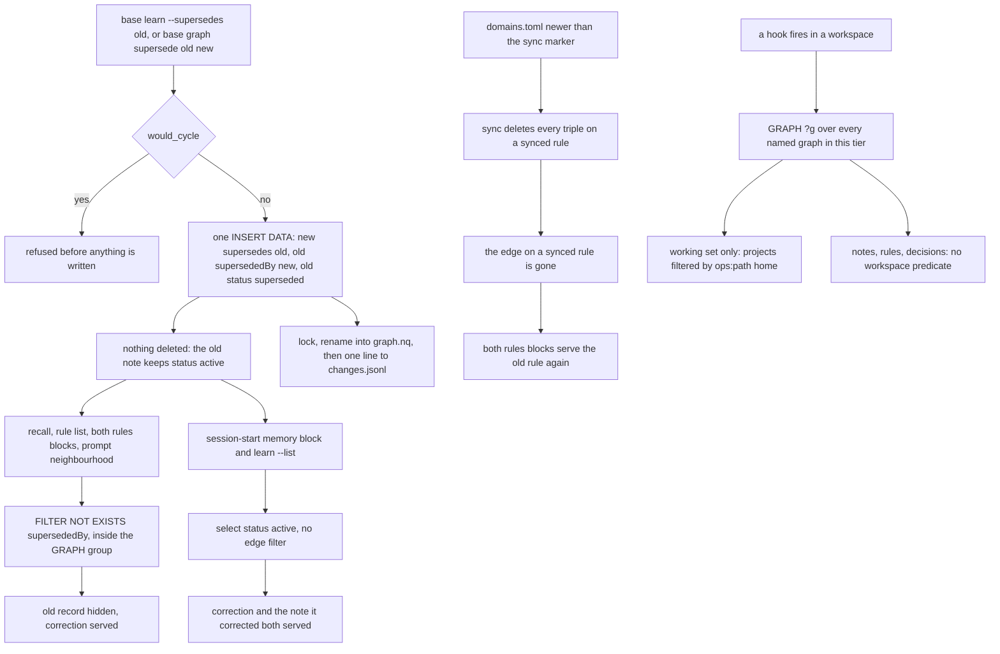

## 1. Executive Summary

basemode is a Rust binary, `base`, that maps a workspace into an RDF graph and pushes slices of it into all four Claude Code hooks, so a briefing lands before the agent starts guessing. What is notable is that its source comments audit its own wiring with dates and counts, and that a correction is a supersession edge the serving queries filter on. What is weak is where that filter does not reach: the session-start memory block serves a superseded note beside its correction, and within a tier nothing scopes notes, rules or decisions to a workspace.

**The licence is a caveat to state before the mechanisms.** `LICENSE.md` is the **Functional Source License 1.1 with an Apache-2.0 future licence** (FSL-1.1-ALv2) — source-available, not open source at this pin, converting to Apache-2.0 on a delay. That is why GitHub reports `NOASSERTION`. A reader deciding what they may *do* with the code needs the licence text.

**The comments audit the code's own wiring, with measurements.** `src/supersede.rs` opens by recording that `ops:supersedes` and `ops:supersededBy` had been declared in the ontology since before 0.13.19 *"and **nothing has ever written either one** — measured on Chris's store, 2026-09-07: 0 quads of each across both tiers."* The only supersession that existed was a JSON field in a sync ledger *"which no graph reader can see"*. That is the declared-and-unwired finding, made by the author about his own code, dated and counted.

**The module that ends it is wired, and its filter reaches six queries.** `base graph supersede <old> <new>` reaches `crud::supersede::supersede` at `cli.rs:4386`, `would_cycle` refuses a loop at write time, and `resolve_head` walks the chain forward. `sparql_exclude_superseded` is spliced into the recall arms, `base rule list`, the prompt hook's decision neighbourhood and the shared rules reader both hooks call. Two test files assert both halves per surface. The second names the pin its two cases were red at: until `f433a9a` on 2026-09-15, both hooks that inject rules served a superseded rule.

**The surface the filter misses is the one that runs on every session boot.** The supersession writer adds `status "superseded"` to the old record in one `INSERT DATA` and deletes nothing, so the old note keeps `status "active"` (`supersede.rs:167-175`). The session-start memory block selects `status "active"` and splices no edge filter (`signal/memory.rs:118-127`). A correction and the note it corrected therefore both land in `<base-memory>`, in every install whose config enables the block, which the installer's config does. That follows from reading both statements; I did not run it.

**Scope is the near-miss.** Writes are routed into a per-workspace named graph, and no hook query filters on it. The one read-path predicate is on the session-start working set, which keeps a project only when its `ops:path` resolves to the current registered workspace or to none (`signal/active_awareness.rs:215-239`). Notes, rules, decisions and handoffs within a tier carry no such predicate. Bug #112 is the named-graph difference biting the removal path: a wildcard guard passed a rule in a foreign named graph, *"460 quads of them on the reporting install"*, and a hardcoded `Ok(1)` reported success.

## 2. Mental Model

A memory is **a typed RDF subject with edges**, and the ontology is the vocabulary: `Decision`, `Task`, `Goal`, `Handoff`, `Person`, `Project`, `Entity`, `Reminder`, plus AST-derived entities for the code itself — functions, callers, imports, dependents — so "where is this used" is a graph question rather than a grep.

**Truth is meant to be an edge, and the status is a lifecycle label.** `supersede.rs` states the rule in a heading: *"The edge is the truth; the status is a label."* Supersession is meant to key on `ops:supersededBy`, and the writer also stamps `ops:status "superseded"` for display, but *"no reader may require both"* — because `ops:status` is unvalidated free text. The author measured his own store: 44 distinct values against the six the ontology declares, including `Pass` 242, `PASS` 43 and `PASS (no change)` 1, and whole sentences. `base doctor` reports status-edge disagreement in both directions rather than reconciling it.

**The label is read, and the reads decide what is served.** The working set drops `complete`, `completed`, `archived`, `blocked` and `deferred` rows (`signal/active_awareness.rs:69`, `:231`). The memory block and `learn --list` select `status "active"` (`signal/memory.rs:124`, `crud/note.rs:625`), and recall requires it beside the edge filter. The six declared values — active, completed, blocked, deferred, superseded, archived (`ops.ttl:117`) — are lifecycle states. None separates a candidate from a verified record, which is why the trust-state mark is withheld.

**The supersession writer adds the label rather than replacing it.** Its `INSERT DATA` writes both edges and `status "superseded"` and deletes nothing, so the old record carries `active` and `superseded` together (`supersede.rs:167-175`). The status updates in `crud/handoff.rs:488`, `crud/reminder.rs:212` and `protocol/reconcile.rs:544` delete the old value first. A reader that keys on the edge hides the old record; a reader that keys on `active` serves it.

**Correction never rewrites.** A → B → C is three records and two edges, nothing is re-pointed, and `resolve_head` walks forward to the live end. A cycle is refused at write time, and a cycle arriving by another route ends the walk on its visited set *"rather than hanging a session-start hook"*. A rule synced from `domains.toml` loses its edge: the sync deletes every triple on a synced rule before re-inserting it (`domain/sync.rs:157-173`).

**Records also leave the briefing by clock.** A handoff, fork, task or milestone past its window becomes `deferred`: counted on its block's notice line and never listed. `base handoff show` and `base fork show` revive those two kinds, and the clock revives a task or milestone it deferred itself (`crud/deferred.rs:1-6`, `:22-25`). The pass is gated on `[defer] enabled`, false by default (`protocol/reconcile.rs:609-613`). A reminder ten days past due archives itself at session start (`crud/reminder.rs:338`).



## 3. Architecture

One binary, installed by `curl | sh` or a PowerShell one-liner, with no Rust toolchain required. Storage is oxigraph over a single N-Quads file per tier: `<ws>/.base/graph.nq` for a workspace and `~/.base-gbl/.base/graph.nq` for global, selected by walking up from the CWD. Beside each graph sits its `changes.jsonl`.

The integration is the product. `base` registers into all four Claude Code hooks, and the README's table is the design. Session start returns everything standing that governs where the agent is about to work, and the prompt hook returns what bears on what was just asked. The pre-tool hook returns the rules and shape of the file about to be touched, and the post-tool hook the call chain for the exact lines just read. Subagents inherit the same hooks and the same graph.

**Hook output is measured before it is printed.** `src/emit/mod.rs` assembles each event's output as ranked blocks and trims them to a budget in bytes. The header records why: Claude Code persists hook output over its limit and hands the model a 2,000-character preview, and a session start measured on 2026-09-14 lost six of nine blocks whole. A probe on 2026-09-20 established that the host counts bytes, not UTF-16 units.

Around that: a Svelte dashboard, a doorbell socket so a running Electron app learns about writes without polling, a plugin and extension surface, a tree-sitter AST pass whose `scripts/ast/requirements.txt` lists 27 grammar packages (the README says 35+ languages), and `base doctor` as the health and audit surface. `build.rs` stamps the build's git sha into `base --version`.

## 4. Essential Implementation Paths

**Write** — `store::write_back_inner` (`src/store.rs:1013`): the three write entry points (`:894`, `:985`, `:1004`) funnel here; serialise, `rename_with_retry`, then `changelog::append` and `doorbell::ring` at `:1122-1137`, both after the rename and both best-effort by contract.

**Supersede** — `cli.rs:4386` → `crud::supersede::supersede` → `link_statement`, which refuses a self-reference and a cycle before building `supersede::link_update` (`supersede.rs:167`). The `--supersedes` flag on the knowledge writers composes the same statement through `crud::supersedes_clause` (`crud/mod.rs:368`).

**Serve** — `sparql_exclude_superseded` is spliced inside the GRAPH group at `crud/note.rs:137` and `:371` (recall and its read-stamp), `crud/rule.rs:158` (`base rule list`), `domain/query.rs:86` (the prompt neighbourhood) and `domain/rules.rs:205` and `:878` (the rules reader both hooks call). `graph_query.rs:127` and `graph_tools.rs:171` resolve an IRI to its head. The session-start memory block, `signal/memory.rs:118-127`, carries no edge filter.

**Session start** — `hook/session_start.rs:31` runs `graph::auto_compact_tiers`; `reconcile_active_state` (`:849`) runs the reminder archive and the deferral pass; `signal::run_signals` renders the memory block, the working set and the handoffs, and `emit` trims the result to budget.

**Audit** — `supersede::audit` (`supersede.rs:218`) runs inside `base doctor` on the store it has already loaded, counting superseded records, status/edge disagreements in both directions, and corrections naming nothing.

## 5. Memory Data Model

`src/ontology/ops.ttl` declares the vocabulary — about twenty classes and their properties, with `ops:createdAt` and `ops:updatedAt` ranged on `xsd:dateTime`. Time is single-axis: `createdAt` is stamped at write and `updatedAt` overwrites, with no separate record of when a fact was true as against when the store learned it, which is why the bi-temporal mark is withheld. `ops:lastActive` drives the deferral clock and `ops:lastRead` drives `graph purge --stale`.

Two things sit outside the graph and matter. `changes.jsonl` is the mutation record described above. The sync ledger (`apply_ops.rs`, `changelog.rs`) carries `supersedes_fact_id` for cross-machine replication — the JSON field `supersede.rs` names as the pre-existing supersession that *"no graph reader can see"*.

A rule has two identities. Its IRI is `rule/{domain}/{i}` for a rule synced from `domains.toml`, positional in the file, and supersession keys on that IRI. `domain::rules::rule_id` hashes the domain and the rule's normalised text, and per-session dedup and matchers key on that (`domain/rules.rs:21-35`). No rejection is keyed on the text, which is why the tombstone mark is withheld.

## 6. Retrieval Mechanics

There is no ranking here and no embedding anywhere. Retrieval is SPARQL composed per hook moment, and the design's claim is that a query bound to the moment beats a scored list: opening an auth file returns the auth rules, the decision that governs them, *"and nothing else. Targeted, never a dump."*

**The supersession filter's correctness is positional.** `sparql_exclude_superseded` produces a `FILTER NOT EXISTS` that must sit **inside** the GRAPH group beside the pattern it constrains. The comment in `crud/rule.rs` names the release that got it wrong: F16 shipped it after the last arm, *"where it constrained nothing and `recall` went on printing what it was meant to hide"*, dated 2026-09-06. A filter in the wrong clause is invisible to every test that only checks the query runs, which is why the tests assert both halves per surface.

**Coverage is per query, and the memory block is outside it.** The rules reader in `domain/rules.rs` gives both rules blocks one SPARQL, one dedup key and one filter. Its header records the drift it replaced: the pre-tool hook hashed the TOML and served the graph, and sorted priority as a string. The memory block pages active notes into `<base-memory>` with corrections ranked first, and a superseded note keeps `status "active"`. The block runs when `[memory] enabled` is true and `mode` is not `claude`: the code default is off, and the config the installer writes sets `enabled = true` and `mode = "base"` (`config.rs:678-685`, `install.rs:578-580`).

**Scope, as section 1 says, is the file plus one predicate.** Within a tier the serving queries range over every named graph, and the working set filters projects by a home derived from `ops:path` against the `[[workspace]]` registry (`scope.rs`). The derivation deliberately ignores the named graph, which the scoping document calls *"the named-graph stamp"*.

## 7. Write Mechanics

Writes are synchronous and locked: `lock_and_load` takes the lock and then loads, because *"a store loaded before the lock was taken is the stale snapshot that silently loses the other writer's change"*. Serialisation goes to a temp file and an atomic rename; only then does anything observable happen — the changes line, the doorbell. A written record is retrievable on the next query, with no lag.

The `O_APPEND` argument in `changelog.rs` is the case where the usual atomic-write advice is wrong. For a whole-file rewrite temp+rename is correct. For an append-only log on Windows the *rename* is the unreliable step: a scanner holding a transient handle makes it throw and the write is lost. An append has no rename to lose, and a single `O_APPEND` write is atomic against concurrent appenders, which matters because hooks fire on every tool call.

Nothing rewrites the store on a timer. Session start runs the compaction, the reminder archive and, when enabled, the deferral pass; each is fail-open and writes only the records it changes. The prompt hook re-syncs `domains.toml` into the graph whenever the file is newer than its marker (`hook/user_prompt_submit.rs:791-826`), and that sync deletes and re-inserts every synced rule.

## 8. Agent Integration

Four hooks, one graph, every agent. basemode does not wait to be asked: there is no `recall` tool the model has to remember to call, because the injection is bound to moments the harness already announces. The cost is the one this design always pays — what lands is whatever the query for that moment returns, and the agent cannot ask for more of it.

**Rules are served once per session per text.** The rules reader dedups on the text-keyed `rule_id`, so a rule already served in a session is replaced by a one-line count and a `base rule list --domain` pointer, and an edited rule is shown again. The memory block has its own budget in whole notes, and it ends with a count of the notes it withheld and the command that lists them.

The CLI is the human surface: `base learn`, `base recall`, `base graph query`, `base graph supersede`, `base doctor`, `base defer`, `base reminder`, and a starter command set. The agent reaches the same CLI through its shell, and neither the edge nor the change-log line records who wrote it; the log's `origin` field says only whether a write was local or arrived by sync (`changelog.rs:181-189`, `:272-301`).

## 9. Reliability, Safety, and Trust

**The comment discipline is the strength, and it has a pattern.** A dated quad count establishing that a declared predicate had never been written. A census of a free-text field's real values. Bug #112, where a wildcard guard and a scoped DELETE asked different questions and a hardcoded `Ok(1)` reported success. A filter-placement note naming the release that shipped it in the wrong clause. A test header that states which serving surfaces were red at `0ace1ba` and why the old test could not see them.

**The write path is defended.** Lock-then-load, temp+rename for the graph, `O_APPEND` for the log with the platform reasoning written out, a doorbell that cannot fail the command, corruption surfaced at boot *"before any other output, so a broken graph announces itself immediately instead of degrading silently"*, and compaction that backs up first and skips an unhealthy graph.

**The gaps are four.** The session-start memory block and `learn --list` show a superseded note, because they read the label the writer adds to rather than the edge. Within a tier, the named graph is written and not served, and only the working set's projects are scoped. Correction is keyed on the record: re-learning a corrected fact creates a new note the chain does not reach, which is why the tombstone mark is withheld. And an edge on a rule synced from `domains.toml` is deleted by the next sync.

The rules test file bounds its own reach. Measured on the operator's store on 2026-09-14, it records *"zero `ops:supersededBy` and zero `ops:supersedes` quads"* in either tier, so the filter it pins *"changes nothing a real user sees"* until a migration writes links.

**One log caveat.** Guarantee two — logging never fails the user's command — means a failed append warns once to stderr and is dropped, so the audit is best-effort by design.

## 10. Tests, Evals, and Benchmarks

**I did not run this suite.** The screen found one build-time execution surface — `build.rs`, which runs `git rev-parse` to stamp the version — no auto-run surface, nothing inside the seven-day cooldown, and two floating surfaces: a dashboard manifest above a present lockfile and 29 unpinned Python requirements. Everything here is read from the committed code.

The suite runs against tempdirs with no service dependency. `tests/supersede_readers_test.rs` covers the recall arms and the prompt neighbourhood with one fixture and both halves asserted. `tests/supersede_rules_serving_test.rs` covers both rules blocks, drives the pre-tool case through `pre_tool_use::handle` rather than a private helper, and keeps a control that must stay green. No supersession case covers the memory block or `learn --list`.

The change log is pinned in `tests/changelog_test.rs`: one line per graph write, a failed mutation appending nothing after a baseline line, and one log per tier. `append_is_best_effort_and_never_panics` (`src/changelog.rs:578`) covers guarantee two. `signal/active_awareness.rs:390` asserts a foreign-homed project hidden beside a home project and an un-homed one shown.

`scope.rs`'s header says it has *"zero non-test callers by design (a dormant primitive)"*; `crud/project.rs`, `extract/paul_toml.rs`, `signal/active_awareness.rs` and `cli.rs` call it.

**No benchmark, no paper, and no claim to either.** The README and `docs/` name no benchmark, arXiv id or citation. The README's argument is a usage one — an un-briefed agent greps, a briefed one was handed the answer.

## 11. For Your Own Build

### Steal

**Write your unwired mechanisms down, with a measurement and a date.** A version, a quad count and *"nothing has ever written either one"* sit in the file a maintainer opens when they go to use the thing.

**Log after the rename, never before.** *"The write has landed. Only now is there something true to log."* One line, and it is the difference between an audit log and a log of intentions.

**Know when temp+rename is the wrong atomicity.** For an append-only log on Windows the rename is the failure point; `O_APPEND` has none.

**Assert both halves of an exclusion, and guard the fixture too.** A case that fails when nothing was served, and a control proving the edge was written, close the two ways a must-not test passes vacuously.

**Serve one kind of record through one reader.** Two hooks with two copies of the rules query drifted in key, sort order and filter; one reader that returns the list both render ended all three.

**Put the periodic warning in the doctor, not in the write path.** A per-write nag *"is ignored within a week, and trains him to ignore the next warning that matters"*.

### Avoid

**Do not add a status beside the old one.** A label written with `INSERT` rather than delete-then-insert leaves the record carrying both, and whichever surface reads the older value serves what was corrected.

**Do not route writes by a key the serving queries do not filter on.** The named graph carries the workspace and the hook queries read `GRAPH ?g`; the difference produced bug #112 on the removal path.

**Do not let a sync delete what it did not write.** A collector that clears every triple on a synced record also clears the correction someone attached to it.

**Do not key a correction on the record when the thing being corrected is text.** Re-learning the same wrong fact produces a fresh live note.

### Fit

Take basemode if you want **a structured workspace graph pushed into an agent's turn without the model having to ask**, and a source-available licence is acceptable. The hook coverage is complete, the code graph makes "where is this used" answerable, and the engineering around the single durable file is careful where a single file needs care.

Walk away if you need **a tenant boundary inside one tier**, a correction that survives the same fact being learned again, or an epistemic status a reader can act on. Before relying on corrections at session start, check that the memory block hides what `recall` hides.

## 12. Open Questions

- Is the named graph meant to become a serving predicate? The write routing, the `workspace_graph_iri` helper and the `reslot` migration all exist; the hook queries read the wildcard, and the working set derives a home from `ops:path` instead.
- Should the supersession writer delete `status "active"`, or should the memory block and `learn --list` splice the edge filter? The module's rule points to the second; the comment on `STATUS_SUPERSEDED` expects the first to have happened.
- The sync ledger's `supersedes_fact_id` and the graph's `ops:supersededBy` both express supersession. Whether the ledger field is being retired, or the two are expected to agree, is not stated.
- Is superseding a rule synced from `domains.toml` a supported operation, given the next sync removes the edge?

## Appendix: File Index

**Memory and correction**
- `src/supersede.rs` — the module docs quoted throughout, `sparql_exclude_superseded` (`:66`), `resolve_head` (`:92`), `would_cycle` (`:126`), `link_update` (`:167`), `audit` (`:218`)
- `src/crud/supersede.rs`, `src/crud/note.rs`, `src/crud/rule.rs`, `src/crud/decision.rs`, `src/crud/handoff.rs`, `src/crud/deferred.rs`, `src/crud/reminder.rs`
- `src/ontology/ops.ttl` — the class and property declarations, including `ops:status` at `:117`

**Store and log**
- `src/store.rs` — `write_back_inner` (`:1013`), the post-rename append (`:1122-1137`)
- `src/changelog.rs` — the three guarantees and the `O_APPEND` argument
- `src/doorbell.rs`, `src/graph.rs`, `src/migrate.rs`, `src/domain/sync.rs`

**Serving**
- `src/hook/session_start.rs`, `user_prompt_submit.rs`, `pre_tool_use.rs`, `post_tool_use.rs`
- `src/signal/memory.rs`, `src/signal/active_awareness.rs`, `src/emit/mod.rs`
- `src/domain/rules.rs`, `src/domain/query.rs`, `src/graph_query.rs`, `src/graph_tools.rs`, `src/scope.rs`, `src/domain/tier.rs`

**Tests cited**
- `tests/supersede_readers_test.rs`, `tests/supersede_rules_serving_test.rs`, `tests/changelog_test.rs`, `tests/rule_index_test.rs`, `tests/ontology_test.rs`, `tests/crud_decision_test.rs`

### Recorded searches

```sh
python3 scripts/screen_repo.py <checkout>
grep -rn 'sparql_exclude_superseded' src | grep -v '^src/supersede.rs'   # six call sites; none in src/signal/
grep -rn 'link_update' src | grep -v '^src/supersede.rs'                 # one caller, crud/supersede.rs:102
grep -n 'INSERT DATA\|DELETE' src/supersede.rs                          # link_update is an INSERT DATA; no DELETE in the module
grep -rn 'DELETE' src --include='*.rs' | grep -i 'status'                # the other status writers delete first
grep -n 'status \\"active\\"' src/signal/memory.rs src/crud/note.rs      # the memory block and learn --list select active
grep -rn 'scope::' src | grep -v '^src/scope.rs'                         # callers of the path-derived scope
grep -rn 'GRAPH ?g' src | wc -l ; grep -rn 'GRAPH <{' src | wc -l        # 253 wildcard reads against 113 bound
grep -rn 'createdAt\|updatedAt' src/ontology/ops.ttl                     # one time axis, updatedAt overwrites
grep -rln -i 'tombstone\|rejected\|dismiss' src                          # nine files: an update-banner snooze, validation errors and prose; no stored rejection
grep -rln 'supersed' tests                                               # six files; none exercises the memory block or learn --list
grep -rln -i 'embedding\|cosine' src                                     # returns nothing
grep -n 'rec.insert' src/changelog.rs                                    # at, ws, origin (local or remote), graph, sparql, kind: no actor
grep -rn -i 'benchmark\|locomo\|longmemeval\|arxiv\|bibtex\|citation\|doi' README.md docs   # no claim
grep -c '^tree-sitter-' scripts/ast/requirements.txt                     # 27 grammar packages
```

## History

**2026-09-26** — [`566c75314f7e0a223791b224d151dbea0c6faab4`](https://github.com/ChristopherKahler/base/commit/566c75314f7e0a223791b224d151dbea0c6faab4) — 67 commits on, unreleased past `v0.15.2`. Marks unchanged. `f433a9a` added the supersession filter to both rules-injecting hooks, with tests red at the previous pin. Five published claims were wrong at that pin. The filter was said to cover "the serving queries": the rules blocks lacked it, and the session-start memory block serves a superseded note at both pins ([section 6](#6-retrieval-mechanics)). "No decision path" was said to read `ops:status`; four do. Scope was called the file alone, missing the working set's path predicate. "No committed case" was said to cover the change log; `changelog_test.rs` does ([section 10](#10-tests-evals-and-benchmarks)). "29 grammars" are 27 packages. Screened: one build-time surface (`build.rs`), nothing in cooldown, two floating. Nothing installed, built or run.

**2026-09-12** — [`0ace1bae246f1ff9ea0b5ea9b8d1801fbc83c627`](https://github.com/ChristopherKahler/base/commit/0ace1bae246f1ff9ea0b5ea9b8d1801fbc83c627) — first reading, at the default branch's head, release 0.15.2 dated the same day. The queue entry named an older pin, `0e7433070323`, which the branch had moved past by the time it was worked; this report describes what was read. Screened before reading: no auto-run surface and no build-time execution path; five dependency surfaces inside the seven-day cooldown; two unpinned surfaces — a dashboard manifest with four floating ranges above a present lockfile, and `scripts/ast/requirements.txt` with 29 requirements unpinned; `Cargo.lock` present. Nothing was installed, built or run, and no test in this repository was executed. The licence is the **Functional Source License 1.1 with an Apache-2.0 future licence** per `LICENSE.md`, with `LICENSE-APACHE-2.0` and `LICENSING.md` beside it — source-available rather than open source at this pin, which is why the GitHub API reports `NOASSERTION`.
