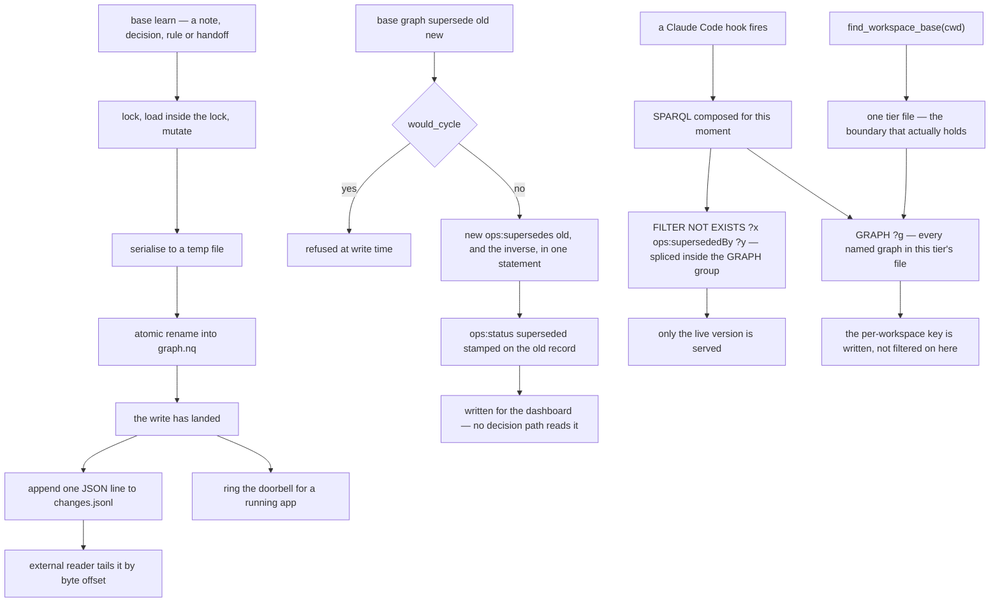

## 1. Executive Summary

basemode is a Rust binary, `base`, that maps a workspace into an RDF knowledge graph and wires it into every hook Claude Code exposes, so that a briefing lands in the turn before the agent starts guessing. About 54,200 lines of Rust against 16,100 lines in 74 test files holding 454 cases, oxigraph over one N-Quads file per tier, version 0.15.2, a 352-line changelog, and a Svelte dashboard beside it.

**The licence is a caveat to state before the mechanisms.** `LICENSE.md` is the **Functional Source License 1.1 with an Apache-2.0 future licence** (FSL-1.1-ALv2) — source-available, not open source today, converting to Apache-2.0 on a delay. That is why GitHub reports `NOASSERTION`. The atlas analyses it the same way it analyses any other implementation; a reader deciding what they may *do* with it needs the licence text.

**What makes this repository unusual is that its comments audit its own wiring, with measurements.** `src/supersede.rs` opens by recording that `ops:supersedes` and `ops:supersededBy` had been declared in the ontology since before 0.13.19 *"and **nothing has ever written either one** — measured on Chris's store, 2026-09-07: 0 quads of each across both tiers."* The only supersession that existed was a JSON field in a sync ledger *"which no graph reader can see"*, so a correction sat beside the thing it corrected, both came back from `recall`, and *"nothing says which one is live. That is the drift this module exists to end."* That is the atlas's own declared-and-unwired finding, made by the author about his own code, dated and counted.

**And the module that ends it is wired.** `base graph supersede <old> <new>` reaches `crud::supersede` at `cli.rs:4052`; `would_cycle` refuses a loop at write time; `resolve_head` walks the chain forward; and the serving surfaces splice `FILTER NOT EXISTS { ?x ops:supersededBy ?y }` into their SPARQL. The test file that pins it states the vacuity guard in its own header — *"a filter that excludes everything passes a 'the old one is gone' assertion just as well as a correct one"* — and asserts both halves per surface.

**The one mark a reader might expect and will not find is scope.** Writes are routed into a per-workspace named graph, and the four hook queries that actually put context in front of the model read `GRAPH ?g` — a wildcard over every named graph in the tier's file. The boundary that holds is therefore the file, selected by `find_workspace_base(cwd)`, which is a physical partition rather than a predicate. The project has already been bitten by the difference and wrote it down: bug #112 describes a removal whose guard read the wildcard while its DELETE was scoped to one graph, so a rule sitting in a foreign named graph — *"460 quads of them on the reporting install"* — passed the guard, matched nothing, and a hardcoded `Ok(1)` reported success.

## 2. Mental Model

A memory is **a typed RDF subject with edges**, and the ontology is the vocabulary: `Decision`, `Task`, `Goal`, `Handoff`, `Person`, `Project`, `Entity`, `Reminder`, plus AST-derived entities for the code itself — functions, callers, imports, dependents — so "where is this used" is a graph question rather than a grep.

**Truth is an edge, and the status is a label.** `supersede.rs` states the rule in a heading: *"The edge is the truth; the status is a label."* Every decision path keys on `ops:supersededBy`; the writer also stamps `ops:status "superseded"` so the dashboard and `learn --list` stop showing the record as active, but *"no reader may require both"* — because `ops:status` is unvalidated free text. The author measured his own store: 44 distinct values against the six the ontology declares, including case variants counted separately (`Pass` 242, `PASS` 43, `PASS (no change)` 1) and whole sentences, one of them a truncated markdown paragraph. One record already carries the status with no edge. `base doctor` reports the disagreement in both directions rather than any reader trying to reconcile it.

That is why the trust-state mark is withheld and why the withholding is interesting: the field exists, its vocabulary is declared, and the system deliberately refuses to let a decision depend on it.

**Correction never rewrites.** A → B → C is three records and two edges, nothing is re-pointed, and `resolve_head` walks forward to the live end. A cycle is refused at write time, and if one reaches the store by another route the walk terminates on its visited set *"rather than hanging a session-start hook"* — the failure mode named, because this code runs on every session boot.



## 3. Architecture

One binary, installed by `curl | sh` or a PowerShell one-liner, with no Rust toolchain required. Storage is oxigraph over a single N-Quads file per tier: `<ws>/.base/graph.nq` for a workspace and `~/.base-gbl/.base/graph.nq` for global, selected by walking up from the CWD. Beside each graph sits its `changes.jsonl`.

The integration is the product. `base` registers into all four Claude Code hooks, and the README's table is the design: session start returns everything standing that governs where the agent is about to work; the prompt hook returns what bears on what was just asked; the pre-tool hook returns the shape of the file about to be touched; the post-tool hook returns the call chain for the exact lines just read. Subagents and explore agents inherit the same hooks and the same graph.

Around that: a Svelte dashboard, a doorbell socket so a running Electron app learns about writes without polling, a plugin and extension surface, a tree-sitter AST pass over 29 grammars for the code graph, and `base doctor` as the health and audit surface.

## 4. Essential Implementation Paths

**Write** — `store::write_back_inner` (`src/store.rs`): the three write entry points funnel here; serialise, `rename_with_retry`, then `changelog::append` and `doorbell::ring`, both after the rename and both best-effort by contract.

**Supersede** — `cli.rs:4052` → `crud::supersede::supersede` → `supersede::would_cycle` then `supersede::link_update`, which writes both directions in one statement and stamps the status on the old record.

**Serve** — each hook composes SPARQL for its moment; `crud/note.rs:137` and `crud/rule.rs:140` splice `supersede::sparql_exclude_superseded` *inside* the GRAPH group; `graph_query.rs:127` and `graph_tools.rs:171` resolve an IRI to its head before answering.

**Audit** — `supersede::audit` runs inside `base doctor` on the store it has already loaded, counting superseded records, status/edge disagreements in both directions, and corrections naming nothing.

**Compact** — session start calls `graph::auto_compact_tiers`, backup-first, atomic and cooldown-gated, skipping an unhealthy graph, so a file that has ballooned is repaired at boot rather than growing unbounded.

## 5. Memory Data Model

`src/ontology/ops.ttl` declares the vocabulary — about twenty classes and their properties, with `ops:createdAt` and `ops:updatedAt` ranged on `xsd:dateTime`. Time is single-axis: `createdAt` is stamped at write and `updatedAt` overwrites, with no separate record of when a fact was true as against when the store learned it, which is why the bi-temporal mark is withheld.

Two things sit outside the graph and matter. `changes.jsonl` is the mutation record described above. The sync ledger (`apply_ops.rs`, `changelog.rs`) carries `supersedes_fact_id` for cross-machine replication — the JSON field `supersede.rs` names as the pre-existing supersession that *"no graph reader can see"*, and the reason the graph predicate had to be wired.

## 6. Retrieval Mechanics

There is no ranking here and no embedding anywhere. Retrieval is SPARQL composed per hook moment, and the design's claim is that a query bound to the moment beats a scored list: opening an auth file returns the auth rules, the decision that governs them, *"and nothing else. Targeted, never a dump."*

The supersession filter is the part worth studying, because its correctness is positional. `sparql_exclude_superseded` produces a `FILTER NOT EXISTS` that must be spliced **inside** the GRAPH group beside the pattern it constrains; the comment in `crud/rule.rs` names the release that got it wrong — F16 shipped it after the last arm, *"where it constrained nothing and `recall` went on printing what it was meant to hide"*, dated 2026-09-06. A filter that is present, syntactically valid, and in the wrong clause is invisible to every test that only checks the query runs, which is exactly why the test file asserts both halves per surface.

Scope, as section 1 says, is the file. Within a tier the serving queries range over every named graph.

## 7. Write Mechanics

Writes are synchronous and locked: `lock_and_load` takes one lock and loads inside it, after a bug where a second `fetch` parsed the whole graph a second time before the mutation did. Serialisation goes to a temp file and an atomic rename; only then does anything observable happen — the changes line, the doorbell.

The `O_APPEND` argument in `changelog.rs` is worth repeating because it is the rare case where the usual atomic-write advice is wrong: for a whole-file rewrite temp+rename is correct, but for an append-only log *"the rename is the unreliable step"* on Windows, where a scanner holding a transient handle makes it throw and the write is silently lost. An append has no rename to lose, and a single `O_APPEND` write is atomic against concurrent appenders on both targets — which matters because hooks fire on every tool call and several `base` processes really are writing at once.

Nothing rewrites the store on a timer. The only bulk operation is the boot-time compaction.

## 8. Agent Integration

Four hooks, one graph, every agent. The distinctive choice is that basemode does not wait to be asked: there is no `recall` tool the model has to remember to call at the right moment, because the injection is bound to moments the harness already announces. The cost is the one this design always pays — what lands is whatever the query for that moment returns, and the agent cannot ask for more of it.

The CLI is the human surface: `base learn`, `base recall`, `base graph query`, `base graph supersede`, `base doctor`, and a starter command set. `base doctor` is also where the supersession audit surfaces, deliberately rather than at write time.

## 9. Reliability, Safety, and Trust

**The comment discipline is the strength and it is unusual enough to enumerate.** A dated quad count establishing that a declared predicate had never been written. A census of a free-text field's real values explaining why no reader may depend on it. A numbered bug (#112) where a wildcard guard and a scoped DELETE asked different questions and a hardcoded `Ok(1)` reported success over 460 foreign quads. A filter-placement note naming the release that shipped it in the wrong clause. A ruling, dated, on why a warning belongs in `doctor` rather than at every write. Each is a fact about the system that a reader would otherwise have to rediscover.

**The write path is defended.** Lock-then-load, temp+rename for the graph, `O_APPEND` for the log with the platform reasoning written out, a doorbell that cannot fail the command, corruption surfaced loudly at boot *"before any other output, so a broken graph announces itself immediately instead of degrading silently"*, and compaction that backs up first and skips an unhealthy graph.

**The gaps are two.** The workspace key is written and not served, so the boundary is the tier file. And correction is keyed on the record: re-learning a corrected fact creates a new note the chain does not reach, because `supersededBy` points from one IRI to another and nothing is keyed on the text. The second is why the tombstone mark is withheld despite this being one of the more complete supersession implementations in the corpus.

**One log caveat.** Guarantee two — logging never fails the user's command — means a failed append warns once to stderr and is dropped, so the audit is best-effort by design, and no committed test asserts that a landed write produced a line.

## 10. Tests, Evals, and Benchmarks

**I did not run this suite.** Five dependency surfaces changed the day of the pin, inside the seven-day cooldown, and `scripts/ast/requirements.txt` carries 29 unpinned requirements. The screen found no auto-run surface and no build-time execution path. Everything here is read from the committed code.

74 integration test files holding 454 cases, plus unit tests in-module, against tempdirs with no service dependency. `tests/supersede_readers_test.rs` is the one to read: one fixture, one test per serving surface, both halves asserted, and the reason written at the top.

The other tests worth naming are the ones pinning the incidents: `rule_index_test.rs` (tier-local indices, where *"the number a user reads in their injected context routinely names a different rule here"*), `ontology_test.rs`, `crud_decision_test.rs`. The scope module carries its own unit tests and was written filesystem-free *"so it is trivially unit-testable with literal paths"* — though its header still says it has *"zero non-test callers by design (a dormant primitive)"*, which is stale at this pin: `crud/project.rs` now calls `current_workspace`, `home` and `in_scope`.

**No benchmark, no paper, and no claim to either.** `grep -rn -i "benchmark\|locomo\|longmemeval\|arxiv" README.md` returns nothing. For a memory system this is the honest position, and the README's argument is a usage one — an un-briefed agent greps, a briefed one was handed the answer — rather than a number.

## 11. Patterns Worth Stealing

### Steal

**Write your unwired mechanisms down, with a measurement and a date.** *"Declared since before 0.13.19 and nothing has ever written either one — measured 2026-09-07: 0 quads of each across both tiers"* is worth more than any issue tracker entry, because it is in the file a maintainer opens when they go to use the thing.

**Separate the edge from the label, and say which one decides.** A status string that the dashboard reads and no decision path consults is a legitimate design — once it is stated. The 44-values census is what justifies the rule.

**Log after the rename, never before.** *"The write has landed. Only now is there something true to log."* One line, and it is the difference between an audit log and a log of intentions.

**Know when temp+rename is the wrong atomicity.** For an append-only log on Windows the rename is the failure point; `O_APPEND` has none. The comment names the memory it came from.

**Put the periodic warning in the doctor, not in the write path.** A per-write nag *"is ignored within a week, and trains him to ignore the next warning that matters"*.

**Assert both halves of an exclusion, and say why in the test file.** This project wrote the atlas's vacuity rule into its own header without being asked.

### Avoid

**Do not route writes by a key the serving queries do not filter on.** The named graph carries the workspace and the hook queries read `GRAPH ?g`; the difference already produced bug #112 on the removal path.

**Do not let a guard and its mutation ask different questions.** The same bug in one sentence.

**Do not key a correction on the record when the thing being corrected is text.** Re-learning the same wrong fact produces a fresh live note.

### Fit

Take basemode if you want **a structured workspace graph pushed into an agent's turn without the model having to ask**, and you are comfortable with a source-available licence. The hook coverage is complete, the code graph makes "where is this used" answerable rather than greppable, and the engineering around the file is careful in the specific ways that matter for a single durable artifact.

Do not take it if you need **a tenant boundary inside one tier**, or a correction that survives the same fact being learned again, or an epistemic status a reader can act on. And read the licence before building on it.

## 12. Antipatterns / Risks

**A write-time routing key that no serving query filters on.**

**Correction keyed on the record.** The supersession chain is complete and re-learning walks past it.

**A status field with a declared vocabulary, free-text writes, and 44 real values.** The system is right not to trust it; the field is still there, and the dashboard shows it.

**A best-effort audit with no test.** Three stated guarantees, none of them pinned by a committed case.

**A stale module header.** `scope.rs` still describes itself as dormant with zero non-test callers; `crud/project.rs` calls it.

## 13. Build-vs-Borrow Takeaways

**Borrow the supersession module wholesale** if you have an RDF or triple-shaped store: the forward walk, the write-time cycle refusal, the filter helper, and the audit that reports disagreement rather than reconciling it are about 250 lines and the reasoning is in the file.

**Borrow the changes-log contract** — after the rename, best-effort, tier derived from the path, `O_APPEND` — for any single-file store with external readers.

**Borrow the comment style.** It is the cheapest quality mechanism in this report and it does not depend on Rust, RDF, or anything else here.

**Build the scope predicate yourself** before running more than one workspace in a tier.

## 14. Open Questions

- Is the named graph meant to become a serving predicate? The write routing, the `workspace_graph_iri` helper and the `reslot` migration all exist; the hook queries read the wildcard.
- `scope.rs`'s header says dormant and `crud/project.rs` calls it. Which phase is actually shipped is not derivable from the file.
- The sync ledger's `supersedes_fact_id` and the graph's `ops:supersededBy` now both express supersession. Whether the ledger field is being retired, or the two are expected to agree, is not stated.
- `ops:status` has a declared vocabulary nothing validates. Whether the intent is to validate it or to delete it is the fork the audit's existence implies but does not name.

## 15. Appendix: File Index

**Memory and correction**
- `src/supersede.rs` — the module docs quoted throughout, `sparql_exclude_superseded` (`:66`), `resolve_head` (`:92`), `would_cycle` (`:126`), `link_update` (`:167`), `audit` (`:218`)
- `src/crud/supersede.rs`, `src/crud/note.rs`, `src/crud/rule.rs`, `src/crud/decision.rs`, `src/crud/handoff.rs`
- `src/ontology/ops.ttl` — the class and property declarations, including `ops:status` at `:117`

**Store and log**
- `src/store.rs` — `write_back_inner`, the post-rename append (`:1015-1030`)
- `src/changelog.rs` — the three guarantees and the `O_APPEND` argument
- `src/doorbell.rs`, `src/graph.rs`, `src/migrate.rs`

**Serving**
- `src/hook/session_start.rs`, `user_prompt_submit.rs`, `pre_tool_use.rs`, `post_tool_use.rs`
- `src/graph_query.rs`, `src/graph_tools.rs`, `src/scope.rs`, `src/domain/tier.rs`

**Tests cited**
- `tests/supersede_readers_test.rs`, `tests/rule_index_test.rs`, `tests/ontology_test.rs`, `tests/crud_decision_test.rs`

**Commands this reading used**
```sh
python3 scripts/screen_repo.py <checkout>
grep -rn "supersede::" --include="*.rs" src/ tests/    # the producer at cli.rs:4052 and the readers
grep -rn "write_back_inner(" --include="*.rs" src/     # three entry points, one funnel
grep -c "GRAPH ?g" ; grep -c "GRAPH <{"                # 200 wildcard reads against 114 bound
grep -rn "createdAt\|updatedAt" src/ontology/ops.ttl   # one time axis, updatedAt overwrites
grep -rn -i "benchmark\|locomo\|longmemeval\|arxiv" README.md   # no claim
```

## History

**2026-09-12** — [`0ace1bae246f1ff9ea0b5ea9b8d1801fbc83c627`](https://github.com/ChristopherKahler/base/commit/0ace1bae246f1ff9ea0b5ea9b8d1801fbc83c627) — first reading, at the default branch's head, release 0.15.2 dated the same day. The queue entry named an older pin, `0e7433070323`, which the branch had moved past by the time it was worked; this report describes what was read. Screened before reading: no auto-run surface and no build-time execution path; five dependency surfaces inside the seven-day cooldown; two unpinned surfaces — a dashboard manifest with four floating ranges above a present lockfile, and `scripts/ast/requirements.txt` with 29 requirements unpinned; `Cargo.lock` present. Nothing was installed, built or run, and no test in this repository was executed. The licence is the **Functional Source License 1.1 with an Apache-2.0 future licence** per `LICENSE.md`, with `LICENSE-APACHE-2.0` and `LICENSING.md` beside it — source-available rather than open source at this pin, which is why the GitHub API reports `NOASSERTION`.
