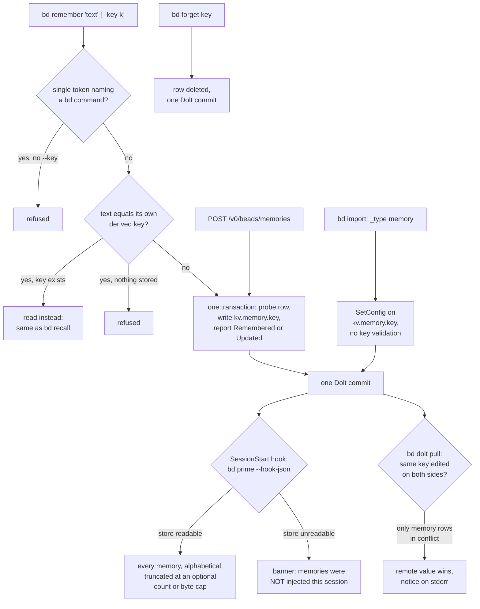

## 1. Executive Summary

beads is a distributed, Dolt-backed issue tracker for coding agents: issues,
dependencies, molecules and a ready queue, served by the `bd` CLI, an HTTP API
and a Python MCP server. Beside the issues sits a small memory plane: `bd
remember` stores a string under a key, `bd prime` — which the installers wire to
the SessionStart hook of Claude Code, Codex, Gemini and Cursor — injects every
memory into each session, and `bd forget` deletes one.

What is notable is the
care taken over a few hundred lines. Every write reads and replaces in one
transaction, and is one Dolt commit. A prime that cannot read the store says so
in the injected text. The key-derivation rule is frozen with a golden table,
because changing it would silently re-key every memory.

What is weak is what
the plane does not attempt. There is no type, provenance, time or status, no
ranking, and injection is complete unless an operator sets a cap. When two
clones edit the same memory, the pull resolves the conflict to the remote's
value and says so only on stderr.

The plane is small by design. It is one role, `memoryops.Memories`, with four
operations — `Remember`, `Recall`, `Forget`, `List` — implemented for the
server-backed store, the embedded store and the proxied unit-of-work route, and
proven to agree by contract tests
(`internal/storage/{dolt,embeddeddolt,uow}/memories_contract_test.go`).

The issues are not memory and this report does not cover them; the
[scope note](../../families/#not-in-scope-conversation-window-management) says
why. The memories are, because a memory such as *"auth module uses JWT not
sessions"* is a claim that can be wrong.

[Gas Town](../gastown/), the multi-agent orchestrator built on beads, writes into
the same `kv.memory.` namespace with its own typed keys through `bd kv set`. From
v1.1.0, released 4 July 2026, `validateKVKey` refuses any generic key under
`memory.` (`cmd/bd/kv.go:31-39`), so that path fails and only `bd remember`
writes a memory.

One mark: `negative_eval`, on an integration journey that asserts a forgotten
memory drops out of the listing and a search leaves out an unrelated memory,
each after a positive control. Section 9 names the six withheld.

## 2. Mental Model

A memory is a string under a key. It becomes a belief when `bd remember`
commits: there is no candidate state, no extraction and no model call. It stops
being one when `bd forget` deletes the row, when a later `remember` under the
same key replaces the text, or when a pull resolves a conflict on that key to
the remote's value. Nothing expires or decays.

**The key is the identity, and it is derived from the words when not given.**
`DeriveKey` lowercases, collapses every non-alphanumeric run to one hyphen,
keeps eight segments and caps at 60 bytes (`internal/memoryapi/memoryapi.go:53-73`).
Re-remembering the same sentence therefore updates it in place. A different
sentence that opens with the same eight words replaces it too, reported as
`Updated`. The function's comment forbids tidying it, because a change would
leave every old memory in place under a key nobody derives any more.

**Two guards keep the wrong string from becoming a memory.** A single token
matching a `bd` command name is refused as *"looks like a command, not
something to remember"* (`cmd/bd/memory.go:91-107`, `:283-290`). A bare token
equal to its own derived key is read as a recall of that key rather than stored
as content, and refused when nothing is stored under it (`:114-135`, `:319-325`).
Both exist because agents type `bd remember <key>` expecting to read.

**Across clones, the remote is the tie-breaker.** Memories are rows in the
Dolt `config` table, and that table is committed before a pull so they sync
(`internal/storage/versioncontrolops/mergesettle.go:391-396`). When every
conflicted config row is a memory, the merge resolves the table with `--theirs`
(`:484-492`, `:531-545`): the local edit is superseded and a notice naming the
keys goes to stderr. A conflict that touches any other config key is left to the
operator. A local `forget` against a remote edit of the same key is a
delete/modify conflict and resolves the same way, so the memory returns.

Injected memories carry no qualifier. Each is a `###` heading and its text,
under *"Persistent Memories"*, so the model reads them as settled.

## 3. Architecture

`bd` is a Go CLI over Dolt, the SQL database with git-style history. A workspace
is a `.beads/` directory whose data lives in an embedded Dolt engine, a local
Dolt SQL server, or behind a proxied server that `bd` reaches through a
unit-of-work provider (`cmd/bd/memory.go:26-72`). `bd serve` exposes the same
roles over HTTP.

The memory plane adds no storage of its own. A memory is a row in the `config`
table under `kv.memory.<key>`, the constants living in one package so the CLI
and the merge resolver cannot drift (`internal/storage/kvkeys/kvkeys.go`). The
same table holds workspace settings such as `issue_prefix` and generic
`bd kv` values under `kv.`. `MemoriesFromConfig` narrows on the full
`kv.memory.` prefix, and its comment names the two silent mistakes it avoids:
filtering on `kv.` and trimming a different length than it matched
(`internal/storage/memoryops/memories.go:58-75`).

Durability differs by route. On the direct routes the store runs the row write
and leaves the Dolt commit to the CLI's post-run epilogue, which fires because
`noteDirectMemoryWrite` sets the write flag (`memory.go:74-78`;
`memoryops/memories.go:26-31`). The proxied route commits per write. Tests pin
one commit per `remember` and per `forget` on both routes (section 10).

Nothing runs in the background for memory. Memories leave a machine only when
Dolt pushes or when `bd export --include-memories` writes them to JSONL; plain
`bd export` excludes them *"because they may contain sensitive agent context"*
(`cmd/bd/export.go:39-47`).

### Deployment and ergonomics

One binary; embedded mode needs nothing else, and server mode needs a Dolt SQL
server that `bd` can start. No API key is required. The store is readable with
`bd memories`, `bd recall`, SQL against `config`, or an exported JSONL file,
and a wrong memory is fixed by re-running `bd remember --key` with the same key.

## 4. Essential Implementation Paths

**Write.** `rememberCmd` (`cmd/bd/memory.go:237-350`) runs the two guards,
opens the role through `openMemories`, and calls `Remember`. The storage body
is `RememberInTx` (`internal/storage/memoryops/memories.go:90-103`): probe the
row with `configRowExistsInTx`, write with `issueops.SetConfigInTx`, return
`replaced`, all in the caller's transaction. A probe failure fails the write.
Key resolution is `memoryapi.ResolveKey` (`memoryapi.go:110-132`): an explicit
key is used verbatim unless it is empty after trimming, otherwise `DeriveKey`.

**Read, one key.** `recallCmd` → `RecallInTx` (`memories.go:105-107`). A key
stored as the empty string reads as not found.

**Read, all.** `memoriesCmd` → `List` → `ListInTx` (`:143-149`) →
`MemoriesFromConfig`, then `FilterMemories` for a search term, case-folded on
both sides (`memoryapi.go:144-160`).

**Inject.** `formatMemoriesForPrime` (`cmd/bd/prime.go:433-474`) reads the plane
through the same role, or renders an unavailable or timeout banner.
`renderPrimeMemories` (`:530-588`) sorts keys, emits whole memories until a count
or byte cap binds, always emits at least one, and heads the block with *"showing
N of M, alphabetical"* when anything was elided. Caps come from flags or the
`prime.max-memories` and `prime.max-memory-chars` config keys, unlimited by
default (`:501-517`). A custom `.beads/PRIME.md` replaces the workflow text and
keeps the memories section (`:184-198`).

**Forget.** `forgetCmd` → `ForgetInTx` (`memories.go:120-133`): read, then
delete the one encoded key, returning what was there. There is no prefix sweep,
so forgetting `a` leaves `a-b`.

**HTTP.** `GET /v0/beads/memories`, `POST /v0/beads/memories`,
`GET /v0/beads/memories/{key}` and `DELETE /v0/beads/memories/{key}`, with
capabilities `memories.list`, `.remember`, `.get` and `.forget`
(`internal/httpapi/routes.go:654-733`; handlers in `internal/httpapi/memories.go`).
Authentication is a file of bearer tokens, each of which *"grants the whole
surface"* (`internal/httpapi/auth.go`).

**Import and export.** `bd import` classifies `_type: memory` lines and writes
each with `store.SetConfig(kvPrefix + memoryPrefix + mem.Key, …)`
(`cmd/bd/import.go:298-311`, `:359-365`; the proxied twin is
`import_proxied_server.go:118-124`). `bd export` reads them back on request.

**Merge.** `TryAutoResolveMergeConflicts` classifies conflicted tables and, for
`config`, calls `configConflictsAreMemoryConvergent` (`mergesettle.go:662-682`)
before resolving with `--theirs` (`:531-545`).

**Hook installation.** `bd setup claude` registers `bd prime --hook-json` on
SessionStart and removes older PreCompact registrations, because *"SessionStart
also fires after compaction with source=compact"* (`cmd/bd/setup/claude.go:272-300`).

## 5. Memory Data Model

| Field | Where | Notes |
| --- | --- | --- |
| key | `config.key` | `kv.memory.` + the user key, verbatim — spaces, capitals and punctuation survive |
| value | `config.value` | the content, byte for byte; an empty value reads as absent |

The role's result types carry `Key`, `Value`, `Replaced` and `Found`
(`memoryops/memories.go`), and nothing else is stored. There is no author,
although `bd` resolves an actor for Dolt commit messages. There is no timestamp
beyond the commit graph, no type or category, and no link to the issue or
session a memory came from.

**Scope is the database.** A workspace's memories are visible to every agent and
every clone that opens it, and to every clone that pulls from its remote. The
`--global` flag selects a shared `beads_global` database instead
(`cmd/bd/main.go:892`). There is no
key on the row and no predicate on any read.

**The storage encoding is written out in four more places.** `StorageKey` calls
itself *"THE ONE ENCODE IN THE TREE"* (`memoryops/memories.go:45-56`), and
`import.go:361`, `import_proxied_server.go:121`, `export.go:278` and
`export_auto.go:805` each spell `kvPrefix + memoryPrefix` inline. They agree
today because they share constants. The import copies also skip `ResolveKey`:
import drops a record only when key or value is empty
(`import.go:306`). A whitespace-only key is therefore stored, and that is the
row `ResolveKey`'s own comment calls *"unrecallable, unforgettable, reachable
only through `bd config unset`"* (`memoryapi.go:115-127`). This was read, not
reproduced.

## 6. Retrieval Mechanics

Retrieval is key lookup, full listing, or a substring filter. Nothing ranks.
Injection is the whole plane in byte order of the key, which is stable and
cache-friendly within a session.

The optional caps decide what is dropped by the same alphabetical order. With
`--max-memories 20`, the twenty memories whose keys sort first are injected and
the rest are named in a count; age, use and importance play no part. The banner
tells the model how to find the rest (`bd memories <keyword>`), which turns
recall of an elided memory into a search the agent must think to run.

Every SessionStart re-injects, including the one Claude Code fires after
compaction. Prime has no branch on the hook source, and the installer removed
the separate PreCompact registration for that reason.

A store that cannot be read produces *"Skipped: beads storage unavailable (…) —
persistent memories were NOT injected this session. Run `bd doctor`"*
(`prime.go:624-630`), and a deadline produces a timeout banner. Only an empty
healthy store and the absence of a workspace stay silent (`:425-432`).

`bd memories` returns every memory whose key or value contains the term,
case-folded; the listing truncates each value to 120 characters, and
`bd recall` returns the full text.

## 7. Write Mechanics

Writes are explicit and synchronous: a CLI call, an HTTP POST, or an import. No
model is called and nothing is extracted, deduplicated beyond the key, or
consolidated. A `remember` is one transaction and one Dolt commit, visible to
the next prime in the workspace at once, and to other clones after a push and
pull.

**Update is by key.** An explicit `--key` targets a memory deliberately. A
derived key targets whatever memory shares the first eight words, and the
command reports `Updated` without showing the text it replaced. The replaced
value survives in Dolt history until a compaction flattens it.

**Delete is by key**, one row, one commit. The deleted text stays in Dolt
history, and in any JSONL export or clone taken earlier. A later pull that
carries a remote edit of the same key restores it (section 2).

**Agent-generated content is handled like a person's.** The two guards catch
mistyped commands, not wrong claims. Nothing filters content, and the HTTP
surface accepts writes from any holder of any token.

### Operational cost

- Write: synchronous, one transaction, one Dolt commit, no model call.
- Background: none for memory. Replication rides Dolt push and pull.
- Read: one `List` per prime. Injection is unbounded by default and bounded by
  the two caps when set, once per SessionStart including after compaction.

## 8. Agent Integration

`bd setup` installs SessionStart hooks for Claude Code, Codex, Gemini and
Cursor, each running `bd prime --hook-json` (`cmd/bd/setup/claude.go:272-300`
and siblings). `bd prime --memories-only` exists for hosts that want only the
memory section, and `--no-memories` for those that want none. The Python MCP
server under `integrations/beads-mcp/` describes itself as a *"Task Tracker and
Memory System"*; no tool in `src/beads_mcp/` names remember, recall or forget.

The agent has the four verbs with no confirmation on any of them. The prime text
tells it how to update in place with `bd remember --key` and how to browse.

## 9. Reliability, Safety, and Trust

**Transactions are honest.** The probe and the act share one transaction, so
`Updated`, `Forgot` and the value `forget` prints describe the row that was
actually there. The package comment explains that the earlier
`GetConfig`-then-`SetConfig` path with `existing, _ :=` made them *"hopeful
rather than true"* (`memoryops/memories.go:1-15`).

**Conflict resolution trades correctness for convergence, deliberately.** Every
clone pulling from one remote ends with the remote's value, which is the
property a shared plane needs. The cost is that a local correction made while
another clone edited the same key is lost. The only record is one stderr line
at pull time, which an agent running `bd` in a hook may never surface.

**No provenance.** A memory cannot say who wrote it, when, or why, so an agent
cannot weigh it, and an injected memory reads as a rule. The HTTP token model
and the absence of a content filter mean anything that can reach the write
path can install one.

**Privacy.** Export excludes memories by default. Dolt push does not, and every
clone and remote holds every memory and its history.

**Uncertainty is not representable.**

Capability marks:

- `negative_eval` — awarded; evidence in section 10.
- `tombstone` — `forget` deletes the row. Nothing keyed on the rejected text
  prevents re-storing it, and a remote edit can bring it back.
- `trust_state` — no status field.
- `bitemporal` — no time field; Dolt's commit graph records when a value
  changed, not when it was true.
- `scope_enforced` — the partition is the database. There is no scope key on the
  row and no predicate on a read.
- `audit_log` — each memory write is a Dolt commit, which is version history.
  No memory event exists: `HookFiringStore.Memories` passes through because the
  hook vocabulary is issue-shaped (`internal/storage/hook_memories.go`), and
  telemetry spans go to a trace backend.
- `human_review` — `bd memories` displays, and the same verbs are open to the
  agent.

## 10. Tests, Evals, and Benchmarks

Nothing was built or run for this report; everything below is from reading the
tests at the pin.

**The negative case.** `TestProxiedServerMemory` →
`remember_memories_forget_recall_journey` (`cmd/bd/memory_proxied_integration_test.go:35-124`)
stores `dolt-phantoms` and a derived-key memory, asserts
`bd memories phantom` contains the first and not the second (`:77-84`), then
forgets `dolt-phantoms` and asserts a full `bd memories` no longer lists it
(`:102-110`). The positive side is asserted first each time, so an empty result
fails. The suite skips without `BEADS_TEST_PROXIED_SERVER=1`, and the CI
workflow sets it (`.github/workflows/main.yml:920`).

**Commit shape.** `remember_creates_dolt_commit` asserts exactly one Dolt commit
per proxied `remember` (`:177-192`). The embedded
`write_verbs_flag_the_auto_commit_epilogue` asserts one per `remember`, one per
`forget`, and none for a `forget` of an absent key
(`cmd/bd/memory_embedded_test.go:294-325`). Its comment names the failure it
exists for: a working-set row *"recalls and lists exactly like a committed one"*,
so every other assertion would pass without it.

**Meaning, without a database.** `internal/memoryapi/memoryapi_test.go` pins
`DeriveKey` with a golden table and a cap property, and covers the refusals and
the filter. `internal/storage/memoryops/memories_test.go` asserts the plane
excludes settings rows, generic `kv.` rows and a key that merely contains the
prefix, and keeps a memory named after a setting
(`:33-73`). `prime_memory_caps_test.go` covers both caps, the whole-memory
boundary, the first-memory guarantee and the banner.

**A case that asserts nothing.** `memories_search_no_match`
(`memory_embedded_test.go:264-268`) runs a search for a term nothing contains
and ends `_ = out`, with the comment *"Should succeed but show no results or
empty"*. It fails only if the command errors.

**Not covered.** The merge resolver's memory branch was not traced to a test in
this reading. No test imports a whitespace-only memory key. No retrieval-quality
evaluation exists, which is consistent with a plane that does not rank. No paper
or citation block is in the tree.

## 11. For Your Own Build

### Steal

- **Probe and act in one transaction, and report what the probe saw.** The
  verb in the reply (`Remembered` or `Updated`, `Forgot` with the old text) is
  a claim; make it a true one.
- **Freeze the key derivation and pin it with a golden table.** Any change to a
  content-derived key re-keys every memory silently; the comment and the test
  here treat that as the invariant it is.
- **Refuse the common wrong call at the door.** A single word that names a
  command, and a bare key typed as content, are what agents actually send.
- **Make a failed read loud in the injected text.** "No memories" and "memories
  not loaded" must look different to the model and to the operator.
- **Cap injection at whole-memory boundaries, always emit one, and say what was
  elided and how to find it.**
- **Reserve the namespace.** The generic key-value command refuses the memory
  prefix, so no other writer can place rows there that the merge rule would
  then treat as memories.

### Avoid

- **Resolving concurrent edits to the remote without telling the reader.**
  Convergence is right for a shared plane; losing a correction with only a
  stderr line is not. Record the superseded value somewhere a person will see.
- **Eliding by key order.** If a cap must drop memories, drop by something that
  means something — age, last use, a pin.
- **A second encode path that skips validation.** Import writes the storage key
  itself and accepts what the validated path refuses.
- **Reserving a namespace another project writes into, without a migration.**
  [Gas Town](../gastown/) wrote its typed memories under `memory.` through the
  generic command; the reservation broke that path in a minor release, and the
  suite on each side stayed green.

### Fit

This suits a single developer or a small team whose agents already use beads for
work tracking and want a handful of durable rules injected every session,
synced with the issues at no extra cost. The engineering is careful, and the
plane is deliberately primitive. A reader who needs memories to be found rather
than listed, attributed, dated or kept out of other clones needs those layers,
and nothing here provides them. Anyone reaching for beads only for memory is
taking on a Dolt-backed issue tracker to get a key-value table.

## 12. Open Questions

- Is the `--theirs` memory resolution covered by a test? None was found in this
  reading; `mergesettle` is large and its tests were not read.
- Does the Dolt compaction beads documents flatten memory history, and on what
  schedule by default?
- How many memories do real workspaces hold, and how often are the caps set?
- Does the proxied server enforce anything per client beyond the shared token?

## Appendix: File Index

- **Role and meaning:** `memoryops/memories.go`, `memoryops/errors.go`,
  `internal/memoryapi/memoryapi.go`, `internal/storage/kvkeys/kvkeys.go`.
- **Storage:** `internal/storage/memoryops/memories.go`,
  `internal/storage/dolt/memories.go`, `internal/storage/embeddeddolt/memories.go`,
  `internal/storage/uow/memories.go`, `internal/storage/hook_memories.go`.
- **CLI:** `cmd/bd/memory.go`, `cmd/bd/kv.go`, `cmd/bd/prime.go`,
  `cmd/bd/import.go`, `cmd/bd/import_proxied_server.go`, `cmd/bd/export.go`,
  `cmd/bd/setup/claude.go`.
- **HTTP:** `internal/httpapi/routes.go:654-733`, `internal/httpapi/memories.go`,
  `internal/httpapi/auth.go`.
- **Replication:** `internal/storage/versioncontrolops/mergesettle.go:380-400,
  480-545, 650-700`.
- **Tests:** `cmd/bd/memory_proxied_integration_test.go`,
  `cmd/bd/memory_embedded_test.go`, `cmd/bd/prime_memory_caps_test.go`,
  `internal/memoryapi/memoryapi_test.go`,
  `internal/storage/memoryops/memories_test.go`,
  `internal/storage/*/memories_contract_test.go`.

### Recorded searches

Checked against the checkout at the pinned revision.

- `rg -n '\.Remember\(|RememberInTx\(|\.Forget\(|ForgetInTx\(' --type go -g '!*_test.go'` — callers in `cmd/bd/memory.go`, `internal/httpapi/memories.go`, the telemetry wrapper and the two store bodies; no background writer.
- `rg -n 'kvPrefix \+ memoryPrefix|MemoryConfigKeyPrefix \+' --type go -g '!*_test.go'` — `import.go:361`, `import_proxied_server.go:121`, `export.go:278`, `export_auto.go:805`, beside `StorageKey`.
- `rg -n -i 'remember|memories|forget|recall' integrations/beads-mcp/src/beads_mcp/*.py` — one match, the module docstring; no memory tool.
- `rg -n -i 'memor' internal/audit/*.go -g '!*_test.go'` — no match.
- `rg -n 'BEADS_TEST_PROXIED_SERVER' .github/` — set in `main.yml:920`; the shard script documents that tests skip without it.
- `grep -rliE 'arxiv|bibtex|@article|@misc|doi\.org' . --exclude-dir=.git --exclude-dir=node_modules` — no match, and no `CITATION.cff`.

## History

**2026-09-25** — [`a1bc167b54922b7a3953b23d4427aa7fb46409fc`](https://github.com/gastownhall/beads/commit/a1bc167b54922b7a3953b23d4427aa7fb46409fc) — first reading, at the head of `main`, a commit from the same day. One mark, `negative_eval`. Screened before reading: six auto-run surfaces (`.claude/settings.json` with two PreToolUse command filters, `.claude-plugin/`, `.devcontainer/`, `.githooks/`, `.github/copilot-instructions.md`), three build-time execution points, eleven dependency files inside the cooldown — every file in a depth-1 clone dates to the tip — and `AGENTS.md` and `CLAUDE.md` recorded as data. Read with `grep` and `sed`; nothing installed, built or run. The issue tracker is out of scope and only the memory plane is covered.
