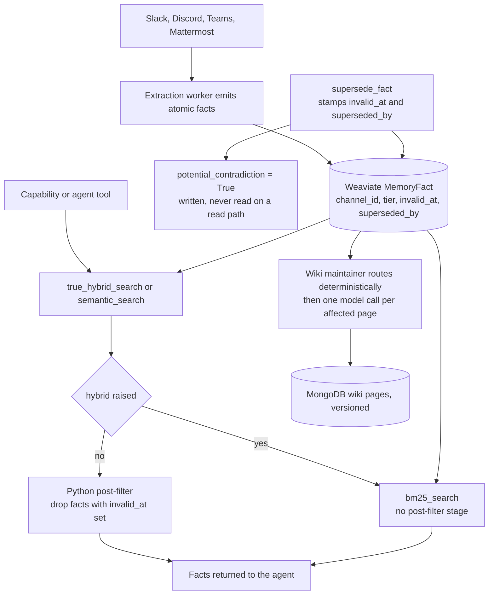

## 1. Executive Summary

Beever Atlas is an Apache-2.0 system that turns a team's Slack, Discord, Teams
and Mattermost conversations into a wiki that maintains itself — 96,884 lines of
Python across 284 source files, 389 test files and 3,639 test functions, 680
commits since April 2026, with Weaviate for facts, MongoDB for pages and a graph
store behind both.

Three marks. Facts are scoped to a channel by a filter compiled into every query,
a superseded fact is stamped rather than deleted and dropped from the default
read, and a committed test pins that exclusion with its control beside it.

The finding is where the exclusion is *not*.

The store cannot express an is-null filter, so the retired-fact check had to move
out of the query and into Python after the fetch. Three of the four retrieval
methods have a post-processing stage and got it: `semantic_search`,
`true_hybrid_search` and `pseudo_hybrid_search`, each with
`include_superseded: bool = False`. The fourth, `bm25_search`, returns objects
straight from the query and never got it.

And `bm25_search` is not a corner. Four call sites reach it, all with the same
shape:

```python
except Exception:
    logger.warning(
        "search_channel_facts: hybrid search failed, falling back to bm25 for channel=%s",
        channel_id,
    )
    facts = await store.bm25_search(...)
```

So the copy of the read path that omits the supersession filter is the one the
system runs when the other one has just failed. A fact the team retired comes
back precisely when retrieval is already degraded, and the only signal is a
warning line about the fallback, which says nothing about what the fallback does
differently.

## 2. Mental Model

Chat goes in; atomic facts come out; a wiki is kept in step with them.

A fact is small and heavily attributed: its text, where it came from — channel,
platform, guild, author, message timestamp, thread — three kinds of tag, a
quality score and an importance, and the pointers that make correction possible:
`valid_at`, `invalid_at`, `superseded_by`, `supersedes`, and
`potential_contradiction`.

The wiki is downstream. When new facts land, a maintainer routes them to the
pages they affect *deterministically* — cluster id to topic page, entity tags to
entity pages, fact type to role pages, with no model call in the routing — then
debounces, then makes one model call per affected page that rewrites only the
affected sections. Title, slug and untouched sections are preserved
byte-identical, which the module gives as the reason: so the page's voice does not
drift with every rewrite.

## 3. Architecture



## 4. Essential Implementation Paths

- **Scope.** Every query method builds
  `Filter.by_property("channel_id").equal(channel_id)` conjoined with a tier
  filter before running — the paginated list, the count, both hybrids, the
  semantic search and the keyword search
  (`stores/weaviate_store.py:529`, `:625`, `:882`, `:927`, `:987`).
- **Supersede.** `supersede_fact` sets `invalid_at` to now and `superseded_by` to
  the successor's id on the old fact, and sets `potential_contradiction=True`
  where a conflict was detected (`:1108-1150`).
- **Exclude.** Each of the three post-processing methods loops the results and
  skips a fact whose `invalid_at` is set unless the caller asked otherwise
  (`:904`, `:1012`, `:1087`).
- **Fall back.** Four sites wrap the hybrid call in `try/except Exception` and
  call `bm25_search` on failure (`capabilities/memory.py:196`, `:303`, `:398`,
  `agents/tools/memory_tools.py:185`).
- **Maintain.** `plan_updates` routes fact ids to page ids with no model call,
  adds the pairs to an in-memory dirty set, debounces for sixty seconds, then
  calls `apply_update` once per page (`services/wiki_maintainer.py`).

## 5. Memory Data Model

`AtomicFact` carries the correction vocabulary in full: a validity pair, both
supersession directions, and a contradiction flag. Three observations about it.

**The stamp is a boolean in practice.** The exclusion tests `fact.invalid_at is
not None` rather than comparing it to the clock, so a fact invalidated with a
future timestamp is withheld from the moment the stamp is written rather than
from the moment it names. That makes `invalid_at` a retirement marker that
happens to carry a date, not a validity bound — which is why `bitemporal` is
withheld despite the field pair being present. There is no as-of read: `valid_at`
is filterable as a range on the paginated list, `invalid_at` is not consulted
there at all, and nothing resolves what a fact said at an earlier time.

**`potential_contradiction` is written and never read.** The supersede path sets
it, several construction sites initialise it to `False`, the store schema
declares it, and no retrieval path filters or ranks on it. The material for a
"this pair disagrees" surface exists and nothing consumes it.

**Supersession keeps the old row.** Nothing is deleted, and `superseded_by` names
the successor, so the history is intact in the store even though no read path
walks it. `tombstone` is withheld because nothing is keyed on the retired
content — the same sentence extracted again from a later message is a new fact
with no relationship to the one it repeats.

## 6. Retrieval Mechanics

Four methods, one collection, and the difference between them is the whole
report.

The scope filter is in the query on all four, which is the right place: a fact
from another channel is never read into the process. The supersession filter is
in Python on three, and the reason is documented by a test rather than by a
comment — `test_true_hybrid_search_no_is_none_filter` serialises the filter that
would be sent and asserts the string `is_none` does not appear in it. The store
could not answer "where invalid_at is null", so the check moved to the caller's
side of the network.

That placement has a cost the code does not mention. A retired fact still matches
the query, still occupies one of the `limit` slots Weaviate returns, and is
discarded afterwards — so a topic with many superseded facts returns fewer live
ones than the caller asked for, silently. Filtering after a top-k is always this
trade; it is worth naming because the supersession feature's whole purpose is to
keep retired material out of an answer.

And `bm25_search` has no post-fetch stage at all. It builds its filter, runs the
query, maps the objects and returns. There is no `include_superseded` parameter
to pass and no loop to add the check to, which is exactly how the omission
survived review: the method is four lines of filter and one return, and nothing
about it looks unfinished.

## 7. Write Mechanics

The wiki maintainer is the best-designed piece here and deserves reading on its
own terms.

Routing is deterministic and the module says so twice — cluster id to topic page,
entity tags to entity pages, fact type to role pages, **no model call in the
routing step**. Only the rewrite calls a model, once per affected page, and only
the affected sections are rewritten; title, slug and everything untouched are
preserved byte-identical so the page's voice does not drift.

Debouncing is explained in the same register: a burst of N extraction events
touching one page within the sixty-second window collapses into a single rewrite
carrying all N events' fact ids, so the maintainer does not issue a model call
per event.

And then the durability paragraph, which is the kind of thing most projects leave
out:

> Persistence: the dirty-set is in-memory only. If the maintainer process crashes
> mid-debounce window, pending updates are lost. Worst-case loss is one debounce
> window (default 60s) of pending rewrites; the next extraction event for the
> affected pages re-routes them to a fresh dirty-set. The `on_extraction_done`
> event itself is not durable (out of scope).

A named gap with a stated bound and the recovery behaviour is worth more than a
durable queue nobody tested.

## 8. Agent Integration

An MCP server, a chat bot, a web front end, and a Google ADK agent layer whose
memory tools are the fourth caller of the unfiltered fallback. The capability
layer wraps the store, and the three functions an agent reaches most directly —
`search_channel_facts`, `search_media_references`, `get_recent_activity` — each
carry their own copy of the same try/except fallback.

Four copies of one fallback, none of which re-applies the filter the path it fell
back from applies by default. This atlas has [written about that shape
separately][second-copy], and the note's advice is the diagnosis here: ask which
copy the failure path reads. In this system the failure path *is* the copy without
the rule.

## 9. Reliability, Safety, and Trust

The scope boundary is solid and uniform. Every read filters on channel and tier
in the query; there is no unscoped branch, no nullable owner, and no admin path
in the store interface. It is a workspace boundary rather than an authenticated
one — the caller says which channel, and the store enforces consistency with what
it was told — which is the ordinary arrangement for a system whose authentication
lives at the connector.

The supersession boundary is not uniform, and the gap is narrow, specific and
reachable:

- `semantic_search`, `true_hybrid_search`, `pseudo_hybrid_search`: retired facts
  dropped by default, tested.
- `bm25_search`: retired facts returned, no parameter, no test.
- Reached by: four `except Exception` fallbacks in the capability and agent-tool
  layers.

Nothing here is careless. The Python-side filter exists for a real store
limitation, the regression test that pins it is well written, and the method that
lacks it is the one with no place to put it. That combination — a rule that must
be applied by hand, in a language-side loop, on every method that returns facts —
is precisely the condition under which a fourth method gets written without it.

`audit_log` is withheld. Wiki pages are versioned with archived snapshots and a
version number, which is a history of the *document*; there is no append-only
record of fact mutations, and the supersede operation updates the old row in
place rather than appending an event.

## 10. Tests, Evals, and Benchmarks

389 test files and 3,639 test functions; nothing was run here. The suite is
structured around named regressions, and the nullstate file is a good example of
the form: it states the rule in its docstring, asserts the negative property
about what must not reach the store, and asserts the behaviour that the
workaround has to preserve.

The exclusion pair is a proper negative eval — two facts, one retired, a default
call asserting one result and its identity, and the same call with the flag
flipped asserting two. An empty store fails the second assertion rather than
satisfying the first.

What is missing is a test at the level where the gap lives. Both cases test the
store methods directly; neither exercises a capability function, and no test
drives the `except Exception` branch to see what the fallback returns. A test that
made the hybrid raise and asserted the fallback's result still excluded retired
facts would have caught this before it shipped.

No benchmark and no retrieval eval.

## 11. For Your Own Build

- **A rule that cannot live in the query will be missed by a method that has no
  loop.** If a store forces a filter into application code, put the filter in one
  helper that every read must pass its results through, and make the raw query
  private. Three correct copies and one missing one is the predictable outcome of
  a convention.
- **Check what your fallback does differently.** A degraded path is written under
  pressure to return *something*; it is the least likely code to re-apply a rule
  and the most likely to run when a system is already unwell.
- **Filtering after a top-k silently shrinks the answer.** If retired material is
  common, the caller asking for ten gets fewer than ten and is not told. Either
  over-fetch deliberately or say so in the result.
- **Compare a timestamp to the clock, or store a boolean.** Testing
  `invalid_at is not None` gives a field that looks temporal and behaves as a
  flag, which will surprise the first person who writes a future-dated
  invalidation.
- **Route deterministically, then call the model once.** The maintainer's split —
  no model in the routing, one model call per affected page, unaffected sections
  preserved byte-identical — is the shape that keeps a self-maintaining document
  from drifting in voice and cost.
- **Name the durability gap and bound it.** "In-memory only; worst case one
  sixty-second window; the next event re-routes" is more useful than silence and
  more honest than a queue that was never exercised.

## 12. Open Questions

- Is `bm25_search`'s omission intended — a deliberate "keyword search sees
  everything" — or the gap it appears to be? No comment or test addresses it
  either way.
- `potential_contradiction` is written by the supersede path and read nowhere. Is
  a contradiction surface planned, or is the flag a leftover?
- With `invalid_at` tested for presence, is a future-dated invalidation a case the
  system intends to support?

## Appendix: File Index

- Model: `src/beever_atlas/models/domain.py:13-90` (`AtomicFact`, with the
  validity pair, supersession pointers and contradiction flag at 74-78).
- Store: `src/beever_atlas/stores/weaviate_store.py` — `list_facts` (516-582),
  `bm25_search` (916-944), `semantic_search` (858-914), `true_hybrid_search`
  (946-1032), `pseudo_hybrid_search` (1035-1106), `supersede_fact` (1108-1150).
- Fallback call sites: `src/beever_atlas/capabilities/memory.py:190-198`,
  `:296-305`, `:392-400`; `src/beever_atlas/agents/tools/memory_tools.py:178-187`.
- Maintainer: `src/beever_atlas/services/wiki_maintainer.py:1-40` (the flow and
  the durability paragraph).
- Tests: `tests/agents/tools/test_hybrid_no_nullstate_filter.py:1-210`,
  `tests/test_true_hybrid_search.py`, `tests/unit/test_contradiction_deferral.py`.

**Searches recorded for the negative claims**

```sh
grep -rn "include_superseded" src --include='*.py'          # declared and used only inside weaviate_store; no caller passes it
grep -rn "bm25_search" src --include='*.py' | grep -v "def " # 4 call sites, every one inside an except Exception
grep -rn "potential_contradiction" src --include='*.py'      # written by supersede_fact, initialised elsewhere, read by no retrieval path
grep -rn "invalid_at" src --include='*.py' | grep -v weaviate_store   # nothing outside the store consults it
grep -rn "as_of\|asof\|point_in_time" src --include='*.py'   # 0 — no as-of read
```

## History

**2026-09-17** — [`7d791af27ef4aa19644cb385c7ca24619bc4f848`](https://github.com/Beever-AI/beever-atlas/commit/7d791af27ef4aa19644cb385c7ca24619bc4f848)
— first reading, at the head of `main`, 680 commits in. Screened with
`scripts/screen_repo.py` first: two auto-run surfaces (`.mcp.json` and a
`server.json` MCP manifest), three build-time execution paths including a
`Makefile` default target and two pytest `conftest.py` collection hooks, two
unpinned dependency surfaces, and three lockfiles unchanged for 77 days so
nothing inside the cooldown. Nothing was installed, built or run — no uv, no
pytest, no Docker, no store started. Three marks. `bitemporal` is withheld with
the field pair present: `invalid_at` is tested for presence rather than against a
clock, so it retires a fact at stamp time rather than at the time it names, and
nothing reads the store as of an earlier moment. `tombstone` is withheld because
nothing is keyed on the retired content. `audit_log` is withheld because wiki
versions are a history of the document while a fact's supersession updates the row
in place. `human_review` is absent. The supersession exclusion is awarded as
`trust_state` on the default of three retrieval methods, with the fourth —
`bm25_search`, reached by four `except Exception` fallbacks — named as the path
that does not carry it.

[second-copy]: https://github.com/neoneye/agent-memory-atlas/blob/main/notes/2026-09-16-the-second-copy-of-the-rule.md
