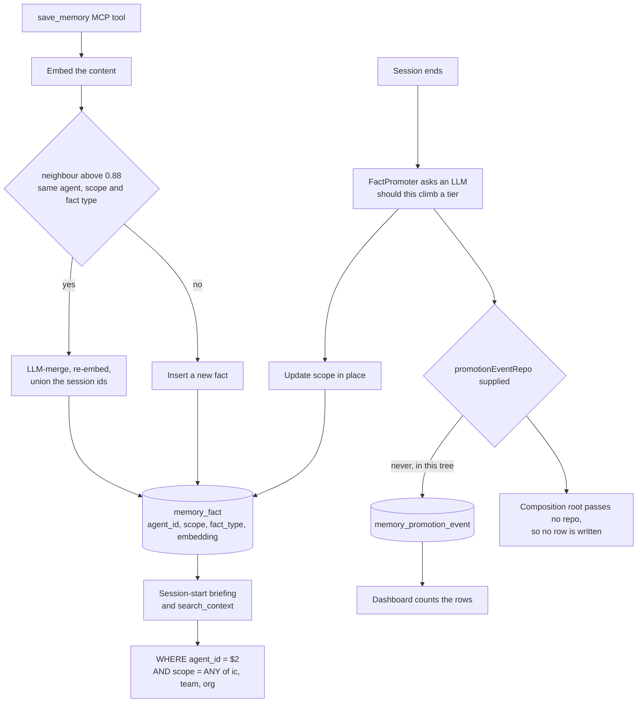

## 1. Executive Summary

Beevibe is an Apache-2.0 workspace where a company's people and agents work in
the same surface — 97,416 lines of TypeScript across six packages, 183 commits
since April 2026, roughly 2,017 test cases. Agents hold lasting roles, accumulate
their own memory, negotiate with each other under a round cap, and escalate to a
person when they cannot agree.

One mark. `agent_id` is a hard predicate on every read of the fact table, in
parameterised SQL with no branch that omits it.

Two things sit either side of that, and reading them together is the point of
this report.

The first is a migration that **deletes four columns**. `confidence`,
`valid_from`, `tags` and `metadata` were in the original schema; a later
migration removes them with the finding stated plainly — *"unused in M3's
agent-driven memory design. No caller populates them or reads them."* That is the
correct and rare response to a field with no producer, and this corpus mostly
documents the opposite.

The second is a table that **nothing writes**. `memory_promotion_event` has its
own migration, whose comment explains that the promoter's decision *"silently
updates memory_fact.scope (or skips when rejected)"* and that the table exists so
the Promotions page can surface the LLM's reasoning, with a row for promoted and
rejected alike. There is a Postgres adapter for it. There is an API view that
runs `SELECT COUNT(*) FROM memory_promotion_event` for an agent's dashboard. And
the only code that writes a row is guarded by an optional dependency:

```ts
promotionEventRepo?: MemoryPromotionEventRepository;
```

The single composition root constructs the memory agent as
`createMemoryAgent({ agentId, coreMemory, factStore, promoter, embed })`. The
repository is not among those arguments, and no other factory supplies it. The
audit rows are never written, so the dashboard's promotion count is structurally
zero.

Same repository, same quarter: one dead field removed on the evidence that nobody
reads it, and one dead table shipped with a reader and no writer. The difference
between them is which end of the wire was missing.

## 2. Mental Model

An agent owns its memory. That is the whole boundary, and it is enforced rather
than assumed: every query against `memory_fact` names an agent.

Over that sits a three-tier `scope` — `ic`, `team`, `org` — and the natural
reading is that it controls sharing. It does not, at this pin. The column records
*the tier of the agent that saved the fact*: an IC agent's facts start at `ic`, a
team agent's at `team`. The briefing path then asks for all three scopes on every
call, and binds the reading agent's own id. So a fact promoted from `ic` to
`team` is still returned only to the agent that owns it.

What the scope does change is the dedup universe on the write, and that part is
deliberate and documented:

> a team agent saving something near-identical to an existing `ic` fact creates a
> fresh `team` row rather than merging across scopes — the two facts live in
> different conceptual universes (one is IC-private, the other is team-wide
> knowledge).

Knowledge does move between agents here — but through the mesh, by one agent
asking another, not by one agent reading another's rows.

## 3. Architecture



## 4. Essential Implementation Paths

- **Write.** `FactStore.addOrMerge` embeds the content and searches for one
  neighbour above `SIMILARITY_MERGE_THRESHOLD = 0.88`, constrained to the same
  agent, the same single scope and the same fact type. A hit is merged by an LLM
  into one sentence, re-embedded, and written back over the existing row with the
  union of session ids; a miss inserts
  (`packages/core/src/services/memory/fact-store.ts:50-97`).
- **Read.** `searchByVector` — `WHERE agent_id = $2 AND scope = ANY($3::text[])`,
  an optional fact-type filter, a minimum similarity, ordered by cosine distance
  and capped (`packages/core/src/adapters/postgres/memory-fact-repo.ts:109-128`).
- **Brief.** One `searchFacts` closure serves both the session-start briefing and
  the mid-session `search_context` tool, so *"the agent should see the same
  retrieval shape whether the query is session-start intent or a mid-session
  search_context call"* (`memory-agent.ts:107-121`).
- **Promote.** `onTaskComplete` lists the facts touched in the session by
  `source_session_ids`, asks the promoter about each one sequentially — *"because
  `promoter.evaluate` is an LLM call and we want serialized rate-limit
  behavior"* — and batches the audit writes after the loop so they do not extend
  the LLM-bound tail (`memory-agent.ts:141-175`).

## 5. Memory Data Model

`memory_fact` today is: `id`, `agent_id`, `scope` with a CHECK on the three
values, `fact_type` with a CHECK on five, `content`, a `VECTOR(1536)`,
`source_session_ids`, and `created_at`.

The five fact types — `belief`, `pattern`, `gotcha`, `preference`, `decision` —
are a genre assigned at write time by the saving agent, not a status. Nothing
reads `fact_type` to decide whether a fact may be believed; it narrows the dedup
neighbourhood and can filter a search. That is why `trust_state` is withheld, and
in this case the withholding is easy to check, because the field that would have
carried a trust signal is gone: the trim migration dropped `confidence` outright.

Dropping it was right on the evidence the migration gives — nobody wrote it,
nobody read it — and it leaves the memory with no way to say a fact is doubted.
The system's answer to a wrong fact is to save a near-identical better one and
let the merge overwrite the content, which works when the new phrasing lands
above 0.88 cosine and does nothing when it does not.

`bitemporal` is withheld for the same reason and more simply: `valid_from` was
one of the four dropped columns, so the single remaining timestamp is
`created_at`. `tombstone` is withheld because a merge rewrites a row in place and
nothing is keyed on what the row used to say.

## 6. Retrieval Mechanics

One query, one shape, two callers. The recall floor and the per-briefing cap are
applied identically to the session-start bundle and to on-demand search, which is
a small consistency most systems in this corpus do not bother with — an agent
that gets a different retrieval shape depending on when it asks has to reason
about two behaviours.

`prepareCoreOnly` is the interesting variant. For a surface with no intent yet —
a human opening an MCP session before saying anything — it returns the core
memory blocks and *no* archival half, skipping the embedding call and the vector
query entirely, because *"there's no signal to query against, so any retrieval
would be noise."* The test locks that in by asserting the embed service and the
fact store were never called, with a comment saying the wasted work is the point
of the method. Declining to retrieve, on the ground that a query against a
placeholder intent returns noise, is a judgement worth naming.

## 7. Write Mechanics

The merge threshold carries its reasoning: 0.88 on `text-embedding-3-small` with
normalised cosine is described as *"empirically a safe 'these are the same fact
phrased differently' floor"*. Above it, an LLM is asked to merge the two
observations into one sentence preserving every concrete specific from both, at
temperature 0.2.

That is a lossy operation performed by a model on the system's own memory, and
the only guard on it is the threshold plus the prompt. There is no record of the
pre-merge text — the update overwrites `content` — so a merge that drops a
specific is unrecoverable and invisible. The union of `source_session_ids` is
kept, so provenance survives even when the wording does not.

Promotion is an in-place `UPDATE memory_fact SET scope`. The decision comes from
an LLM per fact, per session, and this is where the missing audit bites hardest:
the promoter's reasoning exists only in the model's response, the row records
only the outcome, and the table built to hold the reasoning is never written. The
migration comment describes the status quo it was meant to fix — the decision
*"silently updates memory_fact.scope (or skips when rejected)"* — and at this pin
that is still what happens.

## 8. Agent Integration

Memory reaches agents through MCP tools — `save_memory`, `update_core_memory`,
`search_context` — with core-memory blocks rendered into the system prompt and
archival hits into an `<archival_memory>` envelope. The envelope is always
returned even when empty, *"so the tool consumer has a predictable shape"*, which
is the right call for a tool result an agent has to parse.

The surrounding system is the more distinctive part. Agents negotiate with one
another over a bounded number of rounds — `agent.max_negotiation_rounds`,
defaulting to five in code — and a negotiation that exhausts its rounds becomes an
`escalation` row handed to a person, whose resolution is written into
`task.next_dispatch_context` for the next dispatch to read. A cap that converts a
disagreement into a human decision rather than another round is a good pattern,
and it is about work rather than memory: no person reviews a memory fact, which
is why `human_review` is withheld.

## 9. Reliability, Safety, and Trust

The scope predicate is genuinely unconditional, which is worth stating because
this atlas has read many systems where the owner filter is a nullable parameter
that vanishes when nobody passes it. Here both query sites take a required
`agent_id` and interpolate it as a bound parameter. There is no admin path, no
`if (agentId)` guard, and no unfiltered enumeration in the repository interface.

The weakness is on the other column. Because the briefing always requests all
three scopes, `scope` is not a read filter at all in the path that feeds an
agent; it is a label plus a dedup partition. A reader who sees `ic | team | org`
in a schema and an `idx_memory_fact_agent_scope` index will reasonably assume a
visibility ladder, and the code does not implement one. Nothing is leaked by
this — the agent boundary holds — but the promotion machinery, which costs an LLM
call per fact per session, currently buys a change of label and a change of which
future facts will merge into it.

`audit_log` is withheld on the wiring rather than on an absence, and the shape is
worth recording precisely because so much of it exists:

- the migration, with a comment explaining why the table is needed;
- `packages/core/src/adapters/postgres/promotion-event-repo.ts`, the writer;
- `packages/api/src/views/agents.ts:179`, which counts its rows for the dashboard;
- `MemoryAgentDeps.promotionEventRepo?`, optional;
- `packages/core/src/composition.ts:84-85`, the one factory, which does not pass it.

Four of the five parts are built. The fifth is a missing argument in a single
constructor call. A grep for the property name across the repository returns the
declaration and the use, and nothing else.

Set against the trim migration, this is the same project applying opposite
diligence to the two halves of a dead path — and the reason the trim was easy to
spot is that a column with no reader shows up in a schema review, while a
constructor argument that was never added shows up nowhere.

## 10. Tests, Evals, and Benchmarks

Roughly 2,017 test cases across the packages; nothing was run here. The memory
tests are close to the code and property-named: the fact store has cases for
creating below threshold, stamping the caller's scope, merging with re-embed and
session-id union, deduping a repeated session id, trimming the LLM's whitespace,
and `updateScope` touching only the scope.

`negative_eval` is withheld. The must-not assertions here are about work not done
and writes refused — `expect(embed.embed).not.toHaveBeenCalled()` on the
core-only path, `expect(calls).toHaveLength(0)` for an empty content or an
unknown fact type — and both have positive controls in their own cases. Neither
asserts that particular material must not be *retrieved*, and there is no test in
which one agent queries and another agent's fact is asserted absent, which is the
case the scope predicate most wants pinned.

No benchmark and no retrieval eval. The one empirical number in the memory path
is the 0.88 merge threshold, described as empirical without the measurement
attached.

## 11. For Your Own Build

- **Delete the column nobody reads, and check the other direction too.** The trim
  migration is exactly right. Run the same audit from the reader's end: a table
  with a query and no insert is the same defect wearing the opposite mask, and it
  is harder to see because the schema looks fine.
- **An optional dependency is a feature flag you forgot to name.** `repo?:` with
  `if (repo)` around the write reads as defensive and behaves as off. If the audit
  is meant to be on, make the argument required and let the type checker find the
  call site.
- **Name the scope after what it does.** `ic | team | org` beside an index on
  `(agent_id, scope)` reads as a visibility ladder. If it is a tier label and a
  dedup partition, the name and the docstring are the only things standing
  between a future reader and a wrong assumption about who can see what.
- **Keep what a merge overwrites, or accept that it is gone.** An LLM merge at
  0.88 similarity rewrites a stored memory with no record of the prior text. The
  union of source ids preserves where it came from; nothing preserves what it
  said.
- **Declining to retrieve is a legitimate answer.** Skipping the embed and the
  vector query when there is no intent to query against — and testing that the
  calls did not happen — is cheaper and more honest than retrieving against a
  placeholder.

## 12. Open Questions

- Is the promotion audit meant to be on? Everything but the constructor argument
  is built, and the dashboard already counts the rows.
- Should a promoted fact become visible to other agents in its tier, or is the
  mesh the only intended path between agents? The schema suggests the first and
  the code implements the second.
- With `confidence` dropped, what is the intended correction path for a fact that
  turns out to be wrong but does not re-save close enough to merge?

## Appendix: File Index

- Schema: `migrations/1776391747576_initial-schema.sql:144-161` (`memory_fact`),
  `migrations/1777000000000_trim-memory-fact.sql` (the four dropped columns),
  `migrations/1778200000000_add-memory-promotion-event.sql`.
- Repository: `packages/core/src/ports/memory-fact-repo.ts`,
  `packages/core/src/adapters/postgres/memory-fact-repo.ts:109-155`.
- Services: `packages/core/src/services/memory/fact-store.ts:16-114`,
  `memory-agent.ts:53-176`, `fact-promoter.ts`.
- Wiring: `packages/core/src/composition.ts:75-87`.
- Audit adapter and reader:
  `packages/core/src/adapters/postgres/promotion-event-repo.ts`,
  `packages/api/src/views/agents.ts:160-182`.
- Tools: `packages/api/src/tools/save-memory.ts`, `update-core-memory.ts`.
- Negotiation and escalation:
  `migrations/1777900000000_add-negotiation-escalation-tables.sql`.
- Tests: `packages/core/src/services/memory/fact-store.test.ts`,
  `memory-agent.test.ts:210-229`, `packages/api/src/tools/save-memory.test.ts:70-97`.

**Searches recorded for the negative claims**

```sh
grep -rn "promotionEventRepo" packages --include='*.ts' | grep -v '\.test\.'   # 2: the optional declaration and its guarded use
grep -rn "createMemoryAgent" packages --include='*.ts' | grep -v '\.test\.'    # one factory, no promotionEventRepo argument
grep -rn "searchByVector" packages --include='*.ts' | grep -v '\.test\.|ports/|adapters/'   # 2 call sites, both supply agent_id
grep -rn "confidence" migrations/*.sql                                        # added in the initial schema, dropped by the trim
grep -rn "not.toContain\|toHaveLength(0)" packages/core/src/services/memory packages/api/src/tools   # work-avoided and write-refused, no retrieval exclusion
```

## History

**2026-09-17** — [`81530ccae3519738b16a2b5d4aa81a61989a4ce8`](https://github.com/beevibe-ai/beevibe/commit/81530ccae3519738b16a2b5d4aa81a61989a4ce8)
— first reading, at the head of `main`, 183 commits in. Screened with
`scripts/screen_repo.py` first: one auto-run surface, no build-time execution
path, seven package manifests declaring floating ranges with no lockfile beside
them, a root `pnpm-lock.yaml` unchanged for 37 days, and `CLAUDE.md` read as
data. Nothing was installed, built or run — no pnpm, no vitest, no database
started, and the committed `docker-compose.yml` files were read as text. One
mark. `trust_state` is withheld with the field's removal on record: `confidence`
was in the first schema and a later migration dropped it as unpopulated and
unread, leaving `fact_type` — a write-time genre — as the only categorical column.
`bitemporal` is withheld because `valid_from` was dropped in the same migration.
`tombstone` is withheld because a merge overwrites a row in place with nothing
keyed on the prior content. `human_review` is withheld because the escalation
path adjudicates stuck work, not memory claims. `audit_log` is withheld on the
wiring: the table, its adapter and a dashboard counter exist, and the only writer
is behind an optional dependency the single composition root does not pass.
