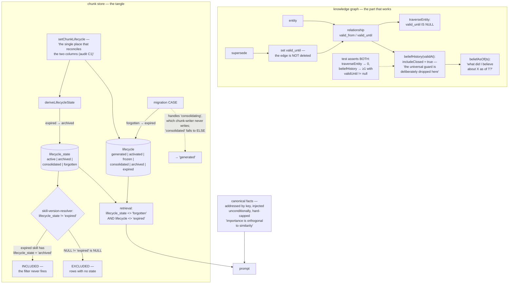

## 1. Executive Summary

BitterBot Desktop is a local-first personal agent — MIT, Node ≥ 22, version
2026.2.15, 740,633 lines of TypeScript across 1,382 test files, of which
127,873 lines and 156 test files are memory. It pitches "biological memory, a
dream engine, and a P2P skills economy," and unlike most projects that reach
for that vocabulary, the biology is implemented rather than gestured at:
`synaptic-tagging.ts`, `reconsolidation.ts`, `spacing-effect.ts`,
`somatic-markers.ts`, `hormonal.ts`, `mood-congruent-boost.ts`, each with a
citation and a mechanism.

Several of those files announce themselves as the "FIRST IMPLEMENTATION in any
agent memory system." That claim is not assessed here; the mechanisms are.

Two things in it are genuinely well built.

The first is the belief layer on the knowledge graph. Relationships carry
`valid_from` and `valid_until` — a valid-time interval distinct from the
`created_at` the rows are ordered by — and supersession closes the interval
rather than deleting the edge. `beliefHistory(entityId, { validAt })`
deliberately drops the active-only guard that every other read applies, with
the comment explaining why: so callers can "answer 'what did I believe about X
as of T?'". The test asserts both halves — a closed edge is absent from ordinary
traversal and present in the history — which is what makes it an eval rather
than a demo.

The second is the canonical facts ledger, and its reasoning is worth quoting
because it identifies a failure mode most retrieval-gated stores have and
nobody names: "importance is orthogonal to similarity: a canonical fact is
short, low-entropy, and shares no embedding mass with a cold conversation's
first message." So the ledger is addressed by key, injected unconditionally,
hard-capped, and demoted by a deterministic score — "never an LLM prose
decision."

The finding is in the other column.

`chunks` carries two lifecycle fields, `lifecycle_state` and the newer
`lifecycle`. The code knows this: `chunk-writer.ts:44` heads the section "the
tangled cluster the audit's C1 bug lived in", and `setChunkLifecycle` is
documented as "the single place that reconciles the two columns (audit C1)."
The write side is genuinely fixed.

The read side is not. `skill-version-resolver.ts` filters both of its version
queries with `AND lifecycle_state != 'expired'` — and `expired` is not a value
`lifecycle_state` ever holds. `deriveLifecycleState` maps the `expired`
lifecycle to the `archived` state, so an expired skill has
`lifecycle_state = 'archived'`, which satisfies `!= 'expired'` and is returned
as a live version. Worse, SQL's three-valued logic means a row whose
`lifecycle_state` is NULL — the column was added by migration — fails the
predicate and is excluded. The filter admits exactly what it means to reject
and rejects rows it has no opinion about.

And the two mappings are not inverses. The migration maps
`lifecycle_state = 'forgotten'` to `lifecycle = 'expired'`;
`deriveLifecycleState` maps `expired` back to `archived`. A forgotten chunk
that round-trips becomes an archived one.

## 2. Mental Model

A **chunk** is the base unit: text, embedding, importance, a lifecycle in two
columns, hormonal and somatic scalars, a provenance chain.

A **canonical fact** sits above the chunk store, addressed by key rather than
retrieved, injected into every system prompt, hard-capped.

An **entity** and a **relationship** form the graph. A relationship has a
validity interval; superseding one closes the interval.

A **dream** is a background cycle that consolidates, distils skills, and grades
itself on whether its output later gets used.



## 3. Architecture

| Area | Role |
| --- | --- |
| `src/memory/chunk-writer.ts` | The lifecycle types, the reconciler, access bumping |
| `src/memory/memory-schema.ts` | Tables, indexes, the audit log |
| `src/memory/migrations.ts` | Column additions and the lifecycle CASE |
| `src/memory/canonical-facts.ts` | The key-addressed ledger and its closed op set |
| `src/memory/conflict-resolver.ts` | Supersede-by-similarity before storing |
| `src/memory/knowledge-graph.ts` | Entities, relationships, belief history |
| `src/memory/temporal-filter.ts` | Both bitemporal vocabularies, and the bridge between them |
| `src/memory/consolidation.ts` | Forgetting, merging, and the purge sweep |
| `src/memory/dream-*.ts` | The dream engine, its oscillator, and its self-evaluator |
| `src/memory/synaptic-tagging.ts`, `reconsolidation.ts`, `spacing-effect.ts`, `hormonal.ts`, `somatic-markers.ts` | The biological strengthening machinery |

## 4. Essential Implementation Paths

`chunk-writer.ts:44-108`, then `migrations.ts:56-76`, then
`skill-version-resolver.ts:250-260`. Read them in that order and the whole
finding assembles itself: the types, the forward mapping, the reverse mapping,
and the filter that uses a value from the wrong vocabulary.

`knowledge-graph.ts:495-567` for the belief layer, which is the part to copy.

`canonical-facts.ts:1-25` for the clearest statement in this corpus of why a
purely similarity-gated store loses its most important facts.

## 5. Memory Data Model

The `chunks` table starts small — id, path, source, line span, hash, model,
text, embedding, updated_at — and grows by migration into something much wider:
importance, lifecycle, lifecycle_state, parent_id, version, hygiene_done,
memory_type, semantic_type, hormonal scalars, `governance_json`,
`provenance_chain`, `created_at`, `last_consolidated_at`, `valid_time_start`,
`valid_time_end`, `transaction_time`, `stable_skill_id`, `skill_version`,
`deprecated`, `lineage_hash`, `peer_origin`.

That accretion is where the report's finding lives. Two of those columns encode
the same concept with different vocabularies, and the project knows it — the
reconciler exists precisely because of an audit finding labelled C1. What the
reconciler cannot fix is a query written against the wrong vocabulary, because
nothing type-checks a SQL string literal.

The two exported `LifecycleState` types make this concrete.
`chunk-writer.ts:46` declares `"active" | "archived" | "consolidated" |
"forgotten"`. `memcube.ts:10` declares `"active" | "consolidating" |
"archived" | "forgotten"`. Same name, different fourth member. The migration's
CASE has a branch for `lifecycle_state = 'consolidating'` — the `memcube`
spelling — and none for `consolidated`, so a chunk the writer marked
`consolidated` falls through to `ELSE 'generated'` and is migrated as though it
were freshly generated, losing the fact that it had already been consolidated.

Canonical facts are a separate, much tidier table: key, value, statement,
category, confidence, `first_seen_at`, `last_confirmed_at`, `valid_from`,
`valid_until`, source, evidence, status. `canonical_conflicts` holds one
unconsumed row per key recording a rejected proposal — its own comment explains
the cap: "a dream-cycle promotion retrying the same rejected pin every cycle
must not grow the table without bound."

That conflict row is close to a tombstone and is not one. It is keyed on the
fact's key, deduplicated on the key rather than the value, and exists to be
"swept into a user-facing question" — nothing on the write path consults it to
refuse a re-proposal, so the same rejected value can be re-asserted once the row
is consumed.

## 6. Retrieval Mechanics

Hybrid vector and lexical retrieval fused by reciprocal rank, with graph
expansion, a query planner, recency and mood-congruent boosts, and a retrieval
trace for diagnosis. The retrieval filter is written correctly, checking both
columns and both NULL cases:

```
AND (lifecycle_state IS NULL OR lifecycle_state <> 'forgotten')
AND (lifecycle IS NULL OR lifecycle <> 'expired')
```

That is the right pattern, and it is what makes the skill resolver's version of
the same idea stand out as a slip rather than a misunderstanding.

The chunk-vocabulary bitemporal helpers are the other loose end.
`buildTemporalWhereClause` and `currentFactsOnly` are exported, documented and
tested, and nothing in `src` calls them — `conflict-resolver.ts:57` writes its
own `valid_time_end IS NULL` inline instead. So chunks are maintained
bitemporally on write and there is no chunk read that takes an as-of. The
helper also has a trap for whoever wires it up first: `validAt` does not imply
`excludeSuperseded: false`, so `buildTemporalWhereClause({ validAt: t })`
emits `valid_time_end IS NULL` alongside the interval conditions and silently
degrades a point-in-time query to a current-facts query.

The relationship variant has none of these problems, and its doc comment is
explicit about why it exists rather than parameterising the column names:
"`buildTemporalWhereClause` above is hardcoded to the chunks vocabulary and its
callers depend on that, so we do NOT parameterize column names there. This
sibling is the single explicit bridge for the relationships vocabulary."

## 7. Write Mechanics

The conflict resolver runs before a fact is stored: cosine above 0.95 is a
no-op, above 0.85 supersedes the old chunk by setting `valid_time_end`, below
that is a new fact. No extra LLM call, and the old row survives.

The canonical ledger's op set is closed — ADD, STRENGTHEN, SUPERSEDE, REJECT —
and its invalid-input path is documented as "REJECTED (never a silent partial
write)". When the cap is reached the demotion is score-based, and when it cannot
make room it retires nothing and rejects the ADD, atomically, with a comment
noting that "a rejected write never mutates the ledger".

Consolidation marks chunks `forgotten` and reparents merged ones, logging an
audit row; a later sweep hard-deletes from `chunks_vec`, `chunks_fts` and
`chunks` where `(lifecycle_state = 'forgotten' OR lifecycle = 'expired')` and
the row is older than a threshold. That deletion predicate checks both
vocabularies correctly.

`memory_audit_log` is written by `consolidation.ts`,
`coverage-diagnostics.ts`, `epistemic-directives.ts`, `governance.ts` and
`manager.ts`. It is not written by `chunk-writer.ts` — the module that owns the
single reconciler for lifecycle transitions — so whether a state change is
audited depends on which caller made it. That is the inverse of the pattern
worth having: put the record where the mutation is, not in each caller.

## 8. Agent Integration

One gateway process on one port serves the Control UI, the agent, and the P2P
orchestrator. Channels include WhatsApp; browser automation is Playwright;
skills are packaged, priced and traded for USDC on a marketplace whose code
sits in the same directory as the memory store.

That last point is a structural observation rather than a criticism:
`src/memory/` contains `bounty-*`, `commerce-*`, `marketplace-*`,
`peer-reputation.ts` and `seller-bond-ledger.ts` alongside `reconsolidation.ts`
and `spacing-effect.ts`. The skills economy is modelled as memory that can be
sold, which is a coherent position, and it means the directory's line count is
not a measure of the memory system alone.

The Control UI shows dreams and skills. No surface there edits or deletes a
memory record, and the epistemic directives ask the user questions in
conversation whose answers return through ordinary extraction — so the person
is a source, not an approver, and `human_review` is withheld.

## 9. Reliability, Safety, and Trust

The graph has three gates — `lineage-gate.ts`, `structural-gate.ts` and
`kg-entity-admission.ts` — and a `governance.ts` recording provenance events.
`provenance_chain` is a column on every chunk.

The honest assessment of the trust layer is that its pieces are individually
sound and collectively unenforced at one point. There is no single place that
decides what is admissible, the way oh-my-hermes routes everything through an
admission state or The Librarian through one apply rule. Here the gates are
per-subsystem, the audit log is per-caller, and the lifecycle is the one
property with a designated reconciler — which is exactly why the lifecycle is
also the property whose remaining bug is findable.

The dream engine grading itself on whether its output is later used
(`dream-evaluator.ts`, `dream-utility.ts`) is a good idea and rare: a
background consolidation process that measures its own value by downstream
retrieval rather than by volume produced.

## 10. Tests, Evals, and Benchmarks

156 memory test files, and a `benchmarks/arc-agi-3/` tree with a Python
memory package. The tests are substantive: `knowledge-graph.sabm.test.ts`
covers contradiction flagging without closing either edge, many-to-many
relations deliberately not flagged, strengthen audit rows, supersession
closing the edge, and the two belief-history assertions that earn
`negative_eval`. `consolidation.purge-expired.test.ts` and
`consolidation.pairwise-cap.test.ts` pin the forgetting path.

The gap is specific and matches the finding. `temporal-filter.rel.test.ts`
tests only the relationship helper; the chunk helper has no test asserting that
`validAt` produces a point-in-time query, which is why the
`excludeSuperseded` interaction survives. And nothing tests
`selectBestVariant` against an expired skill — which is why a filter naming a
value from the wrong column has stayed in two queries.

## 11. For Your Own Build

Take the belief layer. Close an interval instead of deleting a row, keep one
read that deliberately drops the active-only guard, and write the test that
asserts the closed edge is absent from the ordinary read and present in the
history. Those two assertions in one test are what make a temporal store
trustworthy rather than merely temporal.

Take the canonical ledger's premise. If your retrieval is similarity-gated, the
facts that matter most are the ones least likely to match — short, stable,
low-entropy. Address those by key and inject them unconditionally rather than
hoping the embedding finds them.

Do not carry two columns for one concept, even with a reconciler. The
reconciler fixes writes and cannot fix a SQL string, and the failure it leaves
is silent: a predicate naming a value the column never holds is not a type
error, not a runtime error, and not a wrong-looking result — it is a filter that
quietly does nothing. If a migration forces a second column, delete the first in
the same release, or add a CHECK constraint naming the legal values so an
impossible comparison becomes visible.

When you do write such a predicate, write it the way the retrieval query does:
`(col IS NULL OR col <> 'value')`. SQL's three-valued logic turns a bare `!=`
into a silent exclusion of every NULL row, and a column added by migration is
full of them.

Put the audit write where the mutation happens. Five subsystems each remembering
to log is five places one can be forgotten; the chunk writer logging once is
one place it cannot.

## 12. Open Questions

Whether `lifecycle_state` is meant to survive. It is the older of the two
columns, the reconciler keeps it consistent, and the retrieval query still
checks it — but every new value in the vocabulary is on the `lifecycle` side.

Whether `buildTemporalWhereClause` is waiting for a caller or is a leftover. It
is exported, documented and typed; the relationship sibling that does have a
caller was written later and explicitly declined to generalise it.

Whether the "FIRST IMPLEMENTATION in any agent memory system" claims on
`synaptic-tagging.ts` and `epistemic-directives.ts` have been checked against
prior work. They are stated as fact in source comments; no citation of a
priority search accompanies them, and none was attempted here.

## Appendix: File Index

| Path | What to read it for |
| --- | --- |
| `src/memory/chunk-writer.ts:44-108` | Two lifecycle types, one reconciler, and the audit it came from |
| `src/memory/migrations.ts:56-76` | The forward mapping, and the CASE branch for a spelling the writer never emits |
| `src/memory/skill-version-resolver.ts:250-260` | A filter on a value its column never holds |
| `src/memory/knowledge-graph.ts:495-567` | Belief history and as-of, the part worth copying |
| `src/memory/temporal-filter.ts` | Two bitemporal vocabularies, and honesty about why they are not merged |
| `src/memory/canonical-facts.ts:1-25` | Why importance is orthogonal to similarity |
| `src/memory/knowledge-graph.sabm.test.ts` | Both halves of the assertion, in one test |

## History

**2026-09-19** — [`cf9332b1d025d5963480e57655f68986c737aae3`](https://github.com/Bitterbot-AI/bitterbot-desktop/commit/cf9332b1d025d5963480e57655f68986c737aae3) — `trust_state` re-tested against the narrowed line. The mark holds and every finding in this report about the two lifecycle columns still holds at the new pin, re-checked in source: `LifecycleState` is active / archived / consolidated / forgotten and `Lifecycle` is generated / activated / frozen / consolidated / archived / expired (`src/memory/chunk-writer.ts:47-54`); `deriveLifecycleState` still maps an expired lifecycle to the archived state (`:99-101`); `memcube.ts:10` still declares a second `LifecycleState` with `consolidating` where the writer has `consolidated`; and `skill-version-resolver.ts` still filters `lifecycle_state != 'expired'` on both version queries, at `:257` and `:304`. The retrieval path and the purge sweep continue to name each value against the column that holds it (`manager-embedding-ops.ts:1119-1120`, `consolidation.ts:567-576`), which is what the skill resolver does not. `buildTemporalWhereClause` and `currentFactsOnly` still have no caller outside `temporal-filter.ts` itself. The evidence record is rewritten to carry these anchors rather than asserting the filter in prose, and to state the exception beside the mark instead of only in the risks field. Screened again first; nothing was installed and no suite was run.

**2026-09-16** — [`cf9332b1d025d5963480e57655f68986c737aae3`](https://github.com/Bitterbot-AI/bitterbot-desktop/commit/cf9332b1d025d5963480e57655f68986c737aae3) — first reading, at a commit dated 15 September 2026. Screened before opening, from a shallow clone; a dependency surface had changed inside the seven-day cooldown. Nothing was installed, built or run.
