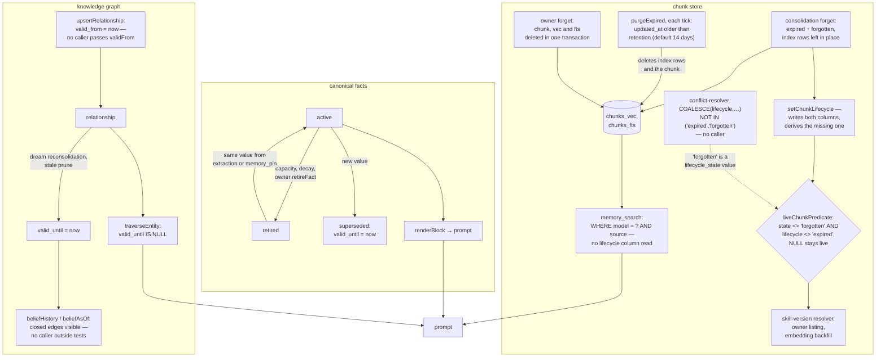

## 1. Executive Summary

BitterBot Desktop is a local-first personal agent whose memory is one SQLite
database under a dream engine, a key-addressed canonical facts ledger and a
knowledge graph. The synaptic tagging, reconsolidation, spacing and hormonal
machinery its README names is implemented in code. The ledger is the part to
take: it injects short, high-importance facts by key because similarity-gated
retrieval loses exactly those. The weakness is that chunk lifecycle filters the
maintenance reads and not the agent's search. The vector and keyword queries
filter on model and source only, so a chunk consolidation forgets stays
retrievable until the purge deletes its index rows
(`src/memory/manager-search.ts:138`, `:283`).

Commit
[`5e5a9e4f913f4b30ad013e6a3a984f19ab19ba5e`](https://github.com/Bitterbot-AI/bitterbot-desktop/commit/5e5a9e4f913f4b30ad013e6a3a984f19ab19ba5e)
(#200, 6 October 2026) is titled "lifecycle column mismatch from the Agent
Memory Atlas review" and names `cf9332b1` in its message. It:

- added `liveChunkPredicate` and rewired the skill-version resolver's two
  queries onto it;
- made `expired` derive `forgotten` instead of `archived`, with migration v72
  to repair stored rows;
- deleted `memcube.ts`, which nothing imported;
- stopped `buildTemporalWhereClause` excluding superseded rows on historical
  reads;
- added a source-scanning test for cross-vocabulary comparisons.

The resolver test seeds the expired variant as the fittest, so it fails against
the old filter.

Two instances of the same defect sit outside the repair. The scanning
test matches `col <op> 'literal'` and not `COALESCE(col, 'x') <op>`, and
`conflict-resolver.ts:56` compares `lifecycle` with `'forgotten'` in exactly
that form. The full-reindex path restores a demoted chunk's `lifecycle` and
lets the state be re-derived, which turns a merge loser's `forgotten` into
`archived` (section 9).

The knowledge graph keeps a belief history and not a valid-time one.
Relationships carry `valid_from` and `valid_until`, supersession closes the
interval instead of deleting the edge, and `beliefAsOf` answers what the graph
believed at a timestamp. But every writer stamps `valid_from` with the insert
time and `valid_until` with the supersession time, so the interval is when the
system held the belief, which is why `bitemporal` is not awarded.

The owner controls added by
[`2e93892231e66691c4bfa26ff1ee1e4c7769a8d5`](https://github.com/Bitterbot-AI/bitterbot-desktop/commit/2e93892231e66691c4bfa26ff1ee1e4c7769a8d5)
(#174) are edit, forget, retire and export after the fact. Forget is a real
delete from the table and both indexes in one transaction. Retire is undone by
the next same-value confirmation, which the agent can issue itself with
`memory_pin`.

## 2. Mental Model

A **chunk** is the base unit: text, embedding, importance, a sensitivity tag, a
lifecycle in two columns, hormonal and somatic scalars, a provenance chain. It
is live while `lifecycle_state` is not `forgotten` and `lifecycle` is not
`expired`. The two columns are not a bijection: a consolidation merge loser is
`lifecycle = 'archived'` with `lifecycle_state = 'forgotten'`. It dies by
consolidation forgetting it, then the purge deleting it, or by the owner
deleting it at once.

A **canonical fact** sits above the chunk store, addressed by key, injected
into every owner turn's system prompt, hard-capped. It is `active`, `retired`
(demoted out of injection, kept queryable) or `superseded` (window closed by a
new value). Retirement is reversible by any tier-1 or tier-2 confirmation of
the same value.

An **entity** and a **relationship** form the graph. A relationship carries the
interval during which the graph held it. Superseding it, or pruning it as
stale, closes the interval.

A **dream** is a background cycle that consolidates, distils skills, closes
contradicted edges, and grades itself on whether its output later gets used.

```mermaid
%% caption: lifecycle is enforced on the maintenance and skill reads through one predicate and reaches search only through index membership; canonical retirement is reversible by a same-value pin; the graph's interval is belief time
flowchart TB
    subgraph CH["chunk store"]
        W["setChunkLifecycle —<br/>writes both columns,<br/>derives the missing one"]
        W --> P{"liveChunkPredicate:<br/>state <> 'forgotten' AND<br/>lifecycle <> 'expired',<br/>NULL stays live"}
        P --> SK["skill-version resolver,<br/>owner listing,<br/>embedding backfill"]
        F["consolidation forget:<br/>expired + forgotten,<br/>index rows left in place"] --> W
        F --> IDX[("chunks_vec,<br/>chunks_fts")]
        IDX --> S["memory_search:<br/>WHERE model = ? AND source —<br/>no lifecycle column read"]
        PG["purgeExpired, each tick:<br/>updated_at older than<br/>retention (default 14 days)"] -->|"deletes index rows<br/>and the chunk"| IDX
        OF["owner forget:<br/>chunk, vec and fts<br/>deleted in one transaction"] --> IDX
        CC["conflict-resolver:<br/>COALESCE(lifecycle,…)<br/>NOT IN ('expired','forgotten')<br/>— no caller"] -.->|"'forgotten' is a<br/>lifecycle_state value"| P
    end
    subgraph CF["canonical facts"]
        A["active"] -->|"capacity, decay,<br/>owner retireFact"| R["retired"]
        R -->|"same value from<br/>extraction or memory_pin"| A
        A -->|"new value"| SUP["superseded:<br/>valid_until = now"]
        A --> BLK["renderBlock → prompt"]
    end
    subgraph KG["knowledge graph"]
        UP["upsertRelationship:<br/>valid_from = now —<br/>no caller passes validFrom"] --> REL["relationship"]
        REL -->|"dream reconsolidation,<br/>stale prune"| CL["valid_until = now"]
        REL --> TR["traverseEntity:<br/>valid_until IS NULL"]
        CL --> BH["beliefHistory / beliefAsOf:<br/>closed edges visible —<br/>no caller outside tests"]
    end
    S --> PROMPT["prompt"]
    BLK --> PROMPT
    TR --> PROMPT
```

## 3. Architecture

| Area | Role |
| --- | --- |
| `src/memory/chunk-writer.ts` | The lifecycle vocabularies, `liveChunkPredicate`, the reconciler, the scoped setters |
| `src/memory/memory-schema.ts` | Tables, indexes, the audit log |
| `src/memory/migrations.ts` | Column additions, the v1 lifecycle CASE, the v65 and v72 repairs |
| `src/memory/manager-search.ts` | The vector KNN and FTS queries |
| `src/memory/canonical-facts.ts` | The key-addressed ledger and its closed op set |
| `src/memory/knowledge-graph.ts` | Entities, relationships, belief history |
| `src/memory/temporal-filter.ts` | Both validity-clause builders, and the bridge between their column names |
| `src/memory/consolidation.ts` | Forgetting, merging, and the purge sweep |
| `src/memory/owner-controls.ts` | The owner's list, edit, forget, export and audit reader |
| `src/memory/guest-access.ts` | The sensitivity filter on non-owner turns |
| `src/memory/reindex-carryover.ts` | What survives a full reindex |
| `src/memory/dream-*.ts`, `src/memory/dream-modes/` | The dream engine, its modes, and its self-evaluator |
| `src/memory/synaptic-tagging.ts`, `reconsolidation.ts`, `spacing-effect.ts`, `hormonal.ts`, `somatic-markers.ts` | The biological strengthening machinery |

### Deployment and ergonomics

One gateway process on one port serves the Control UI, the agent and the P2P
orchestrator, over one SQLite file per agent. Vector search uses sqlite-vec
when it loads and falls back to an in-process cosine scan over every chunk when
it does not (`manager-search.ts:120-200`). Embeddings come from the configured
provider; a provider, model or key change triggers a full reindex, which builds
a fresh database from the memory, session and skill files and then copies every
table it did not rebuild (`manager-sync-ops.ts:1290-1349`). The store is
repairable by hand in the sense that matters: SQLite, `MEMORY.md` and the
memory files are on disk, and the owner can export everything except embeddings
to JSON. Installing runs a `postinstall` that fetches the orchestrator binary
(`scripts/fetch-orchestrator.mjs`).

## 4. Essential Implementation Paths

`chunk-writer.ts:45-167`, then `manager-search.ts:120-140` and `:275-285`, then
`consolidation.ts:226-262` and `:590-612`. In that order: the two vocabularies
and the shared predicate, the search queries that read neither column, the
forget that leaves index rows in place, and the purge that removes them.

`skill-version-resolver.ts:250-310` and `skill-version-resolver.test.ts:219-245`
for the repaired filter and the test that fails against the old one.

`reindex-carryover.ts:71-98` beside `manager-embedding-ops.ts:1045-1060`: the
same demotion restored by two paths, one carrying both columns and one carrying
`lifecycle` alone.

`canonical-facts.ts:1-25` for why a similarity-gated store loses its most
important facts, and `:560-615` for the STRENGTHEN branch that reactivates a
retired fact.

`knowledge-graph.ts:410-470` and `:581-652` for the relationship interval and
the belief-history reads over it.

`owner-controls.ts:209-299` for the owner's forget and edit and where their
audit rows are written.

## 5. Memory Data Model

The `chunks` table starts small: id, path, source, line span, hash, model,
text, embedding, updated_at. Migrations widen it with importance, `lifecycle`,
`lifecycle_state`, parent_id, version, hygiene_done, memory_type,
semantic_type, hormonal scalars, `governance_json` (which carries the
sensitivity tag), `provenance_chain`, `created_at`, `last_consolidated_at`,
`valid_time_start`, `valid_time_end`, `transaction_time`, `stable_skill_id`,
`skill_version`, `deprecated`, `lineage_hash`, `peer_origin`.

Two of those columns encode one concept in two vocabularies, and the module
that owns them says so (`chunk-writer.ts:47-78`). `lifecycle` (generated,
activated, frozen, consolidated, archived, expired) is "the fine-grained state
machine"; `lifecycle_state` (active, archived, consolidated, forgotten) is "the
coarse retrieval gate". `setChunkLifecycle` writes both,
deriving whichever the caller left out: `expired` derives `forgotten`, and
setting only `forgotten` writes `expired` (`:98-167`). Every live writer of
`expired` passes `forgotten` explicitly (`consolidation.ts:233-236`,
`governance.ts:173-176`, `manager.ts:5233-5236`). Migration v72 rewrites stored
`expired` rows to `forgotten` and fills a NULL in either column from the other
(`migrations.ts:2463-2498`). `lifecycle_state` was added with
`DEFAULT 'active'` (`memory-schema.ts:121`), which SQLite applies to existing
rows, and no inserter in `src/` writes NULL to it.

A third mapping sits in `crystal.ts:300-316`: `lifecycleToLegacy` writes
`consolidating` for a consolidated crystal, the spelling migration v1's CASE
reads (`migrations.ts:56-76`). Its only consumer, `crystalToRow`, is called
from a test and nowhere in `src/`.

Canonical facts are a separate table: key, value, statement, category,
confidence, `first_seen_at`, `last_confirmed_at`, `valid_from`,
`valid_until`, `superseded_by`, source, evidence, status. ADD stamps
`first_seen_at`, `last_confirmed_at` and `valid_from` with the same `now`
(`canonical-facts.ts:541-560`). `canonical_conflicts` holds one unconsumed row
per key recording a rejected proposal, deduplicated on the key, to be "swept
into a user-facing question".

Neither that row nor any owner action is a tombstone. The conflict row is keyed
on the fact's key and nothing on the write path consults it to refuse a
re-proposal. The owner's forget keeps the length and semantic type in the
audit row and nothing keyed on the value (`owner-controls.ts:236-252`), so a
re-extraction of the same sentence creates a new chunk. The owner's retire is
reversed by STRENGTHEN: a same-value confirmation from tier 1 (`extraction`,
`seed`) or tier 2 (`user_directive`, `agent_pin`) sets `status = 'active'`
(`canonical-facts.ts:596-615`), and `memory_pin` is an agent tool whose source
is `agent_pin` (`src/agents/tools/memory-tool.ts:278`, `:306`). Only tier-0
sources, promotion and web research, are barred from reactivating
(`:571-585`). The `isHeartbeatArtifact` refusal at ADD is keyed on value and is
a fixed pattern list, not a record of anything a person rejected.

Relationships carry `valid_from` and `valid_until` beside `created_at` and
`updated_at`. `upsertRelationship` writes `valid_from` as
`rel.validFrom ?? now` (`knowledge-graph.ts:419`), and no producer of
`ExtractedRelationship` — `kg-relationship-extract.ts`,
`dream-modes/relationship-mining.ts`, the session-extraction block in
`manager.ts` — sets `validFrom`. `valid_until` is set to the current time by
`supersedeRelationship` (`:457-470`), called from the relationship
reconsolidation dream mode, and by `pruneStaleRelationships` (`:808-815`). The
interval is therefore the span during which the graph held the edge, on the
same clock as `created_at`, and the store cannot represent a relationship that
held before it was learned. The chunk columns follow the same rule: the
curiosity loop, the one live writer of `valid_time_end`, stamps
`valid_time_start`, `transaction_time` and the predecessor's `valid_time_end`
with the same `p.now` (`curiosity-researcher.ts:928-955`).

`memory_audit_log` is id, chunk_id, event, timestamp, actor and metadata, plus
`operation` and `context_json` added by governance (`memory-schema.ts:136-148`,
`governance.ts:38-39`). No code in `src/` updates or deletes it; the one
`DELETE FROM memory_audit_log` in the tree is in
`epistemic-directives.loop.test.ts:167`.

## 6. Retrieval Mechanics

Hybrid vector and lexical retrieval fused by reciprocal rank, with graph
expansion, recency and mood-congruent boosts, and a retrieval trace. The vector
query takes the KNN neighbours from `chunks_vec` and joins `chunks` on
`c.model = ?` plus the configured-source filter; the keyword query matches
`chunks_fts` on `f.model = ?` plus the same filter (`manager-search.ts:131-139`,
`:281-283`). Neither reads `lifecycle` or `lifecycle_state`, and `searchInner`
in `manager.ts` adds no lifecycle predicate after them.

Lifecycle reaches search through index membership. Consolidation's forget and
merge call `setChunkLifecycle` and write an audit row and do not touch
`chunks_vec` or `chunks_fts` (`consolidation.ts:226-262`). `purgeExpired`
deletes the vector rows, the FTS rows and the chunk where
`(lifecycle_state = 'forgotten' OR lifecycle = 'expired') AND updated_at < ?`
(`:590-612`), and the maintenance tick calls it after every consolidation with
`forgottenRetentionDays`, default 14 (`manager.ts:2405-2425`). The forget sets
no `updated_at`, so the window runs from the chunk's last update rather than
from the forget. A chunk decayed after weeks untouched leaves the index in the
same tick; one updated last week stays searchable for the rest of its
fortnight. `owner-controls.ts:11-13` states the consequence in the project's
own words: a soft mark "would leave the memory findable by search until the
14-day purge", which is why the owner's forget deletes all three at once.

The embedding backfill does read both columns, with the shared predicate's text
(`manager-embedding-ops.ts:1140-1146`), so a forgotten chunk is never given a
vector it lacked. That pass is not retrieval.

On a guest turn, `guestSearch` over-fetches three times the requested count and
`filterGuestResults` keeps hits whose stored sensitivity is `normal` and whose
text re-tags `normal` at read time, dropping session transcripts and `MEMORY.md`
(`manager.ts:1172-1179`, `guest-access.ts:46-77`). The tag lives in
`governance_json`, and the owner sees everything. That is an access label on
one read path, not a scope key partitioning the store, so `scope_enforced` is
not awarded.

Canonical facts bypass retrieval: `renderBlock` takes `listActive`, drops
placeholder and heartbeat rows, keeps what fits a 2,400-character ceiling in
promotion order, and sorts the survivors by key so the block moves only when a
fact changes (`canonical-facts.ts:833-862`). Guest turns omit the block.

The chunk-vocabulary validity helpers have no caller in `src/`:
`buildTemporalWhereClause` and `currentFactsOnly` are imported only by
`temporal-filter.test.ts`. With a historical read, `validAt`, `validRange` or
`asOf`, the helper omits `valid_time_end IS NULL` unless the caller passes
`excludeSuperseded` (`temporal-filter.ts:44-53`). An `asOf` alone filters
`transaction_time <= asOf` and nothing else, so a row superseded before `asOf`
comes back as though it were believed then; the committed case supersedes at
200 and asks at 150, which does not reach that row.

The relationship reads are the same shape one level up. `traverseEntity` with
`currentOnly` filters `valid_until IS NULL` and is reached from proactive
recall and the graph expansion (`proactive-recall-graph.ts:191`,
`knowledge-graph.ts:670`). `beliefHistory` drops that guard, with the comment
"the universal valid_until IS NULL guard used elsewhere is deliberately dropped
here", and `beliefAsOf(entityId, ts)` wraps it (`knowledge-graph.ts:581-652`).
Neither, nor `queryAtTime` (`:701-728`), has a caller outside the tests and
`docs/memory/sabm-belief-adjudication.md`.

## 7. Write Mechanics

Session extraction writes fact crystals directly with `model = 'pending'` and
an empty embedding. They reach vector and keyword search when
`backfillPendingEmbeddings` embeds and indexes them
(`manager-embedding-ops.ts:1120-1150`), so a new fact is retrievable after the
next backfill pass.

`conflict-resolver.ts` describes a pre-store check — cosine at or above 0.95 is
a no-op, at or above 0.85 supersedes the old chunk by setting
`valid_time_end` — and neither `resolveFactConflict` nor `supersedeChunk` is
called from `src/` or from a test. The chunk-writer setter
`setChunkValidTimeEnd` (`chunk-writer.ts:370-372`) has no caller either. The
live chunk supersession is the curiosity loop's: a new answer to the same
question closes the earlier answer's `valid_time_end` with a raw `UPDATE` and
archives it (`curiosity-researcher.ts:928-938`).

The canonical ledger's op set is closed — ADD, STRENGTHEN, SUPERSEDE, REJECT —
and its invalid-input path is documented as "REJECTED (never a silent partial
write)". When the cap is reached the demotion is score-based, and when it cannot
make room it retires nothing and rejects the ADD. A lower-tier source cannot
overwrite a higher-tier fact; the attempt records a `canonical_conflicts` row
(`canonical-facts.ts:630-650`, `:683-715`).

Consolidation runs on the gateway's maintenance tick. It marks decayed chunks
`expired` and `forgotten`, sets merge losers to `archived` and `forgotten`
under the winner, and writes a `forgotten` or `merged` audit row for each,
inside one transaction (`consolidation.ts:216-262`). The purge sweep follows
(section 6).

The owner's forget deletes the chunk, its vector and FTS rows and three side
tables in one transaction (`owner-controls.ts:236-252`). It then writes an
`owner_forget` row with the length and semantic type outside that transaction,
swallowing any failure: "An audit failure never undoes the owner's action"
(`:209-223`). Edit replaces the
text through `setChunkText`, drops the stale vector, re-inserts the FTS row, and
audits `owner_edit` with the before and after lengths (`:255-299`). Only ids
with the agent's own prefixes (`fact_`, `note_`, `dream_insight_` and five
others) are editable; file-derived chunks are rebuilt from their files, and
frozen chunks are read-only.

`memory_audit_log` is written from eight modules: consolidation,
owner-controls, reconsolidation, skill-network-bridge, governance,
epistemic-directives, coverage-diagnostics and manager. The first four write
mutations. Governance writes provenance and access events, the directive and
coverage writers log a funnel and diagnostics, and `manager.ts:4320` flags a
weak citation. `chunk-writer.ts` writes none, so whether a lifecycle change is
audited depends on the caller: the consolidation forget is, the governance TTL
expiry (`governance.ts:173-176`) and the curiosity supersession are not. The
canonical ledger writes no audit row for any op, including the owner's
`memory.retireFact` (`src/gateway/server-methods/memory.ts:155-171`), although
`docs/memory/controls.md` says every change is written to the audit log.

### Operational cost

Writes do not block the turn on an LLM: extraction stores pending crystals, and
embedding, consolidation, dreaming and the purge run in the background. The
consolidation pass loads every live chunk in rowid batches each maintenance
tick, which its comment puts at every 30 minutes (`consolidation.ts:295-330`).
It then runs a pairwise similarity sweep over them, so its cost scales with the
store rather than the day's activity. The canonical block is bounded at
2,400 characters and sorted by key so it does not move the cached prefix on
every confirmation.

## 8. Agent Integration

The agent holds `memory_search`, `memory_get`, `memory_expand` and
`memory_pin`. On a turn driven by someone other than the owner, search goes
through `guestSearch`, `memory_get` reads only guest-safe files and never
`MEMORY.md`, `memory_expand` and `memory_pin` refuse, and the system prompt
omits `MEMORY.md`, the canonical facts and proactive recall
(`src/agents/tools/memory-tool.ts:64-130`, `:179`, `:218`, `:284`;
`src/agents/embedded-runner/run/attempt.ts:514-640`).

The Control UI's Memory page lists, reads, edits and forgets the agent's own
memories, lists settled facts and retires them, removes learned preferences,
shows recent audit events without text, and exports to
`~/.bitterbot/exports/` at mode 0600. The gateway methods behind it require
admin scope for every change (`server-methods/memory.ts:1-5`).

`human_review` is not awarded. The owner's edit, forget and retire act on a
memory that has already taken effect, which is authoring after the fact. Nothing
waits in a state for the owner. An epistemic directive asks a question in
conversation, and the answer returns through ordinary extraction. A
`canonical_conflicts` row is a rejected proposal rather than a pending one. An
unverified curiosity finding is stored outside memory, and nothing sets it
verified.

`src/memory/` also holds `bounty-*`, `commerce-*`, `marketplace-*`,
`peer-reputation.ts` and `seller-bond-ledger.ts` beside `reconsolidation.ts`
and `spacing-effect.ts`: the skills economy is modelled as memory that can be
sold, and the directory's line count is not a measure of the memory system
alone.

## 9. Reliability, Safety, and Trust

The graph has three admission gates — `lineage-gate.ts`, `structural-gate.ts`
and `kg-entity-admission.ts` — and `upsertEntity` refiles a `person` whose name
fails `looksLikePersonName` as a concept (`knowledge-graph.ts:47-123`, `:256-264`).
`governance.ts` records provenance events and `provenance_chain` is a column on
every chunk.

The liveness rule has one implementation and three readers that do not use it.
The search queries read neither column (section 6). The marketplace listing
refresh and its sweep test `COALESCE(lifecycle_state, 'active') != 'archived'`
alone (`marketplace-economics.ts:273`, `:418`), a rule that admits `forgotten`
rows; whether a for-sale skill can reach `forgotten` before the purge deletes
its crystal was not traced. And `conflict-resolver.ts:56` tests
`COALESCE(lifecycle, 'generated') NOT IN ('expired', 'forgotten')`, where
`forgotten` belongs to the other column, so a merge loser (`archived`,
`forgotten`) stays a candidate; the resolver has no caller, so the slip is
latent.

A full reindex restores demotions through two different writers. The
incremental re-index path captures `lifecycle`, `lifecycle_state` and
`parent_id` and restores all three (`manager-embedding-ops.ts:885-920`,
`:1049-1056`). `reapplyDemotions` on the full-reindex path passes `lifecycle`
and `parent_id` and lets `setChunkLifecycle` derive the state
(`reindex-carryover.ts:71-98`). For a file-backed merge loser that derivation
is `archived`, which takes the row out of the purge predicate and makes it live
to `liveChunkPredicate`. The same function deletes the rebuilt FTS row and not
the vector row the rebuild wrote, and the vector query reads no lifecycle
column.

The full reindex carried only `chunks` until
[`829356fb46be6e31f2f3aafd66cb1a2f4e7fee71`](https://github.com/Bitterbot-AI/bitterbot-desktop/commit/829356fb46be6e31f2f3aafd66cb1a2f4e7fee71)
(1 October 2026). Its message records a provider change on 30 September that
left "a 113-table database with 9 populated tables". Before it, the canonical
ledger, the knowledge graph, preferences and the audit log were discarded by
every provider change, key rotation or forced sync. `carryOverAuxiliaryTables`
copies every table the rebuild does not own, by exclusion, and throws rather
than swap on failure (`manager-sync-ops.ts:1335-1349`).

The dream engine grading itself on whether its output is later used
(`dream-evaluator.ts`, `dream-utility.ts`) is a background consolidation
process that measures its own value by downstream retrieval rather than by
volume produced.

## 10. Tests, Evals, and Benchmarks

I ran nothing from the suite and installed nothing. What follows is from
reading the test files at the pin, plus one re-implementation of a test's regex
in Python, described below.

`knowledge-graph.sabm.test.ts` covers contradiction flagging without closing
either edge, many-to-many relations deliberately not flagged, strengthen audit
rows, supersession closing the edge, and two belief-history cases. The
`beliefAsOf` case asserts a match while the edge is open and none after it
closes, on the same read. The `traverseEntity` case asserts zero relationships
after supersession with `beliefHistory` as its control, which shows the edge
exists in the store and not that `traverseEntity` would have returned it.
`consolidation.purge-expired.test.ts` and `consolidation.pairwise-cap.test.ts`
pin the forgetting path.

The tests added by `5e5a9e4f` can fail. The resolver case seeds the expired
variant with the highest fitness and a forgotten variant beside it, and
requires the live one (`skill-version-resolver.test.ts:219-245`).
`liveChunkPredicate` is asserted over five rows including NULLs and a merge
loser. `migrations.v72.test.ts` rolls `schema_version` back to 71, reruns the
migrations and asserts four rows, one of them a valid merge-loser pair left
untouched. `temporal-filter.test.ts` asserts that `validAt: 150`
returns the superseded row and `validAt: 250` its replacement.

`lifecycle-vocabulary.test.ts` scans every non-test `.ts` file under `src/` for
`\b(lifecycle_state|lifecycle)\s*(?:=|!=|<>)\s*'([a-z_]+)'` and fails on a
value outside that column's list. It asserts an empty offender list and nothing
about how many comparisons it read. I ran the same regex over `src/` at the pin
in Python: it matches 33 comparisons. It does not match the 62 written as
`COALESCE(col, 'default') <op>`, nor an `IN` list, nor a comparison in
TypeScript. `conflict-resolver.ts:56` is both of the first two.

`owner-controls.test.ts` asserts that a forgotten memory is gone from the
table and the keyword index and that its audit row omits the text.
`guest-access.test.ts` asserts that of seven hits only the explicitly normal
one survives the guest filter.

No committed test asserts that `memory_search` omits a chunk marked forgotten,
and none asserts what a full reindex does to a merge loser's
`lifecycle_state`.

A `benchmarks/arc-agi-3/` tree carries a separate Python memory package; it was
not read for this report.

## 11. For Your Own Build

### Steal

**Address the facts that matter most by key, not by similarity.** If retrieval
is similarity-gated, short, stable, low-entropy facts are the least likely to
match a cold opening message. A small hard-capped ledger injected
unconditionally, with a closed op set and deterministic demotion, is cheap and
does not depend on the embedding.

**When a reviewer finds a predicate on the wrong value, ship the fixture that
would have caught it.** The resolver test makes the expired variant the
fittest, so the old filter fails it. A test that seeds only the right answer
passes whether or not the filter works.

**Delete from every index in the same transaction as the row.** The owner's
forget does, and its comment states why the soft path would leave the memory
findable.

### Avoid

**A liveness rule that lives in the maintenance reads and not in the search
query.** If the agent's search depends on index removal to honour a status,
every status change that does not remove the index row is invisible to it until
some later sweep.

**Two columns for one concept, even with one reconciler.** Every writer that
passes one column and lets the other be derived is a place the pair can drift,
and a merge loser shows the pair is not a function of either column. A
source-scanning test catches the comparison forms its regex was written for.

**Columns named for valid time and written with the clock.** If no producer can
supply when a fact became true, the interval records when the system learned
it; name it that way, or the as-of read will be taken for the other question.

**An owner retirement any confirmation reverses.** If the agent's own pin
reactivates what the owner retired, the retirement holds until the next turn
that mentions the value.

### Fit

For a single owner who wants an agent that consolidates and dreams on its own,
on one machine with no service to stand up, this is a coherent design with
unusually candid comments. It assumes a maintenance budget: dozens of
background mechanisms share one table, and its correctness rests on each
caller choosing the right column. Walk away if you need forgetting to take
effect on the next search, or a defensible record of when something was true.

## 12. Open Questions

Whether `lifecycle_state` is meant to survive. `liveChunkPredicate` and v72
keep the pair consistent, but every new value is on the `lifecycle` side, and
the documentation calls one column the state machine and the other the gate.

Whether index membership is the intended retrieval gate. If so, the
consolidation forget and the full-reindex demotion are the two places it is
not maintained; if not, the search query lacks the predicate.

Whether `conflict-resolver.ts`, `buildTemporalWhereClause` and
`setChunkValidTimeEnd` are waiting for a caller or are left over.

Whether a for-sale skill can reach `forgotten` while the marketplace lists it.

Whether the "FIRST IMPLEMENTATION in any agent memory system" claims on
`synaptic-tagging.ts` and `epistemic-directives.ts` have been checked against
prior work. They are stated as fact in source comments with no citation of a
priority search, and none was attempted here.

## Appendix

### File index

| Path | What to read it for |
| --- | --- |
| `src/memory/chunk-writer.ts:45-167` | Two vocabularies, the shared predicate, the reconciler and its two derivations |
| `src/memory/manager-search.ts:120-140`, `:275-285` | The search queries, which read neither lifecycle column |
| `src/memory/consolidation.ts:216-262`, `:590-612` | Forget and merge with their audit rows, and the purge |
| `src/memory/owner-controls.ts:1-18`, `:209-299` | Why forget is a hard delete, and where its audit row is written |
| `src/memory/skill-version-resolver.ts:250-310` | The repaired filter |
| `src/memory/reindex-carryover.ts:71-98`, `src/memory/manager-embedding-ops.ts:885-920`, `:1049-1056` | One demotion, two restorers |
| `src/memory/canonical-facts.ts:1-25`, `:560-615`, `:721-728` | Why importance is orthogonal to similarity, and the STRENGTHEN that undoes a retire |
| `src/memory/knowledge-graph.ts:410-470`, `:581-652` | The interval writers and the belief-history reads |
| `src/memory/conflict-resolver.ts:50-60` | A cross-vocabulary comparison the scanning test does not see |
| `src/memory/lifecycle-vocabulary.test.ts` | The source-scanning guard and its regex |
| `src/memory/skill-version-resolver.test.ts:219-245` | A must-not case seeded so the old filter fails |
| `src/memory/knowledge-graph.sabm.test.ts:115-151` | The belief-history negatives |

### Recorded searches

Run from the repository root at `cd4562a7`. `git grep` reads tracked files
regardless of `.gitignore`.

| Claim | Command | Result |
| --- | --- | --- |
| Search SQL reads no lifecycle column | `git grep -n -E "forgotten\|expired\|lifecycle\|valid_time_end\|parent_id" -- src/memory/manager-search.ts src/memory/search-manager.ts src/memory/hybrid.ts` | no match |
| Forget and merge leave index rows | `git grep -n -E "DELETE FROM (chunks_vec\|chunks_fts)" -- src/memory/consolidation.ts` | only the purge, `:601`, `:604` |
| Conflict resolver has no caller | `git grep -n -E "resolveFactConflict\|supersedeChunk" -- src` | definitions only, at both pins |
| Validity setter has no caller | `git grep -n "setChunkValidTimeEnd" -- src` | definition only |
| Chunk validity helpers have no caller | `git grep -n -E "buildTemporalWhereClause\|currentFactsOnly" -- src ':!src/memory/temporal-filter.ts'` | `temporal-filter.test.ts` only |
| Belief-history reads have no caller | `git grep -n -E "beliefHistory\|beliefAsOf\|queryAtTime" -- . ':!*.test.ts'` | `knowledge-graph.ts` and one doc |
| No producer sets a relationship's `validFrom` | `git grep -n -E "validFrom\s*:\|validFrom\s*=" -- src ':!*.test.ts' ':!src/memory/knowledge-graph.ts'` | `canonical-facts.ts` type and row mapping only |
| Every writer of `expired` passes `forgotten` | `git grep -n -E "lifecycle: *\"expired\"\|lifecycleState:" -- src ':!*.test.ts'` | consolidation, governance, manager, and the incremental restore |
| `crystalToRow` has no caller in `src/` | `git grep -n "crystalToRow" -- src` | definition and one test |
| No inserter writes NULL to `lifecycle_state` | `git grep -n -E "INSERT (OR [A-Z]+ )?INTO chunks" -- src ':!*.test.ts'` | each omits the column or writes `'active'`; carry-over copies stored values |
| Audit log is never updated or deleted | `git grep -n -i -E "(update\|delete from\|drop table\|truncate)[^;]*memory_audit_log" -- .` | `epistemic-directives.loop.test.ts:167` only |
| Audit log writers | `git grep -l "INSERT INTO memory_audit_log" -- src ':!*.test.ts'` | eight files; seven at `cf9332b1` |
| Canonical ledger and retire write no audit row | `git grep -n "memory_audit_log" -- src/memory/canonical-facts.ts src/gateway/server-methods/memory.ts` | no match |
| No test asserts search omits a forgotten chunk | `git grep -l -E "forgotten\|'expired'" -- 'src/**/*.test.ts' \| xargs /usr/bin/grep -l -E "\.search\(\|searchVector\(\|searchKeyword\("` | `p2p-skill-propagation.test.ts`, which searches the marketplace |
| What the vocabulary test sees | the test's regex, and `COALESCE\(\s*\w*\.?(lifecycle_state\|lifecycle)\s*,\s*'[a-z]+'\s*\)\s*(=\|!=\|<>\|NOT IN\|IN)`, over non-test `src/**/*.ts` in Python | 33 matched, 62 COALESCE-wrapped not matched |
| `memcube.ts` was imported by nothing at `cf9332b1` | `git grep -n "memcube" cf9332b1 -- src ':!src/memory/memcube.ts'` | no match |
| Full reindex carried only chunks at `cf9332b1` | `git show cf9332b1:src/memory/manager-sync-ops.ts \| grep -n "carryOver"` | `carryOverNonFileChunks` only |

## History

**2026-10-09** — [`cd4562a7038a1700ae4d19a345223e98d5b9efb3`](https://github.com/Bitterbot-AI/bitterbot-desktop/commit/cd4562a7038a1700ae4d19a345223e98d5b9efb3) — 232 commits on. `5e5a9e4f` (#200), whose message cites the atlas review of `cf9332b1`, repaired the skill resolver filter and the `expired` derivation, added v72 and a vocabulary test, and deleted `memcube.ts`; `2e938922` (#174) added owner edit, forget and export. `bitemporal` withdrawn: every writer stamps a relationship's `valid_from` with the insert time, so the interval is belief time, as it was at `cf9332b1`. `audit_log` gained: `memory_audit_log` survives a full reindex since `829356fb`. Also wrong at `cf9332b1`: the search SQL never filtered lifecycle (the cited lines were the embedding backfill), the conflict resolver had no caller, `memcube.ts` was imported by nothing, and the v1 CASE runs before any writer-marked `consolidated` exists. Evidence in [section 6](#6-retrieval-mechanics) and [section 5](#5-memory-data-model). Screened first; nothing installed or run.

**2026-09-19** — [`cf9332b1d025d5963480e57655f68986c737aae3`](https://github.com/Bitterbot-AI/bitterbot-desktop/commit/cf9332b1d025d5963480e57655f68986c737aae3) — `trust_state` re-tested against the narrowed line. The mark holds and every finding in this report about the two lifecycle columns still holds at the new pin, re-checked in source: `LifecycleState` is active / archived / consolidated / forgotten and `Lifecycle` is generated / activated / frozen / consolidated / archived / expired (`src/memory/chunk-writer.ts:47-54`); `deriveLifecycleState` still maps an expired lifecycle to the archived state (`:99-101`); `memcube.ts:10` still declares a second `LifecycleState` with `consolidating` where the writer has `consolidated`; and `skill-version-resolver.ts` still filters `lifecycle_state != 'expired'` on both version queries, at `:257` and `:304`. The retrieval path and the purge sweep continue to name each value against the column that holds it (`manager-embedding-ops.ts:1119-1120`, `consolidation.ts:567-576`), which is what the skill resolver does not. `buildTemporalWhereClause` and `currentFactsOnly` still have no caller outside `temporal-filter.ts` itself. The evidence record is rewritten to carry these anchors rather than asserting the filter in prose, and to state the exception beside the mark instead of only in the risks field. Screened again first; nothing was installed and no suite was run.

**2026-09-16** — [`cf9332b1d025d5963480e57655f68986c737aae3`](https://github.com/Bitterbot-AI/bitterbot-desktop/commit/cf9332b1d025d5963480e57655f68986c737aae3) — first reading, at a commit dated 15 September 2026. Screened before opening, from a shallow clone; a dependency surface had changed inside the seven-day cooldown. Nothing was installed, built or run.
