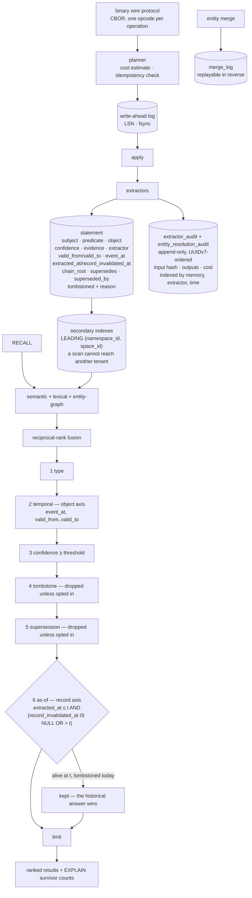

## 1. Executive Summary

Brain is a memory database rather than a memory library: a Rust server, a
binary wire protocol, no shipped client, and a 148-file normative
specification. Four record types — Memory, Entity, Statement, Relation — with
provenance, confidence and bi-temporal validity, and retrieval that fuses
semantic, lexical and entity-graph arms before a filter chain whose step order
is declared binding.

Five marks, and three of them are unusually cleanly implemented.

**The scope is in the key.** Every secondary index over statements carries a
leading namespace-and-space prefix, and the comment states the guarantee in the
form that matters: a range scan for one namespace and space *"can physically
never traverse another tenant's rows."* That is not a predicate applied after a
read — there is no read that reaches the wrong rows at all.

**Four timestamps on two axes, and the header works the divergence through.**
Object time says when a fact became and stopped being true; record time says
when the substrate ingested and stopped believing the claim. The example is
worked out in the type's own documentation: learn in May that Alice changed
jobs in February, and *"a query 'what did I believe on April 1?' returns the
superseded statement… a query 'what was true on April 1?' does not."*

**Belief is a state, and it is separate from the number.** Confidence is a
float with its own filter step; supersession and tombstoning are stored
record-axis state with their own steps, and both default to dropping. The
system can say *I have this on record and do not believe it*, which is the
thing the mark exists to test.

The part worth studying even if you build nothing like this is the step where
the two interact. A row tombstoned today but alive at the instant an as-of
query names passes the as-of step anyway, because *"the tombstone filter runs
against current state, while the as-of filter runs against historical state,
and the historical answer must win when the caller asked for it."*

## 2. Mental Model

A memory is what arrived. Statements are what was extracted from it, and they
are where every mechanism lives.

A statement is a subject, a predicate and an object, plus four things most
stores keep implicit: who extracted it, what evidence it rests on, how
confident that extractor was, and when — on both clocks. Corrections do not
edit; they mint a new statement, point it at its predecessor, close the
predecessor's record axis and keep both in a chain with a shared root.

Forgetting is two operations, not one. A soft forget tombstones and keeps the
row for audit; a hard forget stamps a distinct reason so the reclamation worker
knows it may physically reclaim this row and not the soft ones.

Isolation is not a filter. A namespace comes from the credential and a space
comes per request, and both are folded into ids and into index keys before any
query exists.

## 3. Architecture

## 4. Essential Implementation Paths

- **Record types:** `crates/brain-core/src/nodes/statement.rs`, `entity.rs`,
  `relation.rs`, `memory.rs`.
- **Ids and scope derivation:** `crates/brain-core/src/ids.rs`.
- **Tables and index prefixes:** `crates/brain-metadata/src/tables/`.
- **Supersession, tombstoning, cascade:**
  `crates/brain-metadata/src/statement/`, `cascade.rs`.
- **Filter chain:** `crates/brain-planner/src/retrieval/filters/logic.rs`.
- **Forget planning:** `crates/brain-planner/src/planner/forget.rs`.
- **Write-ahead log and recovery:** `crates/brain-storage/src/wal/`,
  `recovery.rs`.
- **Specification:** `spec/`, notably `02_data_model`, `03_schema` and
  `20_tenancy`.

## 5. Memory Data Model

The statement is the record worth reading in full. Beyond the four timestamps
it carries a version, a `supersedes` and `superseded_by` pair, a `chain_root`
that is self-referential until the statement is superseded, a tombstone flag
with a typed reason, and an `is_stateful` flag copied from the predicate
definition at write time.

Two smaller decisions are worth lifting.

`SubjectRef` has three variants, and the third is the interesting one: a
subject can be a resolved entity, the source memory itself — for statements
about a memory rather than about a thing, such as when an event occurred — or
`Pending`, holding an audit id when the resolver returned ambiguous. The
comment notes that query paths excluding pending subjects skip those, so an
unresolved reference is a distinguishable state rather than a guess.

`TombstoneReason` separates `Retract` from the four soft reasons for a stated
operational purpose: the reclamation worker selects only rows the caller asked
to remove, while soft tombstones and superseded rows *"are kept for audit."*
The retract handler stamps that reason regardless of what the caller put in the
audit byte, which is the small correct detail — the physical consequence is not
left to a field the caller controls.

## 6. Retrieval Mechanics

Three arms fuse by reciprocal rank, then six filters run in an order the module
calls binding, then a limit. EXPLAIN reports survivor counts per step, which
makes the chain debuggable in the way a single opaque WHERE clause is not.

The order is the design. Type first, then the object-time window, then
confidence, then tombstone, then supersession, then as-of — and the last one is
documented as the exception to the fourth, because history and current state
are different questions and a caller who asked the historical one should get
the historical answer.

## 7. Write Mechanics

Every operation is planned before it is executed: a cost estimate checked
against a budget, an idempotency check on the request id, a write-ahead log
append with fsync, then apply. A forget plan carries explicit booleans for what
it will do — tombstone the arena slot, commit metadata, mark the HNSW entry
removed, and for a hard forget zero the vector and the text.

Corrections supersede. The supersede path stamps `record_invalidated_at` on the
predecessor, and the tombstone path stamps it too, so a single predicate —
that timestamp being unset — answers *is this the current belief* regardless of
which route retired the old one.

## 8. Agent Integration

None, deliberately. Brain ships no client; the README says any language speaks
the binary wire protocol directly, and the protocol section documents per-opcode
field schemas. There is an admin port, a plugin surface with connectors and
enrichers, and a Docker image.

## 9. Reliability, Safety, and Trust

**Trust state — awarded.** Confidence and belief are separate fields, separate
filter steps, and separate questions.

**Bi-temporal — awarded**, on the fullest form in this reading: four
timestamps, both axes reaching the read, and the interaction between the
historical and current-state filters decided explicitly. The stated limit is
that only statements carry the record axis today.

**Scope enforced — awarded**, on the key prefix rather than a predicate, plus
an id derivation that folds the namespace so the same space string under two
namespaces cannot collide. The caveat is the default: the anonymous space is an
all-zero sentinel and it is the type's `Default`, used by server-side workers
that act without a caller. That is a reasonable choice for a worker and a
hazard for a forgotten request path, since the failure is a shared bucket
rather than an error.

**Audit log — awarded.** Append-only, time-ordered by construction, with an
input hash and the produced outputs, indexed three ways — and a merge log
carrying enough to run an unmerge backwards.

**Negative eval — awarded**, on the four-case record-axis table and the
end-to-end supersession case.

**Tombstone — withheld.** The word is here and the mechanism is careful, but
the key is the row: `tombstoned`, `tombstoned_at` and `tombstone_reason` sit on
a statement, and nothing is keyed on the value a caller asked to forget. Encode
does de-duplicate — the planner asserts text encode dedup is always on — but
that is a near-duplicate check against live content, not a consult against a
record of what was rejected. Re-encoding the same sentence after a hard forget
produces a new memory.

**Human review — withheld.** No approval surface exists; EXPLAIN and the admin
port are read-only diagnostics. The nearest thing is the pending-resolution
audit, which records that the resolver could not decide — a place a reviewer
could stand, with no reviewer standing there.

## 10. Tests, Evals, and Benchmarks

**No paper** and no `CITATION.cff`. The specification cites Zep and Graphiti's
bi-temporal model as the thing being applied to a typed graph, which is an
honest attribution rather than a claim of novelty.

2,729 test functions across fifteen crates, three protocol fuzz targets, and
fault-injection suites named for what they inject — bit flips, IO faults,
random kills, recovery chaos, concurrent edges. A database that tests its
recovery path by killing itself at random points is treating durability as
something to be measured rather than asserted.

`spec/19_benchmarks` exists and the README shows a p99 recall figure in its
terminal banner. No benchmark result is committed to the tree, so that number
is a screenshot rather than a measurement a reader can reproduce.

The status badge says pre-release v0.1.0, and the tenancy specification marks
several decisions as still open. Reading the spec as a description of the code
would overstate what is built — the `SpaceId` type, for instance, appears in
the metadata index prefixes and the executor context but not yet in the
write-ahead log payloads.

## 11. For Your Own Build

- **Put the scope in the key.** A leading `(namespace, space)` prefix makes
  cross-tenant traversal impossible rather than merely filtered, and it removes
  the question of whether every query remembered its predicate.
- **Derive the partition id from the namespace as well as the space**, so two
  tenants cannot collide on the same user-supplied string — and pin the
  derivation with a golden test, because changing it re-keys everyone.
- **Keep belief and confidence as separate fields.** A threshold cannot express
  *on record but not believed*, and a state cannot express *probably*.
- **Decide what an as-of query does with rows deleted since.** Brain's answer —
  the historical filter overrides the current-state one when the caller asked
  for history — is one defensible choice; having no answer is not.
- **Give the hard delete its own reason code.** The reclamation worker can then
  select exactly what a caller asked to remove, and soft tombstones survive for
  audit without a second flag.
- **Name what a fault-injection suite injects.** Bit flips, IO faults and
  random kills are three different failure classes, and a suite per class
  reports which one broke.

## 12. Open Questions

- Only statements carry record-axis timestamps, so an as-of query passes
  memories, entities and relations through unfiltered. Is extending the axis to
  those planned, and what does an as-of answer mean today when a statement's
  subject entity has been merged since?
- The anonymous space is the `Default` for `SpaceId`. Would a distinct
  `Worker` sentinel, with the plain default made unconstructable, keep the
  worker convenience without the forgotten-request hazard?
- The specification is 148 files and the tree is v0.1.0. Which sections are
  descriptions of the code and which are the plan — is there a marker, or is
  reading both the only way to tell?

## Appendix: File Index

- Record types: `crates/brain-core/src/nodes/statement.rs`,
  `nodes/entity.rs`, `nodes/relation.rs`, `nodes/memory.rs`,
  `nodes/kinds.rs`
- Ids and scope derivation: `crates/brain-core/src/ids.rs`
- Tables and index prefixes: `crates/brain-metadata/src/tables/statement.rs`,
  `tables/audit.rs`, `tables/extractor_audit.rs`, `tables/merge.rs`
- Supersession and tombstoning:
  `crates/brain-metadata/src/statement/supersede.rs`,
  `statement/tombstone.rs`, `crates/brain-metadata/src/cascade.rs`
- Filter chain: `crates/brain-planner/src/retrieval/filters/logic.rs` and
  `filters/tests.rs`
- Forget: `crates/brain-planner/src/planner/forget.rs`,
  `crates/brain-planner/src/plan/forget.rs`
- Durability: `crates/brain-storage/src/wal/`,
  `crates/brain-storage/src/recovery.rs`, and the fault suites under
  `crates/brain-storage/tests/`
- Specification: `spec/02_data_model`, `spec/03_schema`, `spec/20_tenancy`

## History

**2026-09-19** — [`32a77b853f8f5a8245add13615b4484bba9e956a`](https://github.com/arc-labs-ai/brain-db/commit/32a77b853f8f5a8245add13615b4484bba9e956a) — first reading, at the head of `main`, status pre-release v0.1.0. Screened with `scripts/screen_repo.py` before anything was read: one auto-run surface in a devcontainer configuration, no build-time execution path, no floating dependency surface, no instruction file addressed to a reading agent, and both `Cargo.lock` files unchanged for forty-seven days. Nothing was installed, built or run. Apache-2.0. Five marks. The reading covered the four record types and the statement's four timestamps, the supersession and tombstone paths and their shared record-invalidation stamp, the forget planner's soft and hard modes, the audit and merge tables, the index key prefixes and the space-id derivation, the six-step filter chain and its as-of step, and the filter test suite; the embedding, indexing, planner-cost, HTTP and plugin crates were read as context rather than as subject, and 242,000 lines across 677 files means this reading is of the memory model rather than of the whole tree. Two marks are withheld with reasons in section 9. The one worth repeating is `tombstone`: the word is used here for a row flag, and nothing is keyed on the value a caller asked to forget, so re-encoding the same sentence after a hard forget produces a new memory. The specification is 148 files against a v0.1.0 tree, so claims read there were checked against code before being repeated.
