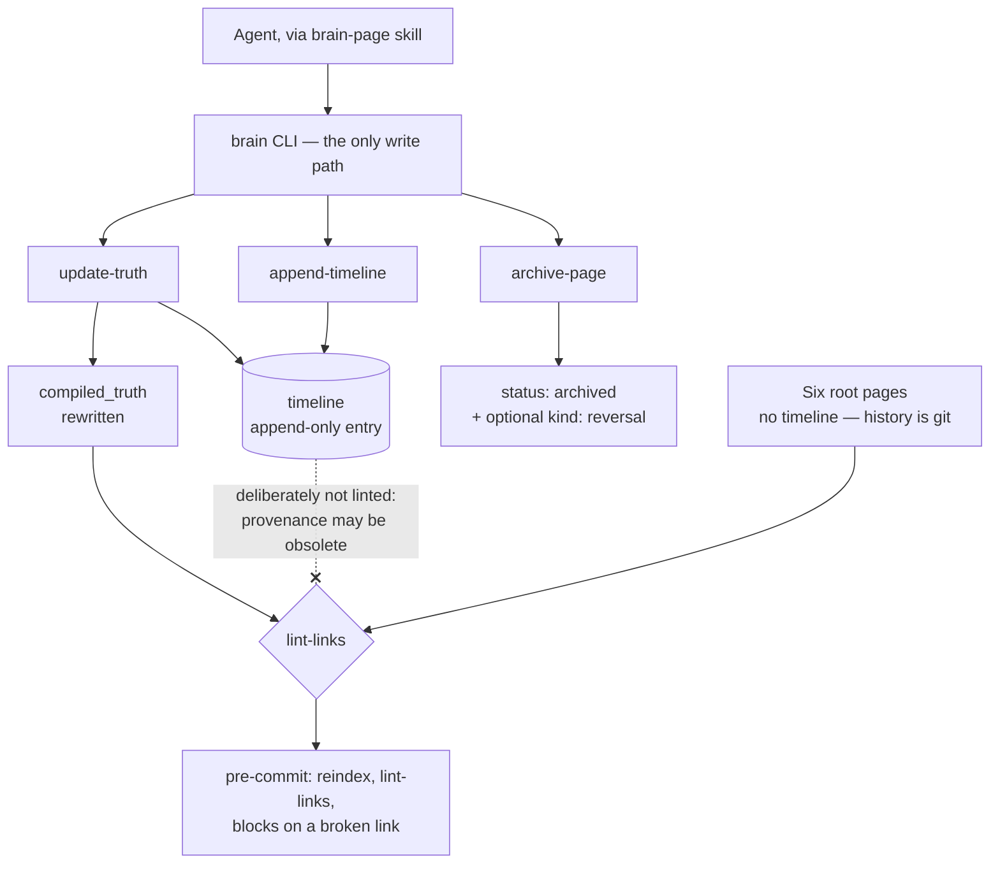

## 1. Executive Summary

brain.md is a small Apache-2.0 project — a 522-line zero-dependency Node library
and a 797-line CLI over it — that stores a project's durable knowledge as plain
markdown in the repository and reads and writes it through one command. It ships
as four agent skills (`brain-bootstrap`, `brain-ingest`, `brain-page`,
`brain-setup`), publishes as `@mindmux/brain-md` on npm, and is deliberately
agent-agnostic. The library and the page format are byte-identical to
`5cecfdd4154687751f80e2d40f3a70a4fdca4543`; everything around them — packaging,
an installer, agent wiring, session hooks and roughly a thousand lines of test —
is what the project has built since.

**The page format is the contribution.** Every page carries two sections:
`compiled_truth`, which is what is currently believed, and `timeline`, an
append-only list of entries typed `decision | evidence | reversal | note`. The
CLI's `update-truth` rewrites the first *and* appends to the second in one atomic
write, and the skill states the invariant plainly: a compiled_truth rewrite
*"can never silently skip its timeline entry."* Belief and the reason it changed
are one operation.

That is [evidence before belief](../../patterns/evidence-before-belief/) and an
[append-only audit](../../patterns/append-only-memory-audit/) expressed as a file
layout rather than as two tables, and it is the cleanest small instance of the
pair in this atlas.

**The second good decision is about what the linter does not check.**
`lint-links` treats compiled truth and root-page bodies as the current knowledge
graph and *"intentionally does not lint Page timeline entries, because timeline
is append-only provenance and may contain historical syntax examples or obsolete
references."* Most systems that keep history and validate links end up with a
choice between broken validation and rewritten history; this one draws the line
where it belongs — the current layer must be consistent, the historical layer
must be allowed to be wrong.

**And the third is the disclosure.** There is deliberately no `validate` command,
because every write goes through the CLI and the failure modes are therefore
structurally impossible — followed immediately by the limit: *"The guarantee
holds **only as long as you never hand-edit a brain file** — there is nothing to
catch a manual edit afterwards."* A project that states the boundary of its own
guarantee in the same paragraph as the guarantee is rare enough in this corpus to
name.

## 2. Mental Model

A page is a belief with its own history attached, and the CLI is the only door.

**Writes are correct-by-construction rather than validated.** Frontmatter is
generated, section markers are canonicalised, and the mutation vocabulary is
fixed: create, update, append-timeline, update-truth, archive, tag, root-page
rewrite, reindex.

**Current knowledge is rewritten; provenance is appended.** `append-timeline`
adds to the end and existing entries are never touched. `update-truth` does both
halves at once.

**Root pages are different on purpose.** Six fixed slugs — `background`,
`architecture`, `flow`, `mindmap`, `stack`, `roadmap` — validated by the CLI,
with a guaranteed canonical H1 and **no timeline**, because *"their history lives
in git."* That is a deliberate split between knowledge that needs an in-file
audit and knowledge whose audit is the version-control system.

**Archival is a status plus, optionally, a reversal.** `archive-page` sets
`status: archived` and can append a `kind: reversal` entry carrying why the page
was overturned, then reindexes. Nothing is deleted.



The dotted edge is the design decision worth taking: the append-only layer is
exempt from the check that keeps the current layer honest.

## 3. Architecture

No service, no database, no dependencies. A `brain/` directory in the repository,
a Node CLI resolved from a few known skill locations, and an optional git
pre-commit hook that runs `reindex` then `lint-links`, blocks the commit on a
broken link, and folds a regenerated `index.md` back into the commit when the
index lives inside the repo. A `brainRoot` redirect in `.mindmux/preferences.json`
allows a sidecar brain outside the repository, and the hook skips folding in that
case — a small correctness detail that many hook scripts would get wrong.

**The hook payloads in the tree are assets, not active hooks.**
`skills/brain-setup/hooks/pre-commit` and `skills/brain-setup/hooks/session-start`
are files the CLI installs into a target repository. In this checkout they are
inert: nothing runs on clone. The tree does carry a manifest —
`package.json` declares `@mindmux/brain-md`, a `brain` bin and `node --test`, and
declares **no dependencies of any kind**, so the committed suite runs against a
bare checkout with nothing installed.

### What distribution added

`bin/brain.mjs` and `bin/lib/installer.mjs` put the skills on disk for five
runtimes and keep a manifest of what they wrote, refusing to remove anything they
did not install. `brain init` scaffolds a brain, and every step of it is
conditional: `BRAIN.md` is copied only if missing, the skeleton only if the
resolved location holds no page, and the wired block is replaced in place between
its own markers. Running `init` twice changes nothing the second time, which is
the property an agent-invoked scaffolder most needs and least often has.

## 4. Essential Implementation Paths

- **Library** — `skills/brain-page/lib/brain.mjs`: `resolveBrainDir`,
  `splitFrontmatter`, `parseFrontmatter`, `compiledTruthMarkerRange`,
  `timelineMarkerRange`, `extractSection`, `countTimelineEntries`, `listPages`,
  `findWikiLinks`, `setFrontmatterField`, `normalizePageSectionMarkers`.
- **CLI** — `skills/brain-page/bin/brain.mjs` (797 lines): the eight mutation
  subcommands, four read subcommands (`brain-dir`, `list-pages`, `read-page`,
  `read-root`), `init`, `wire`, and `install-hooks` / `uninstall-hooks`.
- **Contract for agents** — `skills/brain-page/SKILL.md`, which states the
  invariants an agent must not work around, and `skills/brain-setup/assets/BRAIN.md`,
  the copy placed in the target project's root.
- **Hooks** — `skills/brain-setup/hooks/pre-commit` and
  `skills/brain-setup/hooks/session-start`.
- **Installer** — `bin/brain.mjs` and `bin/lib/installer.mjs` (377 lines), with a
  `.brain-md-installed` manifest per project.
- **Seed brain** — `skills/brain-setup/assets/brain/`, the six root pages plus
  `index.md` and `pages/`.
- **Tests** — four files, 1,463 lines: `brain.test.mjs` (452, the library),
  `cli-hooks.test.mjs` (523), `cli-init-wire.test.mjs` (297),
  `installer.test.mjs` (191).

## 5. Memory Data Model

Frontmatter is CLI-generated and carries at least an id, a status and tags; the
body carries the two marked sections. A timeline entry has a `kind` —
`decision`, `evidence`, `reversal`, `note` — which is a small, well-chosen
vocabulary: three of the four are epistemic events and the fourth is explicitly
not.

What the model does *not* have is a status on the belief itself. `reversal`
records that something was overturned, and the page it overturned keeps whatever
compiled truth the same write installed; `status: archived` is lifecycle rather
than epistemics. So a reader can see that a reversal happened and cannot query
for beliefs that have been reversed.

## 6. Retrieval Mechanics

Section extraction by marker, wiki-links between pages, and a regenerated
`index.md`. There is no ranking, no embedding, no search — the retrieval story is
that an agent reads the index, follows links, and extracts the compiled truth of
the pages it needs. For a project-knowledge store of this size that is a
reasonable position, and the linter is what keeps the link graph navigable.

## 7. Write Mechanics

Synchronous, model-free, and funnelled. The interesting property is atomicity at
the *semantic* level rather than the filesystem level: `update-truth` is one
command that produces two effects, so the failure this atlas records
repeatedly — a belief changing with no record of why — is not expressible
through the supported interface.

The cost is stated: hand-edit a file and nothing notices. `reindex` and
`lint-links` are described as *"optional hygiene, not load-bearing gates"*, which
is accurate and unusually candid, and the pre-commit hook is the one place they
become enforcing.

## 8. Agent Integration

Four skills, each a markdown contract rather than code: bootstrap for standing a
brain up from an existing repository, ingest for pulling material in, page for
the read/write vocabulary, setup for installation. Claude Code, Codex, Cursor,
opencode and Pi are named as targets, and the CLI's skill-location search
reflects that — `~/.claude/skills/`, `~/.codex/skills/`,
`~/.config/opencode/skills/`.

Three mechanisms carry the contract to the agent, and they are worth separating
because only one of them is code.

**`brain wire` writes the contract into the agent's own config file.** It splices
a block between `<!-- BEGIN brain.md -->` and `<!-- END brain.md -->` in
`CLAUDE.md` and `AGENTS.md`, creating the file if absent and replacing the block
in place if the markers are already there — so re-wiring upgrades rather than
duplicates, and text outside the markers is untouched. The agent set is deduped
by *target file* rather than by name, so asking for `codex`, `cursor` and
`opencode` writes `AGENTS.md` once. Claude's block gets one extra line,
`@import ./BRAIN.md`, because the syntax is Claude-specific and the others would
render it as prose.

**The block is prompt text, and its instructions are the enforcement.** It tells
the agent to load context before a task, to capture a decision the moment it
settles rather than batching it, not to write during pure implementation, to use
`update-truth` or a `reversal` entry when overturning a conclusion, and to store
only what will still matter in six months. There is no code behind any of it.
This is the same shape the atlas records under
[skills as procedural memory](../../patterns/skills-as-procedural-memory/) — a
policy whose only runtime is the model reading it.

### The MCP preference is one sentence

The wired block ends with *"Never hand-edit brain files. If a brain MCP server is
connected and authenticated, prefer it; otherwise use the `brain` CLI."* That
sentence is the whole of the feature. No MCP server, client, manifest or
transport exists in this repository:

```sh
grep -rn -i "mcp" . --exclude-dir=.git
```

Four hits at the pinned commit — the sentence, a README line naming *"MindMux over
MCP"* as a runtime layered on the same files, and two tests. The tests are the
honest part: `cli-init-wire.test.mjs:58` asserts the sentence appears in the
wired block, and `:106` asserts that re-wiring a project whose block predates the
sentence replaces it without duplicating. A string assertion is the correct test
for a string feature, and reading the two together tells you exactly what was
shipped: a routing instruction to a server that lives somewhere else.

### The session hook injects the index without being asked

`brain install-hooks` writes `skills/brain-setup/hooks/session-start` into
`.claude/hooks/` or `.codex/hooks/` and registers it as a `SessionStart` hook in
the project-local settings file. At the start of a session the hook resolves the
CLI from nine candidate paths, calls `brain-dir`, exits silently unless the
output line reads `populated: true`, then calls `list-pages` and prints the index
into the agent's context.

Two properties of the script are load-bearing. It **shells out for everything** —
it never opens a file under `brain/`, so the redirect in
`.mindmux/preferences.json` is honoured for free and the hook cannot disagree
with the CLI about where the brain is. And it **fails open**: `trap 'exit 0' EXIT`
with stderr sent to `/dev/null`, so a missing CLI, a failing subcommand or an
unpopulated brain costs a session nothing.

The index is page metadata only — id, title, category, status, one line each — so
no page body reaches the prompt. That is asserted rather than assumed; see
section 10.

## 9. Reliability, Safety, and Trust

**The timeline earns `audit_log`.** It is a named, append-only record of
mutations to the belief, in the system's own store, and the write path cannot
change a belief without adding to it. Root pages are the exception and say so —
their history is git, which this atlas does not count as the mark, and the report
does not credit it there.

**Scope is a directory.** One brain per repository, resolved rather than
configured per call, with a redirect for a sidecar. That is the file-boundary
form of scope, and its limit is the usual one: a single-user store with no
tenancy and no authorisation. `brainRoot` in `.mindmux/preferences.json` is the
stored key, and every read command derives its path from the resolution rather
than taking one — `read-page` and `read-root` accept an id and a slug, not a
path, and `read-root` rejects any slug outside the six.

**The hook installer is the most defensive code in the project, and it is not
over-written.** `hookTarget` refuses to proceed if the settings file, the hook
directory or the script is a symlink, so a project-local install cannot be made
to write a global settings file. `checkOwnedScript` reads the destination and
refuses to overwrite *or remove* anything whose first two lines are not the
project's own shebang and marker comment. Uninstall filters out only the entries
matching its own command, collapses the structures it empties, and leaves every
other `SessionStart` hook in place. Each of those is asserted, including the
refusal path for all four symlinkable locations.

**The shell quoting is tested against an adversarial path.** The Codex hook is
registered as `sh '<dest>' codex` with single quotes doubled, and the suite runs
the whole install-and-invoke cycle inside a directory whose name carries a single
quote, a `$HOME` reference, a `$(...)` substitution, a backtick substitution and a
non-ASCII character — both substitutions attempting to create a file named
`INJECTED` — then asserts that no such file appears. A committed injection case
over a path the shell would otherwise expand is rare in this corpus.

**The guarantee is bounded and the boundary is published.** Correct-by-
construction writes, no validator, and one sentence saying exactly when the
property stops holding. Compare the systems in this atlas whose invariants are
asserted in a README and enforced nowhere.

**What is missing is a way to ask about the past.** The timeline is prose in a
markdown section: a person can read why a belief changed, and nothing can query
for reversals, count them, or find every page whose truth changed after a given
date without parsing the files. `countTimelineEntries` exists, which is the
beginning of that and not the end.

## 10. Tests, Evals, and Benchmarks

1,463 lines of Node test across four files, against a 522-line library and a
797-line CLI. **50 tests, all passing**, run for this reading at the pinned commit
on Node v22.17.0 with `node --test` and nothing installed — the package declares
no dependencies, so the suite is runnable from a bare checkout, which is itself
worth more than the line count.

The library cases that first earned `negative_eval` are unchanged:
`assert.doesNotMatch(truth, /## Timeline/)` and
`doesNotMatch(truth, /real timeline/)` pin that timeline content cannot leak into
an extracted compiled truth, and further cases assert the raw section markers do
not survive into a rendered body.

The hook suite extends the same shape to the path that feeds an agent at session
start, and it does so **with a positive control on every negative case** — the
test this atlas usually has to note the absence of:

| Must not appear | Paired positive control |
| --- | --- |
| A page body written through `update-truth` (`SECRET_BODY_MUST_NOT_LEAK_INTO_THE_HOOK`) | the same page's id is asserted present in the same output |
| A page read off disk rather than through the CLI (`SECRET_FROM_FILE_NOT_CLI`) | the mock CLI's own row is asserted present |
| `list-pages` being called at all when `brain-dir` reports the brain unpopulated | `brain-dir` is asserted present in the invocation log |
| A redirected brain's body text from a nested working directory (`PRIVATE_PAGE_BODY`) | the page's id and its UTF-8 title are asserted present |
| `brain/` appearing in the project or the nested directory when `brainRoot` redirects | a newly created page is asserted to reach the next snapshot |
| A `U+FFFD` replacement character, or a truncation notice below the budget | the emitted rows are asserted to equal a prefix of the input rows |

The hook's *source* is also asserted structurally: it must mention `brain-dir`
and `list-pages` and must not contain `brain/pages`, `index.md`, `cat`, or
`readFile|writeFile|open(`. That is a test that the hook has no second way to
reach the store — a property the usual behavioural test would miss, because a
hook that read the files directly would produce the same output on the happy
path.

`negative_eval` is earned on the read path, in the sense
[this atlas counts](../../capabilities/): committed cases asserting that
particular material does not come back from the surface that feeds an agent.
None of them is a deletion-durability assertion, and this report does not claim
otherwise.

No benchmarks, and none claimed.

## 11. Patterns Worth Stealing

### Steal

**Make the belief rewrite and its provenance entry one command.** Not a
convention, not a code review rule — one subcommand that does both, so skipping
the second is not expressible.

**Exempt the append-only layer from the consistency check.** History is allowed
to contain obsolete references; current knowledge is not. Systems that lint
everything end up either rewriting history or disabling the check.

**Give history to git where an in-file audit adds nothing.** Root pages have no
timeline on purpose. Knowing which knowledge needs its own audit and which does
not is a decision most designs never make.

**Publish the boundary of your guarantee in the same breath as the guarantee.**
*"The guarantee holds only as long as you never hand-edit a brain file."*

**Make your session hook shell out to your own CLI, and test that it has no
second path.** The hook never opens a brain file, so it inherits the CLI's
directory resolution rather than duplicating it, and a test greps the script for
`readFile`, `cat` and the store's own paths to keep it that way. A component that
reads the store two ways will eventually read it two different ways.

**Refuse to touch a script you did not write.** `checkOwnedScript` reads the
destination and bails unless it starts with the project's own shebang and marker
comment — on install *and* on uninstall. An uninstaller that deletes by path is
a footgun pointed at whatever else was there.

**Make your scaffolder idempotent by construction, not by a flag.** `init` copies
only what is missing, scaffolds only into an unpopulated location, and replaces a
marked block rather than appending one. An agent that runs a setup command twice
is the normal case, not the error case.

**Fail a context hook open.** `trap 'exit 0' EXIT`, stderr to `/dev/null`, and a
silent exit unless the store reports itself populated. A memory layer that can
break a session start will be uninstalled the first time it does.

### Avoid

**Do not rely on a funnel with an open side.** The CLI cannot enforce anything
against a text editor, and the project's answer — a pre-commit hook — is optional
and locates its own binary by searching four paths.

**Do not let provenance be readable only by a human.** Four entry kinds is a
usable vocabulary; without a query over them, the reversal history is prose.

**Do not budget one consumer of a shared payload and not the other.** The hook's
Codex branch passes the index through an awk filter with an 8,192-byte ceiling, a
whole-row truncation rule and an explicit *"Index truncated"* notice; the branch
every other runtime takes prints the index whole. Both feed the same list into the
same kind of context window, and only one of them can say what it will cost.

**Do not ship a preference for a component that is not there.** *"If a brain MCP
server is connected and authenticated, prefer it"* is a routing rule with no
router — an agent that reads it and finds no such server falls through to the CLI,
which is the safe outcome, but the line describes the product rather than the
repository.

### Fit

This suits a team that wants project knowledge to live in the repository, travel
with it, and be legible to any agent — and that is willing to make the CLI the
only way in. It is small enough to read in an afternoon and the format would
survive the tool disappearing, which is the strongest property a markdown memory
can have.

It is not the choice where memory must be searched rather than navigated, where
several agents write concurrently, or where a wrong belief must be provably
unable to return: `archive` and `reversal` record that something was overturned,
and nothing stops the same claim being compiled back into truth tomorrow.

## 12. Antipatterns / Risks

- **A funnel that a text editor bypasses**, with no validator by design.
- **Provenance without a query.**
- **No epistemic status on the page**, so reversed and current beliefs look the
  same in frontmatter.
- **An optional hook as the only enforcement**, which finds its CLI by searching
  well-known paths and silently skips when it cannot.
- **An unbounded context injection on every runtime but one.** The SessionStart
  hook's Codex branch is capped at 8,192 bytes with a truncation notice; the
  branch Claude Code and every other target takes prints the whole `list-pages`
  output. The payload is one line per page rather than page bodies, so it grows
  with the brain's page count — but nothing in that branch bounds it, and the
  asymmetry is invisible from the settings file that installs it.
- **A write contract that lives in prose the agent may or may not follow.** The
  wired block is the enforcement for "capture a decision the moment it settles"
  and "never hand-edit brain files", and the code cannot tell whether either
  happened.

## 13. Build-vs-Borrow Takeaways

The page format is the borrowable thing, and it is borrowable without the code: a
current-knowledge section, an append-only typed timeline, and one write that
touches both. That shape drops into any markdown memory, including several
already in this atlas that keep history in a sibling file and let the two drift.

## 14. Open Questions

- Is a `validate` command genuinely unwanted, or unwanted *until* the first
  hand-edited brain is reported?
- Will timeline entries ever be queryable — the kinds are there and nothing reads
  them programmatically beyond counting.
- What happens when two agents update the same page's truth concurrently? The
  write is atomic per command and the store is a file.
- Why is the byte budget on the Codex branch alone? The awk filter is
  runtime-independent and the other branch has no ceiling.
- What does the brain MCP server expose that the CLI does not, and does the
  page format survive the crossing? The wired block prefers it and nothing in
  this repository describes it.

## 15. Appendix: File Index

| Path | Role |
| --- | --- |
| `skills/brain-page/lib/brain.mjs` | Frontmatter, section markers, links, timeline counting |
| `skills/brain-page/bin/brain.mjs` | The CLI — the only supported write path |
| `skills/brain-page/SKILL.md` | The invariants, stated for the agent that must not work around them |
| `skills/brain-setup/hooks/pre-commit` | reindex, lint-links, block on broken link, fold the index in |
| `skills/brain-setup/assets/brain/` | Six root pages, index, `pages/` |
| `skills/brain-setup/hooks/session-start` | Resolve the CLI, exit unless populated, inject `list-pages`; 8 KiB budget on the Codex branch only |
| `skills/brain-setup/assets/BRAIN.md` | The read/write contract copied into the target project's root |
| `bin/brain.mjs`, `bin/lib/installer.mjs` | npm entry point and the skill installer, with a per-project manifest |
| `skills/brain-page/test/brain.test.mjs` | 452 lines, including the timeline-must-not-leak assertions |
| `skills/brain-page/test/cli-hooks.test.mjs` | 523 lines: body-leak, no-second-read-path, shell injection, UTF-8 budget, symlink refusal |
| `skills/brain-page/test/cli-init-wire.test.mjs` | 297 lines: idempotent `init`, in-place block replacement, the MCP sentence |
| `skills/brain-page/test/installer.test.mjs` | 191 lines: manifest, backups, refusal to remove what it did not install |

## History

**2026-09-13** — [`8064f3334cfa465129d42668ba271ef71a53dc71`](https://github.com/mindmuxai/brain.md/commit/8064f3334cfa465129d42668ba271ef71a53dc71) — 31 commits past the previous pin. `skills/brain-page/lib/brain.mjs` and its 452-line test file are byte-identical, so the page format, the compiled-truth invariant and the library evidence behind every mark are unchanged. What moved is everything around them: an npm package and a skill installer, a `brain init` that is idempotent by construction, opt-in SessionStart hooks for Claude Code and Codex, and three new test files taking the suite to 1,463 lines and 50 cases, all passing here on Node v22.17.0 with no dependencies installed. `negative_eval` is re-verified and substantially broader — the hook suite asserts page bodies cannot reach the injected snapshot, that the hook has no second path to the store, and that a shell-hostile project path cannot execute, each with a positive control. `scope_enforced` and `audit_log` re-verified at the new pin and unchanged. Two findings are new: the SessionStart hook budgets its payload to 8,192 bytes on the Codex branch only, and the *"prefer an authenticated brain MCP"* line added to the wired agent block is prompt text with no server, client or transport in the repository. The first reading did not cover `brain wire`, which existed at the previous pin; the wired block and its contents are described in section 8 here. The screen at this pin reports a `FRESH` finding on `package.json` — a manifest changed within the seven-day cooldown — so nothing was installed; the suite needs nothing to run.

**2026-08-07** — [`5cecfdd4154687751f80e2d40f3a70a4fdca4543`](https://github.com/mindmuxai/brain.md/commit/5cecfdd4154687751f80e2d40f3a70a4fdca4543) — first reading. The screen returned **NOTHING SCANNED** — no manifest it recognises exists — so the tree was read by hand: a zero-dependency Node CLI with no package manifest, and one hook payload at `skills/brain-setup/hooks/pre-commit` that is installed by the setup skill rather than active in the checkout. Nothing executes on clone and nothing was run. A screen that reports nothing over a tree containing a hook payload tells the reader something false by omission — a gap in this atlas's tooling rather than in the project — so `screen_repo.py` now reports hook-shaped files wherever they appear, with that distinction in the finding text, verified against this tree.
