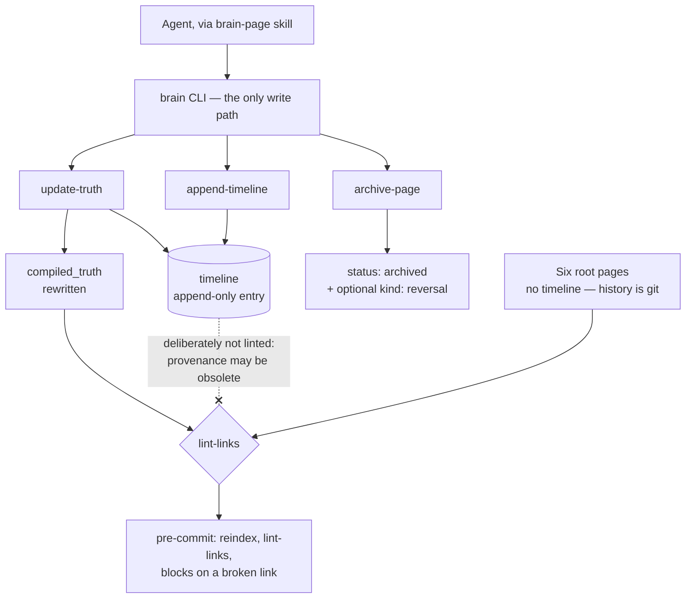

## 1. Executive Summary

brain.md keeps a project's durable knowledge as markdown pages in the
repository, each holding a current-belief section over an append-only typed
timeline, and reads and writes them through one dependency-free Node CLI whose
`update-truth` rewrites the belief and appends the entry in one atomic write. Its
weak side is the edge of that funnel: nothing checks a hand-edited file, a page
id is validated only on creation, and a line break in a timeline summary can make
a later rewrite discard earlier entries.

It ships as four agent skills (`brain-bootstrap`, `brain-ingest`, `brain-page`,
`brain-setup`), publishes as `@mindmux/brain-md` on npm, and is agent-agnostic by
design. The library and the page format are byte-identical to
`5cecfdd4154687751f80e2d40f3a70a4fdca4543`; the packaging, installer, agent
wiring, session hooks and three of the four test files were added after that
commit.

**The page format is the contribution.** Every page carries two sections:
`compiled_truth`, which is what is currently believed, and `timeline`, a list of
entries typed `decision | evidence | reversal | note`. The CLI's `update-truth`
rewrites the first *and* appends to the second in one atomic write, and the skill
states the invariant plainly: a compiled_truth rewrite *"can never silently skip
its timeline entry."* The change and the record of it are one operation. The
reason is whatever `--summary` carries, or a fixed default sentence when the
caller omits it.

That is [evidence before belief](../../patterns/evidence-before-belief/) and an
[append-only audit](../../patterns/append-only-memory-audit/) expressed as a file
layout rather than as two tables.

**The second decision is about what the linter does not check.** `lint-links`
treats compiled truth and root-page bodies as the current knowledge graph, and
the skill says why timeline entries are left out: *"timeline is append-only
provenance and may contain historical syntax examples or obsolete references"*.
A store that keeps history and validates links otherwise has to
choose between broken validation and rewritten history; this one holds the
current layer to consistency and lets the historical layer be wrong.

**The third is the disclosure.** There is deliberately no `validate` command,
because every write goes through the CLI — followed immediately by the limit:
*"The guarantee holds **only as long as you never hand-edit a brain file** —
there is nothing to catch a manual edit afterwards."* The boundary is published
in the same paragraph as the guarantee.

## 2. Mental Model

A page is a belief with its own history attached, and the CLI is the only
supported door.

**Writes are correct-by-construction rather than validated.** Frontmatter is
generated, section markers are canonicalised, and the mutation vocabulary is
fixed: `create-page`, `update-truth`, `append-timeline`, `archive-page`,
`set-tags`, `update-root`, `reindex`.

**Current knowledge is rewritten; provenance is appended.** `append-timeline`
adds to the end, and no subcommand is written to edit an existing entry.
`update-truth` does both halves at once. The text it replaces is not kept in the
page; git holds it if the page was committed.

**Root pages are different on purpose.** Six fixed slugs — `background`,
`architecture`, `flow`, `mindmap`, `stack`, `roadmap` — validated by the CLI,
with a guaranteed canonical H1 and **no timeline**, because *"their history lives
in git."* That is a deliberate split between knowledge that needs an in-file
audit and knowledge whose audit is the version-control system.

**Archival is a status plus, optionally, a reversal.** `archive-page` sets
`status: archived` and appends a `kind: reversal` entry only when given
`--reversal-summary`, then reindexes. Nothing is deleted.

**Status is lifecycle, not belief.** `active`, `draft` and `archived` are set at
creation or by archival. No subcommand moves a page out of `draft`, and no code
reads the field to decide what an agent sees.



The dotted edge is the design decision to take: the append-only layer is exempt
from the check that keeps the current layer honest.

## 3. Architecture

No service, no database, no dependencies. A `brain/` directory in the repository,
a Node CLI, and an optional git pre-commit hook that runs `reindex` then
`lint-links`, blocks the commit on a broken link, and folds a regenerated
`index.md` back into the commit when the index lives inside the repo. A
`brainRoot` redirect in `.mindmux/preferences.json` allows a sidecar brain outside
the repository, and the hook skips folding in that case
(`skills/brain-setup/hooks/pre-commit:41-51`).

**The hook payloads in the tree are assets, not active hooks.**
`skills/brain-setup/hooks/session-start` is what `brain install-hooks` copies
into `.claude/hooks/` or `.codex/hooks/`. `skills/brain-setup/hooks/pre-commit`
is copied into `.git/hooks/` by an agent following step 4 of
`skills/brain-setup/SKILL.md`, which tells it not to overwrite an existing hook.
In this checkout both are inert: nothing runs on clone.

`package.json` declares `@mindmux/brain-md`, a `brain` bin and `node --test`, and
declares **no dependencies of any kind**, so the committed suite runs against a
bare checkout with nothing installed. `.github/workflows/ci.yml` runs `npm test`
on Node 18, 20 and 22 for pushes and pull requests to `main`.

### What distribution added

`bin/brain.mjs` and `bin/lib/installer.mjs` put the skills on disk for five
runtimes — Claude, Codex, OpenCode, Cursor and Pi — and record what they wrote in
a manifest: `brain.md/installed-links` under `XDG_STATE_HOME` or
`~/.local/state` for a global install, `.brain.md/installed-skills` for
`--project`. Each copied bundle also gets a `.brain-md-installed` marker, and
uninstall removes only marked copies and recorded symlinks. A directory already
in the way is renamed to `<target>.pre-brain.bak` and restored on uninstall
(`bin/lib/installer.mjs:109-252`).

`brain init` scaffolds a brain, and every step of it is conditional: `BRAIN.md`
is copied only if missing, the skeleton only if the resolved location holds no
page or root page, and the wired block is replaced in place between its own
markers. Running `init` twice changes nothing the second time, which is the
property an agent-invoked scaffolder most needs (`skills/brain-page/bin/brain.mjs:543-601`).

## 4. Essential Implementation Paths

- **Library** — `skills/brain-page/lib/brain.mjs`: `resolveBrainDir`,
  `splitFrontmatter`, `parseFrontmatter`, `compiledTruthMarkerRange`,
  `timelineMarkerRange`, `extractSection`, `listPages`, `findWikiLinks`,
  `setFrontmatterField`, `normalizePageSectionMarkers`, `reindexBrain`,
  `lintBrainLinks`. `countTimelineEntries` is exported and has no caller.
- **CLI** — `skills/brain-page/bin/brain.mjs`: the write subcommands, four read
  subcommands (`brain-dir`, `list-pages`, `read-page`, `read-root`), `init`,
  `wire`, and `install-hooks` / `uninstall-hooks`.
- **Contract for agents** — `skills/brain-page/SKILL.md`, which states the
  invariants an agent must not work around, and `skills/brain-setup/assets/BRAIN.md`,
  the copy placed in the target project's root.
- **Hooks** — `skills/brain-setup/hooks/pre-commit` and
  `skills/brain-setup/hooks/session-start`.
- **Installer** — `bin/brain.mjs` and `bin/lib/installer.mjs`, with an install
  manifest per scope and a marker file per copied bundle.
- **Seed brain** — `skills/brain-setup/assets/brain/`, the six root pages plus
  `index.md` and `pages/`.
- **Tests** — four files, 1,463 lines: `brain.test.mjs` (452, the library),
  `cli-hooks.test.mjs` (523), `cli-init-wire.test.mjs` (297),
  `installer.test.mjs` (191).

## 5. Memory Data Model

`create-page` writes `id`, `title`, `category`, `status`, `created` and `updated`,
and `tags` when given; the body carries the two marked sections. A timeline entry
has a `time`, a `kind` — `decision`, `evidence`, `reversal`, `note` — a
`summary`, and optionally a `source` and the ids it `affects`
(`skills/brain-page/lib/brain.mjs:407-416`). Three of the four kinds are
epistemic events and the fourth is explicitly not.

An entry does not carry the compiled truth it replaced. The timeline says that a
rewrite happened, when, and with what stated reason; the prior text is in git or
nowhere.

What the model does *not* have is a status on the belief itself. `reversal`
records that something was overturned, and the page keeps whatever compiled truth
the same write installed. `status` is lifecycle: `archived` is set only by
`archive-page`, and `draft` only by `create-page --status draft`, with no
subcommand to promote it (`skills/brain-page/bin/brain.mjs:123-131, 250`). So a
reader can see that a reversal happened and cannot query for beliefs that have
been reversed.

## 6. Retrieval Mechanics

Section extraction by marker, wiki-links between pages, and two listings. There
is no ranking, no embedding, no search: an agent reads a listing, follows links,
and extracts the compiled truth of the pages it needs. For a project-knowledge
store of this size that is a reasonable position, and the linter is what keeps
the link graph navigable.

The two listings differ. `reindex` writes `index.md` with one row per page — id,
category, status when it is not `active`, tags, and the first sentence of the
compiled truth capped at 140 characters (`skills/brain-page/lib/brain.mjs:438-488`).
`list-pages` prints id, title, category and status only
(`skills/brain-page/bin/brain.mjs:344-359`), and that listing, not `index.md`, is
what the session hook injects.

Neither filters on status. An archived page stays listed with its status beside
it, and `BRAIN.md` asks the agent to *"day-to-day, look only at `status: active`
pages; include draft / archived ones only when explicitly asked"* — a filter that
runs in the model.

## 7. Write Mechanics

Synchronous, model-free, and funnelled. The property that matters is atomicity at
the *semantic* level rather than the filesystem level: `update-truth` is one
command that produces two effects, so a belief changing with no entry beside it
is not expressible through the supported interface.

Every page write ends in `reindexBrain`, which re-reads every file under `pages/`
to rebuild `index.md`, so write cost grows with the page count; there is no lag
before a write is readable. `update-root` does not reindex, since the index lists
pages only.

The cost of the funnel is stated: hand-edit a file and nothing notices. `reindex`
and `lint-links` are described as *"optional hygiene, not load-bearing gates"*,
which is accurate, and the pre-commit hook is the one place they become
enforcing.

## 8. Agent Integration

Four skills, each a markdown contract rather than code: bootstrap for standing a
brain up from an existing repository, ingest for pulling material in, page for
the read/write vocabulary, setup for installation. Claude Code, Codex, Cursor,
opencode and Pi are named as targets; the installer's runtime list and the
session hook's CLI search both cover all five.

Three mechanisms carry the contract to the agent, and only one of them is code.

**`brain wire` writes the contract into the agent's own config file.** It splices
a block between `<!-- BEGIN brain.md -->` and `<!-- END brain.md -->` in
`CLAUDE.md` and `AGENTS.md`, creating the file if absent and replacing the block
in place if the markers are already there, so re-wiring upgrades rather than
duplicates and text outside the markers is untouched. A file with an unpaired or
duplicated marker fails the command rather than being guessed at
(`skills/brain-page/bin/brain.mjs:479-523`).

The agent set is deduped by *target file* rather than by name, so asking for
`codex`, `cursor` and `opencode` writes `AGENTS.md` once. Claude's block gets one
extra line, `@import ./BRAIN.md`; Codex's gets one extra paragraph on keeping page
ids in its native notes and re-reading pages after context rollover.

**The block is prompt text, and its instructions are the enforcement.** It tells
the agent to load context before a task, to capture a decision the moment it
settles rather than batching it, not to write during pure implementation, to use
`update-truth` or a `reversal` entry when overturning a conclusion, and to store
only what will still matter in six months. There is no code behind any of it —
the shape recorded under
[skills as procedural memory](../../patterns/skills-as-procedural-memory/), a
policy whose only runtime is the model reading it.

### The MCP preference is one sentence

The wired block ends with *"Never hand-edit brain files. If a brain MCP server is
connected and authenticated, prefer it; otherwise use the `brain` CLI."* That
sentence is the whole of the feature. No MCP server, client, manifest or
transport exists in this repository.

`grep -rn -i "mcp" . --exclude-dir=.git` returns four hits at the pinned commit:
the sentence, a README line naming *"MindMux over MCP"* as a runtime layered on
the same files, and two tests. `cli-init-wire.test.mjs:58` asserts the sentence
appears in the wired block, and `:106` asserts that re-wiring a project whose
block predates the sentence replaces it without duplicating. A string assertion
is the correct test for a string feature, and the two together show what shipped:
a routing instruction to a server that lives somewhere else.

### The session hook injects the listing without being asked

`brain install-hooks` copies `skills/brain-setup/hooks/session-start` into
`.claude/hooks/` or `.codex/hooks/` and registers it as a `SessionStart` hook in
the project-local settings file. At the start of a session the hook resolves the
CLI from `BRAIN_CLI`, then nine candidate paths, then `PATH`; calls `brain-dir`;
exits silently unless the output line reads `populated: true`; then calls
`list-pages` and prints the listing into the agent's context.

Two properties of the script are load-bearing. It **shells out for everything** —
it never opens a file under `brain/`, so the redirect in
`.mindmux/preferences.json` is honoured for free and the hook cannot disagree
with the CLI about where the brain is. And it **fails open**: `trap 'exit 0' EXIT`
with stderr sent to `/dev/null`, so a missing CLI, a failing subcommand or an
unpopulated brain costs a session nothing.

The listing is page metadata only — id, title, category, status, one line each —
so no page body reaches the prompt. That is asserted rather than assumed; see
section 10.

## 9. Reliability, Safety, and Trust

**The timeline earns `audit_log`.** It is a named record of mutations to the
belief, in the system's own store, and the CLI cannot change compiled truth
without adding to it. `archive-page` without `--reversal-summary` and `set-tags`
change a page and add nothing. Root pages are the exception and say so: their
history is git, which the mark does not count, and it is not credited there.

**The append-only guarantee has a parser-shaped hole.** `yamlScalar` wraps a
summary containing a line break in quotes and leaves the break, so each line of
a multi-line `--summary` lands as its own line in the page
(`skills/brain-page/lib/brain.mjs:318-323`). `timelineMarkerRange` treats any
line reading `## Timeline`, `## timeline` or `<!-- timeline -->` as a candidate
and takes the last one followed by a `- time:` line (`:166-186`).

A summary carrying such a line is harmless until the next entry lands below it.
From then on the planted line is the timeline boundary: `extractSection` returns
the earlier entries as compiled truth, and the next `update-truth` replaces
everything from the compiled-truth marker to the planted line — the real heading
and every earlier entry with it (`:188-227`, `:377-387`). This was traced by
reading at this commit and not executed. The committed case at
`brain.test.mjs:312-355` covers a stray marker with no entry after it, and
`SKILL.md` documents the summary as `"<one line>"` without the CLI enforcing it.

**Scope is a directory, and `scope_enforced` is withheld.** One brain per
repository: `resolveBrainDir` reads `brainRoot` from `.mindmux/preferences.json`
or falls back to `./brain`, once, at startup (`skills/brain-page/lib/brain.mjs:33-55`).
`list-pages` and the session hook read only that directory, and `read-root`
rejects any slug outside the six.

That is a physical partition. No page carries a project key and no read applies
a predicate; which brain a command sees depends on the working directory it runs
in. The boundary is real and it is a different one from a stored key filtered on
the read path, so it goes in the `scoping` row without the mark. It is also a
single-user store with no tenancy and no authorisation.

**The page id is a path segment, validated once.** `create-page` requires
kebab-case (`skills/brain-page/bin/brain.mjs:127`). `read-page`, `update-truth`,
`append-timeline`, `archive-page` and `set-tags` pass the id to `pagePath`, which
joins it under `pages/` and appends `.md` (`skills/brain-page/lib/brain.mjs:425-427`).
An id carrying `../` therefore reads any `.md` file the process can open, and
`archive-page` or `set-tags` writes a frontmatter block into one — `README.md`
included. The caller is a local agent with a shell, so this crosses no privilege
boundary; it does mean the one door admits writes outside the brain, and the help
text's `--id <kebab>` is a convention on five of six subcommands.

**The hook installer is the most defensive code in the project.** `hookTarget`
refuses to proceed if the `.claude` or `.codex` directory, the hook directory,
the settings file or the script is a symlink, so a project-local install cannot
be made to write a global settings file. `checkOwnedScript` refuses to overwrite
*or remove* anything whose first two lines are not the project's own shebang and
marker comment. Uninstall filters out only the entries matching its own command,
collapses the structures it empties, and leaves every other `SessionStart` hook
in place. Each is asserted, the symlink refusal at all four locations on the
Codex target (`cli-hooks.test.mjs:506-523`).

**The shell quoting is tested against an adversarial path.** The Codex hook is
registered as `sh '<dest>' codex` with single quotes escaped. The suite runs the
install-and-invoke cycle inside a directory whose name carries a single quote, a
`$HOME` reference, a `$(...)` substitution, a backtick substitution and a
non-ASCII character. Both substitutions would create a file named `INJECTED`, and
the case asserts none appears in the nested directory the first invocation runs
from (`cli-hooks.test.mjs:426-453`).

**The guarantee is bounded and the boundary is published.** Correct-by-
construction writes, no validator, and one sentence saying when the property
stops holding.

**What is missing is a way to ask about the past.** The timeline is prose in a
markdown section: a person can read why a belief changed, and nothing can query
for reversals, count them, or find every page whose truth changed after a given
date without parsing the files. `countTimelineEntries` is exported from the
library and called nowhere in the CLI, the hooks or the tests.

**An unbounded context injection on every runtime but one.** The hook's Codex
branch passes the listing through an awk filter with an 8,192-byte ceiling, a
whole-row truncation rule and an *"Index truncated"* notice; the Claude Code
branch prints the listing whole (`skills/brain-setup/hooks/session-start:53-69`).
The payload is one line per page, so it grows with the page count, and the
asymmetry is invisible from the settings file that installs it.

**The pre-commit hook skips when it cannot find the CLI.** It searches
`BRAIN_CLI` and four paths, prints a one-line warning, and exits 0
(`skills/brain-setup/hooks/pre-commit:12-29`), so the only enforcement point is
both optional and self-disabling.

## 10. Tests, Evals, and Benchmarks

1,463 lines of Node test across four files, against a 522-line library and a
797-line CLI. The suite was run at this commit on 13 September 2026 — Node
v22.17.0, `node --test`, nothing installed — and all 50 cases passed; it was not
re-run on 26 September 2026. The package declares no dependencies, so the suite
runs from a bare checkout, and CI runs it on Node 18, 20 and 22.

The library cases that earn `negative_eval` pin that timeline content cannot
leak into an extracted compiled truth: `assert.doesNotMatch(truth, /## Timeline/)`,
`/real timeline/` and `/first real timeline entry/`, each beside a positive match
on the truth text (`brain.test.mjs:63`, `:308`, `:396`).

The hook suite extends the same shape to the path that feeds an agent at session
start, **with a positive control on every negative case**:

| Must not appear | Paired positive control |
| --- | --- |
| A page body written through `update-truth` (`SECRET_BODY_MUST_NOT_LEAK_INTO_THE_HOOK`) | the same page's id is asserted present in the same output |
| A page read off disk rather than through the CLI (`SECRET_FROM_FILE_NOT_CLI`) | the mock CLI's own row is asserted present |
| `list-pages` being called at all when `brain-dir` reports the brain unpopulated | `brain-dir` is asserted present in the invocation log |
| A redirected brain's body text from a nested working directory (`PRIVATE_PAGE_BODY`) | the page's id and its UTF-8 title are asserted present |
| `brain/` appearing in the project or the nested directory when `brainRoot` redirects | a newly created page is asserted to reach the next snapshot |
| A `U+FFFD` replacement character, or a truncation notice below the budget | the emitted rows are asserted to equal a prefix of the input rows |

The hook's *source* is also asserted structurally: it must mention `brain-dir`
and `list-pages` and must not contain `brain/pages`, `index.md`, `cat`, or
`readFile|writeFile|open(` (`cli-hooks.test.mjs:287-294`). That tests that the
hook has no second way to reach the store, which a behavioural test would miss,
because a hook that read the files directly would produce the same output on the
happy path.

`negative_eval` is earned on the read path, in the sense
[the capability index counts](../../capabilities/): committed cases asserting
that particular material does not come back from the surface that feeds an
agent. None of them is a deletion-durability assertion.

The write subcommands are covered unevenly. The replace-then-append pair
`update-truth` uses is asserted at library level (`brain.test.mjs:140-184`). The
three CLI invocations of `update-truth` assert the exit status, the body text or
the hook output, and none counts the entries the command appended.
`append-timeline`, `archive-page`, `set-tags`, `read-page` and `read-root` are
invoked by no test, so neither the unvalidated id nor the multi-line summary is
exercised.

No benchmarks, and none claimed. No paper is cited in the repository.

## 11. For Your Own Build

### Steal

**Make the belief rewrite and its provenance entry one command.** Not a
convention, not a code review rule — one subcommand that does both, so skipping
the second is not expressible.

**Exempt the append-only layer from the consistency check.** History is allowed
to contain obsolete references; current knowledge is not. A linter that checks
everything ends up either rewriting history or being disabled.

**Give history to git where an in-file audit adds nothing.** Root pages have no
timeline on purpose. Deciding which knowledge needs its own audit and which does
not is part of the design.

**Publish the boundary of your guarantee in the same breath as the guarantee.**
*"The guarantee holds only as long as you never hand-edit a brain file."*

**Make your session hook shell out to your own CLI, and test that it has no
second path.** The hook never opens a brain file, so it inherits the CLI's
directory resolution rather than duplicating it, and a test greps the script for
`readFile`, `cat` and the store's own paths to keep it that way. A component that
reads the store two ways will eventually read it two different ways.

**Refuse to touch a script you did not write.** `checkOwnedScript` reads the
destination and bails unless it starts with the project's own shebang and marker
comment — on install *and* on uninstall.

**Make your scaffolder idempotent by construction, not by a flag.** `init` copies
only what is missing, scaffolds only into an unpopulated location, and replaces a
marked block rather than appending one. An agent that runs a setup command twice
is the normal case.

**Fail a context hook open.** `trap 'exit 0' EXIT`, stderr to `/dev/null`, and a
silent exit unless the store reports itself populated. A memory layer that can
break a session start will be uninstalled the first time it does.

### Avoid

**Do not validate an identifier at creation only.** An id that becomes a path
segment needs the same check on every command that composes the path, or the
read and write verbs accept whatever the create verb refused.

**Do not let a free-text field carry a line break into a line-anchored format.**
If section boundaries are found by matching whole lines, every value written
between them has to be unable to produce one; quote-wrapping a string does not
remove its newlines.

**Do not rely on a funnel with an open side.** The CLI cannot enforce anything
against a text editor, and the backstop that could catch a hand edit is optional
and disables itself when it cannot find its binary.

**Do not let provenance be readable only by a human.** Four entry kinds is a
usable vocabulary; without a query over them, and without the replaced text, the
reversal history is prose.

**Do not budget one consumer of a shared payload and not the other.** Both hook
branches feed the same listing into the same kind of context window, and only
one of them can say what it will cost.

**Do not ship a preference for a component that is not there.** *"If a brain MCP
server is connected and authenticated, prefer it"* is a routing rule with no
router — an agent that finds no such server falls through to the CLI, which is
the safe outcome, but the line describes the product rather than the repository.

### Fit

This suits a team that wants project knowledge to live in the repository, travel
with it, and be legible to any agent — and that is willing to make the CLI the
only way in. It is small enough to read in an afternoon and the format would
survive the tool disappearing, which is the strongest property a markdown memory
can have. The page format is borrowable without the code: a current-knowledge
section, an append-only typed timeline, and one write that touches both.

It is not the choice where memory must be searched rather than navigated, where
several agents write the same page concurrently, or where a wrong belief must be
provably unable to return: `archive` and `reversal` record that something was
overturned, and nothing stops the same claim being compiled back into truth
tomorrow. A team adopting it should add id validation and single-line summaries
before trusting the timeline as an audit.

## 12. Open Questions

- Is a `validate` command unwanted, or unwanted *until* the first hand-edited
  brain is reported?
- Will timeline entries ever be queryable? The kinds are validated on write and
  nothing reads them back.
- What happens when two agents update the same page's truth concurrently? By
  reading, each command writes its own temp file and the last rename wins, so one
  agent's entry and truth would be lost with no error; nothing tests it.
- Why is the byte budget on the Codex branch alone? The awk filter is
  runtime-independent and the other branch has no ceiling.
- How does a `draft` page become `active`? No subcommand sets the status, and the
  contract forbids editing the file.
- Does Claude Code resolve the `@import ./BRAIN.md` line the Claude block adds?
  Nothing in the tree asserts that `BRAIN.md` reaches a Claude session.
- What does the brain MCP server expose that the CLI does not, and does the page
  format survive the crossing? The wired block prefers it and nothing in this
  repository describes it.

## Appendix: File Index

| Path | Role |
| --- | --- |
| `skills/brain-page/lib/brain.mjs` | Brain resolution, frontmatter, section markers, links, reindex, atomic write |
| `skills/brain-page/bin/brain.mjs` | The CLI — the only supported write path |
| `skills/brain-page/SKILL.md` | The invariants, stated for the agent that must not work around them |
| `skills/brain-setup/hooks/pre-commit` | reindex, lint-links, block on broken link, fold the index in |
| `skills/brain-setup/assets/brain/` | Six root pages, index, `pages/` |
| `skills/brain-setup/hooks/session-start` | Resolve the CLI, exit unless populated, inject `list-pages`; 8 KiB budget on the Codex branch only |
| `skills/brain-setup/assets/BRAIN.md` | The read/write contract copied into the target project's root |
| `skills/brain-setup/SKILL.md` | Setup steps, including the agent-copied pre-commit hook |
| `bin/brain.mjs`, `bin/lib/installer.mjs` | npm entry point and the skill installer, with a manifest per scope |
| `.github/workflows/ci.yml` | `npm test` on Node 18, 20 and 22 |
| `skills/brain-page/test/brain.test.mjs` | 452 lines, including the timeline-must-not-leak assertions |
| `skills/brain-page/test/cli-hooks.test.mjs` | 523 lines: body-leak, no-second-read-path, shell injection, UTF-8 budget, symlink refusal |
| `skills/brain-page/test/cli-init-wire.test.mjs` | 297 lines: idempotent `init`, in-place block replacement, the MCP sentence |
| `skills/brain-page/test/installer.test.mjs` | 191 lines: manifest, backups, refusal to remove what it did not install |

### Recorded searches

Run from the repository root at the pinned commit.

```sh
grep -rn -i "mcp" . --exclude-dir=.git
grep -rn 'countTimelineEntries' --exclude-dir=.git .
grep -rn 'setFrontmatterField(.*"status"' skills/brain-page
grep -n '\[a-z0-9\]\[a-z0-9-\]\*' skills/brain-page/bin/brain.mjs
grep -n 'pagePath(id)' skills/brain-page/bin/brain.mjs
grep -rn 'replaceSection(' skills/brain-page/bin
grep -rn '\.\./' skills/brain-page/test
grep -rn -E 'update-truth|append-timeline|archive-page|set-tags|read-page|read-root' skills/brain-page/test
grep -rn 'kind: decision' skills/brain-page/test
grep -rn -E 'status *(===|!==|==) *"(active|draft|archived)"' skills bin
grep -rn -i 'validate' --exclude-dir=.git .
grep -rn -E 'unlinkSync|rmSync|rmdirSync' skills/brain-page
grep -rn -i -E 'arxiv|bibtex|@article|@misc|citation|\bdoi\b' --exclude-dir=.git .
git ls-files | grep -i citation
git diff --stat 5cecfdd4154687751f80e2d40f3a70a4fdca4543 HEAD -- skills/brain-page/lib/brain.mjs skills/brain-page/test/brain.test.mjs
```

## History

**2026-09-26** — [`8064f3334cfa465129d42668ba271ef71a53dc71`](https://github.com/mindmuxai/brain.md/commit/8064f3334cfa465129d42668ba271ef71a53dc71) — an audit at an unchanged pin: `main` has not moved. Screened again from a full clone: one inert hook payload, nothing inside the cooldown. Nothing installed, built or run. `scope_enforced` withdrawn: the boundary is a per-project directory with no key on a record, a physical partition the mark excludes ([section 9](#9-reliability-safety-and-trust)). Corrected: `read-page` and four write subcommands take an unvalidated id, so `../` leaves the brain; `countTimelineEntries` has no caller; the update-truth reason defaults to a fixed sentence and the replaced text is not kept; the install manifest is per scope and `.brain-md-installed` is a per-bundle marker; the pre-commit hook is agent-copied, not CLI-installed. Added: a multi-line summary can plant a timeline marker that makes the next `update-truth` discard earlier entries, traced by reading; no subcommand promotes a `draft` page; no test drives `append-timeline`, `archive-page`, `set-tags` or the read verbs ([section 10](#10-tests-evals-and-benchmarks)).

**2026-09-13** — [`8064f3334cfa465129d42668ba271ef71a53dc71`](https://github.com/mindmuxai/brain.md/commit/8064f3334cfa465129d42668ba271ef71a53dc71) — 31 commits past the previous pin. `skills/brain-page/lib/brain.mjs` and its 452-line test file are byte-identical, so the page format, the compiled-truth invariant and the library evidence behind every mark are unchanged. What moved is everything around them: an npm package and a skill installer, a `brain init` that is idempotent by construction, opt-in SessionStart hooks for Claude Code and Codex, and three new test files taking the suite to 1,463 lines and 50 cases, all passing here on Node v22.17.0 with no dependencies installed. `negative_eval` is re-verified and substantially broader — the hook suite asserts page bodies cannot reach the injected snapshot, that the hook has no second path to the store, and that a shell-hostile project path cannot execute, each with a positive control. `scope_enforced` and `audit_log` re-verified at the new pin and unchanged. Two findings are new: the SessionStart hook budgets its payload to 8,192 bytes on the Codex branch only, and the *"prefer an authenticated brain MCP"* line added to the wired agent block is prompt text with no server, client or transport in the repository. The first reading did not cover `brain wire`, which existed at the previous pin; the wired block and its contents are described in section 8 here. The screen at this pin reports a `FRESH` finding on `package.json` — a manifest changed within the seven-day cooldown — so nothing was installed; the suite needs nothing to run.

**2026-08-07** — [`5cecfdd4154687751f80e2d40f3a70a4fdca4543`](https://github.com/mindmuxai/brain.md/commit/5cecfdd4154687751f80e2d40f3a70a4fdca4543) — first reading. The screen returned **NOTHING SCANNED** — no manifest it recognises exists — so the tree was read by hand: a zero-dependency Node CLI with no package manifest, and one hook payload at `skills/brain-setup/hooks/pre-commit` that is installed by the setup skill rather than active in the checkout. Nothing executes on clone and nothing was run. A screen that reports nothing over a tree containing a hook payload tells the reader something false by omission — a gap in this atlas's tooling rather than in the project — so `screen_repo.py` now reports hook-shaped files wherever they appear, with that distinction in the finding text, verified against this tree.
